# OpenFrame API Integration

This document details how OpenFrame integrates with various open-source tools and provides a unified API interface.

## Overview

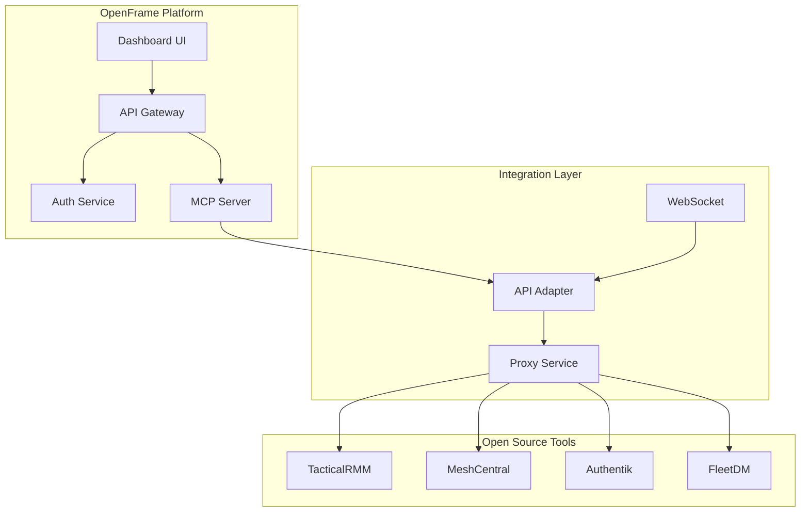

## API Gateway

### Request Flow
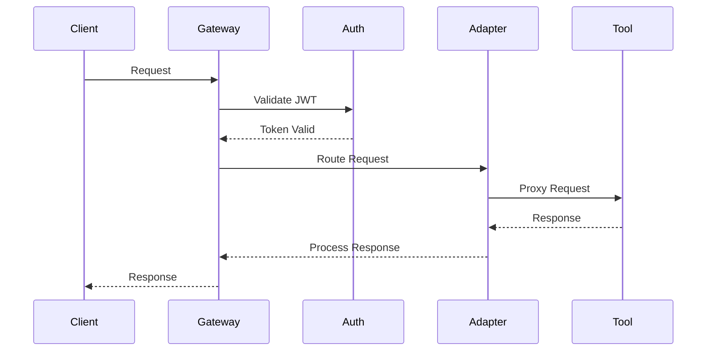

### WebSocket Support
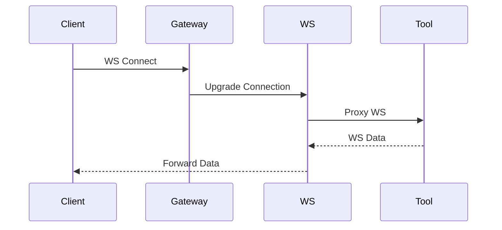

## Tool Integration

### TacticalRMM Integration
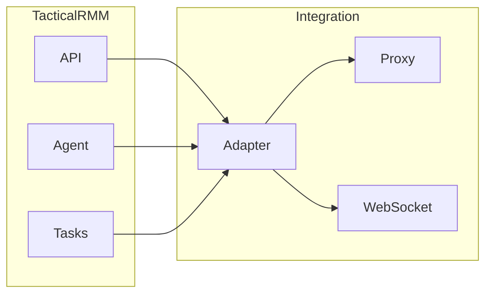

### MeshCentral Integration
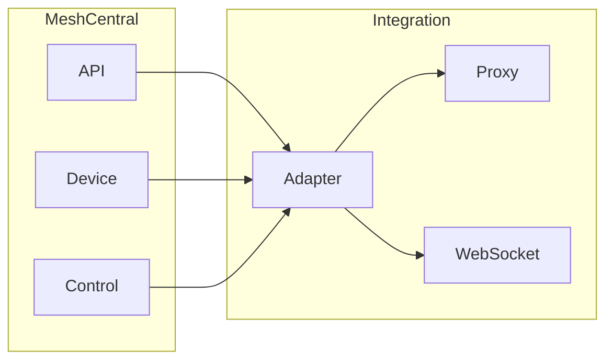

## Unified API Interface

### API Structure
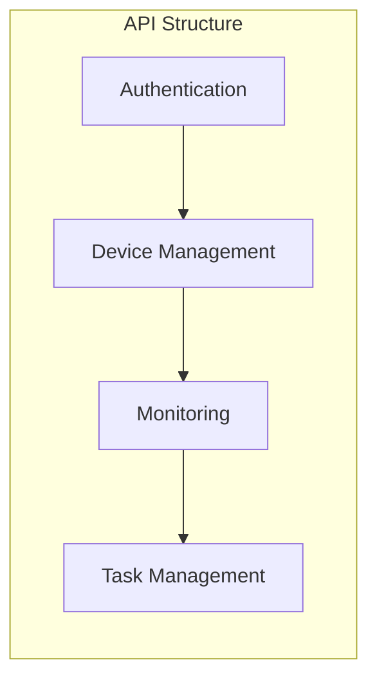

### Endpoint Convention
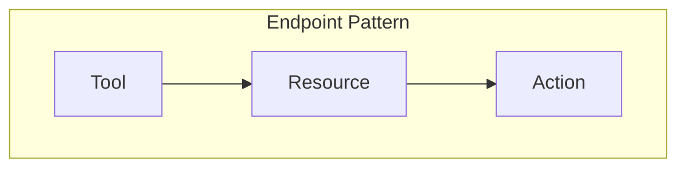

## Integration Features

### Authentication
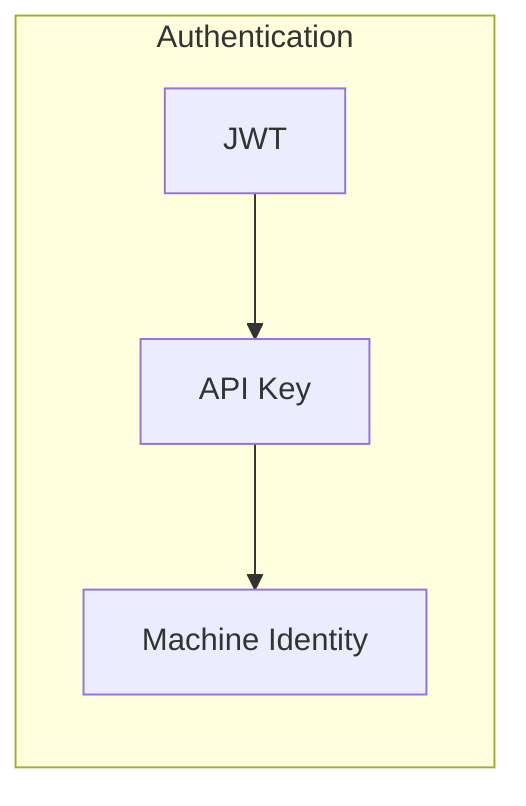

### Authorization
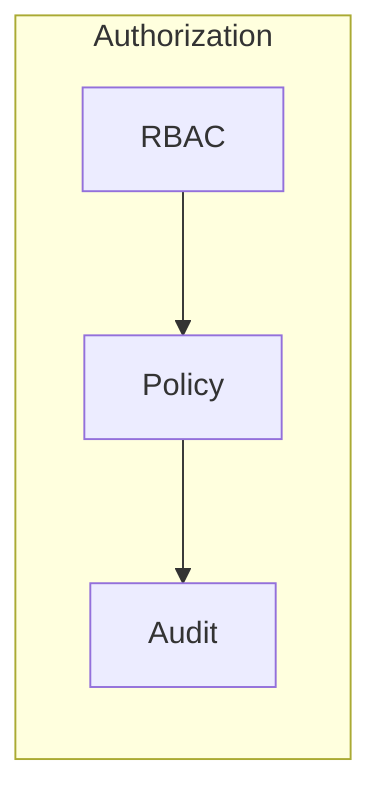

## API Security

### Security Flow
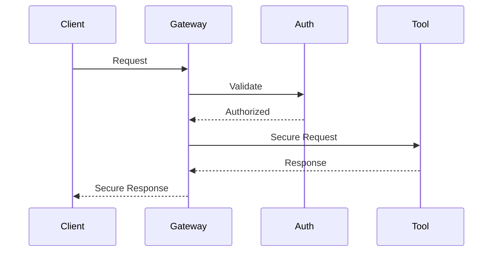

### Security Features
- JWT validation
- API key injection
- Request signing
- Response encryption

## Integration Patterns

### REST API Pattern
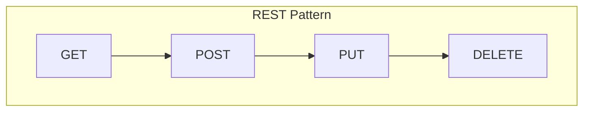

### WebSocket Pattern
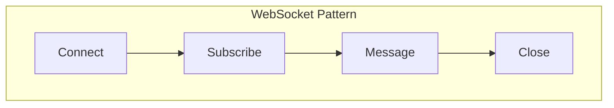

## Error Handling

### Error Flow
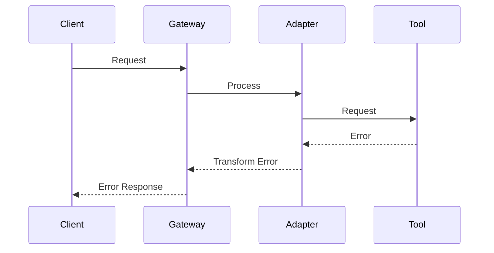

### Error Types
- Authentication errors
- Authorization errors
- Validation errors
- Service errors

## Monitoring

### API Monitoring
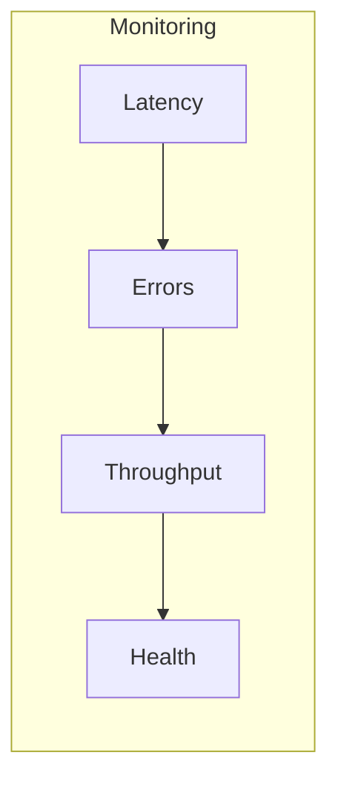

### Integration Monitoring
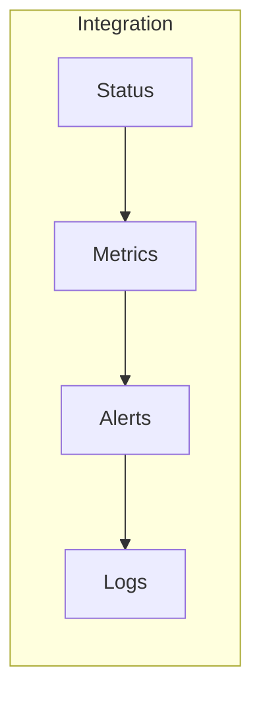

## Next Steps

- [Security Implementation](../security/)
- [Deployment Guide](../deployment/)
- [Development Guide](../development/)
- [Operations Guide](../operations/) 