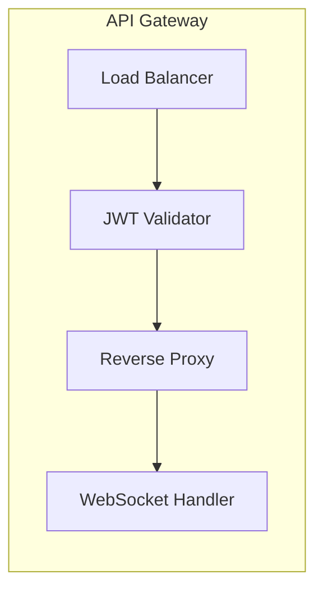
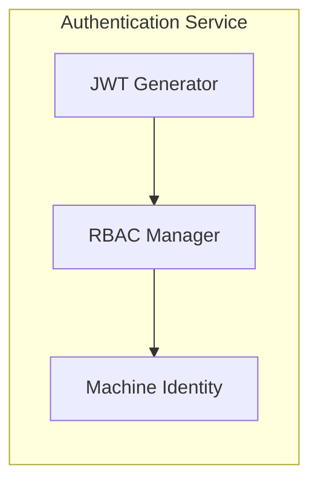
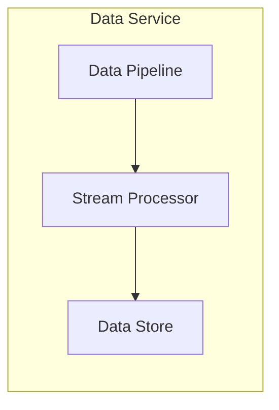
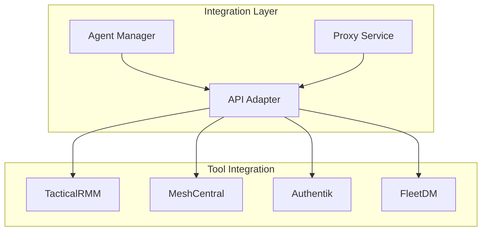
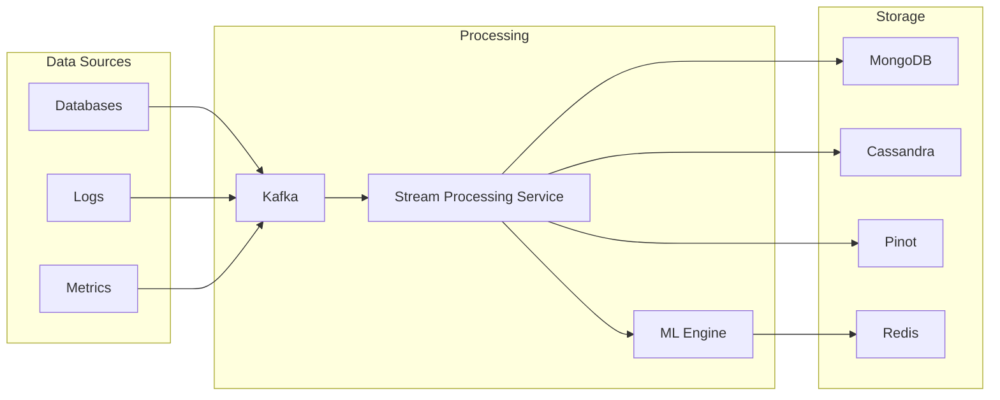
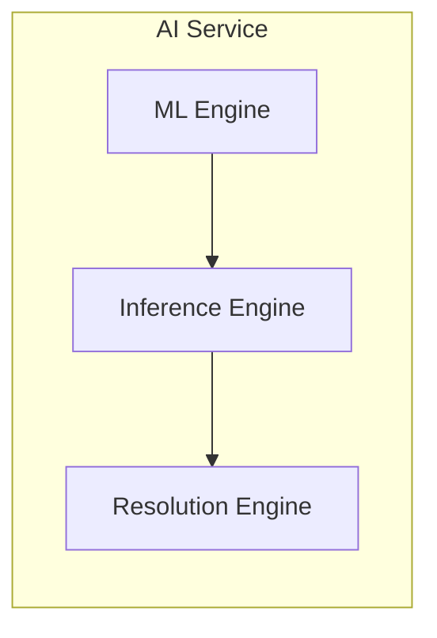
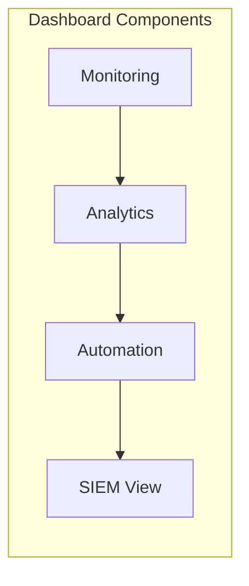
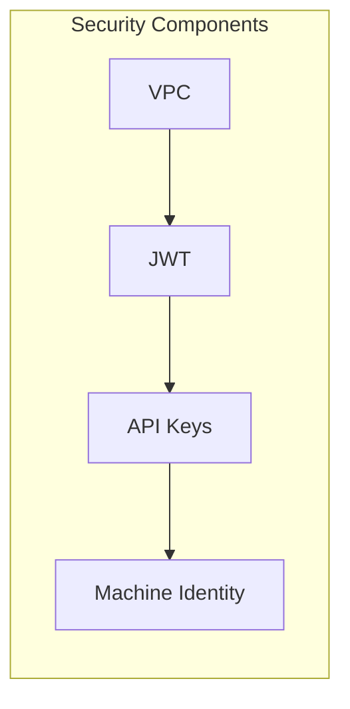
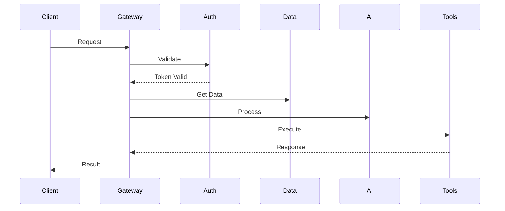

# OpenFrame Components

This document details the major components of the OpenFrame system and their interactions.

## Core Services

### API Gateway

The API Gateway is a reactive server that:
- Validates JWT tokens from OpenFrame API
- Manages reverse proxy to open-source tools
- Handles WebSocket connections
- Injects appropriate API keys for tool access
- Routes traffic based on service discovery

### Authentication Service

The Authentication Service:
- Generates and validates JWT tokens
- Manages role-based access control
- Handles machine identity tokens
- Integrates with Spring Security

### Data Service

The Data Service manages:
- Data pipeline orchestration
- Stream processing
- Data storage and retrieval
- Real-time analytics

## Integration Layer

### Open Source Tools Integration

Each tool integration provides:
- Standardized API interface
- Agent management
- Secure proxy access
- Data synchronization

## Data Processing

### Data Pipeline

The data pipeline:
- Collects data from various sources
- Processes and transforms data
- Applies machine learning models
- Stores data in appropriate databases

## AI and Analytics

### AI Service

The AI Service provides:
- Anomaly detection
- Issue inference
- Automated resolution
- Pattern recognition

## Dashboard and UI

### Unified Dashboard

The dashboard offers:
- Unified monitoring view
- Real-time analytics
- Automation controls
- SIEM-like interface
- NIST-compliant views

## Security Components

### Security Layer

Security features include:
- VPC isolation
- JWT authentication
- API key management
- Machine identity tokens
- Network security policies

## Component Interactions

## Next Steps

- [Security Implementation](../security/)
- [Data Pipeline Details](./data-pipeline/)
- [AI and Analytics](./ai-analytics/)
- [API Integration](./api-integration/)
- [Deployment Guide](../deployment/) 