# Architecture Overview

OpenFrame follows a modern, microservices-based architecture designed for scalability, maintainability, and extensibility. This guide provides developers with a comprehensive understanding of the system design, key components, and architectural patterns.

## High-Level System Architecture

### Service-Oriented Design

OpenFrame is built as a distributed system with clear separation of concerns:

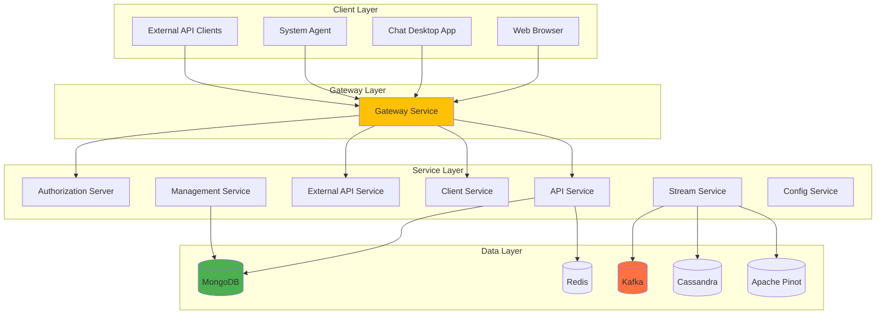

### Core Design Principles

| Principle | Implementation | Benefits |
|-----------|---------------|----------|
| **Microservices** | Each service has single responsibility | Independent scaling and deployment |
| **Event-Driven** | Kafka-based async communication | Loose coupling and resilience |
| **API-First** | GraphQL and REST APIs | Developer-friendly integration |
| **Cloud-Native** | Containerized with Kubernetes support | Portable and scalable deployment |
| **Security-First** | JWT, OAuth2, role-based access | Enterprise-grade security |

## Service Architecture Details

### Gateway Service (openframe-gateway)

**Purpose**: Entry point for all external traffic with routing, authentication, and proxying.

#### Key Responsibilities

- **Request Routing**: Intelligent routing based on paths and headers
- **Authentication**: JWT validation and API key verification
- **WebSocket Proxying**: Real-time communication support
- **Rate Limiting**: Protection against abuse
- **CORS Handling**: Cross-origin request management

#### Architecture Pattern

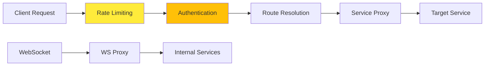

#### Configuration Example

```yaml
spring:
  cloud:
    gateway:
      routes:
        - id: api-route
          uri: http://localhost:8081
          predicates:
            - Path=/graphql/**,/api/**
        - id: auth-route
          uri: http://localhost:9000
          predicates:
            - Path=/oauth/**,/login/**
```

### API Service (openframe-api)

**Purpose**: Core business logic API using GraphQL for internal operations.

#### GraphQL Schema Design

```graphql
type Query {
    devices(filter: DeviceFilter, pagination: PaginationInput): DeviceConnection
    organizations(filter: OrgFilter): [Organization]
    logs(filter: LogFilter, pagination: PaginationInput): LogConnection
    users(pagination: PaginationInput): UserConnection
}

type Mutation {
    createOrganization(input: CreateOrgInput!): Organization
    updateDevice(id: ID!, input: UpdateDeviceInput!): Device
    inviteUser(input: InviteUserInput!): Invitation
}

type Subscription {
    deviceUpdates(organizationId: ID!): Device
    logEvents(filter: LogFilter): LogEvent
}
```

#### Data Fetcher Architecture

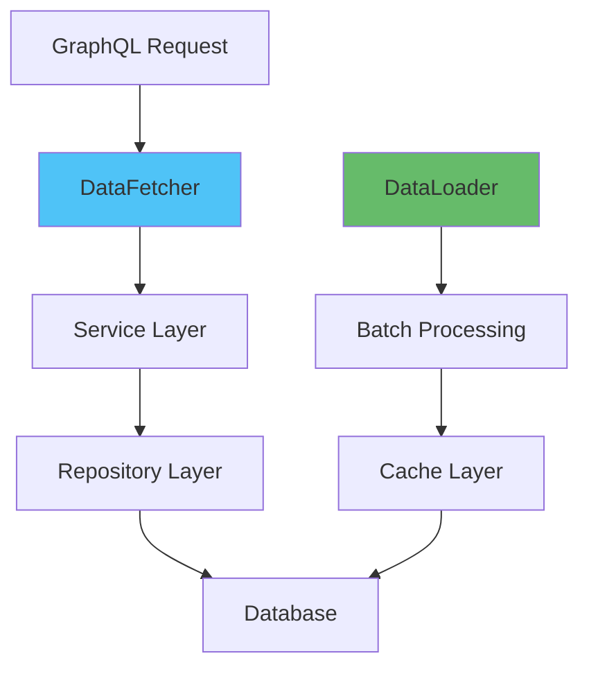

### Authorization Server (openframe-authorization-server)

**Purpose**: OAuth2/OpenID Connect server for authentication and authorization.

#### Security Architecture

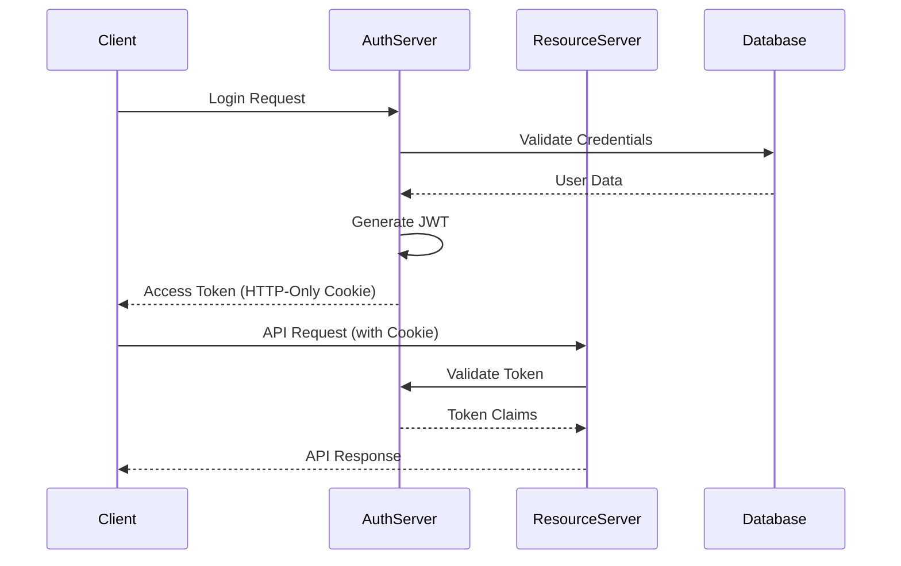

#### Multi-Tenant Support

```java
@Component
public class TenantAwareAuthenticationProvider {
    public Authentication authenticate(Authentication auth) {
        String tenantId = extractTenantId(auth);
        // Tenant-specific authentication logic
        return createAuthentication(auth, tenantId);
    }
}
```

### Stream Service (openframe-stream)

**Purpose**: Real-time data processing and event streaming using Apache Kafka.

#### Stream Processing Architecture

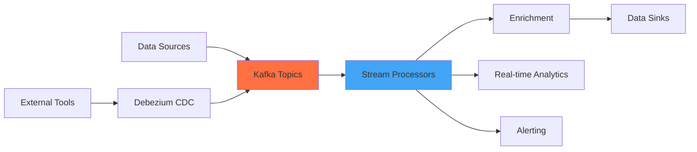

#### Event Processing Pipeline

```java
@KafkaListener(topics = "device-events")
public void processDeviceEvent(DeviceEvent event) {
    // Enrich event data
    EnrichedDeviceEvent enriched = enrichmentService.enrich(event);
    
    // Store in time-series database
    cassandraRepository.save(enriched);
    
    // Update real-time analytics
    pinotProducer.send("analytics-events", enriched);
    
    // Trigger alerts if needed
    alertService.evaluateAlerts(enriched);
}
```

## Data Architecture

### Database Strategy

OpenFrame uses a polyglot persistence approach, choosing the right database for each use case:

| Database | Use Case | Data Types | Access Pattern |
|----------|----------|------------|----------------|
| **MongoDB** | Primary application data | Documents, references | CRUD operations |
| **Redis** | Caching and sessions | Key-value pairs | High-frequency reads |
| **Cassandra** | Time-series data | Device metrics, logs | Write-heavy, time-based queries |
| **Apache Pinot** | Real-time analytics | Aggregated metrics | OLAP queries |

### Data Flow Architecture

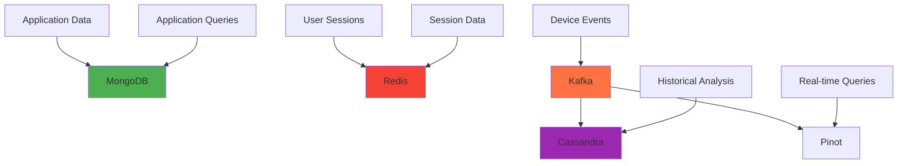

### Event Schema Design

```json
{
  "eventSchema": {
    "type": "object",
    "properties": {
      "eventId": {"type": "string"},
      "tenantId": {"type": "string"},
      "deviceId": {"type": "string"},
      "timestamp": {"type": "string", "format": "date-time"},
      "eventType": {"type": "string"},
      "severity": {"type": "string"},
      "data": {"type": "object"},
      "metadata": {"type": "object"}
    },
    "required": ["eventId", "tenantId", "timestamp", "eventType"]
  }
}
```

## Security Architecture

### Authentication Flow

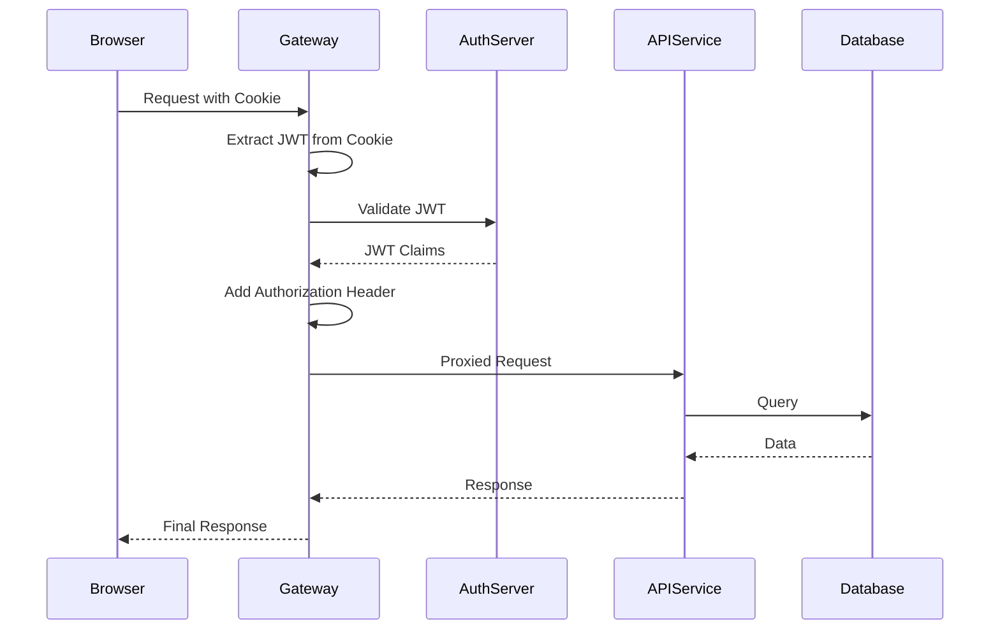

### Authorization Model

#### Role-Based Access Control (RBAC)

```java
public enum Role {
    ADMIN("admin", Set.of(Permission.ALL)),
    USER("user", Set.of(Permission.READ, Permission.WRITE_OWN)),
    VIEWER("viewer", Set.of(Permission.READ));
    
    private final String name;
    private final Set<Permission> permissions;
}

@PreAuthorize("hasRole('ADMIN') or @deviceService.isOwner(#deviceId, authentication.name)")
public Device updateDevice(String deviceId, UpdateDeviceInput input) {
    return deviceService.update(deviceId, input);
}
```

#### Multi-Tenant Isolation

```java
@Component
public class TenantContextFilter implements Filter {
    public void doFilter(ServletRequest request, ServletResponse response, 
                        FilterChain chain) {
        String tenantId = extractTenantId(request);
        TenantContext.setCurrentTenant(tenantId);
        try {
            chain.doFilter(request, response);
        } finally {
            TenantContext.clear();
        }
    }
}
```

## Frontend Architecture

### Vue.js Application Structure

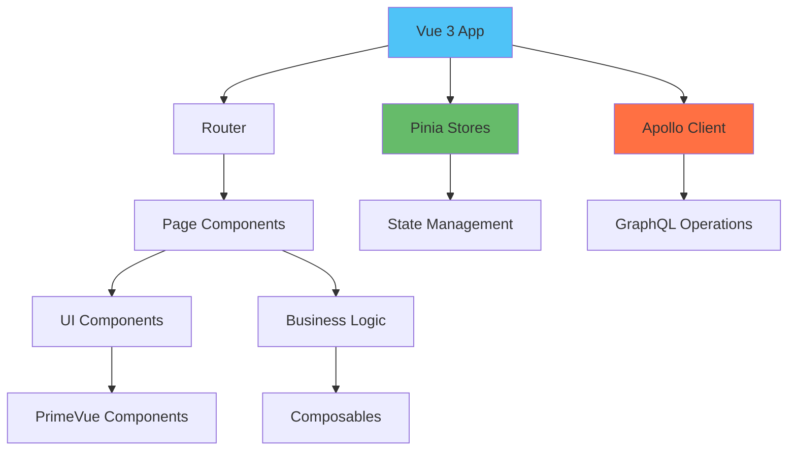

### Component Architecture

```typescript
// Page Component
export default defineComponent({
  setup() {
    const devicesStore = useDevicesStore();
    const { devices, loading, error } = storeToRefs(devicesStore);
    
    const { result, loading: queryLoading } = useQuery(DEVICES_QUERY, {
      filter: computed(() => devicesStore.currentFilter)
    });
    
    return {
      devices,
      loading: computed(() => loading.value || queryLoading.value),
      error
    };
  }
});
```

### State Management Pattern

```typescript
// Pinia Store
export const useDevicesStore = defineStore('devices', () => {
  const devices = ref<Device[]>([]);
  const currentFilter = ref<DeviceFilter>({});
  const loading = ref(false);
  
  const fetchDevices = async (filter: DeviceFilter) => {
    loading.value = true;
    try {
      const result = await apolloClient.query({
        query: DEVICES_QUERY,
        variables: { filter }
      });
      devices.value = result.data.devices.edges.map(edge => edge.node);
    } finally {
      loading.value = false;
    }
  };
  
  return {
    devices: readonly(devices),
    currentFilter: readonly(currentFilter),
    loading: readonly(loading),
    fetchDevices
  };
});
```

## Integration Architecture

### External Tool Integration

OpenFrame integrates with external MSP tools through a standardized adapter pattern:

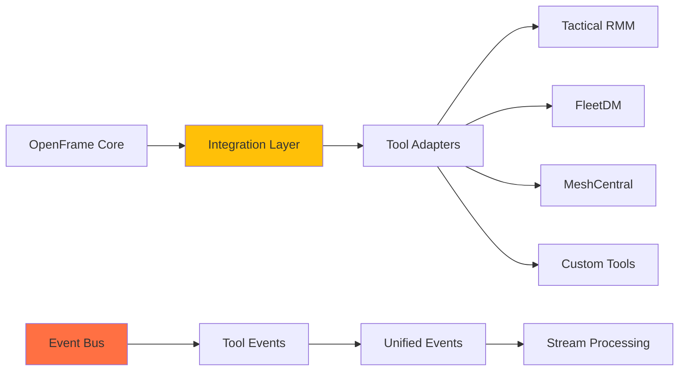

### Tool Adapter Interface

```java
public interface ToolAdapter {
    String getToolType();
    boolean isHealthy();
    
    CompletableFuture<List<Device>> getDevices();
    CompletableFuture<List<Event>> getEvents(EventFilter filter);
    CompletableFuture<CommandResult> executeCommand(Command command);
    
    void registerEventHandler(EventHandler handler);
}

@Component
public class TacticalRmmAdapter implements ToolAdapter {
    private final TacticalRmmClient client;
    
    @Override
    public CompletableFuture<List<Device>> getDevices() {
        return client.getAgents()
            .thenApply(this::convertToDevices);
    }
}
```

## Performance Architecture

### Caching Strategy

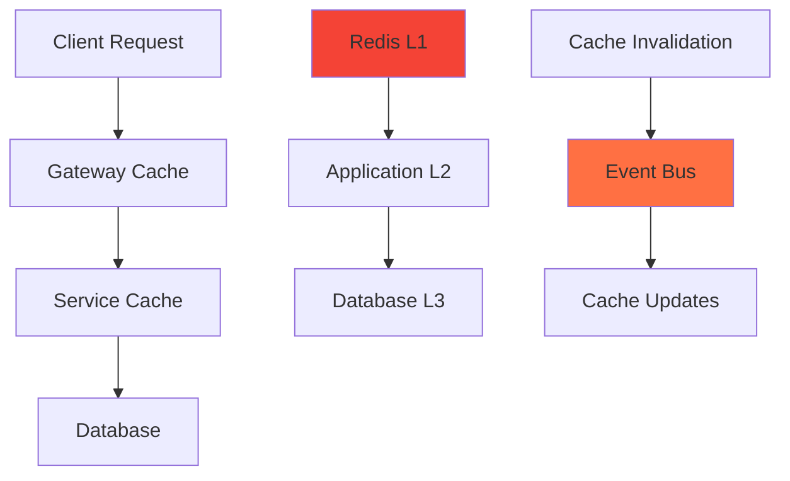

### Performance Optimization Patterns

#### Database Query Optimization

```java
@Repository
public class DeviceRepository {
    // Use indexes for common queries
    @Query("{ 'organizationId': ?0, 'status': ?1 }")
    @Index(def = "{ 'organizationId': 1, 'status': 1 }")
    List<Device> findByOrganizationAndStatus(String orgId, DeviceStatus status);
    
    // Paginated queries
    Page<Device> findByOrganizationId(String orgId, Pageable pageable);
}
```

#### GraphQL N+1 Problem Solution

```java
@Component
public class OrganizationDataLoader implements BatchLoader<String, Organization> {
    @Override
    public CompletableFuture<List<Organization>> load(List<String> orgIds) {
        return CompletableFuture.supplyAsync(() -> 
            organizationService.findByIds(orgIds)
        );
    }
}
```

## Monitoring and Observability

### Monitoring Architecture

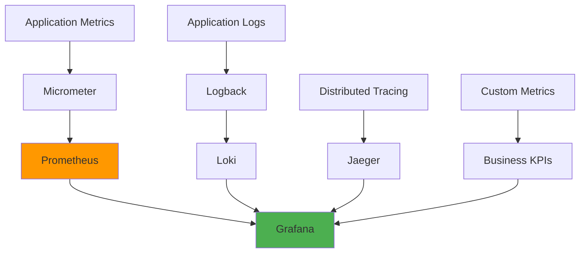

### Health Check Implementation

```java
@Component
public class CustomHealthIndicator implements HealthIndicator {
    @Override
    public Health health() {
        try {
            // Check external dependencies
            boolean databaseUp = checkDatabase();
            boolean kafkaUp = checkKafka();
            
            if (databaseUp && kafkaUp) {
                return Health.up()
                    .withDetail("database", "OK")
                    .withDetail("kafka", "OK")
                    .build();
            } else {
                return Health.down()
                    .withDetail("database", databaseUp ? "OK" : "DOWN")
                    .withDetail("kafka", kafkaUp ? "OK" : "DOWN")
                    .build();
            }
        } catch (Exception e) {
            return Health.down(e).build();
        }
    }
}
```

## Key Design Decisions

### Technology Choices

| Decision | Rationale | Trade-offs |
|----------|-----------|------------|
| **Spring Boot** | Mature ecosystem, enterprise features | Java verbosity vs rapid development |
| **GraphQL** | Flexible queries, strong typing | Learning curve vs REST familiarity |
| **Vue.js** | Progressive framework, great DX | Smaller ecosystem vs React |
| **Kafka** | High throughput, durability | Complexity vs simple messaging |
| **MongoDB** | Document model fits domain | Eventual consistency vs ACID |

### Architectural Patterns

#### Event Sourcing for Audit Trail

```java
@Entity
public class DeviceEvent {
    private String eventId;
    private String deviceId;
    private String eventType;
    private LocalDateTime timestamp;
    private String userId;
    private Map<String, Object> eventData;
    private Map<String, Object> previousState;
    
    // Event sourcing allows complete audit trail
}
```

#### CQRS for Read/Write Separation

```java
// Command side - write operations
@Component
public class DeviceCommandService {
    public void updateDevice(UpdateDeviceCommand command) {
        // Validate and execute command
        // Publish event for read side
    }
}

// Query side - optimized for reads
@Component  
public class DeviceQueryService {
    public DeviceProjection getDevice(String id) {
        // Return optimized read model
    }
}
```

## Next Steps for Developers

### Understanding the Codebase

1. **Start with Gateway**: Understand request routing and security
2. **Explore API Service**: Learn GraphQL schema and resolvers
3. **Study Data Layer**: Understand repository patterns and data modeling
4. **Review Frontend**: Learn Vue.js components and state management

### Contributing Guidelines

After understanding the architecture:

1. **[Testing Overview](../testing/overview.md)** - Learn testing patterns and requirements
2. **[Contributing Guidelines](../contributing/guidelines.md)** - Follow code standards and PR process

### Architecture Deep Dives

For specific components, refer to the detailed architecture documentation in the reference section of the repository.

---

**Architecture Overview Complete!** You now understand OpenFrame's system design and can contribute effectively to any component.