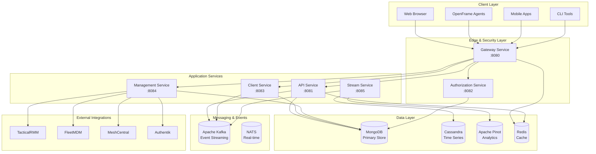
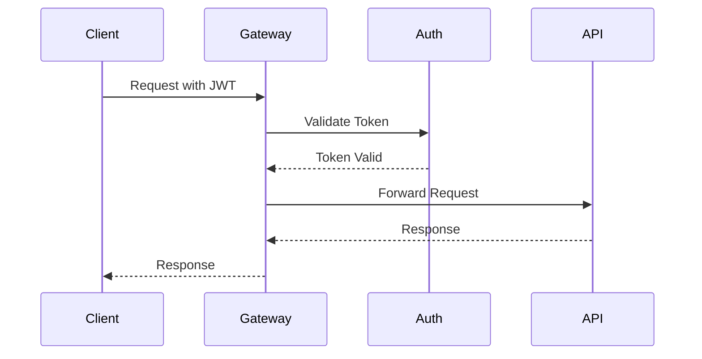
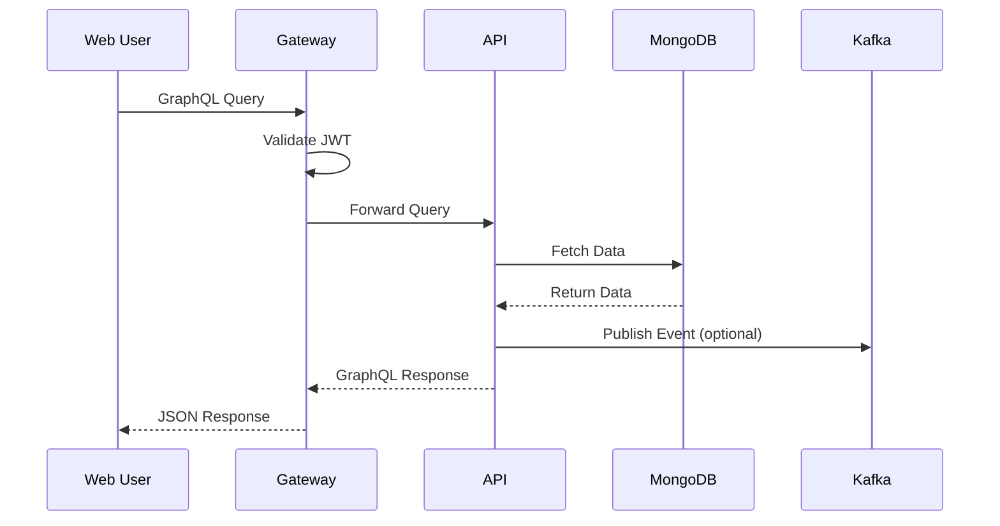
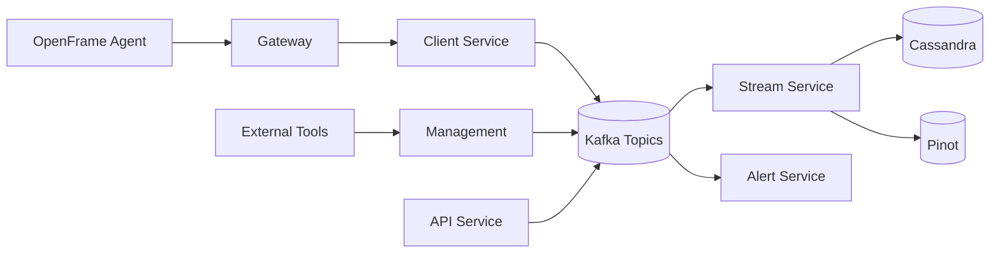
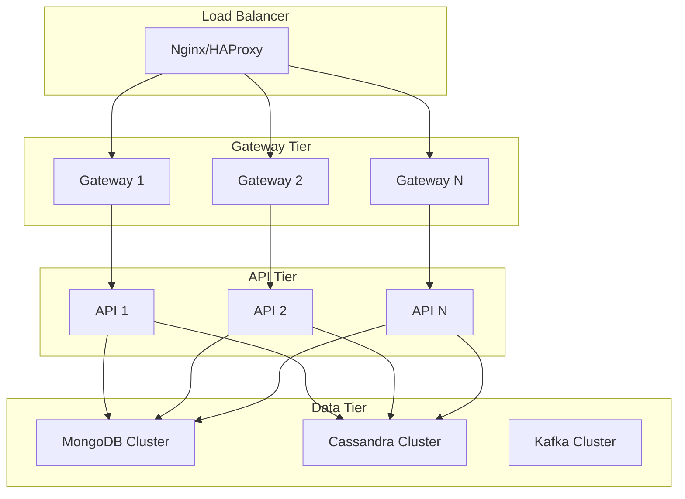
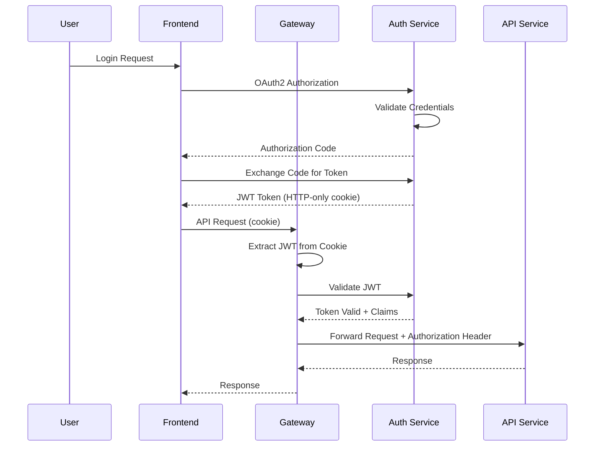
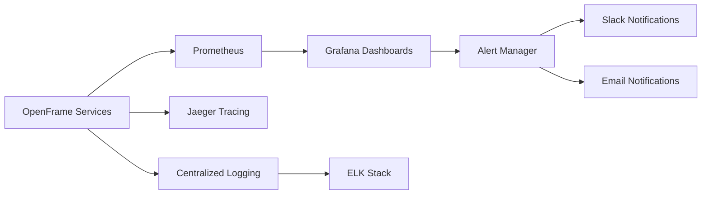

# Architecture Overview

This guide provides a comprehensive overview of OpenFrame's architecture, including high-level design principles, service relationships, data flow, and key architectural decisions.

## High-Level System Architecture

OpenFrame follows a **microservices architecture** with clear separation of concerns, strong security boundaries, and event-driven communication patterns.

### System Overview Diagram



## Core Components

### 1. Gateway Service (Edge Layer)

**Purpose**: Single entry point for all external traffic with authentication, routing, and security.

**Key Responsibilities**:
- **JWT Authentication**: Validates tokens from Authorization Service
- **API Gateway**: Routes requests to appropriate backend services
- **WebSocket Proxy**: Handles real-time connections for file management and remote access
- **Rate Limiting**: Prevents abuse and ensures fair usage
- **CORS Handling**: Manages cross-origin requests securely

**Technology Stack**:
- Spring Cloud Gateway
- Spring Security OAuth2 Resource Server
- Redis (for session storage and rate limiting)



### 2. Authorization Service (Security Layer)

**Purpose**: Multi-tenant OAuth2/OIDC authorization server handling authentication and tenant management.

**Key Responsibilities**:
- **OAuth2/OIDC Server**: Issues JWT tokens for authenticated users
- **Tenant Management**: Handles multi-tenant isolation and domain routing
- **SSO Integration**: Supports Google, Microsoft, and custom identity providers
- **User Registration**: Manages user invitations and account creation
- **Key Management**: Per-tenant JWT signing keys for security isolation

**Technology Stack**:
- Spring Authorization Server
- Spring Security
- MongoDB (user and tenant data)
- RSA key pairs (per-tenant)

### 3. API Service (Business Logic)

**Purpose**: Primary business API layer providing GraphQL and REST endpoints for application functionality.

**Key Responsibilities**:
- **GraphQL API**: Unified data access with efficient querying and mutations
- **REST Controllers**: RESTful endpoints for external integrations
- **Data Fetchers**: Optimized data loading with DataLoader patterns
- **Business Services**: Core business logic for organizations, devices, users
- **Event Publishing**: Publishes domain events to Kafka for processing

**Technology Stack**:
- Spring Boot with Netflix DGS (GraphQL)
- Spring Data MongoDB
- Apache Kafka (event publishing)
- DataLoader (N+1 query prevention)

### 4. Client Service (Agent Management)

**Purpose**: Manages OpenFrame agents, device registration, and telemetry collection.

**Key Responsibilities**:
- **Agent Registration**: Secure device/agent onboarding with registration secrets
- **Authentication**: Issues JWT tokens for authenticated agents
- **Telemetry Ingestion**: Collects and processes device metrics and logs
- **Tool Agent Management**: Manages lifecycle of integrated tool agents
- **Command Execution**: Handles remote command execution requests

**Technology Stack**:
- Spring Boot
- NATS (real-time messaging)
- MongoDB (agent and device data)
- JWT authentication for agents

### 5. Stream Service (Event Processing)

**Purpose**: Real-time event processing, normalization, and enrichment for analytics and monitoring.

**Key Responsibilities**:
- **Event Ingestion**: Consumes events from Kafka topics
- **Data Normalization**: Transforms tool-specific events to unified format
- **Enrichment**: Adds context like tenant information and device metadata
- **Time-Series Storage**: Persists to Cassandra and Pinot for analytics
- **Real-time Processing**: Low-latency event processing and alerting

**Technology Stack**:
- Spring Cloud Stream
- Apache Kafka Streams
- Apache Cassandra (time-series data)
- Apache Pinot (analytics)

### 6. Management Service (Control Plane)

**Purpose**: Administrative service handling platform management, monitoring, and orchestration.

**Key Responsibilities**:
- **Service Orchestration**: Initializes and manages other services
- **Scheduled Tasks**: Runs maintenance, cleanup, and monitoring jobs
- **Tool Integration**: Manages connections to external MSP tools
- **Release Management**: Handles software updates and version management
- **Health Monitoring**: Tracks system health and performance metrics

**Technology Stack**:
- Spring Boot
- Spring Scheduler
- ShedLock (distributed locking)
- External tool SDKs

## Data Flow Architecture

### Request/Response Flow



### Event-Driven Data Flow



### Data Storage Strategy

| Data Type | Storage | Reason |
|-----------|---------|---------|
| **User Data** | MongoDB | Document structure, ACID transactions |
| **Organizations** | MongoDB | Complex nested data, frequent queries |
| **Devices** | MongoDB | Real-time updates, complex queries |
| **Events/Logs** | Cassandra | High write throughput, time-series data |
| **Analytics** | Apache Pinot | Fast OLAP queries, real-time analytics |
| **Cache** | Redis | Session storage, rate limiting, performance |
| **Messages** | Kafka | Event streaming, service decoupling |
| **Real-time** | NATS | Low-latency messaging, agent communication |

## Key Design Decisions

### 1. Multi-Tenant Architecture

**Decision**: Tenant-per-database vs shared database with tenant isolation

**Chosen Approach**: Shared database with tenant-scoped data access

**Rationale**:
- Cost-effective for SaaS deployment
- Simplified operations and maintenance
- Strong tenant isolation through application-level security
- Supports both self-hosted and SaaS deployments

**Implementation**:
```java
// Every database entity includes tenant context
@Document("organizations")
public class Organization {
    private ObjectId id;
    private String tenantId;  // Tenant isolation
    private String name;
    // ...
}

// Repository queries automatically include tenant filter
public interface OrganizationRepository extends MongoRepository<Organization, ObjectId> {
    List<Organization> findByTenantId(String tenantId);
}
```

### 2. Event-Driven Architecture

**Decision**: Synchronous vs asynchronous service communication

**Chosen Approach**: Hybrid - synchronous for queries, asynchronous for commands

**Rationale**:
- Real-time queries require immediate responses
- Command operations benefit from eventual consistency
- Event sourcing enables audit trails and data replay
- Loose coupling between services

**Implementation**:
```java
// Synchronous query
@QueryMapping
public Organization organization(@Argument String id) {
    return organizationService.findById(id);
}

// Asynchronous command with event publishing
@MutationMapping  
public Organization createOrganization(@Argument CreateOrganizationInput input) {
    Organization org = organizationService.create(input);
    eventPublisher.publish(new OrganizationCreatedEvent(org));
    return org;
}
```

### 3. Security Model

**Decision**: Centralized vs distributed authentication

**Chosen Approach**: Centralized authentication with distributed authorization

**Rationale**:
- Single sign-on across all services
- Consistent security policies
- Simplified token management
- Strong audit capabilities

**Implementation**:
```java
// JWT token contains all necessary authorization info
{
  "sub": "user-123",
  "tenantId": "tenant-456", 
  "roles": ["ADMIN"],
  "organizations": ["org-789"],
  "exp": 1234567890
}

// Services validate and extract authorization context
@Component
public class SecurityContextService {
    public AuthContext getCurrentContext() {
        JWT jwt = getJWTFromRequest();
        return AuthContext.builder()
            .userId(jwt.getClaim("sub"))
            .tenantId(jwt.getClaim("tenantId"))
            .roles(jwt.getClaim("roles"))
            .organizations(jwt.getClaim("organizations"))
            .build();
    }
}
```

### 4. API Design

**Decision**: REST vs GraphQL vs gRPC

**Chosen Approach**: GraphQL for client APIs, REST for integrations, gRPC for internal communication

**Rationale**:
- GraphQL provides flexible, efficient data fetching for UIs
- REST offers simple integration for external tools
- gRPC enables high-performance internal service communication
- Consistent API patterns across the platform

**Implementation**:
```java
// GraphQL for complex queries with relationships
@QueryMapping
public Connection<Device> devices(@Argument DeviceFilter filter, 
                                  @Argument CursorPaginationInput pagination) {
    return deviceService.findDevices(filter, pagination);
}

// REST for simple external integrations
@RestController
@RequestMapping("/api/v1/devices")
public class DeviceController {
    @GetMapping
    public PageResponse<DeviceDto> getDevices(@RequestParam Map<String, String> params) {
        return deviceService.findDevicesForExternalAPI(params);
    }
}
```

### 5. Data Consistency Model

**Decision**: Strong consistency vs eventual consistency

**Chosen Approach**: Strong consistency for critical data, eventual consistency for analytics

**Rationale**:
- User data and business transactions require ACID properties
- Analytics and reporting can tolerate eventual consistency
- Performance optimization for read-heavy workloads
- Simplified development model for business logic

**Implementation**:
```java
// Strong consistency for business operations
@Transactional
public Organization updateOrganization(String id, UpdateOrganizationInput input) {
    Organization org = organizationRepository.findById(id)
        .orElseThrow(() -> new OrganizationNotFoundException(id));
    
    org.update(input);
    Organization saved = organizationRepository.save(org);
    
    // Event for eventual consistency
    eventPublisher.publish(new OrganizationUpdatedEvent(saved));
    return saved;
}

// Eventual consistency for analytics
@EventHandler
public void handleOrganizationUpdated(OrganizationUpdatedEvent event) {
    // Update analytics store asynchronously
    analyticsService.updateOrganizationMetrics(event.getOrganization());
}
```

## Performance and Scalability

### Horizontal Scaling Strategy



### Caching Strategy

| Layer | Technology | Purpose | TTL |
|-------|------------|---------|-----|
| **API Gateway** | Redis | Rate limiting, session storage | 1 hour |
| **Application** | Caffeine | In-memory caching of hot data | 15 minutes |
| **Database** | MongoDB | Query result caching | 5 minutes |
| **CDN** | CloudFlare | Static asset delivery | 24 hours |

### Database Optimization

#### MongoDB Indexing Strategy

```javascript
// Core business indexes
db.organizations.createIndex({"tenantId": 1, "name": 1})
db.devices.createIndex({"organizationId": 1, "status": 1})
db.users.createIndex({"email": 1}, {"unique": true})

// Time-based queries
db.events.createIndex({"timestamp": -1, "organizationId": 1})
db.logs.createIndex({"createdAt": -1, "level": 1, "organizationId": 1})

// Full-text search
db.devices.createIndex({"hostname": "text", "description": "text"})
```

#### Cassandra Schema Design

```sql
-- Time-series data optimized for time-range queries
CREATE TABLE device_metrics (
    device_id UUID,
    metric_type TEXT,
    timestamp TIMESTAMP,
    value DOUBLE,
    tenant_id UUID,
    PRIMARY KEY ((device_id, metric_type), timestamp)
) WITH CLUSTERING ORDER BY (timestamp DESC);

-- Event log optimized for recent events
CREATE TABLE event_log (
    organization_id UUID,
    event_date DATE,
    timestamp TIMESTAMP,
    event_id UUID,
    event_type TEXT,
    data TEXT,
    PRIMARY KEY ((organization_id, event_date), timestamp)
) WITH CLUSTERING ORDER BY (timestamp DESC);
```

## Security Architecture

### Authentication Flow



### Authorization Model

OpenFrame uses a **Role-Based Access Control (RBAC)** model with organization-scoped permissions:

```yaml
Roles:
  - SUPER_ADMIN:     # Platform administrator
      permissions: ["*"]
      scope: "global"
  
  - TENANT_ADMIN:    # Tenant administrator
      permissions: ["manage_users", "manage_organizations", "view_analytics"]
      scope: "tenant"
  
  - ORG_ADMIN:       # Organization administrator
      permissions: ["manage_devices", "manage_users", "view_logs"]
      scope: "organization"
  
  - TECHNICIAN:      # Technical user
      permissions: ["view_devices", "execute_scripts", "view_logs"]
      scope: "organization"
  
  - READ_ONLY:       # View-only access
      permissions: ["view_devices", "view_logs"]
      scope: "organization"
```

### Data Encryption

- **Data in Transit**: TLS 1.3 for all external communication
- **Data at Rest**: AES-256 encryption for sensitive fields
- **Database**: MongoDB encryption at rest with LUKS
- **Messaging**: Kafka SSL/SASL encryption
- **Secrets**: HashiCorp Vault integration for production

## Monitoring and Observability

### Metrics Collection



### Key Performance Indicators

| Metric | Target | Alerting Threshold |
|--------|--------|--------------------|
| **API Response Time** | < 200ms (p95) | > 500ms |
| **Database Query Time** | < 50ms (p95) | > 200ms |
| **Event Processing Lag** | < 1 second | > 10 seconds |
| **System CPU** | < 70% | > 90% |
| **Memory Usage** | < 80% | > 95% |
| **Error Rate** | < 0.1% | > 1% |

## Next Steps

Now that you understand OpenFrame's architecture:

1. **Review the [Testing Overview](../testing/overview.md)** to understand testing strategies
2. **Check the [Contributing Guidelines](../contributing/guidelines.md)** for development workflow
3. **Explore specific service documentation** in the reference section
4. **Set up your development environment** and start building

---

**Architecture overview complete!** You now understand how OpenFrame's components work together to provide a scalable, secure, and maintainable MSP platform.