# System Architecture Overview

This guide provides a comprehensive view of OpenFrame's architecture, focusing on the key design decisions, component relationships, and data flow patterns that developers need to understand.

## High-Level Architecture

OpenFrame follows a distributed microservices architecture with event-driven communication and multi-tenant security isolation:

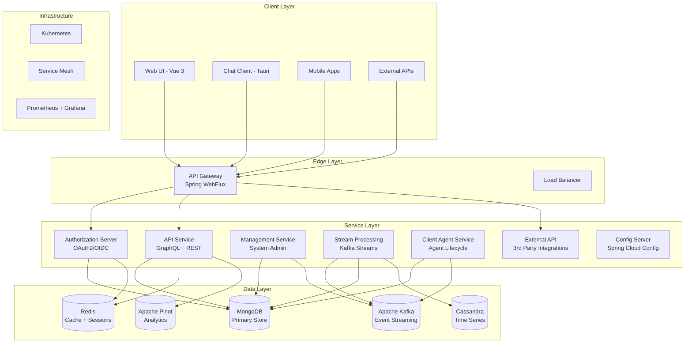

## Core Components

### 1. API Gateway (Spring WebFlux)

**Purpose**: Single entry point for all client requests with routing, security, and cross-cutting concerns.

**Key Responsibilities**:
- **JWT Authentication** - Multi-tenant token validation
- **API Key Management** - Rate limiting and access control  
- **Request Routing** - Intelligent routing to backend services
- **CORS Management** - Cross-origin request handling
- **WebSocket Proxying** - Real-time connection management

**Technology Stack**:
- Spring WebFlux (Reactive)
- Spring Security
- Spring Cloud Gateway
- Redis (for rate limiting)

**Data Flow**:
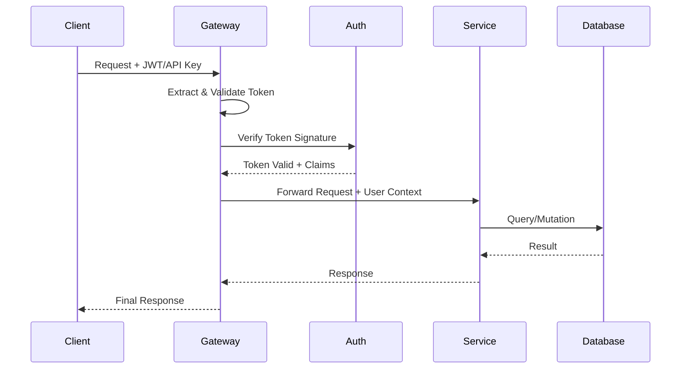

### 2. API Service (GraphQL + REST)

**Purpose**: Main business logic service providing unified data access via GraphQL and REST endpoints.

**Key Responsibilities**:
- **GraphQL Schema** - Type-safe API with introspection
- **REST Endpoints** - RESTful APIs for external integrations
- **Business Logic** - Core MSP operations and workflows
- **Data Orchestration** - Coordinate queries across data sources
- **Real-time Subscriptions** - WebSocket-based live updates

**Architecture Pattern**:
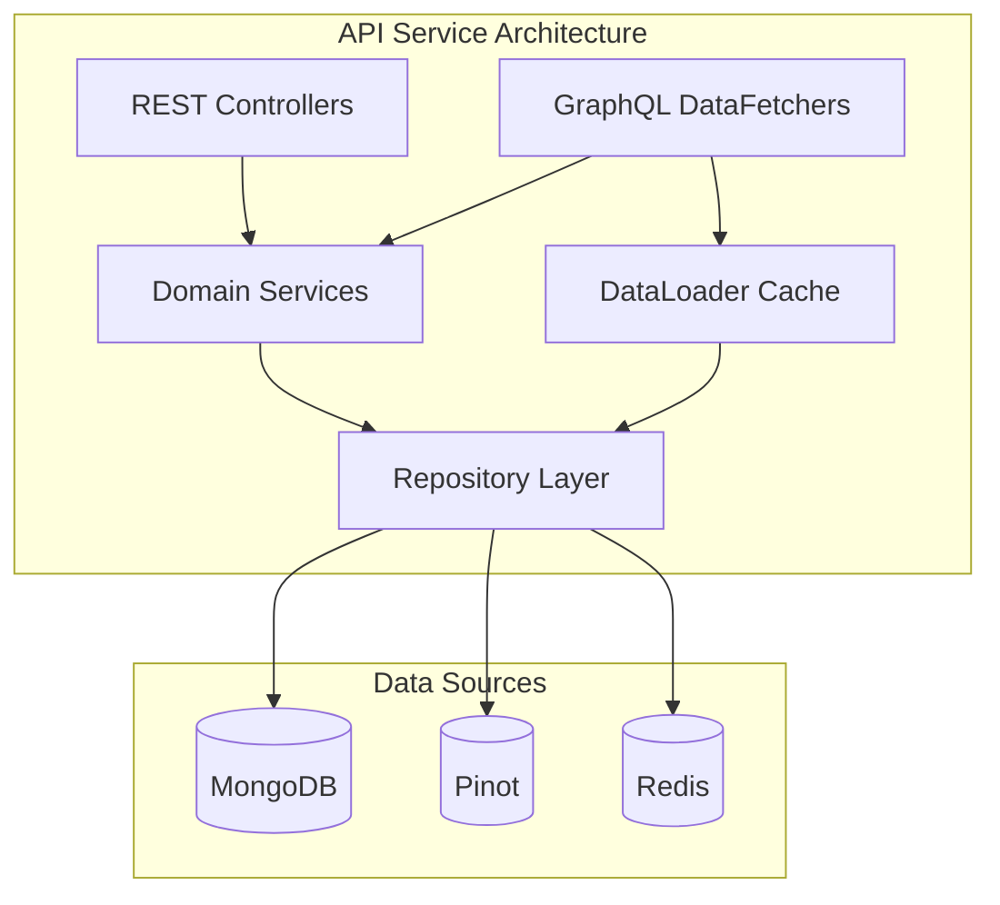

**GraphQL Schema Design**:
```graphql
# Core entity types
type Organization {
  id: ID!
  name: String!
  domain: String!
  devices(filter: DeviceFilter): DeviceConnection
  users(filter: UserFilter): UserConnection
}

type Device {
  id: ID!
  name: String!
  status: DeviceStatus!
  organization: Organization!
  installedAgents: [InstalledAgent!]!
  lastHeartbeat: DateTime
}

# Connection-based pagination
type DeviceConnection {
  edges: [DeviceEdge!]!
  pageInfo: PageInfo!
  totalCount: Int!
}

# Subscription for real-time updates
type Subscription {
  deviceStatusUpdated(organizationId: ID!): Device!
  newLogEntry(filter: LogFilter): LogEvent!
}
```

### 3. Authorization Server (OAuth2/OIDC)

**Purpose**: Multi-tenant identity provider with per-tenant signing keys and comprehensive OAuth2 flows.

**Key Responsibilities**:
- **Multi-Tenant Security** - Isolated signing keys per tenant
- **OAuth2 Flows** - Authorization code, client credentials, refresh token
- **SSO Integration** - Google, Microsoft, and custom OIDC providers  
- **User Registration** - Invitation-based onboarding
- **Token Management** - JWT issuance and validation

**Security Architecture**:
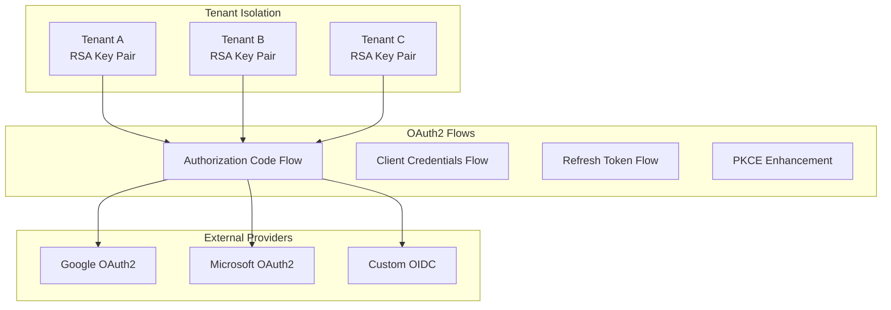

**JWT Token Structure**:
```json
{
  "header": {
    "alg": "RS256",
    "typ": "JWT",
    "kid": "tenant-a-key-id"
  },
  "payload": {
    "iss": "https://auth.openframe.ai/tenant-a",
    "sub": "user-12345",
    "aud": ["openframe-api", "openframe-external-api"],
    "exp": 1640995200,
    "iat": 1640908800,
    "tenant": "tenant-a",
    "org": "org-67890",
    "roles": ["USER", "DEVICE_MANAGER"],
    "permissions": ["device:read", "device:write"]
  }
}
```

### 4. Stream Processing Service (Kafka Streams)

**Purpose**: Real-time event processing and data enrichment using Kafka Streams topology.

**Key Responsibilities**:
- **CDC Processing** - Debezium change data capture transformation
- **Event Enrichment** - Add organization and device context
- **Stream Joins** - Correlate events across multiple data sources
- **Analytics Pipeline** - Feed enriched data to Pinot for real-time analytics

**Processing Topology**:
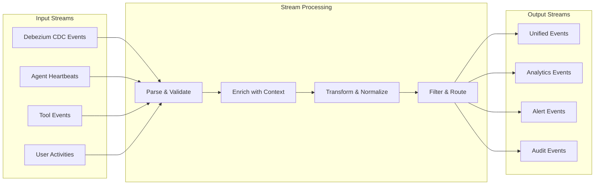

**Stream Processing Logic**:
```java
@Component
public class EventEnrichmentTopology {
    
    @Autowired
    public void buildTopology(StreamsBuilder builder) {
        // Input stream from Debezium
        KStream<String, DebeziumEvent> sourceEvents = builder
            .stream("debezium.openframe.events");
            
        // Enrich with organization context
        KTable<String, Organization> organizations = builder
            .table("openframe.organizations");
            
        // Join and enrich
        KStream<String, EnrichedEvent> enrichedEvents = sourceEvents
            .selectKey((key, event) -> event.getOrganizationId())
            .join(organizations, this::enrichWithOrganization)
            .mapValues(this::transformToUnifiedFormat)
            .filter((key, event) -> isValidEvent(event));
            
        // Output to multiple topics
        enrichedEvents.to("openframe.unified-events");
        enrichedEvents
            .filter((key, event) -> event.isAnalyticsEvent())
            .to("openframe.analytics-events");
    }
}
```

### 5. Management Service (System Administration)

**Purpose**: Operational control plane for system administration and maintenance tasks.

**Key Responsibilities**:
- **Service Initialization** - Bootstrap services and configurations
- **Schema Management** - Database and Pinot schema deployment
- **Connector Management** - Debezium and external tool connectors
- **Scheduled Tasks** - Maintenance operations with distributed locking
- **Health Monitoring** - System health checks and alerting

**Scheduled Operations**:
```mermaid
gantt
    title Management Service Scheduled Tasks
    dateFormat HH:mm
    axisFormat %H:%M
    
    section Daily Tasks
    Schema Sync          :done, daily1, 02:00, 2h
    Connector Health     :done, daily2, 04:00, 1h
    Data Cleanup         :active, daily3, 06:00, 2h
    
    section Hourly Tasks
    Health Checks        :hourly1, 00:00, 15m
    Metrics Collection   :hourly2, 00:15, 15m
    Alert Processing     :hourly3, 00:30, 15m
    
    section Real-time
    Event Monitoring     :crit, realtime, 00:00, 24h
```

## Data Architecture

### Data Storage Strategy

OpenFrame uses a polyglot persistence approach optimized for different data patterns:

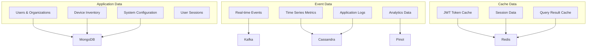

### Data Flow Patterns

**Write Pattern (Event-Driven)**:
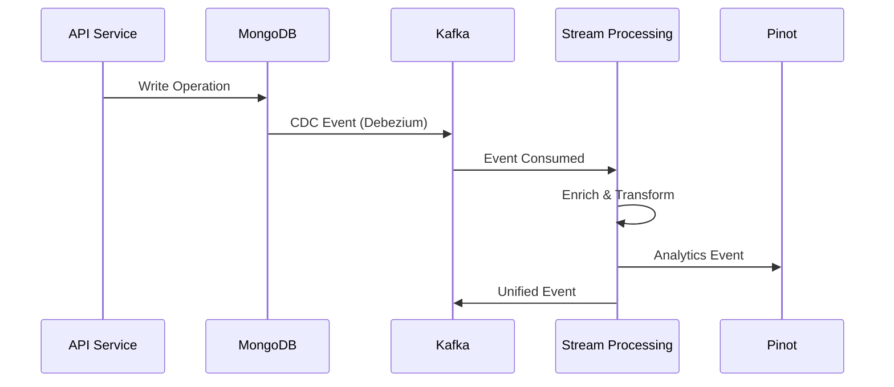

**Read Pattern (CQRS)**:
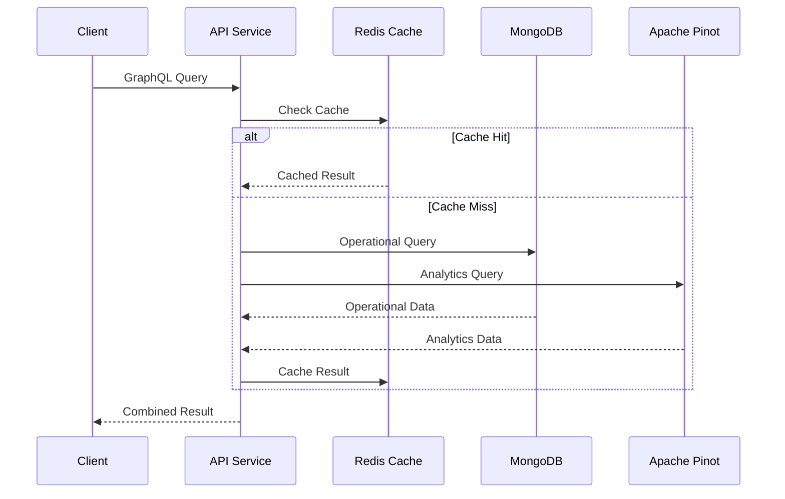

## Security Architecture

### Multi-Tenant Security Model

OpenFrame implements tenant isolation at multiple layers:

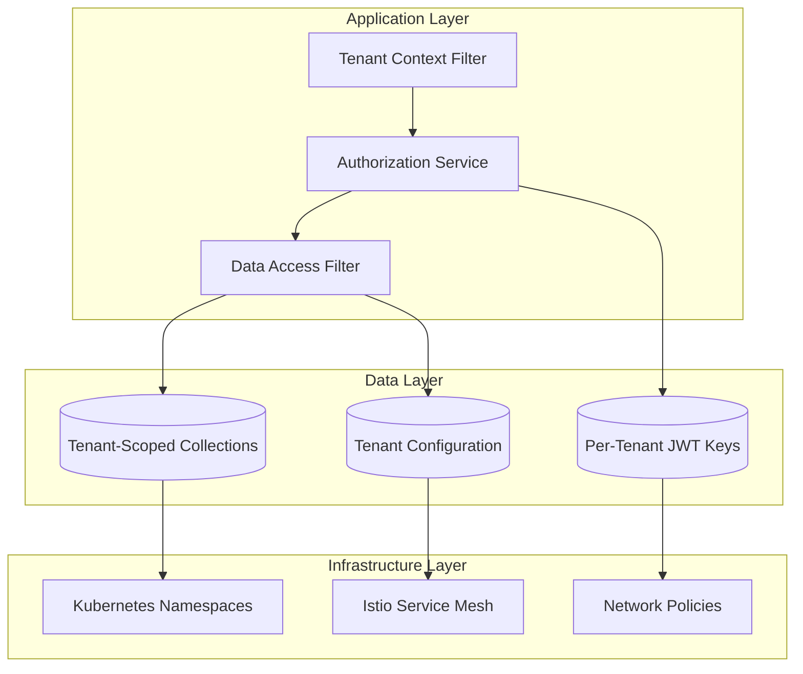

### Authentication Flow

**JWT-Based Authentication with Tenant Isolation**:
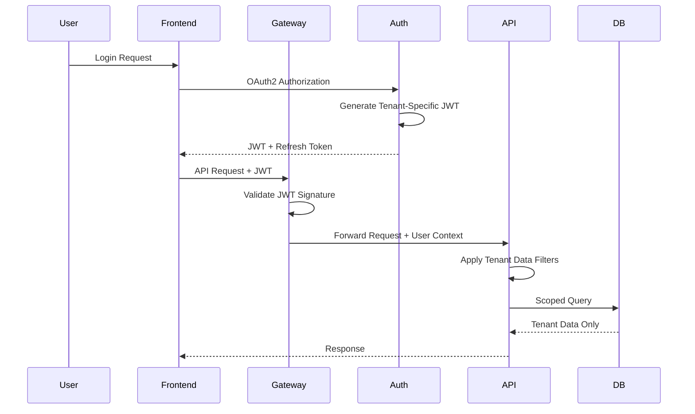

## Key Design Decisions

### 1. Microservices vs Monolith

**Decision**: Microservices architecture
**Rationale**: 
- Independent scaling of different components
- Technology diversity (Java backend, Vue frontend, Rust client)
- Team autonomy and development velocity
- Fault isolation and resilience

**Trade-offs**:
- Increased operational complexity
- Network latency between services
- Distributed system challenges (eventual consistency)

### 2. Event-Driven Architecture

**Decision**: Kafka-based event streaming
**Rationale**:
- Decoupling between services
- Real-time data processing capabilities
- Scalable event ingestion
- Replay and reprocessing capabilities

**Implementation**:
- Debezium for change data capture
- Kafka Streams for real-time processing
- Event sourcing for critical business events

### 3. GraphQL for API Layer

**Decision**: GraphQL as primary API interface
**Rationale**:
- Type-safe API contracts
- Efficient data fetching (solve N+1 problem)
- Real-time subscriptions
- Excellent developer experience

**Complementary REST APIs** for:
- External integrations
- Simple CRUD operations
- File uploads
- Health checks

### 4. Multi-Tenant Architecture

**Decision**: Shared infrastructure with data isolation
**Rationale**:
- Cost efficiency through resource sharing
- Simplified operations and maintenance
- Scalability through horizontal scaling
- Security through robust isolation patterns

**Implementation Strategy**:
- Row-level security in databases
- Tenant context propagation
- Per-tenant JWT signing keys
- Kubernetes namespace isolation

### 5. Polyglot Persistence

**Decision**: Multiple databases optimized for use cases
**Rationale**:
- MongoDB: Document storage for application data
- Kafka: Event streaming and messaging
- Redis: Caching and session storage
- Pinot: Real-time analytics queries
- Cassandra: Time-series data (optional)

## Performance Characteristics

### Scalability Targets

| Metric | Target | Current |
|--------|--------|---------|
| **Concurrent Users** | 10,000+ | 5,000 |
| **API Response Time** | < 200ms (p95) | ~150ms |
| **Event Throughput** | 100K events/sec | 50K events/sec |
| **Database Queries** | < 50ms (p95) | ~30ms |
| **Memory Usage** | < 2GB per service | ~1.5GB |

### Caching Strategy

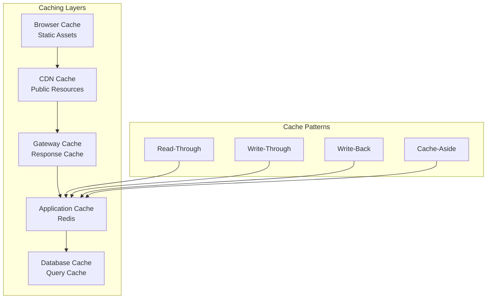

## Monitoring and Observability

### Monitoring Stack

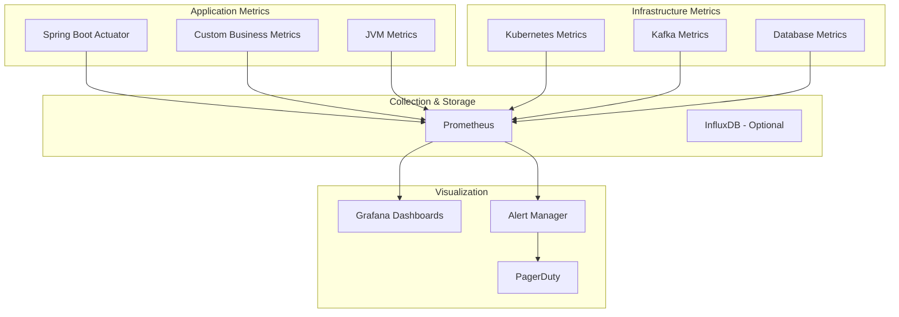

## Next Steps

This architecture overview provides the foundation for understanding OpenFrame's design. Continue with:

1. **[Security Overview](../security/overview.md)** - Deep dive into security implementation
2. **[Testing Overview](../testing/overview.md)** - Testing strategies for microservices
3. **[Local Development](../setup/local-development.md)** - Hands-on development guide

For specific service architectures, see the detailed documentation in `docs/architecture/` for each service component.

## Architectural Evolution

OpenFrame's architecture continues to evolve. Current areas of active development:

- **Service Mesh Migration** - Complete Istio integration
- **Event Sourcing** - Implement for critical business domains  
- **GraphQL Federation** - Distributed schema composition
- **Serverless Functions** - Event-driven microservices
- **Multi-Region Deployment** - Geographic distribution for performance

Join the [OpenMSP community](https://join.slack.com/t/openmsp/shared_invite/zt-36bl7mx0h-3~U2nFH6nqHqoTPXMaHEHA) to participate in architectural discussions and contribute to OpenFrame's evolution! 🚀