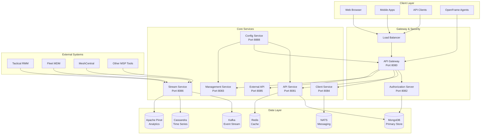
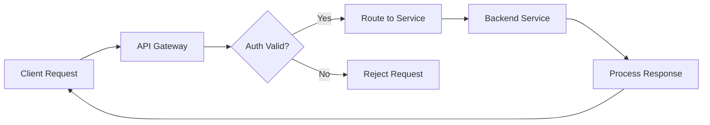
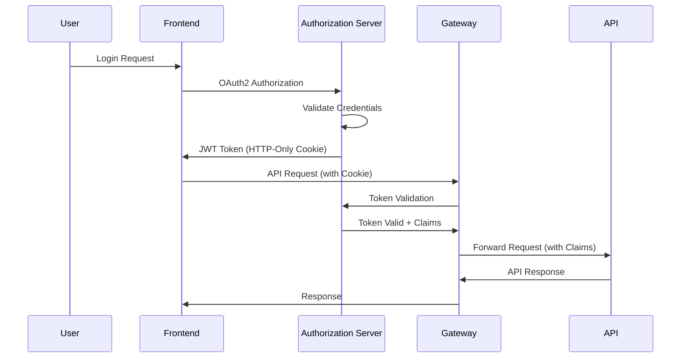
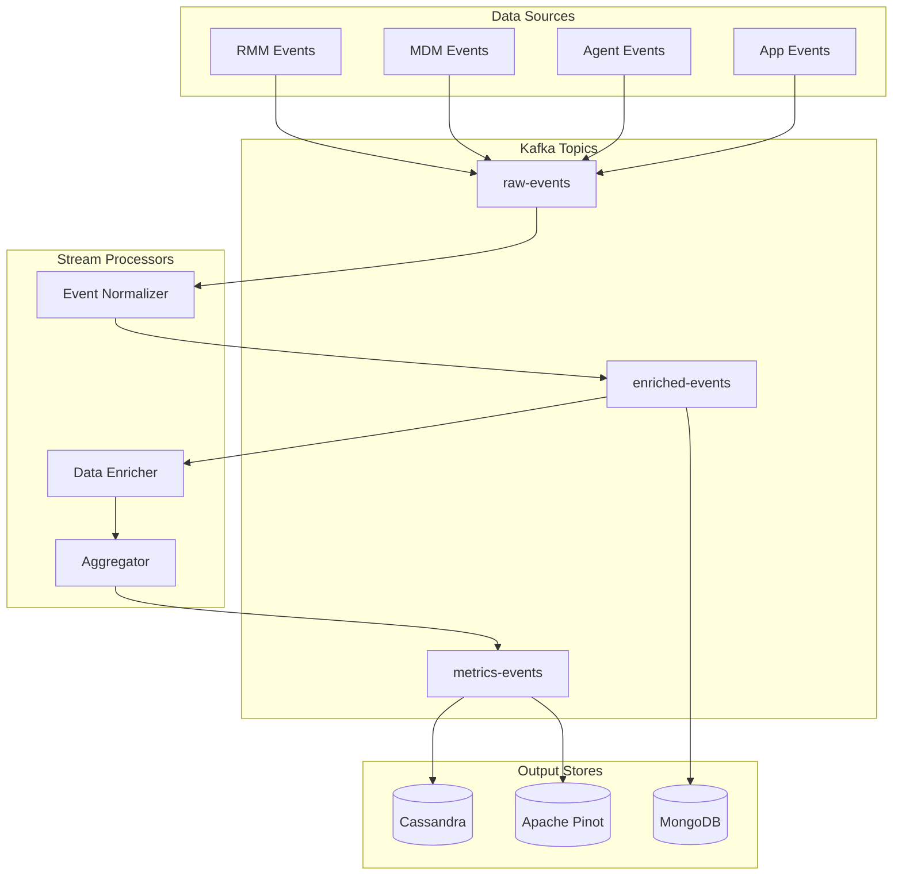
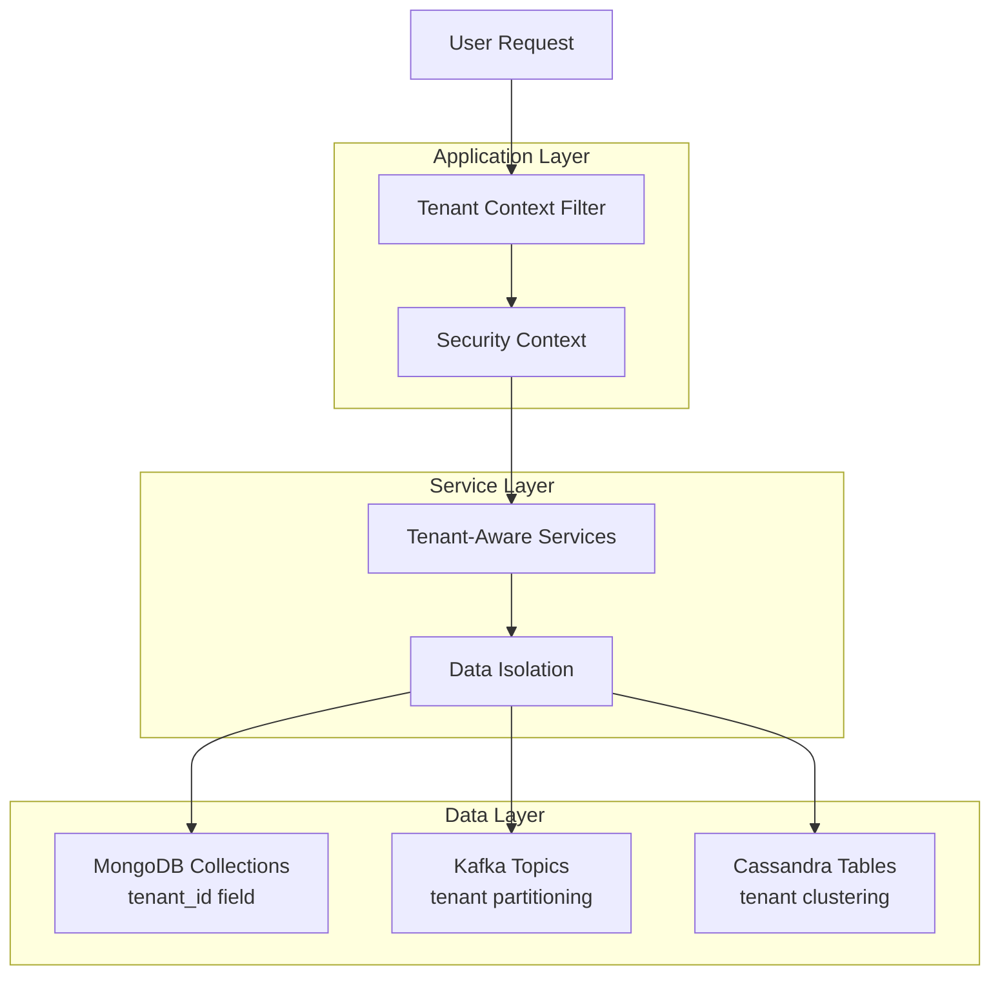
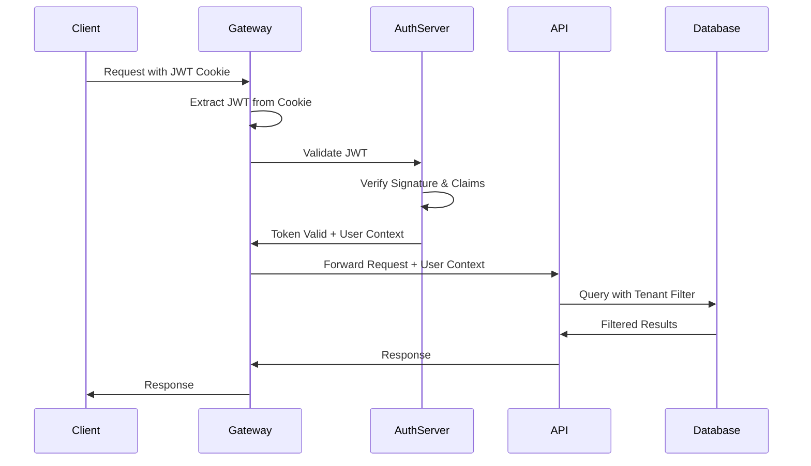

# Architecture Overview

This guide provides a comprehensive overview of OpenFrame's architecture, designed for developers who need to understand the system's structure, service interactions, and key design decisions. Understanding this architecture is crucial for effective development and troubleshooting.

## High-Level Architecture

OpenFrame follows a microservices architecture with clear separation of concerns, multi-tenancy, and event-driven communication patterns.



## Core Components

### 1. API Gateway (Port 8080)

**Purpose**: Single entry point for all external requests, handling authentication, routing, and protocol translation.

**Key Responsibilities**:
- **Request Routing**: Route requests to appropriate backend services
- **Authentication**: JWT token validation and API key verification
- **Authorization**: Role-based access control enforcement
- **Rate Limiting**: Prevent API abuse and ensure fair usage
- **Protocol Translation**: HTTP/WebSocket to internal protocols
- **CORS Handling**: Cross-origin request management

**Technology Stack**:
- Spring Cloud Gateway
- Spring Security for authentication
- Redis for rate limiting
- WebSocket support for real-time features



### 2. Authorization Server (Port 8082)

**Purpose**: Centralized authentication and authorization using OAuth2/OpenID Connect standards.

**Key Features**:
- **Multi-Tenant OAuth2**: Tenant-scoped token issuance
- **SSO Integration**: Support for external identity providers
- **User Registration**: Self-service account creation
- **Password Reset**: Secure password recovery flows
- **Session Management**: User session lifecycle management

**Token Flow**:


### 3. API Service (Port 8081)

**Purpose**: Primary business logic service providing GraphQL and REST endpoints.

**Core Domains**:
- **Device Management**: Hardware inventory, monitoring, remote access
- **Organization Management**: Multi-tenant organization structure
- **User Management**: User accounts, roles, permissions
- **Log Management**: Centralized logging and search
- **Integration Management**: Third-party tool connections

**GraphQL Schema Structure**:
```graphql
type Query {
    # Device Operations
    devices(filters: DeviceFilterInput): DeviceConnection
    device(id: ID!): Device
    
    # Organization Operations
    organizations(first: Int): OrganizationConnection
    organization(id: ID!): Organization
    
    # User Operations
    me: User
    users(organizationId: ID): [User]
    
    # Log Operations
    logs(filters: LogFilterInput): LogConnection
    logDetails(id: ID!): LogEvent
}

type Mutation {
    # Device Mutations
    updateDeviceStatus(id: ID!, status: DeviceStatus!): Device
    
    # Organization Mutations
    createOrganization(input: CreateOrganizationInput!): Organization
    updateOrganization(id: ID!, input: UpdateOrganizationInput!): Organization
    
    # User Mutations
    updateProfile(input: UpdateProfileInput!): User
}

type Subscription {
    # Real-time updates
    deviceStatusChanged(organizationId: ID!): Device
    newLogEvent(organizationId: ID!): LogEvent
}
```

### 4. Stream Service (Port 8086)

**Purpose**: Real-time event processing and data transformation using Kafka Streams.

**Processing Pipeline**:


### 5. Management Service (Port 8083)

**Purpose**: Administrative operations, background tasks, and system maintenance.

**Key Functions**:
- **Scheduled Tasks**: Automated maintenance and cleanup
- **System Monitoring**: Health checks and performance metrics
- **Configuration Management**: Dynamic configuration updates
- **Integration Setup**: Tool connection initialization
- **Data Migrations**: Schema and data version management

## Data Architecture

### Data Storage Strategy

OpenFrame uses polyglot persistence, choosing the right database for each use case:

| Database | Use Case | Data Types | Access Patterns |
|----------|----------|------------|-----------------|
| **MongoDB** | System of Record | Users, Organizations, Devices, Configurations | CRUD operations, Complex queries |
| **Cassandra** | Time-Series Data | Logs, Metrics, Events | High-volume writes, Time-based queries |
| **Apache Pinot** | Analytics | Aggregated Metrics, Dashboards | OLAP queries, Real-time analytics |
| **Redis** | Caching & Sessions | Cache, User sessions, Rate limiting | High-performance KV operations |
| **Kafka** | Event Streaming | Real-time events, CDC | Pub/sub, Stream processing |
| **NATS** | Lightweight Messaging | Agent communication, Notifications | Low-latency messaging |

### Multi-Tenancy Architecture

OpenFrame implements multi-tenancy at multiple layers:



**Tenant Isolation Strategies**:

1. **Row-Level Security**: All MongoDB documents include `tenantId`
2. **Topic Partitioning**: Kafka topics partitioned by tenant
3. **Connection Pooling**: Separate connection pools per tenant (if needed)
4. **Resource Quotas**: Per-tenant resource limits and monitoring

## Service Communication Patterns

### 1. Synchronous Communication

**HTTP/REST APIs** for request-response patterns:
```java
@RestTemplate
public class ServiceToServiceClient {
    
    @Autowired
    private RestTemplate restTemplate;
    
    public DeviceData getDeviceData(String deviceId) {
        return restTemplate.getForObject(
            "http://device-service/devices/{id}", 
            DeviceData.class, 
            deviceId
        );
    }
}
```

### 2. Asynchronous Communication

**Kafka Events** for decoupled communication:
```java
@Component
public class DeviceEventProducer {
    
    @Autowired
    private KafkaTemplate<String, DeviceEvent> kafkaTemplate;
    
    public void publishDeviceStatusChange(DeviceEvent event) {
        kafkaTemplate.send("device-events", event.getDeviceId(), event);
    }
}

@KafkaListener(topics = "device-events")
public void handleDeviceEvent(DeviceEvent event) {
    // Process device status change
    updateDeviceMetrics(event);
}
```

### 3. Real-time Communication

**NATS** for lightweight, real-time messaging:
```java
@Component
public class AgentCommunicationService {
    
    @Autowired
    private Connection natsConnection;
    
    public void sendAgentCommand(String agentId, Command command) {
        String subject = "agents." + agentId + ".commands";
        natsConnection.publish(subject, command.toJson().getBytes());
    }
}
```

## Security Architecture

### Authentication Flow



### Authorization Model

**Role-Based Access Control (RBAC)**:
```yaml
roles:
  - name: "TENANT_ADMIN"
    permissions:
      - "organization:read"
      - "organization:write"
      - "users:read"
      - "users:write"
      - "devices:read"
      - "devices:write"
      
  - name: "TECHNICIAN"
    permissions:
      - "devices:read"
      - "devices:write"
      - "logs:read"
      - "tickets:read"
      - "tickets:write"
      
  - name: "VIEWER"
    permissions:
      - "devices:read"
      - "logs:read"
      - "tickets:read"
```

## Key Design Decisions

### 1. Event Sourcing for Audit Trail

All important business events are stored as immutable events:

```java
@Document(collection = "audit_events")
public class AuditEvent {
    private String eventId;
    private String tenantId;
    private String entityType;
    private String entityId;
    private String eventType;
    private Object eventData;
    private String userId;
    private Instant timestamp;
}
```

### 2. CQRS for Read/Write Separation

Separate models for commands and queries:

```java
// Command Side
@Service
public class DeviceCommandService {
    public void updateDeviceStatus(UpdateDeviceStatusCommand command) {
        // Validate and update device
        // Publish event
    }
}

// Query Side
@Service
public class DeviceQueryService {
    public DeviceView getDevice(String deviceId, String tenantId) {
        // Return optimized view
    }
}
```

### 3. Circuit Breaker Pattern

Prevent cascade failures between services:

```java
@Component
public class ExternalServiceClient {
    
    @CircuitBreaker(name = "tactical-rmm", fallbackMethod = "fallbackGetDevices")
    public List<Device> getDevicesFromRMM() {
        // Call external service
    }
    
    public List<Device> fallbackGetDevices(Exception ex) {
        return Collections.emptyList(); // Graceful degradation
    }
}
```

## Performance Considerations

### 1. Database Query Optimization

**MongoDB Indexing Strategy**:
```javascript
// Compound indexes for common query patterns
db.devices.createIndex({ "tenantId": 1, "status": 1, "lastSeen": -1 })
db.logs.createIndex({ "tenantId": 1, "timestamp": -1, "severity": 1 })
db.users.createIndex({ "tenantId": 1, "email": 1 }, { unique: true })
```

### 2. Caching Strategy

**Redis Caching Layers**:
```java
@Cacheable(value = "devices", key = "#tenantId + ':' + #deviceId")
public Device getDevice(String deviceId, String tenantId) {
    return deviceRepository.findByIdAndTenantId(deviceId, tenantId);
}

@CacheEvict(value = "devices", key = "#device.tenantId + ':' + #device.id")
public Device updateDevice(Device device) {
    return deviceRepository.save(device);
}
```

### 3. Async Processing

**Non-blocking operations** for better throughput:
```java
@Async("taskExecutor")
public CompletableFuture<Void> processLargeDataSet(List<Data> dataSet) {
    dataSet.parallelStream()
           .forEach(this::processItem);
    return CompletableFuture.completedFuture(null);
}
```

## Monitoring and Observability

### 1. Distributed Tracing

Each request gets a correlation ID that flows through all services:

```java
@Component
public class CorrelationInterceptor implements HandlerInterceptor {
    
    @Override
    public boolean preHandle(HttpServletRequest request, 
                           HttpServletResponse response, 
                           Object handler) {
        String correlationId = request.getHeader("X-Correlation-ID");
        if (correlationId == null) {
            correlationId = UUID.randomUUID().toString();
        }
        MDC.put("correlationId", correlationId);
        return true;
    }
}
```

### 2. Health Checks

Comprehensive health checks for each service:

```java
@Component
public class CustomHealthIndicator implements HealthIndicator {
    
    @Override
    public Health health() {
        // Check database connectivity
        // Check external service availability
        // Check resource usage
        
        return Health.up()
                    .withDetail("database", "Connected")
                    .withDetail("kafka", "Connected")
                    .build();
    }
}
```

## Development Best Practices

### 1. Domain-Driven Design

Services are organized around business domains:
- **Device Domain**: Device management, monitoring, control
- **Identity Domain**: Users, organizations, authentication
- **Integration Domain**: External tool connections
- **Analytics Domain**: Reporting, dashboards, metrics

### 2. API Design Principles

- **GraphQL for complex queries**: Rich querying capabilities
- **REST for simple operations**: Standard HTTP semantics
- **Event-driven for notifications**: Real-time updates
- **Versioning strategy**: Backward compatibility

### 3. Error Handling Strategy

```java
@RestControllerAdvice
public class GlobalExceptionHandler {
    
    @ExceptionHandler(DeviceNotFoundException.class)
    public ResponseEntity<ErrorResponse> handleDeviceNotFound(
            DeviceNotFoundException ex) {
        ErrorResponse error = ErrorResponse.builder()
            .code("DEVICE_NOT_FOUND")
            .message(ex.getMessage())
            .timestamp(Instant.now())
            .build();
            
        return ResponseEntity.status(HttpStatus.NOT_FOUND).body(error);
    }
}
```

## Next Steps

To deepen your understanding of OpenFrame's architecture:

1. **[Review Testing Strategies](../testing/overview.md)** - Learn how architecture influences testing
2. **[Study Contributing Guidelines](../contributing/guidelines.md)** - Understand code organization principles
3. **[Explore Service Implementation](../../reference/architecture/)** - Deep dive into specific services
4. **[Examine Data Flow Patterns](../advanced/data-flow.md)** - Advanced data processing concepts

---

**🏗️ Architecture Mastery!** You now understand OpenFrame's architectural foundations and can navigate the codebase effectively.