# Architecture Overview

OpenFrame is built as a cloud-native, microservices-based platform designed for scalability, maintainability, and extensibility. This document provides a comprehensive overview of the system architecture, core components, and design decisions.

## High-Level Architecture

### System Overview

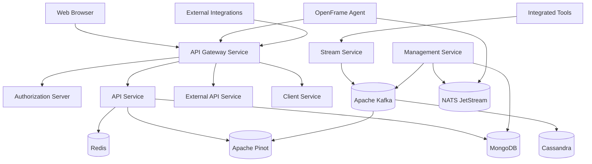

### Core Principles

| Principle | Implementation | Benefit |
|-----------|---------------|---------|
| **Microservices** | Separate services with single responsibilities | Independent scaling, deployment |
| **Event-Driven** | Kafka for async communication | Decoupled services, real-time processing |
| **API-First** | GraphQL/REST APIs for all interactions | Consistent interfaces, easy integration |
| **Multi-Tenant** | Tenant isolation at data and service level | Secure, scalable SaaS architecture |
| **Cloud-Native** | Kubernetes-ready, stateless services | Portability, auto-scaling |

## Service Architecture

### Gateway Service (Port 8080)

**Purpose**: Unified entry point for all external requests

**Key Responsibilities**:
- **Authentication & Authorization**: JWT validation, API key authentication
- **Rate Limiting**: Per-tenant, per-key rate limiting
- **Request Routing**: Route to appropriate backend services
- **WebSocket Proxying**: Real-time communication support
- **CORS & Security Headers**: Cross-origin security

**Technology Stack**:
- Spring Cloud Gateway
- Spring Security
- Redis (for rate limiting)
- WebSocket support

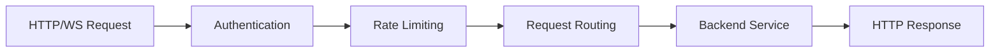

### API Service (Port 8081)

**Purpose**: Core business logic and data access APIs

**Key Responsibilities**:
- **GraphQL API**: Complex queries with DataLoaders
- **REST Endpoints**: Simple CRUD operations
- **User Management**: Users, organizations, invitations
- **Device Management**: Device registration, status, metadata
- **Tool Integration**: Tool connection management

**Architecture Pattern**:
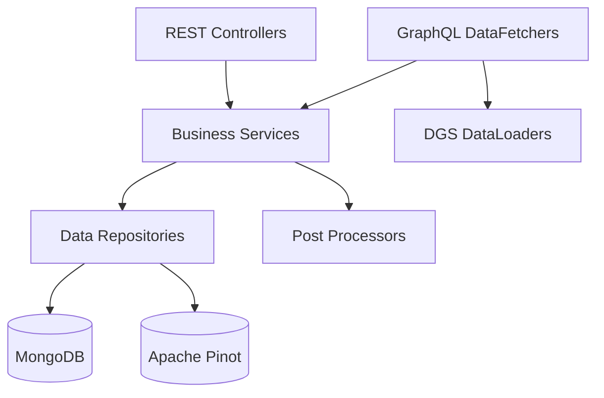

**Technology Stack**:
- Spring Boot 3.3
- Netflix DGS (GraphQL)
- Spring Data MongoDB
- Apache Pinot client

### Authorization Server (Port 8082)

**Purpose**: OAuth2/OIDC authentication and tenant management

**Key Responsibilities**:
- **Multi-Tenant OAuth2**: Per-tenant signing keys and configuration
- **SSO Integration**: Google, Microsoft, custom OIDC providers
- **User Registration**: Self-service and invitation-based registration
- **Tenant Discovery**: Domain-based tenant routing

**Security Features**:
- **JWKS per Tenant**: Unique signing keys for each tenant
- **Dynamic Client Registration**: Auto-configure OAuth clients
- **Security Policies**: Password policies, MFA support

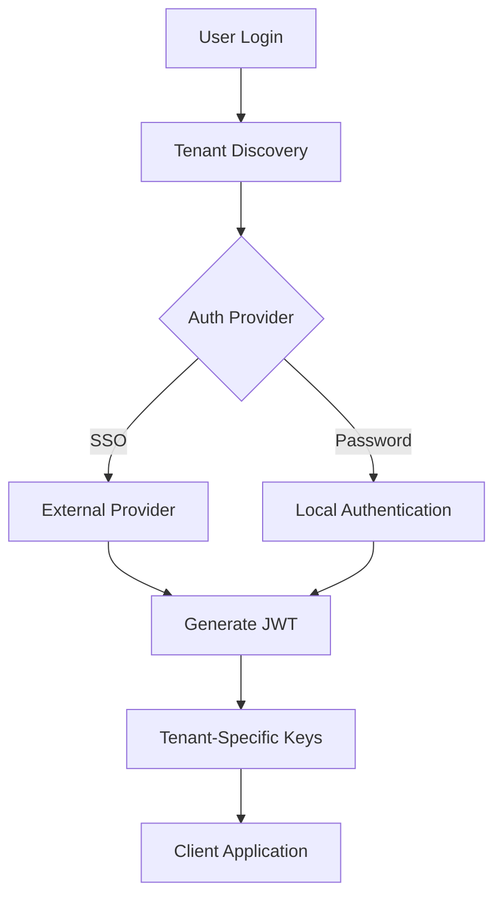

### Stream Service (Port 8084)

**Purpose**: Real-time event processing and data enrichment

**Key Responsibilities**:
- **Event Ingestion**: Receive events from tools and agents
- **Data Normalization**: Convert tool-specific formats to unified schema
- **Data Enrichment**: Add metadata, correlate events
- **Stream Processing**: Real-time analytics and aggregations

**Processing Pipeline**:
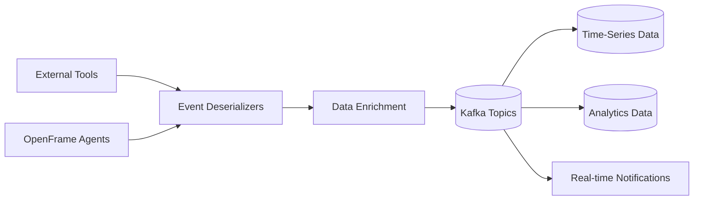

**Technology Stack**:
- Apache Kafka 3.6+
- Spring Kafka
- Custom stream processors
- Debezium for CDC

### Management Service (Port 8083)

**Purpose**: Administrative operations and scheduled tasks

**Key Responsibilities**:
- **System Initialization**: Bootstrap configuration, default data
- **Scheduled Tasks**: Cleanup, maintenance, reporting
- **Health Monitoring**: Service health checks, metrics collection
- **Tool Management**: Tool agent lifecycle, updates

**Task Scheduling**:
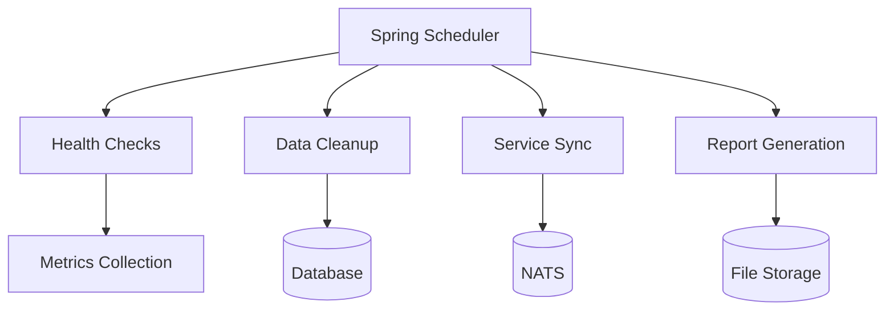

### External API Service (Port 8085)

**Purpose**: Stable REST API for external integrations

**Key Responsibilities**:
- **Partner Integrations**: API-key secured endpoints
- **Webhook Support**: Outbound webhook notifications
- **Data Export**: Bulk data access for reporting
- **Legacy Support**: Maintain API compatibility

**API Design**:
- RESTful endpoints with consistent naming
- Cursor-based pagination for large datasets
- OpenAPI 3.0 specification
- Rate limiting per API key

## Data Architecture

### Multi-Model Data Strategy

OpenFrame uses different databases optimized for specific use cases:

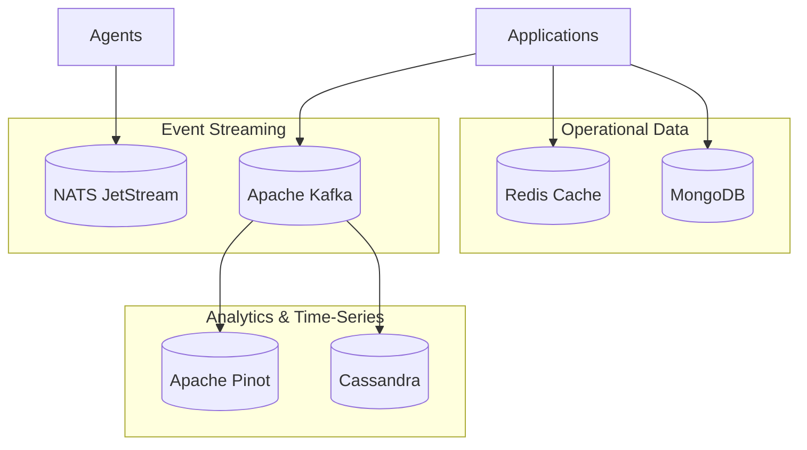

### Database Responsibilities

| Database | Data Type | Use Case | Characteristics |
|----------|-----------|----------|-----------------|
| **MongoDB** | Documents | Users, devices, organizations, configuration | ACID transactions, flexible schema |
| **Redis** | Key-Value | Sessions, cache, rate limiting | In-memory, fast access |
| **Apache Kafka** | Event Streams | Real-time events, messaging | High throughput, durable |
| **Cassandra** | Time-Series | Log storage, metrics, time-based data | Write-optimized, scalable |
| **Apache Pinot** | OLAP | Analytics, reporting, dashboards | Real-time analytics, fast queries |
| **NATS JetStream** | Messaging | Agent communication, updates | Lightweight, reliable |

### Data Flow Patterns

#### Write Path (Event Ingestion)
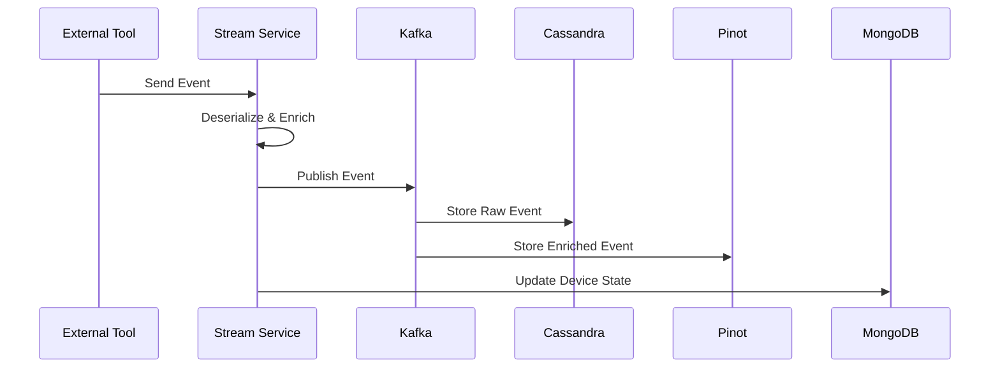

#### Read Path (API Query)
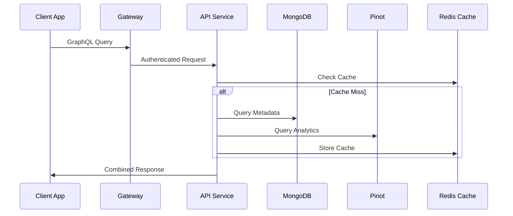

## Security Architecture

### Authentication & Authorization Flow

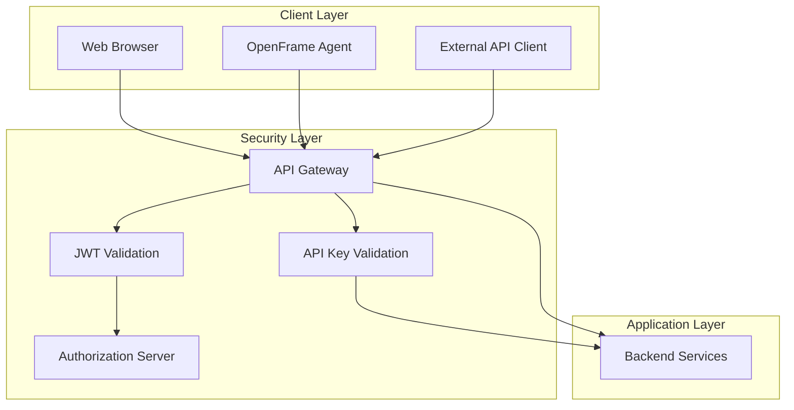

### Security Features

| Feature | Implementation | Purpose |
|---------|---------------|---------|
| **Multi-Tenant JWT** | Per-tenant signing keys | Tenant isolation |
| **API Key Management** | Scoped permissions, rate limiting | External integration security |
| **Session Management** | HTTP-only cookies, Redis storage | Web application security |
| **RBAC** | Role-based access control | Fine-grained permissions |
| **Data Encryption** | AES-256 for sensitive data | Data protection at rest |

## Communication Patterns

### Synchronous Communication

**Internal Service Calls**:
- Direct HTTP calls between services
- Circuit breaker pattern for resilience
- Service discovery via Spring Cloud

**External API Calls**:
- REST APIs for external tool integration
- OAuth2 for third-party authentication
- Rate limiting and retry logic

### Asynchronous Communication

**Event-Driven Architecture**:
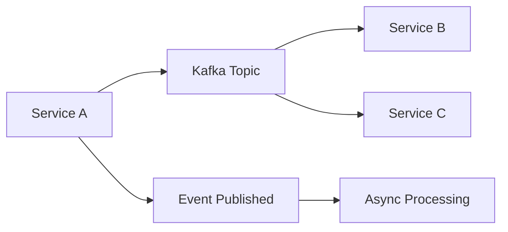

**Messaging Patterns**:
- **Publish-Subscribe**: Event notifications
- **Request-Reply**: Agent commands via NATS
- **Stream Processing**: Real-time data pipeline

## Scalability & Performance

### Horizontal Scaling Strategy

| Component | Scaling Strategy | Bottlenecks |
|-----------|------------------|-------------|
| **Gateway** | Load balancer + multiple instances | Connection limits |
| **API Service** | Auto-scaling based on CPU/memory | Database connections |
| **Stream Service** | Kafka partition scaling | Processing capacity |
| **Databases** | Read replicas, sharding | Write throughput |
| **Cache** | Redis clustering | Memory capacity |

### Performance Optimizations

#### Application Level
- **Connection Pooling**: Database and HTTP connections
- **Caching Strategy**: Multi-layer caching (Redis, application, HTTP)
- **Async Processing**: Non-blocking I/O, CompletableFuture
- **DataLoaders**: GraphQL N+1 query prevention

#### Database Level
- **Indexing Strategy**: Compound indexes for common queries
- **Partitioning**: Time-based partitioning for time-series data
- **Read Replicas**: Separate read/write workloads
- **Query Optimization**: Efficient queries, projection

#### Infrastructure Level
- **CDN**: Static asset delivery
- **Load Balancing**: Request distribution
- **Auto-scaling**: Dynamic resource allocation
- **Resource Limits**: Prevent resource exhaustion

## Deployment Architecture

### Kubernetes Deployment

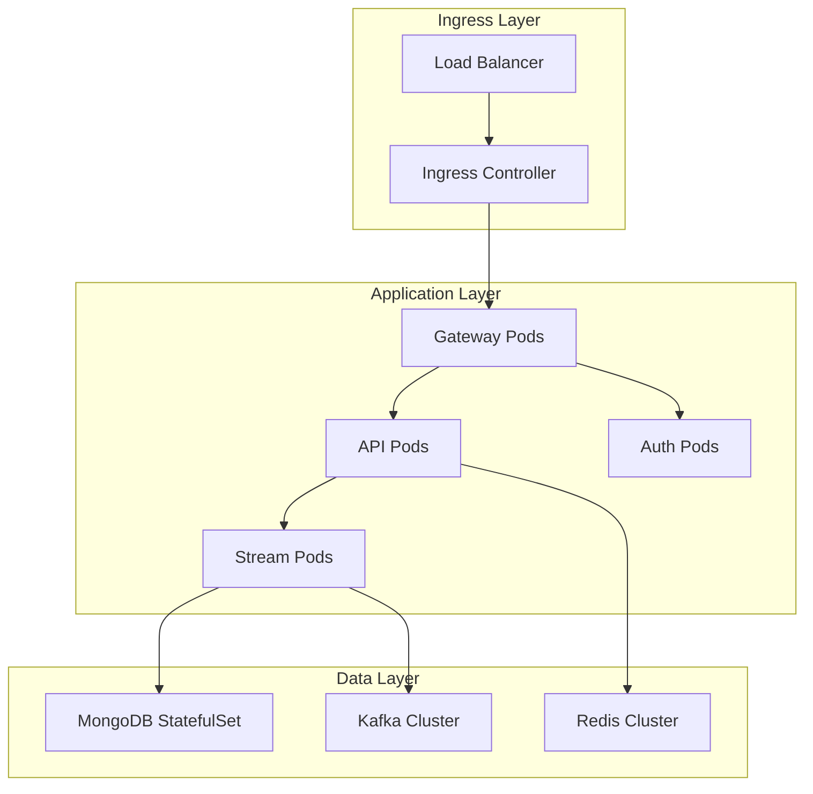

### Container Strategy

| Service | Container Base | Characteristics |
|---------|---------------|-----------------|
| **Java Services** | Eclipse Temurin 21 JRE | Minimal JRE, optimized startup |
| **Frontend** | nginx:alpine | Static file serving |
| **Databases** | Official images | Persistent volumes |

## Monitoring & Observability

### Metrics Collection

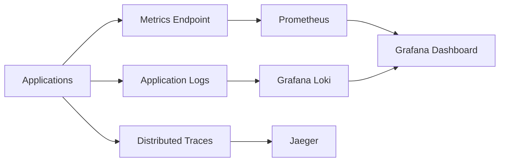

### Key Metrics

| Category | Metrics | Purpose |
|----------|---------|---------|
| **Application** | Response time, error rate, throughput | Performance monitoring |
| **Infrastructure** | CPU, memory, disk, network | Resource monitoring |
| **Business** | Active users, API usage, device count | Business intelligence |
| **Security** | Failed logins, API key usage | Security monitoring |

## Extension Points

### Custom Processors

OpenFrame supports custom processors for extending functionality:

```java
@Component
@ConditionalOnMissingBean(DeviceStatusProcessor.class)
public class CustomDeviceProcessor implements DeviceStatusProcessor {
    @Override
    public void processStatusChange(Device device, DeviceStatus oldStatus, DeviceStatus newStatus) {
        // Custom logic for device status changes
    }
}
```

### Tool Integration

New tools can be integrated through:
1. **Stream Processors**: Handle tool-specific event formats
2. **SDK Development**: Create tool-specific client libraries
3. **API Extensions**: Add tool-specific endpoints

### Frontend Extensions

The Vue.js frontend supports:
- **Custom Components**: Reusable UI components
- **Plugin Architecture**: Feature-based plugins
- **Theme Customization**: Brand-specific theming

## Design Decisions & Trade-offs

### Technology Choices

| Decision | Rationale | Trade-offs |
|----------|-----------|------------|
| **Java 21** | LTS version, virtual threads, performance | Learning curve for new features |
| **Spring Boot** | Mature ecosystem, auto-configuration | Some overhead, opinionated |
| **MongoDB** | Flexible schema, horizontal scaling | Eventual consistency |
| **Apache Kafka** | High throughput, durability | Complexity, resource usage |
| **Vue 3** | Composition API, TypeScript support | Framework lock-in |
| **Rust** | Performance, safety, cross-platform | Learning curve, compilation time |

### Architectural Trade-offs

| Trade-off | Choice | Reasoning |
|-----------|--------|-----------|
| **Consistency vs Availability** | Availability (AP) | Better user experience for MSP tools |
| **Microservices vs Monolith** | Microservices | Independent scaling, team autonomy |
| **SQL vs NoSQL** | Multi-model | Different data patterns need different solutions |
| **REST vs GraphQL** | Both | REST for integrations, GraphQL for UI |

## Future Architecture Evolution

### Planned Enhancements

1. **Service Mesh**: Istio for advanced traffic management
2. **Event Sourcing**: Complete audit trail for compliance
3. **CQRS**: Separate read/write models for better performance
4. **Multi-Region**: Geographic distribution for global MSPs
5. **AI/ML Pipeline**: Integrated machine learning for predictive analytics

### Migration Strategies

- **Database Migration**: Gradual migration with dual-write pattern
- **Service Decomposition**: Split services as they grow
- **API Versioning**: Maintain backward compatibility
- **Zero-Downtime Deployments**: Blue-green or canary deployments

This architecture provides a solid foundation for OpenFrame while maintaining flexibility for future growth and evolution.