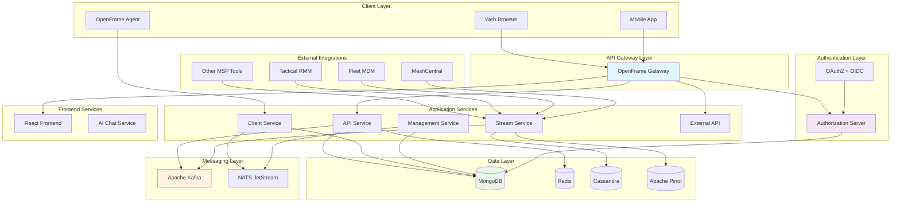
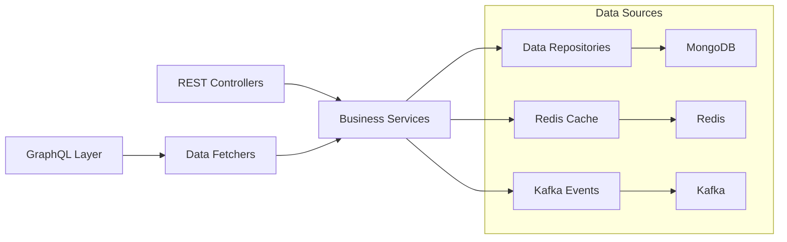
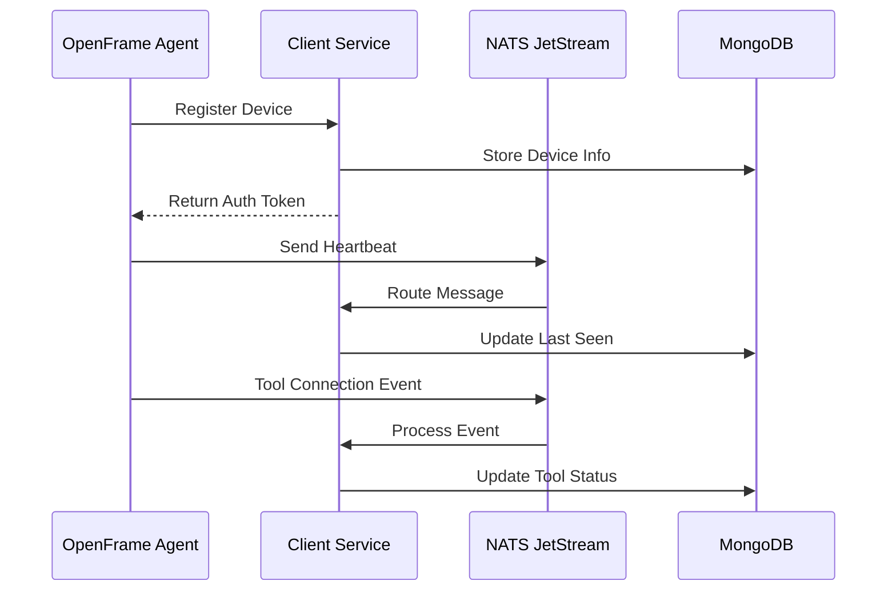
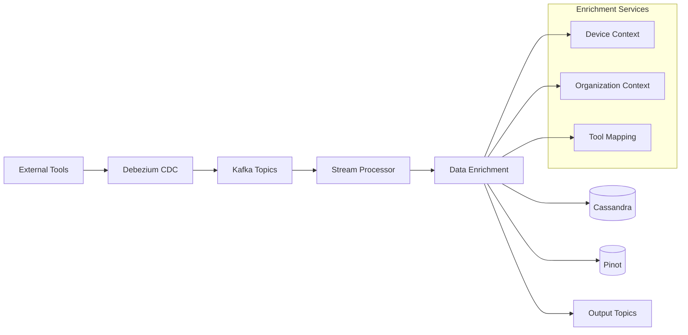
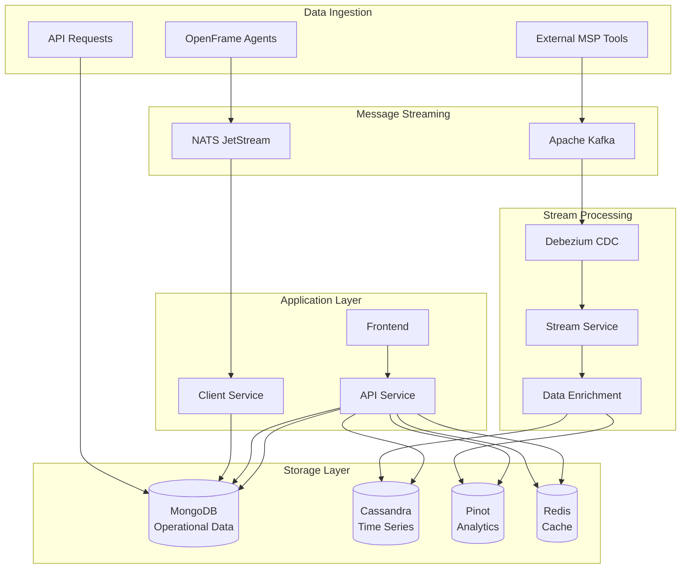
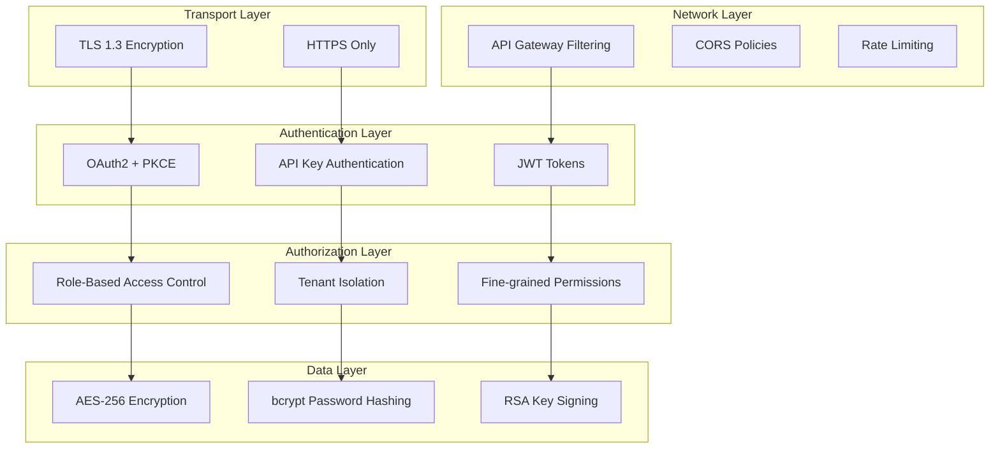
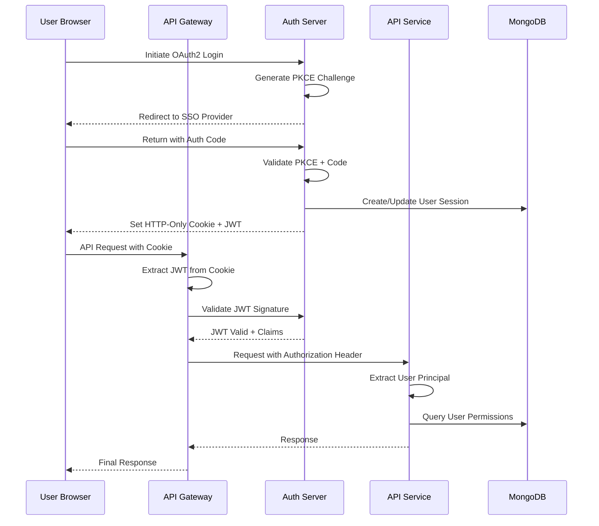
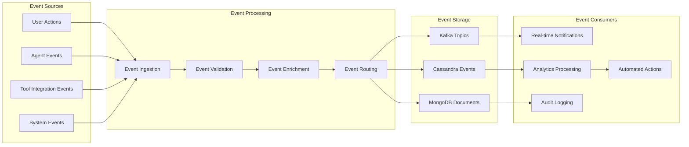
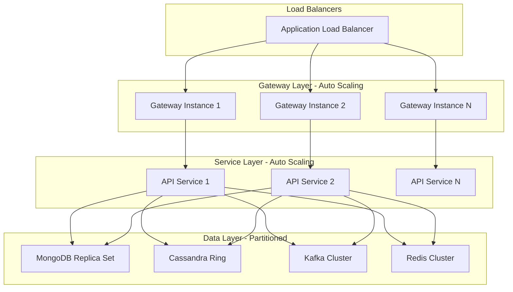
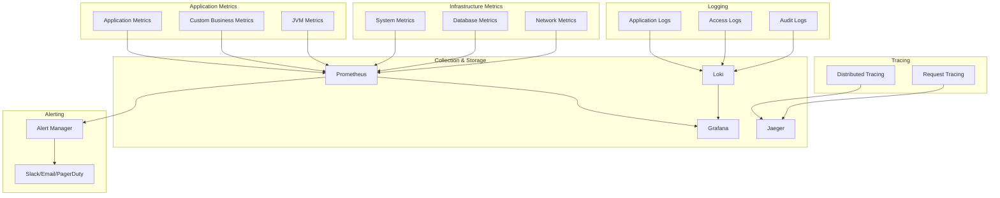

# Architecture Overview

This document provides a comprehensive overview of OpenFrame's architecture, including high-level system design, core components, data flow patterns, and key design decisions.

## High-Level Architecture

OpenFrame follows a distributed microservices architecture with event-driven communication, designed for scalability, security, and multi-tenancy.



## Core Components

### 1. API Gateway (openframe-gateway)

**Purpose**: Centralized entry point for all client requests

**Responsibilities**:
- Request routing and load balancing
- JWT token validation and transformation
- API key authentication and rate limiting
- WebSocket proxy for real-time features
- CORS handling and security headers

**Technology Stack**:
- Spring Cloud Gateway
- Spring Security OAuth2 Resource Server
- WebSocket support
- Redis for rate limiting

**Key Features**:
```java
// JWT validation with dynamic issuer resolution
@Component
public class JwtAuthConfig {
    private JwtIssuerAuthenticationManagerResolver authManagerResolver;
    
    // Supports multi-tenant JWT validation
    // Converts cookies to Authorization headers
}
```

### 2. API Service (openframe-api)

**Purpose**: Core business logic and data access layer

**Responsibilities**:
- GraphQL API (Netflix DGS framework)
- RESTful endpoints for specific use cases
- Business service orchestration
- Data validation and transformation
- Real-time subscriptions

**Technology Stack**:
- Spring Boot 3.3
- Netflix DGS (GraphQL)
- Spring Data MongoDB
- Redis caching
- Kafka integration

**Architecture Pattern**:


### 3. Authorization Server (openframe-authorization-server)

**Purpose**: Multi-tenant OAuth2/OpenID Connect identity provider

**Responsibilities**:
- Tenant registration and management
- OAuth2 authorization flows
- JWT token issuance with per-tenant signing keys
- SSO integration (Google, Microsoft)
- User invitation workflows

**Key Features**:
- **Per-Tenant Keys**: Each tenant gets unique RSA signing keys
- **PKCE Support**: Enhanced security for public clients
- **Multi-Provider SSO**: Google and Microsoft integration
- **Dynamic Client Registration**: Automatic client setup per tenant

```java
@Component
public class TenantKeyService {
    // Generates and manages RSA keys per tenant
    public AuthenticationKeyPair generateKeyPairForTenant(String tenantId) {
        // Creates unique signing keys for JWT isolation
    }
}
```

### 4. Client Service (openframe-client)

**Purpose**: Agent communication and device lifecycle management

**Responsibilities**:
- OpenFrame agent authentication
- Device registration and heartbeat processing
- Tool agent installation coordination
- NATS message routing
- Machine status tracking

**Communication Flow**:


### 5. Stream Service (openframe-stream)

**Purpose**: Real-time data processing and enrichment

**Responsibilities**:
- Kafka stream processing
- Debezium CDC event handling
- Data enrichment with device/organization context
- Event normalization and routing
- Analytics data preparation

**Event Processing Pipeline**:


### 6. Management Service (openframe-management)

**Purpose**: System administration and background processing

**Responsibilities**:
- System initialization and migrations
- Scheduled task execution
- External service health monitoring
- Configuration management
- Cleanup and maintenance operations

**Scheduled Operations**:
- API key statistics synchronization
- Debezium connector health checks
- Agent registration secret rotation
- System health monitoring

### 7. Frontend Service (openframe-frontend)

**Purpose**: Modern web interface for OpenFrame

**Technology Stack**:
- React 18 with TypeScript
- Apollo GraphQL Client
- PrimeReact UI components
- Zustand state management
- Vite build system

**Key Features**:
- **Responsive Design**: Mobile-first approach
- **Real-time Updates**: WebSocket integration
- **AI Chat Interface**: Mingo AI integration
- **Role-based UI**: Dynamic permissions
- **Multi-tenant Support**: Tenant-aware routing

## Data Architecture

### Storage Strategy

OpenFrame uses a polyglot persistence approach, choosing the right database for each use case:

| Database | Use Case | Data Types |
|----------|----------|------------|
| **MongoDB** | Primary application data | Documents, users, organizations, configurations |
| **Redis** | Caching and sessions | Cache, rate limiting, session storage |
| **Cassandra** | Time-series events | Logs, metrics, audit trails |
| **Apache Pinot** | Real-time analytics | Aggregated data, dashboards, reporting |

### Data Flow Architecture



## Security Architecture

### Multi-Layered Security Model

OpenFrame implements defense-in-depth security across all layers:



### Authentication Flow



## Event-Driven Architecture

### Event Processing Model

OpenFrame uses event-driven architecture for real-time processing and system integration:

**Event Categories**:
1. **System Events**: User actions, configuration changes
2. **Device Events**: Agent heartbeats, status updates
3. **Tool Events**: External MSP tool integrations
4. **Audit Events**: Security and compliance tracking

**Event Flow**:


## Key Design Decisions

### 1. Microservices Architecture

**Decision**: Use microservices over monolithic architecture
**Reasoning**: 
- Independent scaling and deployment
- Technology diversity (Java, React, Rust)
- Team autonomy and parallel development
- Fault isolation

### 2. Event-Driven Communication

**Decision**: Use Apache Kafka for inter-service communication
**Reasoning**:
- Decoupled service interactions
- Built-in durability and replay capability
- High throughput for real-time data
- Support for complex event processing

### 3. Polyglot Persistence

**Decision**: Multiple databases for different use cases
**Reasoning**:
- MongoDB: Document flexibility for varied schemas
- Cassandra: Time-series performance at scale
- Redis: Sub-millisecond cache access
- Pinot: Real-time analytics queries

### 4. GraphQL + REST Hybrid

**Decision**: GraphQL for complex queries, REST for simple operations
**Reasoning**:
- GraphQL: Efficient data fetching, strong typing
- REST: Simple operations, external integrations
- Both: Different client needs and use cases

### 5. Multi-Tenant Architecture

**Decision**: Shared infrastructure with tenant isolation
**Reasoning**:
- Cost efficiency over tenant-per-instance
- Operational simplicity
- Resource sharing benefits
- Strong isolation through security layers

## Scalability Considerations

### Horizontal Scaling Strategy



### Performance Optimization

**Caching Strategy**:
- L1: Application-level caching (Caffeine)
- L2: Redis distributed cache
- L3: Database query optimization

**Database Optimization**:
- MongoDB: Proper indexing, read preferences
- Cassandra: Partition key optimization
- Redis: Connection pooling, pipelining

**Network Optimization**:
- HTTP/2 for reduced latency
- Connection pooling for database access
- CDN for static assets

## Observability and Monitoring

### Monitoring Stack



---

**Next Steps**: 
- Explore [Testing Overview](../testing/overview.md) to understand testing strategies
- Review [Contributing Guidelines](../contributing/guidelines.md) for development workflows
- Dive into specific service documentation in the reference docs