# Architecture Overview

OpenFrame is built as a distributed, multi-tenant, AI-powered platform using modern microservices architecture patterns. This guide provides a comprehensive overview of the system design, core components, and architectural decisions.

## High-Level System Architecture

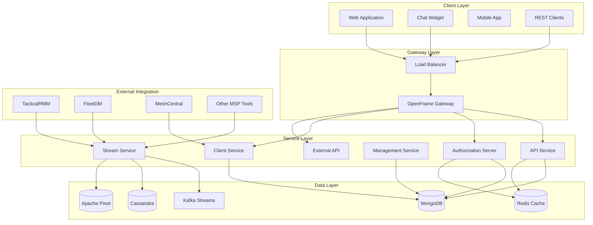

## Core Architectural Principles

### 1. Multi-Tenant by Design

Every component supports multi-tenancy from the ground up:

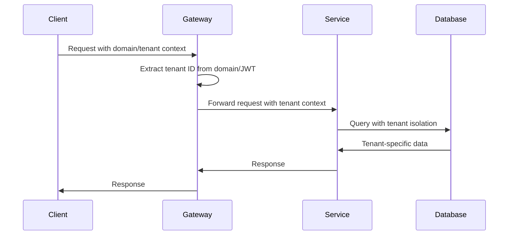

**Key Design Elements:**
- **Domain-based Tenant Resolution**: `tenant1.openframe.ai`, `tenant2.openframe.ai`
- **Data Isolation**: All database queries include tenant ID filtering
- **Configuration Isolation**: Tenant-specific settings and integrations
- **Resource Isolation**: Separate resource quotas and limits per tenant

### 2. Event-Driven Architecture

OpenFrame uses events for loose coupling and real-time processing:

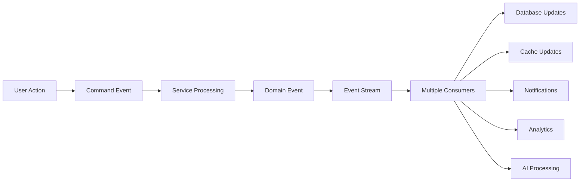

**Event Categories:**
- **Command Events**: User actions, system commands
- **Domain Events**: Business state changes
- **Integration Events**: External tool data synchronization
- **System Events**: Infrastructure and monitoring events

### 3. API-First Design

All functionality exposed via well-defined APIs:

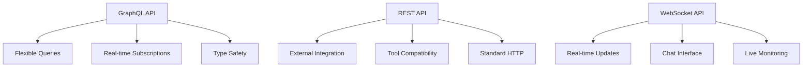

## Service Architecture Deep Dive

### Service Responsibilities Matrix

| Service | Primary Role | Key Responsibilities | Technology Stack |
|---------|--------------|---------------------|------------------|
| **Gateway** | API Gateway & Routing | Request routing, authentication, WebSocket proxy | Spring Cloud Gateway |
| **API Service** | Core Business Logic | GraphQL API, device management, organization CRUD | Spring Boot, Netflix DGS |
| **Auth Server** | Identity & Access | OAuth2/OIDC flows, user management, SSO | Spring Authorization Server |
| **Client Service** | Agent Management | Agent registration, tool connections, file transfers | Spring Boot, NATS |
| **Management** | System Administration | Scheduled tasks, data initialization, health monitoring | Spring Boot, Scheduling |
| **Stream Service** | Event Processing | Real-time data processing, enrichment, analytics | Spring Boot, Kafka Streams |
| **External API** | Public Interface | External tool integration, public REST API facade | Spring Boot, OpenAPI |

### Inter-Service Communication

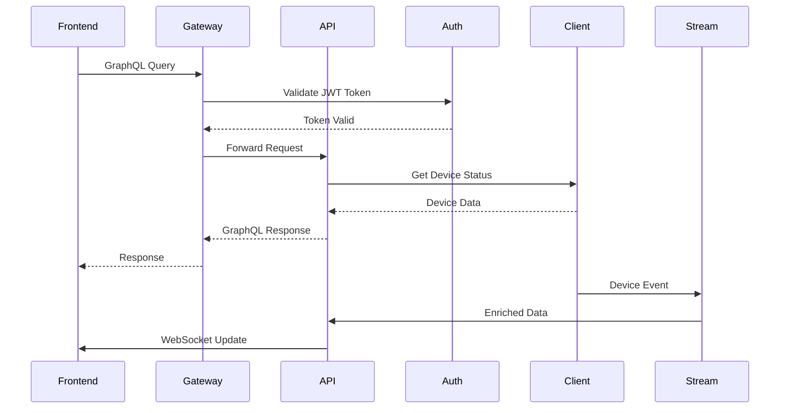

**Communication Patterns:**
- **Synchronous**: HTTP/REST for immediate responses
- **Asynchronous**: Kafka events for eventual consistency
- **Real-time**: WebSocket for live updates
- **Service Discovery**: Spring Cloud discovery (in cloud deployments)

## Data Architecture

### Polyglot Persistence Strategy

OpenFrame uses different databases optimized for specific use cases:

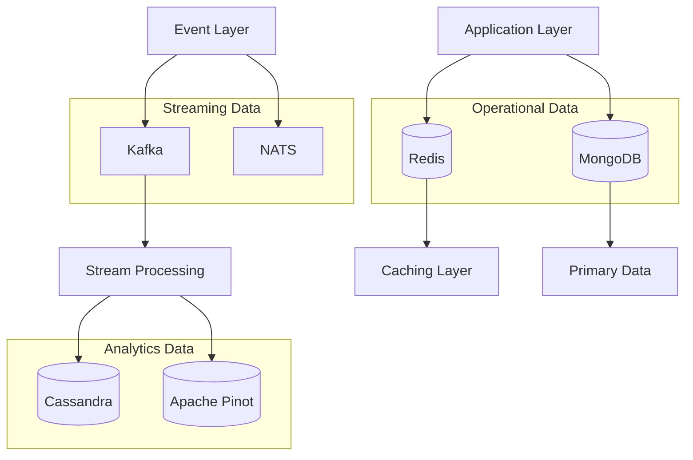

### Database Usage Patterns

| Database | Use Cases | Data Types | Access Patterns |
|----------|-----------|------------|-----------------|
| **MongoDB** | Primary operational data | Users, devices, organizations, configurations | CRUD operations, complex queries |
| **Redis** | Caching & sessions | Session data, cached queries, rate limiting | Key-value access, TTL-based expiration |
| **Cassandra** | Time-series logs | Device logs, events, metrics | Write-heavy, time-based queries |
| **Apache Pinot** | Real-time analytics | Aggregated metrics, dashboards, reports | Complex analytical queries |
| **Kafka** | Event streaming | Events, commands, integrations | Pub-sub, stream processing |

### Data Flow Architecture

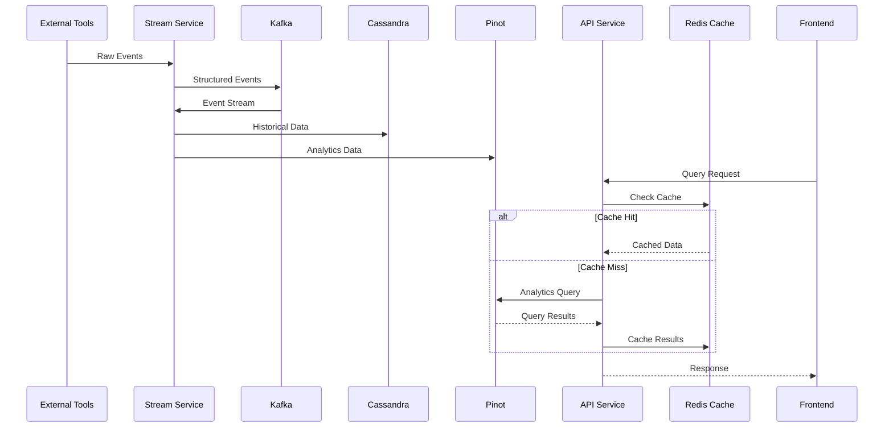

## Security Architecture

### Multi-Layered Security Model

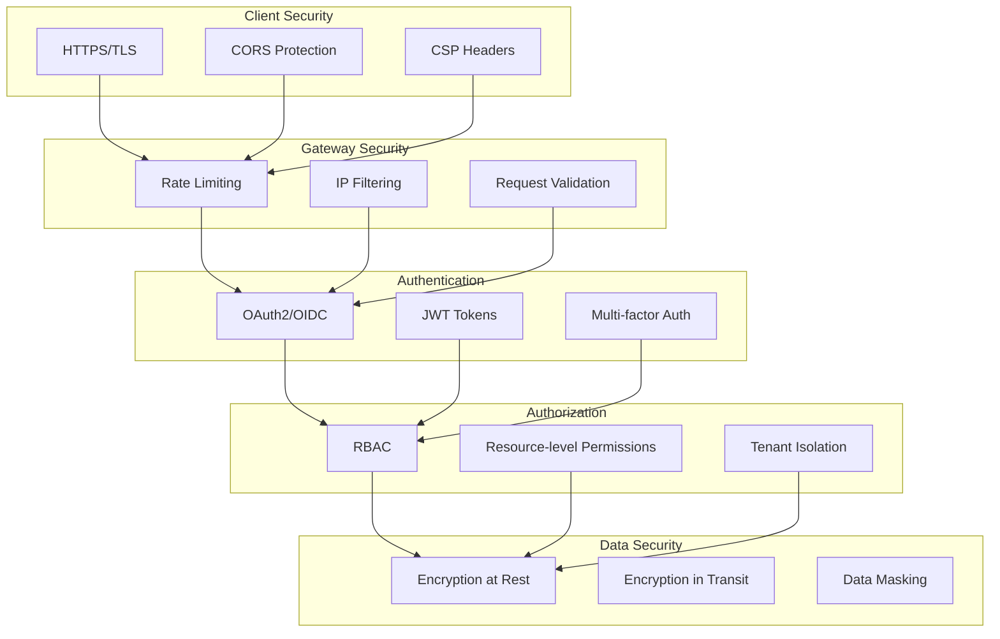

### Authentication & Authorization Flow

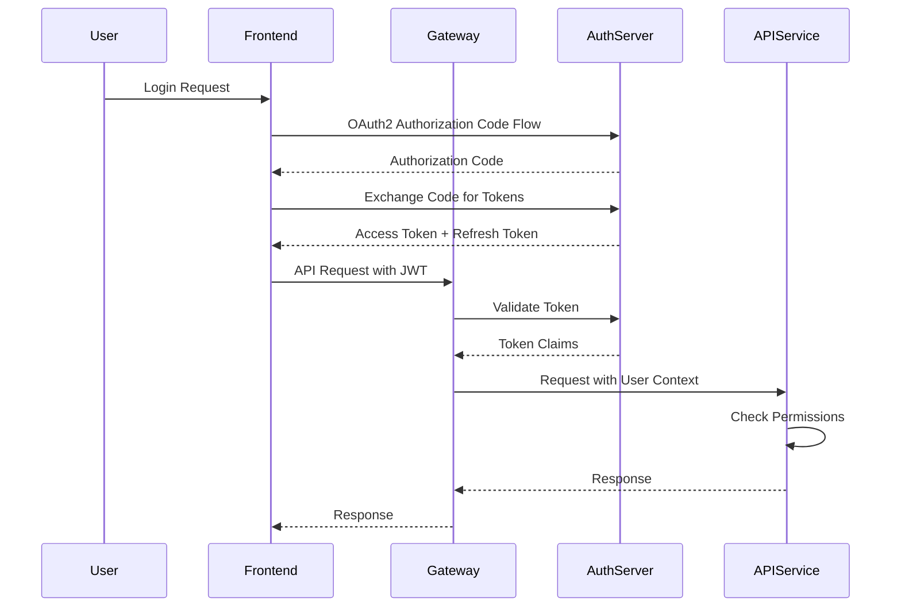

**Security Features:**
- **OAuth2/OIDC Compliance**: Standard authentication flows
- **JWT with Refresh Tokens**: Secure token-based authentication  
- **Role-Based Access Control**: Granular permission system
- **Multi-Tenant Security**: Complete tenant isolation
- **Data Encryption**: AES-256 encryption for sensitive data
- **Audit Logging**: Comprehensive security event logging

## AI Integration Architecture

### Mingo AI & Fae AI Integration

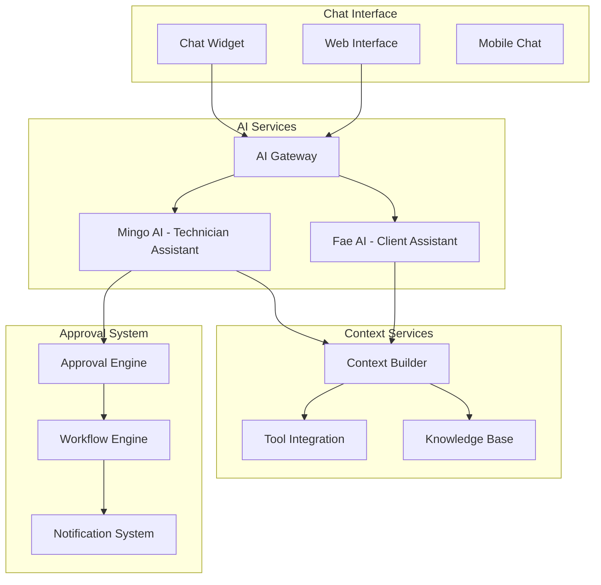

**AI Architecture Features:**
- **Context-Aware AI**: AI understands user role, current page, and available data
- **Tool Integration**: AI can interact with MSP tools through APIs
- **Approval Workflows**: Human approval required for sensitive AI actions
- **Learning System**: AI improves based on usage patterns and feedback
- **Enterprise Guardrails**: Configurable limits and permissions for AI actions

## Deployment Architecture

### Container & Orchestration Strategy

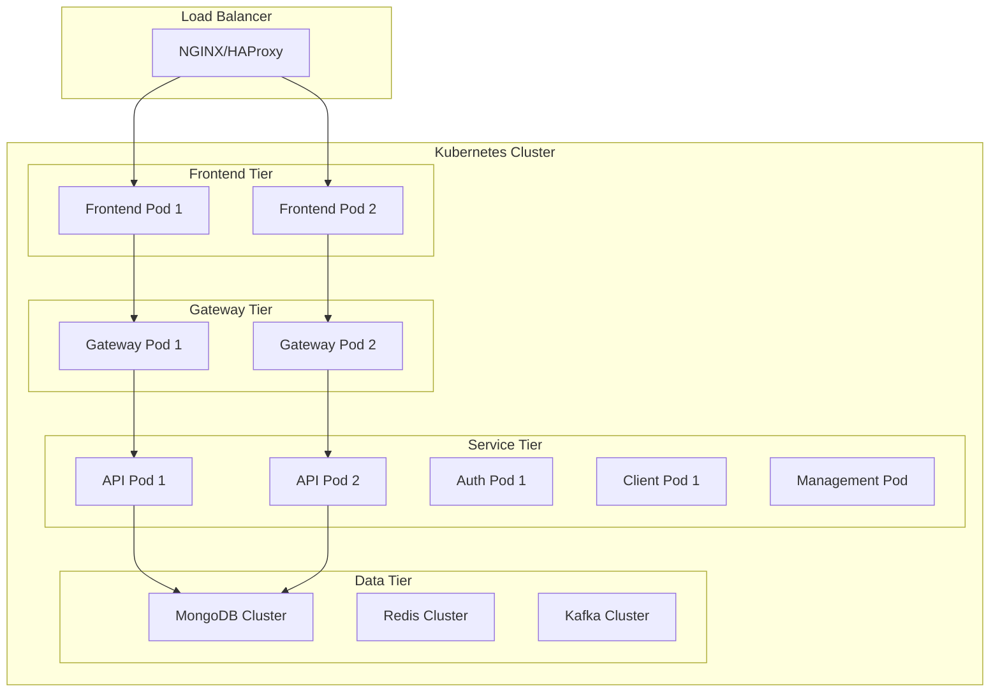

**Deployment Features:**
- **Kubernetes Native**: Designed for cloud-native deployment
- **Horizontal Scaling**: Auto-scaling based on metrics
- **Health Checks**: Comprehensive health monitoring
- **Rolling Updates**: Zero-downtime deployments
- **Configuration Management**: Helm charts for environment management

## Performance & Scalability

### Scalability Patterns

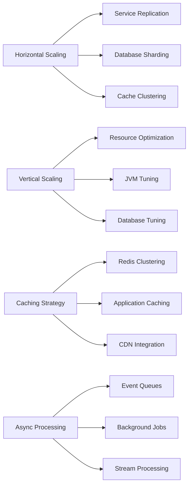

**Performance Optimizations:**
- **Database Indexing**: Optimized queries with proper indexing
- **Connection Pooling**: Efficient database connection management
- **Caching Layers**: Multi-level caching strategy
- **Async Processing**: Non-blocking operations for better throughput
- **Resource Management**: Memory and CPU optimization

## Monitoring & Observability

### Observability Stack

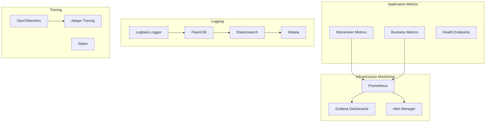

**Observability Features:**
- **Metrics**: Custom business metrics and infrastructure monitoring
- **Logging**: Structured JSON logging with correlation IDs
- **Tracing**: Distributed tracing for request flow analysis
- **Health Monitoring**: Comprehensive service health checks
- **Alerting**: Intelligent alerting based on metrics and patterns

## Integration Architecture

### External Tool Integration

OpenFrame integrates with various MSP tools through a unified integration framework:

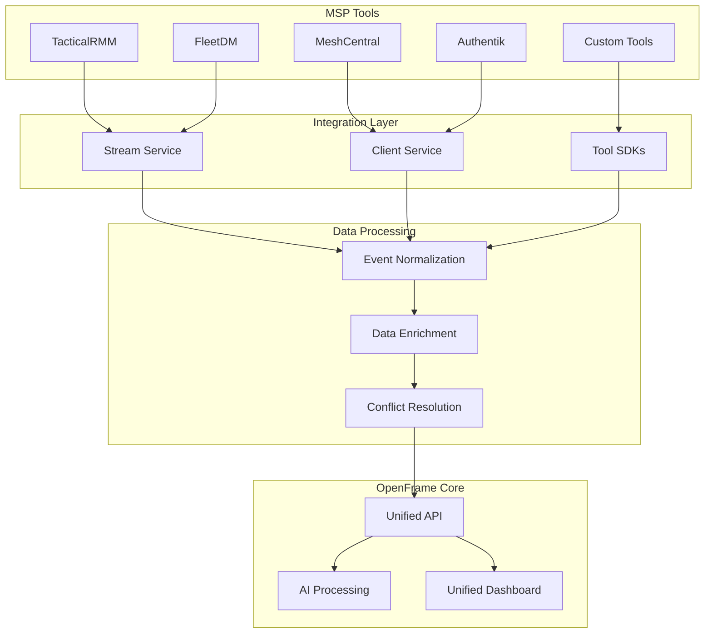

**Integration Capabilities:**
- **Unified Data Model**: Consistent data representation across tools
- **Real-time Sync**: Live data synchronization with external tools
- **Conflict Resolution**: Intelligent handling of data conflicts
- **SDK Framework**: Easy integration of new tools
- **API Translation**: Converting between different tool APIs

---

*🏗️ **Architecture foundation established!** Continue to [Testing Overview](../testing/overview.md) to understand the testing strategies and implementation.*