# Architecture Overview

OpenFrame is built as a distributed microservices platform designed for multi-tenant MSP operations. This document provides a comprehensive overview of the system architecture, service interactions, and design principles.

## High-Level Architecture

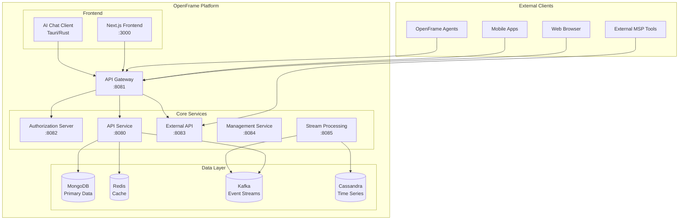

## Core Service Architecture

### 1. API Gateway (`openframe-gateway`)

**Purpose**: Unified entry point for all external requests, handling authentication, routing, and cross-cutting concerns.

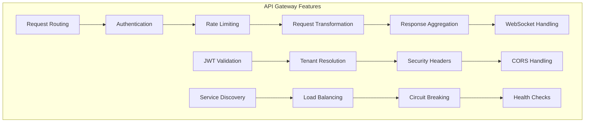

**Key Responsibilities**:
- Route requests to appropriate backend services
- Validate JWT tokens and API keys
- Handle WebSocket connections for real-time features
- Implement rate limiting and throttling
- Provide centralized logging and monitoring

**Technology Stack**:
- Spring Cloud Gateway
- Spring Security OAuth2 Resource Server
- WebSocket support
- Reactive programming model (WebFlux)

### 2. Authorization Server (`openframe-authorization-server`)

**Purpose**: Multi-tenant OAuth2/OpenID Connect provider handling authentication and authorization.

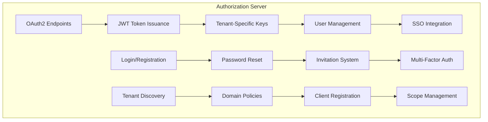

**Key Features**:
- **Multi-tenant JWT**: Per-tenant signing keys
- **SSO Integration**: Google, Azure AD, Okta support
- **User Lifecycle**: Registration, invitations, password reset
- **Client Management**: Dynamic OAuth2 client registration

**Technology Stack**:
- Spring Authorization Server
- MongoDB for persistence
- JWT with per-tenant keys
- OpenID Connect compliance

### 3. API Service (`openframe-api`)

**Purpose**: Core business logic and data access layer exposing GraphQL and REST APIs.

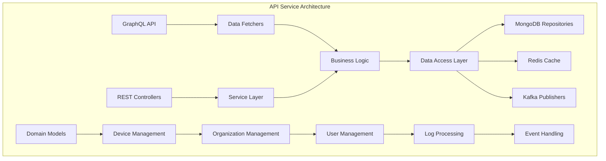

**Domain Models**:

| Domain | Purpose | Key Entities |
|--------|---------|--------------|
| **Organizations** | Multi-tenant structure | Organization, Contact, Address |
| **Devices** | Endpoint management | Machine, DeviceStatus, Tags |
| **Users** | Identity and access | User, Invitation, Roles |
| **Events** | Activity tracking | CoreEvent, ExternalEvent |
| **Tools** | Integration management | IntegratedTool, ToolConnection |

**Technology Stack**:
- Netflix DGS (Domain Graph Service) for GraphQL
- Spring Boot with WebFlux (reactive)
- MongoDB with reactive repositories
- Redis for caching and sessions
- Apache Kafka for event publishing

### 4. External API Service (`openframe-external-api`)

**Purpose**: Public-facing REST API with API key authentication for external integrations.

**Architecture**:
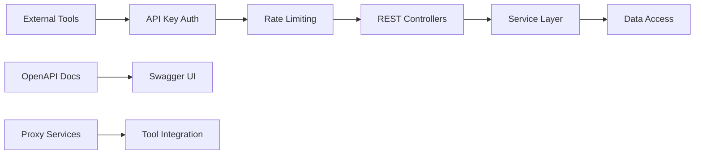

**Key Features**:
- API key-based authentication
- OpenAPI 3.0 documentation
- Rate limiting and throttling
- Proxy services for tool integration
- Comprehensive request/response logging

### 5. Stream Processing Service (`openframe-stream`)

**Purpose**: Real-time event processing, normalization, and enrichment.

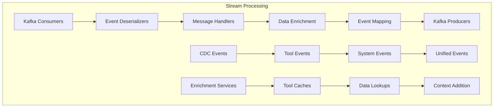

**Processing Pipeline**:

1. **Ingestion**: Consume events from various Kafka topics
2. **Deserialization**: Convert raw messages to structured data
3. **Enrichment**: Add context from external systems
4. **Normalization**: Map to unified event format
5. **Distribution**: Route processed events to downstream consumers

**Technology Stack**:
- Apache Kafka for streaming
- Custom deserializers for different event types
- Cassandra for time-series data storage
- Integration with Tactical RMM, Fleet MDM, MeshCentral

## Data Architecture

### Database Design Patterns

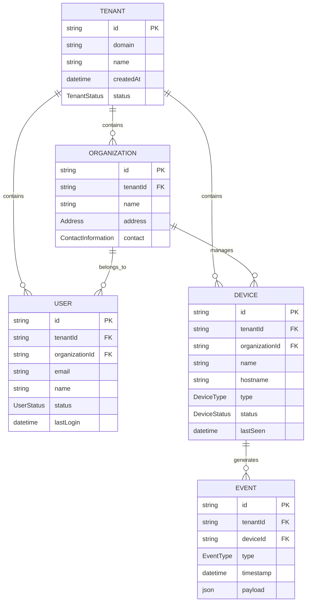

### Data Storage Strategy

| Data Type | Storage | Rationale | Retention |
|-----------|---------|-----------|-----------|
| **Master Data** | MongoDB | Document model fits complex entities | Permanent |
| **Time-Series** | Cassandra | Optimized for high-volume writes | 90 days |
| **Session Data** | Redis | Fast access, automatic expiration | 24 hours |
| **Event Streams** | Kafka | Distributed, fault-tolerant messaging | 7 days |
| **File Attachments** | Object Storage | Scalable, cost-effective | Variable |

### Multi-Tenancy Strategy

OpenFrame implements **schema-per-tenant** multi-tenancy:

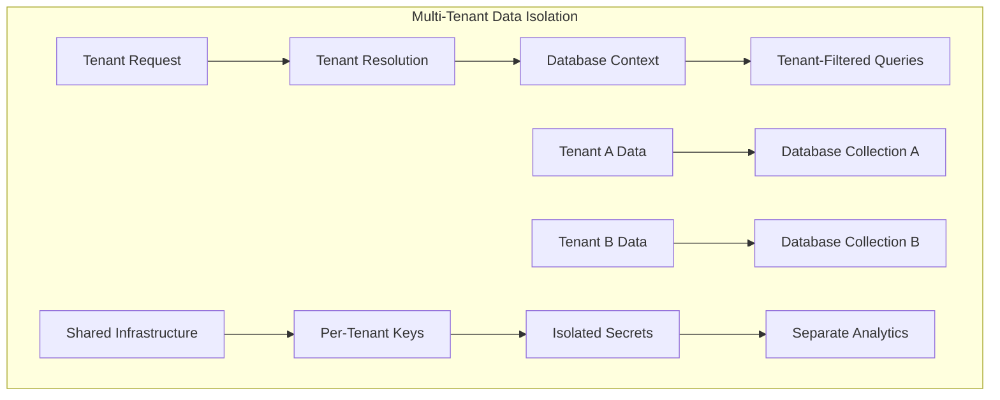

**Implementation Details**:
- All entities include `tenantId` field
- Automatic tenant filtering in repositories
- Tenant-specific JWT signing keys
- Isolated metrics and logging per tenant

## Security Architecture

### Authentication and Authorization Flow

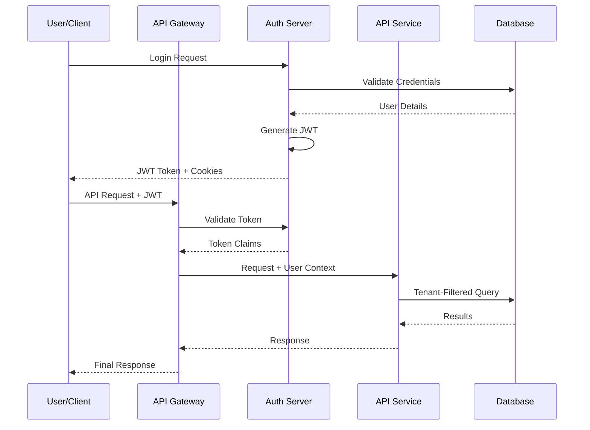

### Security Layers

| Layer | Component | Purpose | Implementation |
|-------|-----------|---------|----------------|
| **Edge Security** | API Gateway | Request filtering, rate limiting | Spring Security, JWT validation |
| **Service Security** | Each Service | Authorization checks | Method-level security |
| **Data Security** | Repository Layer | Tenant isolation | Automatic tenant filtering |
| **Transport Security** | All Components | Encryption in transit | TLS 1.3, HTTPS only |
| **Secret Management** | Configuration | Secure credential storage | Environment variables, vault integration |

### JWT Token Structure

```json
{
  "iss": "https://auth.openframe.domain",
  "sub": "user-uuid-here",
  "aud": "openframe-api",
  "exp": 1640995200,
  "iat": 1640908800,
  "tenant_id": "tenant-uuid-here",
  "organization_id": "org-uuid-here",
  "scope": "read:devices write:organizations",
  "roles": ["admin", "technician"],
  "email": "user@company.com"
}
```

## Event-Driven Architecture

### Event Flow Architecture

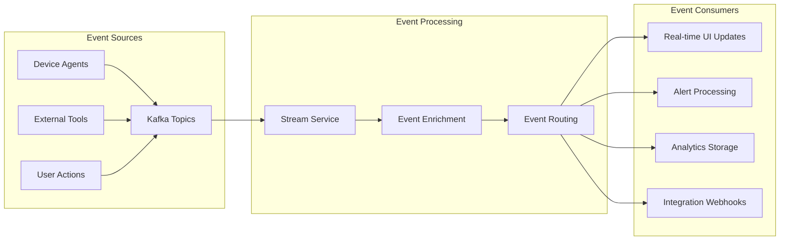

### Event Types and Topics

| Topic | Event Type | Producer | Consumer | Retention |
|-------|------------|----------|----------|-----------|
| `device.status` | Device state changes | Agents | Stream Service, UI | 7 days |
| `user.activity` | User actions | API Service | Analytics, Audit | 30 days |
| `system.alerts` | System alerts | All Services | Alert Manager | 7 days |
| `integration.events` | External tool events | Proxies | Stream Service | 7 days |
| `audit.logs` | Security events | All Services | Compliance, SIEM | 1 year |

### Event Schema Evolution

OpenFrame uses **Avro schemas** with **Schema Registry** for event compatibility:

```json
{
  "namespace": "com.openframe.events",
  "name": "DeviceStatusEvent",
  "type": "record",
  "fields": [
    {"name": "deviceId", "type": "string"},
    {"name": "tenantId", "type": "string"},
    {"name": "status", "type": {"type": "enum", "symbols": ["ONLINE", "OFFLINE", "ERROR"]}},
    {"name": "timestamp", "type": "long"},
    {"name": "metadata", "type": {"type": "map", "values": "string"}, "default": {}}
  ]
}
```

## Service Communication Patterns

### Synchronous Communication

**Internal Service-to-Service**:
- HTTP/REST for simple operations
- Circuit breaker pattern for resilience
- Timeout and retry mechanisms
- Service discovery through configuration

**External API Access**:
- GraphQL for complex queries
- REST for simple operations  
- WebSocket for real-time updates
- API versioning for compatibility

### Asynchronous Communication

**Event-Driven Patterns**:
- **Publish-Subscribe**: Event broadcasting to multiple consumers
- **Request-Reply**: Asynchronous request processing with callbacks
- **Message Queues**: Reliable delivery with acknowledgment
- **Event Sourcing**: State reconstruction from event history

### Communication Security

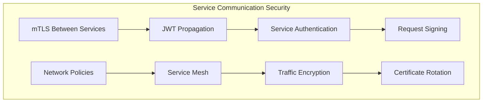

## Scalability and Performance

### Horizontal Scaling Strategy

| Component | Scaling Approach | Constraints | Metrics |
|-----------|------------------|-------------|---------|
| **API Gateway** | Stateless replicas | Session affinity for WebSocket | RPS, latency |
| **API Service** | Auto-scaling pods | Database connection limits | CPU, memory, DB connections |
| **Stream Service** | Kafka consumer groups | Partition limitations | Message lag, throughput |
| **Database** | Replica sets, sharding | Data consistency requirements | IOPS, connection count |

### Performance Optimization

**Caching Strategy**:
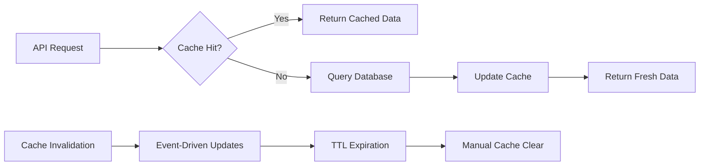

**Database Performance**:
- Read replicas for query distribution
- Indexes optimized for tenant + query patterns
- Connection pooling and prepared statements
- Query result caching with Redis

**Application Performance**:
- Reactive programming model (WebFlux)
- Asynchronous processing where possible  
- Bulk operations for data-intensive tasks
- Lazy loading and pagination

## Deployment Architecture

### Container Orchestration

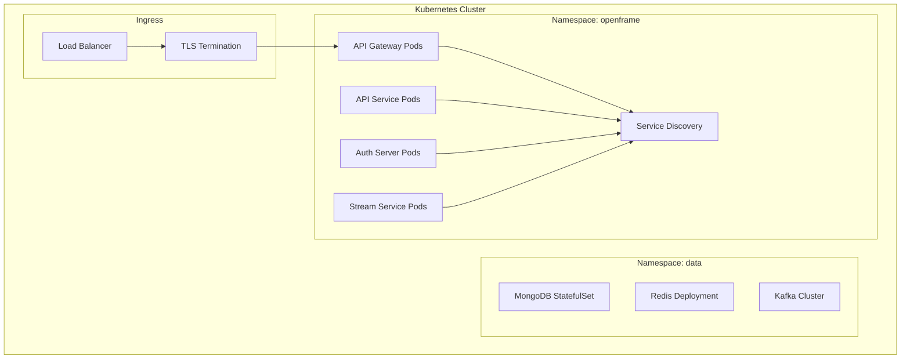

### Infrastructure Components

| Component | Technology | Purpose | HA Strategy |
|-----------|------------|---------|-------------|
| **Orchestration** | Kubernetes | Container management | Multi-zone clusters |
| **Service Mesh** | Istio | Traffic management | Envoy proxy per pod |
| **Monitoring** | Prometheus/Grafana | Observability | Federated setup |
| **Logging** | ELK Stack | Centralized logging | Multiple shipper nodes |
| **CI/CD** | GitHub Actions | Automated deployment | Blue-green deployments |

## Design Principles

### 1. **Domain-Driven Design (DDD)**
- Clear bounded contexts for each service
- Rich domain models with business logic
- Anti-corruption layers for external integrations
- Ubiquitous language across teams

### 2. **CQRS (Command Query Responsibility Segregation)**
- Separate read and write models
- GraphQL for complex queries
- REST for commands and updates
- Event sourcing for audit trails

### 3. **Microservices Best Practices**
- Single responsibility per service
- Database per service pattern
- API-first development
- Independent deployability

### 4. **Reactive Architecture**
- Non-blocking I/O throughout the stack
- Backpressure handling
- Resilience patterns (circuit breakers, bulkheads)
- Event-driven communication

### 5. **Security by Design**
- Zero-trust network model
- Defense in depth
- Principle of least privilege
- Secure defaults everywhere

## Next Steps

To dive deeper into specific architectural aspects:

1. **[Service Implementation](../development/setup/local-development.md)** - Setting up and running services
2. **[Testing Architecture](../testing/overview.md)** - Testing strategies and implementation
3. **[Contributing Guidelines](../contributing/guidelines.md)** - How to contribute to the architecture

This architecture enables OpenFrame to scale from single-tenant deployments to multi-thousand tenant SaaS operations while maintaining security, performance, and developer productivity. 🏗️