# Architecture Overview

OpenFrame follows a modern microservices architecture designed for scalability, maintainability, and developer productivity. This document provides a comprehensive overview of the system design, data flow patterns, and key architectural decisions.

## System Architecture

### High-Level Architecture

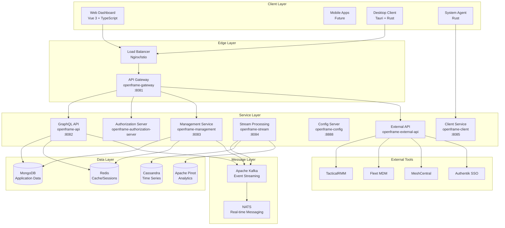

## Core Services Deep Dive

### 1. API Gateway (openframe-gateway)

**Purpose**: Central entry point for all client requests with routing, authentication, and rate limiting.

**Key Responsibilities**:
- **Request Routing**: Routes requests to appropriate backend services
- **Authentication**: Validates JWT tokens and converts cookies to headers
- **Rate Limiting**: Protects services from abuse using Redis-backed limits
- **CORS Handling**: Manages cross-origin requests for web clients
- **WebSocket Proxying**: Enables real-time communication

**Technology Stack**:
- Spring Boot 3.3.0 with Spring Cloud Gateway
- JWT authentication with cookie support
- Redis for rate limiting and session management
- WebSocket support for real-time features

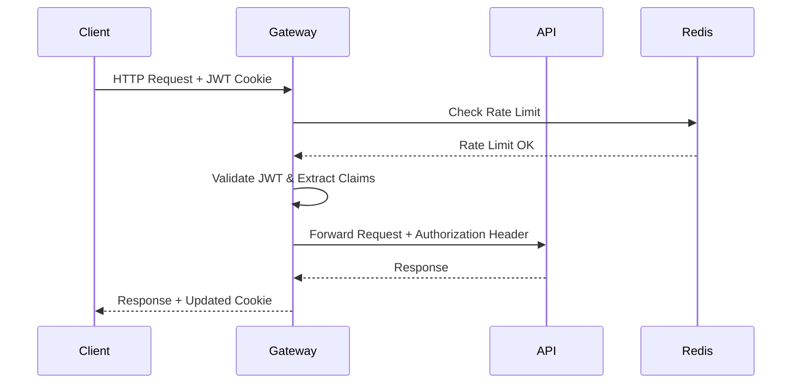

### 2. GraphQL API Service (openframe-api)

**Purpose**: Main data API providing GraphQL endpoint for frontend applications.

**Key Responsibilities**:
- **GraphQL Schema**: Defines data types and operations
- **Data Fetching**: Implements efficient data loading with DataLoaders
- **Business Logic**: Core application logic and validation
- **Multi-tenancy**: Organization-based data isolation
- **Real-time Updates**: Subscriptions for live data

**Schema Architecture**:
```graphql
type Query {
    organizations(filter: OrganizationFilter): OrganizationConnection
    devices(filter: DeviceFilter): DeviceConnection
    logs(filter: LogFilter): LogConnection
    tools(filter: ToolFilter): ToolConnection
}

type Mutation {
    createOrganization(input: CreateOrganizationInput): OrganizationResponse
    updateDevice(input: UpdateDeviceInput): DeviceResponse
    executeRemoteCommand(input: RemoteCommandInput): CommandResponse
}

type Subscription {
    deviceStatusUpdates(organizationId: ID!): DeviceStatus
    logUpdates(filter: LogFilter): LogEvent
    toolConnectionUpdates: ToolConnectionStatus
}
```

### 3. Management Service (openframe-management)

**Purpose**: Administrative operations, scheduled tasks, and system management.

**Key Responsibilities**:
- **Scheduled Jobs**: Background tasks using Spring's `@Scheduled`
- **System Health**: Monitors service health and performance
- **Tool Integration**: Manages external tool connections
- **Data Cleanup**: Maintains data retention policies
- **Release Management**: Handles software updates

**Scheduled Tasks**:
```mermaid
gantt
    title Management Service Scheduled Tasks
    dateFormat HH:mm
    axisFormat %H:%M
    
    section Health Checks
    Service Health Monitor    :crit, health, 00:00, 1m
    Database Health Check     :health-db, after health, 1m
    
    section Data Management
    Log Cleanup              :cleanup, 01:00, 10m
    Metrics Aggregation      :metrics, 02:00, 5m
    
    section Integration Tasks
    Tool Status Sync         :sync, 00:30, 2m
    Agent Update Check       :update, 03:00, 5m
```

### 4. Stream Processing Service (openframe-stream)

**Purpose**: Real-time data processing and event streaming using Apache Kafka.

**Key Responsibilities**:
- **Event Processing**: Processes Kafka streams for real-time insights
- **Data Enrichment**: Enhances incoming data with contextual information
- **Time-Series Storage**: Stores processed data in Cassandra
- **Analytics Pipeline**: Feeds data to Apache Pinot for analytics
- **Alert Generation**: Triggers notifications based on patterns

**Data Flow Architecture**:
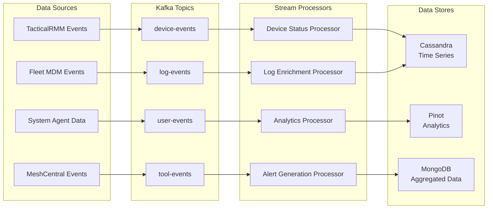

### 5. Authorization Server (openframe-authorization-server)

**Purpose**: OAuth2/OpenID Connect authentication and authorization.

**Key Responsibilities**:
- **User Authentication**: Login, registration, password reset
- **OAuth2 Flows**: Authorization code, client credentials
- **SSO Integration**: Google, Microsoft, custom OIDC providers
- **Multi-tenant Support**: Organization-based user isolation
- **Session Management**: Secure session handling

**Authentication Flows**:
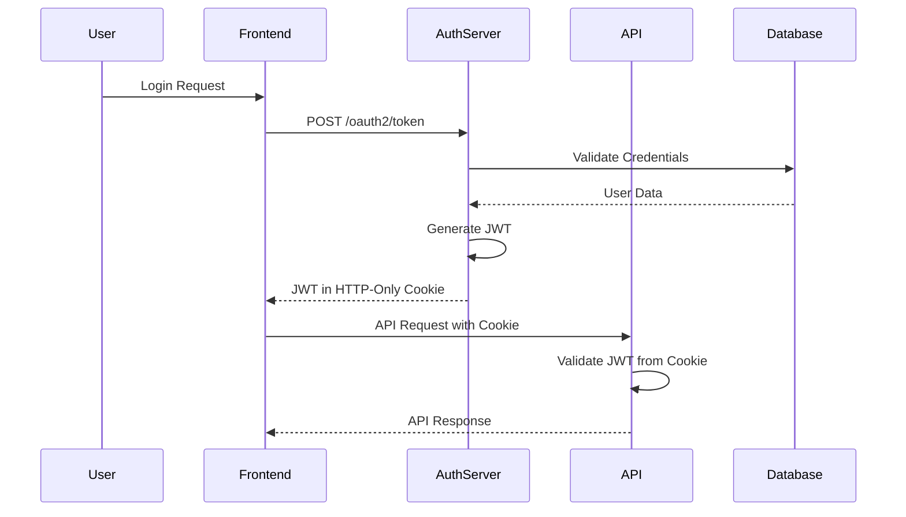

## Data Architecture

### Database Strategy

**MongoDB - Primary Application Data**
- User accounts and organizations
- Device inventory and configuration
- Tool connections and credentials
- Application settings and preferences

**Cassandra - Time-Series Data**
- Device metrics and performance data
- System logs and events
- Historical monitoring data
- Audit trails

**Apache Pinot - Real-time Analytics**
- Real-time dashboards and reporting
- Performance metrics aggregation
- Business intelligence queries
- Custom analytics views

**Redis - Caching and Sessions**
- API response caching
- Session storage
- Rate limiting counters
- Real-time notifications

### Data Flow Patterns

#### Write Path (Data Ingestion)
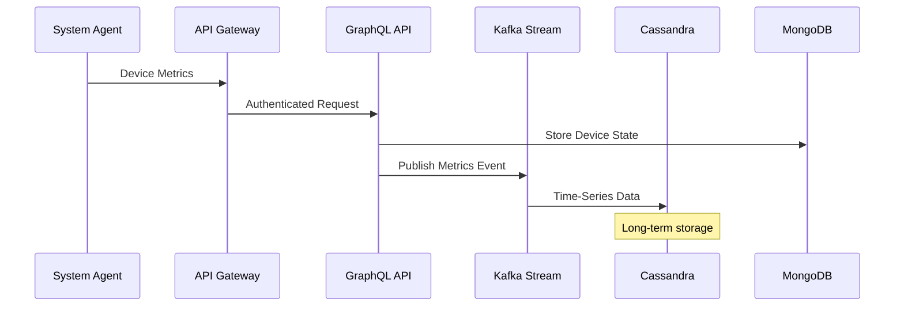

#### Read Path (Data Querying)
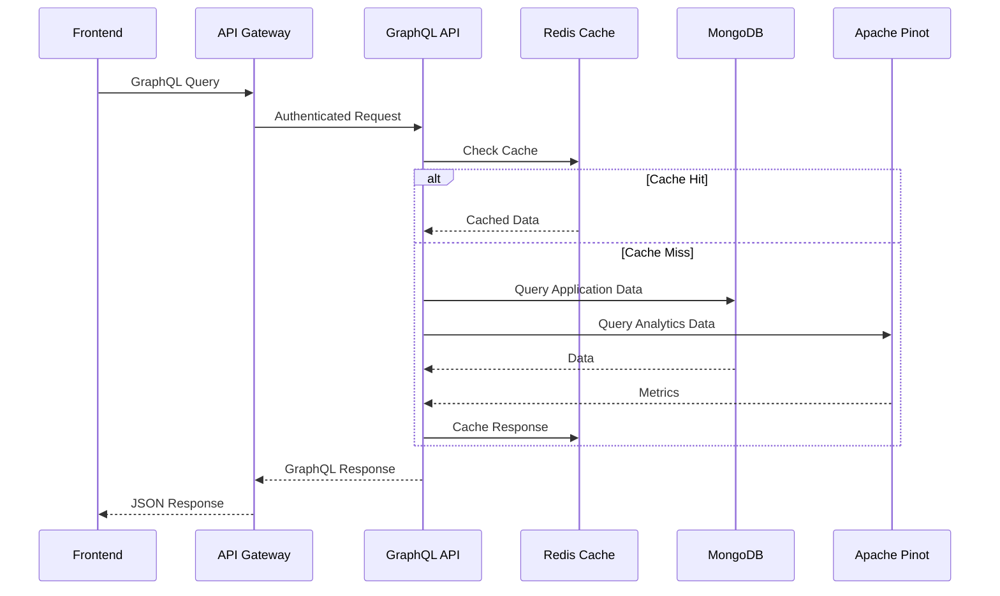

## Security Architecture

### Multi-Tenant Security Model

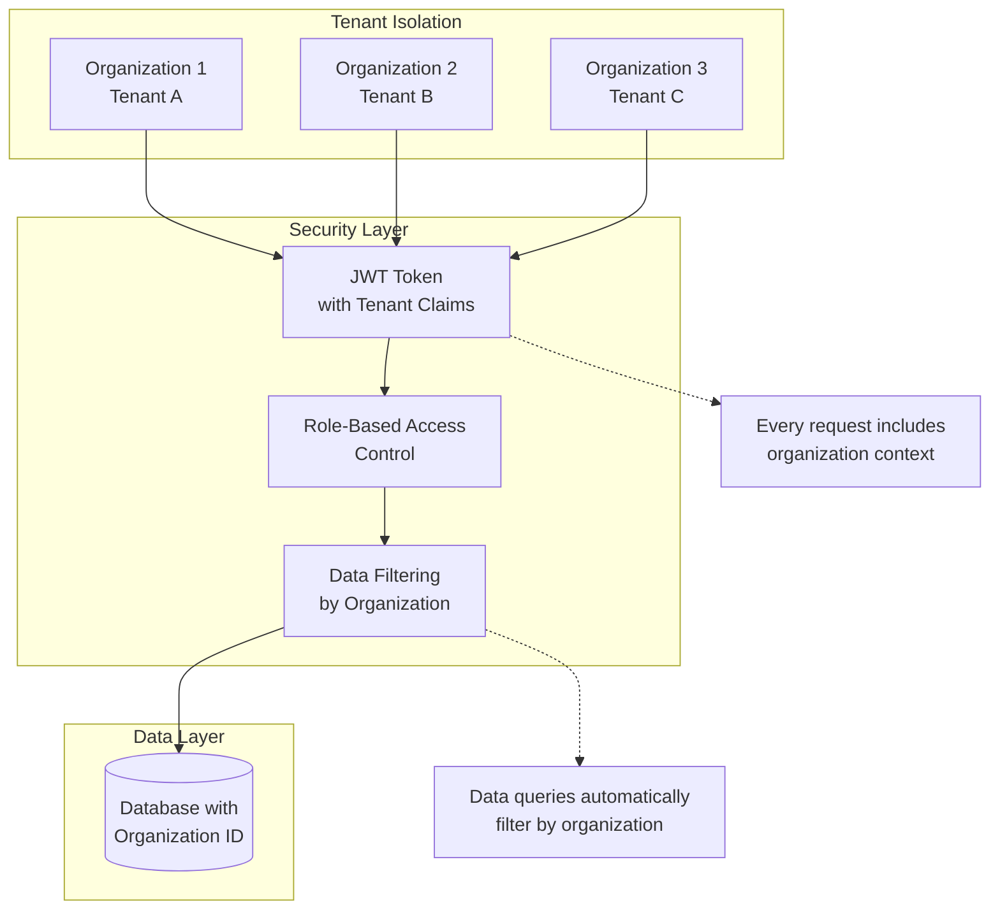

### Authentication Security Features

- **JWT with HTTP-Only Cookies**: Prevents XSS attacks
- **CSRF Protection**: Token-based CSRF protection
- **Rate Limiting**: Prevents brute force attacks
- **Password Policies**: Configurable complexity requirements
- **Account Lockout**: Temporary lockout after failed attempts
- **Audit Logging**: Complete authentication audit trail

## Integration Architecture

### External Tool Integration

OpenFrame integrates with various MSP tools through a standardized integration pattern:

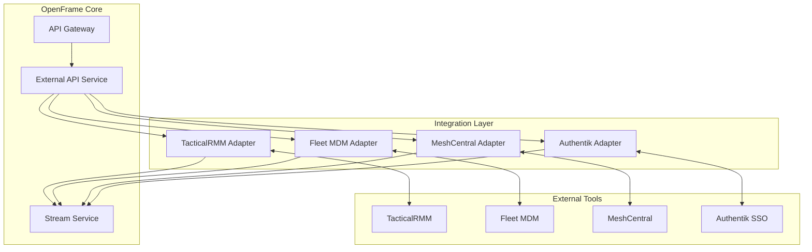

### Integration Patterns

#### Tool Connection Protocol
1. **Discovery**: Auto-detect tool availability
2. **Authentication**: Establish secure connections
3. **Schema Mapping**: Map tool data to OpenFrame models
4. **Event Streaming**: Real-time event synchronization
5. **Error Handling**: Graceful failure management

#### Data Synchronization
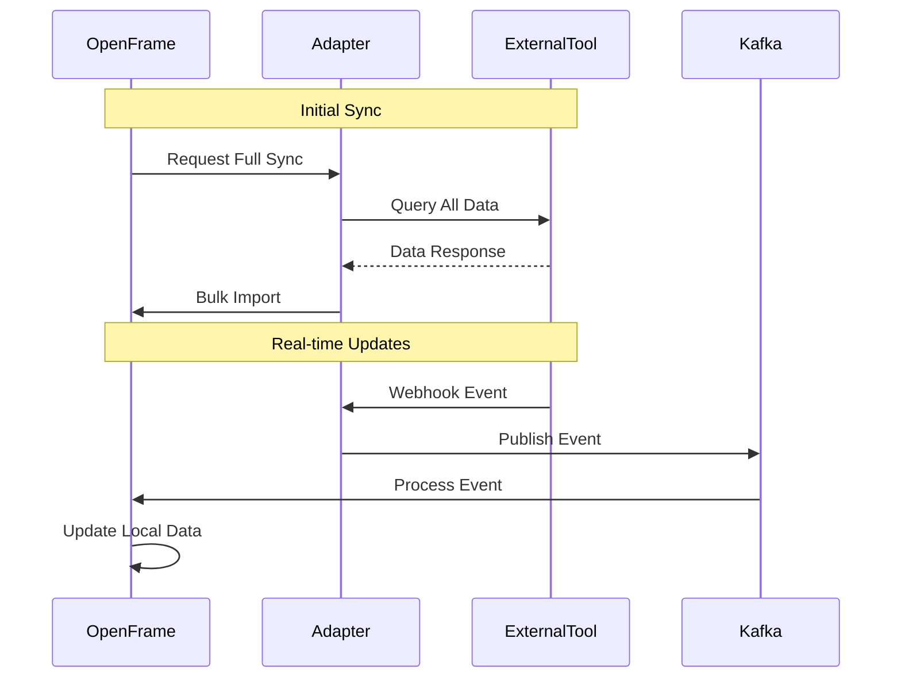

## Performance Architecture

### Scalability Patterns

#### Horizontal Scaling
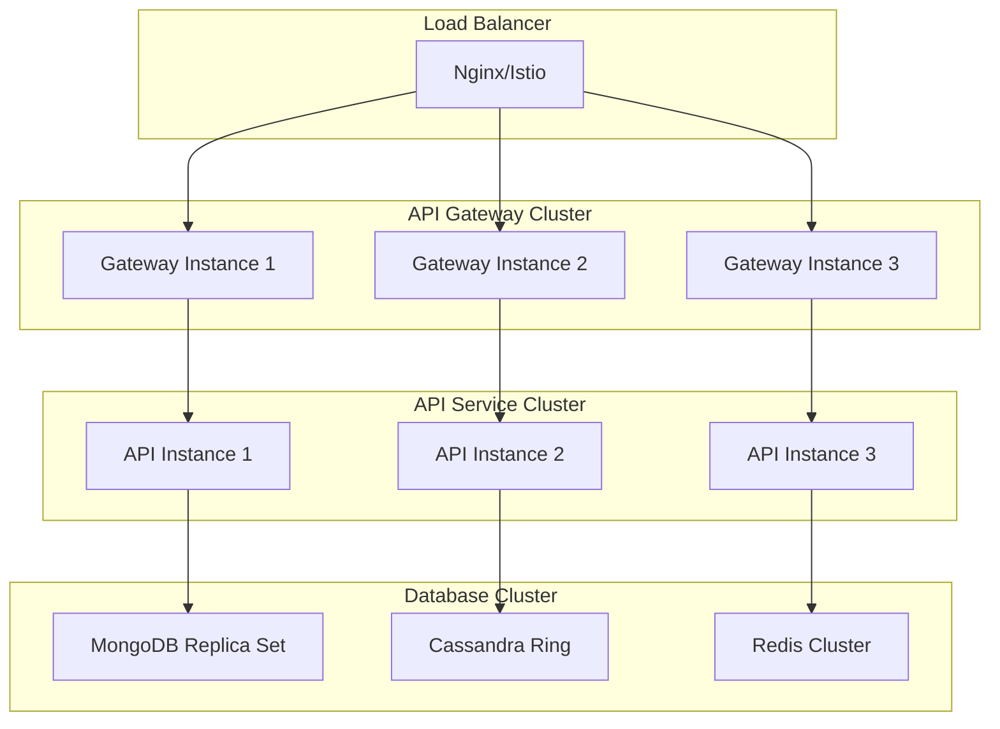

### Caching Strategy

#### Multi-Level Caching
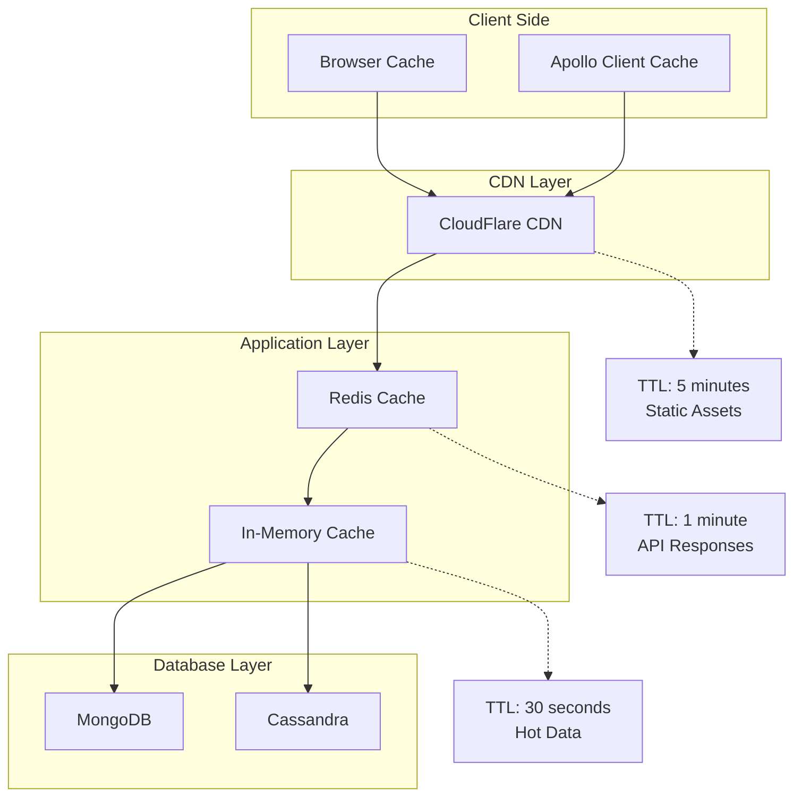

## Deployment Architecture

### Kubernetes Deployment

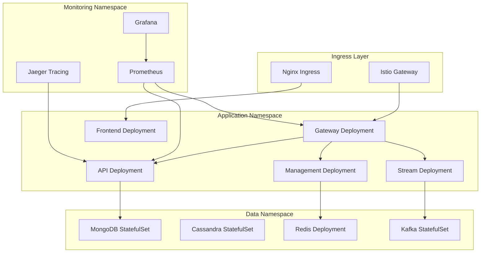

## Monitoring and Observability

### Three Pillars of Observability

#### 1. Metrics (Prometheus + Grafana)
- **Service Metrics**: Request rates, latencies, error rates
- **Business Metrics**: Active users, API usage, feature adoption
- **Infrastructure Metrics**: CPU, memory, disk, network utilization

#### 2. Logging (ELK Stack)
- **Application Logs**: Structured JSON logging with correlation IDs
- **Access Logs**: HTTP request/response logging
- **Audit Logs**: Security and compliance tracking

#### 3. Tracing (Jaeger)
- **Distributed Tracing**: Request flow across microservices
- **Performance Analysis**: Identify bottlenecks and optimize
- **Error Investigation**: Root cause analysis for failures

### Health Check Architecture

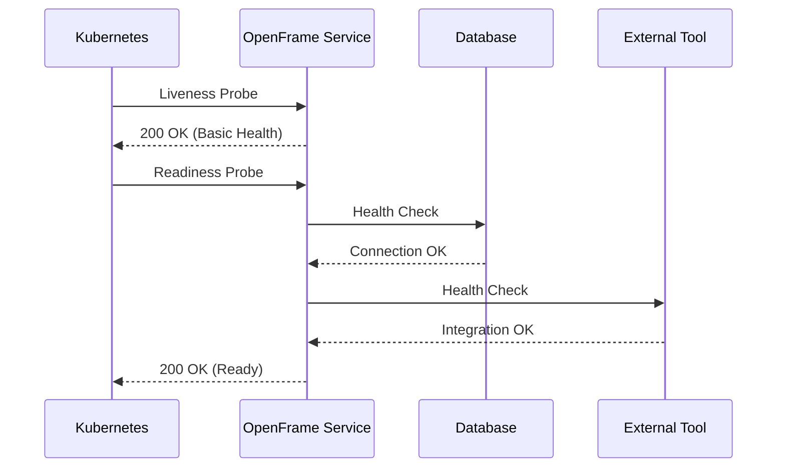

## Key Architectural Decisions

### 1. Microservices vs Monolith
**Decision**: Microservices architecture
**Rationale**: 
- Independent scaling of components
- Technology diversity (Java, Rust, TypeScript)
- Team autonomy and faster development cycles
- Fault isolation and resilience

### 2. GraphQL vs REST
**Decision**: GraphQL for main API, REST for external integrations
**Rationale**:
- GraphQL provides better developer experience for frontend
- Single endpoint reduces network overhead
- Strong typing and introspection
- REST for external tools due to wider compatibility

### 3. Event Streaming with Kafka
**Decision**: Apache Kafka for event streaming (not NiFi)
**Rationale**:
- High throughput and low latency
- Strong ecosystem and community support
- Natural fit with microservices architecture
- Excellent monitoring and operational tools

### 4. Multi-Database Strategy
**Decision**: Use appropriate database for each use case
**Rationale**:
- MongoDB for application data (document flexibility)
- Cassandra for time-series (write-heavy workloads)
- Redis for caching (in-memory performance)
- Pinot for analytics (real-time OLAP)

### 5. Container-First Deployment
**Decision**: Kubernetes-native deployment
**Rationale**:
- Cloud portability
- Automatic scaling and recovery
- Standardized deployment patterns
- Rich ecosystem of tools and operators

## Future Architecture Considerations

### Planned Enhancements

1. **Service Mesh Evolution**: Full Istio service mesh with advanced traffic management
2. **Event Sourcing**: Implement event sourcing for critical business entities
3. **CQRS Implementation**: Separate read/write models for better performance
4. **Multi-Region Deployment**: Geographic distribution for global customers
5. **AI/ML Pipeline**: Dedicated machine learning infrastructure for advanced analytics

### Technology Roadmap

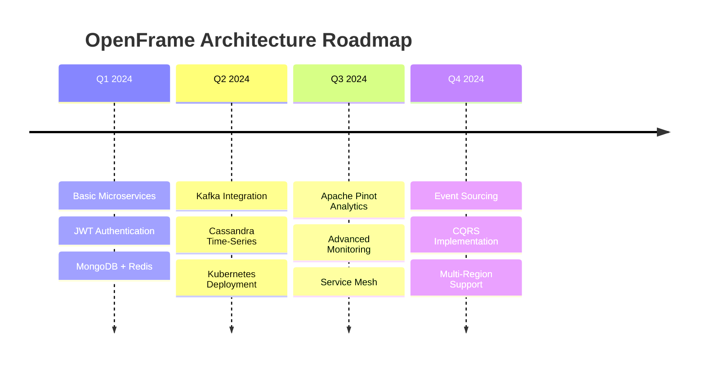

---

This architecture overview provides the foundation for understanding OpenFrame's design principles and implementation patterns. For specific implementation details, refer to the individual service documentation and code examples.