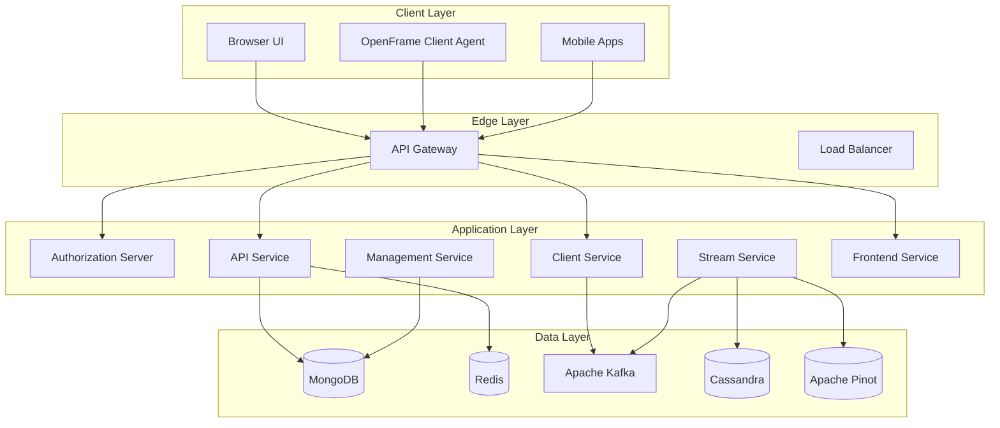
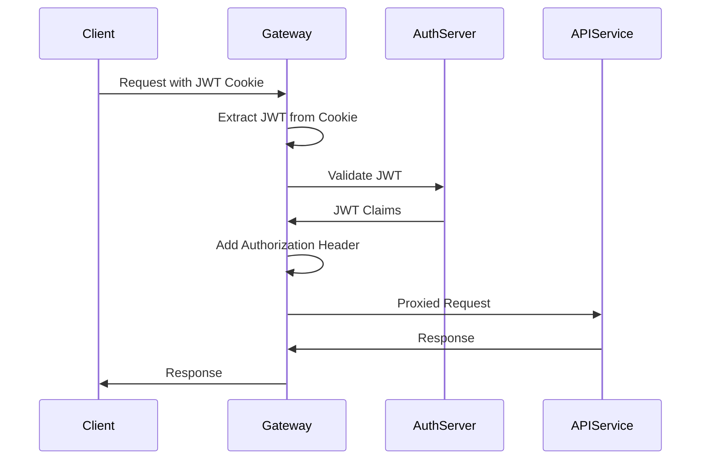
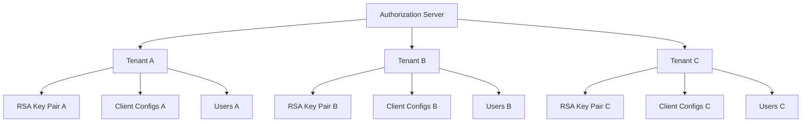
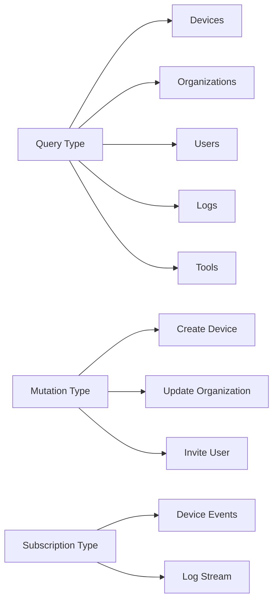
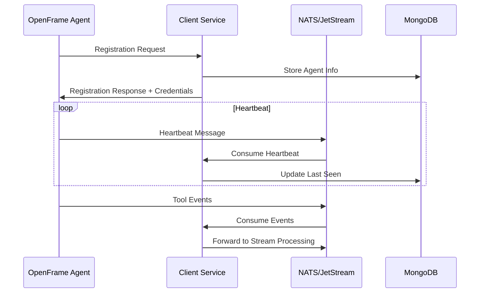
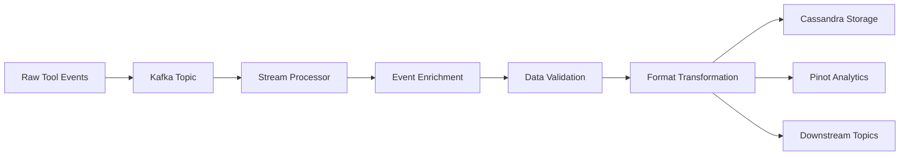
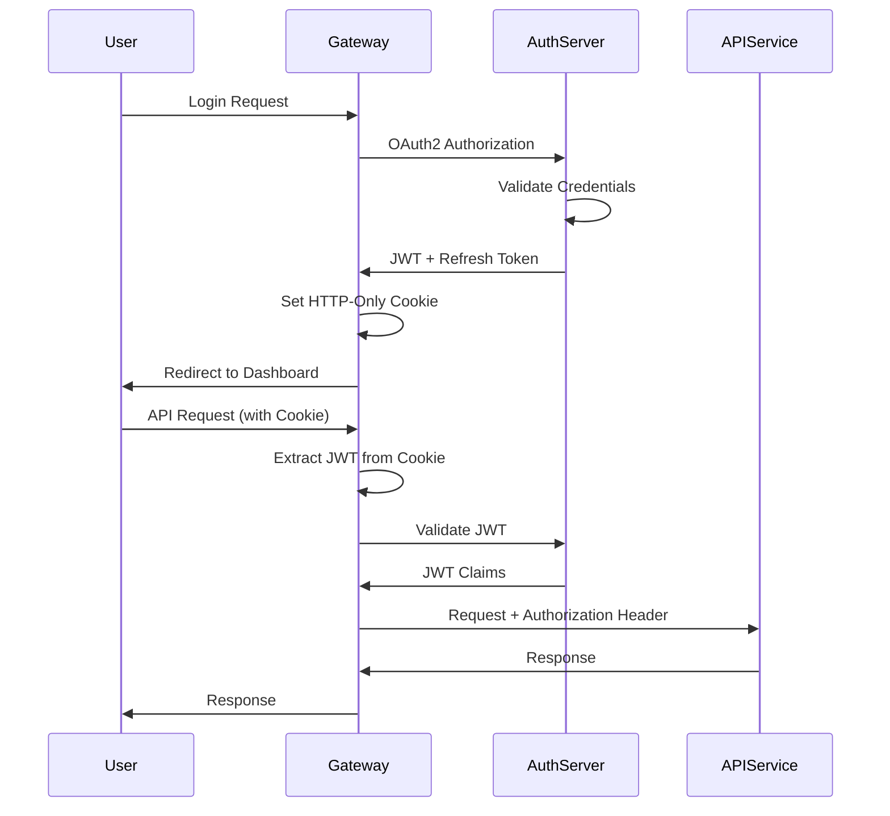
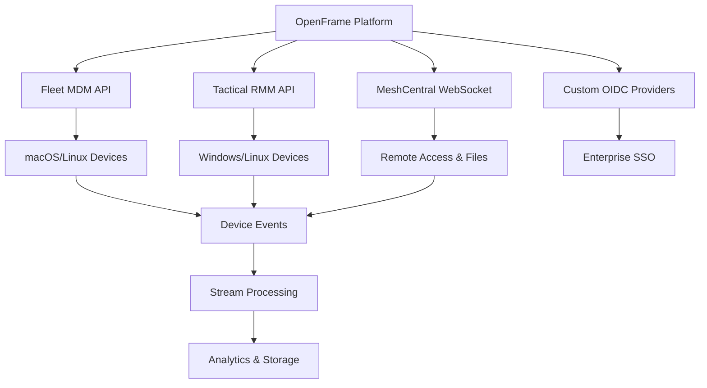
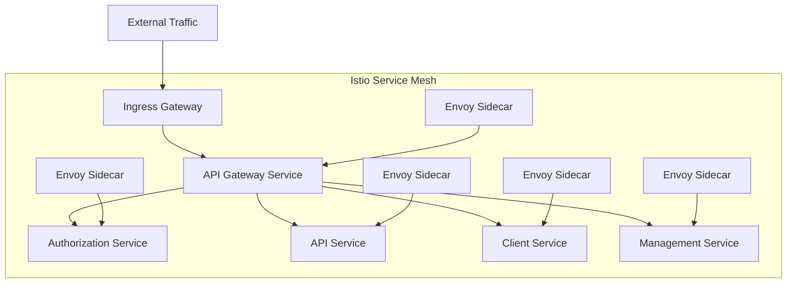

# Architecture Overview

OpenFrame is a **distributed microservices platform** designed for multi-tenant MSP operations. This guide provides a comprehensive overview of the system architecture, component relationships, and key design decisions.

## High-Level Architecture



## Core Services

### API Gateway (`openframe-gateway-service`)

**Purpose**: Edge routing, security enforcement, and WebSocket proxying

**Key Responsibilities**:
- JWT validation with multi-issuer support
- API key authentication for external integrations
- Rate limiting and request throttling
- WebSocket routing for real-time features
- CORS handling and origin sanitization

**Technology Stack**:
- Spring Cloud Gateway
- Spring Security OAuth2 Resource Server
- Redis for rate limiting
- WebSocket proxy configuration

**Port**: 8080 (main entry point)

#### Security Model



### Authorization Server (`openframe-authorization-server`)

**Purpose**: Multi-tenant OAuth2/OIDC identity provider

**Key Responsibilities**:
- Tenant-scoped OAuth2 authorization
- Per-tenant RSA signing keys
- SSO integration (Google, Microsoft, custom OIDC)
- User registration and invitation flows
- Tenant discovery and domain routing

**Technology Stack**:
- Spring Authorization Server
- MongoDB for client and user storage
- Custom tenant resolution
- Dynamic client registration

**Port**: 8081

#### Tenant Isolation



### API Service (`openframe-api-service`)

**Purpose**: Internal GraphQL and REST API layer

**Key Responsibilities**:
- GraphQL API for frontend applications
- REST controllers for management operations
- Data aggregation and transformation
- Business logic processing
- Integration with external tools

**Technology Stack**:
- Spring Boot with Netflix DGS (GraphQL)
- MongoDB for primary data storage
- Redis for caching and sessions
- Apache Kafka for event publishing

**Port**: 8082

#### GraphQL Schema Structure



### Client Service (`openframe-client-service`)

**Purpose**: Agent and machine interaction layer

**Key Responsibilities**:
- Agent registration and authentication
- Machine lifecycle management
- Heartbeat processing and health monitoring
- Tool agent ID transformation
- Event forwarding to streaming layer

**Technology Stack**:
- Spring Boot
- NATS/JetStream for agent communication
- MongoDB for agent and machine storage
- Custom agent authentication

**Port**: 8084

#### Agent Communication Flow



### Management Service (`openframe-management-service`)

**Purpose**: Platform automation and maintenance

**Key Responsibilities**:
- Integrated tool lifecycle management
- Database and streaming infrastructure initialization
- Scheduled maintenance tasks (ShedLock coordination)
- Platform health monitoring and reporting
- Release management and version control

**Technology Stack**:
- Spring Boot with Spring Scheduling
- ShedLock for distributed coordination
- Apache Pinot initialization
- NATS stream configuration
- Debezium connector management

**Port**: 8083

### Stream Service (`openframe-stream-service`)

**Purpose**: Real-time event processing and enrichment

**Key Responsibilities**:
- Kafka Streams processing pipelines
- Event deserialization and normalization
- Data enrichment from multiple sources
- Tool-specific event transformation
- Delivery to analytics and storage systems

**Technology Stack**:
- Apache Kafka + Kafka Streams
- Custom deserializers for tool events
- Cassandra for time-series storage
- Apache Pinot for real-time analytics

**Processing Flow**:



### Frontend Service (`openframe-frontend`)

**Purpose**: Vue.js single-page application

**Key Responsibilities**:
- Modern responsive web interface
- Real-time updates via WebSockets
- GraphQL client with Apollo
- State management with Pinia
- Progressive Web App capabilities

**Technology Stack**:
- Vue 3 with Composition API
- TypeScript with strict type checking
- PrimeVue UI components
- Apollo GraphQL Client
- Vite build system

**Port**: 3000 (development), served via Gateway in production

## Data Layer Architecture

### Primary Data Storage (MongoDB)

**Collections and Purpose**:

| Collection | Purpose | Indexes |
|------------|---------|---------|
| **users** | User accounts and authentication | email, organizationId |
| **organizations** | Tenant organizations | slug, domain |
| **devices** | Managed devices and endpoints | organizationId + status, lastSeen |
| **installedAgents** | Agent installations | deviceId, toolType |
| **toolConnections** | External tool configurations | organizationId, connectionType |
| **apiKeys** | API access keys | keyId, organizationId |

### Caching Layer (Redis)

**Usage Patterns**:
- **Session Storage**: User sessions and JWT claims
- **Rate Limiting**: API request throttling
- **Temporary Data**: Password reset tokens, verification codes
- **Cache**: Frequently accessed reference data

**Key Structures**:
```text
session:<session_id>        # User session data
rate_limit:<api_key>:<endpoint>  # Rate limiting counters
auth_token:<token_id>       # JWT blacklist/validation
config:<tenant>:<key>       # Cached configuration values
```

### Event Streaming (Apache Kafka)

**Topic Structure**:

| Topic | Purpose | Partitions | Retention |
|-------|---------|------------|-----------|
| **device-events** | Device status and lifecycle | 12 | 7 days |
| **agent-heartbeats** | Agent health monitoring | 6 | 1 day |
| **tool-integrations** | External tool events | 12 | 30 days |
| **audit-logs** | Security and compliance | 3 | 90 days |
| **system-events** | Platform internal events | 3 | 7 days |

### Time-Series Storage (Cassandra)

**Keyspace and Tables**:
```cql
-- Unified log events
CREATE TABLE openframe.unified_log_events (
    device_id uuid,
    timestamp timestamp,
    event_type text,
    severity text,
    message text,
    metadata map<text, text>,
    PRIMARY KEY (device_id, timestamp)
) WITH CLUSTERING ORDER BY (timestamp DESC);

-- Performance metrics
CREATE TABLE openframe.device_metrics (
    device_id uuid,
    metric_type text,
    timestamp timestamp,
    value double,
    tags map<text, text>,
    PRIMARY KEY ((device_id, metric_type), timestamp)
) WITH CLUSTERING ORDER BY (timestamp DESC);
```

### Analytics Engine (Apache Pinot)

**Table Schemas**:
- **Device Performance**: Real-time device metrics aggregation
- **Log Analytics**: Searchable log events with full-text indexing
- **Usage Analytics**: Platform usage patterns and trends
- **Security Events**: Authentication and authorization auditing

## Security Architecture

### Authentication Flow



### Multi-Tenant Security

**Tenant Isolation Mechanisms**:
1. **Database Level**: Collection/table prefixes and filters
2. **Application Level**: Tenant context propagation
3. **API Level**: JWT claims validation
4. **Network Level**: Service mesh policies (Istio)

**JWT Claims Structure**:
```json
{
  "sub": "user_id",
  "email": "user@example.com", 
  "tenant": "tenant_slug",
  "organizationId": "org_id",
  "roles": ["ADMIN", "USER"],
  "permissions": ["device:read", "org:write"],
  "iss": "https://tenant.openframe.ai",
  "exp": 1640995200
}
```

## Integration Architecture

### External Tool Integration

OpenFrame integrates with multiple MSP tools through standardized interfaces:



### SDK and Client Libraries

**Available SDKs**:
- **FleetMDM SDK**: Java client for Fleet device management
- **Tactical RMM SDK**: Java client for Tactical RMM integration
- **OpenFrame Client**: Rust agent for endpoint management
- **API Library**: Shared DTOs and service contracts

### Event-Driven Integration

**Integration Event Flow**:
1. **External Tool** generates events (device changes, alerts, etc.)
2. **OpenFrame Agent** or **Direct API** captures events
3. **Stream Service** processes and enriches events
4. **Analytics Engine** provides real-time insights
5. **Frontend** displays updates via WebSocket

## Deployment Architecture

### Container Orchestration

OpenFrame services are designed for **Kubernetes deployment** with the following characteristics:

**Service Properties**:
- **Stateless**: All services can scale horizontally
- **Health Checks**: Kubernetes liveness and readiness probes
- **Configuration**: ConfigMaps and Secrets integration
- **Service Mesh**: Istio for traffic management and security

**Resource Requirements**:

| Service | CPU Request | Memory Request | CPU Limit | Memory Limit |
|---------|-------------|----------------|-----------|--------------|
| **Gateway** | 500m | 512Mi | 1000m | 1Gi |
| **API** | 1000m | 1Gi | 2000m | 2Gi |
| **Authorization** | 500m | 512Mi | 1000m | 1Gi |
| **Client** | 500m | 512Mi | 1000m | 1Gi |
| **Management** | 250m | 256Mi | 500m | 512Mi |
| **Stream** | 1000m | 1Gi | 2000m | 2Gi |

### Data Persistence

**Storage Classes**:
- **MongoDB**: Persistent volumes with backup snapshots
- **Cassandra**: Distributed storage with replication factor 3
- **Kafka**: Persistent volumes for topic data
- **Redis**: Memory with persistence for durability

### Networking and Service Mesh



**Service Mesh Benefits**:
- **mTLS**: Automatic service-to-service encryption
- **Traffic Management**: Load balancing, circuit breaking, retries
- **Observability**: Distributed tracing and metrics
- **Security Policies**: Fine-grained access control

## Performance and Scalability

### Horizontal Scaling Strategy

**Scalable Components**:
- **API Gateway**: Multiple replicas behind load balancer
- **API Service**: Stateless, can scale based on CPU/memory
- **Authorization Server**: Multiple instances with shared state
- **Stream Service**: Kafka consumer groups for parallel processing

**Scaling Triggers**:
- **CPU Utilization**: > 70% average
- **Memory Utilization**: > 80% average  
- **Request Queue Length**: > 100 pending requests
- **Response Time**: > 1000ms p95 latency

### Database Performance

**MongoDB Scaling**:
- **Replica Sets**: Read scalability and high availability
- **Sharding**: Horizontal partitioning by tenant
- **Indexing Strategy**: Compound indexes for query optimization

**Cassandra Scaling**:
- **Cluster Expansion**: Add nodes for increased capacity
- **Partitioning**: Time-based partitioning for log data
- **Compaction**: Optimized for time-series workloads

**Redis Scaling**:
- **Cluster Mode**: Distributed caching across nodes
- **Sentinel**: High availability and failover
- **Memory Optimization**: Eviction policies and compression

## Monitoring and Observability

### Metrics Collection

**Prometheus Metrics**:
- **Application Metrics**: Custom business metrics
- **JVM Metrics**: Heap usage, GC performance, thread pools
- **Database Metrics**: Connection pools, query performance
- **HTTP Metrics**: Request rates, error rates, latency

### Logging Strategy

**Structured Logging**:
```json
{
  "timestamp": "2024-01-15T10:30:00.000Z",
  "level": "INFO",
  "service": "openframe-api",
  "tenant": "acme-corp",
  "userId": "user_123",
  "requestId": "req_456",
  "message": "User authenticated successfully",
  "metadata": {
    "method": "POST",
    "endpoint": "/graphql",
    "responseTime": 120
  }
}
```

### Distributed Tracing

**Jaeger Integration**:
- **Request Tracing**: End-to-end request flow
- **Service Dependencies**: Automatic service map generation
- **Performance Analysis**: Latency bottleneck identification

## Design Principles

### Architectural Principles

1. **Domain-Driven Design**: Services organized around business capabilities
2. **API-First**: Well-defined contracts between services
3. **Event-Driven**: Loose coupling through asynchronous messaging
4. **Fail-Fast**: Early error detection and graceful degradation
5. **Observability**: Built-in metrics, logging, and tracing

### Development Principles

1. **Convention over Configuration**: Sensible defaults with override options
2. **Immutable Infrastructure**: Containerized, reproducible deployments
3. **Configuration as Code**: GitOps approach to infrastructure management
4. **Security by Default**: Secure configurations out of the box

### Operational Principles

1. **Zero-Downtime Deployments**: Blue-green and canary deployment strategies
2. **Self-Healing**: Automatic recovery from transient failures
3. **Horizontal Scaling**: Scale out rather than scale up
4. **Data Consistency**: Eventually consistent with strong consistency where needed

---

## Next Steps

To dive deeper into specific architectural components:

1. **[Testing Overview](../testing/overview.md)** - Learn testing strategies for microservices
2. **[Contributing Guidelines](../contributing/guidelines.md)** - Understand development workflows
3. **[Local Development Guide](../setup/local-development.md)** - Set up advanced development environment

---

**Need help understanding the architecture?** Join our OpenMSP Slack community: https://join.slack.com/t/openmsp/shared_invite/zt-36bl7mx0h-3~U2nFH6nqHqoTPXMaHEHA