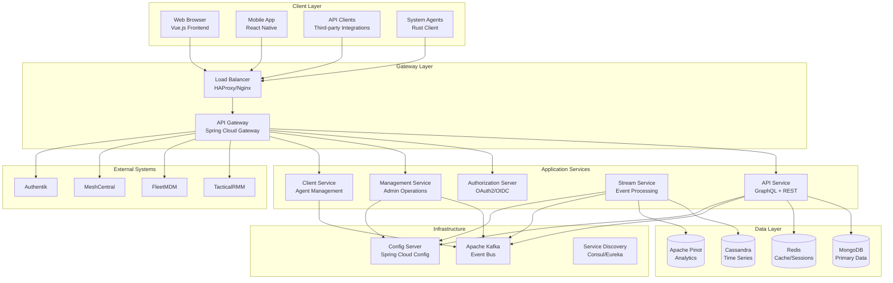
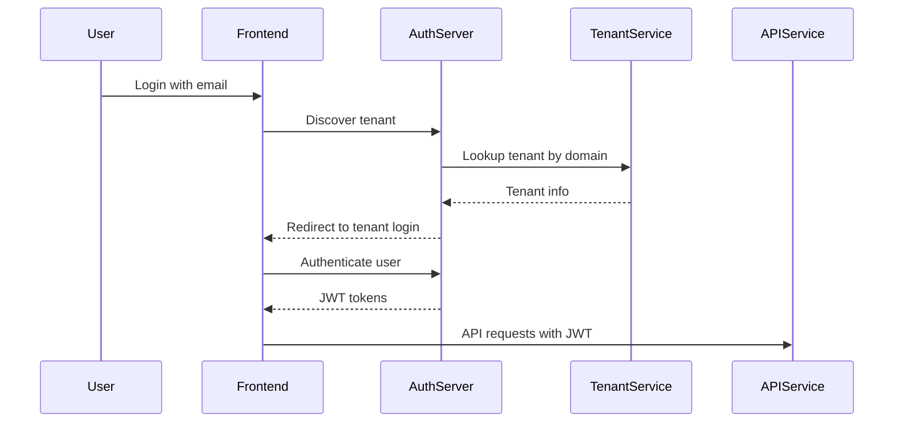
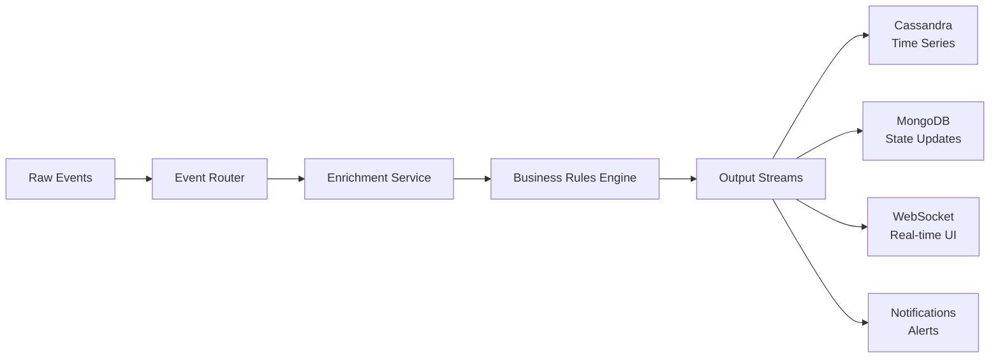
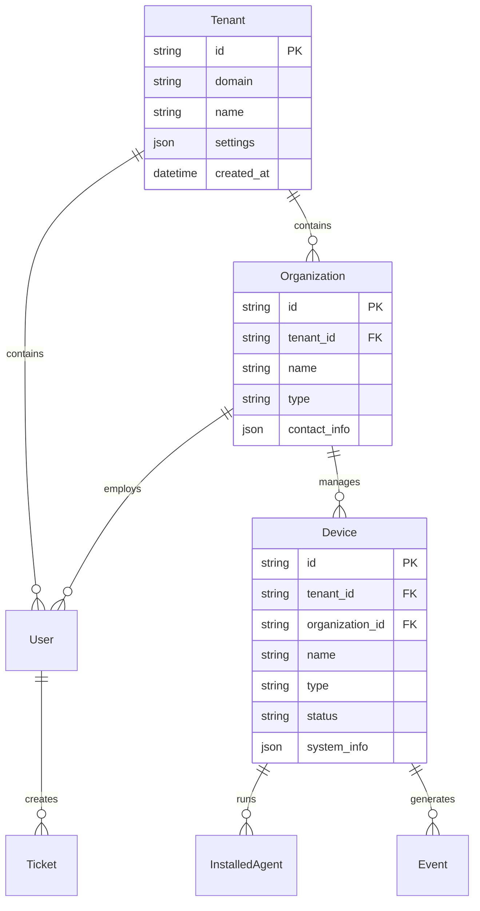
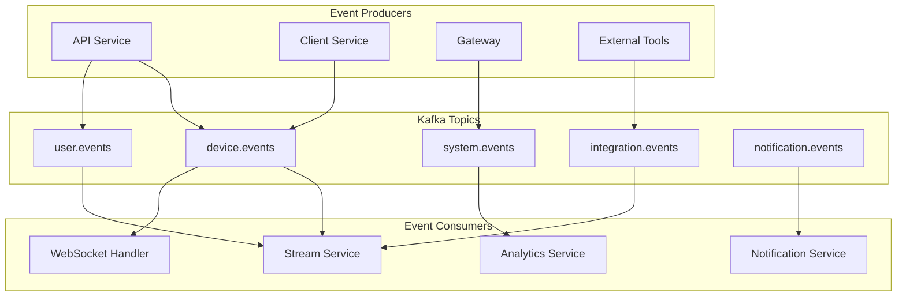
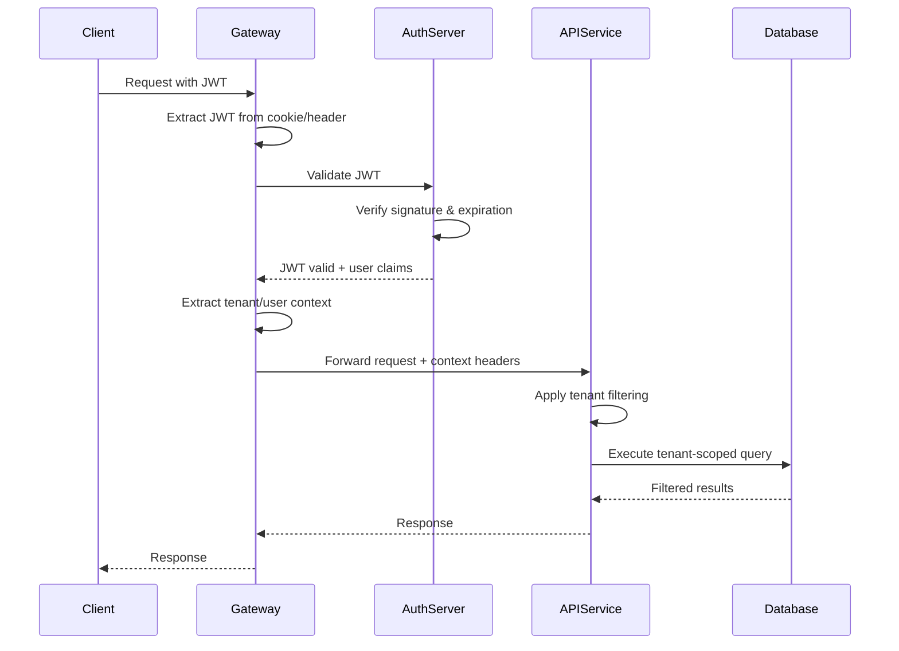
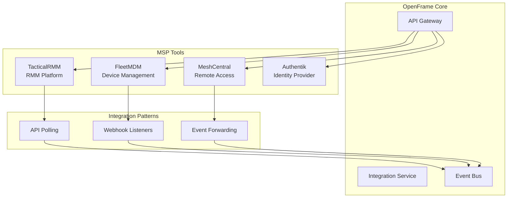
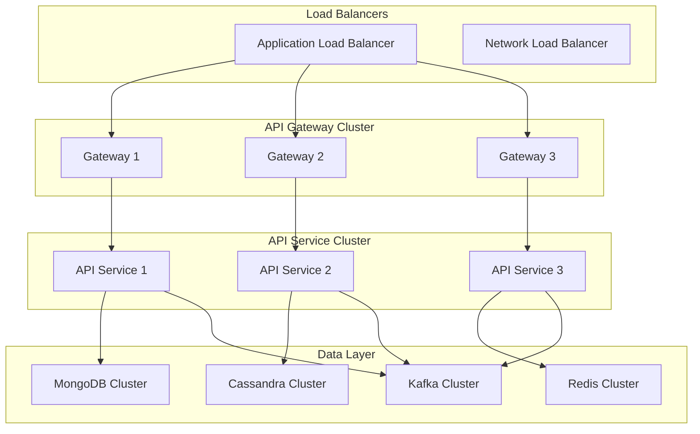

# Architecture Overview

OpenFrame is a distributed, event-driven microservices platform designed for scalability, resilience, and multi-tenancy. This guide provides a comprehensive overview of the system architecture, design patterns, and key components.

## System Architecture

### High-Level Architecture



### Core Principles

| Principle | Implementation | Benefits |
|-----------|----------------|----------|
| **Microservices** | Service-per-domain architecture | Independent deployment, scaling |
| **Event-Driven** | Kafka-based async messaging | Loose coupling, resilience |
| **Multi-Tenant** | Tenant isolation at all layers | Secure data separation |
| **API-First** | GraphQL/REST contracts | Client flexibility, parallel development |
| **Cloud-Native** | Containerized, Kubernetes-ready | Portability, scalability |
| **Security-First** | OAuth2, JWT, encryption everywhere | Enterprise-grade security |

## Service Architecture

### API Gateway (openframe-gateway)

The entry point for all client requests, providing routing, authentication, and cross-cutting concerns.

**Key Responsibilities:**
- Request routing to backend services
- JWT token validation and extraction
- Rate limiting and throttling
- CORS handling for web clients
- WebSocket proxy for real-time features
- Integration proxy for external tools

**Technology Stack:**
- Spring Cloud Gateway for routing
- Spring Security for authentication
- Redis for rate limiting storage
- WebSocket support for real-time features

**Configuration Example:**
```yaml
spring:
  cloud:
    gateway:
      routes:
        - id: api-route
          uri: lb://openframe-api
          predicates:
            - Path=/graphql,/api/**
          filters:
            - name: RequestRateLimiter
              args:
                redis-rate-limiter.replenishRate: 10
                redis-rate-limiter.burstCapacity: 20
```

### API Service (openframe-api)

The core business logic service providing GraphQL and REST APIs.

**Key Responsibilities:**
- GraphQL schema and resolvers
- Business logic implementation
- Data access orchestration
- Multi-tenant data filtering
- Real-time subscriptions
- External service integration

**Technology Stack:**
- Spring Boot 3.3+ with Java 21
- Netflix DGS for GraphQL
- MongoDB for primary data storage
- Redis for caching and sessions
- Kafka for event publishing

**GraphQL Schema Design:**
```graphql
# Core domain types
type Organization {
  id: ID!
  name: String!
  devices(filter: DeviceFilter): DeviceConnection
  users(filter: UserFilter): UserConnection
}

type Device {
  id: ID!
  name: String!
  type: DeviceType!
  status: DeviceStatus!
  organization: Organization!
  installedAgents: [InstalledAgent!]!
}

# Connection patterns for pagination
type DeviceConnection {
  edges: [DeviceEdge!]!
  pageInfo: PageInfo!
  totalCount: Int!
}
```

### Authorization Server (openframe-authorization-server)

OAuth2/OpenID Connect provider for authentication and authorization.

**Key Responsibilities:**
- User authentication (username/password, OAuth providers)
- Token issuance and validation
- Multi-factor authentication support
- Session management
- Tenant discovery and routing
- SSO integration

**OAuth2 Flow Support:**
- Authorization Code Flow (web applications)
- Client Credentials Flow (service-to-service)
- Device Authorization Flow (CLI/mobile)
- PKCE for public clients

**Multi-Tenant Authentication:**


### Management Service (openframe-management)

Administrative service for system management and scheduled operations.

**Key Responsibilities:**
- Scheduled task execution
- System health monitoring
- Database maintenance operations
- Integration synchronization
- Release version management
- Agent registration secret generation

**Scheduled Operations:**
- Cleanup expired sessions and tokens
- Synchronize data with external tools
- Generate system reports
- Update agent configurations
- Perform database maintenance

### Stream Service (openframe-stream)

Event processing service for real-time data pipelines using Apache Kafka.

**Key Responsibilities:**
- Event stream processing
- Data enrichment and transformation
- Real-time analytics computation
- Integration event handling
- Alerting and notification triggers

**Event Processing Pipeline:**


**Event Types:**
- Device events (status, metrics, alerts)
- User activity events
- System events (errors, performance)
- Integration events (external tool data)
- Business events (tickets, workflows)

### Client Service (openframe-client)

Agent management service for system agents and device communication.

**Key Responsibilities:**
- Agent registration and authentication
- Agent configuration management
- Secure communication channels
- Agent update distribution
- Device data collection coordination

## Data Architecture

### Multi-Tenant Data Model

OpenFrame implements multi-tenancy at the database level to ensure complete data isolation:



### Database Selection by Use Case

| Database | Use Cases | Characteristics |
|----------|-----------|-----------------|
| **MongoDB** | User data, organizations, devices, configuration | Document flexibility, ACID transactions |
| **Cassandra** | Time-series data, metrics, logs | High write throughput, time-based queries |
| **Redis** | Sessions, cache, rate limiting | In-memory speed, pub/sub capability |
| **Apache Pinot** | Real-time analytics, dashboards | OLAP queries, real-time ingestion |

### Data Consistency Patterns

**Strong Consistency (MongoDB):**
- User profiles and authentication
- Organization and tenant data
- Device configuration and state
- Financial and billing data

**Eventual Consistency (Cassandra):**
- Device metrics and telemetry
- Application logs and events
- Historical reporting data
- Analytics and aggregations

## Event-Driven Architecture

### Event Bus Design

OpenFrame uses Apache Kafka as the central event bus with specific topic organization:



### Event Schema Design

Events follow a consistent schema for processing and routing:

```json
{
  "eventId": "uuid-v4",
  "eventType": "device.status.changed",
  "tenantId": "tenant-uuid",
  "organizationId": "org-uuid", 
  "timestamp": "2024-01-15T10:30:00Z",
  "source": "openframe-api",
  "data": {
    "deviceId": "device-uuid",
    "previousStatus": "online",
    "currentStatus": "offline",
    "reason": "connection_timeout"
  },
  "metadata": {
    "correlationId": "request-uuid",
    "userId": "user-uuid",
    "version": "1.0"
  }
}
```

## Security Architecture

### Authentication & Authorization Flow



### Security Layers

| Layer | Security Measures | Implementation |
|-------|------------------|----------------|
| **Network** | TLS 1.3, Network policies | Istio service mesh, K8s NetworkPolicies |
| **API Gateway** | Rate limiting, IP filtering | Redis-based rate limiter |
| **Authentication** | OAuth2, MFA, SSO | Spring Security OAuth2 |
| **Authorization** | RBAC, tenant isolation | Custom security filters |
| **Data** | Encryption at rest/transit | AES-256, TLS everywhere |
| **Application** | Input validation, OWASP compliance | Bean validation, security headers |

### Multi-Tenant Security

**Tenant Isolation:**
- Database-level tenant filtering on all queries
- JWT tokens contain tenant context
- Row-level security policies
- Network-level isolation in Kubernetes

**Data Protection:**
- Personal data encryption (PII)
- Audit logging for all data access
- Data retention policies
- GDPR compliance features

## Integration Architecture

### External Tool Integration

OpenFrame integrates with popular MSP tools through standardized adapters:



### Integration Patterns

**API Polling:**
- Scheduled data synchronization
- Error handling and retry logic
- Rate limiting compliance
- Data transformation and mapping

**Webhook Handling:**
- Secure webhook endpoints
- Event validation and authentication
- Duplicate detection
- Async processing

**Event Forwarding:**
- Real-time event streaming
- Event filtering and routing
- Transformation pipelines
- Delivery guarantees

## Performance & Scalability

### Horizontal Scaling Strategy



### Caching Strategy

**Multi-Level Caching:**
1. **Application Cache** (Caffeine/Hazelcast)
2. **Distributed Cache** (Redis)
3. **CDN Cache** (CloudFlare/AWS CloudFront)
4. **Database Cache** (MongoDB/Cassandra built-in)

**Cache Patterns:**
- **Cache-Aside**: Manual cache management
- **Write-Through**: Sync cache updates
- **Write-Behind**: Async cache updates
- **Refresh-Ahead**: Proactive cache refresh

### Performance Monitoring

Watch this architectural walkthrough covering performance and scaling:

[](https://www.youtube.com/watch?v=mibUHvcVIHs)

This video covers:
- Authentication architecture evolution
- Performance optimization strategies
- Real-world scaling challenges
- Remote file management implementation

## Technology Decisions

### Backend Technology Stack

| Technology | Version | Purpose | Rationale |
|------------|---------|---------|-----------|
| **Java** | 21 LTS | Runtime platform | Modern language features, performance, ecosystem |
| **Spring Boot** | 3.3+ | Application framework | Production-ready, extensive ecosystem |
| **Spring Cloud Gateway** | 2023.0+ | API Gateway | Native Spring integration, reactive |
| **Netflix DGS** | 7.0+ | GraphQL framework | Type-safe, schema-first development |
| **MongoDB** | 7.0+ | Primary database | Document flexibility, ACID transactions |
| **Apache Cassandra** | 4.0+ | Time-series database | High write throughput, linear scaling |
| **Apache Kafka** | 3.6+ | Event streaming | Durability, ordering, exactly-once semantics |
| **Redis** | 6.2+ | Caching/sessions | In-memory performance, clustering |

### Frontend Technology Stack

| Technology | Version | Purpose | Rationale |
|------------|---------|---------|-----------|
| **Vue.js** | 3.4+ | UI framework | Composition API, TypeScript support |
| **TypeScript** | 5.0+ | Type safety | Developer productivity, error prevention |
| **Vite** | 5.0+ | Build tool | Fast development, optimized builds |
| **Pinia** | 2.1+ | State management | Vue 3 optimized, TypeScript support |
| **PrimeVue** | 3.45+ | UI components | Enterprise components, accessibility |
| **Apollo Client** | 3.8+ | GraphQL client | Caching, real-time subscriptions |

### Infrastructure Technology Stack

| Technology | Version | Purpose | Rationale |
|------------|---------|---------|-----------|
| **Kubernetes** | 1.28+ | Container orchestration | Industry standard, vendor neutral |
| **Helm** | 3.12+ | Package manager | Templating, release management |
| **Istio** | 1.20+ | Service mesh | Traffic management, security, observability |
| **Prometheus** | 2.45+ | Metrics collection | Cloud-native monitoring standard |
| **Grafana** | 10.0+ | Observability dashboards | Rich visualization, alerting |
| **Loki** | 2.9+ | Log aggregation | Prometheus-like for logs |

## API Reference

### GraphQL Schema

The GraphQL schema is the contract between frontend and backend:

**Core Query Types:**
```graphql
type Query {
  # User and organization data
  me: User
  organizations(filter: OrganizationFilter, pagination: CursorPaginationInput): OrganizationConnection
  
  # Device management
  devices(filter: DeviceFilter, pagination: CursorPaginationInput): DeviceConnection
  device(id: ID!): Device
  
  # Logs and events
  logs(filter: LogFilter, pagination: CursorPaginationInput): LogConnection
  events(filter: EventFilter, pagination: CursorPaginationInput): EventConnection
  
  # Tools and integrations
  tools(filter: ToolFilter): [Tool!]!
  toolConnections(organizationId: ID!): [ToolConnection!]!
}
```

**Mutation Types:**
```graphql
type Mutation {
  # Organization management
  createOrganization(request: CreateOrganizationRequest!): Organization!
  updateOrganization(id: ID!, request: UpdateOrganizationRequest!): Organization!
  
  # User management
  inviteUser(request: InviteUserRequest!): Invitation!
  updateUser(id: ID!, request: UpdateUserRequest!): User!
  
  # Device operations
  updateDeviceStatus(deviceId: ID!, status: DeviceStatus!): Device!
  executeCommand(deviceId: ID!, command: String!): CommandResult!
}
```

**Subscription Types:**
```graphql
type Subscription {
  # Real-time device updates
  deviceStatusChanged(organizationId: ID!): Device!
  
  # Live event stream
  events(filter: EventFilter): Event!
  
  # Ticket updates
  ticketUpdated(organizationId: ID!): Ticket!
}
```

### REST API Endpoints

For external integrations and specific use cases:

```bash
# Authentication
POST /auth/login
POST /auth/logout
POST /auth/refresh

# External API (rate limited)
GET /api/v1/organizations
GET /api/v1/devices
POST /api/v1/events
PUT /api/v1/devices/{id}/status

# Health and monitoring
GET /actuator/health
GET /actuator/metrics
GET /actuator/prometheus
```

## Deployment Architecture

### Kubernetes Deployment

```yaml
# Example service deployment
apiVersion: apps/v1
kind: Deployment
metadata:
  name: openframe-api
spec:
  replicas: 3
  selector:
    matchLabels:
      app: openframe-api
  template:
    spec:
      containers:
      - name: api
        image: openframe/api:latest
        ports:
        - containerPort: 8081
        env:
        - name: SPRING_PROFILES_ACTIVE
          value: "production"
        - name: MONGODB_URI
          valueFrom:
            secretKeyRef:
              name: database-credentials
              key: mongodb-uri
        resources:
          requests:
            memory: "1Gi"
            cpu: "500m"
          limits:
            memory: "2Gi"
            cpu: "1000m"
        livenessProbe:
          httpGet:
            path: /actuator/health
            port: 8081
          initialDelaySeconds: 60
          periodSeconds: 30
        readinessProbe:
          httpGet:
            path: /actuator/health/readiness
            port: 8081
          initialDelaySeconds: 30
          periodSeconds: 10
```

## Next Steps

Now that you understand OpenFrame's architecture:

1. **[Set up your development environment](../setup/environment.md)**
2. **[Learn the testing strategy](../testing/overview.md)**
3. **[Contribute to the project](../contributing/guidelines.md)**

## Additional Resources

- **[Spring Boot Documentation](https://spring.io/projects/spring-boot)**
- **[GraphQL Best Practices](https://graphql.org/learn/best-practices/)**
- **[Apache Kafka Documentation](https://kafka.apache.org/documentation/)**
- **[Kubernetes Documentation](https://kubernetes.io/docs/)**
- **[Vue.js Guide](https://vuejs.org/guide/)**

---

🏗️ **Questions about the architecture?** Join our [OpenMSP Slack community](https://join.slack.com/t/openmsp/shared_invite/zt-36bl7mx0h-3~U2nFH6nqHqoTPXMaHEHA) to discuss design decisions and implementation details with the core team!