# Architecture Overview

This document provides a comprehensive overview of OpenFrame's architecture, design principles, and core components. Understanding this architecture is essential for effective development and customization.

## System Architecture Philosophy

OpenFrame follows modern architectural principles to create a scalable, maintainable, and secure MSP platform:

### Core Principles

- **Microservices Architecture**: Loosely coupled, independently deployable services
- **Event-Driven Design**: Asynchronous communication via Kafka streams
- **Domain-Driven Design**: Clear bounded contexts for business domains
- **API-First Development**: Contract-first approach with GraphQL and OpenAPI
- **Multi-Tenant Security**: Tenant isolation at all architectural layers
- **Cloud-Native**: Kubernetes-ready with container-first design

## High-Level System Overview

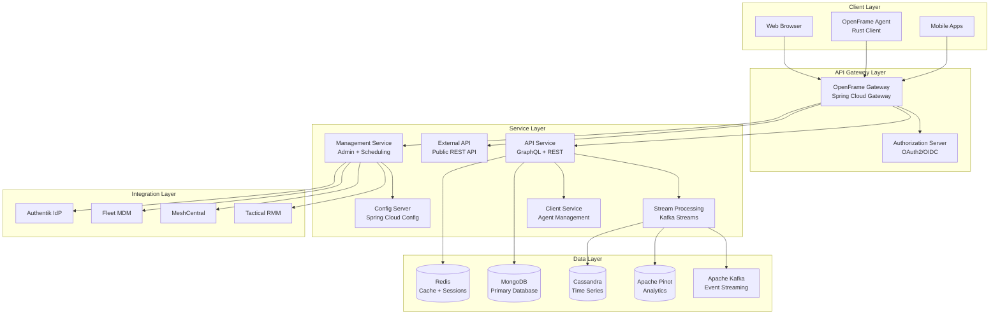

## Service Architecture Deep Dive

### 1. OpenFrame Gateway (API Gateway)

**Purpose**: Single entry point for all external traffic with routing, security, and cross-cutting concerns.

**Technology Stack**:
- Spring Cloud Gateway (reactive)
- JWT authentication with cookie support
- WebSocket proxy capabilities
- Rate limiting and circuit breakers

**Key Responsibilities**:
- Request routing and load balancing
- Authentication and authorization enforcement
- Rate limiting and DDoS protection
- WebSocket connection management
- Request/response transformation
- Circuit breaker patterns

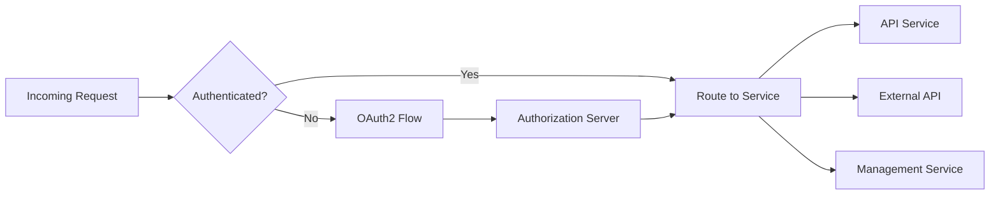

### 2. API Service Core (GraphQL + REST)

**Purpose**: Primary internal API providing GraphQL and REST endpoints for domain operations.

**Technology Stack**:
- Spring Boot with Spring Security
- Netflix DGS (GraphQL)
- MongoDB reactive repositories
- GraphQL DataLoaders for N+1 prevention

**Domain Boundaries**:
- **Device Management**: Machine registration, monitoring, status
- **Organization Management**: Client organization CRUD operations
- **User Management**: User accounts, roles, permissions
- **Event Processing**: System events and audit logging
- **Tool Integration**: External tool configuration and status

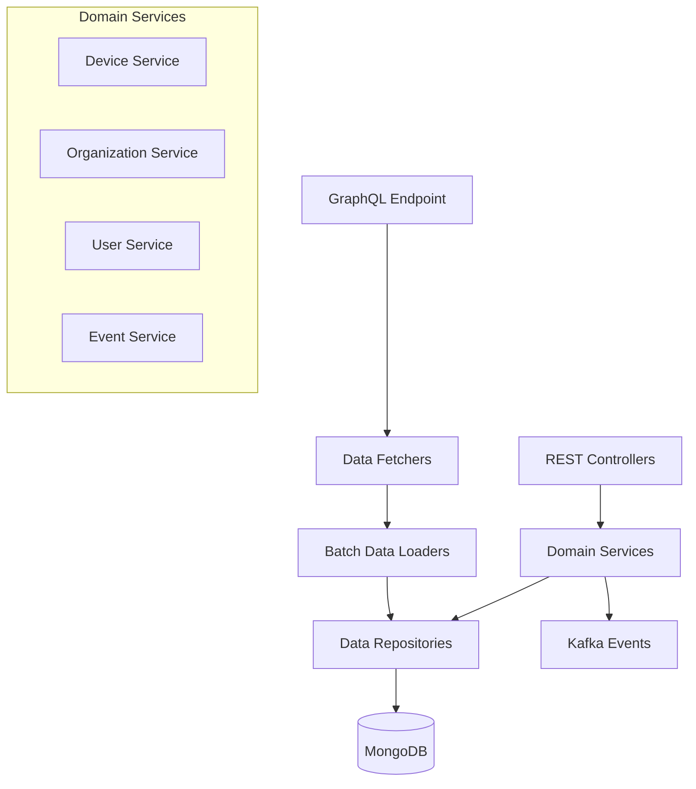

### 3. Stream Processing Service

**Purpose**: Real-time event processing, data enrichment, and analytics pipeline.

**Technology Stack**:
- Apache Kafka Streams
- Custom event processors
- Apache Pinot integration
- Cassandra time-series storage

**Data Flow**:
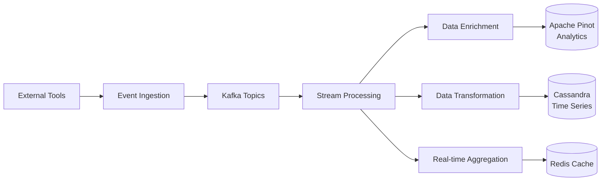

**Event Processing Patterns**:
- **Event Sourcing**: Complete audit trail of all system events
- **CQRS**: Separate read/write models for complex queries
- **Saga Pattern**: Distributed transaction management
- **Event Deduplication**: Idempotent event processing

### 4. Management Service

**Purpose**: Administrative operations, tool lifecycle management, and scheduled tasks.

**Key Functions**:
- External tool integration lifecycle
- Release version management
- Scheduled maintenance tasks
- System health monitoring
- Configuration synchronization

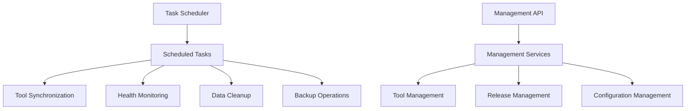

### 5. Client Service (Agent Management)

**Purpose**: Manages OpenFrame agents running on monitored endpoints.

**Agent Communication Flow**:
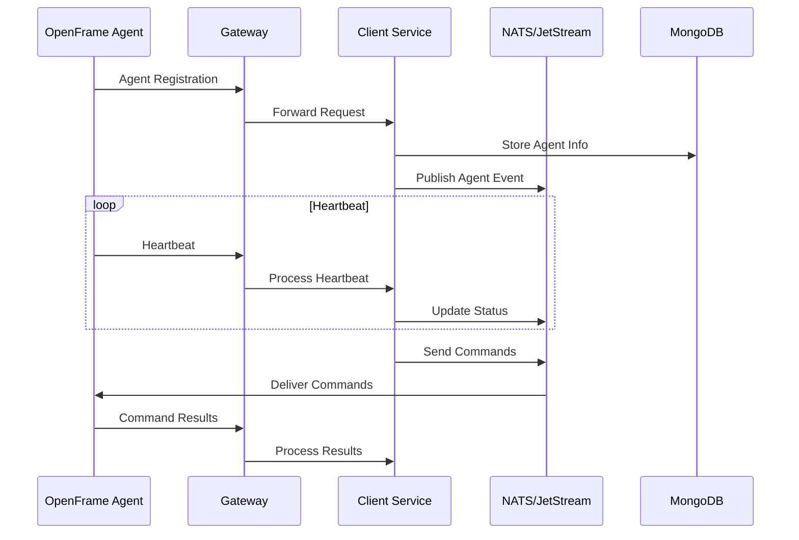

### 6. Authorization Server

**Purpose**: OAuth2/OIDC compliant authorization server for multi-tenant authentication.

**Features**:
- Multi-tenant OAuth2 flows
- SSO integration (Google, Microsoft, SAML)
- JWT token management with refresh tokens
- Role-based access control (RBAC)
- Invitation-based user registration

## Data Architecture

### Database Strategy

**MongoDB (Primary Database)**:
- Document-oriented storage for complex domain objects
- Multi-tenant data isolation via tenant partitioning
- Rich querying capabilities with aggregation pipelines
- Horizontal scaling with sharding

**Redis (Cache + Sessions)**:
- Session storage for stateless authentication
- Application-level caching for hot data
- Real-time analytics caching
- Distributed locking and coordination

**Apache Kafka (Event Streaming)**:
- Event sourcing backbone
- Inter-service communication
- Real-time data pipeline
- Change data capture (CDC)

**Apache Pinot (Analytics)**:
- Real-time OLAP queries
- Time-series analytics
- Dashboard and reporting queries
- Sub-second query response times

**Cassandra (Time Series)**:
- High-volume time-series data
- Device metrics and monitoring data
- Log aggregation and storage
- Linear scalability

### Data Flow Patterns

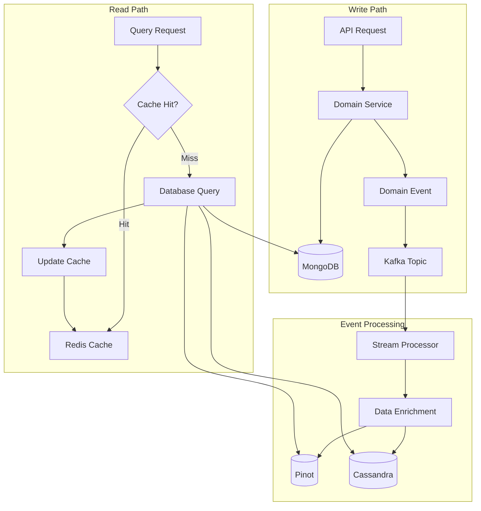

## Security Architecture

### Authentication & Authorization Flow

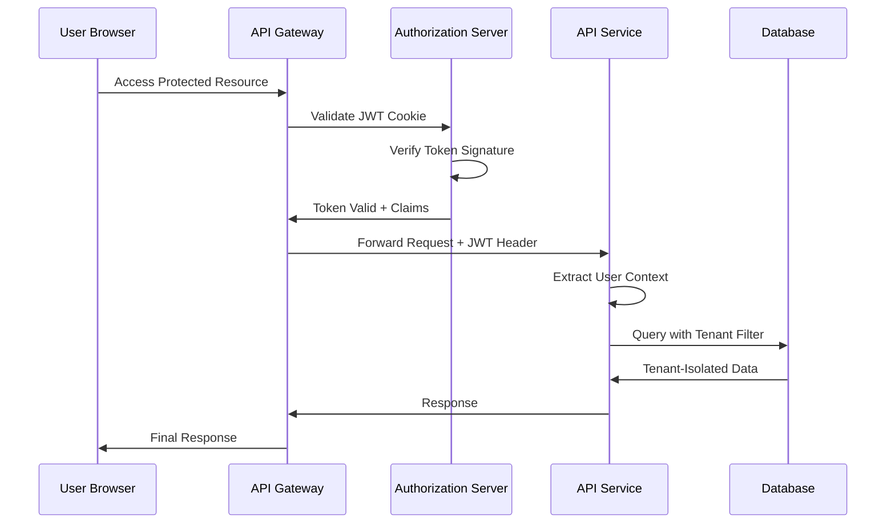

### Multi-Tenant Security

**Tenant Isolation Strategies**:
- **Row-Level Security**: Tenant ID in all database queries
- **Connection Isolation**: Separate database connections per tenant
- **JWT Claims**: Tenant context embedded in authentication tokens
- **Network Isolation**: Kubernetes namespaces per tenant (enterprise)

**Security Layers**:
1. **Network Security**: TLS encryption, network policies
2. **Authentication**: OAuth2/OIDC with JWT tokens
3. **Authorization**: Role-based access control (RBAC)
4. **Data Security**: Encryption at rest and in transit
5. **API Security**: Rate limiting, input validation
6. **Audit**: Complete activity logging and monitoring

## Integration Architecture

### External Tool Integration Patterns

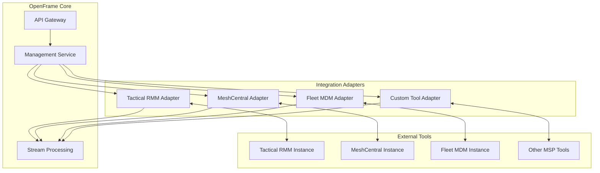

### Integration Patterns

**Polling Pattern**: Regular scheduled sync for tools without webhooks
**Webhook Pattern**: Real-time event-driven updates
**Hybrid Pattern**: Initial bulk sync + real-time updates
**Proxy Pattern**: OpenFrame acts as authenticated proxy for tool APIs

## Performance Architecture

### Scalability Patterns

**Horizontal Scaling**:
- Stateless services for easy scaling
- Database sharding for data layer scaling  
- Kafka partitioning for stream processing scaling
- Redis clustering for cache scaling

**Performance Optimizations**:
- GraphQL DataLoaders for N+1 query prevention
- Database indexing strategies
- Application-level caching with Redis
- CDN for static asset delivery
- Connection pooling and keep-alive

### Monitoring & Observability

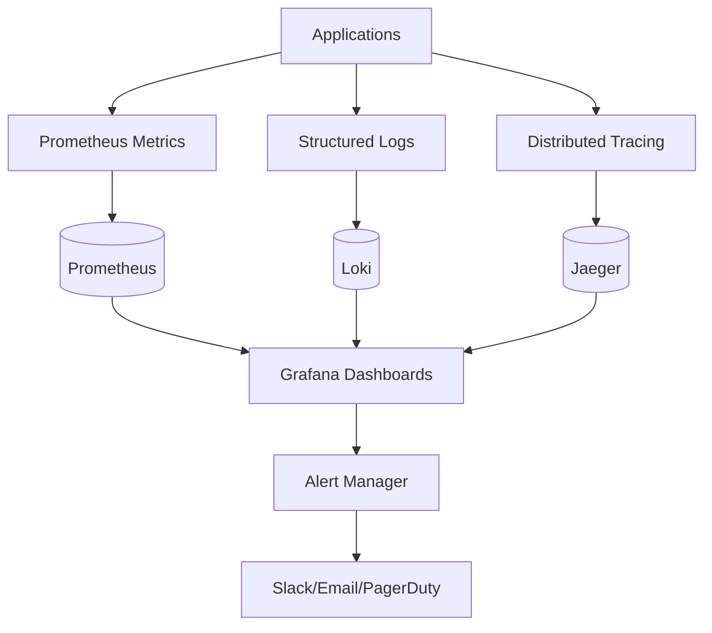

## Deployment Architecture

### Container Strategy

**Service Containers**:
- Multi-stage Docker builds for optimal image size
- Security scanning integrated into CI/CD pipeline
- Non-root user containers for security
- Health check endpoints for container orchestration

**Infrastructure Containers**:
- Official vendor images for databases
- Custom configuration via ConfigMaps and Secrets
- Persistent volumes for stateful services
- Init containers for database initialization

### Kubernetes Architecture

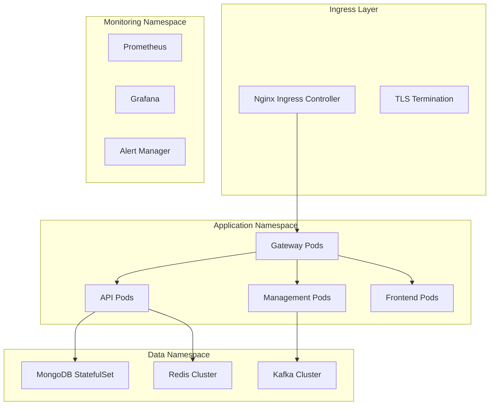

## Development Architecture Considerations

### Local Development
- Docker Compose for infrastructure services
- Hot reload capabilities for rapid development
- Mock services for external dependencies
- Test data generators for consistent development data

### Testing Strategy
- Unit tests for business logic isolation
- Integration tests for service interaction
- Contract tests for API compatibility
- End-to-end tests for critical user journeys

### CI/CD Architecture
- Multi-stage build pipeline
- Parallel test execution
- Security scanning integration
- Automated deployment to staging
- Blue-green deployment for production

## Next Steps

Now that you understand OpenFrame's architecture:

1. **Explore Service Details**: Dive into specific service documentation
2. **Review Data Models**: Understand domain entities and relationships
3. **Study Integration Patterns**: Learn how external tools connect
4. **Practice Development**: Build custom features using the architecture
5. **Contribute**: Help improve the architecture and documentation

---

**🏗️ Architecture Mastery!** You now understand OpenFrame's comprehensive architecture and can develop effectively within its patterns and constraints!