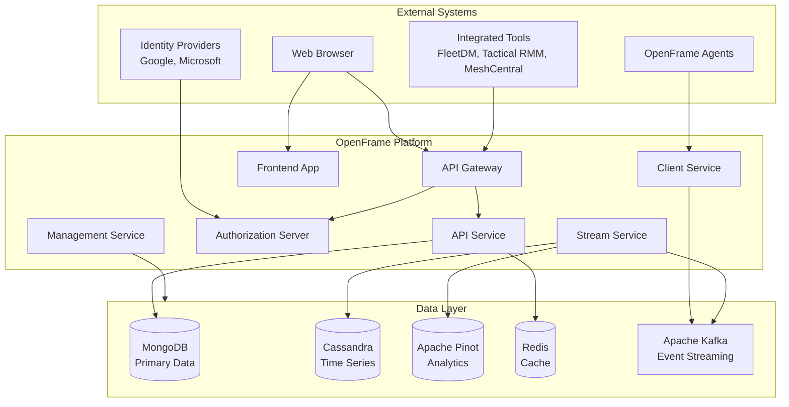
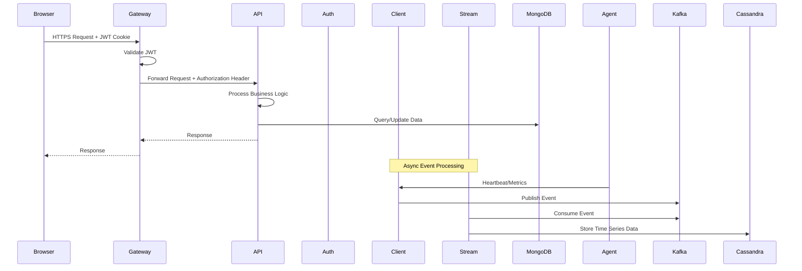
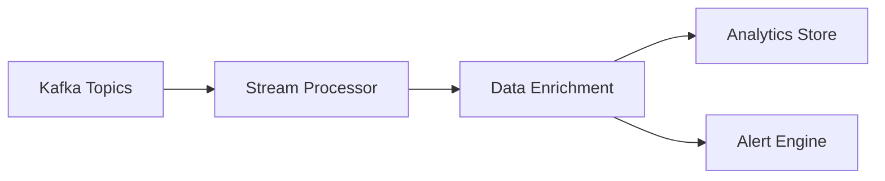
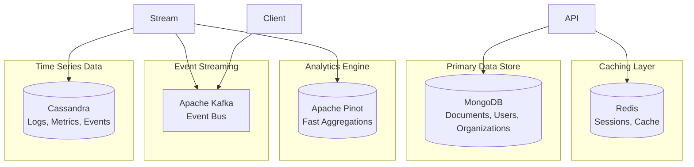
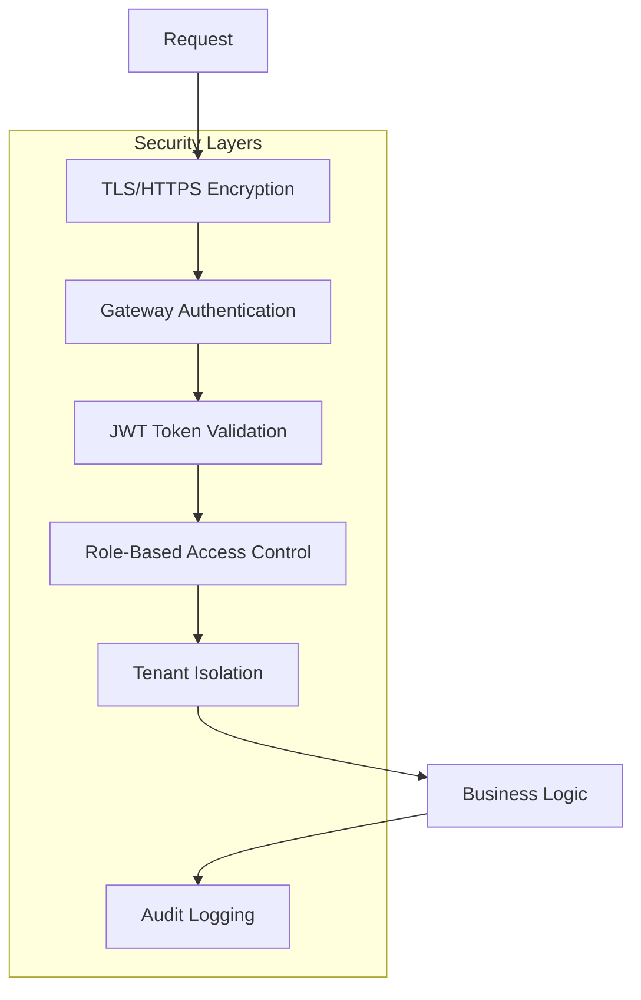
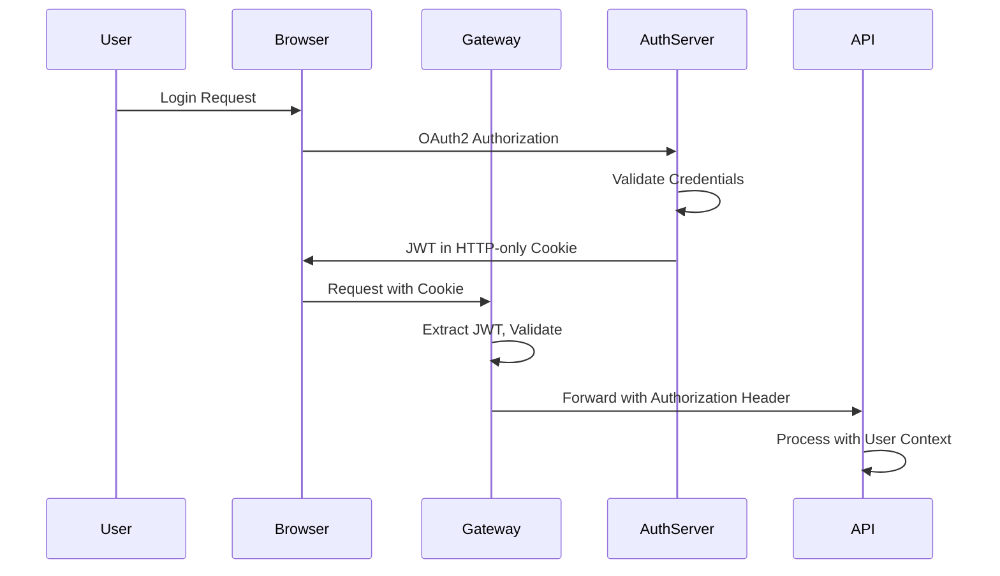
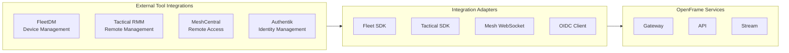

# Architecture Overview

This document provides a comprehensive overview of OpenFrame's architecture, including the high-level system design, microservices structure, data flow patterns, and key design decisions.

## High-Level System Architecture

OpenFrame follows a **microservices architecture** built on modern cloud-native principles. The system is designed as a **multi-tenant platform** that provides unified MSP operations through a single control plane.

### System Context Diagram



### Core Components

| Component | Purpose | Technology |
|-----------|---------|------------|
| **API Gateway** | Single entry point, authentication, routing | Spring Cloud Gateway |
| **Frontend App** | User interface and user experience | Next.js, React, TypeScript |
| **API Service** | Business logic, GraphQL/REST APIs | Spring Boot, Netflix DGS |
| **Authorization Server** | OAuth2, JWT, multi-tenant authentication | Spring Authorization Server |
| **Client Service** | Agent management and ingestion | Spring Boot, WebSocket |
| **Stream Service** | Real-time data processing | Spring Boot, Kafka Streams |
| **Management Service** | Background tasks, system management | Spring Boot, ShedLock |

## Microservices Architecture

### Service Interaction Patterns



### Service Responsibilities

#### API Gateway Service (`openframe-gateway`)

**Primary Functions:**
- **Request Routing**: Routes requests to appropriate backend services
- **Authentication**: JWT validation and cookie-to-header conversion
- **Rate Limiting**: Prevents API abuse and ensures fair usage
- **CORS Handling**: Cross-origin request management
- **WebSocket Proxying**: Real-time connection management for tools

**Key Features:**
```yaml
# Gateway routing configuration
spring:
  cloud:
    gateway:
      routes:
        - id: api-service
          uri: http://localhost:8081
          predicates:
            - Path=/api/**
        - id: auth-service
          uri: http://localhost:9000
          predicates:
            - Path=/oauth2/**,/login/**
```

#### API Service (`openframe-api`)

**Primary Functions:**
- **GraphQL API**: Unified data query interface
- **REST API**: Traditional HTTP endpoints
- **Business Logic**: Core domain operations
- **Data Orchestration**: Coordinates between data sources

**GraphQL Schema Example:**
```graphql
type Device {
  id: ID!
  name: String!
  deviceType: DeviceType!
  status: DeviceStatus!
  organization: Organization!
  installedAgents: [InstalledAgent!]!
  lastSeen: DateTime
}

type Query {
  devices(
    first: Int
    after: String
    filter: DeviceFilterInput
  ): DeviceConnection!
}
```

#### Authorization Server (`openframe-authorization-server`)

**Primary Functions:**
- **OAuth2 Authorization**: Standard OAuth2 flows
- **JWT Token Issuance**: Secure token generation
- **Multi-tenant Support**: Tenant isolation and context
- **SSO Integration**: Google, Microsoft identity providers

**Token Structure:**
```json
{
  "iss": "https://auth.openframe.ai",
  "sub": "user123",
  "aud": "openframe-api",
  "tenant_id": "acme-msp",
  "roles": ["TECHNICIAN"],
  "exp": 1640995200
}
```

#### Client Service (`openframe-client`)

**Primary Functions:**
- **Agent Registration**: Secure agent onboarding
- **Heartbeat Processing**: Agent health monitoring
- **Metric Ingestion**: System metrics collection
- **Tool Agent Management**: Third-party agent lifecycle

#### Stream Service (`openframe-stream`)

**Primary Functions:**
- **Event Processing**: Real-time data transformation
- **Data Enrichment**: Context addition and normalization
- **Analytics Preparation**: Data preparation for querying
- **Integration Synchronization**: External tool data sync

**Processing Pipeline:**


#### Management Service (`openframe-management`)

**Primary Functions:**
- **System Initialization**: Bootstrap configuration
- **Scheduled Tasks**: Background job processing  
- **Health Monitoring**: Service health checks
- **Data Migration**: Schema and data updates

### Data Architecture

#### Multi-Model Data Strategy

OpenFrame uses a **polyglot persistence** approach with different databases optimized for specific use cases:



#### Data Flow Patterns

**Write Path:**
1. **API Writes** → MongoDB (transactional data)
2. **Agent Data** → Kafka → Stream Service → Cassandra (time series)
3. **Cached Data** → Redis (sessions, temporary data)

**Read Path:**
1. **Real-time Queries** → MongoDB + Redis
2. **Analytics Queries** → Apache Pinot  
3. **Historical Data** → Cassandra
4. **Dashboard Data** → Combined queries across stores

### Security Architecture

#### Multi-Layered Security Model



#### Authentication Flow



#### Tenant Isolation Strategy

**Data Isolation:**
- All data queries include `tenant_id` filter
- Database-level row-level security where supported
- Separate data partitions for large tenants

**Resource Isolation:**
- Kubernetes namespaces per tenant (enterprise)
- Resource quotas and limits
- Network policies for traffic isolation

## Key Design Decisions

### 1. Gateway-First Architecture

**Decision**: All external traffic routes through a single API Gateway.

**Rationale:**
- Centralized authentication and authorization
- Consistent rate limiting and monitoring
- Simplified SSL/TLS management
- Single point for cross-cutting concerns

**Trade-offs:**
- Gateway becomes potential bottleneck
- Additional network hop for requests
- Increased complexity for service-to-service calls

### 2. JWT with HTTP-Only Cookies

**Decision**: Store JWTs in HTTP-only cookies instead of Authorization headers.

**Rationale:**
- Protection against XSS attacks
- Automatic cookie management by browsers
- Simplified mobile app integration
- Better security posture

**Implementation:**
```java
// Cookie configuration
@Configuration
public class CookieConfig {
    @Bean
    public CookieSerializer cookieSerializer() {
        DefaultCookieSerializer serializer = new DefaultCookieSerializer();
        serializer.setHttpOnly(true);
        serializer.setSecure(true);
        serializer.setSameSite("Strict");
        return serializer;
    }
}
```

### 3. Event-Driven Architecture with Kafka

**Decision**: Use Apache Kafka for all async communication and event processing.

**Rationale:**
- High throughput and scalability
- Event sourcing capabilities
- Loose coupling between services
- Replay and reprocessing capabilities

**Event Schema Example:**
```json
{
  "eventId": "uuid",
  "eventType": "DEVICE_HEARTBEAT",
  "tenantId": "acme-msp", 
  "timestamp": "2024-01-01T12:00:00Z",
  "source": "openframe-agent",
  "payload": {
    "deviceId": "device-123",
    "metrics": {
      "cpu": 45.2,
      "memory": 78.5,
      "disk": 23.1
    }
  }
}
```

### 4. GraphQL for Unified API

**Decision**: Use GraphQL as the primary API interface with Netflix DGS.

**Rationale:**
- Single endpoint for all data needs
- Strong typing and schema validation
- Efficient data fetching (no over/under-fetching)
- Excellent tooling and ecosystem

**Schema Design Patterns:**
```graphql
# Relay-style pagination
type DeviceConnection {
  edges: [DeviceEdge!]!
  pageInfo: PageInfo!
  totalCount: Int!
}

# Input types for filtering
input DeviceFilterInput {
  status: DeviceStatus
  deviceType: DeviceType
  organizationId: ID
  searchText: String
}
```

### 5. Polyglot Persistence Strategy

**Decision**: Use different databases optimized for different data patterns.

**Database Selection Criteria:**

| Data Type | Database | Reason |
|-----------|----------|--------|
| **User/Org Data** | MongoDB | Flexible schema, ACID transactions |
| **Time Series** | Cassandra | High write throughput, time-based queries |
| **Analytics** | Apache Pinot | Fast aggregations, OLAP queries |
| **Cache/Sessions** | Redis | In-memory speed, key-value operations |
| **Events** | Kafka | Streaming, event sourcing |

### 6. Multi-Tenancy Design

**Decision**: Shared database with tenant-scoped data access.

**Implementation Patterns:**
```java
// Automatic tenant filtering
@Entity
@FilterDef(name = "tenantFilter", parameters = @ParamDef(name = "tenantId", type = "string"))
@Filter(name = "tenantFilter", condition = "tenant_id = :tenantId")
public class Device {
    @Column(name = "tenant_id")
    private String tenantId;
    // ... other fields
}

// Aspect for automatic tenant injection
@Aspect
public class TenantAspect {
    @Around("@annotation(TenantScoped)")
    public Object injectTenantContext(ProceedingJoinPoint joinPoint) {
        String tenantId = SecurityContextHolder.getTenantId();
        // Inject tenant context into query
        return joinPoint.proceed();
    }
}
```

## Component Details

### Shared Libraries

OpenFrame includes several shared libraries that provide common functionality across all services:

#### openframe-core
- **Utilities**: Common helper functions and utilities
- **Validation**: Input validation and sanitization
- **Constants**: Shared constants and enums
- **Exceptions**: Common exception types

#### openframe-data
- **Repositories**: Data access layer abstractions
- **Entities**: JPA entities and document models
- **Migrations**: Database schema management
- **Caching**: Redis caching strategies

#### openframe-security
- **JWT**: JWT token handling and validation
- **OAuth2**: OAuth2 client configurations
- **Encryption**: AES encryption for sensitive data
- **Audit**: Security event logging

#### openframe-kafka
- **Producers**: Kafka message publishing
- **Consumers**: Event processing templates
- **Serialization**: Event serialization formats
- **Configuration**: Kafka client configurations

### External Integrations

OpenFrame integrates with various external tools through standardized adapters:



## Scalability Considerations

### Horizontal Scaling Strategy

**Stateless Services**: All services are designed to be stateless and can be horizontally scaled.

**Database Scaling:**
- **MongoDB**: Replica sets and sharding
- **Cassandra**: Natural horizontal scaling  
- **Redis**: Clustering and sentinel
- **Kafka**: Partition-based scaling

**Kubernetes Scaling:**
```yaml
# Horizontal Pod Autoscaler example
apiVersion: autoscaling/v2
kind: HorizontalPodAutoscaler
metadata:
  name: openframe-api-hpa
spec:
  scaleTargetRef:
    apiVersion: apps/v1
    kind: Deployment
    name: openframe-api
  minReplicas: 2
  maxReplicas: 10
  metrics:
  - type: Resource
    resource:
      name: cpu
      target:
        type: Utilization
        averageUtilization: 70
```

### Performance Optimizations

**Caching Strategies:**
- **Application-level**: Redis caching for frequent queries
- **Database-level**: Query result caching  
- **CDN**: Static asset caching via CDN
- **Browser**: Client-side caching strategies

**Query Optimizations:**
- **GraphQL**: DataLoader for N+1 problem prevention
- **Database**: Proper indexing strategies
- **Pagination**: Cursor-based pagination for large datasets
- **Aggregations**: Pre-computed aggregations in Pinot

## Next Steps

To dive deeper into OpenFrame's architecture:

1. **[Local Development Setup](../setup/local-development.md)** - Get hands-on with the architecture
2. **[Testing Guide](../testing/overview.md)** - Understand testing strategies for microservices
3. **[Contributing Guidelines](../contributing/guidelines.md)** - Learn how to contribute to the architecture
4. **Source Code Exploration** - Browse the actual implementation in the repository

---

**Architecture Questions?** Join the [OpenMSP Slack](https://join.slack.com/t/openmsp/shared_invite/zt-36bl7mx0h-3~U2nFH6nqHqoTPXMaHEHA) `#architecture` channel to discuss design decisions and architectural patterns with the core team.