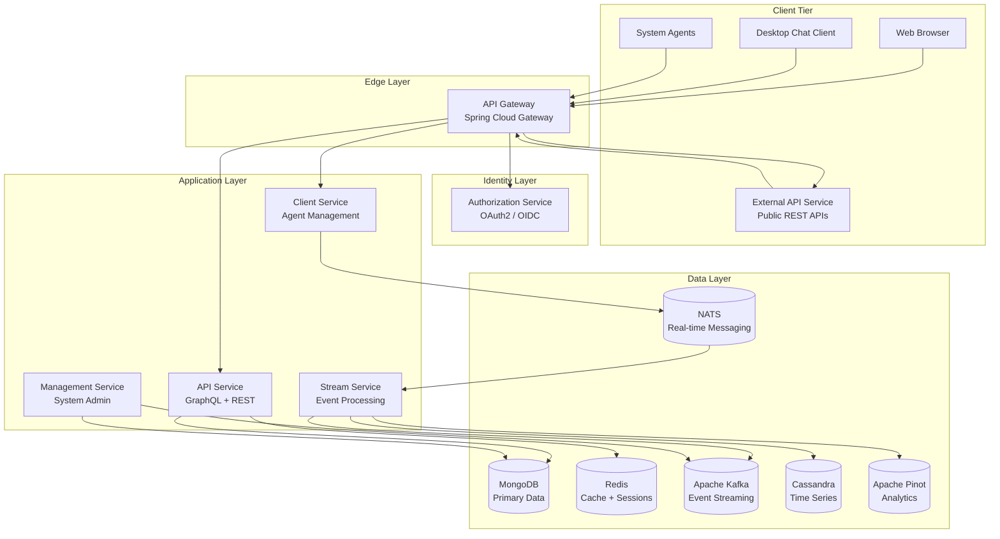
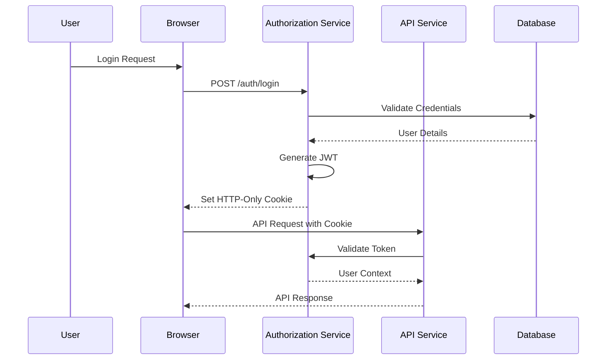
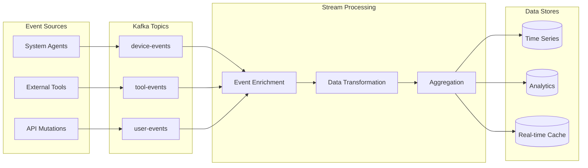
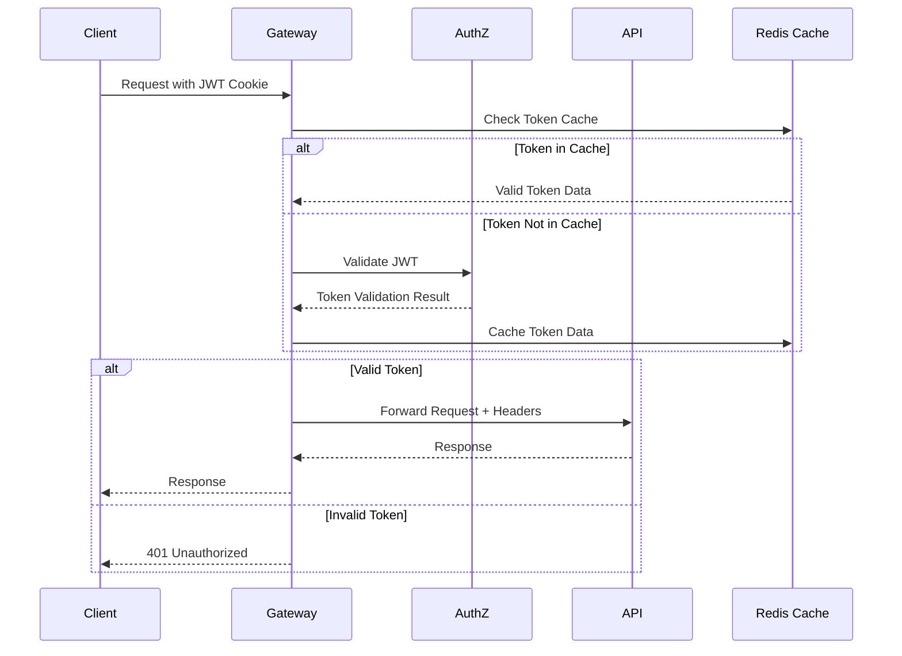

# OpenFrame Architecture Overview

This document provides a comprehensive overview of OpenFrame's architecture, designed for developers who need to understand the system's design, components, and data flow patterns.

## High-Level System Architecture

OpenFrame follows a **microservices architecture** with clear separation of concerns, designed for scalability, maintainability, and multi-tenancy.

### System Overview Diagram



## Core Design Principles

### 1. Multi-Tenancy First

Every component is designed with multi-tenancy as a core requirement:

- **Tenant Isolation**: Data, configurations, and resources are isolated by tenant
- **Shared Infrastructure**: Common services serve multiple tenants efficiently
- **Per-Tenant Customization**: SSO, branding, and feature flags per tenant

### 2. Event-Driven Architecture

OpenFrame uses event streaming for real-time data processing and system integration:

- **Event Sourcing**: Critical state changes are captured as events
- **Stream Processing**: Real-time analytics and data enrichment
- **Loose Coupling**: Services communicate via events, not direct calls

### 3. API-First Design

All functionality is exposed through well-defined APIs:

- **GraphQL**: Primary API for frontend applications with type safety
- **REST**: Standards-compliant APIs for external integrations
- **WebSocket**: Real-time communication for chat and live updates

### 4. Domain-Driven Design

Services are organized around business domains:

- **Bounded Contexts**: Clear service boundaries based on business capabilities
- **Domain Models**: Rich domain objects with business logic
- **Service Autonomy**: Services own their data and business rules

## Service Architecture Deep Dive

### API Gateway (openframe-gateway)

**Technology**: Spring Cloud Gateway, WebFlux  
**Port**: 8080  
**Responsibilities**:

- **Request Routing**: Route requests to appropriate backend services
- **Authentication**: JWT validation and cookie-to-header conversion
- **Rate Limiting**: Per-tenant and per-user rate limiting
- **WebSocket Proxy**: Secure proxying for tool integrations

```java
// Example routing configuration
@Bean
public RouteLocator customRouteLocator(RouteLocatorBuilder builder) {
    return builder.routes()
        .route("api-service", r -> r.path("/api/**")
            .filters(f -> f.stripPrefix(1)
                .addRequestHeader("X-Tenant-ID", "#{tenantId}")
                .requestRateLimiter(config -> config
                    .setRateLimiter(redisRateLimiter())
                    .setKeyResolver(userKeyResolver())))
            .uri("http://localhost:8082"))
        .build();
}
```

**Key Components**:
- **JWT Security Filter**: Validates tokens across tenant issuers
- **Tenant Context Filter**: Extracts and propagates tenant information
- **Rate Limiting Filter**: Redis-based rate limiting per tenant/user
- **WebSocket Handler**: Secure WebSocket proxying for tools

### Authorization Service (openframe-authorization-server)

**Technology**: Spring Security OAuth2, Spring Authorization Server  
**Port**: 8081  
**Responsibilities**:

- **Multi-Tenant OAuth2**: Per-tenant authorization servers
- **User Authentication**: Password, invitation, and SSO flows
- **Token Management**: JWT issuing, validation, and refresh
- **User Registration**: Tenant and user onboarding



**Multi-Tenant Token Structure**:
```json
{
  "sub": "user-id",
  "iss": "https://tenant.openframe.com",
  "aud": ["openframe-api", "openframe-client"],
  "tenant_id": "tenant-123",
  "email": "user@example.com",
  "roles": ["ADMIN", "TECHNICIAN"],
  "exp": 1640995200
}
```

### API Service (openframe-api)

**Technology**: Spring Boot, Netflix DGS (GraphQL), Spring Data MongoDB  
**Port**: 8082  
**Responsibilities**:

- **GraphQL API**: Type-safe API with introspection and subscriptions
- **REST Endpoints**: Standards-compliant REST for specific use cases
- **Business Logic**: Core domain services and business rules
- **Data Access**: MongoDB operations with multi-tenant filtering

**GraphQL Schema Example**:
```graphql
type Query {
    devices(filter: DeviceFilter, pagination: CursorPagination): DeviceConnection!
    organizations(filter: OrganizationFilter): [Organization!]!
    me: User!
}

type Mutation {
    createDevice(input: CreateDeviceInput!): Device!
    updateDeviceStatus(deviceId: ID!, status: DeviceStatus!): Device!
}

type Subscription {
    deviceStatusUpdates(deviceIds: [ID!]): DeviceStatus!
    chatMessages(dialogId: ID!): ChatMessage!
}
```

**Service Layer Pattern**:
```java
@Component
public class DeviceService {
    
    @Transactional
    public Device createDevice(CreateDeviceRequest request, TenantContext tenant) {
        // Validate request
        validateDeviceRequest(request);
        
        // Create domain object
        Device device = Device.builder()
            .tenantId(tenant.getTenantId())
            .name(request.getName())
            .type(request.getType())
            .build();
            
        // Apply business rules
        deviceProcessor.processNewDevice(device, tenant);
        
        // Persist
        Device savedDevice = deviceRepository.save(device);
        
        // Publish event
        eventPublisher.publishEvent(new DeviceCreatedEvent(savedDevice));
        
        return savedDevice;
    }
}
```

### Stream Service (openframe-stream)

**Technology**: Kafka Streams, Apache Kafka, Spring Boot  
**Port**: 8085  
**Responsibilities**:

- **Event Processing**: Real-time processing of device and tool events
- **Data Enrichment**: Enhance events with context and metadata
- **Analytics Pipeline**: Feed data to Cassandra and Pinot for analytics
- **Event Transformation**: Convert between different event formats

**Kafka Streams Topology**:
```java
@Bean
public KafkaStreams deviceEventStream() {
    StreamsBuilder builder = new StreamsBuilder();
    
    // Input streams
    KStream<String, DeviceEvent> deviceEvents = 
        builder.stream("device-events");
    KTable<String, Organization> organizations = 
        builder.table("organizations");
    
    // Processing pipeline
    KStream<String, EnrichedDeviceEvent> enrichedEvents = deviceEvents
        .filter((key, event) -> isValidEvent(event))
        .leftJoin(organizations, 
            (event, org) -> enrichWithOrganization(event, org))
        .mapValues(this::transformForAnalytics);
    
    // Output streams
    enrichedEvents.to("enriched-device-events");
    enrichedEvents
        .filter((key, event) -> isCriticalEvent(event))
        .to("critical-alerts");
        
    return new KafkaStreams(builder.build(), streamsConfig);
}
```

**Event Flow Diagram**:


## Data Architecture

### Database Design Patterns

#### 1. Multi-Tenant Data Isolation

**Strategy**: Tenant ID in every document/record

```javascript
// MongoDB Document Structure
{
  _id: ObjectId("..."),
  tenantId: "tenant-123",  // Required in every document
  name: "Production Server",
  // ... other fields
  createdAt: ISODate("..."),
  updatedAt: ISODate("...")
}

// Automatic tenant filtering in repositories
db.devices.find({tenantId: "tenant-123", status: "online"})
```

#### 2. Event Sourcing for Audit Trail

**Pattern**: Capture state changes as events

```java
@Document(collection = "events")
public class AuditEvent {
    private String tenantId;
    private String aggregateId;
    private String eventType;
    private Object eventData;
    private Instant timestamp;
    private String userId;
}

// Example events
DeviceCreatedEvent, DeviceStatusChangedEvent, UserLoginEvent
```

#### 3. CQRS for Read/Write Separation

```java
// Command Side (Writes)
@Service
public class DeviceCommandService {
    public void createDevice(CreateDeviceCommand command) {
        // Validate and save
        // Publish events
    }
}

// Query Side (Reads)  
@Service
public class DeviceQueryService {
    public DeviceConnection findDevices(DeviceFilter filter) {
        // Optimized read queries
        // Use read replicas
    }
}
```

### Data Store Responsibilities

| Store | Purpose | Data Types | Access Pattern |
|-------|---------|------------|----------------|
| **MongoDB** | Primary data store | Users, Organizations, Devices, Configurations | CRUD operations, complex queries |
| **Redis** | Cache + Sessions | Session data, temporary data, rate limiting | Key-value, pub/sub |
| **Kafka** | Event streaming | All domain events, CDC events | Append-only, stream processing |
| **Cassandra** | Time-series data | Logs, metrics, audit events | Time-based queries, high write volume |
| **Apache Pinot** | Analytics | Aggregated metrics, reporting data | OLAP queries, real-time analytics |
| **NATS** | Real-time messaging | Agent communication, live updates | Pub/sub, request/reply |

## Security Architecture

### Authentication Flow



### Multi-Tenant Security

**Tenant Context Propagation**:
```java
@Component
public class TenantContext {
    private static final ThreadLocal<String> TENANT_ID = new ThreadLocal<>();
    
    public static void setTenantId(String tenantId) {
        TENANT_ID.set(tenantId);
    }
    
    public static String getTenantId() {
        return TENANT_ID.get();
    }
}

// Automatic tenant filtering in repositories
@Repository
public class TenantAwareDeviceRepository {
    public List<Device> findAll() {
        String tenantId = TenantContext.getTenantId();
        return mongoTemplate.find(
            Query.query(Criteria.where("tenantId").is(tenantId)),
            Device.class
        );
    }
}
```

## Integration Architecture

### External Tool Integration

OpenFrame integrates with existing MSP tools through a unified SDK pattern:

```java
// SDK Interface
public interface ToolSDK {
    List<Device> getDevices();
    void executeCommand(String deviceId, Command command);
    void installAgent(String deviceId, AgentConfig config);
}

// Implementation examples
@Component
public class TacticalRmmSDK implements ToolSDK { /* ... */ }

@Component 
public class FleetMdmSDK implements ToolSDK { /* ... */ }
```

### Agent Communication

System agents communicate via NATS for real-time, reliable messaging:

```rust
// Rust agent NATS integration
#[tokio::main]
async fn main() {
    let nc = async_nats::connect("nats://localhost:4222").await?;
    
    // Subscribe to commands
    let mut commands = nc.subscribe("agent.commands.{agent_id}").await?;
    
    // Publish heartbeat
    let heartbeat = HeartbeatMessage {
        agent_id: "agent-123",
        status: "online",
        timestamp: Utc::now(),
    };
    
    nc.publish("agent.heartbeat", serde_json::to_vec(&heartbeat)?).await?;
    
    // Handle incoming commands
    while let Some(message) = commands.next().await {
        let command: AgentCommand = serde_json::from_slice(&message.data)?;
        execute_command(command).await?;
    }
}
```

## Performance and Scalability

### Horizontal Scaling Patterns

**Stateless Services**: All services are designed to be stateless and can be scaled horizontally.

**Database Sharding**: MongoDB can be sharded by tenant for large deployments.

**Kafka Partitioning**: Events are partitioned by tenant for parallel processing.

**Redis Clustering**: Cache layer can be clustered for high availability.

### Caching Strategy

```java
// Multi-level caching strategy
@Cacheable(value = "devices", key = "#tenantId + ':' + #deviceId")
public Device getDevice(String tenantId, String deviceId) {
    return deviceRepository.findByIdAndTenantId(deviceId, tenantId);
}

// Cache eviction on updates
@CacheEvict(value = "devices", key = "#device.tenantId + ':' + #device.id")
public Device updateDevice(Device device) {
    return deviceRepository.save(device);
}
```

## Monitoring and Observability

### Metrics and Monitoring

OpenFrame includes comprehensive monitoring:

```yaml
# Prometheus metrics endpoint
management:
  endpoints:
    web:
      exposure:
        include: health,info,metrics,prometheus
  metrics:
    export:
      prometheus:
        enabled: true
```

**Key Metrics**:
- Request latency and throughput per service
- Database connection pool statistics  
- Kafka consumer lag
- JVM memory and GC metrics
- Business metrics (devices online, active users)

### Distributed Tracing

```java
// Automatic tracing with Spring Cloud Sleuth
@RestController
public class DeviceController {
    
    @NewSpan("get-device")
    public Device getDevice(@SpanTag("deviceId") String deviceId) {
        // Trace propagated automatically through service calls
        return deviceService.getDevice(deviceId);
    }
}
```

## Deployment Architecture

### Kubernetes Native

OpenFrame is designed for Kubernetes deployment:

```yaml
# Example service deployment
apiVersion: apps/v1
kind: Deployment
metadata:
  name: openframe-api
spec:
  replicas: 3
  selector:
    matchLabels:
      app: openframe-api
  template:
    spec:
      containers:
      - name: api
        image: openframe/api:latest
        ports:
        - containerPort: 8082
        env:
        - name: MONGO_URI
          valueFrom:
            secretKeyRef:
              name: mongodb-secret
              key: connection-string
```

### Service Mesh Integration

Compatible with Istio for advanced traffic management:

```yaml
# Istio VirtualService example
apiVersion: networking.istio.io/v1alpha3
kind: VirtualService
metadata:
  name: openframe-api
spec:
  hosts:
  - openframe-api
  http:
  - match:
    - uri:
        prefix: "/graphql"
    route:
    - destination:
        host: openframe-api
        subset: v1
      weight: 100
```

## Development Patterns and Best Practices

### Domain-Driven Design Implementation

```java
// Aggregate Root
@Document
public class Device {
    private DeviceId id;
    private TenantId tenantId;
    private DeviceName name;
    private DeviceStatus status;
    
    // Business methods
    public void changeStatus(DeviceStatus newStatus, UserId changedBy) {
        validateStatusChange(newStatus);
        DeviceStatus previousStatus = this.status;
        this.status = newStatus;
        
        // Domain event
        registerEvent(new DeviceStatusChangedEvent(
            this.id, previousStatus, newStatus, changedBy, Instant.now()
        ));
    }
    
    private void validateStatusChange(DeviceStatus newStatus) {
        if (!this.status.canTransitionTo(newStatus)) {
            throw new InvalidStatusTransitionException(this.status, newStatus);
        }
    }
}
```

### Error Handling Strategy

```java
// Global exception handling
@ControllerAdvice
public class GlobalExceptionHandler {
    
    @ExceptionHandler(TenantNotFoundException.class)
    public ResponseEntity<ErrorResponse> handleTenantNotFound(TenantNotFoundException ex) {
        return ResponseEntity.status(404)
            .body(ErrorResponse.builder()
                .code("TENANT_NOT_FOUND")
                .message(ex.getMessage())
                .build());
    }
    
    @ExceptionHandler(ValidationException.class)
    public ResponseEntity<ErrorResponse> handleValidation(ValidationException ex) {
        return ResponseEntity.status(400)
            .body(ErrorResponse.builder()
                .code("VALIDATION_ERROR")
                .message(ex.getMessage())
                .details(ex.getValidationErrors())
                .build());
    }
}
```

## Next Steps

Now that you understand OpenFrame's architecture:

1. **Explore [Testing Overview](../testing/overview.md)** to understand testing patterns
2. **Review [Contributing Guidelines](../contributing/guidelines.md)** for development workflow  
3. **Check specific service documentation** for detailed implementation guides
4. **Try extending the system** by adding a new service or API endpoint

The architecture is designed to be extensible and maintainable. Each service can evolve independently while maintaining clear contracts with other components.