# Architecture Overview

OpenFrame is built as a modern, cloud-native microservices platform designed for scalability, maintainability, and extensibility. This guide provides a comprehensive overview of the system architecture, design decisions, and component interactions.

## High-Level Architecture

OpenFrame follows a **service mesh architecture** with clear separation between presentation, business logic, data access, and infrastructure concerns.

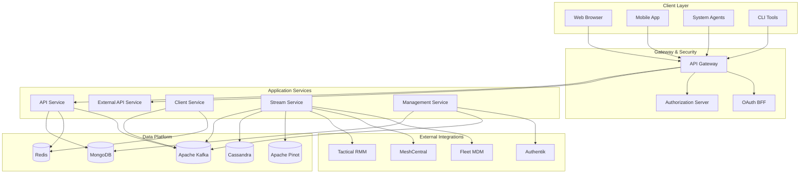

## Core Design Principles

### 1. Separation of Concerns

OpenFrame separates different aspects of the system:

- **Presentation Layer**: Frontend applications and API gateways
- **Business Logic**: Core service implementations
- **Data Access**: Specialized data services and repositories
- **Integration**: External tool connectors and adapters

### 2. Domain-Driven Design

Services are organized around business domains:

| Domain | Services | Responsibility |
|--------|----------|----------------|
| **Device Management** | API Service, Client Service | Device lifecycle, monitoring, control |
| **User & Security** | Authorization Server, OAuth BFF | Authentication, authorization, user management |
| **Tool Integration** | Stream Service, Management Service | External tool connectivity and data synchronization |
| **Analytics & Reporting** | Stream Service, External API | Data processing, analytics, reporting |

### 3. Event-Driven Architecture

Asynchronous communication through events enables:

- **Loose coupling** between services
- **High throughput** data processing
- **Eventually consistent** data synchronization
- **Resilient** system behavior

---

## Service Architecture

### Gateway Service

The **API Gateway** serves as the single entry point for all client requests.

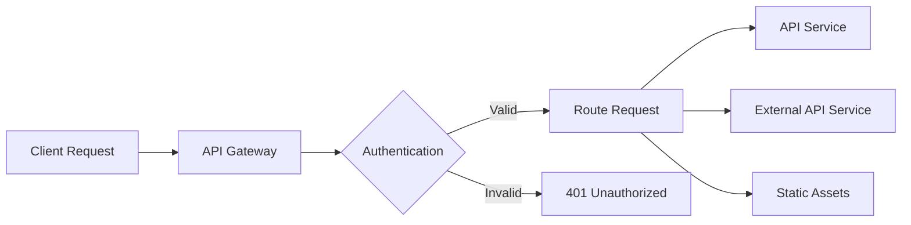

**Responsibilities:**
- Request routing and load balancing
- Authentication and authorization
- Rate limiting and throttling
- CORS handling and security headers
- WebSocket proxy for real-time features

**Key Components:**
- `GatewayService`: Main routing logic
- `JwtAuthenticationFilter`: Token validation
- `ApiKeyAuthenticationFilter`: API key validation
- `WebSocketProxyUrlFilter`: Real-time connection handling

### API Service

The **API Service** provides the primary internal API used by OpenFrame frontends and internal services.

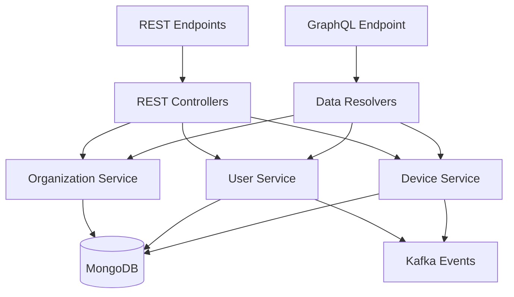

**Responsibilities:**
- GraphQL API for frontend applications
- REST API for service-to-service communication
- Business logic implementation
- Event publishing for state changes

**Key Components:**
- `DeviceDataFetcher`: GraphQL resolvers for device queries
- `OrganizationDataFetcher`: GraphQL resolvers for organization management
- `EventDataFetcher`: GraphQL resolvers for event and audit logs
- `DeviceService`: Core device management business logic
- `OrganizationService`: Organization and user management

### Authorization Server

The **Authorization Server** handles authentication, authorization, and identity management using OAuth2 and OpenID Connect standards.

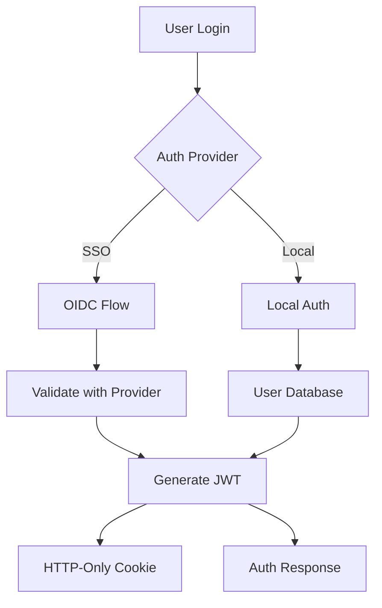

**Responsibilities:**
- OAuth2 authorization flows
- OpenID Connect (OIDC) integration
- SSO provider management (Google, Microsoft, etc.)
- User registration and invitation flows
- JWT token generation and validation

**Key Components:**
- `AuthorizationServerConfig`: OAuth2 server configuration
- `SsoTenantRegistrationService`: Multi-tenant SSO setup
- `UserService`: User lifecycle management
- `InvitationService`: User invitation workflows

### Stream Service

The **Stream Service** processes real-time events and data streams from external tools and internal services.

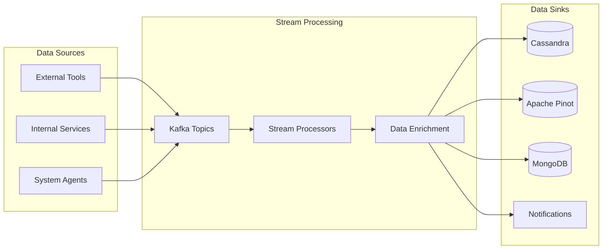

**Responsibilities:**
- Kafka stream consumption and processing
- Event data enrichment and transformation
- Real-time analytics and aggregation
- Integration with external tool data feeds

**Key Components:**
- `GenericJsonMessageProcessor`: Flexible event processing
- `DataEnrichmentService`: Event data enhancement
- `ActivityEnrichmentService`: Device activity processing
- `IntegratedToolDataEnrichmentService`: External tool data integration

### Client Service

The **Client Service** manages system agents and client-side communication.

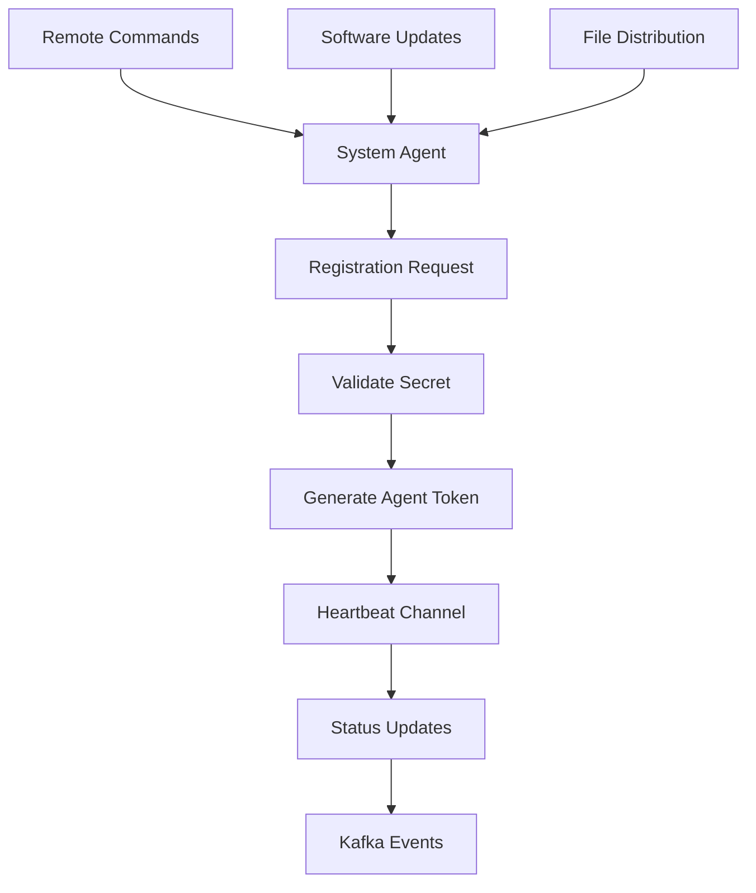

**Responsibilities:**
- Agent registration and authentication
- Heartbeat and metrics collection
- Remote command execution
- Software updates and file distribution

**Key Components:**
- `AgentAuthService`: Agent authentication
- `AgentRegistrationService`: New agent enrollment
- `ToolInstallationService`: Software deployment
- `MachineHeartbeatPublisher`: Health monitoring

---

## Data Architecture

### Data Storage Strategy

OpenFrame uses a **polyglot persistence** approach, selecting the best database for each use case:

| Database | Use Case | Data Types |
|----------|----------|------------|
| **MongoDB** | Primary data store | Organizations, users, devices, configuration |
| **Cassandra** | Time-series data | Logs, metrics, audit trails |
| **Apache Pinot** | Analytics | Aggregated metrics, reporting data |
| **Redis** | Caching & sessions | Session data, temporary data, rate limiting |
| **Apache Kafka** | Event streaming | Real-time events, service communication |

### Data Flow Patterns

#### 1. Command Pattern (Write Operations)

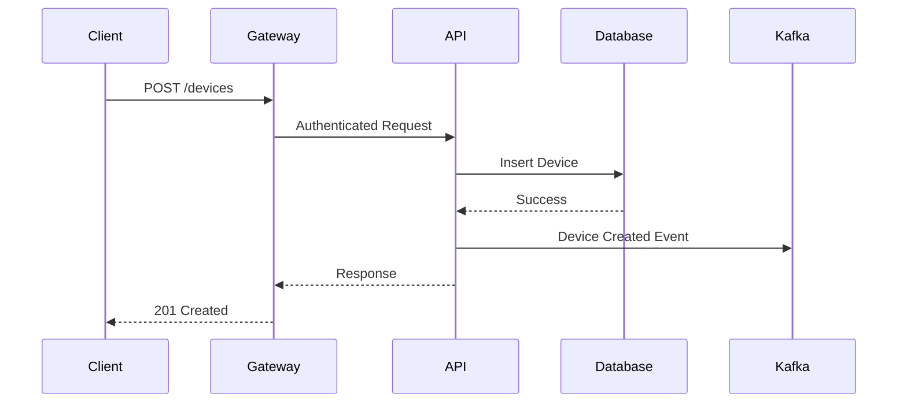

#### 2. Query Pattern (Read Operations)

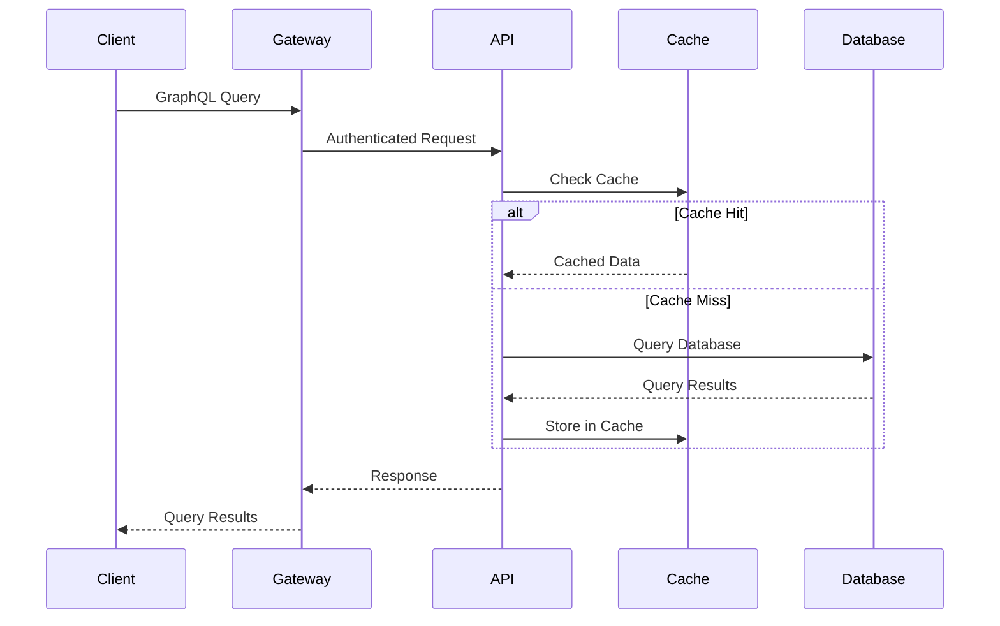

#### 3. Event Processing Pattern

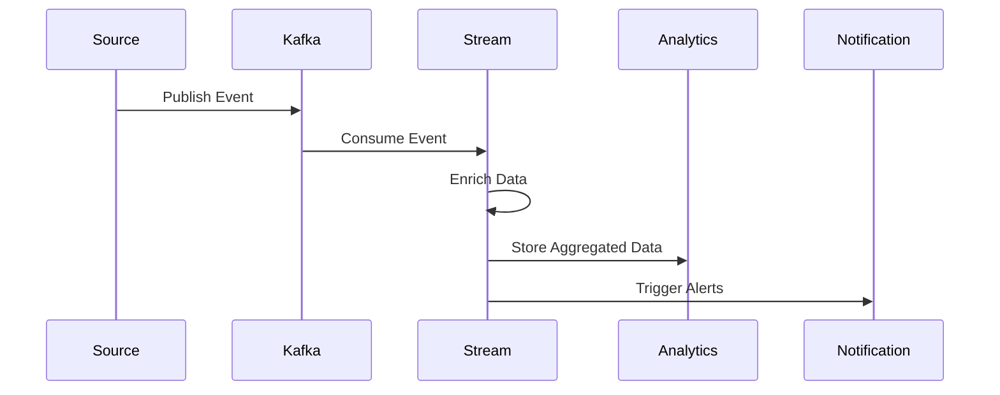

### Database Schema Design

#### MongoDB Collections

**Organizations Collection:**
```javascript
{
  _id: ObjectId,
  name: "Acme Corporation",
  domain: "acme.com",
  plan: "enterprise",
  settings: {
    timezone: "America/New_York",
    dateFormat: "MM/DD/YYYY"
  },
  contactInfo: {
    primaryContact: "John Doe",
    email: "john@acme.com",
    phone: "+1-555-0123"
  },
  createdAt: ISODate,
  updatedAt: ISODate
}
```

**Devices Collection:**
```javascript
{
  _id: ObjectId,
  organizationId: ObjectId,
  name: "server-01",
  type: "SERVER",
  status: "ONLINE",
  platform: {
    os: "Ubuntu",
    version: "22.04",
    architecture: "x86_64"
  },
  hardware: {
    cpu: "Intel Xeon E5-2686 v4",
    memory: "32 GB",
    storage: "500 GB SSD"
  },
  network: {
    hostname: "server-01.acme.com",
    ipAddress: "192.168.1.100",
    macAddress: "00:1B:44:11:3A:B7"
  },
  agents: [{
    type: "OPENFRAME",
    version: "1.0.0",
    status: "CONNECTED",
    lastSeen: ISODate
  }],
  tags: ["production", "web-server"],
  createdAt: ISODate,
  updatedAt: ISODate
}
```

#### Cassandra Tables

**Log Events Table:**
```sql
CREATE TABLE log_events (
    organization_id uuid,
    device_id uuid,
    timestamp timestamp,
    event_id uuid,
    level text,
    message text,
    source text,
    metadata map<text, text>,
    PRIMARY KEY ((organization_id, device_id), timestamp, event_id)
) WITH CLUSTERING ORDER BY (timestamp DESC);
```

**Metrics Table:**
```sql
CREATE TABLE device_metrics (
    organization_id uuid,
    device_id uuid,
    metric_name text,
    timestamp timestamp,
    value double,
    tags map<text, text>,
    PRIMARY KEY ((organization_id, device_id, metric_name), timestamp)
) WITH CLUSTERING ORDER BY (timestamp DESC);
```

---

## Security Architecture

### Authentication Flow

OpenFrame uses **JWT-based authentication** with HTTP-only cookies for web clients and bearer tokens for API clients.

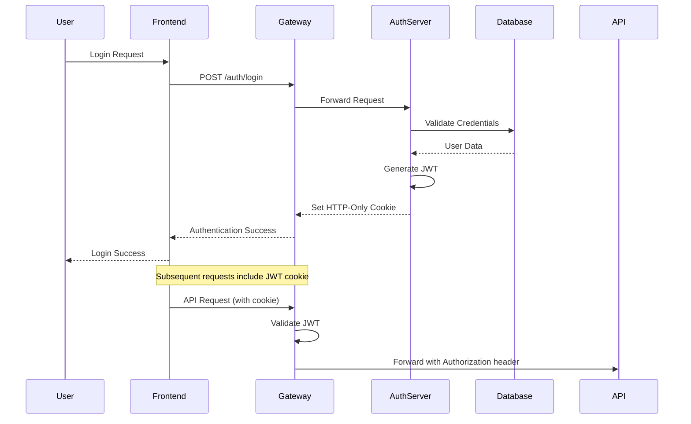

### Authorization Model

OpenFrame implements **Role-Based Access Control (RBAC)** with organization-level isolation:

**Role Hierarchy:**
```text
Super Admin
├── Organization Admin
│   ├── Technician  
│   └── Read Only
└── Service Account
    ├── Agent
    └── Integration
```

**Permission Matrix:**

| Resource | Super Admin | Org Admin | Technician | Read Only |
|----------|-------------|-----------|------------|-----------|
| **Organizations** | CRUD | R | R | R |
| **Users** | CRUD | CRUD* | R | R |
| **Devices** | CRUD | CRUD* | CRUD* | R |
| **Scripts** | CRUD | CRUD* | CRUD* | R |
| **Settings** | CRUD | CRUD* | R | R |

*\* Limited to assigned organization(s)*

### Security Features

#### 1. Network Security

- **TLS 1.3** for all external communication
- **Mutual TLS** for service-to-service communication
- **CORS** configuration for browser security
- **Content Security Policy** headers

#### 2. Data Protection

- **AES-256-GCM** encryption for sensitive data at rest
- **Bcrypt** password hashing with salt
- **Field-level encryption** for PII data
- **Database connection encryption**

#### 3. API Security

- **Rate limiting** per user and API key
- **Input validation** and sanitization
- **SQL injection** prevention through parameterized queries
- **OWASP** security header implementation

---

## Integration Architecture

### External Tool Integration

OpenFrame integrates with existing MSP tools through a standardized adapter pattern:

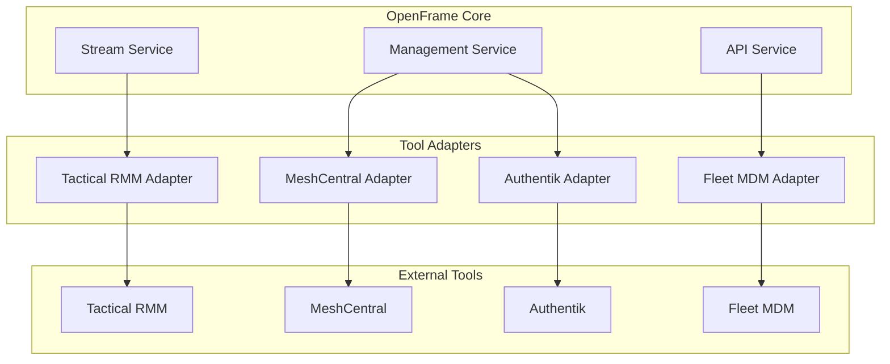

### Integration Patterns

#### 1. Pull-Based Synchronization

For tools with REST APIs:

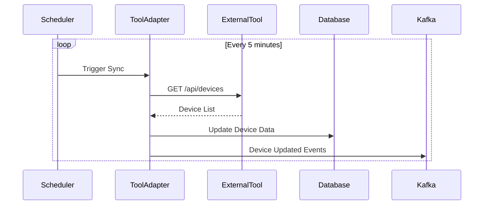

#### 2. Push-Based Integration

For tools with webhook support:

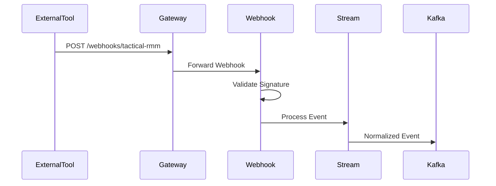

#### 3. Real-Time Streaming

For tools supporting WebSocket or streaming:

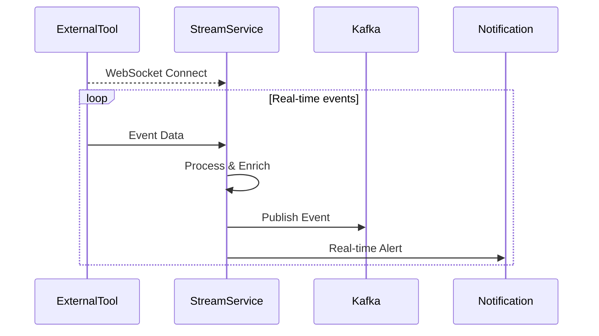

---

## Performance Architecture

### Scalability Patterns

#### 1. Horizontal Scaling

Services can be scaled independently based on load:

```text
Load Balancer
├── Gateway Service (3 instances)
├── API Service (5 instances)  
├── Stream Service (2 instances)
└── Authorization Server (2 instances)
```

#### 2. Database Scaling

- **MongoDB**: Sharded clusters for data distribution
- **Cassandra**: Multi-node clusters with replication
- **Redis**: Cluster mode for high availability
- **Kafka**: Partitioned topics for parallel processing

#### 3. Caching Strategy

Multi-level caching for optimal performance:

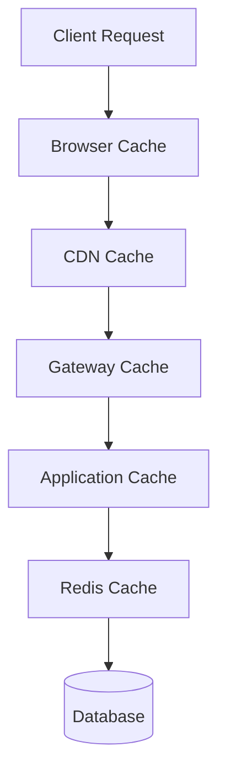

**Cache Levels:**
- **L1 (Browser)**: Static assets, user preferences
- **CDN**: Images, CSS, JavaScript files
- **Gateway**: Rate limiting, authentication
- **Application**: Query results, computed data
- **Redis**: Session data, frequently accessed data

### Performance Monitoring

#### Key Metrics

| Metric | Target | Measurement |
|--------|--------|-------------|
| **Response Time** | < 200ms | 95th percentile |
| **Throughput** | > 1000 RPS | Per service |
| **Availability** | > 99.9% | Monthly uptime |
| **Error Rate** | < 0.1% | 4xx/5xx responses |

#### Monitoring Stack

- **Metrics**: Micrometer + Prometheus
- **Tracing**: Spring Cloud Sleuth + Zipkin
- **Logging**: Structured JSON logs + ELK Stack
- **APM**: Application Performance Monitoring

---

## Deployment Architecture

### Cloud-Native Deployment

OpenFrame is designed for **Kubernetes** deployment with cloud-native best practices:

```yaml
# Example Kubernetes deployment
apiVersion: apps/v1
kind: Deployment
metadata:
  name: openframe-api
spec:
  replicas: 3
  selector:
    matchLabels:
      app: openframe-api
  template:
    spec:
      containers:
      - name: api
        image: openframe/api:latest
        resources:
          requests:
            memory: "1Gi"
            cpu: "500m"
          limits:
            memory: "2Gi" 
            cpu: "1000m"
        env:
        - name: SPRING_PROFILES_ACTIVE
          value: "kubernetes"
        - name: MONGODB_URI
          valueFrom:
            secretKeyRef:
              name: db-credentials
              key: mongodb-uri
```

### Infrastructure as Code

- **Helm Charts**: Kubernetes application templates
- **Terraform**: Infrastructure provisioning
- **Docker Compose**: Local development
- **CI/CD**: Automated testing and deployment

---

## Design Decisions and Trade-offs

### Technology Choices

#### 1. Java vs. Other Languages

**Chosen**: Java 21 with Spring Boot

**Rationale**:
- ✅ Mature ecosystem and tooling
- ✅ Strong enterprise adoption
- ✅ Excellent performance characteristics
- ✅ Rich library ecosystem
- ❌ Higher memory usage than Go/Rust
- ❌ Slower cold start times

#### 2. GraphQL vs. REST

**Chosen**: GraphQL for frontend APIs, REST for service-to-service

**Rationale**:
- ✅ Flexible client queries
- ✅ Strong typing and introspection
- ✅ Reduced over-fetching
- ❌ Caching complexity
- ❌ Learning curve for developers

#### 3. Microservices vs. Monolith

**Chosen**: Microservices architecture

**Rationale**:
- ✅ Independent scaling and deployment
- ✅ Technology diversity
- ✅ Team autonomy
- ❌ Increased operational complexity
- ❌ Network latency between services

### Architectural Trade-offs

#### 1. Consistency vs. Availability (CAP Theorem)

**Choice**: Eventual consistency with high availability

**Impact**:
- Data may be temporarily inconsistent across services
- System remains available during network partitions
- Appropriate for MSP use cases where eventual consistency is acceptable

#### 2. Performance vs. Flexibility

**Choice**: Flexible, event-driven architecture

**Impact**:
- Slightly higher latency due to event processing
- Much easier to extend and modify
- Better suited for diverse integration requirements

#### 3. Security vs. Usability

**Choice**: Security-first design with usability considerations

**Impact**:
- HTTP-only cookies prevent XSS attacks
- Multi-factor authentication where appropriate
- Clear security boundaries between tenants

---

## Future Architecture Considerations

### Planned Enhancements

1. **Service Mesh**: Istio implementation for advanced traffic management
2. **Event Sourcing**: Full event sourcing for audit and replay capabilities  
3. **CQRS**: Command Query Responsibility Segregation for read optimization
4. **Multi-Region**: Geographic distribution for global deployments

### Scalability Roadmap

1. **Phase 1** (Current): Single-region, multi-tenant
2. **Phase 2** (Next): Multi-region with data replication
3. **Phase 3** (Future): Global edge deployment with CDN integration

---

## Summary

OpenFrame's architecture is designed around these core principles:

- **🎯 Domain-Driven Design**: Services organized around business capabilities
- **⚡ Event-Driven**: Loose coupling through asynchronous events
- **🔐 Security-First**: Multiple layers of security controls
- **📈 Cloud-Native**: Designed for Kubernetes and cloud deployment
- **🔧 Extensible**: Plugin architecture for tool integrations
- **📊 Observable**: Comprehensive monitoring and debugging

This architecture enables OpenFrame to scale from small MSPs to large enterprises while maintaining performance, security, and extensibility.

For implementation details of specific components, see:

- **[Testing Guide](../testing/overview.md)**: Testing strategies and best practices
- **[Contributing Guidelines](../contributing/guidelines.md)**: Development workflow and standards