# Architecture Overview

This document provides a comprehensive overview of OpenFrame's architecture, including high-level design principles, core components, data flow patterns, and key architectural decisions.

## Architectural Principles

OpenFrame is built on several foundational principles:

### 1. Gateway-First Security
All external requests flow through the API Gateway, which handles authentication, authorization, and request routing. Services never trust the edge directly.

### 2. Event-Driven Architecture
Asynchronous communication via Apache Kafka enables loose coupling, scalability, and real-time data processing.

### 3. Multi-Tenant by Design
Every component supports tenant isolation at the data, security, and configuration levels.

### 4. Domain-Driven Design
Services are organized around business domains (devices, users, organizations) rather than technical layers.

### 5. Cloud-Native Patterns
Microservices, containerization, and horizontal scaling are core to the platform design.

## High-Level Architecture

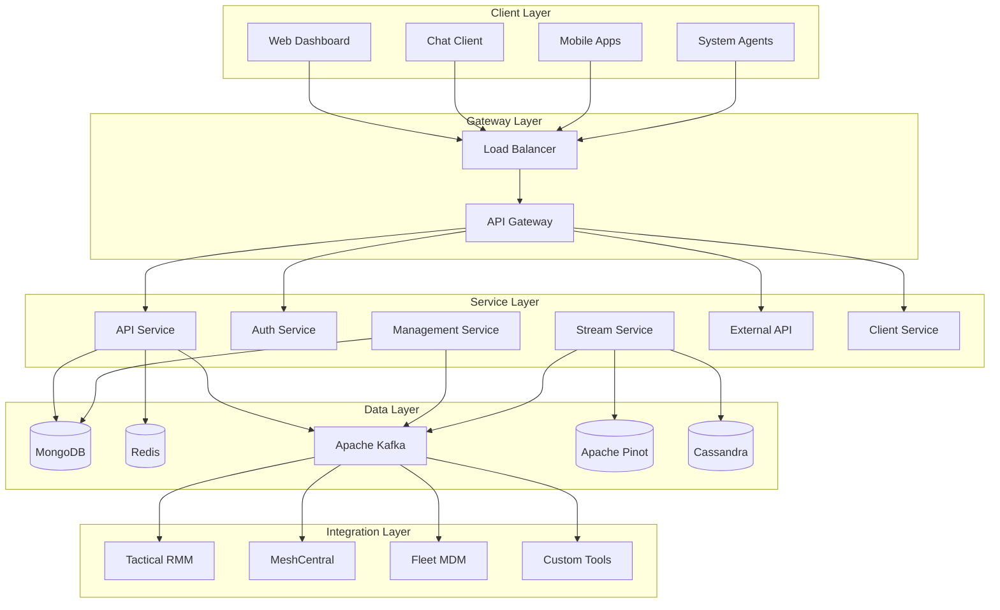

## Core Components

### API Gateway (openframe-gateway)

**Purpose**: Central entry point for all external requests

**Responsibilities**:
- Request routing and load balancing
- JWT authentication and validation
- Rate limiting and throttling
- WebSocket proxy for real-time features
- CORS and security headers

**Technology Stack**:
- Spring Cloud Gateway
- Spring Security OAuth2
- Redis for rate limiting
- WebSocket support

**Key Configuration**:
```yaml
spring:
  cloud:
    gateway:
      routes:
        - id: api-route
          uri: http://openframe-api:8082
          predicates:
            - Path=/api/**,/graphql/**
        - id: auth-route
          uri: http://openframe-auth:8081
          predicates:
            - Path=/auth/**
```

### API Service (openframe-api)

**Purpose**: Core business logic and data access

**Responsibilities**:
- GraphQL API for complex queries
- REST endpoints for mutations
- Business rule enforcement
- Data aggregation and transformation
- Real-time subscriptions

**Architecture**:
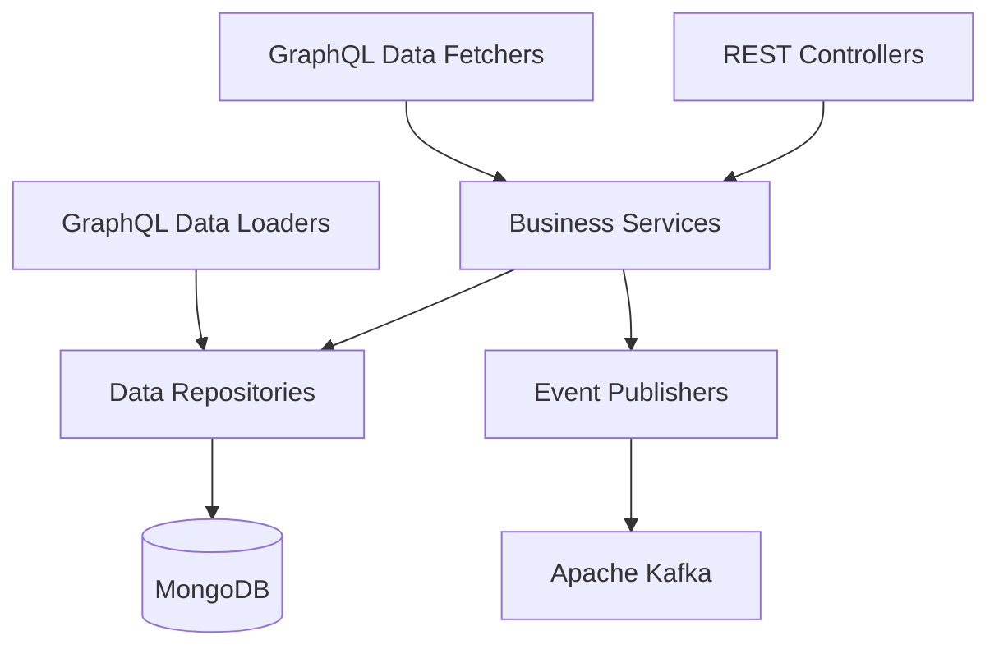

**Technology Stack**:
- Netflix DGS for GraphQL
- Spring Data MongoDB
- Spring Kafka
- MapStruct for DTOs

### Authorization Service (openframe-authorization-server)

**Purpose**: Identity and access management

**Responsibilities**:
- OAuth2 authorization server
- User authentication and registration
- SSO integration (Google, Microsoft)
- Multi-tenant user management
- JWT token lifecycle

**OAuth2 Flow**:
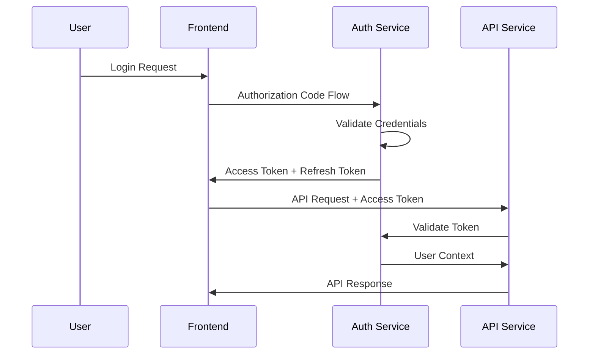

### Stream Processing Service (openframe-stream)

**Purpose**: Real-time event processing and data enrichment

**Responsibilities**:
- Kafka stream processing
- Event normalization from external tools
- Data enrichment and correlation
- Real-time analytics preparation
- Integration event routing

**Stream Processing Architecture**:
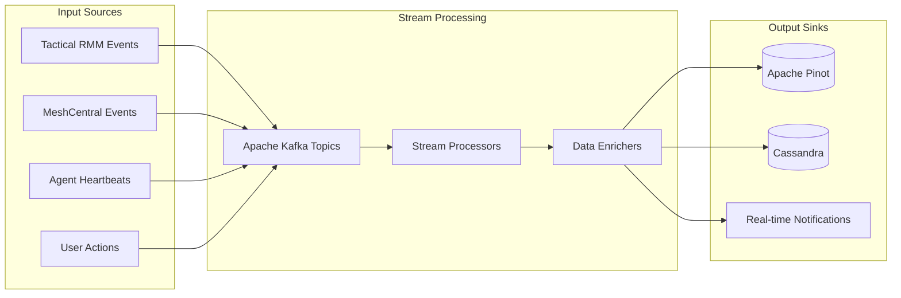

### Management Service (openframe-management)

**Purpose**: Administrative and operational tasks

**Responsibilities**:
- System initialization and configuration
- Scheduled tasks and cleanup
- Health monitoring and metrics
- Integration management
- Platform updates and migrations

**Scheduled Tasks**:
- Agent registration secret rotation
- Database cleanup and archiving
- Integration health checks
- Performance metric collection

### External API Service (openframe-external-api)

**Purpose**: Public API for third-party integrations

**Responsibilities**:
- REST API for external consumers
- API key authentication
- Rate limiting per client
- Data filtering and access control
- Integration webhook endpoints

### Client Service (openframe-client)

**Purpose**: Agent management and communication

**Responsibilities**:
- Agent registration and authentication
- Agent configuration distribution
- Tool installation orchestration
- Agent update management
- Secure agent-to-server communication

## Data Architecture

### Database Design

**MongoDB Collections**:
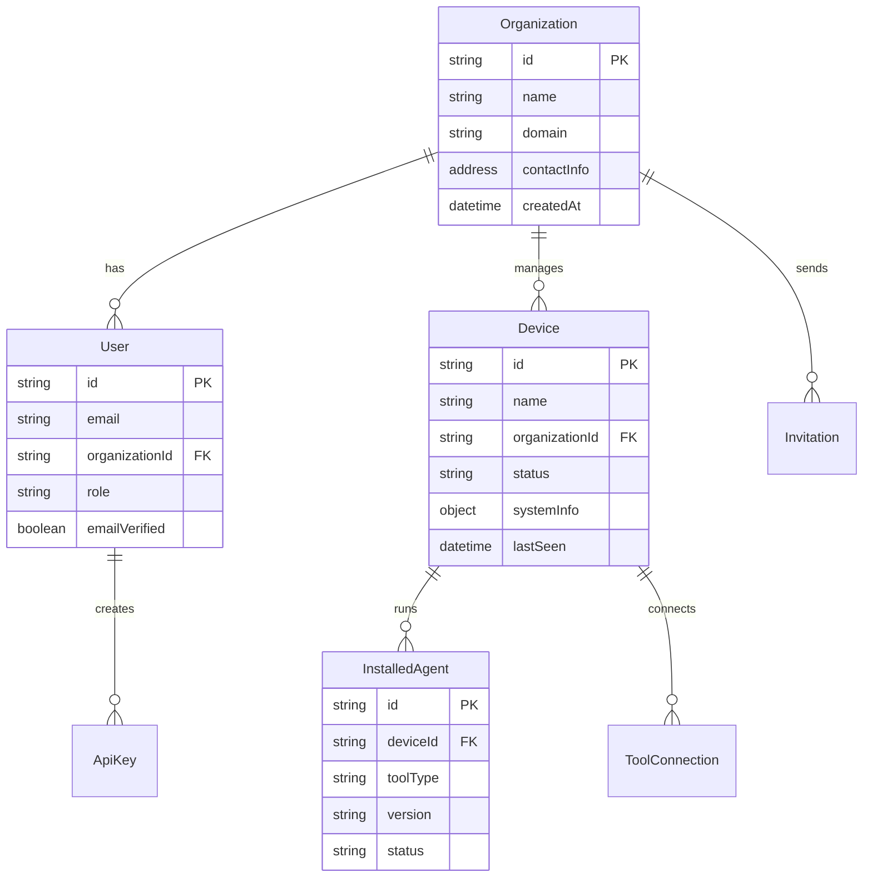

**Redis Cache Structure**:
- Session storage: `session:{sessionId}`
- Rate limiting: `rate_limit:{clientId}:{window}`
- JWT blacklist: `jwt_blacklist:{tokenId}`
- Tenant configuration: `tenant_config:{domain}`

### Data Flow Patterns

**Write Path**:
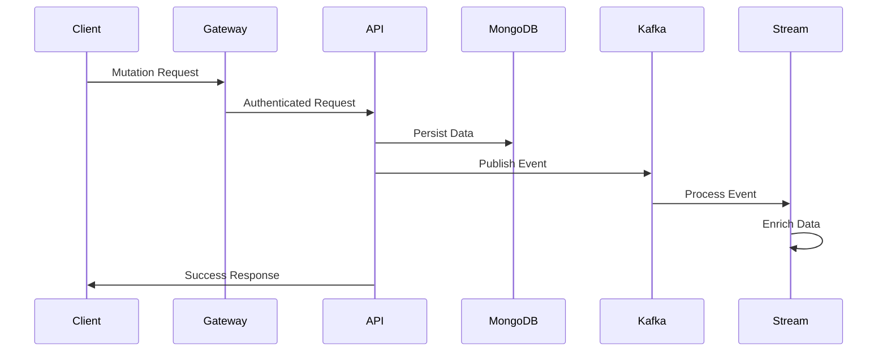

**Read Path**:
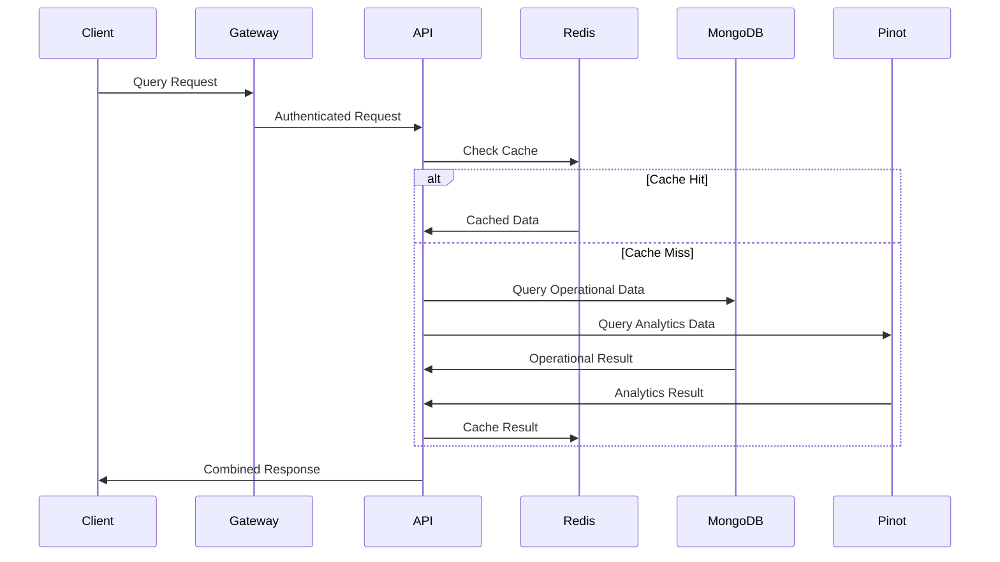

## Security Architecture

### Multi-Tenant Security

**Tenant Isolation**:
- Database level: All queries include `organizationId` filter
- Cache level: Keys prefixed with tenant identifier
- API level: Request context includes tenant scope
- File storage: Tenant-specific directories

**Authentication Flow**:
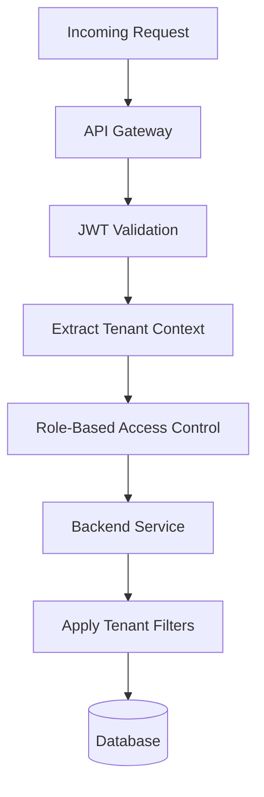

### API Security

**Rate Limiting Strategy**:
- Per-user limits: 1000 requests/hour
- Per-API key limits: 10,000 requests/hour
- Global limits: 100,000 requests/hour
- Sliding window algorithm using Redis

**Input Validation**:
- GraphQL schema validation
- JSON schema validation for REST
- XSS prevention and sanitization
- SQL injection prevention (NoSQL injection for MongoDB)

## Integration Architecture

### External Tool Integration

**Integration Pattern**:
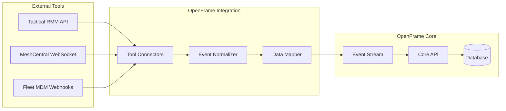

**Integration Types**:
- **Pull-based**: Periodic API polling for tools without webhooks
- **Push-based**: Webhook receivers for real-time events
- **Stream-based**: Direct Kafka integration for high-volume tools
- **Hybrid**: Combination approach based on tool capabilities

### Real-Time Features

**WebSocket Architecture**:
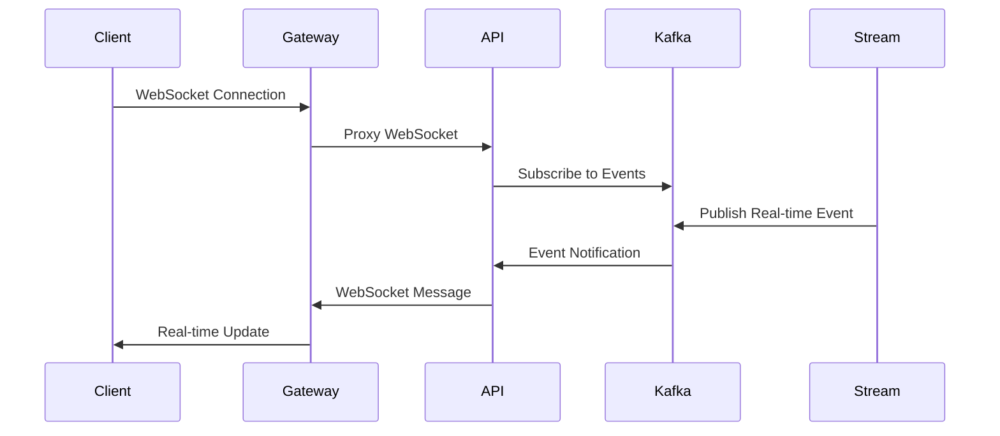

**Supported Real-Time Events**:
- Device status changes
- New log entries
- User activity notifications
- System alerts and warnings
- Chat messages and AI responses

## Performance and Scalability

### Horizontal Scaling

**Stateless Services**:
All services are designed to be stateless, enabling horizontal scaling:
- Session state stored in Redis
- No in-memory caches (except local caching)
- Database connections pooled
- Message processing is idempotent

**Load Balancing**:
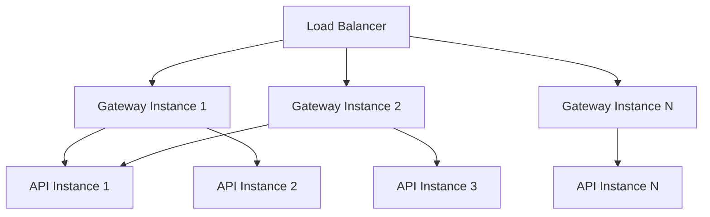

### Caching Strategy

**Multi-Level Caching**:
1. **Application Cache**: In-memory caching for configuration
2. **Redis Cache**: Shared cache for session and frequently accessed data
3. **Database Cache**: MongoDB's WiredTiger cache
4. **CDN Cache**: Static assets and API responses (for read-heavy endpoints)

**Cache Invalidation**:
- Event-driven cache invalidation via Kafka
- TTL-based expiration for time-sensitive data
- Manual invalidation for critical updates

### Database Optimization

**MongoDB Indexing Strategy**:
```javascript
// Core indexes for performance
db.devices.createIndex({ organizationId: 1, status: 1 })
db.devices.createIndex({ organizationId: 1, lastSeen: -1 })
db.logs.createIndex({ organizationId: 1, timestamp: -1 })
db.logs.createIndex({ organizationId: 1, severity: 1, timestamp: -1 })

// Compound indexes for common queries
db.users.createIndex({ organizationId: 1, email: 1 }, { unique: true })
db.apikeys.createIndex({ organizationId: 1, status: 1, expiresAt: 1 })
```

**Query Optimization**:
- Use aggregation pipelines for complex queries
- Implement cursor-based pagination
- Limit result sets with proper filtering
- Use projections to reduce network overhead

### Monitoring and Observability

**Metrics Collection**:
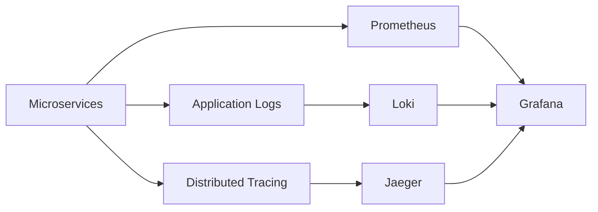

**Key Metrics**:
- Request throughput and latency
- Database query performance
- Cache hit ratios
- Error rates and patterns
- Resource utilization (CPU, memory, disk)

## Deployment Architecture

### Containerization

**Docker Images**:
- Base images: OpenJDK 21, Node 18, Nginx
- Multi-stage builds for optimization
- Security scanning in CI/CD
- Minimal runtime images

**Container Orchestration**:
```mermaid
graph TD
    subgraph "Kubernetes Cluster"
        subgraph "Application Namespace"
            Gateway[Gateway Pods]
            API[API Pods]
            Auth[Auth Pods]
            Management[Management Pods]
        end
        
        subgraph "Data Namespace"
            MongoDB[MongoDB StatefulSet]
            Redis[Redis Deployment]
            Kafka[Kafka StatefulSet]
        end
        
        subgraph "Ingress"
            Ingress[Ingress Controller]
            LB[Load Balancer]
        end
    end
    
    LB --> Ingress
    Ingress --> Gateway
    Gateway --> API
    Gateway --> Auth
    API --> MongoDB
    API --> Redis
    API --> Kafka
```

### Environment Strategy

**Environment Progression**:
- **Development**: Local Docker Compose
- **Testing**: Kubernetes with test data
- **Staging**: Production-like with synthetic data
- **Production**: Full HA deployment with monitoring

## Future Architecture Considerations

### Planned Enhancements

**Service Mesh Integration**:
- Istio for advanced traffic management
- mTLS between services
- Advanced observability and tracing

**Event Sourcing**:
- Migration to event-sourced architecture
- Improved auditability and replay capabilities
- Better support for temporal queries

**GraphQL Federation**:
- Federated GraphQL schema across services
- Independent service deployments
- Better separation of concerns

**AI/ML Integration**:
- Model serving infrastructure
- Real-time inference pipelines
- A/B testing for AI features

---

This architecture overview provides the foundation for understanding OpenFrame's design. For specific implementation details, refer to individual service documentation and the [development guides](../setup/local-development.md).