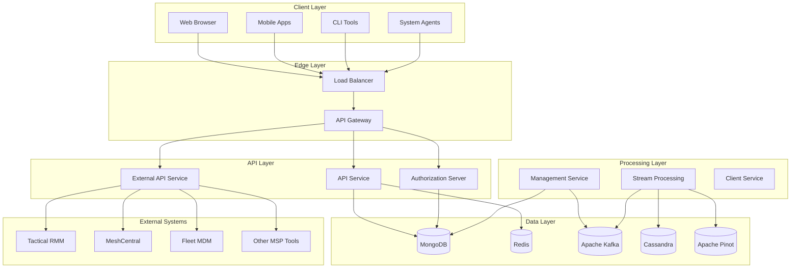
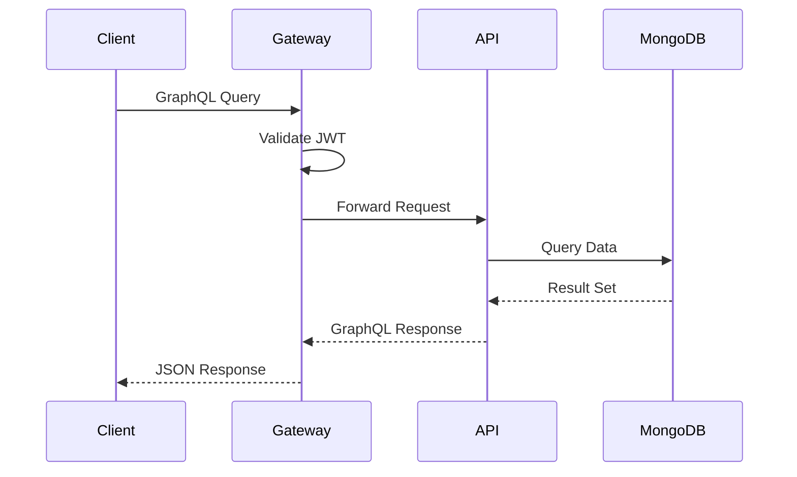
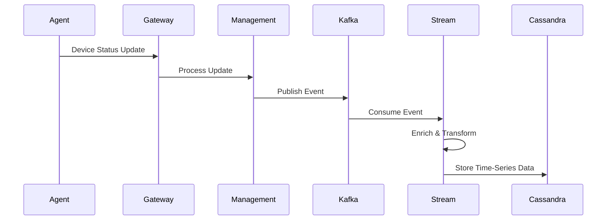
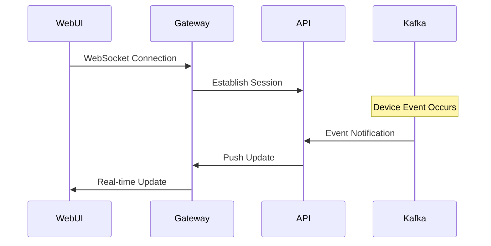
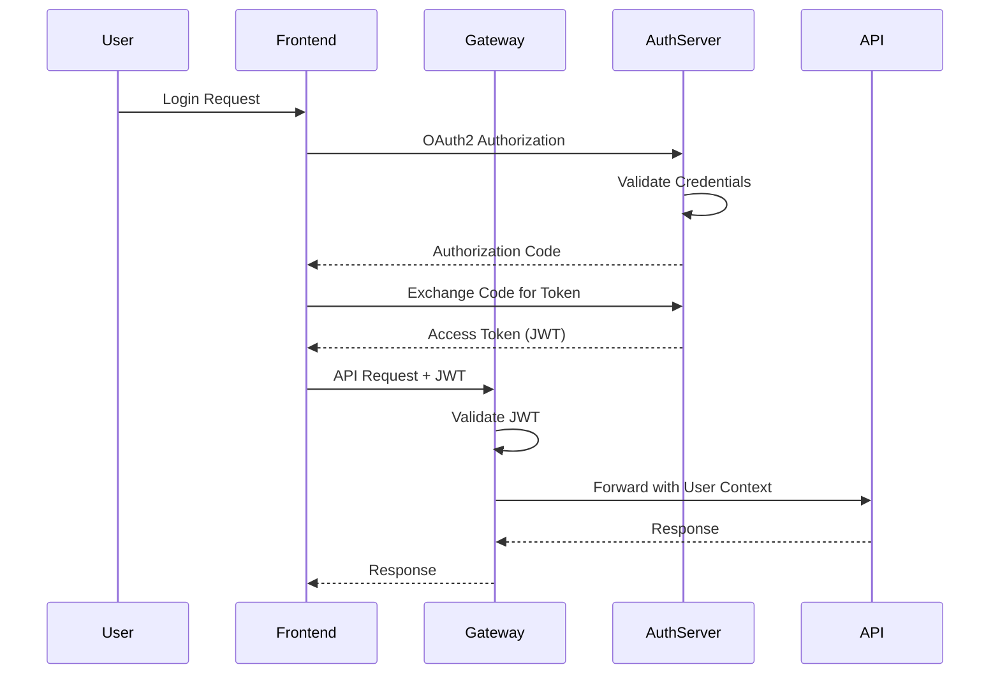
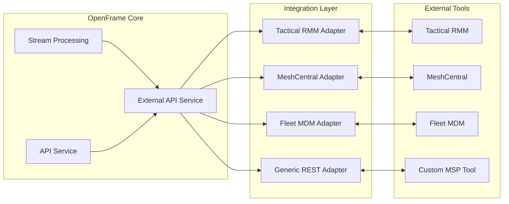

# Architecture Overview

OpenFrame is designed as a modern, cloud-native microservices platform that provides a comprehensive MSP solution. This guide provides a deep dive into the system architecture, design principles, and key components.

## Architectural Principles

OpenFrame follows these core architectural principles:

### 1. **Microservices Architecture**
- **Service Independence**: Each service can be developed, deployed, and scaled independently
- **Single Responsibility**: Each service has a well-defined business responsibility
- **API-First Design**: Services communicate through well-defined APIs
- **Data Ownership**: Each service owns its data and provides controlled access

### 2. **Event-Driven Design**
- **Asynchronous Processing**: Use events for non-critical operations
- **Loose Coupling**: Services are decoupled through event streams
- **Scalability**: Event-driven patterns support high-throughput scenarios
- **Resilience**: System can handle partial failures gracefully

### 3. **Domain-Driven Design (DDD)**
- **Bounded Contexts**: Clear service boundaries align with business domains
- **Ubiquitous Language**: Consistent terminology across the platform
- **Aggregate Design**: Proper data consistency boundaries
- **Service Modeling**: Services represent distinct business capabilities

### 4. **Cloud-Native Patterns**
- **12-Factor App**: Following cloud-native application principles
- **Container-First**: All services designed for containerized deployment
- **Infrastructure as Code**: Declarative infrastructure management
- **Observability**: Built-in monitoring, logging, and distributed tracing

## High-Level Architecture



## Core Services

### API Gateway Service

**Purpose**: Single entry point for all client requests with authentication, routing, and protocol conversion.

**Key Responsibilities**:
- Request routing and load balancing
- Authentication and authorization
- Rate limiting and throttling
- Protocol conversion (WebSocket proxy)
- CORS handling

**Technology Stack**:
- Spring Cloud Gateway
- Spring Security (JWT)
- Redis (rate limiting)
- WebSocket support

**Key Components**:
```java
@Component
public class JwtAuthenticationFilter implements GatewayFilter {
    // JWT token validation and user context
}

@Configuration
public class GatewayConfig {
    // Route configuration and filters
}
```

### API Service

**Purpose**: Main business logic service providing GraphQL and REST APIs for core MSP operations.

**Key Responsibilities**:
- User and organization management
- Device inventory and monitoring
- Event and log processing
- Business rule enforcement
- Data orchestration

**Technology Stack**:
- Spring Boot 3.3
- Netflix DGS (GraphQL)
- MongoDB (primary database)
- Redis (caching)

**Key Components**:
```java
@DgsComponent
public class DeviceDataFetcher {
    // GraphQL data fetchers for device operations
}

@Service
public class OrganizationService {
    // Business logic for organization management
}
```

### Authorization Server

**Purpose**: OAuth2/OIDC identity provider handling authentication and token management.

**Key Responsibilities**:
- User authentication (local and federated)
- OAuth2/OIDC token issuance
- Multi-tenant user management
- Password reset and account recovery
- SSO integration

**Technology Stack**:
- Spring Authorization Server
- MongoDB (user storage)
- JWT tokens

**Key Components**:
```java
@Configuration
public class AuthorizationServerConfig {
    // OAuth2 server configuration
}

@RestController
public class LoginController {
    // Authentication endpoints
}
```

### Management Service

**Purpose**: System administration and operational tasks including tool lifecycle and infrastructure management.

**Key Responsibilities**:
- Tool installation and configuration
- System health monitoring
- Background job scheduling
- Infrastructure provisioning
- Release management

**Technology Stack**:
- Spring Boot
- Quartz Scheduler
- Apache Kafka
- Docker/Kubernetes APIs

**Key Components**:
```java
@Component
public class ToolInstallationService {
    // Automated tool deployment
}

@Scheduled
public class SystemHealthScheduler {
    // Regular health checks and maintenance
}
```

### Stream Processing Service

**Purpose**: Real-time event processing and analytics data pipeline.

**Key Responsibilities**:
- Event stream processing
- Data enrichment and transformation
- Analytics data preparation
- Real-time alerting
- Audit log processing

**Technology Stack**:
- Apache Kafka Streams
- Cassandra (time-series data)
- Apache Pinot (analytics)

**Key Components**:
```java
@Component
public class DeviceEventProcessor {
    // Real-time device event processing
}

@KafkaListener
public class AuditLogProcessor {
    // Audit log processing and storage
}
```

## Data Architecture

### Database Design

OpenFrame uses a polyglot persistence approach with different databases optimized for specific use cases:

#### MongoDB (Primary Database)
```javascript
// User and organization data
{
  "_id": ObjectId("..."),
  "email": "user@example.com",
  "organizationId": "org-123",
  "roles": ["ADMIN", "TECHNICIAN"],
  "profile": {
    "firstName": "John",
    "lastName": "Doe"
  },
  "createdAt": ISODate("..."),
  "updatedAt": ISODate("...")
}

// Device inventory
{
  "_id": "device-456",
  "name": "DC-SERVER-01",
  "organizationId": "org-123",
  "type": "SERVER",
  "status": "ONLINE",
  "lastSeen": ISODate("..."),
  "metadata": {
    "os": "Ubuntu 22.04",
    "cpu": "Intel Xeon",
    "memory": "32GB"
  }
}
```

#### Redis (Caching & Sessions)
```bash
# User session cache
cache:session:user-789 → {user profile data}

# Device status cache
cache:device:status:device-456 → "ONLINE"

# API rate limiting
ratelimit:user:user-789 → {request count}
```

#### Apache Kafka (Event Streaming)
```json
// Device status event
{
  "topic": "device.status.changed",
  "key": "device-456",
  "value": {
    "deviceId": "device-456",
    "organizationId": "org-123",
    "previousStatus": "OFFLINE",
    "currentStatus": "ONLINE",
    "timestamp": "2024-01-15T10:30:00Z",
    "metadata": {
      "source": "agent",
      "version": "1.0.0"
    }
  }
}
```

#### Cassandra (Time-Series Data)
```sql
-- Device metrics table
CREATE TABLE device_metrics (
    device_id text,
    timestamp timestamp,
    metric_type text,
    value double,
    unit text,
    PRIMARY KEY (device_id, timestamp, metric_type)
) WITH CLUSTERING ORDER BY (timestamp DESC);

-- Log events table
CREATE TABLE log_events (
    organization_id text,
    timestamp timestamp,
    device_id text,
    level text,
    message text,
    source text,
    PRIMARY KEY (organization_id, timestamp, device_id)
) WITH CLUSTERING ORDER BY (timestamp DESC);
```

### Data Flow Patterns

#### 1. Request-Response Flow


#### 2. Event-Driven Flow


#### 3. Real-time WebSocket Flow


## Security Architecture

### Authentication Flow



### JWT Token Structure

```json
{
  "header": {
    "alg": "RS256",
    "typ": "JWT",
    "kid": "key-id-123"
  },
  "payload": {
    "sub": "user-789",
    "iss": "https://auth.openframe.ai",
    "aud": "openframe-api",
    "exp": 1642680000,
    "iat": 1642676400,
    "scope": "read write admin",
    "organizationId": "org-123",
    "roles": ["ADMIN", "TECHNICIAN"],
    "tenantId": "tenant-456"
  },
  "signature": "..."
}
```

### Authorization Model

OpenFrame implements Role-Based Access Control (RBAC) with multi-tenant support:

```yaml
# Role definitions
roles:
  SUPER_ADMIN:
    permissions:
      - "*"
    scope: "GLOBAL"
  
  TENANT_ADMIN:
    permissions:
      - "tenant:*"
      - "organization:*"
      - "user:*"
    scope: "TENANT"
  
  ORGANIZATION_ADMIN:
    permissions:
      - "organization:read"
      - "organization:update"
      - "device:*"
      - "user:invite"
    scope: "ORGANIZATION"
  
  TECHNICIAN:
    permissions:
      - "device:read"
      - "device:manage"
      - "ticket:*"
    scope: "ORGANIZATION"
  
  READ_ONLY:
    permissions:
      - "device:read"
      - "organization:read"
      - "ticket:read"
    scope: "ORGANIZATION"
```

## Integration Architecture

### External Tool Integration

OpenFrame integrates with popular MSP tools through standardized adapters:



### Integration Patterns

#### 1. Synchronous Integration (Request-Response)
```java
@Service
public class TacticalRmmService {
    
    @Autowired
    private TacticalRmmClient tacticalClient;
    
    public List<Device> getDevices(String organizationId) {
        // Direct API call to external tool
        TacticalRmmResponse response = tacticalClient.getAgents(organizationId);
        return response.getAgents()
                .stream()
                .map(this::convertToDevice)
                .collect(Collectors.toList());
    }
}
```

#### 2. Asynchronous Integration (Event-Driven)
```java
@KafkaListener(topics = "external.tool.events")
public class ExternalToolEventProcessor {
    
    public void processToolEvent(ExternalToolEvent event) {
        switch (event.getSource()) {
            case "tactical-rmm":
                processTacticalRmmEvent(event);
                break;
            case "meshcentral":
                processMeshCentralEvent(event);
                break;
            default:
                processGenericEvent(event);
        }
    }
}
```

#### 3. Webhook Integration (Push-Based)
```java
@RestController
@RequestMapping("/webhooks")
public class WebhookController {
    
    @PostMapping("/tactical-rmm")
    public ResponseEntity<Void> handleTacticalRmmWebhook(
            @RequestBody TacticalRmmWebhookPayload payload,
            @RequestHeader("X-Signature") String signature) {
        
        // Verify webhook signature
        if (!webhookValidator.isValid(payload, signature)) {
            return ResponseEntity.status(HttpStatus.UNAUTHORIZED).build();
        }
        
        // Process webhook data
        eventPublisher.publishEvent(new ExternalToolEvent(payload));
        
        return ResponseEntity.ok().build();
    }
}
```

## Scalability and Performance

### Horizontal Scaling

OpenFrame services are designed for horizontal scaling:

```yaml
# Kubernetes scaling example
apiVersion: apps/v1
kind: Deployment
metadata:
  name: openframe-api
spec:
  replicas: 3  # Multiple instances
  selector:
    matchLabels:
      app: openframe-api
  template:
    spec:
      containers:
      - name: api
        image: openframe/api:latest
        resources:
          requests:
            memory: "512Mi"
            cpu: "250m"
          limits:
            memory: "1Gi"
            cpu: "500m"
        env:
        - name: SPRING_PROFILES_ACTIVE
          value: "production"
```

### Caching Strategy

Multi-level caching for optimal performance:

```java
@Service
public class DeviceService {
    
    @Cacheable(value = "devices", key = "#organizationId")
    public List<Device> getDevicesByOrganization(String organizationId) {
        // Database query - cached for 5 minutes
    }
    
    @CacheEvict(value = "devices", key = "#device.organizationId")
    public Device updateDevice(Device device) {
        // Invalidate cache on update
    }
}
```

### Database Optimization

#### MongoDB Indexing Strategy
```javascript
// Compound indexes for common queries
db.devices.createIndex({organizationId: 1, status: 1, lastSeen: -1})
db.users.createIndex({email: 1, tenantId: 1})
db.events.createIndex({timestamp: -1, organizationId: 1})

// Text search indexes
db.devices.createIndex({name: "text", description: "text"})
```

#### Query Optimization
```java
@Repository
public class DeviceRepository extends MongoRepository<Device, String> {
    
    @Query(value = "{'organizationId': ?0, 'status': ?1}", 
           fields = "{'name': 1, 'status': 1, 'lastSeen': 1}")
    List<DeviceProjection> findActiveDevicesByOrganization(String orgId, DeviceStatus status);
    
    @Aggregation(pipeline = {
        "{ '$match': { 'organizationId': ?0 } }",
        "{ '$group': { '_id': '$status', 'count': { '$sum': 1 } } }"
    })
    List<DeviceStatusCount> getDeviceStatusCounts(String organizationId);
}
```

## Monitoring and Observability

### Distributed Tracing

OpenFrame implements distributed tracing using Spring Cloud Sleuth and Zipkin:

```java
@Component
public class TracingConfiguration {
    
    @Bean
    public Sampler alwaysSampler() {
        return Sampler.create(0.1f); // 10% sampling rate
    }
    
    @NewSpan("device-metrics-calculation")
    public DeviceMetrics calculateMetrics(@SpanTag("deviceId") String deviceId) {
        // Method automatically traced
    }
}
```

### Metrics and Monitoring

```java
@Component
public class DeviceMetrics {
    
    private final MeterRegistry meterRegistry;
    private final Counter deviceUpdateCounter;
    private final Timer deviceQueryTimer;
    
    public DeviceMetrics(MeterRegistry meterRegistry) {
        this.meterRegistry = meterRegistry;
        this.deviceUpdateCounter = Counter.builder("device.updates")
                .description("Number of device updates")
                .register(meterRegistry);
        this.deviceQueryTimer = Timer.builder("device.query.time")
                .description("Device query execution time")
                .register(meterRegistry);
    }
}
```

### Health Checks

```java
@Component
public class DatabaseHealthIndicator implements HealthIndicator {
    
    @Override
    public Health health() {
        try {
            mongoTemplate.execute(db -> {
                db.runCommand(new Document("ping", 1));
                return null;
            });
            return Health.up()
                    .withDetail("database", "MongoDB")
                    .withDetail("status", "Connected")
                    .build();
        } catch (Exception e) {
            return Health.down()
                    .withDetail("database", "MongoDB")
                    .withDetail("error", e.getMessage())
                    .build();
        }
    }
}
```

## Deployment Architecture

### Container Strategy

```dockerfile
# Multi-stage build for optimal image size
FROM openjdk:21-jdk-slim as build
WORKDIR /workspace/app

COPY mvnw .
COPY .mvn .mvn
COPY pom.xml .
COPY src src

RUN ./mvnw install -DskipTests
RUN mkdir -p target/dependency && (cd target/dependency; jar -xf ../*.jar)

FROM openjdk:21-jre-slim
VOLUME /tmp
ARG DEPENDENCY=/workspace/app/target/dependency
COPY --from=build ${DEPENDENCY}/BOOT-INF/lib /app/lib
COPY --from=build ${DEPENDENCY}/META-INF /app/META-INF
COPY --from=build ${DEPENDENCY}/BOOT-INF/classes /app
ENTRYPOINT ["java","-cp","app:app/lib/*","com.openframe.api.ApiApplication"]
```

### Kubernetes Deployment

```yaml
# Complete service deployment
apiVersion: v1
kind: Service
metadata:
  name: openframe-api
spec:
  selector:
    app: openframe-api
  ports:
  - port: 8081
    targetPort: 8081
  type: ClusterIP

---
apiVersion: apps/v1
kind: Deployment
metadata:
  name: openframe-api
spec:
  replicas: 3
  selector:
    matchLabels:
      app: openframe-api
  template:
    metadata:
      labels:
        app: openframe-api
    spec:
      containers:
      - name: api
        image: openframe/api:latest
        ports:
        - containerPort: 8081
        env:
        - name: SPRING_PROFILES_ACTIVE
          value: "kubernetes"
        - name: MONGODB_URI
          valueFrom:
            secretKeyRef:
              name: database-credentials
              key: mongodb-uri
        livenessProbe:
          httpGet:
            path: /actuator/health
            port: 8081
          initialDelaySeconds: 30
          periodSeconds: 10
        readinessProbe:
          httpGet:
            path: /actuator/health/readiness
            port: 8081
          initialDelaySeconds: 5
          periodSeconds: 5
```

## Next Steps

Explore these related architecture topics:

- **[Service Communication Patterns](service-communication.md)** - Inter-service communication details
- **[Data Flow Architecture](data-flow.md)** - Data processing and storage patterns
- **[Security Architecture](security.md)** - Detailed security implementation
- **[Performance Optimization](performance.md)** - Scaling and optimization strategies

## Best Practices

### Design Principles

1. **API-First**: Design APIs before implementation
2. **Backward Compatibility**: Maintain API compatibility across versions
3. **Idempotency**: Ensure operations are idempotent where possible
4. **Circuit Breakers**: Implement resilience patterns
5. **Graceful Degradation**: Handle partial system failures

### Code Organization

1. **Clear Boundaries**: Separate concerns between services
2. **Shared Libraries**: Common utilities in separate modules
3. **Configuration Management**: Externalize all configuration
4. **Testing Strategy**: Unit, integration, and contract testing
5. **Documentation**: Keep architecture docs up to date

---

This architecture overview provides the foundation for understanding OpenFrame's design and implementation. Continue with specific guides for deeper technical details.