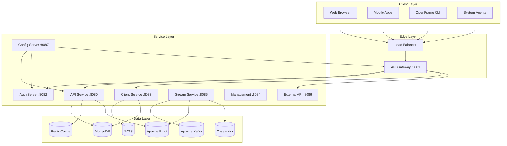
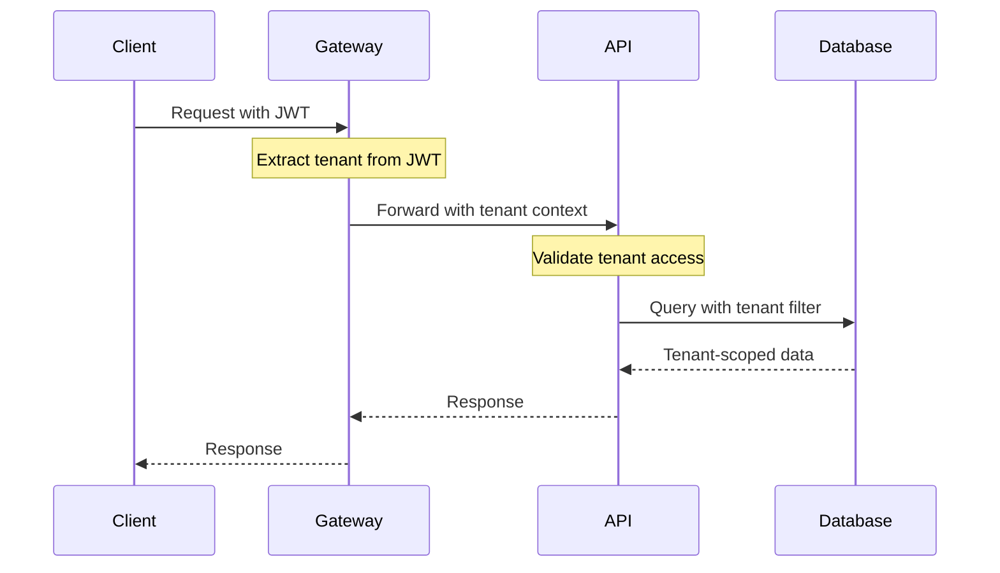
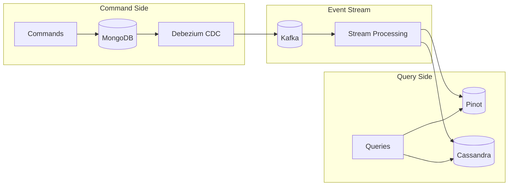
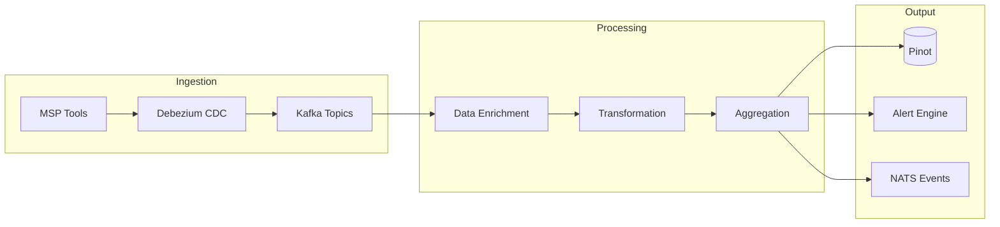
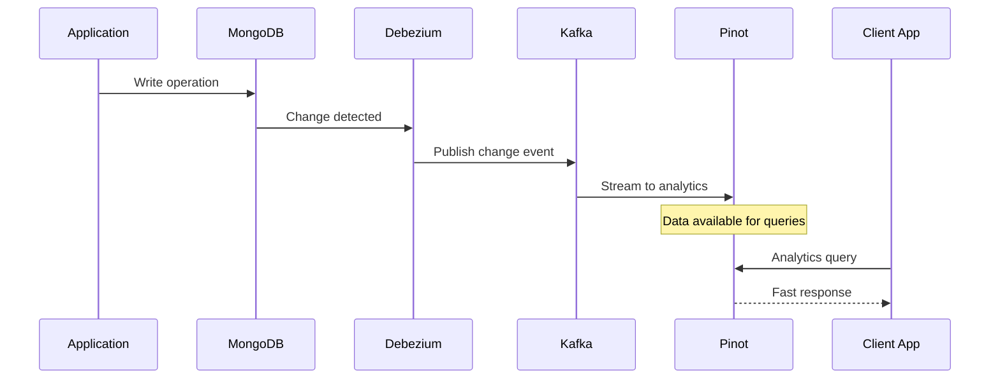
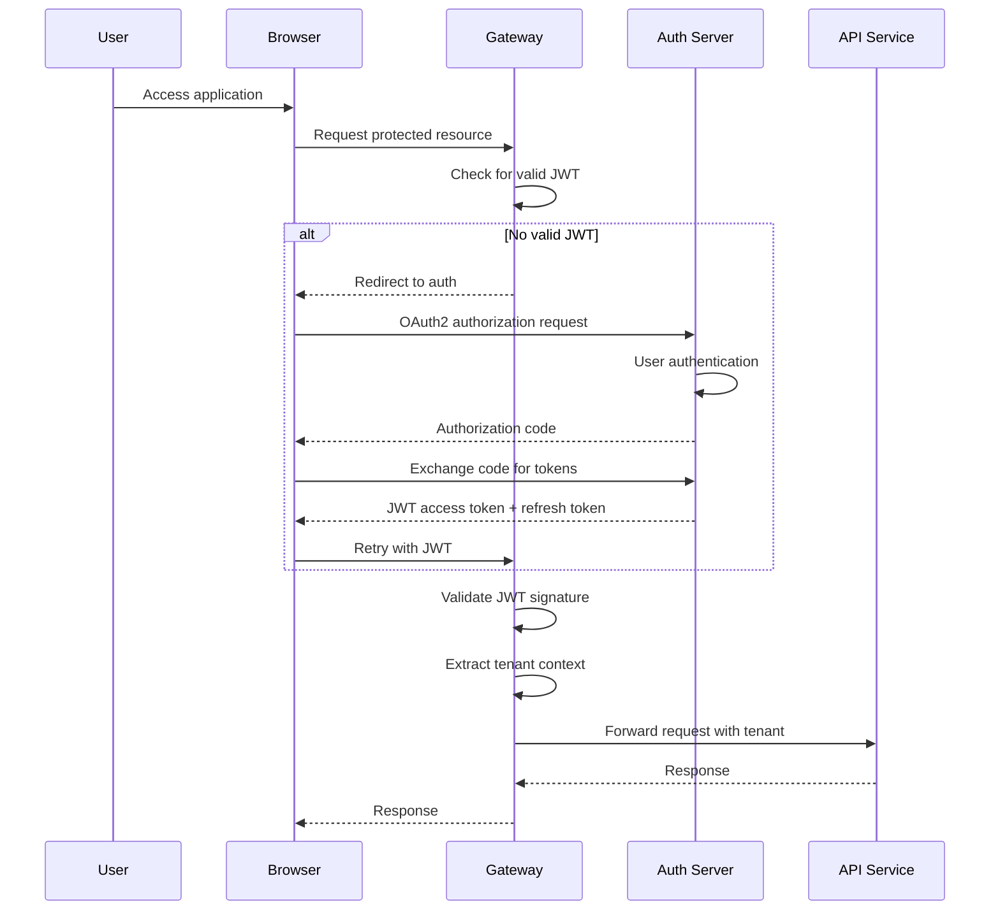
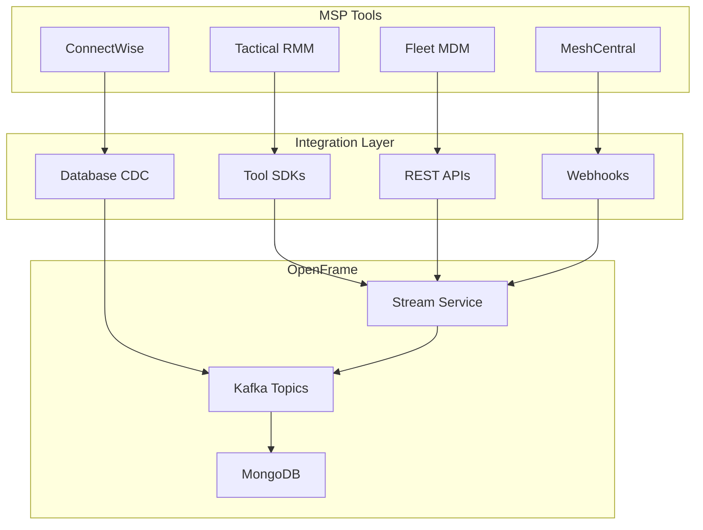
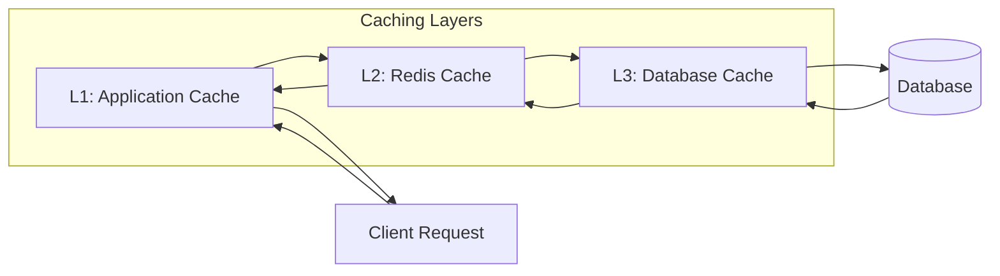
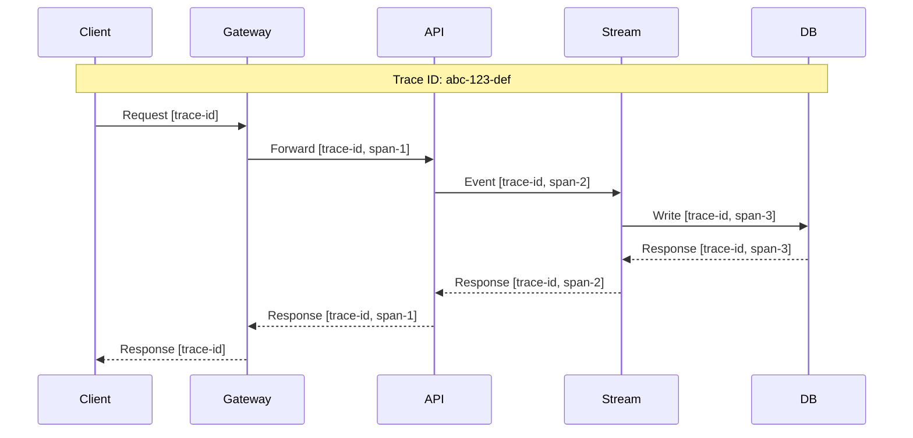

# Architecture Overview

This guide provides a comprehensive overview of OpenFrame's system architecture, explaining how components interact, data flows, and key design decisions.

## High-Level Architecture

OpenFrame follows a **microservice architecture** with **event-driven communication** and **multi-tenant design** principles.



## Core Design Principles

### 1. Multi-Tenancy by Design

Every component is built with multi-tenancy as a fundamental concern:

- **Tenant Context Propagation**: Tenant ID flows through all service calls
- **Data Isolation**: Database queries are tenant-scoped by default  
- **Security Boundaries**: Authentication and authorization are tenant-aware
- **Resource Isolation**: Caching and messaging are tenant-partitioned



### 2. Event-Driven Architecture

OpenFrame uses multiple event patterns for different purposes:

| Pattern | Technology | Use Case |
|---------|------------|----------|
| **Domain Events** | Kafka | Cross-service communication |
| **Change Data Capture** | Debezium | Real-time data synchronization |
| **Real-time Messaging** | NATS | WebSocket broadcasting |
| **GraphQL Subscriptions** | Apollo | Live UI updates |

### 3. CQRS & Event Sourcing

Command Query Responsibility Segregation separates read and write operations:

- **Commands**: Write operations go through MongoDB (source of truth)
- **Queries**: Read operations use Pinot/Cassandra (optimized for analytics)  
- **Event Store**: Kafka maintains complete event history



## Service Architecture Deep Dive

### API Gateway (openframe-gateway)

**Purpose**: Single entry point, routing, authentication, rate limiting

**Key Responsibilities**:
- Route requests to appropriate services
- JWT token validation and extraction
- API key authentication for external clients
- Rate limiting and throttling
- WebSocket connection management
- CORS handling

**Technology Stack**:
- Spring WebFlux (reactive)
- Spring Cloud Gateway
- Redis for rate limiting
- JWT processing

```java
// Gateway routing configuration example
@Bean
public RouteLocator customRouteLocator(RouteLocatorBuilder builder) {
    return builder.routes()
        .route("api_route", r -> r.path("/api/**")
            .filters(f -> f.addRequestHeader("X-Tenant-ID", "#{headers['tenant']}")
                          .rateLimit(c -> c.setRateLimiter(redisRateLimiter())))
            .uri("http://localhost:8080"))
        .route("auth_route", r -> r.path("/auth/**")
            .uri("http://localhost:8082"))
        .build();
}
```

### API Service (openframe-api)

**Purpose**: Core business logic, GraphQL API, data access

**Key Responsibilities**:
- GraphQL schema and resolvers
- Business logic implementation
- Data access and validation
- Real-time subscriptions
- Integration with external services

**Architecture Patterns**:
- **DataFetchers**: GraphQL query resolution
- **DataLoaders**: N+1 query prevention  
- **Service Layer**: Business logic encapsulation
- **Repository Pattern**: Data access abstraction

```java
// GraphQL DataFetcher example
@DgsQuery
public List<Device> devices(@InputArgument DeviceFilterInput filter) {
    String tenantId = TenantContext.getCurrentTenant();
    return deviceService.findDevices(tenantId, filter);
}

@DgsSubscription
public Flux<DeviceEvent> deviceUpdates(@InputArgument String organizationId) {
    return deviceEventPublisher.subscribe(organizationId);
}
```

### Stream Service (openframe-stream)

**Purpose**: Real-time event processing, data enrichment, analytics pipeline

**Key Responsibilities**:
- Kafka message consumption
- Event enrichment and transformation
- Data aggregation and analytics
- Real-time alerting
- Integration with external tools

**Processing Pipeline**:



**Event Processing Example**:

```java
@KafkaListener(topics = "device.events", groupId = "stream-processor")
public void processDeviceEvent(DeviceEvent event) {
    // Enrich with organizational data
    Organization org = organizationService.findById(event.getOrganizationId());
    
    // Transform for analytics
    DeviceMetrics metrics = transformToMetrics(event, org);
    
    // Store for analytics
    pinotRepository.save(metrics);
    
    // Generate alerts if needed
    if (metrics.getCpuUsage() > 90) {
        alertService.createAlert(metrics);
    }
}
```

### Authorization Server (openframe-authorization-server)

**Purpose**: OAuth2/OIDC identity provider, SSO, tenant management

**Key Responsibilities**:
- OAuth2 authorization flows
- JWT token issuance and validation
- SSO integration (Google, Microsoft, etc.)
- Tenant discovery and registration
- Multi-factor authentication

**OAuth2 Flows Supported**:
- Authorization Code with PKCE (browser apps)
- Client Credentials (service-to-service)
- Device Code (CLI/mobile apps)
- Refresh Token rotation

## Data Architecture

### Database Strategy

OpenFrame uses a **polyglot persistence** approach:

| Database | Purpose | Characteristics |
|----------|---------|-----------------|
| **MongoDB** | Source of truth | Document store, ACID transactions |
| **Apache Pinot** | Analytics queries | OLAP, sub-second queries |
| **Cassandra** | Event storage | Time-series, high write throughput |
| **Redis** | Caching | In-memory, pub/sub capabilities |

### Data Flow Pattern



### Schema Design Patterns

#### Multi-Tenant Document Structure

```javascript
// MongoDB document example
{
  "_id": ObjectId("..."),
  "tenantId": "tenant_123",
  "organizationId": "org_456", 
  "deviceId": "device_789",
  "name": "Server-01",
  "status": "ONLINE",
  "metadata": {
    "os": "Ubuntu 22.04",
    "cpu": "Intel Xeon",
    "memory": "32GB"
  },
  "createdAt": ISODate("..."),
  "updatedAt": ISODate("...")
}
```

#### Analytics Schema (Pinot)

```sql
-- Pinot table schema for device metrics
CREATE TABLE device_metrics (
  tenantId VARCHAR(50),
  organizationId VARCHAR(50),
  deviceId VARCHAR(50), 
  timestamp LONG,
  cpuUsage DOUBLE,
  memoryUsage DOUBLE,
  diskUsage DOUBLE,
  networkIn LONG,
  networkOut LONG,
  eventType VARCHAR(20)
) 
WITH (
  "tableName" = "device_metrics",
  "tableType" = "REALTIME",
  "segmentsConfig" = {
    "timeColumnName": "timestamp",
    "timeType": "MILLISECONDS",
    "retentionTimeUnit": "DAYS",
    "retentionTimeValue": "7"
  }
);
```

## Security Architecture

### Authentication Flow



### Authorization Patterns

#### Role-Based Access Control (RBAC)

```java
// Security configuration example
@PreAuthorize("hasRole('ADMIN') or (hasRole('USER') and #organizationId == authentication.principal.organizationId)")
public List<Device> getDevices(String organizationId) {
    return deviceService.findByOrganization(organizationId);
}
```

#### Tenant Isolation

```java
// Repository pattern with automatic tenant filtering
@Repository
public class DeviceRepository {
    
    @Query("{ 'tenantId': ?#{T(com.openframe.security.TenantContext).getCurrentTenant()}, 'organizationId': ?0 }")
    List<Device> findByOrganization(String organizationId);
}
```

## Integration Architecture

### External Tool Integration

OpenFrame integrates with MSP tools through multiple patterns:



### API Integration Patterns

#### SDK-Based Integration (Tactical RMM)

```java
@Service
public class TacticalRmmIntegration {
    
    private final TacticalRmmClient client;
    
    @Scheduled(fixedDelay = 300000) // 5 minutes
    public void syncAgents() {
        String tenantId = getTenantContext();
        List<AgentInfo> agents = client.getAgents();
        
        agents.forEach(agent -> {
            Device device = mapToDevice(agent, tenantId);
            deviceService.upsert(device);
            
            // Publish event for real-time updates
            eventPublisher.publishEvent(new DeviceUpdatedEvent(device));
        });
    }
}
```

## Performance & Scalability

### Caching Strategy



#### Cache Configuration

```java
@Configuration
@EnableCaching
public class CacheConfig {
    
    @Bean
    public CacheManager cacheManager(RedisConnectionFactory connectionFactory) {
        RedisCacheConfiguration config = RedisCacheConfiguration
            .defaultCacheConfig()
            .entryTtl(Duration.ofMinutes(10))
            .serializeKeysWith(RedisSerializationContext.SerializationPair
                .fromSerializer(new StringRedisSerializer()))
            .serializeValuesWith(RedisSerializationContext.SerializationPair
                .fromSerializer(new GenericJackson2JsonRedisSerializer()));
        
        return RedisCacheManager.builder(connectionFactory)
            .cacheDefaults(config)
            .build();
    }
}
```

### Horizontal Scaling

Services are designed to scale horizontally:

- **Stateless Services**: All services are stateless and can be replicated
- **Database Sharding**: MongoDB sharding by tenant ID
- **Event Partitioning**: Kafka topics partitioned by tenant
- **Load Balancing**: Services deployed behind load balancers

## Monitoring & Observability

### Distributed Tracing



### Metrics Collection

```java
// Custom metrics example
@RestController
public class DeviceController {
    
    private final MeterRegistry meterRegistry;
    private final Counter deviceRequestsCounter;
    
    public DeviceController(MeterRegistry meterRegistry) {
        this.meterRegistry = meterRegistry;
        this.deviceRequestsCounter = Counter.builder("device.requests")
            .description("Number of device requests")
            .tag("service", "api")
            .register(meterRegistry);
    }
    
    @GetMapping("/devices/{id}")
    public ResponseEntity<Device> getDevice(@PathVariable String id) {
        deviceRequestsCounter.increment();
        
        Timer.Sample sample = Timer.start(meterRegistry);
        try {
            Device device = deviceService.findById(id);
            return ResponseEntity.ok(device);
        } finally {
            sample.stop(Timer.builder("device.request.duration")
                .tag("operation", "get")
                .register(meterRegistry));
        }
    }
}
```

## Key Design Decisions

### Why GraphQL?

- **Type Safety**: Strong typing reduces runtime errors
- **Efficient Queries**: Clients request only needed data
- **Real-time Subscriptions**: Built-in support for live updates
- **Introspection**: Self-documenting API

### Why Event Sourcing?

- **Audit Trail**: Complete history of all changes
- **Replay Capability**: Reconstruct state from events
- **Debugging**: Full visibility into system behavior
- **Analytics**: Rich data for business intelligence

### Why Multi-Database?

- **Right Tool for Job**: Each database optimized for its use case
- **Performance**: Specialized databases perform better
- **Scalability**: Different scaling characteristics
- **Resilience**: Failure isolation between systems

## Anti-Patterns to Avoid

### ❌ Direct Database Access
```java
// DON'T: Direct repository calls without tenant context
deviceRepository.findAll(); // Exposes all tenant data!

// DO: Use service layer with tenant validation
deviceService.findDevicesForCurrentTenant();
```

### ❌ Synchronous Cross-Service Calls
```java
// DON'T: Blocking calls between services
Device device = restTemplate.getForObject("/devices/" + id, Device.class);

// DO: Use events for eventual consistency
eventPublisher.publishEvent(new DeviceUpdateRequest(id));
```

### ❌ Shared Database Tables
```sql
-- DON'T: Single table for all tenants without proper isolation
SELECT * FROM devices WHERE id = ?;

-- DO: Always include tenant filter
SELECT * FROM devices WHERE tenant_id = ? AND id = ?;
```

## Next Steps

Now that you understand the architecture:

1. **[Testing Overview](../testing/overview.md)** - Learn testing strategies across the architecture
2. **[Contributing Guidelines](../contributing/guidelines.md)** - Start contributing to the platform
3. **[API Documentation](../../reference/api/)** - Explore detailed API specifications

---

**🏗️ Understanding the architecture is key to effective OpenFrame development.** This foundation enables you to make informed decisions about where to implement features and how to maintain system integrity.