# Architecture Overview

This document provides a comprehensive overview of OpenFrame's architecture, including system design, component interactions, data flow, and key design decisions that shape the platform.

## High-Level Architecture

OpenFrame follows a modern microservices architecture designed for scalability, maintainability, and extensibility in MSP environments.

### System Architecture Diagram

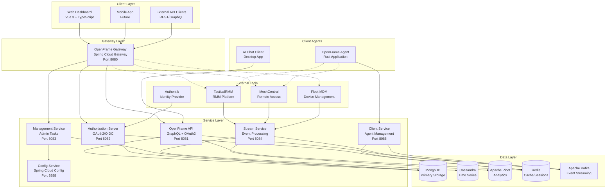

## Core Components

### Gateway Layer

#### OpenFrame Gateway
**Purpose**: Central entry point and traffic routing
**Technology**: Spring Cloud Gateway
**Key Responsibilities**:
- Request routing and load balancing
- Authentication and authorization
- Rate limiting and throttling
- CORS handling
- WebSocket proxy for real-time features
- Tool integration proxy

**Configuration**:
```yaml
spring:
  cloud:
    gateway:
      routes:
        - id: api-route
          uri: http://openframe-api:8081
          predicates:
            - Path=/api/**, /graphql/**
        - id: auth-route
          uri: http://openframe-authorization-server:8082
          predicates:
            - Path=/oauth2/**, /login/**
        - id: tools-route
          uri: http://tactical-rmm:8000
          predicates:
            - Path=/tactical/**
          filters:
            - StripPrefix=1
```

### Service Layer

#### OpenFrame API Service
**Purpose**: Core business logic and GraphQL API
**Technology**: Spring Boot + Netflix DGS
**Key Responsibilities**:
- GraphQL schema and resolvers
- Business logic implementation
- Data access and caching
- Real-time subscriptions via WebSocket
- Authentication and authorization

**Data Flow**:
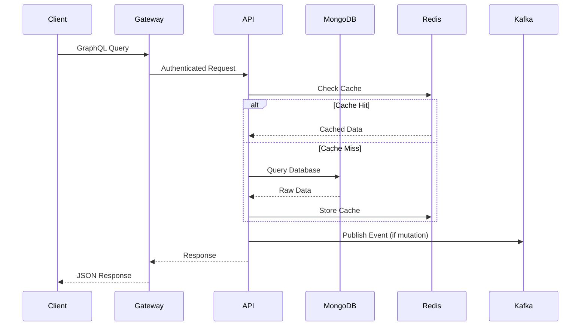

#### Authorization Server
**Purpose**: OAuth2/OpenID Connect authentication
**Technology**: Spring Authorization Server
**Key Responsibilities**:
- User authentication and authorization
- JWT token issuance and validation
- Multi-tenant support
- SSO integration
- Session management

#### Management Service
**Purpose**: Administrative operations and scheduled tasks
**Technology**: Spring Boot + Spring Scheduler
**Key Responsibilities**:
- System maintenance tasks
- Data cleanup and archiving
- Health monitoring
- Configuration management
- Backup coordination

#### Stream Service
**Purpose**: Real-time data processing and enrichment
**Technology**: Spring Boot + Apache Kafka
**Key Responsibilities**:
- Event stream processing
- Data transformation and enrichment
- Metric aggregation
- Alert generation
- Integration with external tools

**Stream Processing Architecture**:
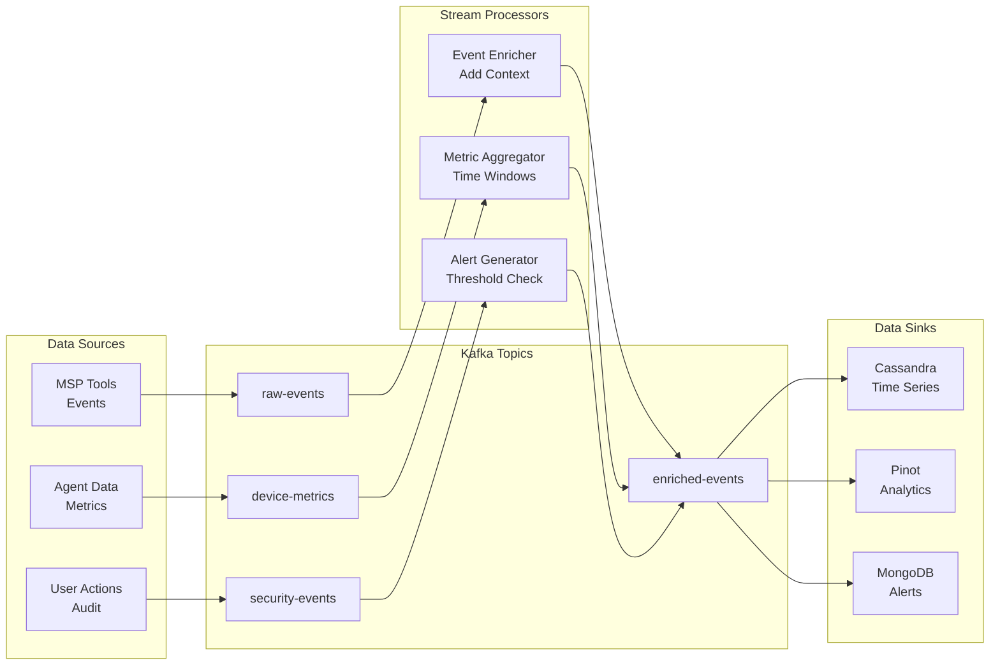

#### Client Service
**Purpose**: Agent management and coordination
**Technology**: Spring Boot + NATS
**Key Responsibilities**:
- Agent registration and authentication
- Command distribution
- Status monitoring
- File transfer coordination
- Tool installation management

### Data Layer

#### MongoDB (Primary Storage)
**Purpose**: Primary operational data storage
**Usage**:
- User accounts and organizations
- Device inventory and metadata
- Configuration and policies
- Audit logs and events
- Tool integration settings

**Collections Structure**:
```javascript
// Key MongoDB collections
{
  "users": {
    "_id": ObjectId,
    "email": String,
    "organizationId": ObjectId,
    "roles": [String],
    "lastLogin": Date
  },
  "organizations": {
    "_id": ObjectId,
    "name": String,
    "domain": String,
    "settings": Object,
    "createdAt": Date
  },
  "devices": {
    "_id": ObjectId,
    "hostname": String,
    "organizationId": ObjectId,
    "agentId": String,
    "lastSeen": Date,
    "metadata": Object
  }
}
```

#### Cassandra (Time Series Storage)
**Purpose**: High-volume time-series data
**Usage**:
- Device metrics and performance data
- Log events and audit trails
- Historical monitoring data
- Alert history

**Keyspace Design**:
```cql
CREATE TABLE device_metrics (
  device_id UUID,
  metric_timestamp TIMESTAMP,
  metric_name TEXT,
  metric_value DOUBLE,
  tags MAP<TEXT, TEXT>,
  PRIMARY KEY (device_id, metric_timestamp, metric_name)
) WITH CLUSTERING ORDER BY (metric_timestamp DESC);

CREATE TABLE log_events (
  device_id UUID,
  log_date DATE,
  log_timestamp TIMESTAMP,
  level TEXT,
  source TEXT,
  message TEXT,
  PRIMARY KEY ((device_id, log_date), log_timestamp)
) WITH CLUSTERING ORDER BY (log_timestamp DESC);
```

#### Apache Pinot (Analytics Engine)
**Purpose**: Real-time analytics and reporting
**Usage**:
- Dashboard analytics
- Performance reporting
- Compliance monitoring
- Cost analysis

#### Redis (Caching and Sessions)
**Purpose**: High-performance caching and session storage
**Usage**:
- Session management
- GraphQL query caching
- Rate limiting counters
- Real-time data caching
- Pub/sub messaging

#### Apache Kafka (Event Streaming)
**Purpose**: Event-driven communication and data pipeline
**Usage**:
- Service-to-service communication
- Real-time data streaming
- Event sourcing
- Integration with external tools

**Topic Structure**:
```yaml
Topics:
  raw-events:
    partitions: 12
    replication: 3
    retention: 7 days
    
  device-metrics:
    partitions: 24
    replication: 3
    retention: 30 days
    
  security-events:
    partitions: 6
    replication: 3
    retention: 90 days
    
  audit-logs:
    partitions: 6
    replication: 3
    retention: 365 days
```

## Authentication and Authorization

### Authentication Flow

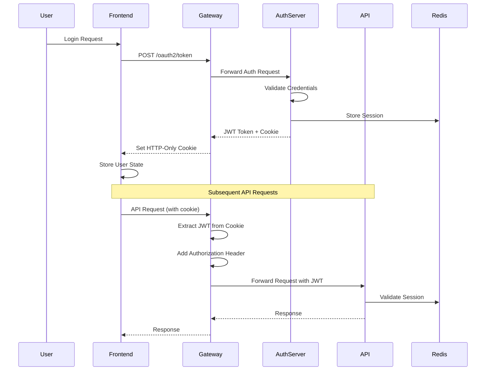

### Authorization Model

OpenFrame implements Role-Based Access Control (RBAC) with multi-tenancy:

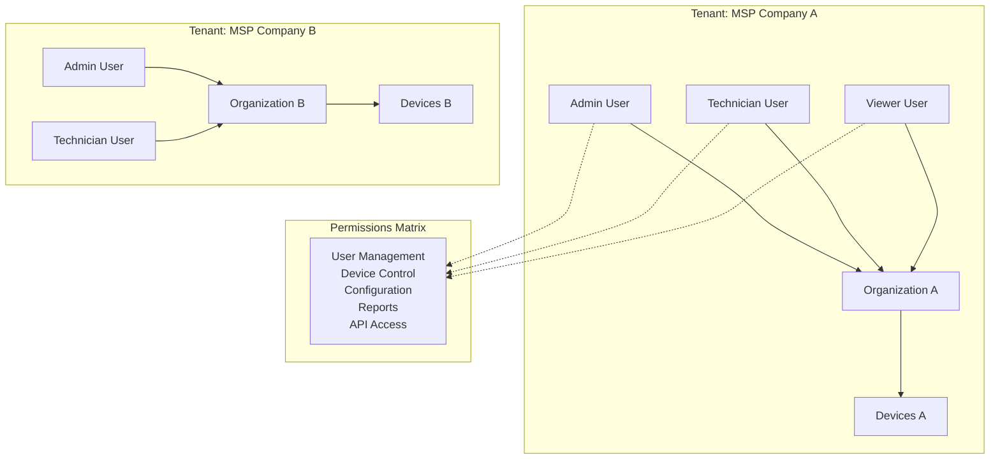

**Permission Levels**:

| Role | User Mgmt | Device Control | Configuration | Reports | API Access |
|------|-----------|----------------|---------------|---------|-------------|
| **Super Admin** | ✅ All Tenants | ✅ All Tenants | ✅ System Config | ✅ All | ✅ Full |
| **Tenant Admin** | ✅ Own Tenant | ✅ Own Devices | ✅ Tenant Config | ✅ Own Tenant | ✅ Full |
| **Technician** | ❌ | ✅ Own Devices | ❌ | ✅ Own Tenant | ✅ Limited |
| **Viewer** | ❌ | ❌ | ❌ | ✅ Own Tenant | ✅ Read Only |

## Data Flow Architecture

### Real-Time Data Pipeline

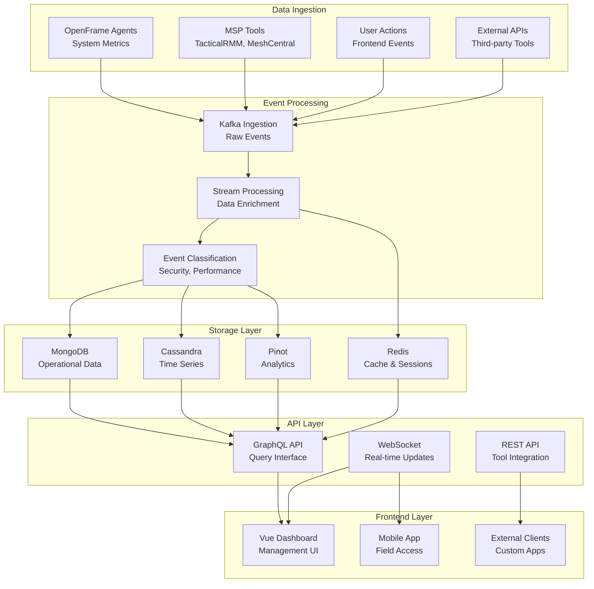

### Query Processing

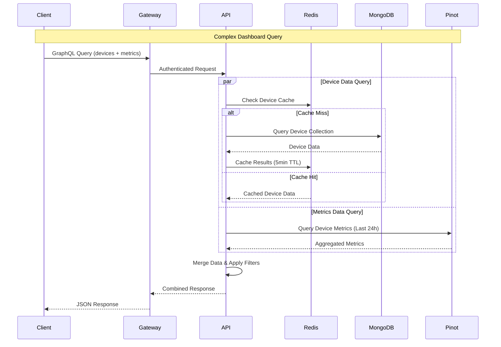

## External Tool Integration

### Integration Architecture

OpenFrame integrates with existing MSP tools through a unified proxy approach:

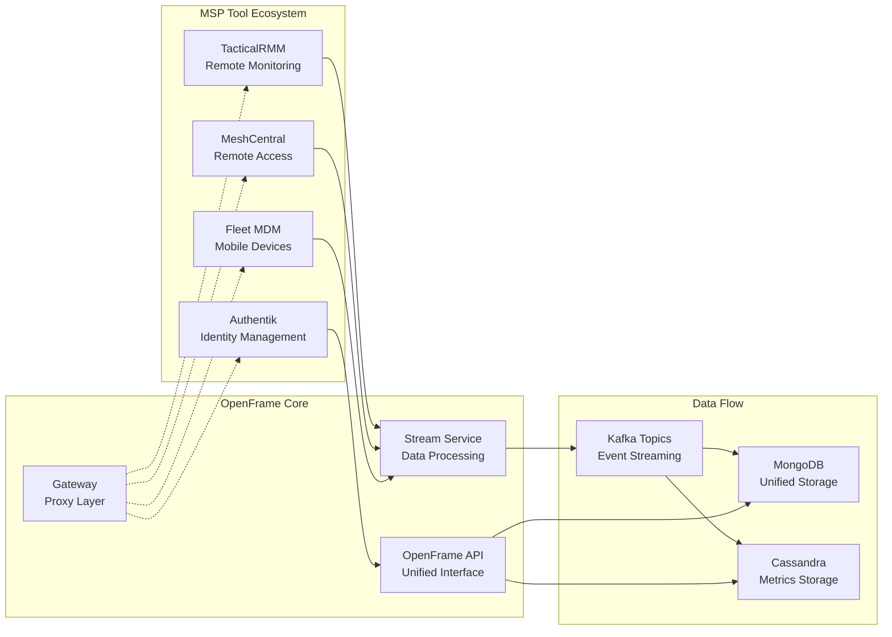

### Tool Integration Patterns

#### 1. API Proxy Pattern
For tools with REST APIs (TacticalRMM):
```java
@Component
@RequiredArgsConstructor
public class TacticalRmmProxy {
    private final WebClient tacticalClient;
    
    public Mono<DeviceList> getDevices(String organizationId) {
        return tacticalClient
            .get()
            .uri("/api/v1/agents?org={org}", organizationId)
            .header("X-API-KEY", getApiKey(organizationId))
            .retrieve()
            .bodyToMono(DeviceList.class)
            .map(this::mapToOpenFrameDevices);
    }
}
```

#### 2. Event Streaming Pattern
For real-time data integration:
```java
@KafkaListener(topics = "tactical-rmm-events")
public void processTacticalEvent(TacticalRmmEvent event) {
    DeviceEvent openFrameEvent = DeviceEvent.builder()
        .deviceId(event.getAgentId())
        .organizationId(event.getOrganizationId())
        .timestamp(Instant.now())
        .eventType(mapEventType(event.getType()))
        .data(event.getData())
        .build();
        
    eventPublisher.publishEvent(openFrameEvent);
}
```

#### 3. WebSocket Relay Pattern
For real-time features (MeshCentral remote control):
```javascript
// Gateway WebSocket proxy configuration
{
  path: "/meshcentral/**",
  target: "ws://meshcentral:443",
  changeOrigin: true,
  secure: false,
  headers: {
    "Authorization": "Bearer ${jwt_token}"
  }
}
```

## Performance Characteristics

### System Performance Targets

| Metric | Target | Measurement |
|--------|--------|-------------|
| **API Response Time** | < 200ms | P95 for GraphQL queries |
| **Throughput** | 100,000 events/sec | Kafka ingestion capacity |
| **Concurrent Users** | 10,000+ | Active dashboard sessions |
| **Database Query Time** | < 50ms | P95 for MongoDB queries |
| **Cache Hit Ratio** | > 85% | Redis cache effectiveness |
| **Availability** | 99.9% | Monthly uptime SLA |

### Scalability Design

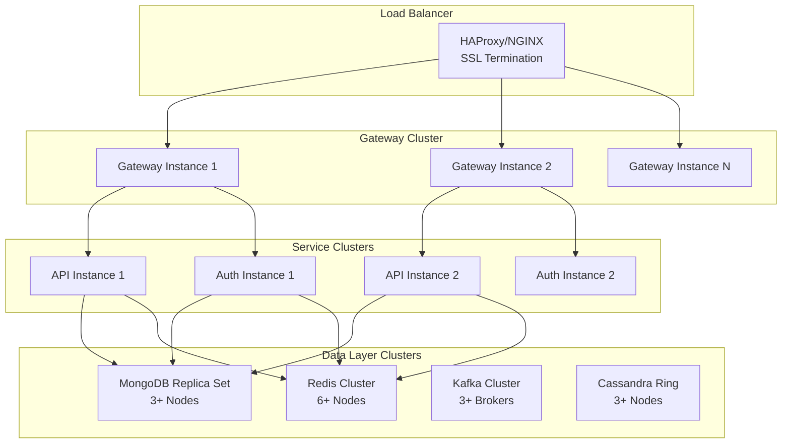

## Security Architecture

### Security Layers

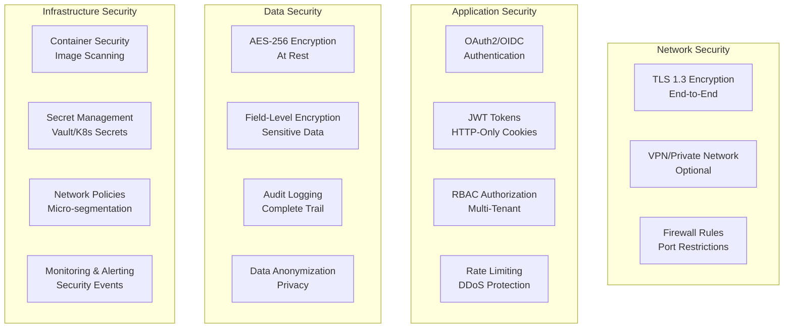

### Threat Model

| Threat Category | Mitigation Strategy | Implementation |
|-----------------|-------------------|----------------|
| **Data Breaches** | Encryption + Access Control | AES-256, JWT, RBAC |
| **Man-in-the-Middle** | TLS Everywhere | Certificate management |
| **Injection Attacks** | Input Validation | Parameterized queries |
| **Privilege Escalation** | Least Privilege | Role-based permissions |
| **DDoS Attacks** | Rate Limiting | Gateway throttling |

## Deployment Architecture

### Kubernetes Deployment

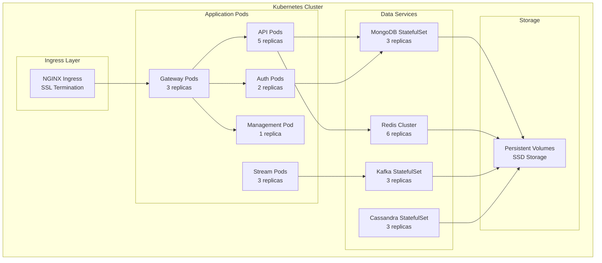

## Key Design Decisions

### 1. Microservices vs. Monolith
**Decision**: Microservices architecture
**Rationale**: 
- Independent scaling of components
- Technology diversity (Java, TypeScript, Rust)
- Team autonomy and parallel development
- Fault isolation

### 2. GraphQL vs. REST
**Decision**: GraphQL for primary API, REST for tool integration
**Rationale**:
- Flexible frontend data fetching
- Strong typing and introspection
- Real-time subscriptions
- Better developer experience

### 3. JWT in Cookies vs. Headers
**Decision**: HTTP-only cookies for JWT storage
**Rationale**:
- XSS attack mitigation
- Automatic CSRF protection
- Browser security best practices
- Mobile app compatibility

### 4. Event Streaming Architecture
**Decision**: Apache Kafka for all inter-service communication
**Rationale**:
- Scalable event processing
- Decoupled service architecture
- Replay and recovery capabilities
- Integration with external tools

### 5. Multi-Database Strategy
**Decision**: Polyglot persistence with specialized databases
**Rationale**:
- MongoDB for operational data (flexibility)
- Cassandra for time-series (scale)
- Pinot for analytics (performance)
- Redis for caching (speed)

### 6. Container-First Deployment
**Decision**: Kubernetes-native architecture
**Rationale**:
- Cloud-agnostic deployment
- Auto-scaling and healing
- Resource efficiency
- DevOps best practices

## Future Architecture Considerations

### Planned Enhancements

1. **Service Mesh Integration**: Istio for advanced traffic management
2. **Event Sourcing**: Complete event-driven architecture
3. **CQRS Implementation**: Separate read/write models
4. **Multi-Region Deployment**: Global availability
5. **AI/ML Pipeline**: Integrated machine learning capabilities

### Technology Evolution

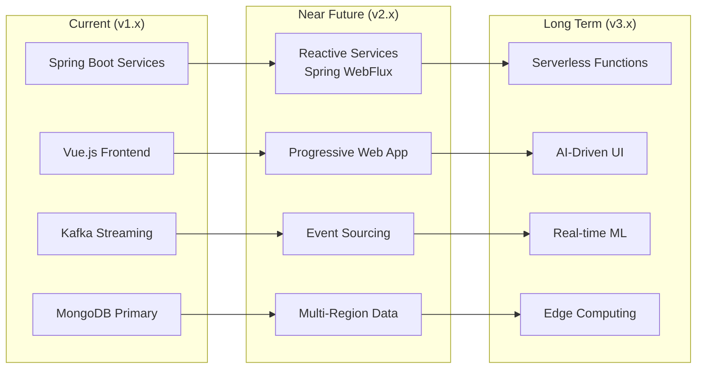

This architecture overview provides the foundation for understanding OpenFrame's design and implementation. The system is designed to be scalable, maintainable, and extensible while meeting the demanding requirements of modern MSP operations.

For implementation details of specific components, refer to the individual service documentation and the [Development Setup](../setup/environment.md) guides.