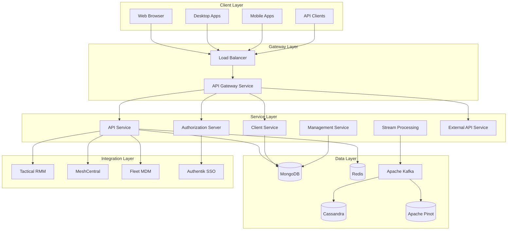
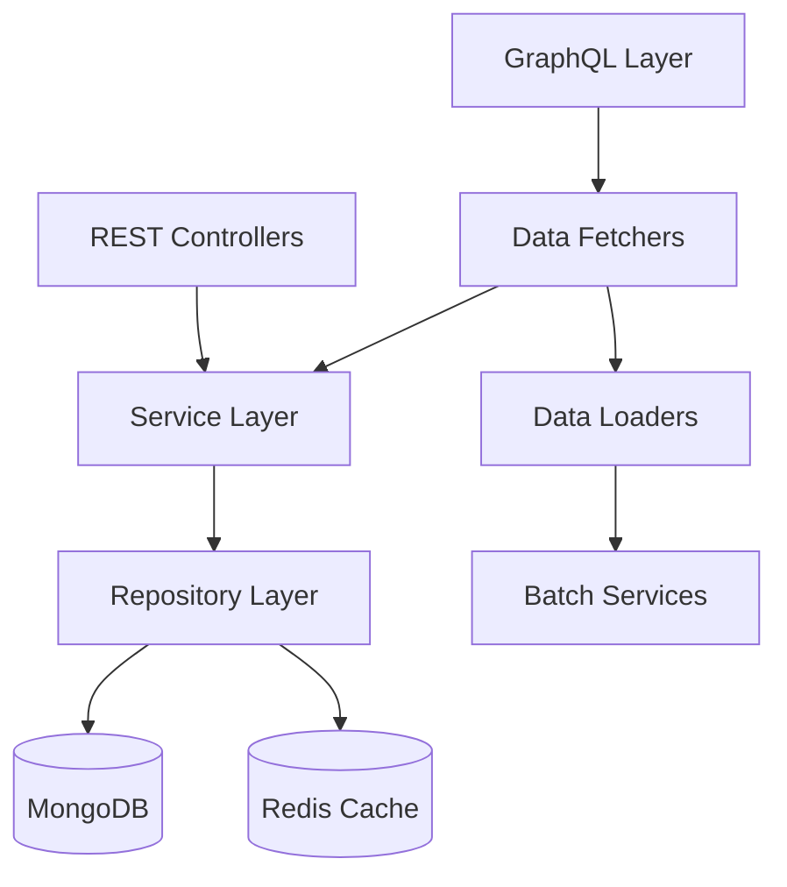
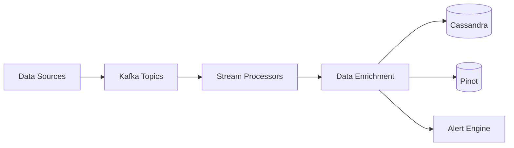
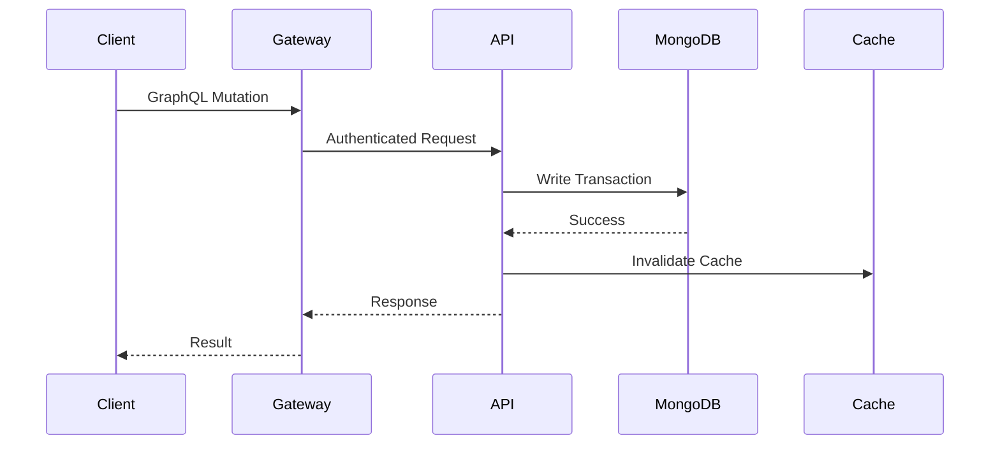
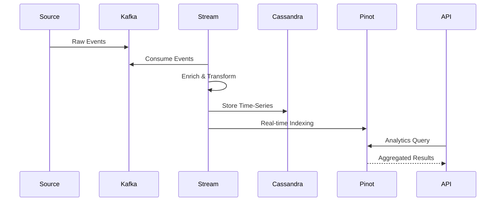
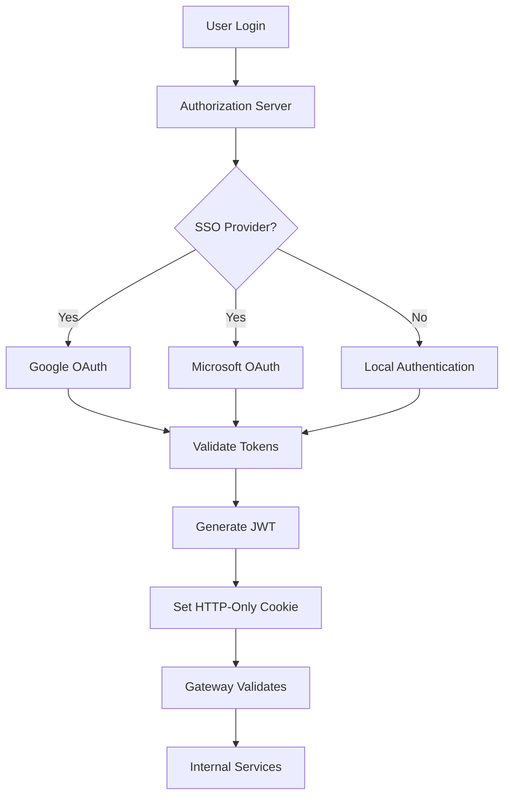
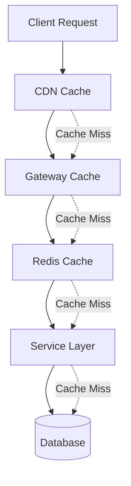
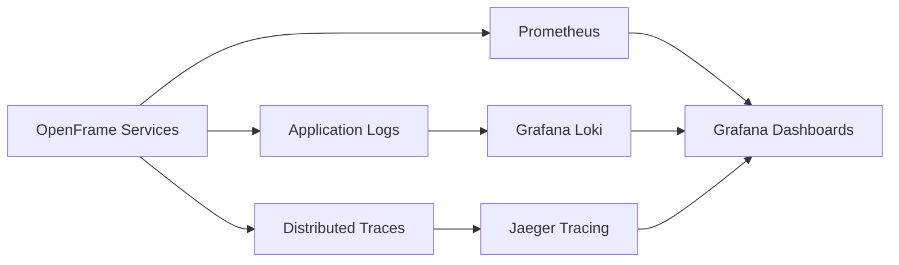

# Architecture Overview

OpenFrame is built as a distributed, microservices-based platform designed for scalability, maintainability, and extensibility. This document provides a comprehensive overview of the system architecture, core components, and design decisions.

## High-Level Architecture



## Core Components

### API Gateway Service

**Purpose**: Single entry point for all client communications

**Responsibilities**:
- Request routing and load balancing
- Authentication and authorization
- Rate limiting and throttling
- CORS policy enforcement
- WebSocket connection management
- API versioning and documentation

**Technology Stack**:
- Spring Cloud Gateway
- JWT token validation
- Redis for rate limiting
- WebSocket proxy support

### API Service Core

**Purpose**: Primary business logic and data access layer

**Key Features**:
- GraphQL API for flexible data querying
- REST endpoints for standard operations
- Multi-tenant data isolation
- Real-time subscriptions
- Batch data loading (N+1 prevention)

**Architecture Pattern**:


### Authorization Server

**Purpose**: OAuth 2.1 / OpenID Connect identity provider

**Features**:
- Multi-tenant SSO support
- Google and Microsoft integration
- JWT token issuance and validation
- User invitation and onboarding
- Session management

**Security Model**:
- RSA key pairs per tenant
- HTTP-only cookies for web clients
- Bearer tokens for API clients
- Refresh token rotation

### Client Service

**Purpose**: Device agent management and coordination

**Capabilities**:
- Agent registration and authentication
- Heartbeat monitoring
- Tool agent lifecycle management
- Remote command execution
- File system operations

### Stream Processing Service

**Purpose**: Real-time event processing and data enrichment

**Data Flow**:


**Processing Types**:
- Device telemetry aggregation
- Log event correlation
- Security event detection
- Performance metric calculation
- Compliance monitoring

## Data Architecture

### Database Selection Strategy

| Database | Use Case | Rationale |
|----------|----------|-----------|
| **MongoDB** | Transactional data | Document flexibility, ACID compliance |
| **Cassandra** | Time-series data | High write throughput, time-based partitioning |
| **Redis** | Caching & sessions | Low latency, pub/sub capabilities |
| **Apache Pinot** | Analytics queries | Real-time OLAP, sub-second query response |

### Data Flow Patterns

#### Transactional Operations



#### Analytics Pipeline



## Security Architecture

### Authentication Flow



### Authorization Model

```mermaid
classDiagram
    class User {
        +id: String
        +email: String
        +roles: List~Role~
        +organizationId: String
    }
    
    class Role {
        +name: String
        +permissions: List~Permission~
    }
    
    class Permission {
        +resource: String
        +action: String
        +scope: String
    }
    
    class Organization {
        +id: String
        +name: String
        +users: List~User~
    }
    
    User ||--o{ Role : has
    Role ||--o{ Permission : contains
    Organization ||--o{ User : contains
```

### Multi-Tenant Isolation

- **Data Isolation**: Organization-based partitioning in MongoDB
- **Service Isolation**: Tenant context propagation via JWT claims
- **Cache Isolation**: Redis key prefixing by tenant ID
- **Stream Isolation**: Kafka topic partitioning by organization

## Component Integration Patterns

### Service-to-Service Communication

#### Synchronous Communication
```java
// REST Client with Circuit Breaker
@FeignClient(name = "management-service")
public interface ManagementClient {
    @GetMapping("/api/organizations/{id}")
    Organization getOrganization(@PathVariable String id);
}
```

#### Asynchronous Communication
```java
// Kafka Event Publishing
@EventListener
public void handleDeviceEvent(DeviceStatusChangedEvent event) {
    kafkaTemplate.send("device-events", event.getDeviceId(), event);
}
```

### Data Access Patterns

#### Repository Pattern with Caching

```java
@Service
public class DeviceService {
    
    @Autowired
    private DeviceRepository repository;
    
    @Autowired
    private RedisTemplate<String, Device> cache;
    
    @Cacheable(value = "devices", key = "#deviceId")
    public Device getDevice(String deviceId) {
        return repository.findById(deviceId)
            .orElseThrow(() -> new DeviceNotFoundException(deviceId));
    }
}
```

#### Event Sourcing for Audit Trail

```java
@EventHandler
public void on(DeviceRegisteredEvent event) {
    Device device = new Device(event.getDeviceId());
    device.setOrganizationId(event.getOrganizationId());
    device.setStatus(DeviceStatus.REGISTERED);
    deviceRepository.save(device);
}
```

## Key Design Decisions

### Microservices vs Modular Monolith

**Decision**: Microservices architecture with shared libraries

**Rationale**:
- Independent deployment and scaling
- Technology diversity (Java backend, Rust agents, Vue frontend)
- Team autonomy and ownership
- Fault isolation

**Trade-offs**:
- Increased operational complexity
- Network latency between services
- Distributed transaction challenges

### Database Per Service

**Decision**: Each service owns its data with selective sharing

**Implementation**:
- API Service: MongoDB for business entities
- Stream Service: Cassandra for time-series data
- Gateway: Redis for sessions and rate limiting
- Analytics: Pinot for real-time queries

### Event-Driven Architecture

**Decision**: Kafka-based event streaming for loose coupling

**Benefits**:
- Asynchronous processing
- Event replay capability
- Scalable data pipeline
- Real-time analytics

## Performance and Scalability

### Caching Strategy



### Horizontal Scaling

| Component | Scaling Strategy | Metrics |
|-----------|-----------------|---------|
| **Gateway** | Load balancer + instances | Request rate, response time |
| **API Service** | Stateless replicas | CPU, memory utilization |
| **Stream Processing** | Kafka partitions | Message throughput, lag |
| **Database** | Read replicas, sharding | Connection count, query time |

### Performance Optimization Techniques

1. **GraphQL DataLoaders**: Batch database queries to prevent N+1 problems
2. **Connection Pooling**: Optimized database connection management
3. **Lazy Loading**: Load data only when needed
4. **Pagination**: Cursor-based pagination for large datasets
5. **Compression**: Gzip compression for API responses

## Monitoring and Observability

### Metrics Collection



### Health Checks

```java
@Component
@RestController
public class HealthController {
    
    @GetMapping("/health")
    public ResponseEntity<Map<String, String>> health() {
        Map<String, String> status = new HashMap<>();
        status.put("status", "UP");
        status.put("database", databaseHealth());
        status.put("cache", cacheHealth());
        return ResponseEntity.ok(status);
    }
}
```

## Extension Points

### Plugin Architecture

OpenFrame supports extensions through:

1. **Custom Processors**: Implement event processing logic
2. **Data Mappers**: Transform external data formats
3. **Authentication Providers**: Add new SSO integrations
4. **Tool Integrations**: Connect additional MSP tools

### Configuration Management

```yaml
# application.yml - Extension Configuration
openframe:
  extensions:
    processors:
      - name: "custom-alert-processor"
        class: "com.mycompany.CustomAlertProcessor"
        enabled: true
    integrations:
      - name: "my-rmm-tool"
        type: "rmm"
        config:
          apiUrl: "${MY_RMM_API_URL}"
          apiKey: "${MY_RMM_API_KEY}"
```

## Future Architecture Considerations

### Planned Enhancements

1. **Service Mesh**: Istio integration for advanced traffic management
2. **Event Store**: Dedicated event sourcing database
3. **CQRS Implementation**: Separate read/write models for better performance
4. **API Gateway Evolution**: Move to envoy-based gateway
5. **Multi-Region Support**: Geographic distribution for global MSPs

### Technology Evolution

| Current | Future | Timeline |
|---------|--------|----------|
| Spring Boot 3.3 | Spring Boot 4.x | 2025 |
| Vue 3 | Vue 4 | 2025 |
| Kafka | Event Store + Kafka | 2024 |
| MongoDB 7.x | MongoDB 8.x | 2024 |

---

This architecture enables OpenFrame to scale from single-tenant deployments to large multi-tenant SaaS platforms while maintaining performance, security, and maintainability.