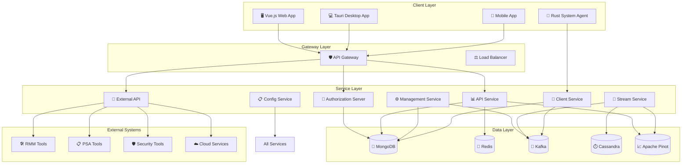
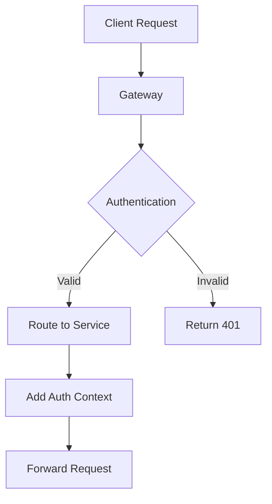
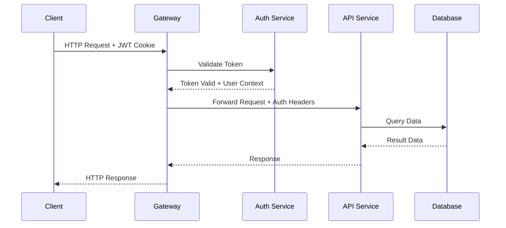
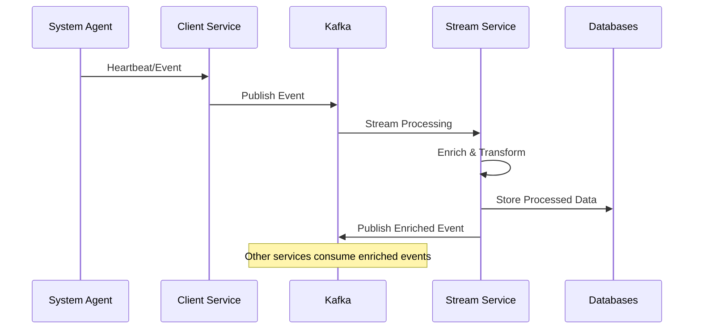
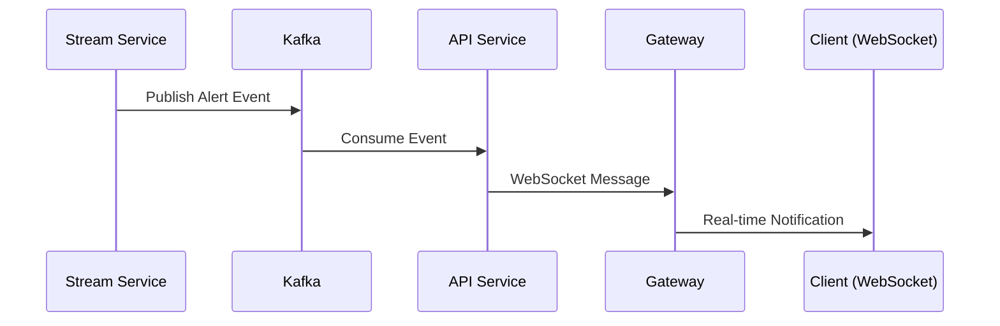
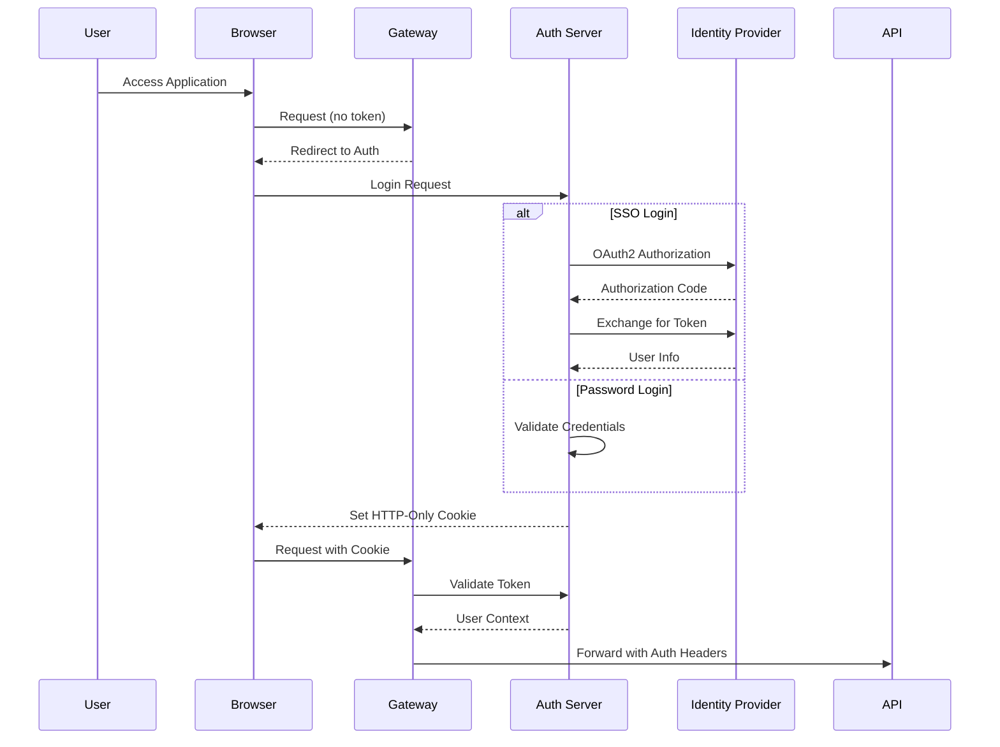
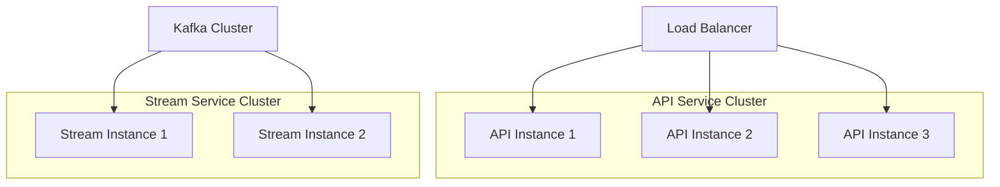
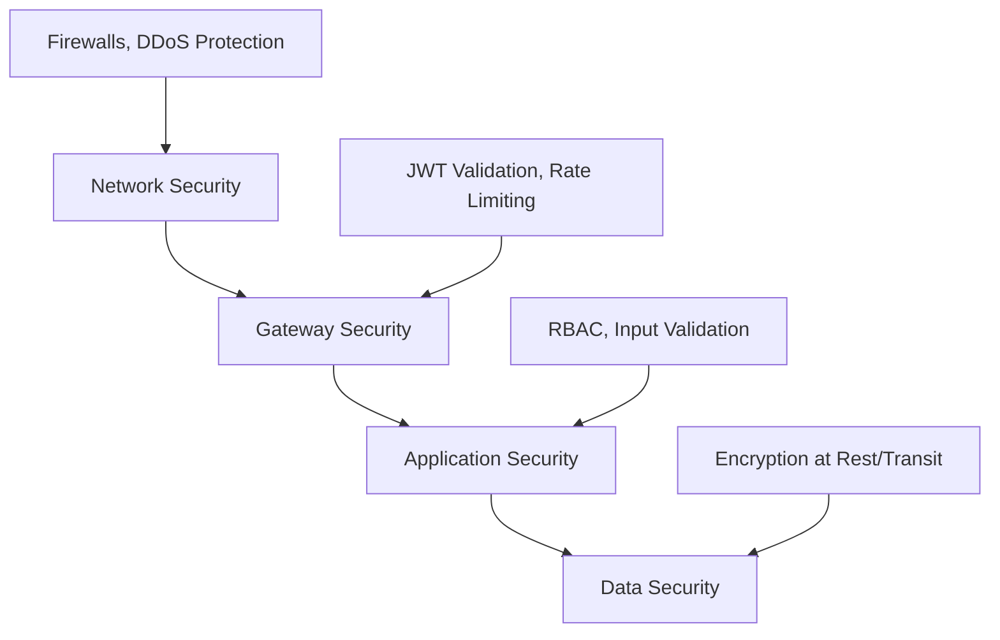

# Architecture Overview

This document provides a comprehensive overview of the OpenFrame architecture, including system design, component interactions, data flow patterns, and key technical decisions.

## System Architecture

OpenFrame follows a distributed microservices architecture designed for scalability, maintainability, and multi-tenancy. The system is built with modern cloud-native principles and emphasizes loose coupling between components.

### High-Level Architecture Diagram



## Core Design Principles

### 1. Multi-Tenancy First
OpenFrame is designed with multi-tenancy as a foundational principle:

- **Tenant Isolation**: Complete data and configuration isolation between tenants
- **Horizontal Scaling**: Services can scale independently per tenant
- **Resource Optimization**: Shared infrastructure with tenant-specific configurations

### 2. Event-Driven Architecture  
The system uses event streaming for loose coupling and real-time capabilities:

- **Kafka Integration**: All inter-service communication uses Kafka topics
- **Event Sourcing**: Critical state changes are captured as events
- **Real-time Processing**: Stream processing for immediate responses

### 3. API-First Design
All functionality is exposed through well-defined APIs:

- **GraphQL**: Primary API for complex queries and real-time subscriptions
- **REST**: Standard endpoints for simple operations and integrations
- **OpenAPI**: Comprehensive API documentation and client generation

### 4. Security by Design
Security is integrated at every layer:

- **OAuth2/OIDC**: Standards-based authentication and authorization
- **Zero Trust**: No implicit trust between components
- **Encryption**: End-to-end encryption for sensitive data

## Component Architecture

### Service Layer Components

#### API Gateway Service
**Purpose**: Entry point for all external requests
**Technology**: Spring Cloud Gateway
**Key Features**:
- Request routing and load balancing
- JWT token validation and conversion
- Rate limiting and throttling
- WebSocket proxy for real-time communication



#### Authorization Server
**Purpose**: OAuth2/OIDC authentication and user management
**Technology**: Spring Authorization Server
**Key Features**:
- Multi-tenant OAuth2 provider
- SSO integration (Google, Microsoft, Custom OIDC)
- User registration and invitation management
- JWT token issuance and validation

#### API Service
**Purpose**: Core business logic and data access APIs
**Technology**: Spring Boot with Netflix DGS (GraphQL)
**Key Features**:
- GraphQL schema and resolvers
- REST endpoints for simple operations
- Database integration (MongoDB, Redis, Pinot)
- Real-time subscriptions

#### Management Service
**Purpose**: System administration and background tasks
**Technology**: Spring Boot with Scheduler
**Key Features**:
- Tenant provisioning and lifecycle management
- Background job processing
- System health monitoring
- Integration management

#### Stream Service
**Purpose**: Real-time event processing and data enrichment
**Technology**: Spring Boot with Kafka Streams
**Key Features**:
- Event stream processing
- Data enrichment and transformation
- Real-time analytics
- Alert generation

#### Client Service
**Purpose**: Agent communication and device management
**Technology**: Spring Boot with WebSocket
**Key Features**:
- Agent registration and authentication
- Device heartbeat processing
- Command dispatch to agents
- Agent software updates

### Data Architecture

#### Primary Database (MongoDB)
**Use Cases**: 
- User accounts and profiles
- Organization and tenant data
- Device metadata and configuration
- OAuth2 tokens and sessions

**Collections**:
```text
users              # User accounts and authentication
organizations      # Client organizations
devices           # Device metadata and configuration
oauth_clients     # OAuth2 client registrations
oauth_tokens      # Access and refresh tokens
tenants           # Tenant configurations
```

#### Cache Layer (Redis)
**Use Cases**:
- Session storage
- API response caching
- Rate limiting counters
- Temporary data storage

**Data Structures**:
```text
sessions:*         # User sessions
cache:api:*        # API response cache
limits:*           # Rate limiting counters
locks:*            # Distributed locks
```

#### Event Streaming (Kafka)
**Use Cases**:
- Inter-service communication
- Real-time data pipeline
- Event sourcing
- Integration with external systems

**Topics**:
```text
device.heartbeats     # Agent heartbeat events
device.alerts         # Device alert notifications
user.activities       # User action events
system.events         # System-level events
integration.events    # External system events
```

#### Time-Series Data (Cassandra)
**Use Cases**:
- Device metrics and monitoring data
- System performance metrics
- Audit logs and trails
- Historical analytics

#### Analytics Database (Apache Pinot)
**Use Cases**:
- Real-time analytics queries
- Dashboard aggregations
- Reporting and business intelligence
- Performance monitoring

## Data Flow Patterns

### Request-Response Flow


### Event Processing Flow


### Real-time Notification Flow


## Authentication & Authorization

### Authentication Flow

OpenFrame uses OAuth2/OIDC with JWT tokens stored in HTTP-only cookies for security:



### Authorization Model

OpenFrame implements a hierarchical role-based access control (RBAC) system:

```text
System Admin
├── Platform-wide access
└── Can manage all tenants

Tenant Admin  
├── Full access within tenant
└── Can manage users and resources

Organization Admin
├── Access to specific organizations
└── Can manage organization users

User Roles
├── Technician: Device and incident management
├── Manager: Read-only access + reporting
└── Viewer: Limited read-only access
```

## Scalability Patterns

### Horizontal Scaling
Each service can scale independently based on load:



### Database Scaling
- **MongoDB**: Sharding by tenant ID for horizontal scaling
- **Redis**: Clustering for high availability and performance
- **Kafka**: Topic partitioning for parallel processing
- **Cassandra**: Natural horizontal scaling with consistent hashing

### Cache Strategies
```text
L1 Cache: In-memory application cache (Caffeine)
L2 Cache: Redis cluster for shared caching
L3 Cache: CDN for static assets (if applicable)
```

## Performance Characteristics

### Response Time Targets
| Operation Type | Target | Measurement |
|---------------|---------|------------|
| **API Queries** | < 200ms | P95 response time |
| **GraphQL Queries** | < 300ms | P95 response time |
| **Real-time Events** | < 100ms | End-to-end latency |
| **Database Writes** | < 50ms | P95 write latency |

### Throughput Targets
| Metric | Target | Notes |
|--------|---------|-------|
| **Concurrent Users** | 10,000+ | Per cluster |
| **API Requests/sec** | 50,000+ | Peak load |
| **Events/sec** | 100,000+ | Stream processing |
| **Device Heartbeats** | 1M+/hour | Agent communication |

## Security Architecture

### Defense in Depth


### Key Security Features
- **End-to-end TLS**: All communication encrypted
- **JWT with HTTP-only Cookies**: Secure token storage
- **API Rate Limiting**: Protection against abuse
- **Input Validation**: Comprehensive sanitization
- **Audit Logging**: Complete audit trail
- **Secret Management**: Encrypted configuration management

## Monitoring & Observability

### Three Pillars of Observability
```text
Metrics (Prometheus)
├── System metrics (CPU, memory, network)
├── Application metrics (request rates, errors)
└── Business metrics (user activities, feature usage)

Logs (ELK Stack)
├── Application logs (structured JSON)
├── Audit logs (security events)
└── Access logs (request/response)

Traces (Jaeger)
├── Distributed tracing
├── Request flow visualization
└── Performance bottleneck identification
```

## Development Patterns

### Service Communication
```text
Synchronous:
- Gateway → Services: HTTP/REST
- Frontend → Gateway: GraphQL/REST
- Service → Database: Native drivers

Asynchronous:  
- Service → Service: Kafka events
- Real-time updates: WebSocket
- Background jobs: Kafka consumers
```

### Configuration Management
```text
Spring Cloud Config Server
├── Environment-specific configs
├── Feature flags and toggles
├── Secrets management
└── Dynamic configuration updates
```

### Error Handling
```text
Application Errors:
├── Global exception handlers
├── Standardized error responses
├── Error code classification
└── Client-friendly messages

System Errors:
├── Circuit breaker patterns
├── Retry mechanisms with backoff
├── Graceful degradation
└── Dead letter queues
```

## Technology Decisions

### Key Technology Choices and Rationale

| Technology | Alternative Considered | Rationale |
|-----------|----------------------|-----------|
| **Java 21** | Java 17, Kotlin | Latest LTS with performance improvements |
| **Spring Boot 3** | Micronaut, Quarkus | Ecosystem maturity and team expertise |
| **Vue 3** | React, Angular | Progressive framework with excellent DX |
| **MongoDB** | PostgreSQL | Document model fits domain well |
| **Kafka** | RabbitMQ, Pulsar | Proven for high-throughput event streaming |
| **Netflix DGS** | GraphQL Java | Type-safe code-first GraphQL |
| **Rust** | Go, C++ | Memory safety and performance for agents |

### Architecture Evolution

The architecture has evolved through several phases:

```text
Phase 1: Monolithic Application
└── Single Spring Boot application

Phase 2: Service Separation  
├── Separate auth from main API
└── Extract management functions

Phase 3: Event-Driven Architecture
├── Introduction of Kafka
├── Stream processing service
└── Real-time capabilities

Phase 4: Multi-Tenant Platform (Current)
├── Tenant isolation
├── Horizontal scaling
└── Advanced analytics
```

## Future Architectural Goals

### Short-term (Next 6 months)
- Enhanced monitoring and observability
- Performance optimization for high-scale deployments
- Advanced security features (zero-trust networking)

### Medium-term (6-12 months)  
- Multi-region deployment support
- Advanced AI/ML integration
- Enhanced edge computing capabilities

### Long-term (1-2 years)
- Serverless function support
- Advanced analytics and business intelligence
- IoT device management expansion

---

This architecture overview provides the foundation for understanding OpenFrame's design and implementation. For specific implementation details, refer to the individual service documentation and code examples.