# Architecture Overview

OpenFrame is built as a distributed microservices platform designed for scalability, reliability, and extensibility. This document provides a comprehensive overview of the system architecture, component responsibilities, and design patterns.

[](https://www.youtube.com/watch?v=bINdW0CQbvY)

## High-Level Architecture

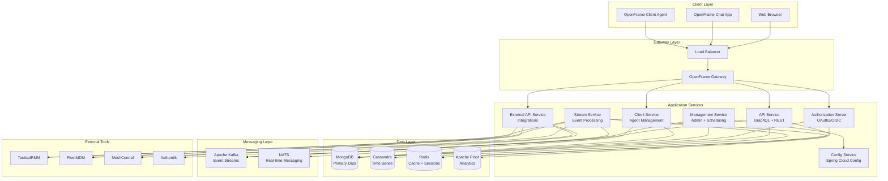

## Core Components

### Service Layer Components

| Service | Port | Responsibility | Technology Stack |
|---------|------|----------------|------------------|
| **OpenFrame Gateway** | 8080 | Request routing, authentication, WebSocket proxy | Spring Cloud Gateway, JWT |
| **API Service** | 8081 | GraphQL API, user management, core business logic | Spring Boot, Netflix DGS |
| **Authorization Server** | 8085 | OAuth2/OIDC provider, tenant management | Spring Authorization Server |
| **Management Service** | 8082 | Administrative tasks, scheduled jobs, system management | Spring Boot, ShedLock |
| **Stream Service** | 8083 | Real-time event processing, data enrichment | Spring Boot, Kafka Streams |
| **Config Service** | 8888 | Centralized configuration management | Spring Cloud Config |
| **Client Service** | 8081 | Agent registration, device communication | Spring Boot, NATS |
| **External API Service** | 8084 | External tool integrations, proxy services | Spring Boot, WebClient |

### Data Storage Components

| Database | Purpose | Data Types | Access Pattern |
|----------|---------|------------|----------------|
| **MongoDB** | Primary data store | Organizations, devices, users, configurations | CRUD operations, complex queries |
| **Cassandra** | Time-series data | Logs, metrics, events, audit trails | Write-heavy, time-range queries |
| **Redis** | Caching and sessions | User sessions, temporary data, rate limiting | Key-value, pub/sub |
| **Apache Pinot** | Analytics | Aggregated metrics, reporting data | OLAP queries, real-time analytics |

### Messaging Components

| System | Purpose | Use Cases |
|--------|---------|-----------|
| **Apache Kafka** | Event streaming | Service communication, data pipeline, integration events |
| **NATS** | Real-time messaging | Agent communication, WebSocket notifications, live updates |

## Service Communication Patterns

### Request/Response Communication

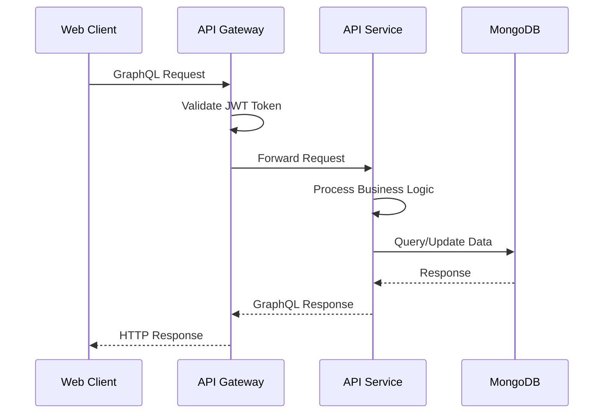

### Event-Driven Communication

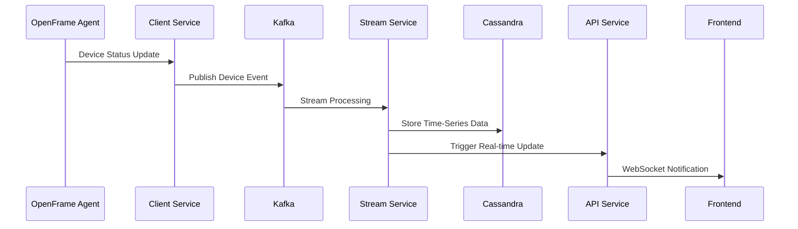

## Data Flow Architecture

### Ingestion Pipeline

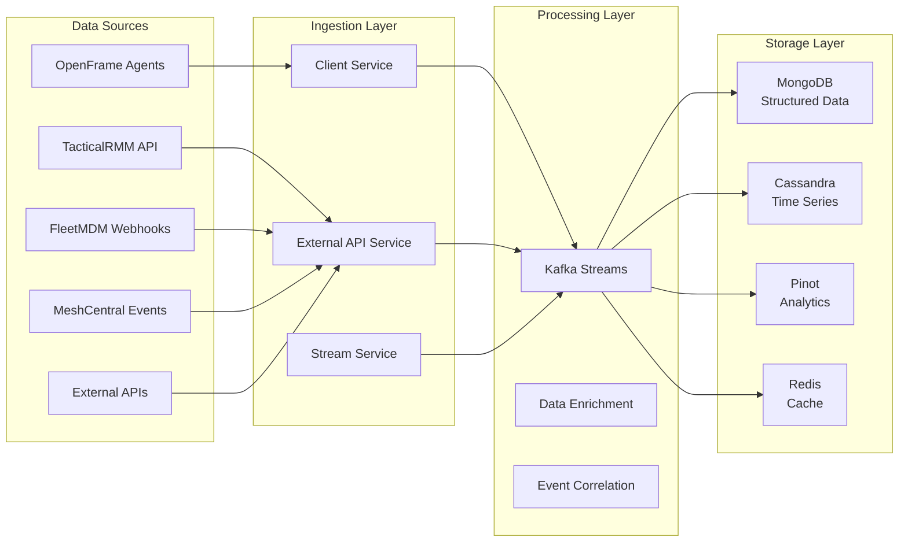

### Query and Response Flow

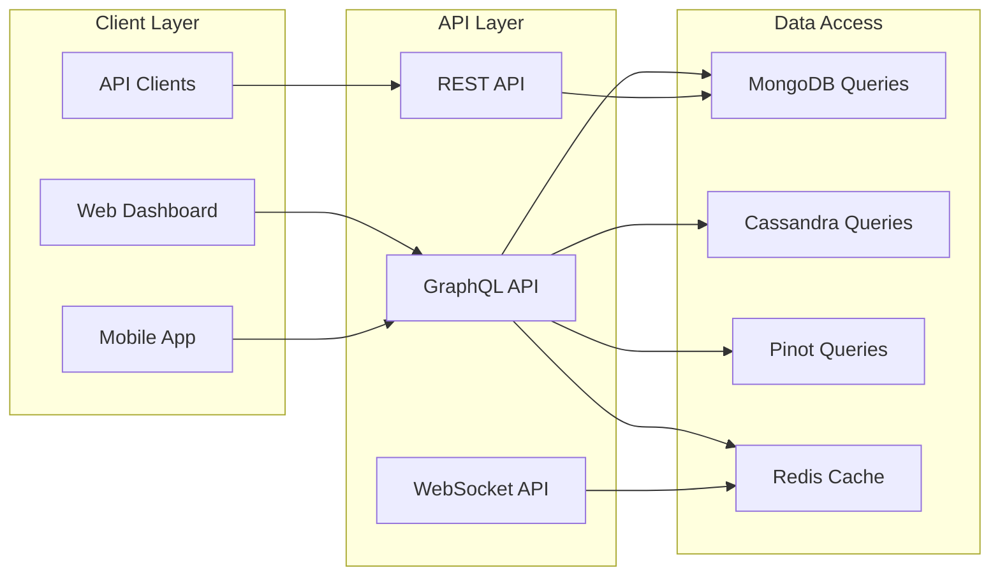

## Security Architecture

### Authentication Flow

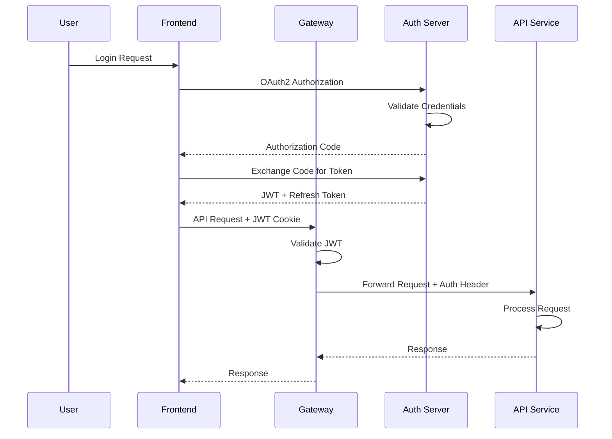

### Authorization Model

| Component | Authentication Method | Authorization Model |
|-----------|----------------------|---------------------|
| **Web Users** | OAuth2/OIDC + JWT cookies | Role-based (Owner, Admin, Technician, Viewer) |
| **API Clients** | API Keys | Scoped permissions per key |
| **OpenFrame Agents** | Service account credentials | Device-specific permissions |
| **External Tools** | Tool-specific tokens/credentials | Integration-scoped access |

### Security Layers

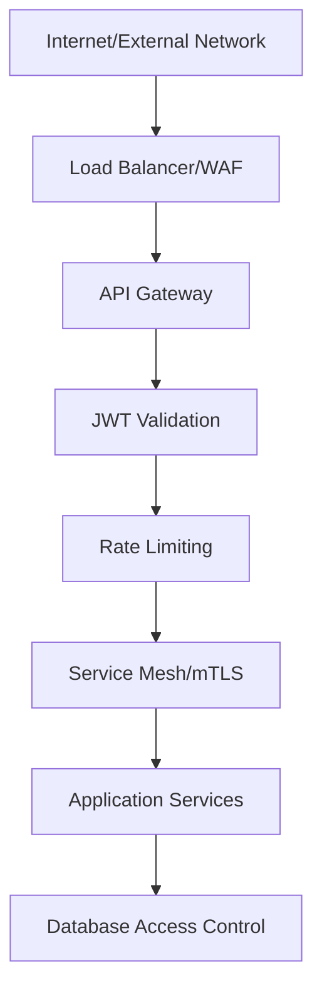

## Key Design Decisions

### Microservices Architecture

**Why Microservices?**
- **Scalability**: Independent service scaling based on load
- **Technology Flexibility**: Best tool for each service
- **Team Autonomy**: Independent development and deployment
- **Fault Isolation**: Service failures don't cascade
- **Integration Flexibility**: Easy to add new external tools

**Trade-offs:**
- Increased operational complexity
- Network latency between services
- Data consistency challenges
- Monitoring complexity

### Event-Driven Architecture

**Benefits:**
- **Loose Coupling**: Services don't need direct dependencies
- **Scalability**: Asynchronous processing handles load spikes
- **Resilience**: Events can be replayed if services fail
- **Audit Trail**: Complete event history for compliance

**Implementation:**
- **Kafka Topics**: Domain-specific event streams
- **Event Sourcing**: Rebuild state from events
- **CQRS**: Separate read and write models
- **Saga Pattern**: Distributed transaction management

### Multi-Tenant Design

**Tenant Isolation:**
- **Data**: Separate MongoDB collections per tenant
- **Security**: Tenant-aware JWT claims
- **Configuration**: Tenant-specific settings
- **Networking**: Optional network isolation

**Shared Resources:**
- **Services**: Single deployment serves all tenants
- **Infrastructure**: Shared Kafka, Redis, monitoring
- **Code**: Multi-tenant aware business logic

## Data Models and Relationships

### Core Domain Entities

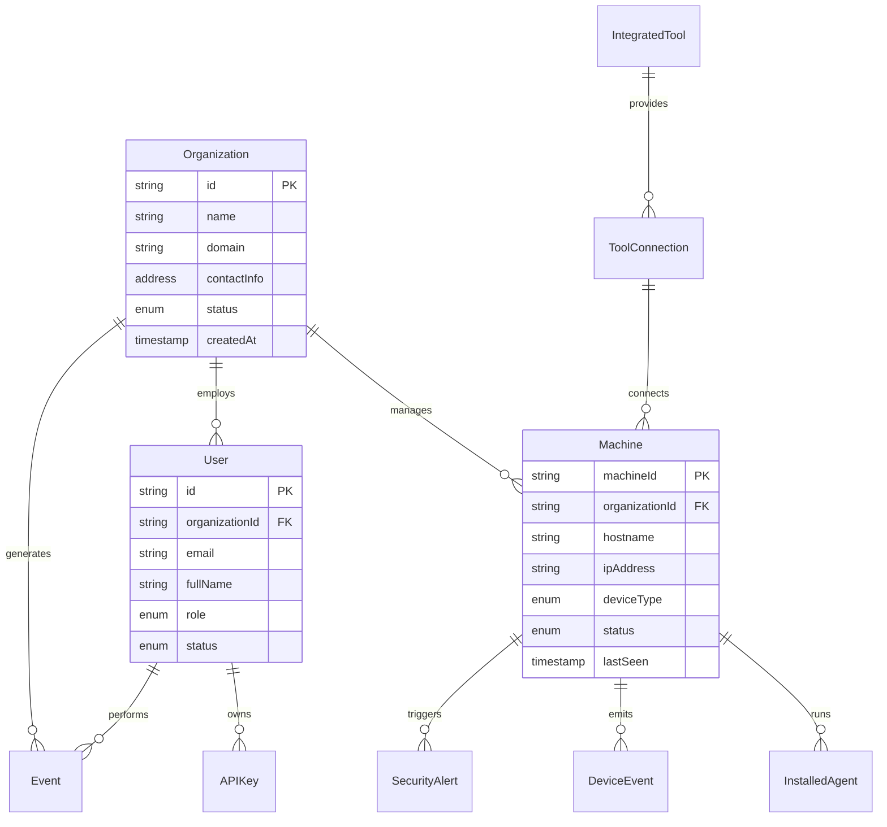

### Event Schema Design

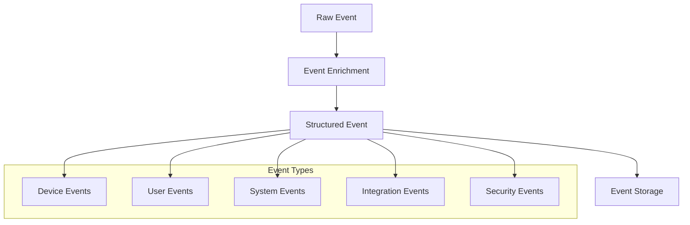

### Integration Patterns

OpenFrame uses several integration patterns to connect with external tools:

#### Pull-Based Integration
```java
@Scheduled(fixedRate = 300000) // 5 minutes
public void syncTacticalRmmData() {
    List<Agent> agents = tacticalRmmClient.getAgents();
    agents.forEach(agent -> {
        deviceService.updateDeviceFromAgent(agent);
        kafkaProducer.send(new DeviceUpdateEvent(agent));
    });
}
```

#### Push-Based Integration (Webhooks)
```java
@RestController
@RequestMapping("/webhooks")
public class WebhookController {
    
    @PostMapping("/fleetmdm")
    public ResponseEntity<Void> handleFleetMdmWebhook(@RequestBody FleetEvent event) {
        eventProcessor.process(event);
        return ResponseEntity.ok().build();
    }
}
```

#### Event-Driven Integration
```java
@KafkaListener(topics = "device-events")
public void handleDeviceEvent(DeviceEvent event) {
    // Enrich with external data
    ExternalDeviceData data = externalApiClient.getDeviceData(event.getDeviceId());
    
    // Store enriched event
    UnifiedLogEvent enrichedEvent = enrichmentService.enrich(event, data);
    cassandraRepository.save(enrichedEvent);
    
    // Trigger real-time notifications
    webSocketService.notifyDeviceUpdate(event.getOrganizationId(), enrichedEvent);
}
```

## Technology Stack Rationale

### Backend Technology Choices

| Technology | Rationale | Alternatives Considered |
|------------|-----------|------------------------|
| **Java 21** | Mature ecosystem, enterprise support, performance improvements | Go, .NET, Python |
| **Spring Boot 3** | Comprehensive framework, excellent tooling, community | Quarkus, Micronaut |
| **GraphQL** | Flexible queries, strong typing, client efficiency | REST only, gRPC |
| **MongoDB** | Document model fits domain, horizontal scaling | PostgreSQL, CockroachDB |
| **Apache Kafka** | Industry standard for event streaming, proven at scale | RabbitMQ, Apache Pulsar |
| **Cassandra** | Excellent for time-series data, linear scalability | InfluxDB, TimescaleDB |

### Frontend Technology Choices

| Technology | Rationale | Alternatives Considered |
|------------|-----------|------------------------|
| **Vue 3** | Progressive adoption, excellent DX, Composition API | React, Angular, Svelte |
| **TypeScript** | Type safety, better tooling, enterprise adoption | JavaScript only |
| **Vite** | Fast builds, excellent HMR, modern tooling | Webpack, Rollup |
| **PrimeVue** | Enterprise UI components, consistent design | Vuetify, Quasar |
| **Pinia** | Modern state management, Vue 3 optimized | Vuex, Zustand |

## Scalability Patterns

### Horizontal Scaling

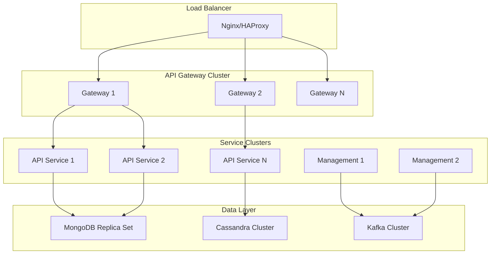

### Performance Characteristics

| Component | Expected Throughput | Scaling Strategy |
|-----------|-------------------|------------------|
| **API Gateway** | 10,000+ req/sec | Horizontal scaling behind load balancer |
| **GraphQL API** | 5,000+ queries/sec | Connection pooling, database sharding |
| **Kafka** | 1M+ events/sec | Partition scaling, consumer groups |
| **MongoDB** | 100,000+ ops/sec | Sharding, read replicas |
| **Cassandra** | 1M+ writes/sec | Node addition, replication factor tuning |

## Security Model

### Authentication Architecture

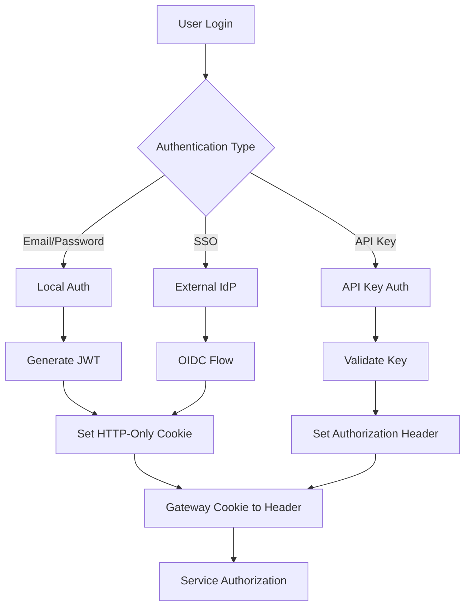

### Multi-Tenant Security

| Security Layer | Implementation | Purpose |
|----------------|----------------|---------|
| **Network** | VPC, Security Groups, WAF | Infrastructure protection |
| **Transport** | TLS 1.3, mTLS for service mesh | Encryption in transit |
| **Application** | JWT tokens, RBAC, tenant isolation | Access control |
| **Data** | Encryption at rest, field-level encryption | Data protection |
| **Audit** | Comprehensive logging, immutable audit trail | Compliance and forensics |

### Authorization Model

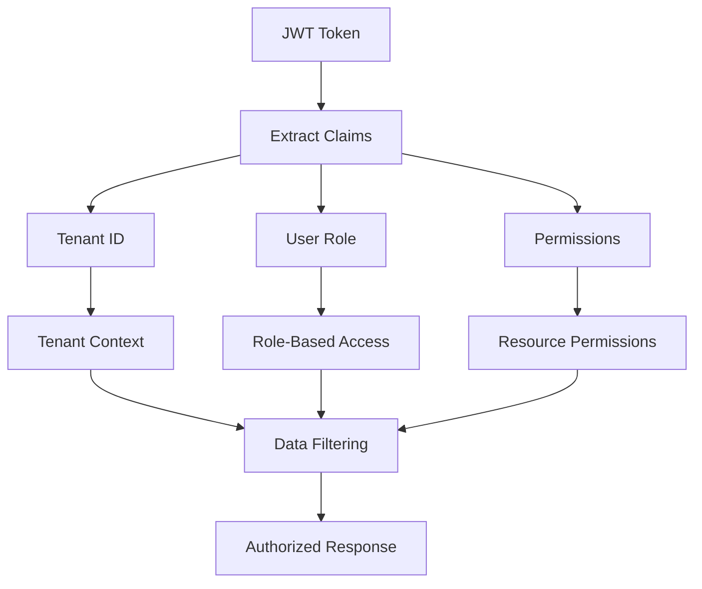

## Integration Architecture

### External Tool Integration Patterns

#### Polling Pattern (TacticalRMM)
```java
@Component
public class TacticalRmmIntegration {
    
    @Scheduled(fixedRate = 300000) // 5 minutes
    public void syncAgents() {
        List<TacticalAgent> agents = tacticalRmmClient.getAgents();
        
        agents.parallelStream()
            .map(this::mapToDevice)
            .forEach(device -> {
                deviceService.upsert(device);
                kafkaProducer.send(new DeviceUpdateEvent(device));
            });
    }
}
```

#### Webhook Pattern (FleetMDM)
```java
@RestController
public class FleetMdmWebhookController {
    
    @PostMapping("/webhooks/fleetmdm/device-update")
    public ResponseEntity<Void> handleDeviceUpdate(@RequestBody FleetDeviceEvent event) {
        // Validate webhook signature
        if (!webhookValidator.isValid(event, request)) {
            return ResponseEntity.status(401).build();
        }
        
        // Process event asynchronously
        eventProcessor.processAsync(event);
        return ResponseEntity.ok().build();
    }
}
```

#### Real-time Integration (MeshCentral)
```java
@Component
public class MeshCentralEventListener {
    
    @EventListener
    public void handleMeshEvent(MeshCentralEvent event) {
        switch (event.getType()) {
            case DEVICE_CONNECTED:
                deviceStatusService.markOnline(event.getDeviceId());
                break;
            case FILE_CHANGE:
                securityService.scanFileChange(event.getFileInfo());
                break;
            case REMOTE_SESSION:
                auditService.logRemoteAccess(event.getSessionInfo());
                break;
        }
    }
}
```

## Deployment Architecture

### Container Strategy

```yaml
# Example service deployment
apiVersion: apps/v1
kind: Deployment
metadata:
  name: openframe-api
spec:
  replicas: 3
  selector:
    matchLabels:
      app: openframe-api
  template:
    metadata:
      labels:
        app: openframe-api
    spec:
      containers:
      - name: api
        image: openframe/api:latest
        ports:
        - containerPort: 8081
        env:
        - name: SPRING_PROFILES_ACTIVE
          value: "production"
        - name: MONGODB_URI
          valueFrom:
            secretKeyRef:
              name: db-credentials
              key: mongodb-uri
        resources:
          requests:
            memory: "512Mi"
            cpu: "250m"
          limits:
            memory: "2Gi" 
            cpu: "1000m"
        livenessProbe:
          httpGet:
            path: /actuator/health
            port: 8081
          initialDelaySeconds: 60
          periodSeconds: 30
        readinessProbe:
          httpGet:
            path: /actuator/health/readiness
            port: 8081
          initialDelaySeconds: 30
          periodSeconds: 10
```

### Service Mesh Integration

```yaml
# Istio VirtualService example
apiVersion: networking.istio.io/v1beta1
kind: VirtualService
metadata:
  name: openframe-api
spec:
  hosts:
  - api.openframe.local
  gateways:
  - openframe-gateway
  http:
  - match:
    - uri:
        prefix: /api/
    route:
    - destination:
        host: openframe-api-service
        port:
          number: 8081
    timeout: 30s
    retries:
      attempts: 3
      perTryTimeout: 10s
```

## Monitoring and Observability

### Metrics Collection

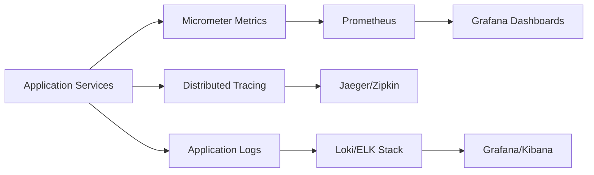

### Key Metrics

| Metric Category | Examples | Purpose |
|-----------------|----------|---------|
| **Business Metrics** | Active devices, organizations, user logins | Business intelligence |
| **Application Metrics** | Request rates, response times, error rates | Performance monitoring |
| **Infrastructure Metrics** | CPU, memory, disk, network usage | Resource monitoring |
| **Security Metrics** | Failed logins, API key usage, access patterns | Security monitoring |

## Development Best Practices

### Service Design Principles

1. **Single Responsibility**: Each service has one clear purpose
2. **API-First**: Define interfaces before implementation
3. **Stateless**: Services don't maintain session state
4. **Idempotent**: Operations can be safely retried
5. **Graceful Degradation**: Partial functionality during failures

### Data Management

1. **Database per Service**: Each service owns its data
2. **Event Sourcing**: Maintain event history for audit
3. **CQRS**: Separate read and write models for performance
4. **Eventual Consistency**: Accept temporary inconsistency for performance
5. **Backup Strategy**: Automated backups and disaster recovery

### Code Organization

1. **Domain-Driven Design**: Organize code around business domains
2. **Clean Architecture**: Dependency inversion, testable code
3. **Repository Pattern**: Abstract data access logic
4. **Service Layer**: Encapsulate business logic
5. **DTO Pattern**: Separate API contracts from domain models

## Next Steps

Now that you understand the architecture:

1. **[Local Development](../setup/local-development.md)** - Run the system locally
2. **[Testing Overview](../testing/overview.md)** - Learn testing strategies
3. **[Contributing Guidelines](../contributing/guidelines.md)** - Start contributing

For architecture questions or discussions, join the #architecture channel in our [OpenMSP Slack community](https://join.slack.com/t/openmsp/shared_invite/zt-36bl7mx0h-3~U2nFH6nqHqoTPXMaHEHA).