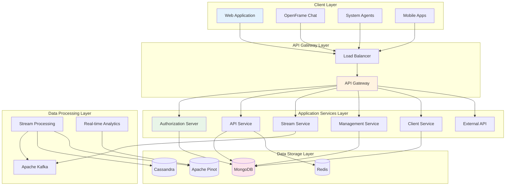
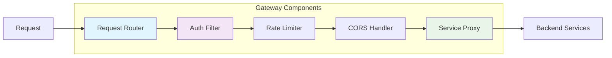
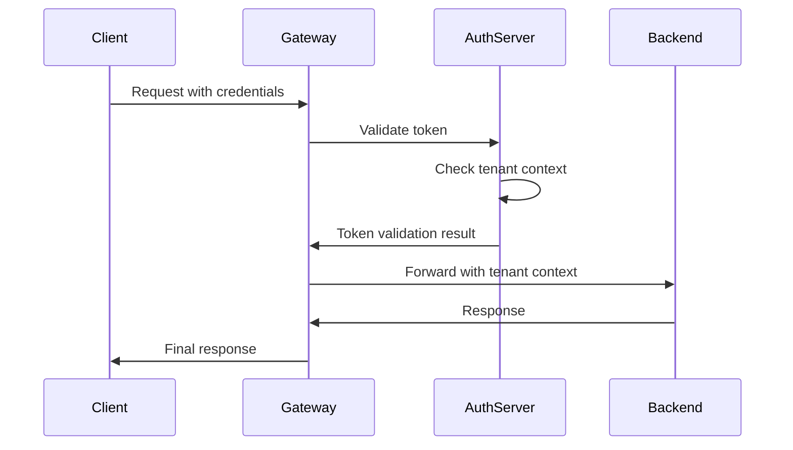
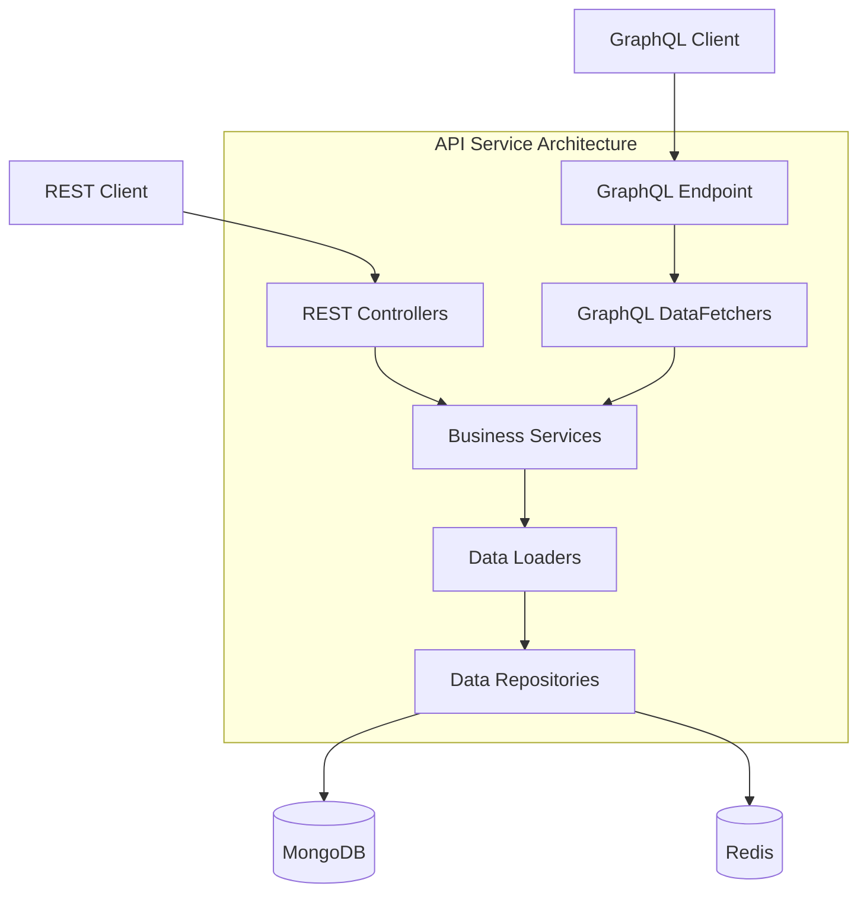
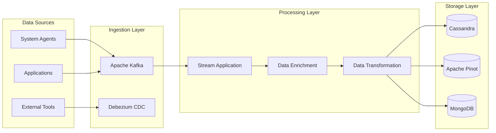
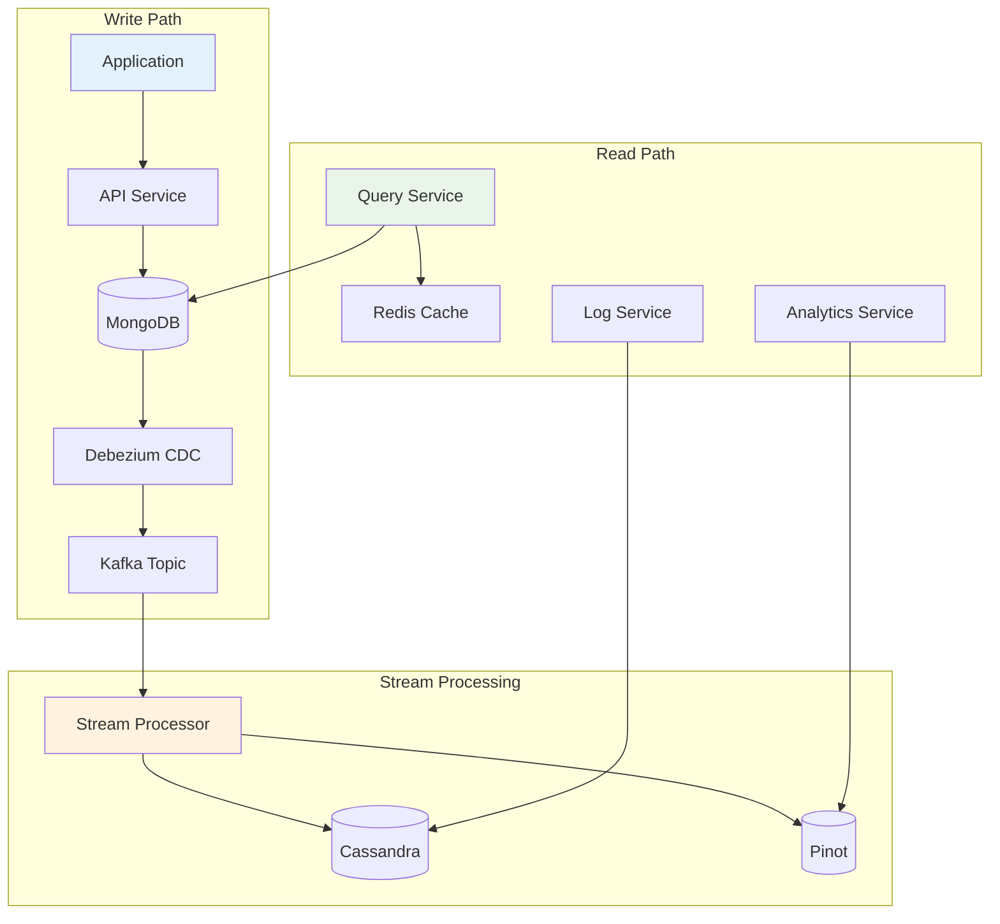
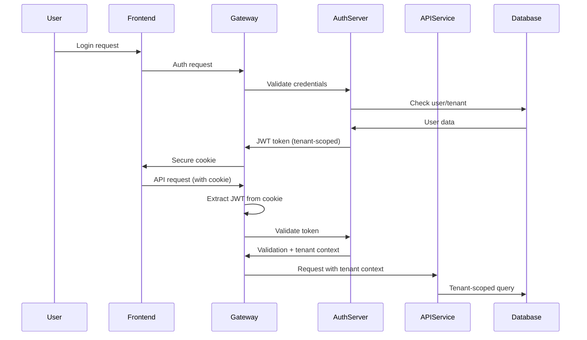
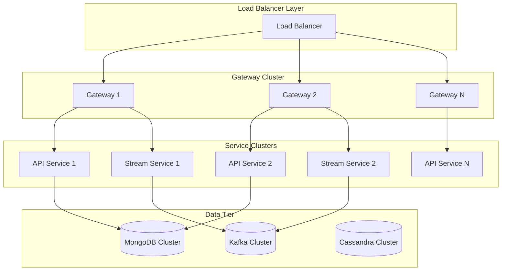
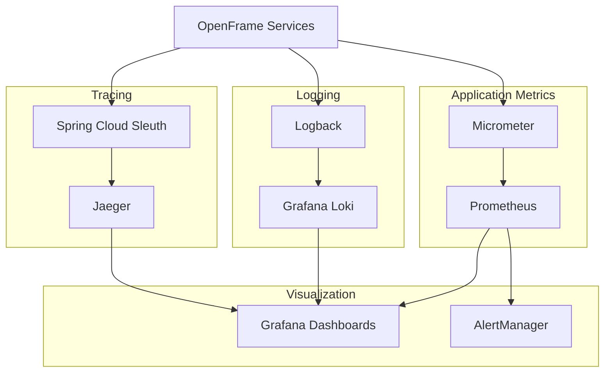
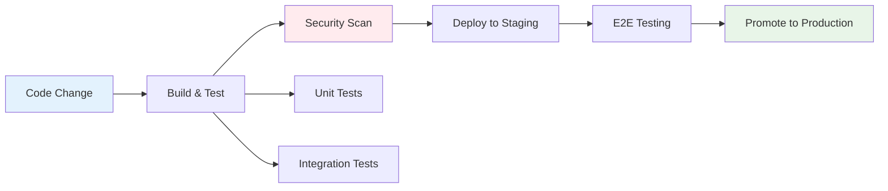

# Architecture Overview

OpenFrame is built as a modern, cloud-native platform following microservices architecture principles. This guide provides a comprehensive overview of the system design, component relationships, and key architectural decisions.

## High-Level Architecture

OpenFrame follows a layered architecture with clear separation of concerns:



## Core Design Principles

### 1. Microservices Architecture

**Service Decomposition Strategy:**
- **Domain-Driven Design**: Services organized around business capabilities
- **Single Responsibility**: Each service has a well-defined purpose
- **Data Independence**: Services own their data and schemas
- **API-First**: All inter-service communication via APIs

### 2. Event-Driven Architecture

**Event Streaming Patterns:**
- **Event Sourcing**: All state changes captured as events
- **CQRS**: Command and Query Responsibility Segregation
- **Saga Pattern**: Distributed transaction management
- **Event Choreography**: Decoupled service interactions

### 3. Multi-Tenancy

**Tenant Isolation Strategy:**
- **Database-per-Tenant**: Complete data isolation
- **Row-Level Security**: Shared schema with tenant filtering
- **Service-Level Isolation**: Tenant context propagation
- **Resource Quotas**: Per-tenant resource limits

### 4. Security by Design

**Security Layers:**
- **Authentication**: OAuth2/OIDC with JWT tokens
- **Authorization**: RBAC with fine-grained permissions
- **Network Security**: mTLS between services
- **Data Encryption**: At-rest and in-transit encryption

## Service Architecture Details

### API Gateway Service

**Responsibilities:**
- External traffic routing and load balancing
- Authentication and authorization enforcement
- Rate limiting and request throttling
- CORS handling and origin validation
- WebSocket connection management



**Technology Stack:**
- Spring Boot 3.3 with Spring Cloud Gateway
- JWT authentication with cookie support
- Redis for rate limiting and session storage
- WebSocket proxy for real-time communication

### Authorization Server

**OAuth2/OIDC Implementation:**


**Key Features:**
- Multi-tenant token issuance
- SSO integration (Google, Microsoft, SAML)
- Dynamic client registration
- Tenant-scoped signing keys

### API Service Core

**GraphQL and REST APIs:**


**Data Access Patterns:**
- **Repository Pattern**: Data access abstraction
- **DataLoader Pattern**: N+1 query prevention
- **Cursor Pagination**: Efficient large dataset handling
- **GraphQL Federation**: Schema composition across services

### Stream Processing Service

**Real-time Data Pipeline:**


**Processing Capabilities:**
- Real-time event enrichment
- Data format normalization
- Anomaly detection
- Metrics aggregation

## Data Architecture

### Database Selection Rationale

| Database | Use Case | Rationale |
|----------|----------|-----------|
| **MongoDB** | Transactional Data | Document model fits complex business entities |
| **Redis** | Caching & Sessions | High-performance in-memory operations |
| **Cassandra** | Time-Series Data | Excellent write performance for logs/metrics |
| **Apache Pinot** | Analytics | Real-time OLAP queries on large datasets |
| **Kafka** | Event Streaming | Durable, scalable event processing |

### Data Flow Patterns



## Security Architecture

### Authentication and Authorization Flow



### Security Controls

| Layer | Security Measures | Implementation |
|-------|------------------|----------------|
| **Network** | mTLS, VPN, Firewall | Istio service mesh, network policies |
| **Application** | JWT validation, RBAC | Spring Security, custom filters |
| **Data** | Encryption, access control | MongoDB encryption, field-level security |
| **API** | Rate limiting, input validation | Spring Cloud Gateway, Bean Validation |

## Scalability and Performance

### Horizontal Scaling Strategy



### Performance Optimizations

**Application Level:**
- Connection pooling for databases
- Async processing with CompletableFuture
- Caching strategies (Redis, application-level)
- GraphQL DataLoader for N+1 prevention

**Data Level:**
- Database indexing strategies
- Partition key optimization
- Read replicas for query distribution
- Data archiving and retention policies

## Deployment Architecture

### Kubernetes Deployment

```yaml
# Example deployment structure
apiVersion: v1
kind: Namespace
metadata:
  name: openframe-prod
---
apiVersion: apps/v1
kind: Deployment
metadata:
  name: openframe-gateway
spec:
  replicas: 3
  selector:
    matchLabels:
      app: openframe-gateway
  template:
    spec:
      containers:
      - name: gateway
        image: openframe/gateway:latest
        ports:
        - containerPort: 8080
        env:
        - name: SPRING_PROFILES_ACTIVE
          value: "production"
        resources:
          requests:
            memory: "512Mi"
            cpu: "500m"
          limits:
            memory: "1Gi"
            cpu: "1000m"
```

### Service Mesh Integration

**Istio Configuration:**
- Automatic mTLS between services
- Traffic management and load balancing
- Observability with distributed tracing
- Security policies and RBAC

## Monitoring and Observability

### Observability Stack



### Key Metrics

**Application Metrics:**
- Request throughput and latency
- Error rates and types
- Resource utilization (CPU, memory)
- Business metrics (user activity, tenant usage)

**Infrastructure Metrics:**
- Database performance and connections
- Kafka topic lag and throughput
- Network latency and bandwidth
- Container resource usage

## Development and Testing Architecture

### Testing Strategy

```mermaid
pyramid
    "Unit Tests (80%)"
    "Integration Tests (15%)"
    "E2E Tests (5%)"
```

**Testing Layers:**
- **Unit Tests**: Individual component testing
- **Integration Tests**: Service interaction testing
- **Contract Tests**: API contract verification
- **End-to-End Tests**: Complete user journey testing

### CI/CD Pipeline



## Design Decisions and Trade-offs

### Key Architectural Decisions

| Decision | Rationale | Trade-offs |
|----------|-----------|------------|
| **Microservices** | Scalability, team autonomy | Complexity, network overhead |
| **Event-Driven** | Loose coupling, resilience | Eventual consistency, debugging complexity |
| **Multi-Database** | Optimal tool per use case | Operational complexity, data consistency |
| **GraphQL + REST** | Flexible queries, compatibility | Learning curve, caching complexity |

### Technology Choices

| Technology | Alternative | Why Chosen |
|------------|-------------|------------|
| **Spring Boot** | Quarkus, Micronaut | Mature ecosystem, extensive documentation |
| **Vue 3** | React, Angular | Gentle learning curve, excellent TypeScript support |
| **MongoDB** | PostgreSQL | Document model fits complex domain objects |
| **Kafka** | RabbitMQ, Apache Pulsar | Proven scalability, rich ecosystem |

## Future Architecture Evolution

### Planned Enhancements

1. **AI/ML Integration**: MLOps pipeline for Mingo AI capabilities
2. **Edge Computing**: Distributed edge deployments for remote locations
3. **Federation**: Multi-region deployments with data federation
4. **Serverless**: Function-as-a-Service for event processing
5. **Blockchain**: Immutable audit logs and smart contracts

### Migration Strategies

**Database Evolution:**
- Blue-green deployment for schema changes
- Event sourcing for backward compatibility
- Feature flags for gradual rollouts

**Service Evolution:**
- API versioning strategies
- Strangler Fig pattern for legacy replacement
- Circuit breaker pattern for resilience

---

This architecture overview provides the foundation for understanding OpenFrame's design. For specific implementation details, refer to the individual service documentation and API references.