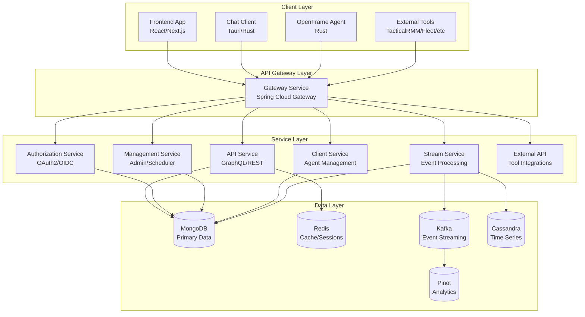
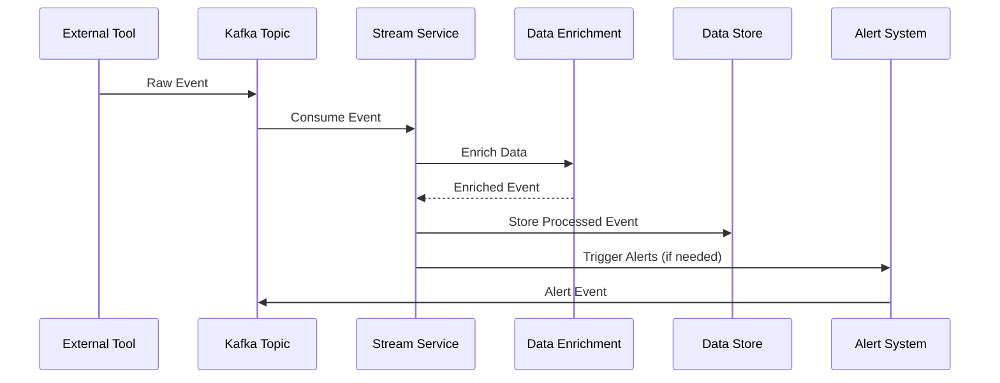
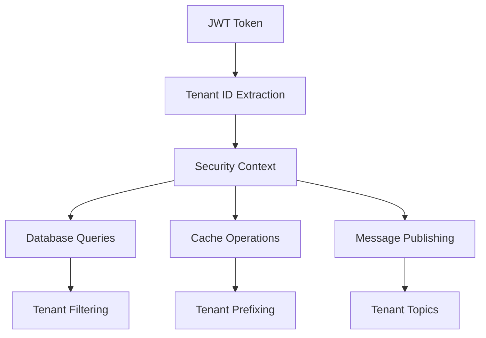
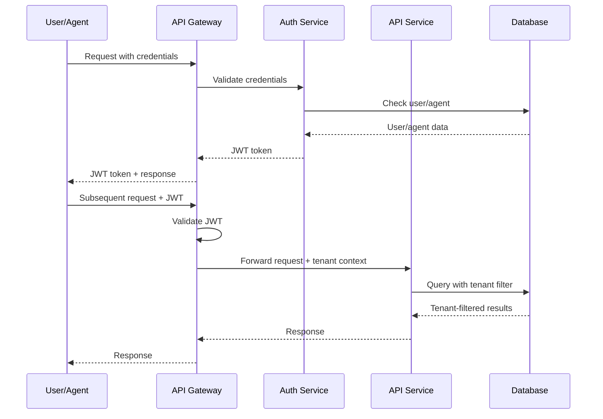

# Architecture Overview

This document provides a comprehensive overview of OpenFrame's architecture, design patterns, and component interactions for developers.

## High-Level Architecture

OpenFrame follows a **microservices architecture** with event-driven communication and multi-tenant security built into every layer.



## Core Components

### 1. API Gateway (openframe-gateway)

**Purpose**: Single entry point for all external traffic with security, routing, and protocol translation.

**Key Responsibilities**:
- JWT authentication and authorization
- Request routing to appropriate services
- CORS handling and security headers
- Rate limiting and throttling
- WebSocket upgrade handling
- Tenant isolation enforcement

**Technology Stack**:
- Spring Cloud Gateway
- Spring Security
- Redis for rate limiting
- JWT token validation

**Configuration**:
```yaml
spring:
  cloud:
    gateway:
      routes:
        - id: api-service
          uri: http://localhost:8081
          predicates:
            - Path=/api/**, /graphql
        - id: auth-service
          uri: http://localhost:9000
          predicates:
            - Path=/oauth2/**, /login/**
```

### 2. API Service (openframe-api)

**Purpose**: Core business logic and GraphQL API for frontend applications.

**Key Responsibilities**:
- GraphQL schema definition and resolvers
- Business logic implementation
- Device management operations
- Organization and user management
- Audit logging and security events

**Technology Stack**:
- Spring Boot 3.3
- Netflix DGS (GraphQL)
- Spring Data MongoDB
- Spring Security

**GraphQL Schema Example**:
```graphql
type Query {
  devices(filter: DeviceFilterInput, pagination: PaginationInput): DeviceConnection
  organizations(filter: OrganizationFilterInput): [Organization!]!
  logs(filter: LogFilterInput): LogConnection
}

type Mutation {
  createOrganization(input: CreateOrganizationInput!): Organization!
  updateDeviceStatus(id: ID!, status: DeviceStatus!): Device!
}

type Subscription {
  deviceEvents(organizationId: ID): DeviceEvent!
  logEvents(filter: LogFilterInput): LogEvent!
}
```

### 3. Authorization Service (openframe-authorization-server)

**Purpose**: OAuth2/OpenID Connect provider for authentication and authorization.

**Key Responsibilities**:
- User registration and authentication
- OAuth2 token issuance and validation
- SSO integration (Google, Microsoft, generic OIDC)
- Multi-tenant user isolation
- Password reset and email verification

**Technology Stack**:
- Spring Authorization Server
- Spring Security OAuth2
- MongoDB for user storage
- Redis for session management

**OAuth2 Flows Supported**:
- Authorization Code with PKCE
- Client Credentials (for service accounts)
- Refresh Token rotation
- JWT Bearer tokens

### 4. Stream Service (openframe-stream)

**Purpose**: Real-time event processing and data enrichment.

**Key Responsibilities**:
- Kafka event consumption and processing
- Data enrichment from external tools
- Event correlation and aggregation
- Time-series data generation
- Alert and notification triggering

**Technology Stack**:
- Spring Boot
- Spring Cloud Stream
- Apache Kafka
- Apache Cassandra (time-series)
- Apache Pinot (analytics)

**Event Processing Flow**:


### 5. Management Service (openframe-management)

**Purpose**: Administrative tasks, system management, and scheduled operations.

**Key Responsibilities**:
- System health monitoring
- Scheduled task execution
- Database maintenance operations
- Integration health checks
- Configuration management
- Backup and recovery operations

**Technology Stack**:
- Spring Boot
- Spring Scheduler
- ShedLock (distributed scheduling)
- Spring Boot Admin
- MongoDB administration

### 6. Client Service (openframe-client)

**Purpose**: Agent lifecycle management and device communication.

**Key Responsibilities**:
- Agent registration and authentication
- Device status monitoring
- Remote command execution
- Agent configuration management
- File upload/download handling

**Technology Stack**:
- Spring Boot
- WebSocket communication
- MongoDB for agent data
- NATS for real-time messaging

## Data Architecture

### Primary Data Store (MongoDB)

**Collections and Usage**:

| Collection | Purpose | Indexes |
|------------|---------|---------|
| `tenants` | Multi-tenant configuration | `domain`, `status` |
| `users` | User accounts and profiles | `email`, `tenantId` |
| `organizations` | Client organizations | `tenantId`, `name` |
| `devices` | Managed devices/machines | `tenantId`, `organizationId`, `status` |
| `agents` | Installed agents | `deviceId`, `status`, `lastSeen` |
| `events` | System and audit events | `tenantId`, `timestamp`, `type` |

**Multi-Tenant Data Isolation**:
```javascript
// All queries include tenant context
db.devices.find({ 
  tenantId: ObjectId("tenant123"), 
  organizationId: ObjectId("org456") 
})

// Compound indexes for performance
db.devices.createIndex({ 
  "tenantId": 1, 
  "organizationId": 1, 
  "status": 1 
})
```

### Caching Layer (Redis)

**Cache Patterns**:
- **Session Storage**: User sessions and JWT token blacklist
- **Application Cache**: Frequently accessed data (organizations, user profiles)
- **Rate Limiting**: API rate limit counters
- **Pub/Sub**: Real-time notifications

**Cache Key Patterns**:
```text
tenant:{tenantId}:user:{userId}:session
tenant:{tenantId}:org:{orgId}:devices
api:ratelimit:{clientId}:{endpoint}:{window}
notifications:tenant:{tenantId}
```

### Event Streaming (Apache Kafka)

**Topic Architecture**:

| Topic | Purpose | Partitions | Retention |
|-------|---------|------------|-----------|
| `device-events` | Device status, metrics | 12 | 7 days |
| `audit-events` | User actions, security | 6 | 90 days |
| `tool-events` | External tool integration | 24 | 30 days |
| `alert-events` | System alerts, notifications | 3 | 30 days |

**Event Schema Example**:
```json
{
  "eventId": "uuid-v4",
  "tenantId": "tenant-id",
  "organizationId": "org-id",
  "deviceId": "device-id",
  "eventType": "device.status.changed",
  "timestamp": "2024-01-15T10:30:00Z",
  "source": "agent",
  "data": {
    "previousStatus": "online",
    "currentStatus": "offline",
    "reason": "connection_timeout"
  }
}
```

### Time-Series Data (Cassandra)

**Keyspace Design**:
```cql
CREATE KEYSPACE openframe_metrics
WITH REPLICATION = {
  'class': 'SimpleStrategy',
  'replication_factor': 3
};

CREATE TABLE device_metrics (
  tenant_id UUID,
  device_id UUID,
  metric_type TEXT,
  time_bucket TIMESTAMP,
  timestamp TIMESTAMP,
  value DOUBLE,
  PRIMARY KEY ((tenant_id, device_id, metric_type, time_bucket), timestamp)
) WITH CLUSTERING ORDER BY (timestamp DESC);
```

## Security Architecture

### Multi-Tenant Security Model

**Tenant Isolation Layers**:



**Security Context Implementation**:
```java
@Component
public class TenantContext {
    private static final ThreadLocal<String> CURRENT_TENANT = new ThreadLocal<>();
    
    public static void setTenantId(String tenantId) {
        CURRENT_TENANT.set(tenantId);
    }
    
    public static String getCurrentTenantId() {
        return CURRENT_TENANT.get();
    }
    
    public static void clear() {
        CURRENT_TENANT.remove();
    }
}

// Automatic tenant filtering in repositories
@Repository
public class DeviceRepository {
    public List<Device> findAll() {
        String tenantId = TenantContext.getCurrentTenantId();
        return deviceCollection.find(eq("tenantId", tenantId)).into(new ArrayList<>());
    }
}
```

### Authentication Flow



## Communication Patterns

### Synchronous Communication

**Service-to-Service REST calls** for immediate data requirements:
```java
@FeignClient(name = "organization-service", url = "${services.organization.url}")
public interface OrganizationClient {
    @GetMapping("/api/v1/organizations/{id}")
    Organization getOrganization(@PathVariable String id);
}
```

### Asynchronous Communication

**Kafka-based event publishing** for loosely coupled operations:
```java
@EventListener
@Async
public void handleDeviceStatusChange(DeviceStatusChangedEvent event) {
    DeviceEventMessage message = DeviceEventMessage.builder()
        .tenantId(event.getTenantId())
        .deviceId(event.getDeviceId())
        .eventType("device.status.changed")
        .timestamp(Instant.now())
        .data(event.getData())
        .build();
    
    kafkaTemplate.send("device-events", event.getTenantId(), message);
}
```

### WebSocket Communication

**Real-time bidirectional communication** for live updates:
```java
@MessageMapping("/device/{deviceId}/commands")
@SendToUser("/queue/device/responses")
public DeviceCommandResponse executeCommand(
    @DestinationVariable String deviceId,
    DeviceCommand command,
    Principal principal
) {
    // Execute command and return response
    return deviceCommandService.execute(deviceId, command);
}
```

## Design Patterns

### 1. Event Sourcing Pattern

Events are the source of truth for state changes:
```java
@EventSourcingHandler
public void on(DeviceRegisteredEvent event) {
    this.deviceId = event.getDeviceId();
    this.tenantId = event.getTenantId();
    this.status = DeviceStatus.ONLINE;
    this.registeredAt = event.getTimestamp();
}

@EventSourcingHandler  
public void on(DeviceStatusChangedEvent event) {
    this.status = event.getNewStatus();
    this.lastStatusChange = event.getTimestamp();
}
```

### 2. CQRS Pattern

Separate read and write models for optimal performance:
```java
// Command side - write operations
@CommandHandler
public class DeviceCommandHandler {
    public void handle(UpdateDeviceStatusCommand command) {
        Device device = deviceRepository.findById(command.getDeviceId());
        device.updateStatus(command.getStatus());
        deviceRepository.save(device);
    }
}

// Query side - read operations  
@QueryHandler
public class DeviceQueryHandler {
    public DeviceListResponse handle(FindDevicesQuery query) {
        return deviceReadRepository.findDevicesForTenant(
            query.getTenantId(), 
            query.getFilter()
        );
    }
}
```

### 3. Saga Pattern

Distributed transaction management:
```java
@Saga
public class DeviceOnboardingSaga {
    
    @SagaOrchestrationStart
    public void handle(DeviceRegistrationRequest request) {
        commandGateway.send(new CreateDeviceCommand(request));
    }
    
    @SagaOrchestrationHandler
    public void handle(DeviceCreatedEvent event) {
        commandGateway.send(new InstallAgentCommand(event.getDeviceId()));
    }
    
    @SagaOrchestrationHandler
    public void handle(AgentInstallFailedEvent event) {
        commandGateway.send(new RollbackDeviceCreationCommand(event.getDeviceId()));
    }
}
```

## Performance Considerations

### Database Optimization

**Indexing Strategy**:
```javascript
// Compound indexes for tenant + query patterns
db.devices.createIndex({ "tenantId": 1, "organizationId": 1, "status": 1 })
db.events.createIndex({ "tenantId": 1, "timestamp": -1, "type": 1 })
db.users.createIndex({ "tenantId": 1, "email": 1 }, { unique: true })

// Partial indexes for active records
db.devices.createIndex(
  { "tenantId": 1, "lastSeen": -1 }, 
  { partialFilterExpression: { "status": { $in: ["online", "offline"] } } }
)
```

### Caching Strategy

**Cache Hierarchy**:
```java
// L1: Application cache (in-memory)
@Cacheable(value = "organizations", key = "#tenantId + ':' + #orgId")
public Organization getOrganization(String tenantId, String orgId) {
    return organizationRepository.findByTenantAndId(tenantId, orgId);
}

// L2: Redis cache (distributed)
@Cacheable(value = "device-status", key = "#tenantId + ':devices'")
public List<DeviceStatus> getDeviceStatuses(String tenantId) {
    return deviceRepository.findStatusByTenant(tenantId);
}
```

### Kafka Optimization

**Producer Configuration**:
```yaml
spring:
  kafka:
    producer:
      batch-size: 16384
      linger-ms: 5
      compression-type: snappy
      acks: 1
      retries: 3
```

**Consumer Configuration**:
```yaml
spring:
  kafka:
    consumer:
      group-id: openframe-stream-processor
      auto-offset-reset: latest
      max-poll-records: 500
      session-timeout-ms: 30000
```

## Monitoring and Observability

### Metrics and Health Checks

**Health Check Endpoints**:
```java
@Component
public class DatabaseHealthIndicator implements HealthIndicator {
    @Override
    public Health health() {
        try {
            mongoTemplate.getCollection("health_check");
            return Health.up().withDetail("database", "MongoDB connection OK").build();
        } catch (Exception ex) {
            return Health.down().withException(ex).build();
        }
    }
}
```

### Distributed Tracing

**Correlation ID propagation**:
```java
@Component
public class CorrelationInterceptor implements HandlerInterceptor {
    @Override
    public boolean preHandle(HttpServletRequest request, HttpServletResponse response, Object handler) {
        String correlationId = request.getHeader("X-Correlation-ID");
        if (correlationId == null) {
            correlationId = UUID.randomUUID().toString();
        }
        MDC.put("correlationId", correlationId);
        response.setHeader("X-Correlation-ID", correlationId);
        return true;
    }
}
```

## Deployment Architecture

### Container Orchestration

```yaml
# kubernetes deployment example
apiVersion: apps/v1
kind: Deployment
metadata:
  name: openframe-api
spec:
  replicas: 3
  selector:
    matchLabels:
      app: openframe-api
  template:
    metadata:
      labels:
        app: openframe-api
    spec:
      containers:
      - name: openframe-api
        image: openframe/api:latest
        ports:
        - containerPort: 8080
        env:
        - name: SPRING_PROFILES_ACTIVE
          value: "production"
        - name: MONGODB_URI
          valueFrom:
            secretKeyRef:
              name: openframe-secrets
              key: mongodb-uri
```

## Next Steps for Developers

After understanding the architecture:

1. **[Testing Overview](../testing/overview.md)** - Learn testing strategies
2. **[Contributing Guidelines](../contributing/guidelines.md)** - Contribute to OpenFrame
3. **Service-specific docs** - Deep dive into individual service implementations

## Architecture Questions?

For architecture discussions and questions:

- 💬 **#architecture** channel in [OpenMSP Slack](https://join.slack.com/t/openmsp/shared_invite/zt-36bl7mx0h-3~U2nFH6nqHqoTPXMaHEHA)
- 📖 **Reference Documentation** - Service-specific technical documentation
- 🎯 **Design Discussions** - Architecture decision records and design patterns