# Architecture Overview

OpenFrame is built on a modern microservices architecture designed for scalability, maintainability, and multi-tenant operation. This guide provides a comprehensive understanding of the system architecture, design patterns, and key components.

## High-Level Architecture

### System Overview

OpenFrame follows a **layered microservices architecture** with clear separation of concerns across multiple abstraction layers:

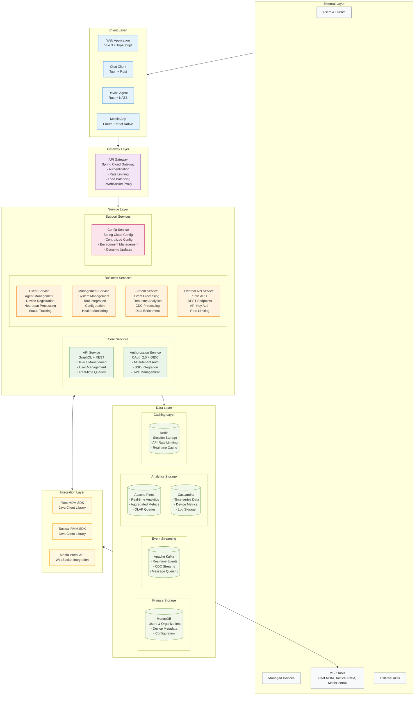

### Key Architectural Principles

| Principle | Implementation | Benefits |
|-----------|----------------|----------|
| **Microservices** | Independent services with clear boundaries | Scalability, maintainability, team autonomy |
| **Multi-Tenancy** | Tenant isolation at all layers | Data security, resource isolation, cost efficiency |
| **Event-Driven** | Kafka-based event streaming | Real-time processing, loose coupling, scalability |
| **API-First** | GraphQL and REST APIs | Flexibility, client diversity, integration ease |
| **Security-First** | OAuth 2.0, JWT, role-based access | Enterprise security, compliance, audit trails |
| **Observability** | Comprehensive monitoring and logging | Operations visibility, debugging, performance tuning |

## Core Services Architecture

### API Gateway Service

**Purpose**: Single entry point for all client requests with intelligent routing and security.

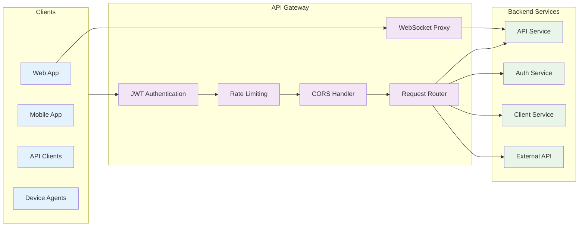

**Key Features**:
- **Multi-tenant JWT Authentication**: Validates tenant-specific JWTs with issuer caching
- **Rate Limiting**: Per-tenant and per-API-key rate limiting with Redis backend
- **WebSocket Proxying**: Real-time communication for chat and monitoring
- **Request Routing**: Intelligent routing based on path, headers, and tenant context
- **CORS Management**: Configurable cross-origin resource sharing policies

**Technology Stack**: Spring Cloud Gateway, Spring WebFlux, Redis

### API Service (GraphQL + REST)

**Purpose**: Primary business logic service providing GraphQL and REST APIs for device and user management.

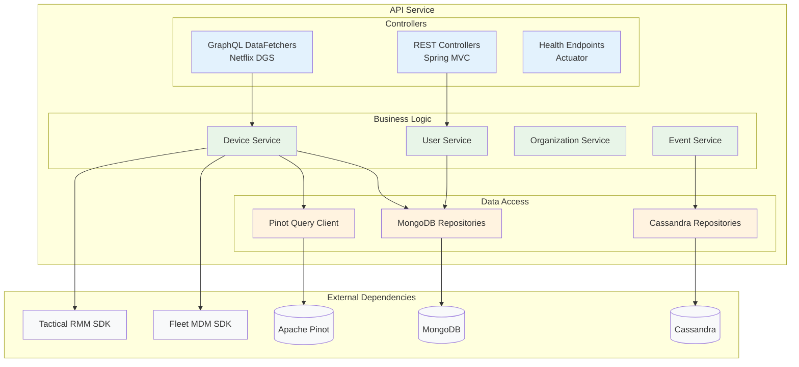

**Key Features**:
- **GraphQL API**: Type-safe queries with efficient data fetching and N+1 prevention
- **Multi-tenant Data Access**: Automatic tenant filtering at repository level
- **Real-time Subscriptions**: WebSocket-based GraphQL subscriptions
- **Advanced Filtering**: Dynamic query building with cursor-based pagination
- **Tool Integration**: Direct integration with Fleet MDM and Tactical RMM SDKs

**Technology Stack**: Spring Boot 3.x, Netflix DGS, Spring Data MongoDB, Apache Pinot

### Authorization Service (OAuth 2.0)

**Purpose**: Multi-tenant OAuth 2.0/OIDC authorization server with enterprise SSO integration.

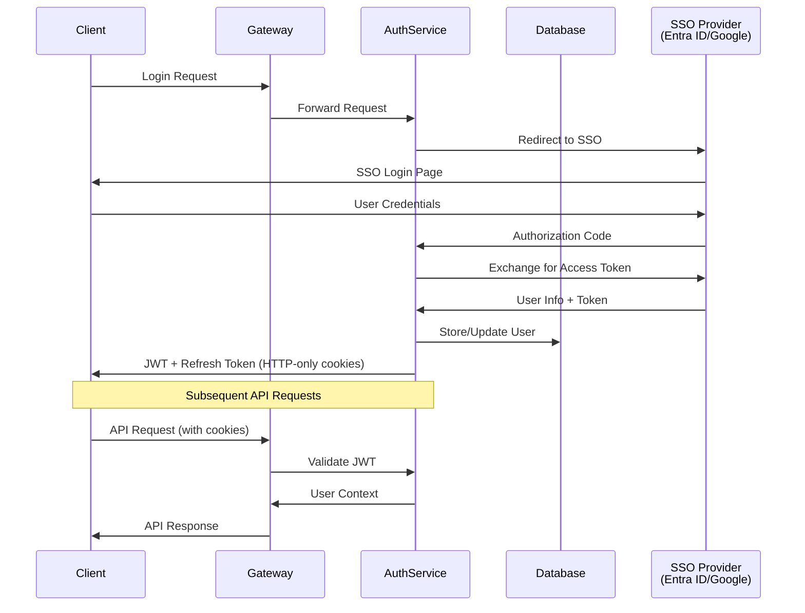

**Key Features**:
- **OAuth 2.0 Authorization Code Flow**: Standards-compliant with PKCE support
- **Multi-tenant JWT Signing**: Tenant-specific RSA key pairs for token signing
- **Enterprise SSO**: Microsoft Entra ID and Google Workspace integration
- **User Lifecycle Management**: Registration, invitation, password reset workflows
- **Dynamic Client Registration**: Automatic OAuth client provisioning per tenant

**Technology Stack**: Spring Authorization Server, Spring Security OAuth2, MongoDB

## Data Architecture

### Data Layer Strategy

OpenFrame implements a **polyglot persistence** strategy, choosing the right database for each use case:

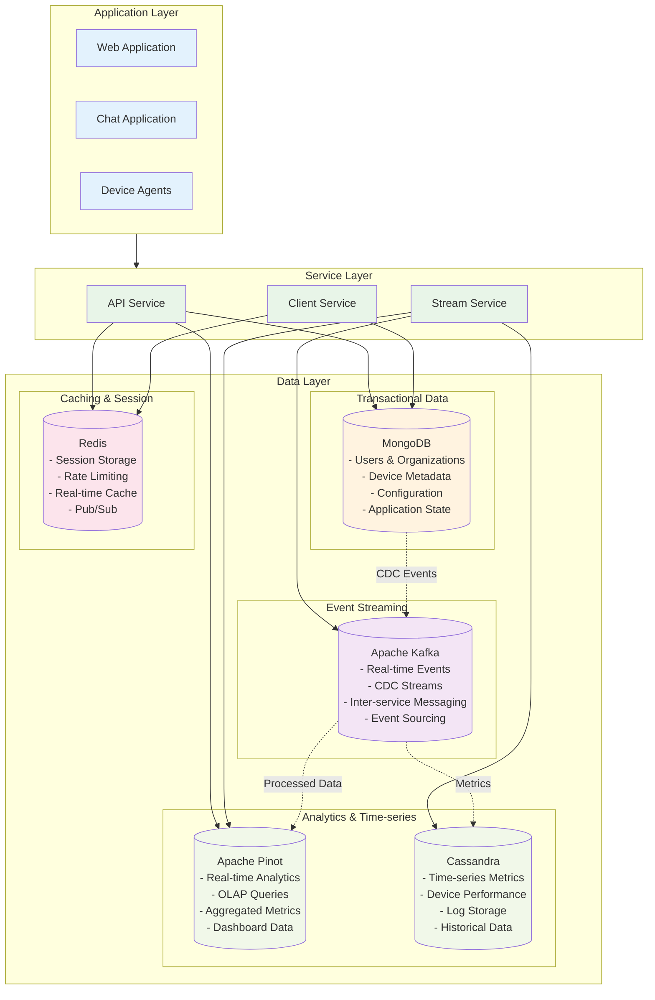

### Data Flow Architecture

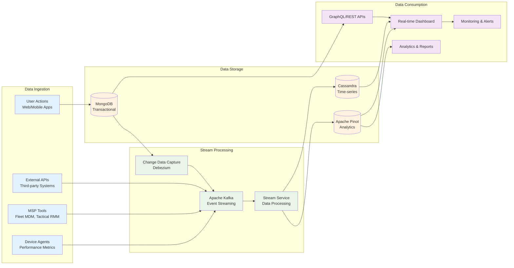

## Multi-Tenant Architecture

### Tenant Isolation Strategy

OpenFrame implements **complete tenant isolation** across all layers:

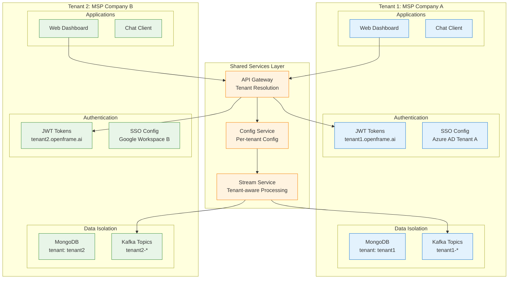

### Tenant Context Flow

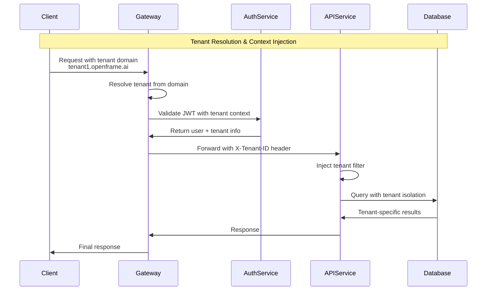

## Security Architecture

### Authentication & Authorization Flow

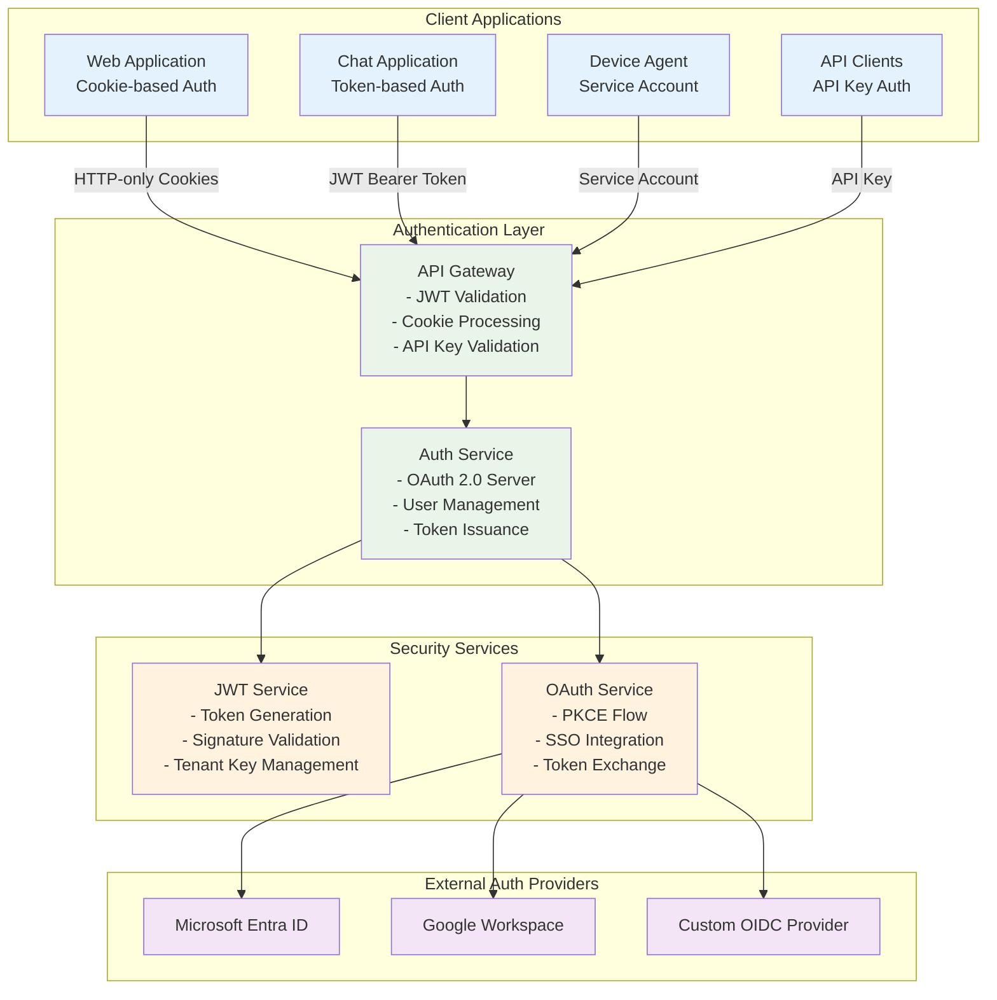

### Security Features

| Component | Security Features | Implementation |
|-----------|-------------------|----------------|
| **Authentication** | OAuth 2.0, OIDC, JWT, SSO | Spring Security OAuth2, custom JWT service |
| **Authorization** | RBAC, tenant isolation, API keys | Custom authorization framework |
| **Data Protection** | Encryption at rest, in transit | AES-256, TLS 1.3, encrypted cookies |
| **Session Management** | HTTP-only cookies, token refresh | Spring Session with Redis |
| **Rate Limiting** | Per-tenant, per-API key limits | Redis-based sliding window |
| **Audit Logging** | Comprehensive audit trails | Structured logging with correlation IDs |

## Event-Driven Architecture

### Event Processing Pipeline

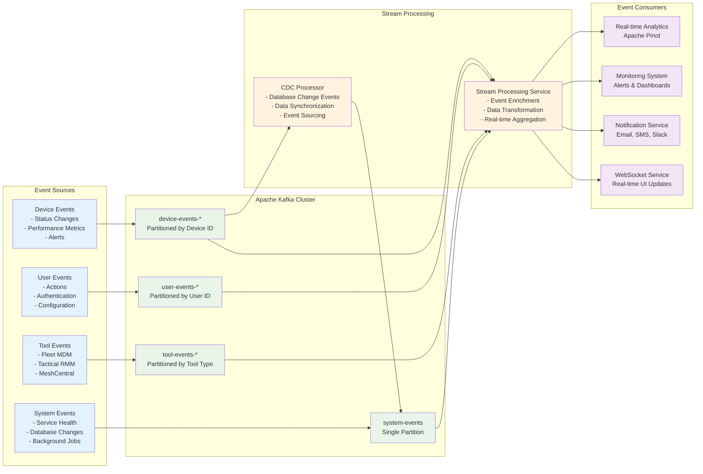

## Performance & Scalability

### Scalability Patterns

| Pattern | Implementation | Benefits |
|---------|----------------|----------|
| **Horizontal Scaling** | Kubernetes-based service scaling | Handle increased load |
| **Database Sharding** | Tenant-based data partitioning | Distribute data load |
| **Caching Strategy** | Redis multi-level caching | Reduce database load |
| **Event Streaming** | Kafka partitioning by tenant/entity | Parallel processing |
| **CDN Integration** | Static asset caching | Reduce frontend load times |
| **Connection Pooling** | Database connection management | Optimize resource usage |

### Performance Characteristics

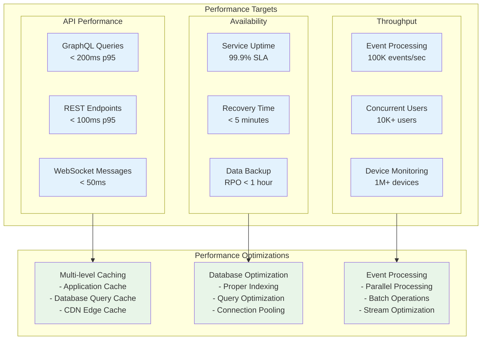

## Development Patterns

### Code Organization

```
openframe/
├── services/                   # Microservices
│   ├── openframe-api/         # GraphQL/REST API service
│   ├── openframe-gateway/     # API Gateway service  
│   ├── openframe-auth/        # Authorization service
│   └── ...
├── libs/                      # Shared libraries
│   ├── openframe-core/        # Core models and utilities
│   ├── openframe-data/        # Data access layer
│   ├── openframe-security/    # Security components
│   └── ...
clients/                       # Client applications
├── openframe-client/          # Rust device agent
├── openframe-chat/            # Tauri chat application
└── ...
integrated-tools/              # External tool integration
├── fleet-mdm/                 # Fleet MDM configuration
├── tactical-rmm/              # Tactical RMM setup
└── ...
```

### Design Patterns

| Pattern | Usage | Implementation |
|---------|-------|----------------|
| **Domain-Driven Design** | Service boundaries | Bounded contexts per domain |
| **CQRS** | Read/write separation | GraphQL queries vs commands |
| **Event Sourcing** | Audit trail, replay | Kafka event streams |
| **Repository Pattern** | Data access abstraction | Spring Data repositories |
| **Factory Pattern** | Service creation | Spring configuration |
| **Observer Pattern** | Real-time updates | WebSocket subscriptions |
| **Strategy Pattern** | Multi-tenant behavior | Tenant-specific implementations |

## Monitoring & Observability

### Observability Stack

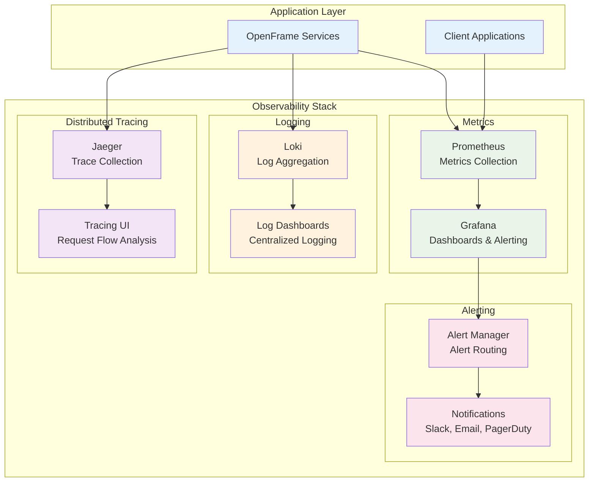

### Key Metrics

| Category | Metrics | Tools |
|----------|---------|-------|
| **Application** | Request latency, throughput, error rate | Micrometer, Spring Actuator |
| **Infrastructure** | CPU, memory, disk, network | Prometheus Node Exporter |
| **Database** | Query performance, connection pool | Database-specific exporters |
| **Business** | User activity, device status, revenue | Custom application metrics |
| **Security** | Authentication events, failed logins | Security audit logs |

## Next Steps

Now that you understand the OpenFrame architecture:

### 🎯 **For Developers**
1. **[Local Development Setup](../setup/local-development.md)** - Get the platform running locally
2. **[Testing Overview](../testing/overview.md)** - Learn testing strategies and frameworks
3. **[Contributing Guidelines](../contributing/guidelines.md)** - Start contributing to the project

### 🏗️ **For Architects**
1. **Service Extension** - Learn how to add new microservices
2. **Integration Patterns** - Understand external system integration
3. **Performance Optimization** - Implement performance improvements

### 🔧 **For DevOps**
1. **Deployment Architecture** - Understand Kubernetes deployment
2. **Monitoring Setup** - Configure observability stack
3. **Security Hardening** - Implement production security measures

## Architecture Resources

### 🗨️ **Community & Support**
- **[OpenMSP Slack](https://join.slack.com/t/openmsp/shared_invite/zt-36bl7mx0h-3~U2nFH6nqHqoTPXMaHEHA)** - Architecture discussions in `#architecture` channel
- **[OpenMSP.ai](https://www.openmsp.ai/)** - Community hub and resources

### 📚 **Technical References**
- **[Microservices Patterns](https://microservices.io/patterns/)** - Proven microservices patterns
- **[Event-Driven Architecture](https://martinfowler.com/articles/201701-event-driven.html)** - Event-driven design principles
- **[Multi-Tenant SaaS](https://docs.aws.amazon.com/wellarchitected/latest/saas-lens/saas-lens.html)** - Multi-tenancy best practices

### 🔗 **Framework Documentation**
- **[Spring Boot](https://docs.spring.io/spring-boot/docs/current/reference/htmlsingle/)** - Backend services framework
- **[Spring Cloud Gateway](https://docs.spring.io/spring-cloud-gateway/docs/current/reference/html/)** - API Gateway implementation
- **[Netflix DGS](https://netflix.github.io/dgs/)** - GraphQL framework
- **[Apache Kafka](https://kafka.apache.org/documentation/)** - Event streaming platform

---

**Architecture Questions?** Join our [OpenMSP Slack community](https://join.slack.com/t/openmsp/shared_invite/zt-36bl7mx0h-3~U2nFH6nqHqoTPXMaHEHA) and ask in the `#architecture` channel. Our team and community are ready to help you understand and extend the OpenFrame platform! 🚀