# Architecture Overview

OpenFrame is designed as a modern, cloud-native microservices platform that provides unified MSP operations through intelligent automation. This guide provides a comprehensive overview of the system architecture, design patterns, and component interactions.

## High-Level Architecture

OpenFrame follows a layered, service-oriented architecture optimized for multi-tenancy, scalability, and maintainability:

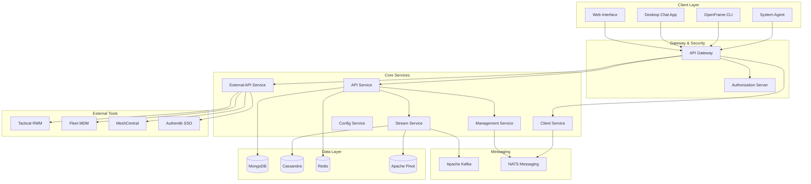

## Core Design Principles

### 1. Multi-Tenant by Design

Every component in OpenFrame is built with multi-tenancy as a first-class concern:

- **Data Isolation**: All database queries automatically filter by tenant ID
- **Resource Isolation**: Services scale independently per tenant
- **Security Isolation**: JWT tokens contain tenant context
- **Feature Isolation**: Features can be enabled/disabled per tenant

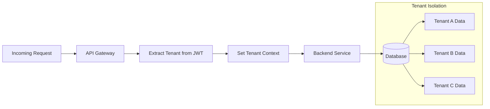

### 2. Event-Driven Architecture

OpenFrame uses event-driven patterns for loose coupling and scalability:

- **Async Processing**: Long-running operations handled via events
- **Real-time Updates**: WebSocket notifications driven by Kafka events
- **Audit Trail**: All changes captured as events for compliance
- **Integration Events**: External tool data synchronized via events

### 3. API-First Design

All functionality is exposed through well-defined APIs:

- **GraphQL**: Primary API for frontend clients with type safety
- **REST**: External integrations and simple CRUD operations
- **WebSocket**: Real-time bidirectional communication
- **gRPC**: Internal high-performance service communication (future)

### 4. Polyglot Persistence

Different data types use optimized storage solutions:

| Data Type | Storage | Rationale |
|-----------|---------|-----------|
| **Operational Data** | MongoDB | Document flexibility, ACID transactions |
| **Time-Series Data** | Cassandra | High write throughput, time-based queries |
| **Analytics Data** | Apache Pinot | Real-time OLAP queries |
| **Session/Cache** | Redis | In-memory performance, TTL support |
| **Event Stream** | Apache Kafka | Durable messaging, replay capability |

## Service Architecture Deep Dive

### API Gateway Service (openframe-gateway)

**Purpose**: Single entry point for all external traffic with security, routing, and protocol translation.

**Key Responsibilities**:
- **Authentication & Authorization**: JWT validation and OAuth2 flows
- **Request Routing**: Intelligent routing to backend services
- **Rate Limiting**: Per-tenant and per-user rate limiting
- **Protocol Translation**: HTTP to WebSocket, REST to GraphQL
- **API Key Management**: External integration authentication

**Technology Stack**:
- Spring Cloud Gateway for reactive routing
- Spring Security for authentication
- Redis for rate limiting and session storage
- WebSocket support for real-time communication

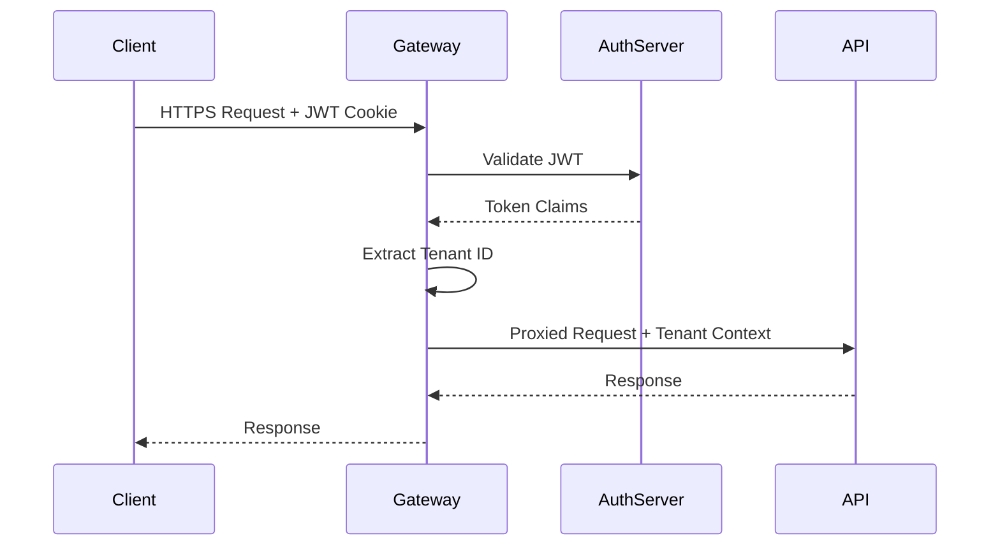

### API Service (openframe-api)

**Purpose**: Core business logic and data operations exposed via GraphQL and REST APIs.

**Key Responsibilities**:
- **GraphQL Schema**: Type-safe API with introspection
- **Data Fetching**: Efficient database queries with N+1 prevention
- **Business Logic**: Core MSP operations and workflows
- **Real-time Subscriptions**: GraphQL subscriptions for live updates
- **Tenant-Aware Queries**: Automatic tenant filtering

**Architecture Patterns**:
- **Netflix DGS**: GraphQL framework with code generation
- **DataLoader Pattern**: Batched and cached data loading
- **Repository Pattern**: Clean separation of data access
- **Service Layer**: Business logic encapsulation

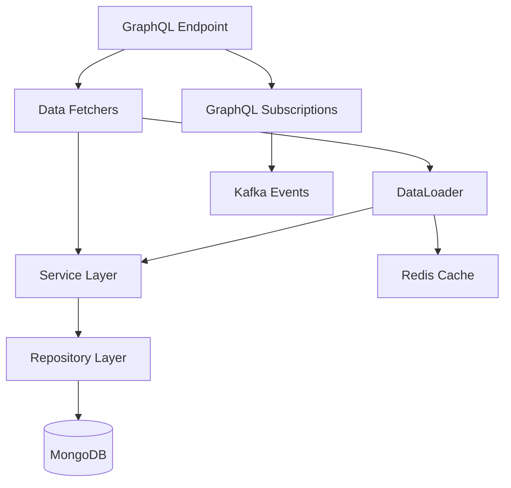

### Authorization Server (openframe-authorization-server)

**Purpose**: OAuth2/OIDC compliant identity and access management.

**Key Responsibilities**:
- **User Authentication**: Login, registration, password reset
- **OAuth2 Flows**: Authorization code, client credentials, refresh tokens
- **Multi-Factor Authentication**: TOTP, SMS, email verification
- **Single Sign-On**: SAML, OIDC integration with external providers
- **Tenant Management**: Organization creation and user provisioning

**Security Features**:
- **JWT Tokens**: Signed with tenant-specific keys
- **Refresh Token Rotation**: Enhanced security for long-lived sessions
- **PKCE Support**: Secure public client authentication
- **Rate Limiting**: Brute force protection

### Management Service (openframe-management)

**Purpose**: Platform administration, orchestration, and scheduled operations.

**Key Responsibilities**:
- **Tool Lifecycle**: Install, configure, update integrated MSP tools
- **Scheduled Tasks**: Maintenance, cleanup, synchronization
- **System Health**: Monitor service health and dependencies
- **Configuration Management**: Centralized configuration updates
- **Data Migration**: Schema updates and data transformations

**Key Patterns**:
- **Scheduler Pattern**: Quartz-based job scheduling
- **Circuit Breaker**: Fault tolerance for external integrations
- **Saga Pattern**: Distributed transaction coordination
- **Event Sourcing**: Audit log of administrative actions

### Stream Service (openframe-stream)

**Purpose**: Real-time event processing and data pipeline management.

**Key Responsibilities**:
- **Event Ingestion**: Consume events from Kafka topics
- **Data Enrichment**: Augment events with contextual data
- **Stream Processing**: Real-time analytics and alerting
- **Data Routing**: Route processed data to appropriate storage
- **Change Data Capture**: Process database change events

**Processing Pipeline**:

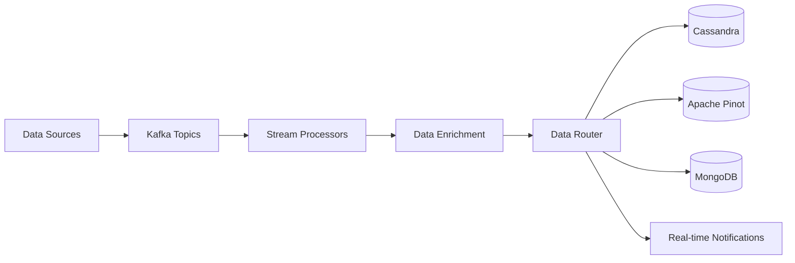

### Client Service (openframe-client)

**Purpose**: Agent registration, authentication, and communication management.

**Key Responsibilities**:
- **Agent Registration**: Onboard new system agents
- **Certificate Management**: Issue and rotate agent certificates
- **Command Distribution**: Send commands to remote agents
- **Heartbeat Processing**: Track agent connectivity and health
- **File Transfer**: Secure file upload/download for agents

**Communication Patterns**:
- **NATS Messaging**: Reliable pub/sub for agent communication
- **JWT Authentication**: Secure agent-to-service authentication
- **Binary Protocol**: Efficient data transfer for large files
- **Heartbeat Protocol**: Lightweight connectivity monitoring

### External API Service (openframe-external-api)

**Purpose**: Stable, versioned API for external integrations and third-party access.

**Key Responsibilities**:
- **API Key Authentication**: Secure access for external systems
- **Rate Limiting**: Protect backend services from abuse
- **API Versioning**: Backward compatibility for integrations
- **Webhook Management**: Outbound notifications to external systems
- **Data Export**: Bulk data access for reporting and analytics

**Design Principles**:
- **RESTful Design**: Standard HTTP verbs and resource modeling
- **OpenAPI Documentation**: Comprehensive API documentation
- **Error Handling**: Consistent error responses and codes
- **Pagination**: Efficient large dataset handling

## Data Architecture

### Data Flow Patterns

OpenFrame implements several data flow patterns for different use cases:

#### 1. Operational Data Flow (OLTP)

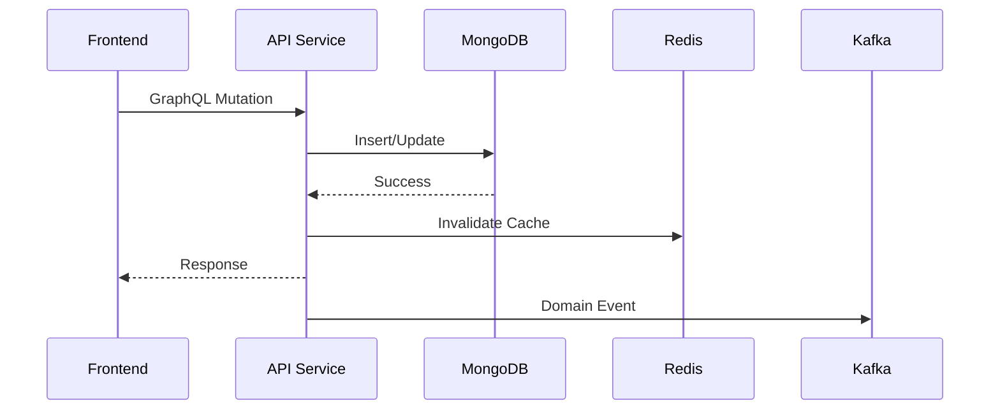

#### 2. Analytics Data Flow (OLAP)

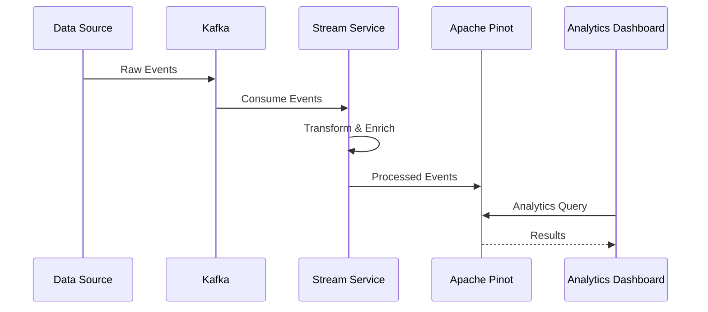

#### 3. Real-time Data Flow

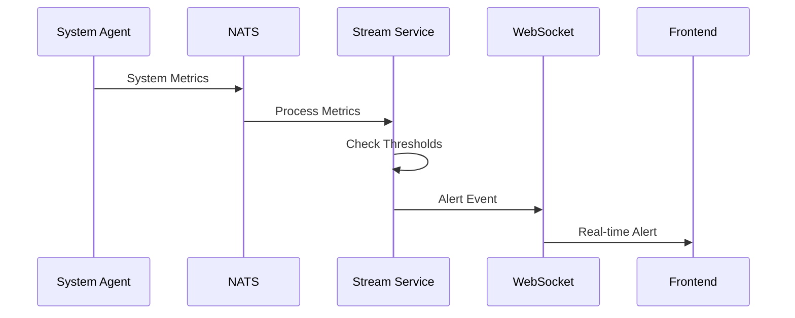

### Database Design Patterns

#### Multi-Tenant Data Isolation

All collections/tables include tenant-aware indexes and queries:

```javascript
// MongoDB collection design
{
  "_id": ObjectId("..."),
  "tenantId": "tenant-123",          // Partition key
  "organizationId": "org-456",       // Additional isolation
  "name": "Device Name",
  "status": "online",
  "createdAt": ISODate("..."),
  // ... other fields
}

// Compound index for efficient tenant queries
db.devices.createIndex({ "tenantId": 1, "organizationId": 1, "status": 1 })
```

#### Event Sourcing for Audit

Critical operations are tracked as immutable events:

```javascript
// Audit event structure
{
  "_id": ObjectId("..."),
  "tenantId": "tenant-123",
  "eventType": "DEVICE_STATUS_CHANGED",
  "entityId": "device-789",
  "userId": "user-101",
  "timestamp": ISODate("..."),
  "before": { "status": "offline" },
  "after": { "status": "online" },
  "metadata": {
    "userAgent": "...",
    "ipAddress": "...",
    "source": "api"
  }
}
```

## Security Architecture

### Authentication Flow

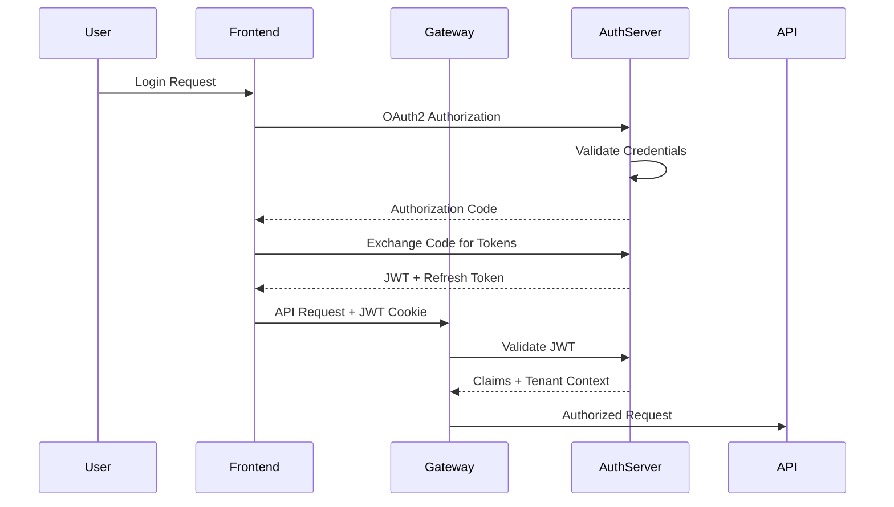

### Multi-Tenant Security

#### JWT Token Structure

```json
{
  "sub": "user-123",
  "email": "user@example.com",
  "tenantId": "tenant-456",
  "orgId": "org-789",
  "roles": ["ADMIN", "TECHNICIAN"],
  "permissions": ["READ_DEVICES", "WRITE_SCRIPTS"],
  "iat": 1640995200,
  "exp": 1641081600,
  "aud": "openframe-api"
}
```

#### Request Authorization

Every API request undergoes multi-level authorization:

1. **Authentication**: Valid JWT token with correct signature
2. **Tenant Authorization**: User belongs to requested tenant
3. **Resource Authorization**: User has access to specific resources
4. **Action Authorization**: User can perform requested action

```java
@PreAuthorize("hasPermission(#deviceId, 'Device', 'READ')")
public Device getDevice(@TenantId String tenantId, String deviceId) {
    return deviceService.findByIdAndTenantId(deviceId, tenantId);
}
```

## Performance and Scalability

### Horizontal Scaling Patterns

#### Stateless Services

All services are designed to be stateless for horizontal scaling:

- **No Local State**: All state stored in databases or caches
- **Session Externalization**: Redis-based session storage
- **Load Balancer Compatible**: Services can run behind any load balancer
- **Auto-scaling Ready**: Kubernetes HPA compatible

#### Database Scaling

- **Read Replicas**: MongoDB replica sets for read scaling
- **Sharding**: Tenant-based sharding for very large deployments
- **Connection Pooling**: Efficient database connection management
- **Query Optimization**: Proper indexing and query patterns

#### Caching Strategy

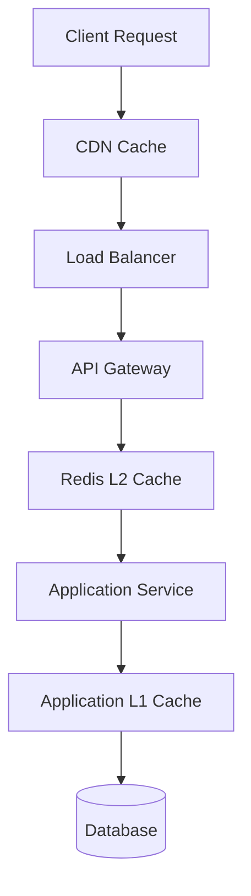

### Performance Monitoring

#### Application Metrics

- **Custom Metrics**: Business KPIs and technical metrics
- **JVM Metrics**: Heap usage, GC performance, thread pools
- **Database Metrics**: Query performance, connection usage
- **Cache Metrics**: Hit/miss ratios, memory usage

#### Distributed Tracing

OpenFrame uses OpenTelemetry for distributed tracing:

```java
@Component
public class DeviceService {
    
    @WithSpan("device.find")
    public Device findDevice(@SpanAttribute("deviceId") String id) {
        return deviceRepository.findById(id);
    }
}
```

## Integration Architecture

### External Tool Integration

OpenFrame integrates with external MSP tools through standardized patterns:

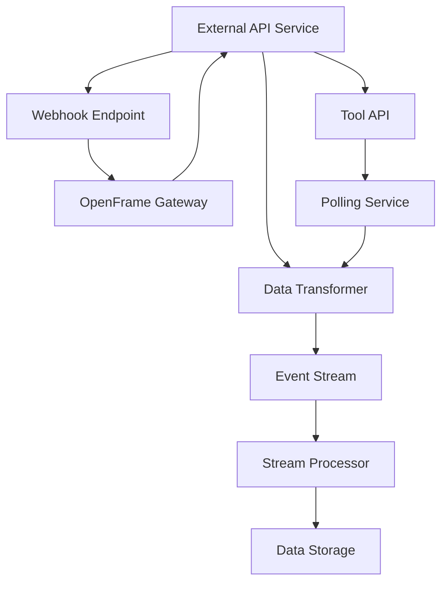

#### Integration Patterns

1. **Webhook Pattern**: Real-time events from external tools
2. **Polling Pattern**: Regular synchronization for batch updates  
3. **API Proxy Pattern**: Direct pass-through with authentication
4. **Event Transformation**: Normalize external data formats

#### Tool-Specific Integrations

| Tool | Integration Type | Data Flow | Frequency |
|------|-----------------|-----------|-----------|
| **Tactical RMM** | Webhook + Polling | Bidirectional | Real-time + Hourly |
| **Fleet MDM** | API Polling | Pull | Every 15 minutes |
| **MeshCentral** | WebSocket Proxy | Real-time | Continuous |
| **Authentik** | OIDC/SAML | Authentication | On-demand |

## Deployment Architecture

### Container Strategy

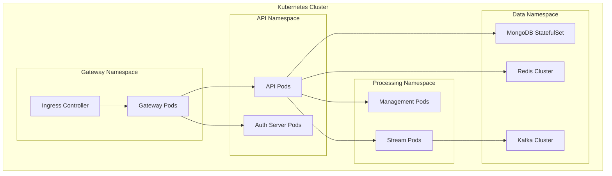

### Observability Stack

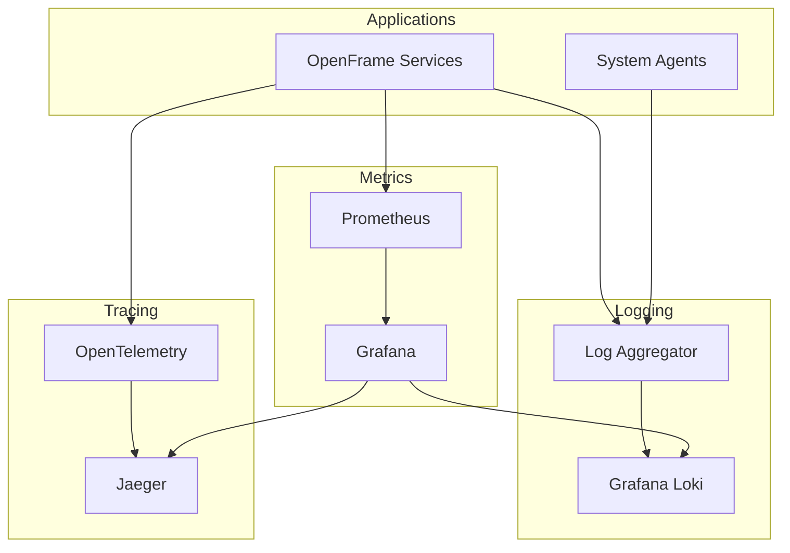

## Future Architecture Considerations

### Planned Enhancements

1. **Service Mesh**: Istio integration for advanced traffic management
2. **Event Streaming**: Enhanced Kafka-based event sourcing
3. **Edge Computing**: Agent-side processing for reduced latency
4. **AI/ML Pipeline**: Dedicated ML service for predictive analytics
5. **Global Distribution**: Multi-region deployment support

### Technology Evolution

- **gRPC**: Internal service communication upgrade
- **GraphQL Federation**: Distributed schema management
- **Serverless**: Functions-as-a-Service for event processing
- **Edge Caching**: Global CDN integration for performance

---

This architecture overview provides the foundation for understanding OpenFrame's design. For implementation details, refer to the individual service documentation in the [reference section](../../reference/architecture/). For development guidance, continue with the [Testing Overview](../testing/overview.md).