# Architecture Overview

OpenFrame is built as a modern, cloud-native microservices platform designed for scalability, security, and developer productivity. This guide provides a comprehensive overview of the system architecture, design patterns, and key components.

[](https://www.youtube.com/watch?v=PexpoNdZtUk)

## System Architecture

### High-Level Architecture

OpenFrame follows a **gateway-centric, zero-trust, multi-tenant architecture** with strict isolation at all layers:

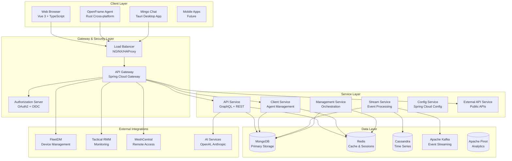

## Core Design Principles

### 1. Multi-Tenancy by Design

Every component is built with tenant isolation as a fundamental requirement:

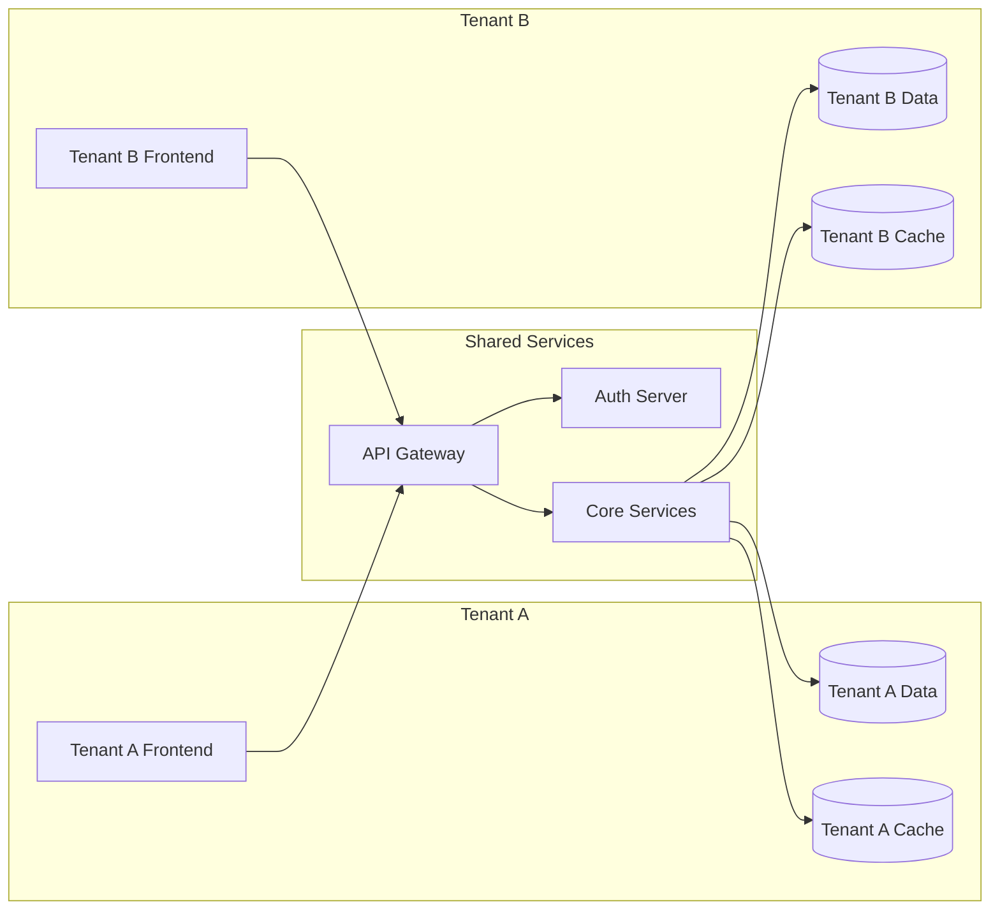

**Key Features:**
- **Database-level partitioning** using `tenantId` fields
- **Cache namespacing** with tenant-specific prefixes
- **Request context propagation** with tenant information
- **Resource isolation** at the application level

### 2. API-First Architecture

OpenFrame follows an API-first approach with GraphQL as the primary interface:

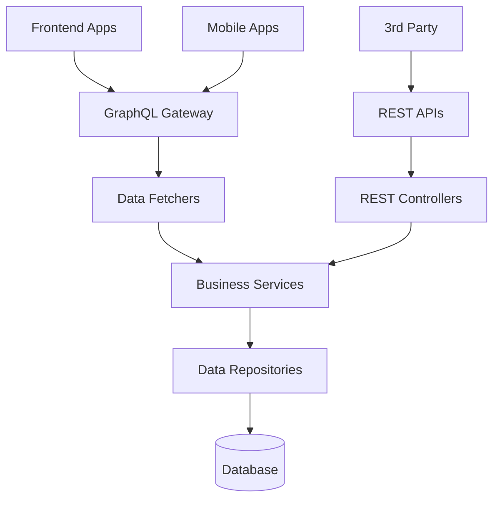

**Benefits:**
- **Type safety** across frontend and backend
- **Efficient data fetching** with GraphQL
- **API versioning** through schema evolution
- **Self-documenting APIs** with introspection

### 3. Event-Driven Architecture

OpenFrame uses event-driven patterns for loose coupling and scalability:

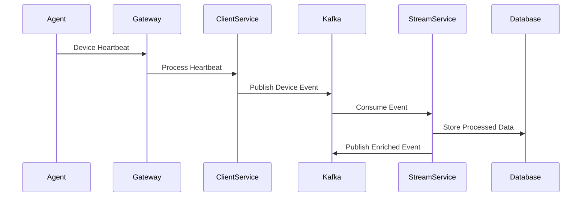

**Event Types:**
- **Device events** (heartbeats, status changes)
- **User actions** (login, configuration changes)
- **System events** (service startup, errors)
- **Integration events** (external tool synchronization)

## Core Components

### API Gateway Service

**Purpose**: Unified entry point for all client traffic

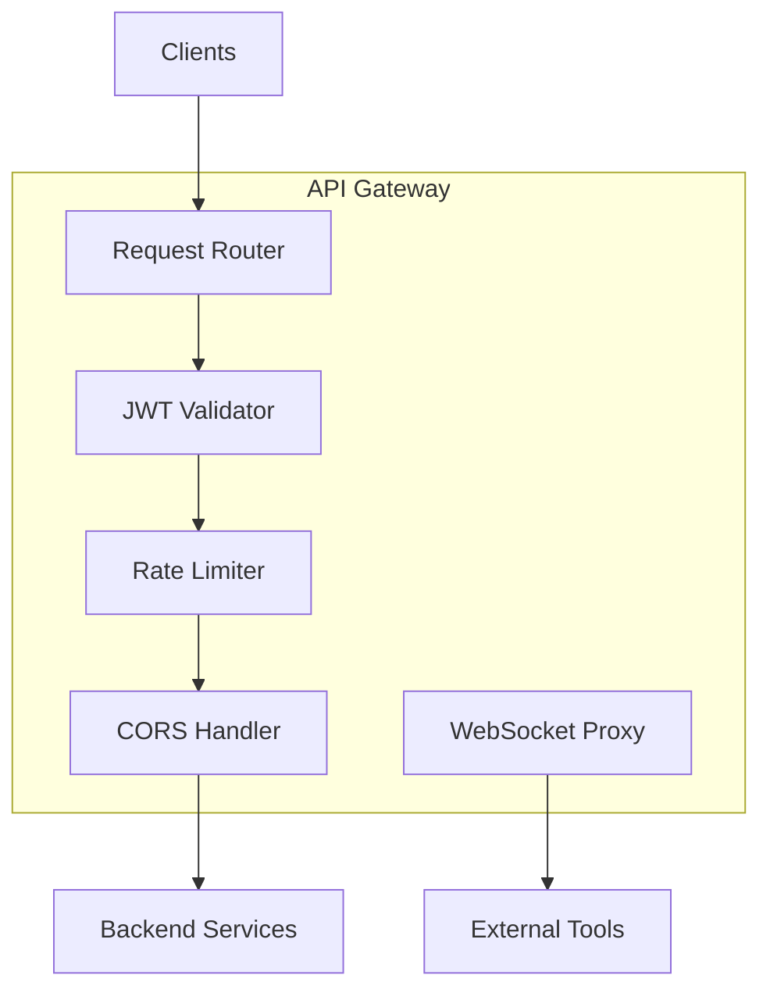

**Key Responsibilities:**
- **JWT validation** and issuer resolution
- **Tenant routing** based on JWT claims
- **Rate limiting** and DDoS protection
- **WebSocket proxying** for real-time connections
- **CORS and security headers** management

### Authorization Server

**Purpose**: OAuth2/OIDC authentication and authorization

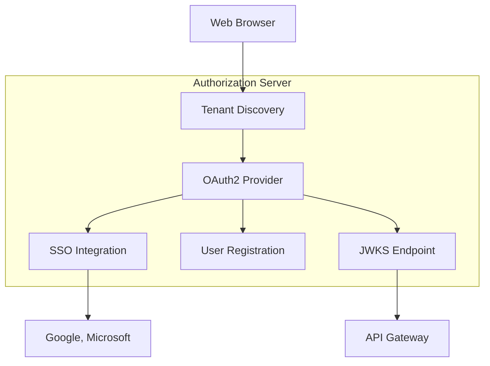

**Features:**
- **Multi-tenant OAuth2** with tenant-specific issuers
- **SSO integration** with Google, Microsoft, custom OIDC
- **User registration** and invitation flows
- **JWT signing** with tenant-specific keys
- **Session management** and refresh tokens

### API Service

**Purpose**: Core GraphQL API and business logic

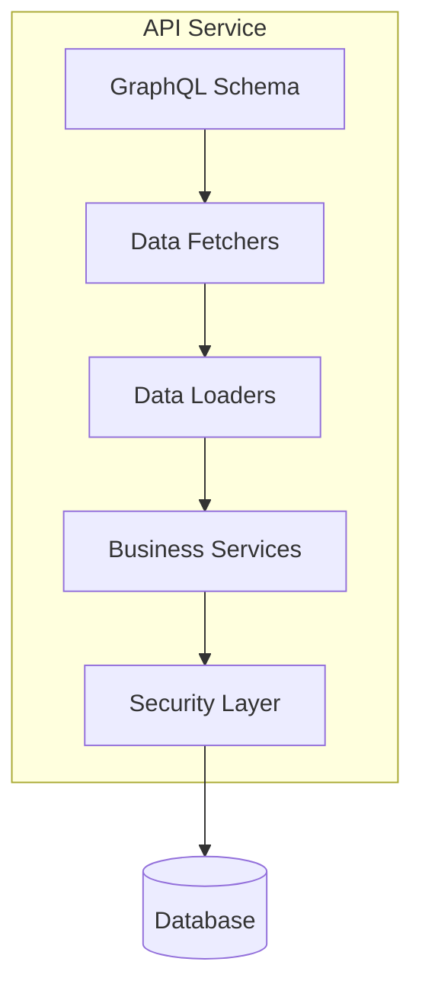

**Core Features:**
- **GraphQL schema** with type-safe operations
- **Data fetching optimization** with DataLoader pattern
- **Real-time subscriptions** for live updates
- **Multi-tenant data access** with automatic filtering
- **Business logic** for devices, organizations, users

### Stream Processing Service

**Purpose**: Real-time event processing and enrichment

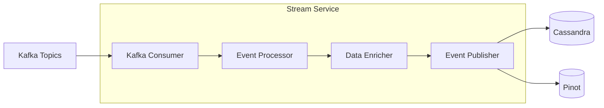

**Processing Pipeline:**
1. **Ingest events** from Kafka topics
2. **Normalize data** from different sources
3. **Enrich events** with contextual information
4. **Store processed data** in analytics stores
5. **Generate derived events** for downstream systems

## Data Architecture

### Data Storage Strategy

OpenFrame uses a polyglot persistence approach:

| Database | Use Case | Data Types |
|----------|----------|------------|
| **MongoDB** | Primary storage | Users, devices, organizations, configuration |
| **Redis** | Caching & Sessions | Session data, temporary tokens, cache |
| **Cassandra** | Time-series data | Logs, metrics, audit events |
| **Apache Pinot** | Analytics | Aggregated metrics, reporting data |
| **Apache Kafka** | Event streaming | Real-time events, message queues |

### Data Model Design

#### Multi-Tenant Data Partitioning

```javascript
// MongoDB Document Structure
{
  "_id": ObjectId("..."),
  "tenantId": "tenant-123",  // Always present for isolation
  "organizationId": "org-456", // Optional sub-partitioning
  "name": "Device Name",
  "status": "ONLINE",
  "metadata": { ... },
  "createdAt": ISODate("..."),
  "updatedAt": ISODate("...")
}

// Automatic tenant filtering in queries
db.devices.find({
  "tenantId": "tenant-123",  // Always added by framework
  "status": "ONLINE"
})
```

#### Event Sourcing Pattern

```javascript
// Event Store Structure
{
  "_id": ObjectId("..."),
  "tenantId": "tenant-123",
  "aggregateId": "device-789",
  "eventType": "DEVICE_STATUS_CHANGED",
  "eventData": {
    "oldStatus": "OFFLINE",
    "newStatus": "ONLINE",
    "timestamp": "2024-01-15T10:30:00Z"
  },
  "version": 15,
  "createdAt": ISODate("...")
}
```

## Security Architecture

### Zero-Trust Security Model

OpenFrame implements zero-trust principles at every layer:

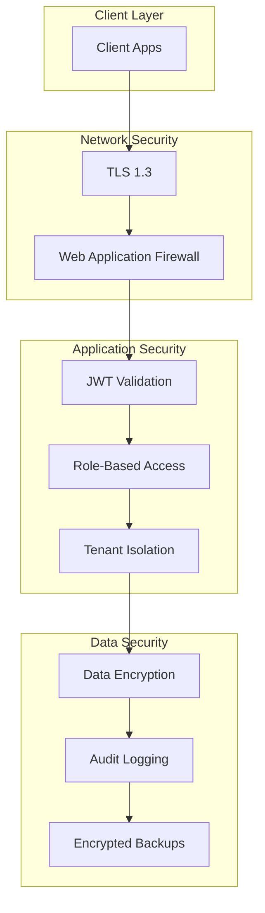

### Authentication & Authorization Flow

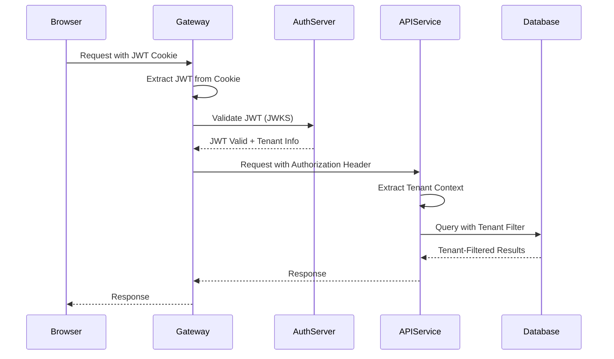

**Security Features:**
- **HTTP-only cookies** for JWT storage (XSS protection)
- **Automatic token refresh** with sliding expiration
- **Role-based access control** with granular permissions
- **Audit logging** for all sensitive operations
- **Data encryption** at rest and in transit

## Scalability & Performance

### Horizontal Scaling Strategy

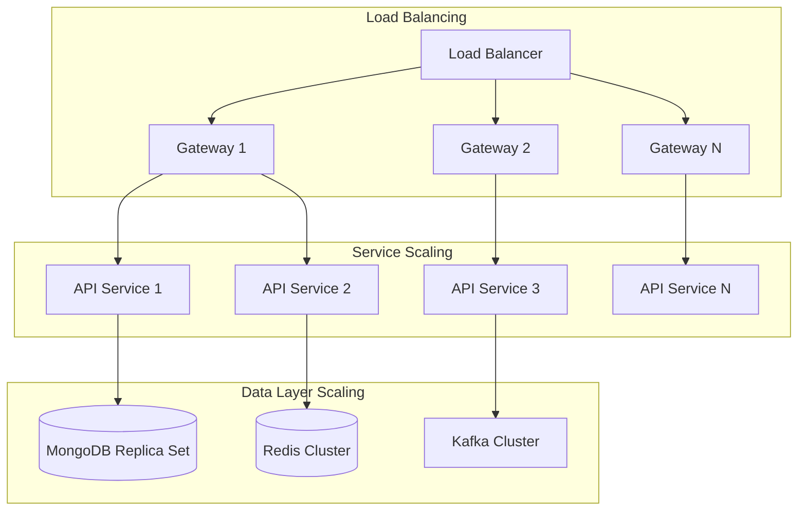

### Performance Optimizations

#### Caching Strategy

| Layer | Cache Type | TTL | Invalidation |
|--------|------------|-----|--------------|
| **API Gateway** | Request cache | 60s | Event-driven |
| **GraphQL** | Query cache | 300s | Schema changes |
| **Database** | Query result cache | 900s | Data changes |
| **Session** | User session cache | 24h | Logout/expiry |

#### Database Indexing

```javascript
// MongoDB Indexes for Performance
db.devices.createIndex({ "tenantId": 1, "status": 1 })
db.devices.createIndex({ "tenantId": 1, "organizationId": 1, "name": 1 })
db.users.createIndex({ "email": 1 }, { "unique": true })
db.events.createIndex({ "tenantId": 1, "timestamp": -1 })

// TTL Index for temporary data
db.sessions.createIndex({ "expiresAt": 1 }, { "expireAfterSeconds": 0 })
```

## Development Patterns

### Service Communication Patterns

#### Synchronous Communication
```java
// REST Template for service-to-service calls
@Service
public class DeviceService {
    
    @Autowired
    private RestTemplate restTemplate;
    
    public DeviceStatus getDeviceStatus(String deviceId) {
        return restTemplate.getForObject(
            "http://client-service/api/devices/{deviceId}/status",
            DeviceStatus.class,
            deviceId
        );
    }
}
```

#### Asynchronous Communication
```java
// Kafka producer for event publishing
@Service
public class DeviceEventPublisher {
    
    @Autowired
    private KafkaTemplate<String, DeviceEvent> kafkaTemplate;
    
    public void publishDeviceEvent(DeviceEvent event) {
        kafkaTemplate.send("device-events", event.getDeviceId(), event);
    }
}
```

### Error Handling Patterns

#### Centralized Error Handling
```java
@ControllerAdvice
public class GlobalExceptionHandler {
    
    @ExceptionHandler(DeviceNotFoundException.class)
    public ResponseEntity<ErrorResponse> handleDeviceNotFound(DeviceNotFoundException ex) {
        return ResponseEntity.status(HttpStatus.NOT_FOUND)
            .body(new ErrorResponse("DEVICE_NOT_FOUND", ex.getMessage()));
    }
    
    @ExceptionHandler(TenantAccessViolationException.class)
    public ResponseEntity<ErrorResponse> handleTenantViolation(TenantAccessViolationException ex) {
        return ResponseEntity.status(HttpStatus.FORBIDDEN)
            .body(new ErrorResponse("ACCESS_DENIED", "Insufficient permissions"));
    }
}
```

### GraphQL Schema Design Patterns

#### Connection Pattern for Pagination
```graphql
type Query {
  devices(
    first: Int
    after: String
    filter: DeviceFilter
  ): DeviceConnection!
}

type DeviceConnection {
  edges: [DeviceEdge!]!
  pageInfo: PageInfo!
  totalCount: Int!
}

type DeviceEdge {
  node: Device!
  cursor: String!
}
```

#### Input Types for Complex Operations
```graphql
input CreateDeviceInput {
  name: String!
  organizationId: ID!
  type: DeviceType!
  configuration: DeviceConfigurationInput
}

input DeviceConfigurationInput {
  monitoring: MonitoringConfigInput
  security: SecurityConfigInput
  networking: NetworkingConfigInput
}
```

## Deployment Architecture

### Container Strategy

```yaml
# docker-compose.yml structure
services:
  gateway:
    image: openframe/gateway:latest
    ports: ["8080:8080"]
    depends_on: [config-service, auth-server]
    
  api-service:
    image: openframe/api:latest
    ports: ["8081:8081"]
    depends_on: [mongodb, redis]
    
  mongodb:
    image: mongo:7.0
    volumes: ["mongodb_data:/data/db"]
    
  redis:
    image: redis:7.0-alpine
    volumes: ["redis_data:/data"]
```

### Kubernetes Deployment

```yaml
# Kubernetes deployment example
apiVersion: apps/v1
kind: Deployment
metadata:
  name: openframe-api
spec:
  replicas: 3
  selector:
    matchLabels:
      app: openframe-api
  template:
    metadata:
      labels:
        app: openframe-api
    spec:
      containers:
      - name: api
        image: openframe/api:latest
        ports:
        - containerPort: 8081
        env:
        - name: SPRING_PROFILES_ACTIVE
          value: "kubernetes"
        - name: MONGODB_URI
          valueFrom:
            secretKeyRef:
              name: openframe-secrets
              key: mongodb-uri
```

## Next Steps

Now that you understand the OpenFrame architecture:

1. **[Testing Overview](../testing/overview.md)** - Learn how to test the system
2. **[Contributing Guidelines](../contributing/guidelines.md)** - Start contributing code
3. **[Local Development](../setup/local-development.md)** - Set up your development workflow

## Additional Resources

- **[Security OAuth BFF and JWT Core](../../reference/architecture/security_oauth_bff_and_jwt_core.md)** - Deep dive into security implementation
- **[Data Layer MongoDB](../../reference/architecture/data_layer_mongo_and_repositories.md)** - Database architecture details
- **[Stream Service Architecture](../../reference/architecture/openframe_stream_service.md)** - Event processing details

## Getting Help

For architecture questions and discussions:

1. **Join our community**: [OpenMSP Slack](https://join.slack.com/t/openmsp/shared_invite/zt-36bl7mx0h-3~U2nFH6nqHqoTPXMaHEHA)
2. **Ask in #architecture channel** for design discussions
3. **Review existing documentation** in the reference section
4. **Check GitHub discussions** for architectural decisions