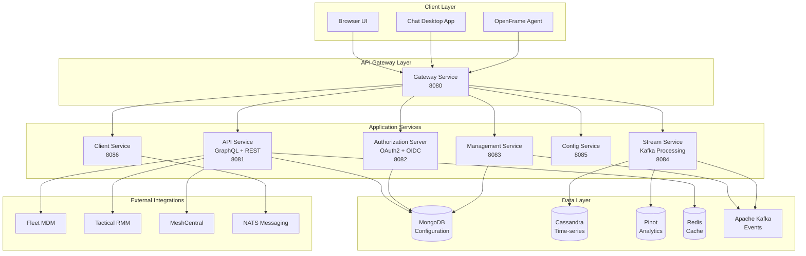
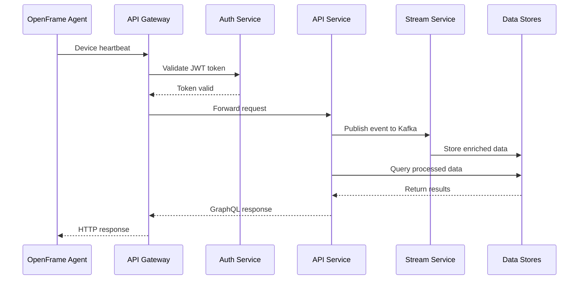
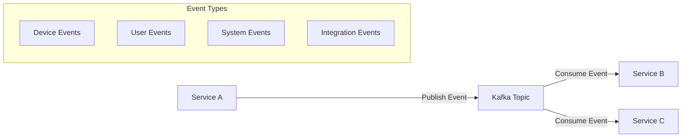
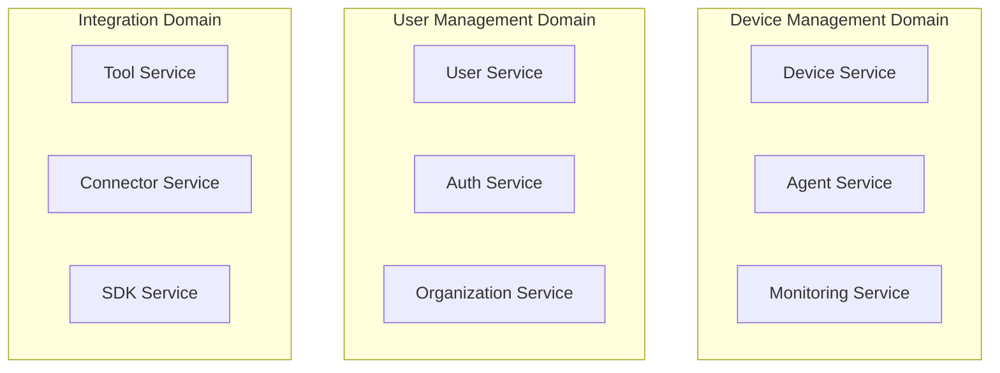
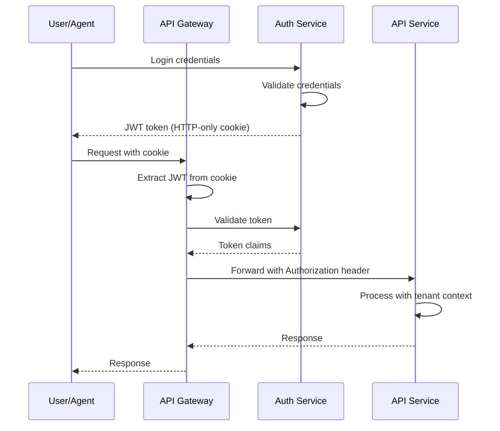
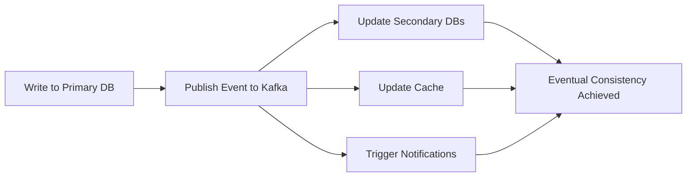
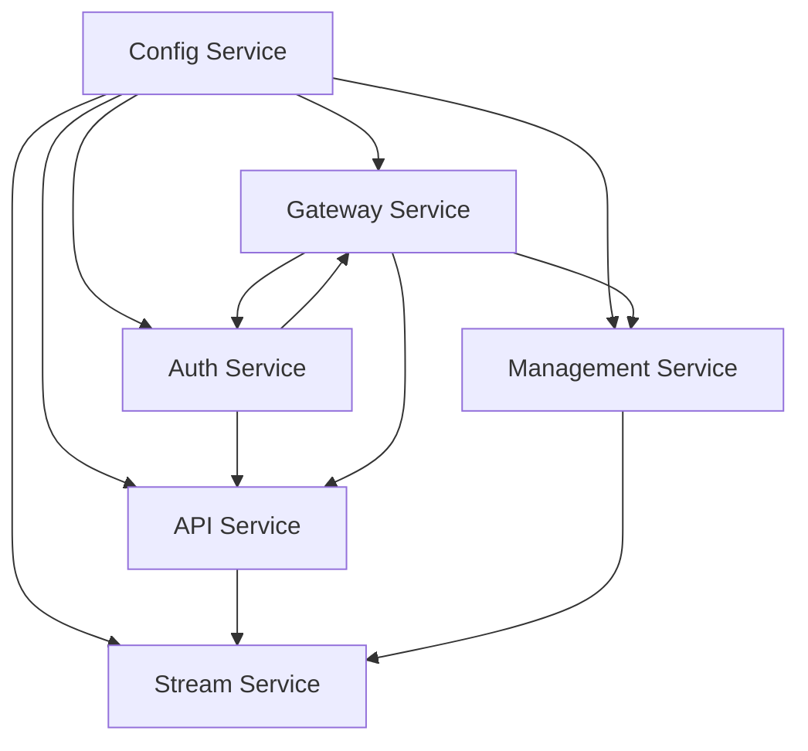
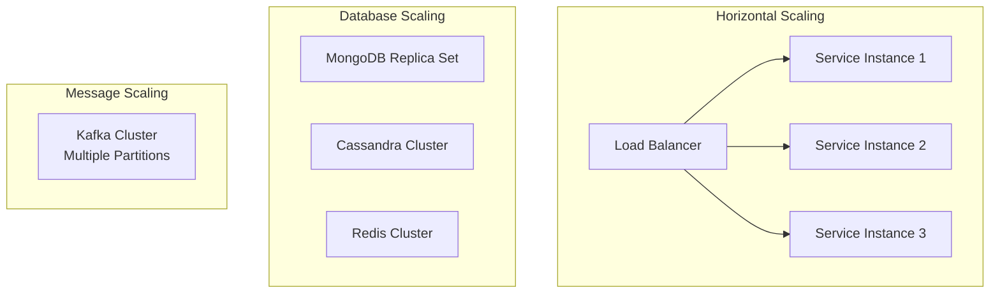

# Architecture Overview

OpenFrame is built as a modern, cloud-native platform using microservices architecture, event-driven design, and multi-tenant isolation. This guide provides developers with a comprehensive understanding of the system's architecture, design patterns, and component relationships.

## High-Level System Architecture



## Core Components

### Service Layer Architecture

| Service | Port | Purpose | Technology Stack |
|---------|------|---------|------------------|
| **Gateway** | 8080 | Routing, Auth, WebSockets | Spring WebFlux, Reactive |
| **API** | 8081 | GraphQL API, Business Logic | Spring Boot, Netflix DGS |
| **Authorization** | 8082 | OAuth2, OIDC, Multi-tenant Auth | Spring Authorization Server |
| **Management** | 8083 | Platform Control, Schedulers | Spring Boot, ShedLock |
| **Stream** | 8084 | Event Processing, Enrichment | Kafka Streams |
| **Config** | 8085 | Centralized Configuration | Spring Cloud Config |
| **Client** | 8086 | Agent Communication | Spring Boot, NATS |

### Data Flow Architecture



## Design Patterns and Principles

### 1. Event-Driven Architecture

OpenFrame uses Apache Kafka for asynchronous communication between services:



**Key Kafka Topics:**
- `device.heartbeats` - Agent status updates
- `user.activities` - User action events
- `system.alerts` - Platform alerts
- `integration.events` - External tool events

### 2. Multi-Tenant Isolation

Tenant isolation is enforced at multiple layers:

```yaml
Database Level:
  - MongoDB collections prefixed with tenant ID
  - Cassandra keyspaces per tenant
  - Redis key namespacing

Application Level:
  - JWT tokens contain tenant claims
  - GraphQL context includes tenant information
  - Service methods validate tenant access

Infrastructure Level:
  - Kubernetes namespaces per tenant (production)
  - Network policies for isolation
  - Resource quotas and limits
```

### 3. Domain-Driven Design (DDD)

Services are organized around business domains:



## Core Design Decisions

### API Design

#### GraphQL-First Approach

OpenFrame uses GraphQL as the primary API technology:

```graphql
# Example GraphQL Schema
type Organization {
  id: ID!
  name: String!
  devices: [Device!]!
  users: [User!]!
  createdAt: DateTime!
}

type Device {
  id: ID!
  hostname: String!
  platform: Platform!
  status: DeviceStatus!
  lastSeen: DateTime
  organization: Organization!
}

type Query {
  organizations(filter: OrganizationFilter): [Organization!]!
  devices(filter: DeviceFilter): DeviceConnection!
  logs(filter: LogFilter): LogConnection!
}

type Mutation {
  createOrganization(input: CreateOrganizationInput!): Organization!
  updateDevice(id: ID!, input: UpdateDeviceInput!): Device!
}

type Subscription {
  deviceStatusUpdated(organizationId: ID!): Device!
  newLogEntry(deviceId: ID!): LogEntry!
}
```

**Benefits:**
- ✅ Type-safe API contracts
- ✅ Efficient data fetching
- ✅ Real-time subscriptions via WebSockets
- ✅ Auto-generated documentation

#### REST for External Integrations

External API for third-party integrations uses REST:

```yaml
# External API Routes
GET    /api/v1/organizations
POST   /api/v1/organizations
GET    /api/v1/devices
PATCH  /api/v1/devices/{id}/status
GET    /api/v1/logs
POST   /api/v1/events
```

### Security Architecture

#### JWT-Based Authentication



**Key Security Features:**
- JWT tokens stored in HTTP-only cookies (not localStorage)
- Automatic token refresh
- Tenant-scoped permissions
- API rate limiting
- CORS configuration

### Data Architecture

#### Database Selection by Use Case

| Data Type | Database | Reasoning |
|-----------|----------|-----------|
| **Configuration** | MongoDB | Flexible schema, complex queries |
| **Time-series** | Cassandra | High write throughput, time-based partitioning |
| **Analytics** | Apache Pinot | Real-time OLAP, SQL queries |
| **Cache/Sessions** | Redis | Fast in-memory access |
| **Events** | Apache Kafka | Durable, scalable messaging |

#### Data Consistency Strategy

OpenFrame implements **eventual consistency** with careful design:



## Component Relationships

### Service Dependencies



**Dependency Rules:**
1. **Config Service** starts first (provides configuration)
2. **Auth Service** starts second (provides authentication)
3. **API Service** depends on Config + Auth
4. **Gateway** orchestrates all service communication
5. **Stream** and **Management** can start independently

### Inter-Service Communication

#### Synchronous Communication

```java
// Example: Service-to-service REST call
@Service
public class DeviceService {
    
    @Autowired
    private WebClient webClient;
    
    public DeviceStatus getDeviceStatus(String deviceId) {
        return webClient.get()
            .uri("http://client-service/api/devices/{id}/status", deviceId)
            .retrieve()
            .bodyToMono(DeviceStatus.class)
            .block();
    }
}
```

#### Asynchronous Communication

```java
// Example: Kafka event publishing
@Service
public class DeviceEventPublisher {
    
    @Autowired
    private KafkaTemplate<String, Object> kafkaTemplate;
    
    public void publishDeviceUpdate(Device device) {
        DeviceUpdateEvent event = new DeviceUpdateEvent(
            device.getId(),
            device.getStatus(),
            Instant.now()
        );
        
        kafkaTemplate.send("device.updates", device.getId(), event);
    }
}
```

## Extension Points

### 1. Custom Tool Integrations

Add new MSP tools by implementing SDK interfaces:

```java
public interface ToolSdk {
    String getToolType();
    CompletableFuture<ConnectionStatus> testConnection(ToolCredentials credentials);
    CompletableFuture<List<Device>> fetchDevices(ToolCredentials credentials);
    CompletableFuture<List<LogEntry>> fetchLogs(ToolCredentials credentials, LogFilter filter);
}

@Component
public class CustomToolSdk implements ToolSdk {
    
    @Override
    public String getToolType() {
        return "CUSTOM_TOOL";
    }
    
    @Override
    public CompletableFuture<ConnectionStatus> testConnection(ToolCredentials credentials) {
        // Implementation specific to your tool
        return CompletableFuture.supplyAsync(() -> {
            // Test connection logic
            return ConnectionStatus.CONNECTED;
        });
    }
}
```

### 2. Custom Event Processors

Extend stream processing with custom event enrichment:

```java
@Component
public class CustomEventProcessor implements EventProcessor<DeviceEvent> {
    
    @Override
    public boolean canProcess(Object event) {
        return event instanceof DeviceEvent;
    }
    
    @Override
    public CompletableFuture<ProcessedEvent> process(DeviceEvent event) {
        return CompletableFuture.supplyAsync(() -> {
            // Custom enrichment logic
            return ProcessedEvent.builder()
                .originalEvent(event)
                .enrichedData(customEnrichmentLogic(event))
                .build();
        });
    }
}
```

### 3. Custom GraphQL Resolvers

Add custom data fetchers for new domains:

```java
@DgsComponent
public class CustomDataFetcher {
    
    @DgsQuery
    public List<CustomEntity> customEntities(
            @InputArgument CustomFilter filter,
            DgsDataFetchingEnvironment dfe) {
        
        TenantContext tenant = dfe.getContext();
        return customService.findEntities(tenant.getTenantId(), filter);
    }
    
    @DgsSubscription
    public Publisher<CustomEntity> customEntityUpdated(
            @InputArgument String entityId) {
        
        return customEventPublisher.subscribe(entityId);
    }
}
```

## Performance Considerations

### Caching Strategy

```yaml
Cache Layers:
  - Application Cache: Caffeine (in-memory)
  - Distributed Cache: Redis (cross-service)
  - Database Cache: MongoDB/Cassandra built-in
  - CDN Cache: CloudFlare (static assets)

Cache Patterns:
  - Read-through: Cache-aside pattern
  - Write-through: Update cache on write
  - TTL: Time-based expiration
  - Invalidation: Event-driven cache clearing
```

### Scalability Patterns



### Monitoring and Observability

OpenFrame includes comprehensive monitoring:

```yaml
Metrics: 
  - Micrometer + Prometheus (application metrics)
  - Custom business metrics
  - JVM and system metrics

Logging:
  - Structured JSON logging
  - Centralized log aggregation
  - Log correlation via trace IDs

Tracing:
  - Distributed tracing with Spring Cloud Sleuth
  - Request correlation across services
  - Performance bottleneck identification

Health Checks:
  - Actuator health endpoints
  - Database connectivity checks
  - External service dependency checks
```

## Key Design Decisions Summary

| Decision | Choice | Reasoning |
|----------|--------|-----------|
| **API Style** | GraphQL primary, REST secondary | Flexibility, type safety, real-time |
| **Architecture** | Microservices | Scalability, maintainability |
| **Communication** | Event-driven + Sync calls | Loose coupling, resilience |
| **Database** | Polyglot persistence | Right tool for each use case |
| **Authentication** | JWT + OAuth2 | Standard, scalable, secure |
| **Frontend** | Vue.js + TypeScript | Modern, reactive, type-safe |
| **Deployment** | Containerized + Kubernetes | Cloud-native, scalable |

---

This architecture provides a solid foundation for building a scalable, maintainable, and extensible MSP platform. The design emphasizes developer productivity while maintaining production-grade reliability and security.