# OpenFrame Security Architecture

This document details the security architecture and implementation in OpenFrame.

## Overview

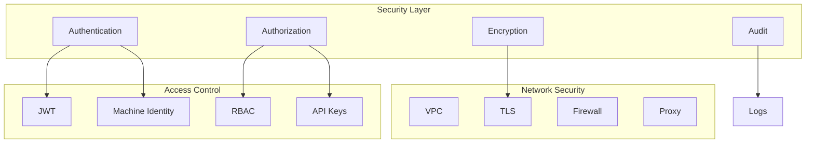

## Authentication

### JWT Authentication
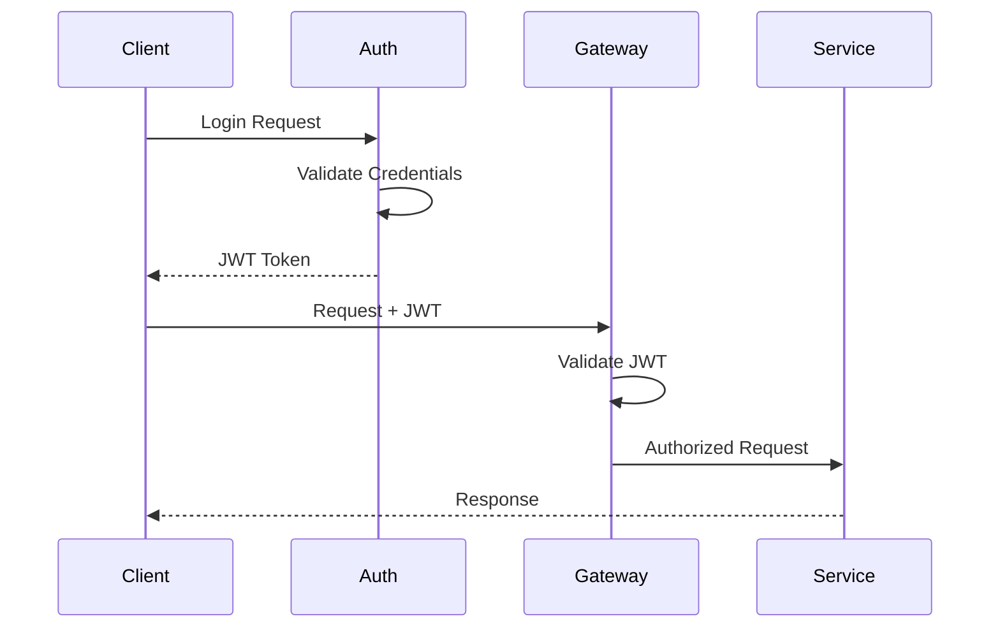

### Machine Identity
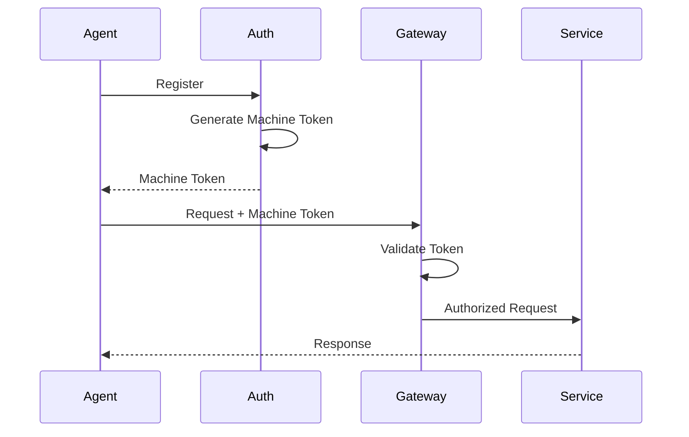

## Authorization

### RBAC Implementation
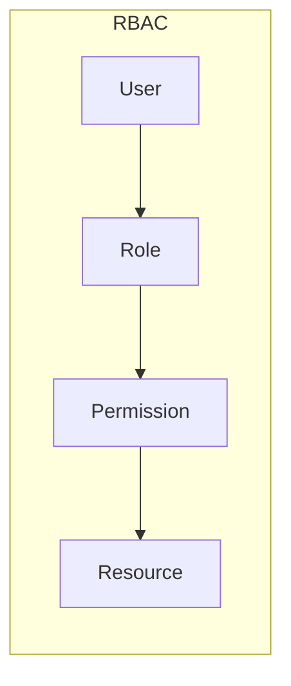

### Policy Enforcement
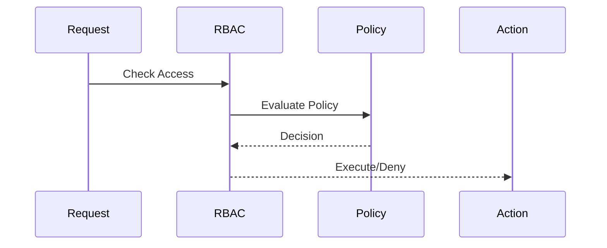

## Network Security

### VPC Architecture
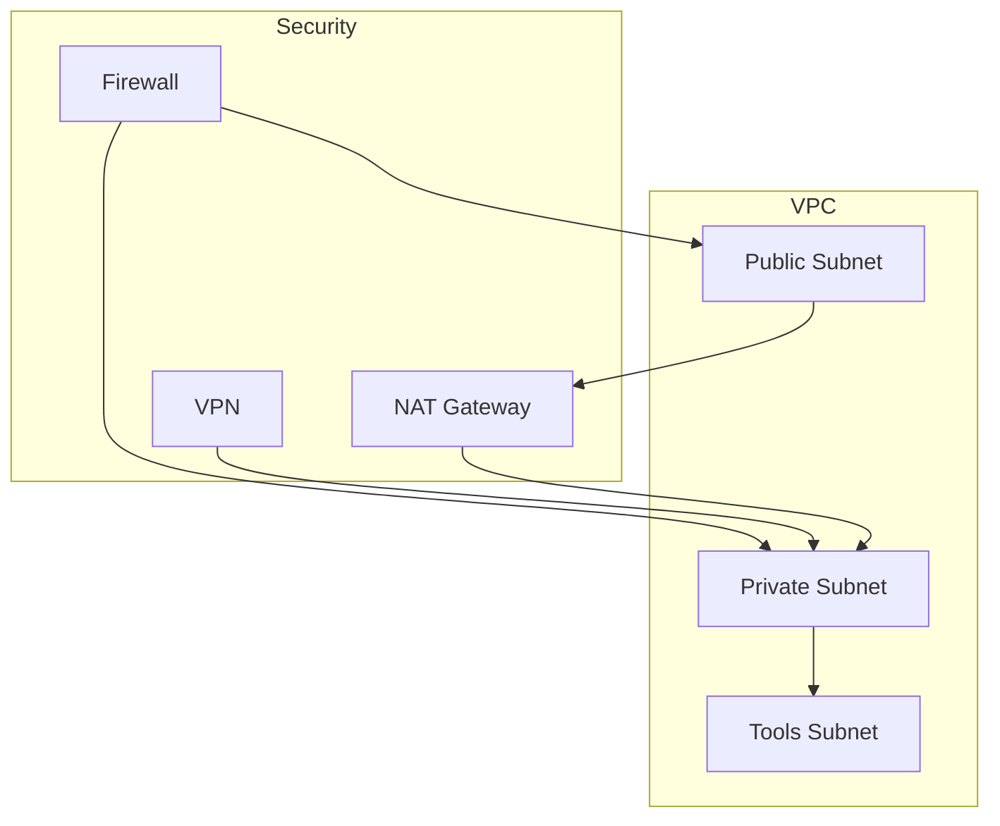

### TLS Configuration
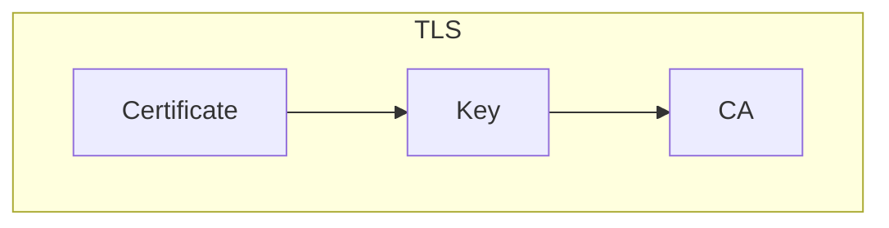

## Data Security

### Encryption at Rest
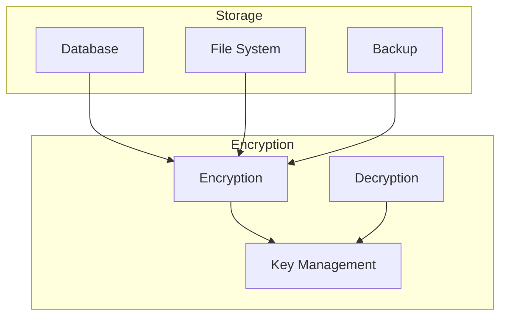

### Encryption in Transit
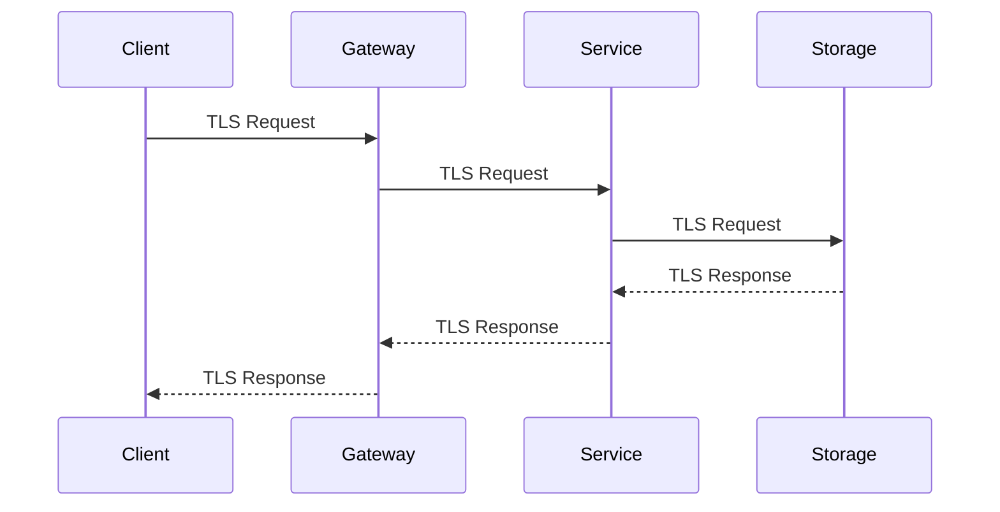

## API Security

### API Gateway Security
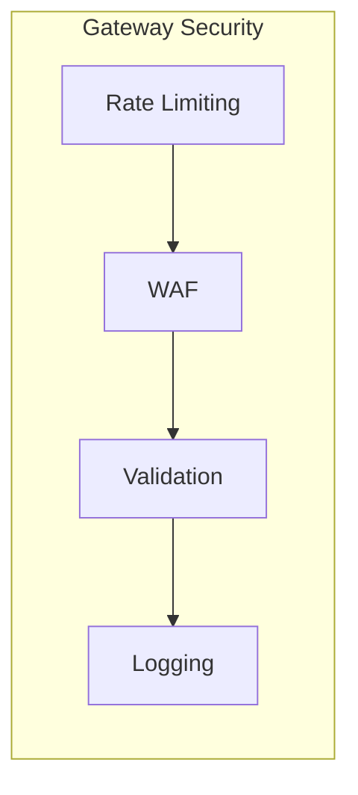

### API Key Management
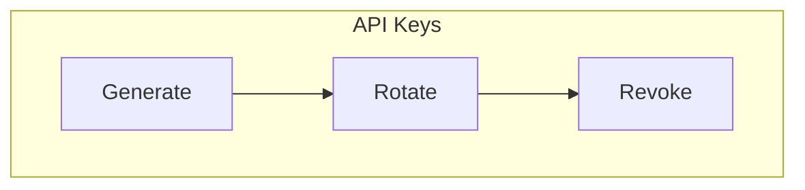

## Audit and Compliance

### Audit Trail
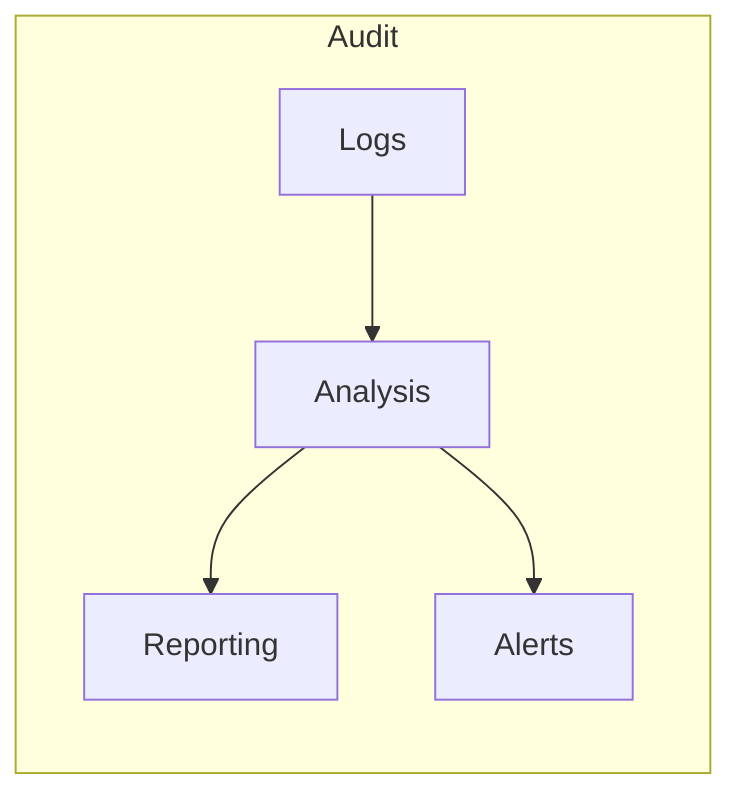

### Compliance Controls
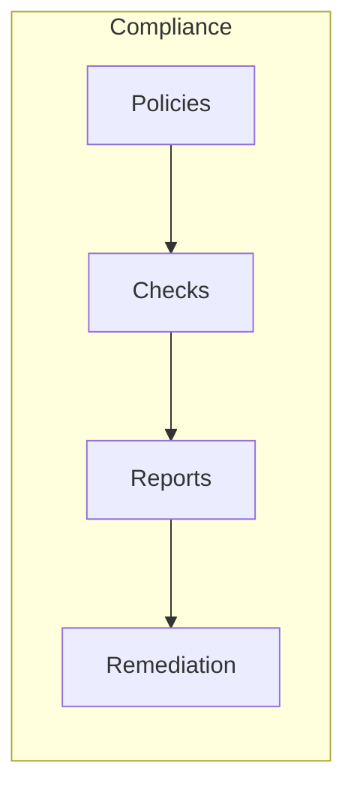

## Security Monitoring

### Security Monitoring
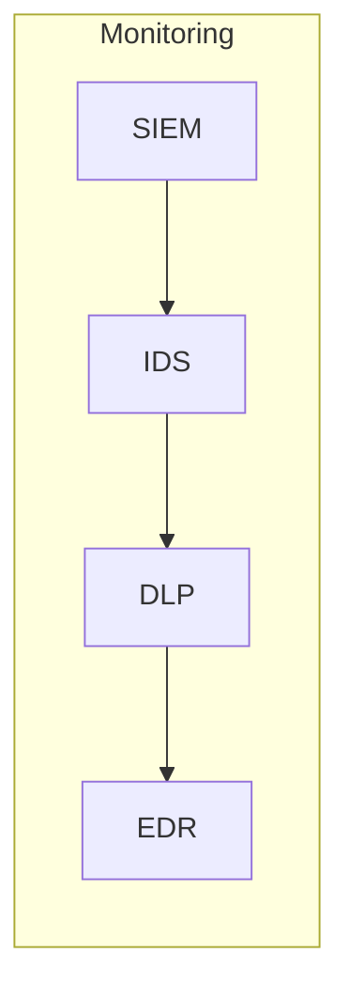

### Incident Response
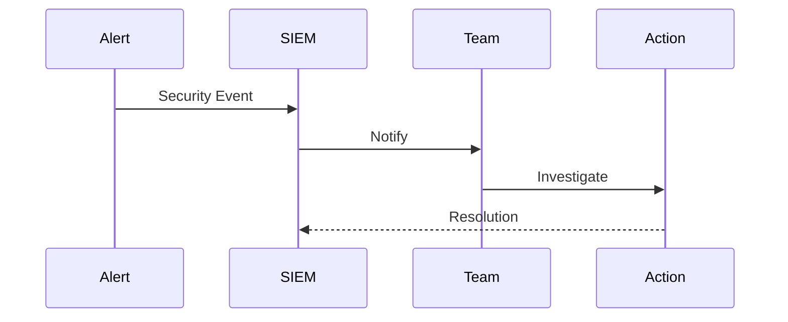

## Security Best Practices

### Access Control
- Principle of least privilege
- Role-based access control
- Regular access reviews
- MFA enforcement

### Data Protection
- Encryption at rest
- Encryption in transit
- Secure key management
- Regular backups

### Network Security
- VPC isolation
- Network segmentation
- Firewall rules
- VPN access

### Monitoring and Response
- Real-time monitoring
- Automated alerts
- Incident response
- Regular audits

## Next Steps

- [Deployment Guide](../deployment/)
- [Development Guide](../development/)
- [Operations Guide](../operations/)
- [Compliance Guide](../compliance/) 