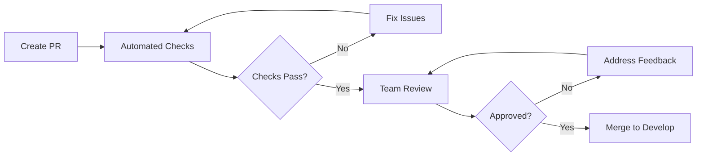

# Contributing Guidelines

Welcome to OpenFrame! We're excited to have you contribute to building the future of AI-powered MSP platforms. This guide covers our development workflow, code standards, and contribution process.

## Getting Started

### Prerequisites

Before contributing, ensure you have:

1. **Development Environment**: Complete the [Environment Setup](../setup/environment.md) guide
2. **Local Development**: Follow the [Local Development](../setup/local-development.md) guide
3. **Architecture Understanding**: Read the [Architecture Overview](../architecture/overview.md)
4. **Community Access**: Join our [OpenMSP Slack community](https://join.slack.com/t/openmsp/shared_invite/zt-36bl7mx0h-3~U2nFH6nqHqoTPXMaHEHA)

### Community Guidelines

> **Important**: We don't use GitHub Issues or GitHub Discussions. All development discussions, feature requests, and support happen in our OpenMSP Slack community.

**Primary Communication Channels:**
- **#general**: General discussion and announcements
- **#developers**: Development questions and coordination  
- **#architecture**: Architecture decisions and technical design
- **#integrations**: External tool integration discussions
- **#support**: User support and troubleshooting

## Development Workflow

### Branch Strategy

We use Git Flow with these branch types:

| Branch Type | Purpose | Naming Convention | Example |
|-------------|---------|------------------|---------|
| **main** | Production-ready code | `main` | `main` |
| **develop** | Integration branch for features | `develop` | `develop` |
| **feature** | New features or enhancements | `feature/description` | `feature/device-bulk-actions` |
| **bugfix** | Bug fixes | `bugfix/description` | `bugfix/device-status-sync` |
| **hotfix** | Critical production fixes | `hotfix/description` | `hotfix/security-patch` |
| **release** | Release preparation | `release/version` | `release/v1.2.0` |

### Contribution Process

#### 1. Planning and Discussion

Before writing code:

```bash
# 1. Join OpenMSP Slack and discuss your idea
# Visit: https://join.slack.com/t/openmsp/shared_invite/zt-36bl7mx0h-3~U2nFH6nqHqoTPXMaHEHA
# Post in #developers channel with:
# - Feature/fix description
# - Use case and rationale
# - Implementation approach

# 2. Get consensus from maintainers and community
# 3. Create tracking item in project management system
# 4. Assign yourself to prevent duplicate work
```

#### 2. Development Setup

```bash
# Fork the repository (if external contributor)
git clone https://github.com/your-username/openframe.git
cd openframe

# Or clone directly (if team member)
git clone https://github.com/openframe-org/openframe.git
cd openframe

# Create feature branch from develop
git checkout develop
git pull origin develop
git checkout -b feature/your-feature-name

# Set up development environment
./scripts/setup-dev.sh
```

#### 3. Development

```bash
# Make your changes following our coding standards
# Run tests continuously during development
mvn test -DwatchChanges=true  # Backend
npm run test -- --watch      # Frontend

# Commit changes with conventional commits
git add .
git commit -m "feat(devices): add bulk device action support

- Add bulk selection UI component
- Implement batch API operations  
- Add error handling for partial failures
- Update device list with new actions

Closes #123"
```

#### 4. Testing

```bash
# Run full test suite
mvn clean test                    # Backend unit tests
mvn integration-test             # Backend integration tests
cd openframe/services/openframe-frontend
npm run test                     # Frontend unit tests
npm run test:e2e                # Frontend E2E tests

# Check code coverage
mvn jacoco:report               # Backend coverage
npm run test:coverage           # Frontend coverage

# Verify code quality
mvn checkstyle:check            # Java code style
npm run lint                    # Frontend linting
```

#### 5. Pull Request

```bash
# Push your branch
git push origin feature/your-feature-name

# Create pull request with:
# 1. Clear title and description
# 2. Link to Slack discussion
# 3. Screenshots/videos for UI changes
# 4. Test coverage information
# 5. Breaking change documentation
```

## Code Style and Conventions

### Java Backend Standards

#### Code Formatting
```java
// Use Google Java Style Guide with these customizations:
// - 4 spaces for indentation (not 2)
// - Line length: 120 characters
// - Use spaces around operators

@Service
@Slf4j
public class DeviceService {
    
    private final DeviceRepository deviceRepository;
    private final EventPublisher eventPublisher;
    
    public DeviceService(DeviceRepository deviceRepository, 
                        EventPublisher eventPublisher) {
        this.deviceRepository = deviceRepository;
        this.eventPublisher = eventPublisher;
    }
    
    @Transactional
    public Device createDevice(CreateDeviceRequest request) {
        log.debug("Creating device with hostname: {}", request.getHostname());
        
        Device device = Device.builder()
            .hostname(request.getHostname())
            .organizationId(request.getOrganizationId())
            .status(DeviceStatus.ACTIVE)
            .createdAt(Instant.now())
            .build();
            
        Device savedDevice = deviceRepository.save(device);
        eventPublisher.publishEvent(new DeviceCreatedEvent(savedDevice));
        
        log.info("Device created successfully with ID: {}", savedDevice.getId());
        return savedDevice;
    }
}
```

#### Naming Conventions
```java
// Classes: PascalCase
public class DeviceController { }

// Methods and variables: camelCase  
public Device findDeviceById(String deviceId) { }
private String organizationId;

// Constants: UPPER_SNAKE_CASE
public static final String DEFAULT_STATUS = "ACTIVE";

// Packages: lowercase with dots
com.openframe.api.service.device

// Test classes: [ClassName]Test
public class DeviceServiceTest { }
```

#### Documentation Standards
```java
/**
 * Service for managing device lifecycle operations.
 * 
 * <p>This service provides methods for creating, updating, and managing
 * devices within organizations. All operations are audited and events
 * are published for downstream processing.
 * 
 * @author OpenFrame Team
 * @since 1.0.0
 */
@Service
public class DeviceService {
    
    /**
     * Creates a new device in the specified organization.
     * 
     * @param request the device creation request containing hostname and organization
     * @return the created device with generated ID and timestamps
     * @throws OrganizationNotFoundException if the organization doesn't exist
     * @throws DuplicateHostnameException if hostname already exists in organization
     */
    public Device createDevice(CreateDeviceRequest request) {
        // Implementation
    }
}
```

### TypeScript Frontend Standards

#### Code Formatting
```typescript
// Use Prettier with these settings:
// - 2 spaces for indentation
// - Single quotes
// - Trailing commas
// - Line length: 100 characters

interface Device {
  id: string;
  hostname: string;
  status: DeviceStatus;
  organizationId: string;
  createdAt: Date;
}

// Use composition API with <script setup>
<script setup lang="ts">
import { ref, computed, onMounted } from 'vue';
import type { Device } from '@/types/device';

const devices = ref<Device[]>([]);
const loading = ref(false);
const searchQuery = ref('');

const filteredDevices = computed(() =>
  devices.value.filter(device =>
    device.hostname.toLowerCase().includes(searchQuery.value.toLowerCase())
  )
);

onMounted(async () => {
  loading.value = true;
  try {
    devices.value = await deviceApi.getDevices();
  } catch (error) {
    console.error('Failed to load devices:', error);
  } finally {
    loading.value = false;
  }
});
</script>
```

#### Component Structure
```vue
<template>
  <div class="device-list">
    <SearchInput 
      v-model="searchQuery" 
      placeholder="Search devices..." 
      data-testid="device-search"
    />
    
    <div 
      v-if="loading" 
      class="loading-spinner"
      data-testid="loading-spinner"
    >
      Loading...
    </div>
    
    <DeviceCard
      v-for="device in filteredDevices"
      :key="device.id"
      :device="device"
      @device-click="handleDeviceClick"
      data-testid="device-card"
    />
  </div>
</template>

<script setup lang="ts">
// Script content here
</script>

<style scoped>
.device-list {
  @apply space-y-4;
}

.loading-spinner {
  @apply flex items-center justify-center py-8 text-gray-600;
}
</style>
```

#### Naming Conventions
```typescript
// Components: PascalCase
DeviceCard.vue
UserProfile.vue

// Composables: camelCase with "use" prefix
useDevices.ts
useAuthentication.ts

// Stores: camelCase
devicesStore.ts
userStore.ts

// Types: PascalCase
interface Device { }
enum DeviceStatus { }

// Variables and functions: camelCase
const deviceList = ref([]);
function handleDeviceClick() { }

// Constants: UPPER_SNAKE_CASE
const API_BASE_URL = 'https://api.openframe.ai';
```

### Git Commit Standards

#### Conventional Commits

We use [Conventional Commits](https://www.conventionalcommits.org/) for consistent commit messages:

```bash
# Format: <type>[optional scope]: <description>
# 
# [optional body]
#
# [optional footer(s)]

# Types:
feat:     # New feature
fix:      # Bug fix
docs:     # Documentation only changes
style:    # Code style changes (formatting, no logic changes)
refactor: # Code refactoring (no features or bug fixes)
test:     # Adding or updating tests
chore:    # Build process or auxiliary tool changes
perf:     # Performance improvements
ci:       # CI configuration changes
```

#### Commit Examples

```bash
# Feature commit
feat(devices): add bulk device actions

Add support for bulk operations on device list including:
- Select all/none functionality
- Bulk status updates
- Batch delete operations
- Progress indicators for long-running operations

Closes #156

# Bug fix commit
fix(auth): resolve token refresh race condition

- Add mutex to prevent multiple simultaneous refresh attempts
- Improve error handling when refresh token is expired
- Add retry logic with exponential backoff

Fixes #189

# Breaking change commit
feat(api)!: restructure device API response format

BREAKING CHANGE: Device API now returns devices in a paginated format
with cursor-based pagination instead of offset-based.

Migration guide:
- Replace `offset` parameter with `after` cursor
- Access devices via `data.devices.edges[].node` instead of `data.devices[]`
- Use `pageInfo.hasNextPage` instead of checking array length

Closes #145
```

### Code Review Guidelines

#### Pull Request Requirements

Every pull request must include:

1. **Clear Description**
```markdown
## Summary
Brief description of changes and rationale

## Changes Made  
- [ ] Added bulk device selection UI
- [ ] Implemented batch API operations
- [ ] Added error handling for partial failures
- [ ] Updated documentation

## Testing
- [ ] Unit tests added/updated (90% coverage maintained)
- [ ] Integration tests pass
- [ ] Manual testing completed
- [ ] E2E tests updated if needed

## Screenshots/Videos
(For UI changes)

## Breaking Changes
None / List any breaking changes

## Deployment Notes
Any special deployment requirements or database migrations
```

2. **Testing Evidence**
```bash
# Include test coverage reports
mvn jacoco:report
# Coverage: 92% (target: 90%)

npm run test:coverage
# Coverage: 89% (target: 85%)
```

3. **Code Quality Checks**
```bash
# All checks must pass
mvn checkstyle:check    # ✅ No violations
npm run lint           # ✅ No errors
npm run type-check     # ✅ No type errors
```

#### Review Process



#### Review Checklist

**Code Quality:**
- [ ] Code follows established patterns and conventions
- [ ] No code duplication or copy-paste errors
- [ ] Appropriate error handling and logging
- [ ] Security considerations addressed
- [ ] Performance implications considered

**Testing:**
- [ ] Adequate test coverage (unit and integration)
- [ ] Tests are meaningful and not just for coverage
- [ ] Edge cases and error conditions tested
- [ ] No flaky or unreliable tests

**Documentation:**
- [ ] Code is self-documenting with clear naming
- [ ] Complex logic has appropriate comments
- [ ] Public APIs have proper documentation
- [ ] Breaking changes are clearly documented

**Architecture:**
- [ ] Changes align with overall architecture
- [ ] Proper separation of concerns
- [ ] Dependencies are appropriate and minimal
- [ ] Database changes are backwards compatible

## Project Structure Standards

### Backend Module Organization
```
openframe/services/openframe-[service]/
├── src/main/java/com/openframe/[service]/
│   ├── config/              # Configuration classes
│   ├── controller/          # REST/GraphQL controllers
│   │   ├── rest/           # REST endpoints
│   │   └── graphql/        # GraphQL data fetchers
│   ├── service/            # Business logic services
│   │   ├── impl/          # Service implementations
│   │   └── processor/     # Event/data processors
│   ├── repository/         # Data access layer
│   │   ├── mongo/         # MongoDB repositories
│   │   └── cassandra/     # Cassandra repositories
│   ├── dto/               # Data transfer objects
│   │   ├── request/       # Request DTOs
│   │   └── response/      # Response DTOs
│   ├── mapper/            # Entity/DTO mappers
│   ├── exception/         # Custom exceptions
│   └── util/              # Utility classes
├── src/test/java/         # Test classes (mirror main structure)
└── src/main/resources/
    ├── application.yml    # Configuration
    ├── schema.graphqls    # GraphQL schema
    └── db/migration/      # Database migrations
```

### Frontend Module Organization
```
openframe/services/openframe-frontend/src/
├── app/                   # Application pages and features
│   ├── [feature]/        # Feature-specific directories
│   │   ├── components/   # Feature components
│   │   ├── hooks/        # Feature hooks/composables
│   │   ├── stores/       # Feature state management
│   │   ├── types/        # Feature type definitions
│   │   └── utils/        # Feature utilities
│   └── shared/           # Shared application components
├── components/            # Global reusable components
│   ├── ui/              # Basic UI components
│   └── layout/          # Layout components
├── lib/                  # Utilities and configurations
│   ├── api/             # API clients and types
│   ├── auth/            # Authentication utilities
│   └── utils/           # General utilities
├── stores/              # Global state management
├── types/               # Global type definitions
└── assets/              # Static assets
```

## Database Standards

### MongoDB Schema Design

```javascript
// Use consistent field naming and structure
{
  "_id": ObjectId("..."),
  "createdAt": ISODate("2024-01-01T00:00:00.000Z"),
  "updatedAt": ISODate("2024-01-01T00:00:00.000Z"),
  "version": NumberLong(1),
  
  // Business fields
  "hostname": "device-001",
  "organizationId": "org-123",
  "status": "ACTIVE",
  
  // Nested objects use camelCase
  "configuration": {
    "autoUpdate": true,
    "reportingInterval": 300
  },
  
  // Arrays of objects
  "installedSoftware": [
    {
      "name": "OpenFrame Agent",
      "version": "1.0.0",
      "installedAt": ISODate("2024-01-01T00:00:00.000Z")
    }
  ]
}
```

### Database Migration Guidelines

```java
// Use Mongock for MongoDB migrations
@ChangeLog(order = "001")
public class DatabaseChangelog001 {

    @ChangeSet(order = "001", id = "createIndexes", author = "openframe-team")
    public void createIndexes(MongoDatabase database) {
        MongoCollection<Document> devices = database.getCollection("devices");
        
        // Create compound index for common queries
        devices.createIndex(
            Indexes.compound(
                Indexes.ascending("organizationId"),
                Indexes.ascending("status")
            ),
            new IndexOptions()
                .name("idx_devices_org_status")
                .background(true)
        );
    }
    
    @ChangeSet(order = "002", id = "addTimestamps", author = "openframe-team")
    public void addTimestamps(MongoDatabase database) {
        MongoCollection<Document> devices = database.getCollection("devices");
        
        // Add timestamps to existing documents
        devices.updateMany(
            Filters.not(Filters.exists("createdAt")),
            Updates.combine(
                Updates.set("createdAt", new Date()),
                Updates.set("updatedAt", new Date())
            )
        );
    }
}
```

## API Design Standards

### GraphQL Schema Guidelines

```graphql
# Use consistent naming and documentation
"""
Represents a device managed by OpenFrame
"""
type Device {
  """Unique identifier for the device"""
  id: ID!
  
  """Human-readable hostname"""
  hostname: String!
  
  """Current operational status"""
  status: DeviceStatus!
  
  """Organization that owns this device"""
  organization: Organization!
  
  """Timestamp when device was created"""
  createdAt: DateTime!
  
  """Timestamp when device was last updated"""
  updatedAt: DateTime!
  
  """Timestamp when device was last seen online"""
  lastSeen: DateTime
}

"""Device operational status"""
enum DeviceStatus {
  """Device is online and responding"""
  ONLINE
  
  """Device is offline or not responding"""
  OFFLINE
  
  """Device is undergoing maintenance"""
  MAINTENANCE
  
  """Device has been decommissioned"""
  RETIRED
}

"""Input for creating a new device"""
input CreateDeviceInput {
  """Device hostname (must be unique within organization)"""
  hostname: String!
  
  """Organization ID that will own the device"""
  organizationId: ID!
  
  """Optional initial configuration"""
  configuration: DeviceConfigurationInput
}
```

### REST API Standards

```java
// Follow RESTful conventions with consistent response formats
@RestController
@RequestMapping("/api/v1/devices")
@Validated
public class DeviceController {

    @PostMapping
    @ResponseStatus(HttpStatus.CREATED)
    public ApiResponse<Device> createDevice(@Valid @RequestBody CreateDeviceRequest request) {
        Device device = deviceService.createDevice(request);
        return ApiResponse.success(device, "Device created successfully");
    }
    
    @GetMapping("/{id}")
    public ApiResponse<Device> getDevice(@PathVariable @NotBlank String id) {
        Device device = deviceService.findById(id);
        return ApiResponse.success(device);
    }
    
    @PutMapping("/{id}")
    public ApiResponse<Device> updateDevice(
            @PathVariable @NotBlank String id,
            @Valid @RequestBody UpdateDeviceRequest request) {
        Device device = deviceService.updateDevice(id, request);
        return ApiResponse.success(device, "Device updated successfully");
    }
    
    @DeleteMapping("/{id}")
    @ResponseStatus(HttpStatus.NO_CONTENT)
    public void deleteDevice(@PathVariable @NotBlank String id) {
        deviceService.deleteDevice(id);
    }
}
```

## Security Standards

### Authentication and Authorization

```java
// Use method-level security with clear role requirements
@PreAuthorize("hasRole('ADMIN') or (hasRole('TECHNICIAN') and @securityService.canAccessDevice(#deviceId, authentication.name))")
@GetMapping("/devices/{deviceId}")
public Device getDevice(@PathVariable String deviceId) {
    return deviceService.findById(deviceId);
}

// Validate all inputs
@PostMapping("/devices")
public Device createDevice(@Valid @RequestBody CreateDeviceRequest request) {
    // Validation happens automatically via @Valid
    // Additional business validation in service layer
    return deviceService.createDevice(request);
}
```

### Input Validation

```java
// Use comprehensive validation annotations
public class CreateDeviceRequest {
    
    @NotBlank(message = "Hostname is required")
    @Size(min = 3, max = 63, message = "Hostname must be between 3 and 63 characters")
    @Pattern(regexp = "^[a-zA-Z0-9][a-zA-Z0-9-]*[a-zA-Z0-9]$", 
             message = "Hostname must be a valid DNS name")
    private String hostname;
    
    @NotNull(message = "Organization ID is required")
    @Pattern(regexp = "^[a-zA-Z0-9-_]+$", message = "Invalid organization ID format")
    private String organizationId;
    
    @Valid
    private DeviceConfiguration configuration;
    
    // Getters and setters
}
```

## Performance Standards

### Database Query Optimization

```java
// Use efficient queries with proper indexing
@Repository
public class DeviceRepository {
    
    // Good: Use indexed fields in queries
    public List<Device> findActiveDevicesByOrganization(String organizationId) {
        Query query = new Query();
        query.addCriteria(
            Criteria.where("organizationId").is(organizationId)
                    .and("status").is("ACTIVE")
        );
        query.with(Sort.by(Sort.Direction.DESC, "lastSeen"));
        return mongoTemplate.find(query, Device.class);
    }
    
    // Good: Use aggregation for complex queries
    public List<DeviceStatusCount> getDeviceStatusCounts(String organizationId) {
        MatchOperation match = Aggregation.match(
            Criteria.where("organizationId").is(organizationId)
        );
        GroupOperation group = Aggregation.group("status")
            .count().as("count");
        ProjectionOperation project = Aggregation.project("count")
            .and("_id").as("status");
            
        Aggregation aggregation = Aggregation.newAggregation(match, group, project);
        return mongoTemplate.aggregate(aggregation, "devices", DeviceStatusCount.class)
                           .getMappedResults();
    }
}
```

### Caching Strategy

```java
// Use appropriate caching levels
@Service
@CacheConfig(cacheNames = "devices")
public class DeviceService {
    
    // Cache frequently accessed, rarely changed data
    @Cacheable(key = "#deviceId", unless = "#result == null")
    public Device findById(String deviceId) {
        return deviceRepository.findById(deviceId)
                              .orElseThrow(() -> new DeviceNotFoundException(deviceId));
    }
    
    // Evict cache on updates
    @CacheEvict(key = "#device.id")
    public Device updateDevice(Device device) {
        return deviceRepository.save(device);
    }
    
    // Evict multiple cache entries
    @CacheEvict(allEntries = true)
    public void refreshAllDevices() {
        // Bulk refresh operation
    }
}
```

## Release Process

### Version Management

We use Semantic Versioning (SemVer):

```
MAJOR.MINOR.PATCH-PRERELEASE+BUILD

Examples:
1.0.0         - Initial release
1.1.0         - New features (backward compatible)
1.1.1         - Bug fixes
2.0.0         - Breaking changes
2.0.0-beta.1  - Pre-release version
2.0.0+20240101 - Build metadata
```

### Release Checklist

#### Pre-Release
- [ ] All features merged to develop branch
- [ ] Full test suite passes (unit, integration, E2E)
- [ ] Security scan completed with no high-severity issues
- [ ] Performance benchmarks meet requirements
- [ ] Documentation updated
- [ ] Database migration scripts tested
- [ ] Deployment scripts validated

#### Release Preparation
- [ ] Create release branch from develop
- [ ] Update version numbers in all components
- [ ] Generate changelog from conventional commits
- [ ] Create release notes
- [ ] Tag release commit
- [ ] Build and test release artifacts

#### Post-Release
- [ ] Deploy to production environment
- [ ] Verify all services are healthy
- [ ] Monitor error rates and performance metrics
- [ ] Update documentation site
- [ ] Announce release in community channels
- [ ] Merge release branch back to main and develop

## Community Contribution

### First-Time Contributors

Welcome! Here's how to get started:

1. **Join the Community**
   - Join our [OpenMSP Slack](https://join.slack.com/t/openmsp/shared_invite/zt-36bl7mx0h-3~U2nFH6nqHqoTPXMaHEHA)
   - Introduce yourself in #general
   - Ask questions in #support

2. **Find Your First Issue**
   - Look for `good-first-issue` labels in Slack discussions
   - Start with documentation improvements
   - Fix small bugs or add unit tests

3. **Get Mentorship**
   - Ask for a mentor in the #developers channel
   - Pair program with experienced contributors
   - Join weekly office hours sessions

### Ongoing Contributors

As you become more involved:

- **Code Reviews**: Help review other contributors' pull requests
- **Mentorship**: Guide new contributors
- **Feature Design**: Participate in architecture discussions
- **Community Building**: Help others in support channels

### Recognition

We recognize contributions through:

- **Contributor Hall of Fame**: Featured on project website
- **Community Shout-outs**: Recognition in Slack and release notes
- **Conference Opportunities**: Speaking opportunities at events
- **Early Access**: Beta features and exclusive discussions

## Support

### Getting Help

1. **Slack Community**: Post in appropriate channel
2. **Documentation**: Check existing guides and references
3. **Office Hours**: Join weekly Q&A sessions
4. **Pair Programming**: Request help from experienced contributors

### Providing Help

1. **Answer Questions**: Help others in support channels
2. **Code Reviews**: Review pull requests constructively  
3. **Documentation**: Improve guides based on your experience
4. **Bug Reports**: Report issues with clear reproduction steps

---

Ready to contribute? Start by joining our [OpenMSP Slack community](https://join.slack.com/t/openmsp/shared_invite/zt-36bl7mx0h-3~U2nFH6nqHqoTPXMaHEHA) and saying hello in #developers!

For questions about these guidelines, reach out in the #developers channel.