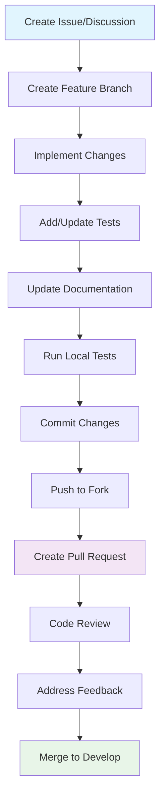

# Contributing Guidelines

Welcome to OpenFrame! This guide outlines our development workflow, coding standards, and best practices for contributing to the project. We're excited to have you join our community of developers building the future of MSP automation.

## Getting Started

### Prerequisites

Before contributing, ensure you have:

- ✅ Completed the [Environment Setup](../setup/environment.md)
- ✅ Successfully run the [Local Development](../setup/local-development.md) guide
- ✅ Read the [Architecture Overview](../architecture/overview.md)
- ✅ Joined the [OpenMSP Slack community](https://join.slack.com/t/openmsp/shared_invite/zt-36bl7mx0h-3~U2nFH6nqHqoTPXMaHEHA)

### Ways to Contribute

| Contribution Type | Description | Getting Started |
|------------------|-------------|-----------------|
| **🐛 Bug Reports** | Report issues and bugs | [Create GitHub Issue](https://github.com/flamingo-stack/openframe-oss-tenant/issues/new) |
| **✨ Feature Requests** | Suggest new features | Join #feature-requests in Slack |
| **📖 Documentation** | Improve guides and docs | Edit files in `docs/` directory |
| **💻 Code Contributions** | Bug fixes and features | Follow development workflow below |
| **🧪 Testing** | Write and improve tests | See [Testing Overview](../testing/overview.md) |
| **🔧 DevOps** | CI/CD and infrastructure | Improve scripts and workflows |

---

## Development Workflow

### 1. Branch Strategy

OpenFrame uses **Git Flow** with these branch types:

```text
main                 ← Production-ready code
  ├── develop       ← Integration branch for features
  ├── feature/*     ← New features and enhancements
  ├── bugfix/*      ← Bug fixes for develop branch
  ├── release/*     ← Release preparation
  └── hotfix/*      ← Critical production fixes
```

### 2. Development Process



### 3. Step-by-Step Workflow

#### Step 1: Fork and Clone

```bash
# Fork the repository on GitHub
# Then clone your fork
git clone https://github.com/YOUR_USERNAME/openframe-oss-tenant.git
cd openframe-oss-tenant

# Add upstream remote
git remote add upstream https://github.com/flamingo-stack/openframe-oss-tenant.git

# Verify remotes
git remote -v
```

#### Step 2: Create Feature Branch

```bash
# Update your develop branch
git checkout develop
git pull upstream develop

# Create feature branch
git checkout -b feature/device-bulk-operations

# Or for bug fixes
git checkout -b bugfix/device-status-display
```

**Branch Naming Convention:**
- `feature/descriptive-name` - New features
- `bugfix/issue-description` - Bug fixes
- `docs/section-name` - Documentation updates
- `refactor/component-name` - Code refactoring
- `test/component-name` - Test improvements

#### Step 3: Make Changes

Follow our coding standards and make your changes:

```bash
# Make changes to code
vi src/main/java/com/openframe/api/service/DeviceService.java

# Add tests for your changes
vi src/test/java/com/openframe/api/service/DeviceServiceTest.java

# Update documentation if needed
vi docs/development/api/device-management.md
```

#### Step 4: Test Your Changes

```bash
# Run unit tests
mvn test

# Run integration tests
mvn test -Dspring.profiles.active=integration

# Run frontend tests (if applicable)
cd openframe/services/openframe-frontend
npm test

# Run all tests
./scripts/test-all.sh
```

#### Step 5: Commit Changes

```bash
# Stage changes
git add .

# Commit with descriptive message
git commit -m "feat: add bulk device operations API

- Add BulkDeviceOperationRequest DTO
- Implement bulk status update endpoint
- Add validation for bulk operations
- Include unit tests for new functionality

Closes #123"
```

#### Step 6: Push and Create PR

```bash
# Push to your fork
git push origin feature/device-bulk-operations

# Create pull request on GitHub
# Use the PR template and fill out all sections
```

---

## Commit Message Format

### Conventional Commits

OpenFrame uses [Conventional Commits](https://www.conventionalcommits.org/) for clear and automated release management:

```text
<type>[optional scope]: <description>

[optional body]

[optional footer(s)]
```

### Commit Types

| Type | Description | Example |
|------|-------------|---------|
| **feat** | New feature | `feat(api): add device bulk operations` |
| **fix** | Bug fix | `fix(frontend): resolve device status display issue` |
| **docs** | Documentation | `docs(setup): update environment requirements` |
| **style** | Code style/formatting | `style(service): fix code formatting` |
| **refactor** | Code refactoring | `refactor(auth): simplify JWT token handling` |
| **test** | Add/update tests | `test(device): add integration tests for device service` |
| **chore** | Build/maintenance | `chore(deps): update Spring Boot to 3.2.0` |
| **ci** | CI/CD changes | `ci(github): add automated security scanning` |

### Commit Message Examples

#### Good Commit Messages

```bash
feat(device): add bulk status update API

- Implement POST /api/devices/bulk/status endpoint
- Add BulkStatusUpdateRequest DTO with validation
- Support updating multiple devices in single request
- Include comprehensive error handling

Closes #123

fix(auth): resolve JWT token expiration handling

- Fix token refresh logic in AuthService
- Update expiration time validation
- Add proper error messages for expired tokens
- Ensure secure token storage

Fixes #456

docs(contributing): add PR template and guidelines

- Create comprehensive pull request template
- Document code review process
- Add examples of good commit messages
- Update development workflow diagrams
```

#### Bad Commit Messages

```bash
# Too vague
fix: bug

# No description
update code

# Missing type
add new feature for devices

# Wrong type
feat: fix typo in README
```

### Commit Message Body

For complex changes, include a detailed body:

```text
feat(stream): implement real-time device metrics processing

This change adds real-time processing of device metrics through
Kafka streams. The implementation includes:

- New StreamProcessor for device metrics
- Configurable aggregation windows (1m, 5m, 15m, 1h)
- Support for custom metric types
- Memory-efficient processing with windowed operations

The processor handles up to 10,000 metrics per second with
automatic back-pressure handling.

Breaking Change: The DeviceMetric model now requires a timestamp
field. Existing metrics without timestamps will be rejected.

Closes #789
BREAKING CHANGE: DeviceMetric requires timestamp field
```

---

## Code Style and Standards

### Java Code Standards

#### Code Formatting

OpenFrame uses a consistent Java code style:

```java
// Class naming: PascalCase
public class DeviceManagementService {
    
    // Constants: SCREAMING_SNAKE_CASE
    private static final String DEFAULT_DEVICE_TYPE = "UNKNOWN";
    private static final Logger logger = LoggerFactory.getLogger(DeviceManagementService.class);
    
    // Fields: camelCase
    private final DeviceRepository deviceRepository;
    private final EventPublisher eventPublisher;
    
    // Constructor injection (preferred)
    public DeviceManagementService(DeviceRepository deviceRepository, 
                                 EventPublisher eventPublisher) {
        this.deviceRepository = deviceRepository;
        this.eventPublisher = eventPublisher;
    }
    
    // Method naming: camelCase, descriptive
    public Optional<Device> findDeviceByHostname(String hostname) {
        // Validate input
        if (hostname == null || hostname.trim().isEmpty()) {
            throw new IllegalArgumentException("Hostname cannot be null or empty");
        }
        
        // Business logic
        return deviceRepository.findByHostname(hostname.toLowerCase());
    }
    
    // Use builder pattern for complex objects
    public Device createDevice(CreateDeviceRequest request) {
        Device device = Device.builder()
            .name(request.getName())
            .type(request.getType())
            .organizationId(request.getOrganizationId())
            .status(DeviceStatus.PENDING)
            .createdAt(Instant.now())
            .build();
            
        Device savedDevice = deviceRepository.save(device);
        
        // Publish event
        eventPublisher.publish(new DeviceCreatedEvent(savedDevice));
        
        return savedDevice;
    }
}
```

#### Documentation Standards

```java
/**
 * Service for managing device lifecycle operations.
 * 
 * <p>This service handles device creation, updates, status management,
 * and integration with external monitoring tools.
 * 
 * <p>All operations are transactional and publish appropriate events
 * for downstream processing.
 * 
 * @author OpenFrame Team
 * @since 1.0.0
 */
@Service
@Transactional
public class DeviceManagementService {
    
    /**
     * Creates a new device in the system.
     * 
     * <p>The device is initially created in {@link DeviceStatus#PENDING}
     * status and must be activated through the agent registration process.
     * 
     * @param request the device creation request containing required fields
     * @return the created device with generated ID and timestamps
     * @throws IllegalArgumentException if request validation fails
     * @throws OrganizationNotFoundException if organization doesn't exist
     * @see DeviceRegistrationService#activateDevice(String)
     */
    public Device createDevice(CreateDeviceRequest request) {
        // Implementation
    }
}
```

#### Exception Handling

```java
// Custom exceptions with meaningful names
public class DeviceNotFoundException extends RuntimeException {
    public DeviceNotFoundException(String deviceId) {
        super(String.format("Device with ID '%s' not found", deviceId));
    }
}

// Service-level exception handling
@Service
public class DeviceService {
    
    public Device getDevice(String deviceId) {
        return deviceRepository.findById(deviceId)
            .orElseThrow(() -> new DeviceNotFoundException(deviceId));
    }
    
    public Device updateDeviceStatus(String deviceId, DeviceStatus status) {
        try {
            Device device = getDevice(deviceId);
            device.setStatus(status);
            device.setUpdatedAt(Instant.now());
            
            return deviceRepository.save(device);
            
        } catch (DataAccessException e) {
            logger.error("Failed to update device status: deviceId={}, status={}", 
                deviceId, status, e);
            throw new DeviceUpdateException("Failed to update device status", e);
        }
    }
}
```

### TypeScript/Vue.js Standards

#### Component Structure

```vue
<template>
  <div class="device-list">
    <div class="device-list__header">
      <h2 class="device-list__title">{{ title }}</h2>
      <DeviceFilters 
        v-model="filters"
        @filter-changed="handleFilterChange"
      />
    </div>
    
    <div class="device-list__content">
      <DeviceCard
        v-for="device in filteredDevices"
        :key="device.id"
        :device="device"
        @click="handleDeviceClick"
      />
    </div>
  </div>
</template>

<script setup lang="ts">
import { ref, computed, onMounted } from 'vue'
import { useDevicesStore } from '@/stores/devices'
import DeviceCard from '@/components/DeviceCard.vue'
import DeviceFilters from '@/components/DeviceFilters.vue'
import type { Device, DeviceFilters as Filters } from '@/types/device'

// Props
interface Props {
  title?: string
  organizationId?: string
}

const props = withDefaults(defineProps<Props>(), {
  title: 'Devices',
  organizationId: undefined
})

// Emits
const emit = defineEmits<{
  'device-selected': [device: Device]
}>()

// Store
const devicesStore = useDevicesStore()

// State
const filters = ref<Filters>({
  status: 'all',
  type: 'all',
  search: ''
})

// Computed
const filteredDevices = computed(() => {
  return devicesStore.getFilteredDevices(filters.value, props.organizationId)
})

// Methods
const handleFilterChange = (newFilters: Filters): void => {
  filters.value = { ...newFilters }
}

const handleDeviceClick = (device: Device): void => {
  emit('device-selected', device)
}

// Lifecycle
onMounted(async () => {
  await devicesStore.fetchDevices(props.organizationId)
})
</script>

<style scoped>
.device-list {
  @apply space-y-4;
}

.device-list__header {
  @apply flex items-center justify-between;
}

.device-list__title {
  @apply text-2xl font-semibold text-gray-900 dark:text-white;
}

.device-list__content {
  @apply grid gap-4 sm:grid-cols-2 lg:grid-cols-3;
}
</style>
```

#### TypeScript Standards

```typescript
// Type definitions
export interface Device {
  readonly id: string
  name: string
  type: DeviceType
  status: DeviceStatus
  organizationId: string
  lastSeen?: Date
  metadata?: Record<string, unknown>
}

export type DeviceType = 'SERVER' | 'WORKSTATION' | 'MOBILE' | 'IOT'

export interface CreateDeviceRequest {
  name: string
  type: DeviceType
  organizationId: string
  hostname?: string
  ipAddress?: string
}

// Service implementation
export class DeviceApiService {
  private readonly httpClient: HttpClient

  constructor(httpClient: HttpClient) {
    this.httpClient = httpClient
  }

  async getDevices(organizationId?: string): Promise<Device[]> {
    const params = organizationId ? { organizationId } : {}
    
    try {
      const response = await this.httpClient.get<Device[]>('/api/devices', { params })
      return response.data
    } catch (error) {
      logger.error('Failed to fetch devices', { organizationId, error })
      throw new ApiError('Failed to fetch devices', error)
    }
  }

  async createDevice(request: CreateDeviceRequest): Promise<Device> {
    try {
      const response = await this.httpClient.post<Device>('/api/devices', request)
      return response.data
    } catch (error) {
      logger.error('Failed to create device', { request, error })
      throw new ApiError('Failed to create device', error)
    }
  }
}

// Pinia store
export const useDevicesStore = defineStore('devices', {
  state: (): DevicesState => ({
    devices: [],
    loading: false,
    error: null
  }),

  getters: {
    getDeviceById: (state) => (id: string): Device | undefined => {
      return state.devices.find(device => device.id === id)
    },

    getFilteredDevices: (state) => 
      (filters: DeviceFilters, organizationId?: string): Device[] => {
        let filtered = organizationId 
          ? state.devices.filter(device => device.organizationId === organizationId)
          : state.devices

        if (filters.status !== 'all') {
          filtered = filtered.filter(device => device.status === filters.status)
        }

        if (filters.search) {
          const search = filters.search.toLowerCase()
          filtered = filtered.filter(device =>
            device.name.toLowerCase().includes(search) ||
            device.type.toLowerCase().includes(search)
          )
        }

        return filtered
      }
  },

  actions: {
    async fetchDevices(organizationId?: string): Promise<void> {
      this.loading = true
      this.error = null

      try {
        const devices = await deviceApiService.getDevices(organizationId)
        this.devices = devices
      } catch (error) {
        this.error = error instanceof Error ? error.message : 'Unknown error'
        throw error
      } finally {
        this.loading = false
      }
    }
  }
})
```

### CSS/SCSS Standards

```scss
// Use BEM naming convention
.device-card {
  @apply p-4 bg-white dark:bg-gray-800 rounded-lg shadow-sm border border-gray-200 dark:border-gray-700;
  
  // Element
  &__header {
    @apply flex items-center justify-between mb-3;
  }
  
  &__title {
    @apply font-semibold text-gray-900 dark:text-white;
  }
  
  &__status {
    @apply px-2 py-1 text-xs font-medium rounded-full;
    
    // Modifier
    &--online {
      @apply bg-green-100 text-green-800 dark:bg-green-900 dark:text-green-200;
    }
    
    &--offline {
      @apply bg-red-100 text-red-800 dark:bg-red-900 dark:text-red-200;
    }
  }
  
  // State
  &:hover {
    @apply shadow-md border-blue-200 dark:border-blue-700;
  }
  
  &--selected {
    @apply ring-2 ring-blue-500 border-blue-500;
  }
}
```

---

## Pull Request Process

### PR Template

When creating a pull request, use this template:

```markdown
## Description
Brief description of what this PR does.

## Type of Change
- [ ] Bug fix (non-breaking change which fixes an issue)
- [ ] New feature (non-breaking change which adds functionality)
- [ ] Breaking change (fix or feature that would cause existing functionality to not work as expected)
- [ ] Documentation update

## Changes Made
- Detailed list of changes
- Include any architectural decisions
- Mention any new dependencies

## Testing
- [ ] Unit tests pass
- [ ] Integration tests pass  
- [ ] E2E tests pass (if applicable)
- [ ] Manual testing completed

## Screenshots (if applicable)
Include before/after screenshots for UI changes.

## Related Issues
Closes #123
Related to #456

## Checklist
- [ ] My code follows the project's style guidelines
- [ ] I have performed a self-review of my own code
- [ ] I have commented my code, particularly in hard-to-understand areas
- [ ] I have made corresponding changes to the documentation
- [ ] My changes generate no new warnings
- [ ] I have added tests that prove my fix is effective or that my feature works
- [ ] New and existing unit tests pass locally with my changes
```

### Code Review Process

#### 1. Automated Checks

Before human review, automated checks must pass:

```yaml
# GitHub Actions checks
✅ Build (Maven compile)
✅ Unit Tests 
✅ Integration Tests
✅ Code Quality (SonarQube)
✅ Security Scan
✅ Documentation Build
```

#### 2. Review Assignment

- **Core Team**: Reviews architectural changes
- **Domain Experts**: Reviews domain-specific changes
- **Security Team**: Reviews security-related changes

#### 3. Review Criteria

Reviewers check for:

- **Functionality**: Does the code do what it's supposed to do?
- **Readability**: Is the code easy to understand?
- **Maintainability**: Will this be easy to modify in the future?
- **Performance**: Are there any obvious performance issues?
- **Security**: Are there any security vulnerabilities?
- **Testing**: Are there adequate tests?
- **Documentation**: Is documentation updated?

#### 4. Review Comments

Use constructive feedback:

```markdown
# Good feedback
Consider extracting this logic into a separate method to improve readability:

```java
public boolean isDeviceEligibleForUpdate(Device device) {
    return device.getStatus() == DeviceStatus.ONLINE 
        && device.getLastSeen().isAfter(Instant.now().minus(Duration.ofMinutes(5)))
        && !device.isMaintenanceMode();
}
```

# Instead of
This method is too long.
```

### Merge Requirements

PRs can only be merged when:

- ✅ All automated checks pass
- ✅ At least 2 approvals from code owners
- ✅ No requested changes outstanding
- ✅ Conflicts resolved and branch up-to-date
- ✅ Documentation updated (if applicable)

---

## Quality Standards

### Code Quality Metrics

| Metric | Target | Tool |
|--------|--------|------|
| **Test Coverage** | > 85% | JaCoCo |
| **Code Duplication** | < 3% | SonarQube |
| **Cyclomatic Complexity** | < 10 per method | SonarQube |
| **Maintainability Index** | > 20 | SonarQube |
| **Technical Debt** | < 1% | SonarQube |

### Static Analysis

#### SonarQube Integration

```xml
<!-- pom.xml -->
<plugin>
    <groupId>org.sonarsource.scanner.maven</groupId>
    <artifactId>sonar-maven-plugin</artifactId>
    <version>3.10.0.2594</version>
</plugin>
```

Run analysis locally:

```bash
# Analyze Java code
mvn clean test sonar:sonar \
  -Dsonar.projectKey=openframe \
  -Dsonar.host.url=http://localhost:9000

# Analyze frontend code
npm run lint
npm run type-check
```

#### Code Quality Rules

**Forbidden Patterns:**
- `System.out.println()` - Use proper logging
- `@Autowired` on fields - Use constructor injection
- Raw exception catching - Catch specific exceptions
- Magic numbers - Use named constants
- Hard-coded strings - Use configuration

**Required Patterns:**
- Null safety annotations (`@Nullable`, `@NonNull`)
- Input validation for public methods
- Proper exception handling and logging
- Unit tests for new functionality
- Documentation for public APIs

### Performance Standards

#### Response Time Targets

| Operation | Target | Measurement |
|-----------|--------|-------------|
| **API Responses** | < 200ms | 95th percentile |
| **Database Queries** | < 100ms | 95th percentile |
| **Page Load** | < 2 seconds | First Contentful Paint |
| **Frontend Components** | < 100ms | Render time |

#### Memory Usage

- **JVM Heap**: Monitor with `-XX:+UseG1GC -XX:MaxGCPauseMillis=200`
- **Frontend Bundle**: Keep main bundle < 500KB gzipped
- **Database Connections**: Use connection pooling

---

## Documentation Standards

### Code Documentation

#### Java Documentation

```java
/**
 * Manages device lifecycle operations including creation, updates, and status management.
 * 
 * <p>This service integrates with external monitoring tools and maintains device
 * state consistency across the platform.
 * 
 * <h3>Usage Example:</h3>
 * <pre>{@code
 * DeviceService deviceService = // inject or create
 * 
 * CreateDeviceRequest request = CreateDeviceRequest.builder()
 *     .name("web-server-01")
 *     .type(DeviceType.SERVER)
 *     .organizationId(orgId)
 *     .build();
 *     
 * Device device = deviceService.createDevice(request);
 * }</pre>
 * 
 * @author OpenFrame Team
 * @since 1.0.0
 * @see Device
 * @see DeviceRepository
 */
@Service
@Transactional
public class DeviceService {
    
    /**
     * Creates a new device in the system.
     * 
     * <p>The device is created in {@link DeviceStatus#PENDING} status and requires
     * agent registration to become {@link DeviceStatus#ONLINE}.
     * 
     * @param request the device creation request, must not be null
     * @return the created device with assigned ID and timestamps
     * @throws IllegalArgumentException if the request is invalid
     * @throws OrganizationNotFoundException if the organization doesn't exist
     * @throws DeviceNameConflictException if a device with the same name exists
     */
    public Device createDevice(CreateDeviceRequest request) {
        // Implementation
    }
}
```

#### TypeScript Documentation

```typescript
/**
 * Service for managing device operations through the OpenFrame API.
 * 
 * Provides methods for CRUD operations on devices, including filtering,
 * status updates, and real-time monitoring capabilities.
 * 
 * @example
 * ```typescript
 * const deviceService = new DeviceApiService(httpClient)
 * 
 * // Get all devices
 * const devices = await deviceService.getDevices()
 * 
 * // Create new device
 * const newDevice = await deviceService.createDevice({
 *   name: 'web-server-01',
 *   type: 'SERVER',
 *   organizationId: 'org-123'
 * })
 * ```
 */
export class DeviceApiService {
    
    /**
     * Retrieves devices, optionally filtered by organization.
     * 
     * @param organizationId - Optional organization ID to filter by
     * @returns Promise resolving to array of devices
     * @throws {ApiError} When the request fails or server returns an error
     * 
     * @example
     * ```typescript
     * // Get all devices
     * const allDevices = await service.getDevices()
     * 
     * // Get devices for specific organization
     * const orgDevices = await service.getDevices('org-123')
     * ```
     */
    async getDevices(organizationId?: string): Promise<Device[]> {
        // Implementation
    }
}
```

### README and Guides

Each component should have clear documentation:

```markdown
# Device Management Service

## Overview
The Device Management Service handles device lifecycle operations in OpenFrame.

## Features
- Device creation and updates
- Status monitoring and management
- Integration with external monitoring tools
- Real-time event publishing

## Usage

### Creating a Device
```java
@Autowired
private DeviceService deviceService;

public void createServerDevice() {
    CreateDeviceRequest request = CreateDeviceRequest.builder()
        .name("web-server-01")
        .type(DeviceType.SERVER)
        .organizationId(organizationId)
        .build();
        
    Device device = deviceService.createDevice(request);
}
```

## Configuration

| Property | Default | Description |
|----------|---------|-------------|
| `device.max-per-organization` | 1000 | Maximum devices per organization |
| `device.status-timeout` | 300s | Device offline timeout |

## Events

The service publishes these events:

- `DeviceCreatedEvent` - When a device is created
- `DeviceStatusChangedEvent` - When device status changes
- `DeviceDeletedEvent` - When a device is deleted
```

---

## Security Guidelines

### Security Review Process

All code changes must consider security implications:

#### 1. Input Validation

```java
// Always validate user inputs
public Device createDevice(CreateDeviceRequest request) {
    // Validate required fields
    if (request.getName() == null || request.getName().trim().isEmpty()) {
        throw new ValidationException("Device name is required");
    }
    
    // Sanitize inputs
    String sanitizedName = SecurityUtils.sanitize(request.getName());
    
    // Validate organization access
    if (!organizationService.hasAccess(getCurrentUser(), request.getOrganizationId())) {
        throw new UnauthorizedException("Access denied to organization");
    }
    
    // Implementation continues...
}
```

#### 2. Authorization Checks

```java
@PreAuthorize("hasRole('TECHNICIAN') and @organizationService.hasAccess(authentication.name, #deviceId)")
public Device updateDevice(String deviceId, UpdateDeviceRequest request) {
    // Implementation
}
```

#### 3. Sensitive Data Handling

```java
// Never log sensitive data
public void authenticateDevice(DeviceAuthRequest request) {
    logger.debug("Authenticating device: {}", request.getDeviceId()); // OK
    logger.debug("Device token: {}", request.getToken()); // NEVER DO THIS
    
    // Use SecureString for sensitive data
    SecureString token = new SecureString(request.getToken());
    try {
        // Process token
    } finally {
        token.clear(); // Always clear sensitive data
    }
}
```

### Dependency Security

```bash
# Regular security audits
mvn org.owasp:dependency-check-maven:check

# Frontend security audit
npm audit

# Update dependencies regularly
mvn versions:use-latest-versions
npm update
```

---

## Release Process

### Version Strategy

OpenFrame uses [Semantic Versioning](https://semver.org/):

```text
MAJOR.MINOR.PATCH (e.g., 1.2.3)

MAJOR: Breaking changes
MINOR: New features (backward compatible)
PATCH: Bug fixes (backward compatible)
```

### Release Preparation

#### 1. Create Release Branch

```bash
# Create release branch from develop
git checkout develop
git pull origin develop
git checkout -b release/1.2.0

# Update version numbers
mvn versions:set -DnewVersion=1.2.0
npm version 1.2.0

# Commit version changes
git commit -am "chore(release): bump version to 1.2.0"
```

#### 2. Release Testing

```bash
# Run full test suite
./scripts/test-all.sh

# Integration testing
./scripts/integration-test.sh

# Performance testing
./scripts/performance-test.sh

# Security scanning
./scripts/security-scan.sh
```

#### 3. Release Documentation

```bash
# Generate changelog
npx standard-version --dry-run

# Update documentation
# - API documentation
# - Migration guides
# - Release notes
```

#### 4. Create Release PR

```bash
# Push release branch
git push origin release/1.2.0

# Create PR: release/1.2.0 → main
# Include release notes and testing results
```

---

## Getting Help

### Communication Channels

| Channel | Purpose | Response Time |
|---------|---------|---------------|
| **OpenMSP Slack #development** | General development questions | < 24 hours |
| **OpenMSP Slack #code-reviews** | Code review discussions | < 48 hours |
| **GitHub Issues** | Bug reports and feature requests | < 72 hours |
| **GitHub Discussions** | Architecture discussions | < 1 week |

### Code Review Help

Need help with your PR? Tag these people:

- **@core-team** - Architectural reviews
- **@security-team** - Security reviews  
- **@docs-team** - Documentation reviews

### Development Resources

- **Architecture Documentation**: [docs/development/architecture/](../architecture/)
- **API Documentation**: Generated from GraphQL schema
- **Testing Guide**: [docs/development/testing/](../testing/)
- **Deployment Guide**: [docs/deployment/](../../deployment/)

---

## Recognition

### Contributor Hall of Fame

We recognize significant contributors:

- **First-time Contributors**: Welcome badge and mention in release notes
- **Regular Contributors**: Contributor access and review privileges
- **Core Contributors**: Commit access and architectural decision participation

### Contribution Tracking

We track contributions through:

- GitHub contribution graphs
- Release note mentions
- Community recognition in Slack
- Speaking opportunities at conferences

---

## Summary

Contributing to OpenFrame involves:

1. **Understanding the codebase**: Read architecture docs and existing code
2. **Following the workflow**: Branch → Code → Test → PR → Review → Merge
3. **Maintaining quality**: Follow coding standards and write tests
4. **Collaborating effectively**: Use clear communication and constructive feedback
5. **Continuous learning**: Stay updated on best practices and platform changes

### Quick Reference

```bash
# Start contributing
git clone <fork-url>
git checkout -b feature/my-feature
# Make changes
mvn test
git commit -m "feat: my awesome feature"
git push origin feature/my-feature
# Create PR on GitHub

# Common tasks
mvn test                    # Run tests
./scripts/dev-start.sh     # Start development
./scripts/test-all.sh      # Full test suite
mvn sonar:sonar            # Code quality check
```

**Ready to contribute?** Join us on [OpenMSP Slack](https://join.slack.com/t/openmsp/shared_invite/zt-36bl7mx0h-3~U2nFH6nqHqoTPXMaHEHA) and introduce yourself in the #development channel!

---

Thank you for contributing to OpenFrame and helping build the future of MSP automation! 🚀