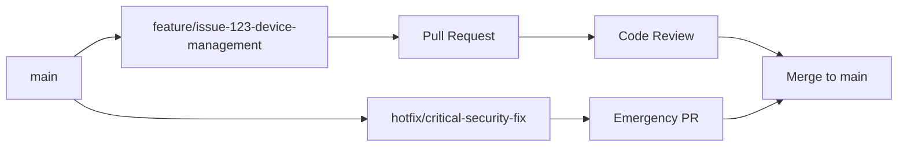

# Contributing Guidelines

Welcome to OpenFrame! We're excited to have you contribute to the future of MSP operations. This guide covers everything you need to know to contribute effectively to the OpenFrame project.

## Getting Started

### Before You Contribute

1. **Join the Community**: Connect with us on [OpenMSP Slack](https://join.slack.com/t/openmsp/shared_invite/zt-36bl7mx0h-3~U2nFH6nqHqoTPXMaHEHA)
2. **Read the Docs**: Familiarize yourself with [Architecture Overview](../architecture/overview.md)
3. **Set Up Environment**: Complete [Development Environment Setup](../setup/environment.md)
4. **Run Local Build**: Follow [Local Development Guide](../setup/local-development.md)

### Ways to Contribute

| Contribution Type | Examples | Getting Started |
|------------------|----------|-----------------|
| **🐛 Bug Fixes** | Fix issues, improve error handling | Browse open issues in Slack |
| **✨ Features** | New integrations, UI improvements | Discuss in #feature-requests |
| **📝 Documentation** | Guides, tutorials, API docs | Check docs gaps |
| **🧪 Testing** | Unit tests, integration tests | Review test coverage |
| **🔧 Infrastructure** | CI/CD, deployment, monitoring | Join #devops channel |

## Development Workflow

### Branch Strategy



#### Branch Naming Convention

| Type | Format | Example |
|------|--------|---------|
| **Feature** | `feature/issue-{number}-{description}` | `feature/issue-123-device-search` |
| **Bug Fix** | `bugfix/issue-{number}-{description}` | `bugfix/issue-456-auth-timeout` |
| **Hotfix** | `hotfix/{description}` | `hotfix/security-vulnerability` |
| **Documentation** | `docs/{description}` | `docs/update-api-guide` |

### Commit Message Format

We follow the [Conventional Commits](https://www.conventionalcommits.org/) specification:

```
<type>[optional scope]: <description>

[optional body]

[optional footer(s)]
```

#### Commit Types

| Type | Description | Example |
|------|-------------|---------|
| **feat** | New feature | `feat(devices): add device filtering by organization` |
| **fix** | Bug fix | `fix(auth): resolve token refresh loop` |
| **docs** | Documentation | `docs(api): update GraphQL schema documentation` |
| **style** | Code style changes | `style(frontend): apply consistent formatting` |
| **refactor** | Code refactoring | `refactor(services): extract common validation logic` |
| **test** | Adding tests | `test(devices): add integration tests for device service` |
| **chore** | Maintenance | `chore(deps): update Spring Boot to 3.3.1` |

#### Example Commit Messages

```bash
# Good commit messages
feat(chat): implement real-time message synchronization
fix(gateway): handle WebSocket connection timeouts properly
docs(setup): add Windows PowerShell installation guide
test(devices): add unit tests for device status transitions

# Bad commit messages
"Fixed stuff"
"WIP"
"Update code"
"Minor changes"
```

### Pull Request Process

#### 1. Create Feature Branch

```bash
# Start from main branch
git checkout main
git pull origin main

# Create feature branch
git checkout -b feature/issue-123-device-filtering

# Make changes and commit
git add .
git commit -m "feat(devices): add organization-based device filtering"

# Push to remote
git push origin feature/issue-123-device-filtering
```

#### 2. Pull Request Template

When creating a PR, use this template:

```markdown
## Description
Brief description of changes and motivation.

## Type of Change
- [ ] Bug fix (non-breaking change that fixes an issue)
- [ ] New feature (non-breaking change that adds functionality)
- [ ] Breaking change (fix or feature that would cause existing functionality to not work as expected)
- [ ] Documentation update

## Related Issues
Fixes #123

## Testing
- [ ] Unit tests pass
- [ ] Integration tests pass
- [ ] Manual testing completed
- [ ] Performance impact assessed

## Screenshots (if applicable)
Add screenshots for UI changes.

## Checklist
- [ ] Code follows project style guidelines
- [ ] Self-review completed
- [ ] Code is properly commented
- [ ] Documentation updated
- [ ] Tests added for new functionality
```

#### 3. Code Review Requirements

Every PR requires:
- ✅ **At least 1 approval** from a core maintainer
- ✅ **All checks pass** (tests, linting, security scan)
- ✅ **Conflicts resolved** with main branch
- ✅ **Documentation updated** if needed

## Code Style and Standards

### Java Code Style

We follow **Google Java Style** with some modifications:

#### Code Formatting

```java
// Good: Proper formatting and structure
@Service
@RequiredArgsConstructor
@Slf4j
public class DeviceService {
    
    private final DeviceRepository deviceRepository;
    private final EventPublisher eventPublisher;
    
    @Transactional
    public DeviceRegistrationResponse registerDevice(
            String organizationId, 
            DeviceRegistrationRequest request) {
        
        log.info("Registering device {} for organization {}", 
            request.getDeviceName(), organizationId);
        
        Device device = Device.builder()
            .name(request.getDeviceName())
            .organizationId(organizationId)
            .status(DeviceStatus.REGISTERED)
            .registeredAt(Instant.now())
            .build();
            
        Device savedDevice = deviceRepository.save(device);
        
        eventPublisher.publishEvent(
            DeviceRegisteredEvent.of(savedDevice));
            
        return DeviceRegistrationResponse.fromDevice(savedDevice);
    }
}
```

#### Naming Conventions

| Element | Convention | Example |
|---------|------------|---------|
| **Classes** | PascalCase | `DeviceService`, `ApiGateway` |
| **Methods** | camelCase | `registerDevice`, `findByOrganization` |
| **Variables** | camelCase | `deviceId`, `organizationName` |
| **Constants** | UPPER_SNAKE_CASE | `MAX_RETRY_COUNT`, `DEFAULT_TIMEOUT` |
| **Packages** | lowercase | `com.openframe.api.service` |

### TypeScript/Vue.js Code Style

#### Component Structure

```vue
<template>
  <div class="device-card">
    <div class="device-header">
      <h3 data-testid="device-name">{{ device.name }}</h3>
      <StatusBadge 
        :status="device.status" 
        data-testid="device-status"
      />
    </div>
    
    <div class="device-actions">
      <Button 
        @click="handleRestart"
        data-testid="restart-button"
      >
        Restart
      </Button>
    </div>
  </div>
</template>

<script setup lang="ts">
import { computed } from 'vue'
import type { Device } from '@/types/device'

interface Props {
  device: Device
}

interface Emits {
  (event: 'device-action', payload: { action: string; deviceId: string }): void
}

const props = defineProps<Props>()
const emit = defineEmits<Emits>()

const handleRestart = (): void => {
  emit('device-action', {
    action: 'restart',
    deviceId: props.device.id
  })
}
</script>

<style scoped>
.device-card {
  @apply border rounded-lg p-4 shadow-sm hover:shadow-md transition-shadow;
}

.device-header {
  @apply flex justify-between items-center mb-4;
}

.device-actions {
  @apply flex gap-2 justify-end;
}
</style>
```

#### TypeScript Standards

```typescript
// Use explicit types for public APIs
interface CreateDeviceRequest {
  readonly name: string
  readonly type: DeviceType
  readonly organizationId: string
  readonly metadata?: Record<string, unknown>
}

// Use proper error handling
class DeviceService {
  async createDevice(request: CreateDeviceRequest): Promise<Device> {
    try {
      const response = await this.apiClient.post<Device>('/devices', request)
      return response.data
    } catch (error) {
      if (error instanceof ApiError && error.status === 409) {
        throw new DeviceAlreadyExistsError(request.name)
      }
      throw new DeviceCreationError('Failed to create device', error)
    }
  }
}

// Use discriminated unions for type safety
type DeviceEvent = 
  | { type: 'REGISTERED'; deviceId: string; timestamp: Date }
  | { type: 'ONLINE'; deviceId: string; ipAddress: string }
  | { type: 'OFFLINE'; deviceId: string; reason: string }
```

### Database and API Design

#### GraphQL Schema

```graphql
# Use clear, descriptive types
type Device {
  id: ID!
  name: String!
  status: DeviceStatus!
  organization: Organization!
  agents: [InstalledAgent!]!
  createdAt: DateTime!
  updatedAt: DateTime!
}

enum DeviceStatus {
  REGISTERED
  ONLINE
  OFFLINE
  MAINTENANCE
  DECOMMISSIONED
}

# Use connection pattern for pagination
type DeviceConnection {
  edges: [DeviceEdge!]!
  pageInfo: PageInfo!
  totalCount: Int!
}
```

#### REST API Design

```java
// Use consistent HTTP methods and status codes
@RestController
@RequestMapping("/api/v1/devices")
@RequiredArgsConstructor
public class DeviceController {
    
    @PostMapping
    @ResponseStatus(HttpStatus.CREATED)
    public DeviceResponse createDevice(@Valid @RequestBody CreateDeviceRequest request) {
        // Implementation
    }
    
    @GetMapping("/{deviceId}")
    public DeviceResponse getDevice(@PathVariable String deviceId) {
        // Implementation
    }
    
    @PatchMapping("/{deviceId}")
    public DeviceResponse updateDevice(
            @PathVariable String deviceId,
            @Valid @RequestBody UpdateDeviceRequest request) {
        // Implementation
    }
    
    @DeleteMapping("/{deviceId}")
    @ResponseStatus(HttpStatus.NO_CONTENT)
    public void deleteDevice(@PathVariable String deviceId) {
        // Implementation
    }
}
```

## Testing Requirements

### Test Coverage Standards

- **Minimum 80% line coverage** for new code
- **All public methods** must have unit tests
- **Integration tests** for service boundaries
- **E2E tests** for critical user flows

### Writing Good Tests

#### Unit Test Example

```java
@ExtendWith(MockitoExtension.class)
class DeviceServiceTest {
    
    @Mock private DeviceRepository repository;
    @Mock private EventPublisher eventPublisher;
    @InjectMocks private DeviceService deviceService;
    
    @Test
    @DisplayName("Should register device and publish event")
    void shouldRegisterDeviceSuccessfully() {
        // Given
        String organizationId = "org-123";
        DeviceRegistrationRequest request = DeviceRegistrationRequest.builder()
            .deviceName("Test Device")
            .build();
            
        Device savedDevice = Device.builder()
            .id("device-456")
            .name("Test Device")
            .organizationId(organizationId)
            .status(DeviceStatus.REGISTERED)
            .build();
            
        when(repository.save(any(Device.class))).thenReturn(savedDevice);
        
        // When
        DeviceRegistrationResponse response = deviceService.registerDevice(
            organizationId, request);
        
        // Then
        assertThat(response.getDeviceId()).isEqualTo("device-456");
        assertThat(response.getStatus()).isEqualTo(DeviceStatus.REGISTERED);
        
        verify(repository).save(argThat(device -> 
            device.getName().equals("Test Device") &&
            device.getOrganizationId().equals(organizationId)
        ));
        
        verify(eventPublisher).publishEvent(any(DeviceRegisteredEvent.class));
    }
}
```

### Running Tests Before PR

```bash
# Run all tests
mvn clean test

# Check test coverage
mvn clean test jacoco:report
open target/site/jacoco/index.html

# Run specific test categories
mvn test -Dtest="*UnitTest"
mvn test -Dtest="*IntegrationTest"

# Frontend tests
cd openframe/services/openframe-frontend
npm run test
npm run test:coverage
```

## Documentation Standards

### Code Documentation

#### Java Documentation

```java
/**
 * Service for managing device lifecycle operations.
 * 
 * <p>This service handles device registration, status updates, and 
 * integration with external monitoring tools. All operations are 
 * organization-scoped for multi-tenant isolation.
 * 
 * @author OpenFrame Team
 * @since 1.0.0
 */
@Service
public class DeviceService {
    
    /**
     * Registers a new device for the specified organization.
     * 
     * @param organizationId the organization ID (must not be null)
     * @param request the device registration details (must not be null)
     * @return device registration response with assigned device ID
     * @throws IllegalArgumentException if organizationId or request is null
     * @throws DeviceAlreadyExistsException if device name already exists
     */
    @Transactional
    public DeviceRegistrationResponse registerDevice(
            @NonNull String organizationId,
            @NonNull DeviceRegistrationRequest request) {
        // Implementation
    }
}
```

#### TypeScript Documentation

```typescript
/**
 * Composable for managing device operations and state.
 * 
 * Provides reactive device data, loading states, and action methods
 * for device management operations. Automatically handles error states
 * and cache invalidation.
 * 
 * @example
 * ```typescript
 * const { devices, loading, error, fetchDevices } = useDevices()
 * 
 * onMounted(async () => {
 *   await fetchDevices()
 * })
 * ```
 */
export function useDevices() {
  const devices = ref<Device[]>([])
  const loading = ref(false)
  const error = ref<string | null>(null)
  
  /**
   * Fetches devices for the current organization.
   * 
   * @param filters - Optional filters to apply to device query
   * @returns Promise that resolves when fetch completes
   */
  const fetchDevices = async (filters?: DeviceFilters): Promise<void> => {
    // Implementation
  }
  
  return {
    devices: readonly(devices),
    loading: readonly(loading),
    error: readonly(error),
    fetchDevices
  }
}
```

### API Documentation

All REST endpoints must include OpenAPI documentation:

```java
@RestController
@Tag(name = "Devices", description = "Device management operations")
public class DeviceController {
    
    @Operation(
        summary = "Register new device",
        description = "Registers a new device for monitoring and management"
    )
    @ApiResponses({
        @ApiResponse(
            responseCode = "201",
            description = "Device registered successfully",
            content = @Content(schema = @Schema(implementation = DeviceResponse.class))
        ),
        @ApiResponse(
            responseCode = "400",
            description = "Invalid request data",
            content = @Content(schema = @Schema(implementation = ErrorResponse.class))
        ),
        @ApiResponse(
            responseCode = "409",
            description = "Device already exists",
            content = @Content(schema = @Schema(implementation = ErrorResponse.class))
        )
    })
    @PostMapping
    public DeviceResponse createDevice(
            @Parameter(description = "Device registration details")
            @Valid @RequestBody CreateDeviceRequest request) {
        // Implementation
    }
}
```

## Review Process

### Code Review Checklist

#### Functionality
- [ ] Code solves the stated problem
- [ ] Edge cases are handled properly
- [ ] Error handling is comprehensive
- [ ] Performance considerations addressed

#### Code Quality
- [ ] Code is readable and maintainable
- [ ] Functions are single-purpose and focused
- [ ] Magic numbers and strings are avoided
- [ ] Proper abstractions are used

#### Testing
- [ ] Unit tests cover new functionality
- [ ] Integration tests verify service boundaries
- [ ] Test names are descriptive
- [ ] Test coverage meets requirements

#### Security
- [ ] Input validation is implemented
- [ ] SQL injection prevention
- [ ] Authentication/authorization checked
- [ ] Sensitive data handling

#### Documentation
- [ ] Code is self-documenting
- [ ] Complex logic has comments
- [ ] API documentation updated
- [ ] README updated if needed

### Review Response Guidelines

#### As a Contributor

- **Be responsive**: Address feedback promptly
- **Ask questions**: Clarify unclear feedback
- **Learn from feedback**: Use reviews as learning opportunities
- **Be gracious**: Thank reviewers for their time

#### As a Reviewer

- **Be constructive**: Suggest improvements, not just problems
- **Be specific**: Point to exact lines and provide examples
- **Be respectful**: Focus on code, not the person
- **Be timely**: Review PRs within 24 hours

### Example Review Comments

#### Good Review Comments

```
✅ Consider using Optional.ofNullable() here to handle potential null values more elegantly.

✅ This method is doing too much. Consider extracting the validation logic into a separate method for better testability.

✅ Great use of the builder pattern! This makes the code much more readable.

✅ Add a unit test for this edge case where the device name contains special characters.
```

#### Poor Review Comments

```
❌ This is wrong.

❌ Bad code.

❌ I don't like this approach.

❌ Change this.
```

## Getting Help

### Community Support

- **OpenMSP Slack**: [Join our community](https://join.slack.com/t/openmsp/shared_invite/zt-36bl7mx0h-3~U2nFH6nqHqoTPXMaHEHA)
- **Channels to Follow**:
  - `#general` - General discussion
  - `#development` - Development questions
  - `#feature-requests` - New feature discussions
  - `#help-wanted` - Find contribution opportunities

### Contribution Recognition

Contributors are recognized through:
- **GitHub Contributor Graph**: Automatic recognition
- **Release Notes**: Contributors credited in releases
- **Hall of Fame**: Top contributors highlighted
- **Swag**: OpenFrame swag for significant contributions

## Licensing

By contributing to OpenFrame, you agree that your contributions will be licensed under the same license as the project. Make sure you have the right to submit the code you're contributing.

---

**Ready to contribute?** 🚀 

1. **Join our Slack**: Get connected with the community
2. **Find an issue**: Look for good first issues or discuss new ideas
3. **Start coding**: Follow this guide and create your first PR
4. **Ask questions**: We're here to help you succeed

Thank you for helping build the future of MSP operations! 💪