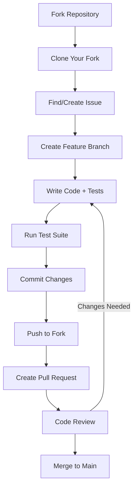
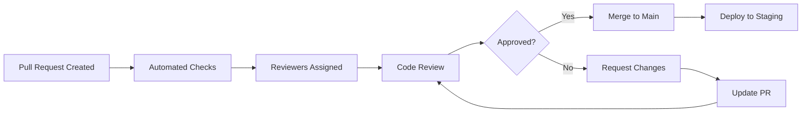

# Contributing Guidelines

Welcome to the OpenFrame contributor community! We're excited to have you contribute to building the future of AI-powered MSP platforms. This guide will help you understand our development process, coding standards, and how to make meaningful contributions.

## 🎯 Ways to Contribute

### 1. Code Contributions
- **New Features**: Implement requested features from our roadmap
- **Bug Fixes**: Resolve issues reported by the community
- **Performance Improvements**: Optimize existing functionality
- **Tool Integrations**: Add support for new MSP tools
- **API Enhancements**: Extend GraphQL schema or REST endpoints

### 2. Documentation
- **User Guides**: Improve installation and usage documentation
- **API Documentation**: Enhance API references and examples
- **Architecture Docs**: Document system design and patterns
- **Tutorials**: Create step-by-step learning materials

### 3. Testing & Quality Assurance
- **Test Coverage**: Add unit, integration, and E2E tests
- **Bug Reports**: Submit detailed issue reports
- **Performance Testing**: Load and stress testing
- **Security Testing**: Vulnerability assessments

### 4. Community Support
- **Forum Support**: Help users on GitHub Discussions
- **Slack Community**: Answer questions in [OpenMSP Slack](https://join.slack.com/t/openmsp/shared_invite/zt-36bl7mx0h-3~U2nFH6nqHqoTPXMaHEHA)
- **Code Reviews**: Review pull requests from other contributors
- **Mentoring**: Help onboard new contributors

## 🚀 Getting Started

### Prerequisites

Before contributing, ensure you have:

1. **Development Environment**: Complete [Environment Setup](../setup/environment.md)
2. **Local Development**: Successfully run [Local Development](../setup/local-development.md)
3. **Architecture Understanding**: Read [Architecture Overview](../architecture/README.md)
4. **Testing Knowledge**: Understand our [Testing Strategy](../testing/README.md)

### First Contribution Workflow



## 🔀 Development Workflow

### 1. Fork and Clone

```bash
# Fork the repository on GitHub, then clone your fork
git clone https://github.com/YOUR_USERNAME/openframe-oss-tenant.git
cd openframe-oss-tenant

# Add upstream remote
git remote add upstream https://github.com/flamingo-stack/openframe-oss-tenant.git

# Verify remotes
git remote -v
```

### 2. Create a Feature Branch

```bash
# Update your fork with latest changes
git checkout main
git fetch upstream
git rebase upstream/main
git push origin main

# Create feature branch with descriptive name
git checkout -b feature/add-fleet-mdm-integration
# OR
git checkout -b fix/organization-validation-bug
# OR  
git checkout -b docs/improve-api-documentation
```

### 3. Make Your Changes

#### Development Guidelines

**Code Organization:**
```text
- Keep changes focused and atomic
- Follow existing code patterns and structure
- Add appropriate logging and error handling
- Update relevant documentation
- Include comprehensive tests
```

**Commit Frequently:**
```bash
# Make small, logical commits with clear messages
git add src/main/java/com/openframe/api/service/OrganizationService.java
git commit -m "feat: add domain uniqueness validation to organization service

- Add validation to ensure domain names are unique within tenant
- Throw DuplicateDomainException when duplicate detected
- Add comprehensive unit tests for validation logic"
```

### 4. Code Quality Checks

```bash
# Run formatting and linting
mvn spotless:apply  # Java code formatting
npm run format      # Frontend code formatting (in frontend directory)
cargo fmt          # Rust code formatting (in client directory)

# Run tests
mvn test           # Backend unit tests
mvn test -Dtest=**/*IntegrationTest  # Integration tests
npm run test:unit  # Frontend unit tests (in frontend directory)
cargo test         # Rust tests (in client directory)

# Check test coverage
mvn jacoco:report  # Generate coverage report
```

### 5. Commit Message Standards

We follow [Conventional Commits](https://conventionalcommits.org/) specification:

```text
<type>(<scope>): <description>

[optional body]

[optional footer]
```

#### Commit Types

| Type | Description | Example |
|------|-------------|---------|
| `feat` | New feature | `feat(api): add organization search endpoint` |
| `fix` | Bug fix | `fix(ui): resolve device status update issue` |
| `docs` | Documentation | `docs(readme): update installation instructions` |
| `style` | Code style changes | `style(frontend): apply consistent formatting` |
| `refactor` | Code refactoring | `refactor(service): extract common validation logic` |
| `test` | Add or modify tests | `test(api): add integration tests for auth flow` |
| `chore` | Maintenance tasks | `chore(deps): update Spring Boot to 3.3.1` |

#### Commit Examples

```bash
# Feature addition
git commit -m "feat(organizations): add domain uniqueness validation

- Implement domain validation service
- Add custom exception for duplicate domains  
- Include validation in organization creation/update flows
- Add comprehensive test coverage

Closes #123"

# Bug fix
git commit -m "fix(devices): resolve null pointer exception in status update

- Add null check for device status field
- Handle edge case when device is not found
- Improve error messaging for client

Fixes #456"

# Documentation update
git commit -m "docs(api): add GraphQL query examples

- Include sample queries for organizations endpoint
- Add pagination and filtering examples
- Update API reference documentation"
```

### 6. Push Changes and Create Pull Request

```bash
# Push your feature branch to your fork
git push origin feature/add-fleet-mdm-integration

# Create pull request via GitHub UI or GitHub CLI
gh pr create --title "feat: add Fleet MDM integration support" \
             --body "Implements Fleet MDM device synchronization and management

## Changes
- Add Fleet MDM client service
- Implement device sync from Fleet API
- Add configuration for Fleet endpoint and authentication
- Include comprehensive test coverage

## Testing
- Unit tests for Fleet client service
- Integration tests with mock Fleet server
- Manual testing with Fleet MDM instance

Closes #789"
```

## 📝 Code Style & Standards

### Java Backend Standards

#### Code Style
```java
// Use clear, descriptive names
public class OrganizationService {
    
    private static final Logger LOGGER = LoggerFactory.getLogger(OrganizationService.class);
    
    private final OrganizationRepository repository;
    private final OrganizationMapper mapper;
    private final ApplicationEventPublisher eventPublisher;
    
    // Constructor injection preferred
    public OrganizationService(OrganizationRepository repository,
                              OrganizationMapper mapper,
                              ApplicationEventPublisher eventPublisher) {
        this.repository = repository;
        this.mapper = mapper;
        this.eventPublisher = eventPublisher;
    }
    
    /**
     * Creates a new organization with domain validation.
     * 
     * @param request The organization creation request
     * @return The created organization response
     * @throws DuplicateDomainException if domain already exists
     */
    @Transactional
    public OrganizationResponse create(CreateOrganizationRequest request) {
        LOGGER.debug("Creating organization with name: {}", request.getName());
        
        // Validate domain uniqueness
        validateDomainUnique(request.getDomain());
        
        // Map and save
        Organization entity = mapper.toEntity(request);
        entity.setTenantId(TenantSecurityContext.getTenantId());
        entity.setCreatedAt(Instant.now());
        
        Organization saved = repository.save(entity);
        
        // Publish event
        eventPublisher.publishEvent(new OrganizationCreatedEvent(saved));
        
        LOGGER.info("Created organization: {} with ID: {}", saved.getName(), saved.getId());
        return mapper.toResponse(saved);
    }
}
```

#### Error Handling
```java
// Use specific exception types
public class DuplicateDomainException extends BusinessException {
    public DuplicateDomainException(String domain) {
        super("Domain '" + domain + "' already exists", "DUPLICATE_DOMAIN");
    }
}

// Global exception handler
@RestControllerAdvice
public class GlobalExceptionHandler {
    
    @ExceptionHandler(DuplicateDomainException.class)
    public ResponseEntity<ErrorResponse> handleDuplicateDomain(DuplicateDomainException ex) {
        ErrorResponse error = ErrorResponse.builder()
            .message(ex.getMessage())
            .code(ex.getErrorCode())
            .timestamp(Instant.now())
            .build();
            
        return ResponseEntity.status(HttpStatus.CONFLICT).body(error);
    }
}
```

### TypeScript Frontend Standards

#### Component Structure
```typescript
// OrganizationCard.vue
<template>
  <div class="organization-card" :class="{ 'organization-card--inactive': !organization.isActive }">
    <div class="organization-card__header">
      <h3 class="organization-card__name">{{ organization.name }}</h3>
      <StatusBadge :status="organization.status" />
    </div>
    
    <div class="organization-card__content">
      <p class="organization-card__domain">{{ organization.domain }}</p>
      <p class="organization-card__device-count">
        {{ $t('organization.deviceCount', { count: organization.deviceCount }) }}
      </p>
    </div>
    
    <div class="organization-card__actions">
      <Button 
        variant="outline" 
        size="sm" 
        @click="$emit('edit', organization)"
        :aria-label="$t('organization.edit')"
      >
        {{ $t('common.edit') }}
      </Button>
      <Button 
        variant="danger" 
        size="sm" 
        @click="handleDelete"
        :aria-label="$t('organization.delete')"
      >
        {{ $t('common.delete') }}
      </Button>
    </div>
  </div>
</template>

<script setup lang="ts">
import { defineEmits, defineProps } from 'vue'
import type { Organization } from '@/types/organization'
import Button from '@/components/ui/Button.vue'
import StatusBadge from '@/components/ui/StatusBadge.vue'

interface Props {
  organization: Organization
}

interface Emits {
  (e: 'edit', organization: Organization): void
  (e: 'delete', organizationId: string): void
}

const props = defineProps<Props>()
const emit = defineEmits<Emits>()

const handleDelete = () => {
  if (confirm('Are you sure you want to delete this organization?')) {
    emit('delete', props.organization.id)
  }
}
</script>

<style scoped>
.organization-card {
  @apply bg-white rounded-lg shadow-sm border border-gray-200 p-4 hover:shadow-md transition-shadow;
}

.organization-card--inactive {
  @apply opacity-75;
}

.organization-card__header {
  @apply flex items-center justify-between mb-3;
}

.organization-card__name {
  @apply text-lg font-semibold text-gray-900 truncate;
}

.organization-card__content {
  @apply mb-4 space-y-1;
}

.organization-card__domain {
  @apply text-sm text-gray-600;
}

.organization-card__device-count {
  @apply text-sm text-gray-500;
}

.organization-card__actions {
  @apply flex gap-2 justify-end;
}
</style>
```

#### State Management
```typescript
// stores/organizationStore.ts
import { defineStore } from 'pinia'
import type { Organization, CreateOrganizationRequest } from '@/types/organization'
import * as organizationApi from '@/lib/api/organizations'

interface OrganizationState {
  organizations: Organization[]
  loading: boolean
  error: string | null
  selectedOrganization: Organization | null
}

export const useOrganizationStore = defineStore('organization', {
  state: (): OrganizationState => ({
    organizations: [],
    loading: false,
    error: null,
    selectedOrganization: null
  }),

  getters: {
    activeOrganizations: (state) => 
      state.organizations.filter(org => org.status === 'active'),
    
    organizationById: (state) => (id: string) =>
      state.organizations.find(org => org.id === id),
    
    totalDeviceCount: (state) =>
      state.organizations.reduce((total, org) => total + org.deviceCount, 0)
  },

  actions: {
    async fetchOrganizations() {
      this.loading = true
      this.error = null
      
      try {
        const response = await organizationApi.getOrganizations()
        this.organizations = response.data
      } catch (error) {
        this.error = 'Failed to fetch organizations'
        console.error('Failed to fetch organizations:', error)
      } finally {
        this.loading = false
      }
    },

    async createOrganization(request: CreateOrganizationRequest) {
      this.loading = true
      this.error = null

      try {
        const newOrganization = await organizationApi.createOrganization(request)
        this.organizations.push(newOrganization)
        return newOrganization
      } catch (error) {
        this.error = 'Failed to create organization'
        throw error
      } finally {
        this.loading = false
      }
    }
  }
})
```

### Rust Client Standards

#### Code Style
```rust
// src/services/device_data_fetcher.rs
use std::time::{Duration, Instant};
use serde::{Deserialize, Serialize};
use anyhow::{Context, Result};
use tracing::{debug, info, warn, error};

#[derive(Debug, Serialize, Deserialize)]
pub struct SystemInfo {
    pub hostname: String,
    pub operating_system: String,
    pub total_memory: u64,
    pub available_memory: u64,
    pub cpu_count: u32,
    pub cpu_usage_percent: f64,
    pub uptime_seconds: u64,
}

pub struct DeviceDataFetcher {
    last_cpu_measure: Option<(u64, u64, Instant)>, // (idle, total, timestamp)
}

impl DeviceDataFetcher {
    pub fn new() -> Self {
        Self {
            last_cpu_measure: None,
        }
    }

    /// Fetches comprehensive system information
    pub async fn fetch_system_info(&mut self) -> Result<SystemInfo> {
        debug!("Fetching system information");

        let hostname = self.get_hostname()
            .context("Failed to get hostname")?;
            
        let os_info = self.get_operating_system_info()
            .context("Failed to get OS information")?;
            
        let memory_info = self.get_memory_info()
            .context("Failed to get memory information")?;
            
        let cpu_info = self.get_cpu_info().await
            .context("Failed to get CPU information")?;
            
        let uptime = self.get_system_uptime()
            .context("Failed to get system uptime")?;

        let system_info = SystemInfo {
            hostname,
            operating_system: os_info.os_type,
            total_memory: memory_info.total,
            available_memory: memory_info.available,
            cpu_count: cpu_info.core_count,
            cpu_usage_percent: cpu_info.usage_percent,
            uptime_seconds: uptime.as_secs(),
        };

        info!("Successfully fetched system info for host: {}", system_info.hostname);
        Ok(system_info)
    }

    async fn get_cpu_info(&mut self) -> Result<CpuInfo> {
        let (idle, total) = self.read_cpu_stats()?;
        let now = Instant::now();
        
        let usage_percent = if let Some((prev_idle, prev_total, prev_time)) = self.last_cpu_measure {
            // Only calculate if we have previous measurements and enough time has passed
            if now.duration_since(prev_time) >= Duration::from_secs(1) {
                self.calculate_cpu_percentage(prev_idle, prev_total, idle, total)
            } else {
                0.0 // Not enough time passed for accurate measurement
            }
        } else {
            0.0 // First measurement, no previous data
        };
        
        self.last_cpu_measure = Some((idle, total, now));
        
        Ok(CpuInfo {
            core_count: num_cpus::get() as u32,
            usage_percent,
        })
    }

    fn calculate_cpu_percentage(&self, prev_idle: u64, prev_total: u64, curr_idle: u64, curr_total: u64) -> f64 {
        let total_diff = curr_total.saturating_sub(prev_total) as f64;
        let idle_diff = curr_idle.saturating_sub(prev_idle) as f64;
        
        if total_diff == 0.0 {
            return 0.0;
        }
        
        ((total_diff - idle_diff) / total_diff * 100.0).max(0.0).min(100.0)
    }
}

#[cfg(test)]
mod tests {
    use super::*;
    use tokio_test;

    #[tokio::test]
    async fn test_fetch_system_info_success() {
        let mut fetcher = DeviceDataFetcher::new();
        
        let result = fetcher.fetch_system_info().await;
        
        assert!(result.is_ok());
        let info = result.unwrap();
        assert!(!info.hostname.is_empty());
        assert!(info.total_memory > 0);
        assert!(info.cpu_count > 0);
    }

    #[test]
    fn test_calculate_cpu_percentage() {
        let fetcher = DeviceDataFetcher::new();
        
        let usage = fetcher.calculate_cpu_percentage(1000, 2000, 1100, 2200);
        
        // (2200-2000) - (1100-1000) = 200 - 100 = 100
        // 100 / 200 = 0.5 = 50%
        assert!((usage - 50.0).abs() < 0.1);
    }
}
```

## 🔍 Pull Request Process

### Pull Request Template

When creating a pull request, use this template:

```markdown
## Description
Brief description of the changes and motivation.

Fixes #(issue number)

## Type of Change
- [ ] Bug fix (non-breaking change that fixes an issue)
- [ ] New feature (non-breaking change that adds functionality)
- [ ] Breaking change (fix or feature that would cause existing functionality to not work as expected)
- [ ] Documentation update
- [ ] Performance improvement
- [ ] Code refactoring

## Changes Made
- Detailed list of changes
- Include any architectural decisions
- Mention any new dependencies

## Testing
- [ ] Unit tests added/updated
- [ ] Integration tests added/updated
- [ ] Manual testing completed
- [ ] All tests pass locally

Describe the tests you ran and provide instructions for reviewers.

## Documentation
- [ ] Code comments updated
- [ ] README updated
- [ ] API documentation updated
- [ ] Architecture docs updated (if applicable)

## Deployment Notes
Any special deployment considerations:
- Database migrations required
- Configuration changes needed
- Dependencies to update

## Screenshots/Demo
Include screenshots for UI changes or links to demo videos.

## Checklist
- [ ] My code follows the project's style guidelines
- [ ] I have performed a self-review of my code
- [ ] I have commented my code, particularly in hard-to-understand areas
- [ ] I have made corresponding changes to the documentation
- [ ] My changes generate no new warnings
- [ ] I have added tests that prove my fix is effective or that my feature works
- [ ] New and existing unit tests pass locally with my changes
```

### Review Process



#### Review Criteria

**Code Quality:**
- [ ] Code follows established patterns and conventions
- [ ] Functions and classes have single responsibilities
- [ ] Error handling is appropriate and comprehensive
- [ ] No obvious performance issues
- [ ] Security best practices followed

**Testing:**
- [ ] Adequate test coverage for new functionality
- [ ] Tests are meaningful and test the right things
- [ ] Edge cases are covered
- [ ] Integration points are tested

**Documentation:**
- [ ] Code is self-documenting with clear variable/function names
- [ ] Complex logic is commented
- [ ] Public APIs are documented
- [ ] User-facing changes have documentation updates

**Architecture:**
- [ ] Changes fit well within existing architecture
- [ ] No unnecessary dependencies added
- [ ] Follows established patterns for similar functionality
- [ ] Performance implications considered

## 🐛 Issue Reporting

### Bug Report Template

```markdown
**Bug Description**
A clear and concise description of what the bug is.

**Steps to Reproduce**
1. Go to '...'
2. Click on '....'
3. Scroll down to '....'
4. See error

**Expected Behavior**
A clear description of what you expected to happen.

**Actual Behavior**
What actually happened, including any error messages.

**Environment**
- OS: [e.g. macOS 12.6, Ubuntu 20.04, Windows 11]
- Browser: [e.g. Chrome 91, Firefox 89] (if applicable)
- OpenFrame Version: [e.g. v0.5.2]
- Java Version: [e.g. OpenJDK 21]

**Additional Context**
- Relevant log entries
- Screenshots if applicable
- Configuration files (sanitized)
- Any workarounds you've tried

**System Information**
```bash
# Include output of these commands
java -version
node --version
docker --version
kubectl version --client
```
</markdown>

### Feature Request Template

```markdown
**Feature Summary**
A brief description of the feature you'd like to see.

**Problem Statement**
What problem does this feature solve? What's the current limitation?

**Proposed Solution**
Describe your proposed solution. Include:
- How it would work from a user perspective
- Any UI mockups or wireframes
- Technical approach (if you have thoughts)

**Alternative Solutions**
Any alternative solutions you've considered.

**Use Cases**
Specific scenarios where this feature would be valuable:
1. As a [role], I want [goal] so that [benefit]
2. When [situation], I need to [action] because [reason]

**Acceptance Criteria**
- [ ] Criterion 1
- [ ] Criterion 2
- [ ] Criterion 3

**Additional Context**
Any other context, screenshots, or examples.

**Priority**
- [ ] Low - Nice to have
- [ ] Medium - Would significantly improve workflow
- [ ] High - Blocking current work
- [ ] Critical - Essential for production use
```

## 🏷️ Labeling System

### Issue Labels

| Label | Description | Color |
|-------|-------------|-------|
| `bug` | Something isn't working | `#d73a49` |
| `feature` | New feature request | `#0075ca` |
| `documentation` | Improvements to docs | `#0075ca` |
| `good first issue` | Good for newcomers | `#7057ff` |
| `help wanted` | Extra attention needed | `#008672` |
| `question` | Further information requested | `#d876e3` |
| `wontfix` | This will not be worked on | `#ffffff` |
| `duplicate` | This issue already exists | `#cfd3d7` |
| `invalid` | Not valid issue | `#e4e669` |

### Component Labels

| Component | Label | Description |
|-----------|-------|-------------|
| Backend | `backend` | Java services and APIs |
| Frontend | `frontend` | Vue.js application |
| Client | `client` | Rust agent application |
| Database | `database` | MongoDB, Cassandra, Redis |
| Security | `security` | Authentication, authorization |
| Performance | `performance` | Speed, memory, scalability |
| Integration | `integration` | External tool connections |

## 🎯 Contribution Focus Areas

### High Priority Areas

1. **Tool Integrations**
   - Fleet MDM advanced features
   - Tactical RMM enhancements
   - New MSP tool connectors
   - Synchronization improvements

2. **AI Features**
   - Mingo AI conversation improvements
   - New AI model integrations
   - Automated troubleshooting
   - Predictive analytics

3. **Performance & Scalability**
   - Database query optimization
   - Caching improvements
   - Real-time update efficiency
   - Large tenant support

4. **Developer Experience**
   - Documentation improvements
   - Development tooling
   - Testing infrastructure
   - API enhancements

### Good First Issues

New contributors should look for issues labeled `good first issue`:

- Documentation updates and fixes
- Simple bug fixes in UI components
- Test coverage improvements
- Code formatting and linting fixes
- Small feature enhancements

## 🏆 Recognition

### Contributor Recognition

We recognize contributions through:

- **Contributors Page**: Listed in repository contributors
- **Release Notes**: Contributions highlighted in release notes
- **Community Shoutouts**: Recognition in Slack and social media
- **Direct Feedback**: Personal thanks from maintainers

### Becoming a Maintainer

Active contributors may be invited to become maintainers with:

- Commit access to the repository
- Ability to review and merge pull requests
- Participation in roadmap planning
- Technical decision-making responsibilities

**Maintainer Criteria:**
- Consistent, high-quality contributions over 3+ months
- Deep understanding of OpenFrame architecture
- Positive community interaction and mentoring
- Alignment with project goals and values

## 📞 Getting Help

### Communication Channels

1. **GitHub Discussions**: [Repository Discussions](https://github.com/flamingo-stack/openframe-oss-tenant/discussions)
2. **OpenMSP Slack**: [Join Community](https://join.slack.com/t/openmsp/shared_invite/zt-36bl7mx0h-3~U2nFH6nqHqoTPXMaHEHA)
3. **GitHub Issues**: For bug reports and feature requests
4. **Email**: For security issues or private matters

### Response Times

| Channel | Response Time | Best For |
|---------|---------------|----------|
| **Slack** | Few hours | Quick questions, real-time help |
| **GitHub Issues** | 1-2 business days | Bug reports, feature requests |
| **GitHub Discussions** | 1-2 business days | Technical discussions |
| **Pull Requests** | 2-3 business days | Code review |

### Code of Conduct

We are committed to providing a welcoming and inclusive environment. Please:

- **Be respectful** in all interactions
- **Be patient** with newcomers and different skill levels  
- **Be constructive** in feedback and suggestions
- **Be collaborative** and help others learn
- **Be mindful** of time zones and cultural differences

Report any Code of Conduct violations to the maintainers.

## 🎉 Thank You!

Thank you for contributing to OpenFrame! Your contributions help build better tools for MSPs worldwide and advance the adoption of AI-powered automation in IT operations.

Every contribution, no matter how small, makes a difference. Whether you're fixing a typo, adding a test, or implementing a major feature, you're helping create something valuable for the community.

**Happy coding!** 🚀

---

**Ready to contribute?** Start by checking our [good first issues](https://github.com/flamingo-stack/openframe-oss-tenant/issues?q=is%3Aissue+is%3Aopen+label%3A%22good+first+issue%22) or join our [Slack community](https://join.slack.com/t/openmsp/shared_invite/zt-36bl7mx0h-3~U2nFH6nqHqoTPXMaHEHA) to introduce yourself!