# Contributing Guidelines

Welcome to the OpenFrame contributor community! This guide covers our development workflow, code standards, pull request process, and review checklist to ensure high-quality contributions.

## Getting Started

### Prerequisites for Contributing

Before contributing to OpenFrame, ensure you have:

✅ Completed the [Environment Setup](../setup/environment.md)  
✅ Successfully run the [Local Development Guide](../setup/local-development.md)  
✅ Read the [Architecture Overview](../architecture/overview.md)  
✅ Joined our [OpenMSP Slack Community](https://join.slack.com/t/openmsp/shared_invite/zt-36bl7mx0h-3~U2nFH6nqHqoTPXMaHEHA)

### Community Standards

OpenFrame is built by the **Flamingo** team and maintained by the **OpenMSP community**. We follow these principles:

- **Inclusive and Respectful**: Everyone is welcome regardless of background or experience level
- **Quality First**: Code quality and testing are non-negotiable
- **Collaborative Decision Making**: Major changes discussed in community channels
- **Documentation Driven**: All features must include comprehensive documentation

> **Important**: We don't use GitHub Issues or GitHub Discussions. All development discussions happen in our **OpenMSP Slack community**.

## Development Workflow

### Fork and Clone Workflow

```mermaid
flowchart LR
    A[Fork Repository] --> B[Clone Fork]
    B --> C[Create Feature Branch]
    C --> D[Develop Changes]
    D --> E[Test Locally]
    E --> F[Commit Changes]
    F --> G[Push to Fork]
    G --> H[Create Pull Request]
    H --> I[Code Review]
    I --> J[Address Feedback]
    J --> K[Merge to Main]
```



#### 1. Fork and Clone

```bash
# Fork the repository on GitHub first, then:
git clone https://github.com/YOUR_USERNAME/openframe-oss-tenant.git
cd openframe-oss-tenant

# Add upstream remote
git remote add upstream https://github.com/flamingo-stack/openframe-oss-tenant.git

# Verify remotes
git remote -v
# origin    https://github.com/YOUR_USERNAME/openframe-oss-tenant.git (fetch)
# origin    https://github.com/YOUR_USERNAME/openframe-oss-tenant.git (push)
# upstream  https://github.com/flamingo-stack/openframe-oss-tenant.git (fetch)
# upstream  https://github.com/flamingo-stack/openframe-oss-tenant.git (push)
```

#### 2. Keep Fork Updated

```bash
# Fetch latest changes from upstream
git fetch upstream

# Switch to main branch and update
git checkout main
git merge upstream/main

# Push updates to your fork
git push origin main
```

### Branch Naming Convention

Use descriptive branch names that indicate the type and scope of work:

| Branch Type | Naming Pattern | Example |
|-------------|----------------|---------|
| **Feature** | `feature/short-description` | `feature/device-management-ui` |
| **Bug Fix** | `fix/issue-description` | `fix/device-status-update-bug` |
| **Documentation** | `docs/topic` | `docs/api-documentation-update` |
| **Refactor** | `refactor/component-name` | `refactor/user-service-cleanup` |
| **Performance** | `perf/optimization-area` | `perf/database-query-optimization` |
| **Security** | `security/vulnerability-fix` | `security/jwt-validation-fix` |

#### Creating Feature Branches

```bash
# Create and switch to new feature branch
git checkout -b feature/device-management-ui

# Push branch to your fork
git push -u origin feature/device-management-ui
```

## Code Standards

### Java Code Style

OpenFrame follows **Google Java Style Guide** with some customizations:

#### Code Formatting

```java
// Class structure example
@Slf4j
@Service
@RequiredArgsConstructor
public class DeviceService {
    
    private final DeviceRepository deviceRepository;
    private final OrganizationService organizationService;
    private final EventPublisher eventPublisher;
    
    /**
     * Creates a new device in the specified organization.
     * 
     * @param request the device creation request
     * @return the created device response
     * @throws OrganizationNotFoundException if organization doesn't exist
     */
    @Transactional
    public DeviceResponse createDevice(CreateDeviceRequest request) {
        log.debug("Creating device: {}", request.getName());
        
        Organization organization = organizationService.findById(request.getOrganizationId())
            .orElseThrow(() -> new OrganizationNotFoundException(
                "Organization not found: " + request.getOrganizationId()));
        
        Device device = Device.builder()
            .name(request.getName())
            .deviceType(request.getDeviceType())
            .organizationId(organization.getId())
            .status(DeviceStatus.PENDING)
            .createdAt(Instant.now())
            .updatedAt(Instant.now())
            .build();
            
        Device savedDevice = deviceRepository.save(device);
        
        // Publish device created event
        eventPublisher.publishEvent(DeviceCreatedEvent.builder()
            .deviceId(savedDevice.getId())
            .organizationId(savedDevice.getOrganizationId())
            .timestamp(Instant.now())
            .build());
        
        log.info("Device created successfully: {} for organization: {}", 
            savedDevice.getId(), organization.getName());
            
        return mapToResponse(savedDevice);
    }
}
```

#### Code Style Rules

1. **Line Length**: Maximum 120 characters
2. **Indentation**: 4 spaces (no tabs)
3. **Imports**: Group imports, no wildcard imports
4. **Logging**: Use SLF4J with appropriate log levels
5. **Null Safety**: Use `Optional` and null checks
6. **Exception Handling**: Specific exceptions with meaningful messages

#### Maven Spotless Configuration

Code formatting is enforced via Maven Spotless:

```bash
# Check formatting
mvn spotless:check

# Apply formatting fixes
mvn spotless:apply
```

### TypeScript/Vue.js Code Style

OpenFrame frontend follows **Vue.js 3 Style Guide** with TypeScript best practices:

#### Vue Component Structure

```vue
<script setup lang="ts">
import { ref, computed, onMounted } from 'vue'
import { useDevices } from '@/composables/useDevices'
import { useNotification } from '@/composables/useNotification'
import type { Device, DeviceStatus } from '@/types/device'

// Props definition
interface Props {
  organizationId: string
  initialStatus?: DeviceStatus
}

const props = withDefaults(defineProps<Props>(), {
  initialStatus: 'ALL'
})

// Emits definition
interface Emits {
  deviceSelected: [device: Device]
  statusChanged: [status: DeviceStatus]
}

const emit = defineEmits<Emits>()

// Composables
const { devices, loading, error, fetchDevices } = useDevices()
const { showSuccess, showError } = useNotification()

// Reactive state
const selectedStatus = ref<DeviceStatus>(props.initialStatus)
const searchTerm = ref('')

// Computed properties
const filteredDevices = computed(() => {
  return devices.value.filter(device => {
    const matchesSearch = device.name.toLowerCase().includes(searchTerm.value.toLowerCase())
    const matchesStatus = selectedStatus.value === 'ALL' || device.status === selectedStatus.value
    return matchesSearch && matchesStatus
  })
})

// Methods
const handleDeviceClick = (device: Device): void => {
  emit('deviceSelected', device)
}

const handleStatusChange = (status: DeviceStatus): void => {
  selectedStatus.value = status
  emit('statusChanged', status)
}

// Lifecycle
onMounted(async () => {
  try {
    await fetchDevices(props.organizationId)
    showSuccess('Devices loaded successfully')
  } catch (err) {
    showError('Failed to load devices')
  }
})
</script>

<template>
  <div class="device-list" data-testid="device-list">
    <!-- Search and Filter Controls -->
    <div class="controls">
      <input
        v-model="searchTerm"
        type="text"
        placeholder="Search devices..."
        class="search-input"
        data-testid="device-search"
      />
      
      <select
        v-model="selectedStatus"
        class="status-filter"
        data-testid="status-filter"
        @change="handleStatusChange(selectedStatus)"
      >
        <option value="ALL">All Devices</option>
        <option value="ONLINE">Online</option>
        <option value="OFFLINE">Offline</option>
        <option value="PENDING">Pending</option>
      </select>
    </div>
    
    <!-- Loading State -->
    <div v-if="loading" class="loading" data-testid="loading-spinner">
      Loading devices...
    </div>
    
    <!-- Error State -->
    <div v-else-if="error" class="error" data-testid="error-message">
      {{ error }}
    </div>
    
    <!-- Device List -->
    <div v-else class="device-grid">
      <div
        v-for="device in filteredDevices"
        :key="device.id"
        class="device-card"
        data-testid="device-row"
        @click="handleDeviceClick(device)"
      >
        <h3 data-testid="device-name">{{ device.name }}</h3>
        <p data-testid="device-type">{{ device.deviceType }}</p>
        <span 
          :class="`status-badge status-${device.status.toLowerCase()}`"
          data-testid="device-status"
        >
          {{ device.status }}
        </span>
      </div>
    </div>
  </div>
</template>

<style scoped lang="scss">
.device-list {
  @apply flex flex-col gap-4;
  
  .controls {
    @apply flex gap-4 items-center;
    
    .search-input {
      @apply flex-1 px-3 py-2 border border-gray-300 rounded-md;
      @apply focus:ring-2 focus:ring-blue-500 focus:border-transparent;
    }
    
    .status-filter {
      @apply px-3 py-2 border border-gray-300 rounded-md bg-white;
    }
  }
  
  .device-grid {
    @apply grid grid-cols-1 md:grid-cols-2 lg:grid-cols-3 gap-4;
  }
  
  .device-card {
    @apply p-4 border border-gray-200 rounded-lg hover:shadow-md cursor-pointer;
    @apply transition-shadow duration-200;
    
    .status-badge {
      @apply px-2 py-1 rounded-full text-xs font-semibold;
      
      &.status-online {
        @apply bg-green-100 text-green-800;
      }
      
      &.status-offline {
        @apply bg-red-100 text-red-800;
      }
      
      &.status-pending {
        @apply bg-yellow-100 text-yellow-800;
      }
    }
  }
}
</style>
```

#### TypeScript Style Rules

1. **Strict Mode**: Enable all TypeScript strict flags
2. **Type Imports**: Use `type` keyword for type-only imports
3. **Interface over Type**: Prefer interfaces for object shapes
4. **Explicit Return Types**: Define return types for functions
5. **Test IDs**: Always include `data-testid` attributes for testing

### ESLint and Prettier Configuration

Frontend code formatting is automated:

```bash
cd openframe/services/openframe-frontend

# Check code style
npm run lint

# Fix code style issues
npm run lint:fix

# Format with Prettier
npm run format
```

## Commit Message Guidelines

### Conventional Commits

OpenFrame uses **Conventional Commits** specification:

```
<type>[optional scope]: <description>

[optional body]

[optional footer(s)]
```

#### Commit Types

| Type | Purpose | Example |
|------|---------|---------|
| **feat** | New features | `feat(devices): add device status filtering` |
| **fix** | Bug fixes | `fix(auth): resolve JWT expiration handling` |
| **docs** | Documentation | `docs(api): update GraphQL schema examples` |
| **style** | Code style changes | `style(frontend): apply consistent formatting` |
| **refactor** | Code refactoring | `refactor(user-service): extract validation logic` |
| **perf** | Performance improvements | `perf(database): optimize device query indexes` |
| **test** | Adding/updating tests | `test(devices): add integration tests for API` |
| **build** | Build system changes | `build(maven): update Spring Boot version` |
| **ci** | CI/CD changes | `ci(github): add automated security scanning` |
| **chore** | Maintenance tasks | `chore(deps): update frontend dependencies` |

#### Commit Message Examples

**Good Commit Messages:**

```bash
feat(devices): implement real-time status updates via WebSocket

- Add WebSocket endpoint for device status streaming
- Update frontend to consume real-time device events
- Add integration tests for WebSocket functionality

Closes #123
```

```bash
fix(auth): resolve JWT token validation edge case

The JWT validation was failing for tokens issued near midnight
due to timezone handling. Updated validation logic to use UTC
consistently across all timestamp comparisons.

Fixes #456
```

```bash
docs(contributing): add detailed code review checklist

- Add comprehensive review guidelines
- Include code quality standards
- Document testing requirements
- Add examples for common scenarios
```

**Poor Commit Messages (Avoid These):**

```bash
# Too vague
fix: bug fix

# No context
update code

# Not conventional commits format
Fixed the thing that was broken in the device service
```

### Creating Quality Commits

#### Atomic Commits

Make small, focused commits that address one concern:

```bash
# Good: Separate commits for different concerns
git add src/main/java/com/openframe/api/service/DeviceService.java
git commit -m "feat(devices): add device creation validation logic"

git add src/test/java/com/openframe/api/service/DeviceServiceTest.java
git commit -m "test(devices): add unit tests for device validation"

git add docs/api/device-management.md
git commit -m "docs(devices): document device creation API"
```

#### Staging Changes

```bash
# Review changes before committing
git diff

# Stage specific files
git add src/main/java/com/openframe/api/service/DeviceService.java

# Stage parts of files (interactive staging)
git add -p src/main/java/com/openframe/api/controller/DeviceController.java

# Check staged changes
git diff --staged
```

## Pull Request Process

### Creating Pull Requests

#### 1. Pre-Pull Request Checklist

Before creating a pull request, ensure:

✅ **Code Quality**
- [ ] All tests pass locally (`mvn test` and `npm test`)
- [ ] Code follows style guidelines (`mvn spotless:check`, `npm run lint`)
- [ ] No console.log or debug statements left in code
- [ ] All new code has appropriate test coverage

✅ **Documentation**
- [ ] Updated relevant documentation
- [ ] Added JSDoc/JavaDoc for new public methods
- [ ] Updated API documentation if needed
- [ ] Added/updated README if new features

✅ **Functionality** 
- [ ] Feature works as intended
- [ ] No regression in existing functionality
- [ ] Handles edge cases appropriately
- [ ] Performance impact considered

#### 2. Pull Request Template

```markdown
## Description

Brief description of what this PR does and why.

## Type of Change

- [ ] Bug fix (non-breaking change which fixes an issue)
- [ ] New feature (non-breaking change which adds functionality)
- [ ] Breaking change (fix or feature that would cause existing functionality to not work as expected)
- [ ] Documentation update
- [ ] Performance improvement
- [ ] Code refactoring

## Changes Made

- Specific change 1
- Specific change 2
- Specific change 3

## Testing

- [ ] Unit tests added/updated
- [ ] Integration tests added/updated
- [ ] Manual testing completed
- [ ] E2E tests updated (if applicable)

### Test Coverage

- Current coverage: XX%
- New/changed lines covered: XX%

## Screenshots (if applicable)

Before:
[Screenshot or description]

After:
[Screenshot or description]

## Breaking Changes

List any breaking changes and migration steps needed.

## Related Issues

Closes #123
Relates to #456

## Additional Notes

Any additional information for reviewers.
```

#### 3. Pull Request Title and Description

**Good PR Titles:**
```
feat(devices): add real-time device status monitoring dashboard
fix(auth): resolve JWT validation issue for edge case timestamps
docs(api): update GraphQL schema documentation with new device fields
```

**PR Description Best Practices:**
- Explain the "why" behind the changes
- Include before/after screenshots for UI changes
- List breaking changes and migration steps
- Reference related issues and discussions

### Review Process

#### Review Assignment

Pull requests are automatically assigned to:
1. **Core team members** for architectural changes
2. **Component owners** for specific service changes
3. **Documentation team** for documentation changes

#### Review Timeline

| PR Type | Expected Review Time |
|---------|---------------------|
| **Hot fixes** | 2-4 hours |
| **Bug fixes** | 24-48 hours |
| **Features** | 2-5 business days |
| **Breaking changes** | 5-7 business days |
| **Documentation** | 24-48 hours |

## Code Review Checklist

### For Authors (Self-Review)

Before requesting review, check:

#### Code Quality
- [ ] **Functionality**: Code works as intended
- [ ] **Readability**: Code is clear and well-documented
- [ ] **Performance**: No obvious performance issues
- [ ] **Security**: No security vulnerabilities introduced
- [ ] **Error Handling**: Appropriate error handling and logging

#### Testing
- [ ] **Unit Tests**: All new code has unit tests
- [ ] **Integration Tests**: API changes have integration tests
- [ ] **Edge Cases**: Tests cover edge cases and error conditions
- [ ] **Test Quality**: Tests are maintainable and reliable

#### Documentation
- [ ] **Code Comments**: Complex logic is explained
- [ ] **API Documentation**: Public APIs are documented
- [ ] **README Updates**: Changes reflected in relevant READMEs
- [ ] **Migration Guides**: Breaking changes have migration docs

### For Reviewers

#### Code Review Standards

**Focus Areas:**
1. **Correctness**: Does the code solve the intended problem?
2. **Design**: Is the solution well-architected?
3. **Complexity**: Is the code as simple as it can be?
4. **Tests**: Are there appropriate tests for the changes?
5. **Naming**: Are names descriptive and consistent?
6. **Documentation**: Is the code adequately documented?

#### Review Comments Guidelines

**Effective Review Comments:**

```markdown
**Suggestion**: Consider using Optional.ofNullable() here to handle null values more gracefully.

```java
// Instead of:
if (user != null) {
    return user.getName();
}
return "Unknown";

// Consider:
return Optional.ofNullable(user)
    .map(User::getName)
    .orElse("Unknown");
```

**Reasoning**: This makes the null handling more explicit and reduces the chance of NPEs.
```

```markdown
**Question**: What happens if the organizationId doesn't exist? Should we throw a specific exception?

I see we're calling `organizationService.findById()` but I don't see error handling. Consider throwing `OrganizationNotFoundException` for better error messages.
```

```markdown
**Nitpick**: Small formatting issue - missing space before the opening brace.

```java
// Current
if(condition){

// Preferred
if (condition) {
```
```

**Review Comment Types:**
- **Must Fix**: Blocking issues that prevent merge
- **Suggestion**: Improvements that should be considered
- **Question**: Clarification needed from author
- **Nitpick**: Minor style/formatting issues
- **Praise**: Acknowledge good solutions

#### Approval Criteria

**Requires Changes:**
- Code has bugs or logical errors
- Missing test coverage for new functionality
- Breaking changes without migration documentation
- Security vulnerabilities
- Performance regressions

**Approve:**
- Code meets quality standards
- Adequate test coverage
- Documentation is complete
- No security or performance concerns
- Minor nitpicks can be addressed in follow-up

### Addressing Review Feedback

#### Responding to Comments

```markdown
**Reviewer Comment**: Consider using a more specific exception type here.

**Author Response**: Good point! I've updated this to throw `DeviceNotFoundException` with a descriptive message. Updated in commit abc1234.
```

```markdown
**Reviewer Comment**: This method seems quite complex. Could we break it down?

**Author Response**: I've refactored this into three smaller methods: `validateRequest()`, `createDevice()`, and `publishEvent()`. Each method now has a single responsibility. See commit def5678.
```

#### Making Changes

```bash
# Make requested changes
git add .
git commit -m "refactor(devices): extract method as suggested in review"

# Push changes (no need to create new PR)
git push origin feature/device-management-ui
```

#### Resolving Conversations

- **Authors**: Mark conversations as resolved after addressing feedback
- **Reviewers**: Re-review updated code and resolve conversations if satisfied

## Release and Versioning

### Semantic Versioning

OpenFrame follows [Semantic Versioning 2.0.0](https://semver.org/):

- **MAJOR**: Breaking changes (e.g., 1.0.0 → 2.0.0)
- **MINOR**: New features, backward compatible (e.g., 1.0.0 → 1.1.0)
- **PATCH**: Bug fixes, backward compatible (e.g., 1.0.0 → 1.0.1)

### Release Notes

Contributors should update `CHANGELOG.md` for significant changes:

```markdown
## [1.2.0] - 2024-01-15

### Added
- Real-time device status monitoring dashboard
- WebSocket support for live updates
- New device filtering and search capabilities

### Changed
- Improved GraphQL query performance for large datasets
- Updated JWT token validation logic

### Fixed
- Resolved memory leak in WebSocket connections
- Fixed device status update race condition

### Security
- Enhanced API key validation
- Updated dependencies with security patches
```

## Getting Help

### Community Support

**OpenMSP Slack Community**: https://join.slack.com/t/openmsp/shared_invite/zt-36bl7mx0h-3~U2nFH6nqHqoTPXMaHEHA

**Popular Channels:**
- `#development` - Development questions and discussions
- `#code-review` - Code review coordination and questions
- `#architecture` - System design and architecture discussions
- `#testing` - Testing strategies and issues
- `#documentation` - Documentation improvements and questions

### Maintainer Contact

For urgent issues or questions about the contribution process:
- **Slack**: Direct message maintainers in OpenMSP Slack
- **Pull Request Comments**: Tag maintainers in PR discussions

### Development Resources

- **[Local Development Guide](../setup/local-development.md)** - Advanced development workflows
- **[Architecture Overview](../architecture/overview.md)** - System design understanding
- **[Testing Overview](../testing/overview.md)** - Testing strategies and tools

---

## Quick Reference

### Essential Commands

```bash
# Setup
git clone <your-fork>
cd openframe-oss-tenant
git remote add upstream <upstream-url>

# Daily workflow
git fetch upstream
git checkout main
git merge upstream/main
git checkout -b feature/my-feature

# Before committing
mvn spotless:apply              # Format Java code
npm run lint:fix               # Fix frontend issues
mvn test                       # Run backend tests
npm test                       # Run frontend tests

# Commit and push
git add .
git commit -m "feat(scope): description"
git push origin feature/my-feature
```

### Key Quality Gates

- ✅ All tests pass
- ✅ Code follows style guidelines
- ✅ Documentation updated
- ✅ Test coverage maintained
- ✅ No performance regressions
- ✅ Security considerations addressed

---

**Thank you for contributing to OpenFrame!** Your efforts help build a better open-source MSP platform for everyone. 🚀

**Questions?** Join our community: https://join.slack.com/t/openmsp/shared_invite/zt-36bl7mx0h-3~U2nFH6nqHqoTPXMaHEHA