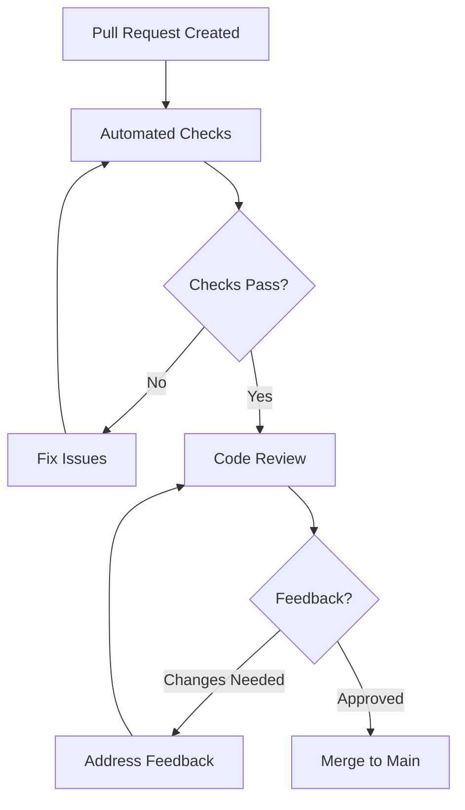

# Contributing Guidelines

Welcome to the OpenFrame community! This guide provides comprehensive instructions for contributing to the OpenFrame project, including code style conventions, pull request processes, and review guidelines.

## Getting Started with Contributing

Before making your first contribution, familiarize yourself with:

1. **[Development Environment Setup](../setup/environment.md)** - Configure your development environment
2. **[Local Development Guide](../setup/local-development.md)** - Get the platform running locally
3. **[Architecture Overview](../architecture/overview.md)** - Understand the system design
4. **[Testing Overview](../testing/overview.md)** - Learn our testing approaches

## Code of Conduct

OpenFrame is committed to providing a welcoming and inclusive environment for all contributors. We expect all participants to adhere to our community standards:

- **Be Respectful**: Treat all community members with respect and courtesy
- **Be Inclusive**: Welcome newcomers and help them get started
- **Be Constructive**: Provide helpful feedback and suggestions
- **Be Professional**: Maintain professional communication in all interactions

## Ways to Contribute

### 1. Bug Reports

Help us improve OpenFrame by reporting bugs:

**Before Reporting**:
- Search existing issues to avoid duplicates
- Test with the latest version
- Gather reproduction steps

**Bug Report Template**:
```markdown
## Bug Description
Brief description of the bug

## Steps to Reproduce
1. Step one
2. Step two
3. Step three

## Expected Behavior
What should have happened

## Actual Behavior
What actually happened

## Environment
- OpenFrame Version: 
- Java Version:
- Browser (if applicable):
- Operating System:

## Additional Context
Screenshots, logs, or other relevant information
```

### 2. Feature Requests

Suggest new features or improvements:

**Feature Request Template**:
```markdown
## Feature Summary
Brief description of the proposed feature

## Motivation
Why is this feature needed? What problem does it solve?

## Detailed Description
Detailed explanation of the feature

## Proposed Implementation
High-level implementation approach (optional)

## Alternatives Considered
Other approaches you've considered

## Additional Context
Screenshots, mockups, or other relevant information
```

### 3. Code Contributions

Contribute code improvements, bug fixes, and new features:

- **Bug Fixes**: Address reported issues
- **Feature Implementation**: Develop approved features
- **Performance Improvements**: Optimize existing code
- **Documentation**: Improve code comments and documentation
- **Tests**: Add or improve test coverage

### 4. Documentation Contributions

Help improve project documentation:

- **API Documentation**: Update GraphQL schema docs, REST API docs
- **User Guides**: Improve tutorials and how-to guides  
- **Developer Docs**: Enhance development documentation
- **Code Examples**: Provide code samples and demos

## Development Workflow

### 1. Fork and Clone

```bash
# Fork the repository on GitHub, then clone your fork
git clone https://github.com/YOUR-USERNAME/openframe-oss-tenant.git
cd openframe-oss-tenant

# Add upstream remote
git remote add upstream https://github.com/flamingo-stack/openframe-oss-tenant.git
```

### 2. Create Feature Branch

```bash
# Create and switch to a new branch
git checkout -b feature/your-feature-name

# Branch naming conventions:
# feature/add-device-monitoring     # New features
# fix/device-status-update         # Bug fixes  
# docs/api-documentation           # Documentation
# refactor/service-architecture    # Code refactoring
# test/integration-coverage        # Test improvements
```

### 3. Development Process

```mermaid
flowchart LR
    START[Start Development] --> CODE[Write Code]
    CODE --> TEST[Write Tests]
    TEST --> LINT[Run Linters]
    LINT --> REVIEW[Self Review]
    REVIEW --> COMMIT[Commit Changes]
    COMMIT --> PUSH[Push to Fork]
    PUSH --> PR[Create Pull Request]
    PR --> FEEDBACK[Address Feedback]
    FEEDBACK --> MERGE[Merge to Main]
```



#### Writing Code

Follow these principles during development:

- **Single Responsibility**: Each function/class should have one responsibility
- **DRY Principle**: Don't repeat yourself - extract common functionality
- **SOLID Principles**: Follow object-oriented design principles
- **Clean Code**: Write self-documenting, readable code
- **Error Handling**: Implement proper error handling and logging

#### Writing Tests

**Test Requirements**:
- Unit tests for new business logic
- Integration tests for service interactions
- E2E tests for critical user workflows
- Update existing tests when modifying behavior

```bash
# Run tests before committing
mvn test                              # Backend tests
npm run test                          # Frontend unit tests
npm run test:e2e                      # Frontend E2E tests
```

### 4. Commit Messages

Use **Conventional Commits** format for clear change history:

```bash
<type>[optional scope]: <description>

[optional body]

[optional footer(s)]
```

**Commit Types**:
- `feat`: New feature
- `fix`: Bug fix
- `docs`: Documentation changes
- `style`: Code formatting (no logic changes)
- `refactor`: Code refactoring
- `test`: Adding or updating tests
- `chore`: Build process, dependencies, etc.

**Examples**:
```bash
feat(api): add device status filtering endpoint

Add GraphQL endpoint to filter devices by status with support for
multiple status values and tenant isolation.

Closes #123

fix(frontend): resolve device card loading state

Device cards were showing loading spinner indefinitely when
API returned empty results.

test(integration): add device service integration tests

Cover device CRUD operations with MongoDB integration
and Kafka event publishing.
```

## Code Style and Standards

### Backend (Java/Spring Boot)

#### Code Formatting

**Google Java Format** with slight modifications:

```java
// Class structure
@Service
@RequiredArgsConstructor
@Slf4j
public class DeviceService {
    
    private final DeviceRepository deviceRepository;
    private final DeviceEventProducer eventProducer;
    private final DeviceMapper deviceMapper;
    
    @Transactional
    public Device updateDeviceStatus(String deviceId, String tenantId, DeviceStatus status) {
        log.debug("Updating device {} status to {} for tenant {}", deviceId, status, tenantId);
        
        Device device = deviceRepository.findByIdAndTenantId(deviceId, tenantId)
            .orElseThrow(() -> new DeviceNotFoundException(deviceId));
        
        Device updatedDevice = device.toBuilder()
            .status(status)
            .lastUpdated(Instant.now())
            .build();
        
        Device savedDevice = deviceRepository.save(updatedDevice);
        
        eventProducer.publishDeviceStatusChange(
            createDeviceStatusEvent(savedDevice, status)
        );
        
        return savedDevice;
    }
}
```

**Naming Conventions**:
- Classes: `PascalCase` (e.g., `DeviceService`)
- Methods: `camelCase` (e.g., `updateDeviceStatus`) 
- Variables: `camelCase` (e.g., `deviceId`)
- Constants: `SCREAMING_SNAKE_CASE` (e.g., `MAX_RETRY_ATTEMPTS`)
- Packages: `lowercase.with.dots` (e.g., `com.openframe.api.service`)

**Documentation Standards**:
```java
/**
 * Updates the status of a device and publishes a status change event.
 * 
 * @param deviceId the unique identifier of the device
 * @param tenantId the tenant identifier for security isolation
 * @param status the new status to set
 * @return the updated device with new status and timestamp
 * @throws DeviceNotFoundException if device doesn't exist for the tenant
 * @throws IllegalArgumentException if status is null
 */
@Transactional
public Device updateDeviceStatus(String deviceId, String tenantId, DeviceStatus status) {
    // Implementation
}
```

#### Error Handling

```java
// Custom exceptions with meaningful names
public class DeviceNotFoundException extends RuntimeException {
    public DeviceNotFoundException(String deviceId) {
        super("Device not found: " + deviceId);
    }
}

// Global exception handler
@RestControllerAdvice
@Slf4j
public class GlobalExceptionHandler {
    
    @ExceptionHandler(DeviceNotFoundException.class)
    public ResponseEntity<ErrorResponse> handleDeviceNotFound(DeviceNotFoundException ex) {
        log.warn("Device not found: {}", ex.getMessage());
        
        ErrorResponse error = ErrorResponse.builder()
            .code("DEVICE_NOT_FOUND")
            .message(ex.getMessage())
            .timestamp(Instant.now())
            .build();
            
        return ResponseEntity.status(HttpStatus.NOT_FOUND).body(error);
    }
}
```

### Frontend (Vue.js/TypeScript)

#### Code Formatting

**ESLint + Prettier** configuration:

```typescript
// Component structure
<template>
  <div class="device-card" :class="statusClass" @click="handleClick">
    <div class="device-header">
      <h3 class="device-name" data-testid="device-name">
        {{ device.name }}
      </h3>
      <StatusBadge :status="device.status" data-testid="status-badge" />
    </div>
    
    <div class="device-details">
      <p class="device-os" data-testid="device-os">
        {{ device.operatingSystem }}
      </p>
      <p class="last-seen">
        Last seen: {{ formatDate(device.lastSeen) }}
      </p>
    </div>
  </div>
</template>

<script setup lang="ts">
import { computed } from 'vue'
import { Device, DeviceStatus } from '@/types/device.types'
import { formatDate } from '@/utils/date-formatters'
import StatusBadge from '@/components/StatusBadge.vue'

interface Props {
  device: Device
}

interface Emits {
  (e: 'device-click', device: Device): void
}

const props = defineProps<Props>()
const emit = defineEmits<Emits>()

const statusClass = computed(() => ({
  'device-card--online': props.device.status === DeviceStatus.ONLINE,
  'device-card--offline': props.device.status === DeviceStatus.OFFLINE,
  'device-card--maintenance': props.device.status === DeviceStatus.MAINTENANCE
}))

const handleClick = () => {
  emit('device-click', props.device)
}
</script>
```

**Naming Conventions**:
- Components: `PascalCase` (e.g., `DeviceCard.vue`)
- Composables: `camelCase` starting with `use` (e.g., `useDeviceStore`)
- Types/Interfaces: `PascalCase` (e.g., `Device`, `DeviceStatus`)
- Variables/Functions: `camelCase` (e.g., `deviceId`, `handleClick`)
- Constants: `SCREAMING_SNAKE_CASE` (e.g., `API_BASE_URL`)

#### TypeScript Standards

```typescript
// Type definitions
interface Device {
  readonly id: string
  readonly tenantId: string
  name: string
  status: DeviceStatus
  operatingSystem: string
  lastSeen: Date
  readonly createdAt: Date
  readonly updatedAt: Date
}

// Enum definitions
enum DeviceStatus {
  ONLINE = 'ONLINE',
  OFFLINE = 'OFFLINE',
  MAINTENANCE = 'MAINTENANCE',
  UNKNOWN = 'UNKNOWN'
}

// API client with proper typing
export class DeviceApiClient {
  async getDevice(deviceId: string): Promise<Device> {
    const response = await this.apiClient.query<GetDeviceQuery>({
      query: GET_DEVICE_QUERY,
      variables: { deviceId }
    })
    
    if (!response.data?.device) {
      throw new Error(`Device not found: ${deviceId}`)
    }
    
    return response.data.device
  }
}
```

### GraphQL Standards

**Schema Definitions**:
```graphql
# Use descriptive names and documentation
type Device {
  """Unique identifier for the device"""
  id: ID!
  
  """Human-readable name of the device"""
  name: String!
  
  """Current operational status"""
  status: DeviceStatus!
  
  """Operating system information"""
  operatingSystem: String
  
  """Last time device was seen online"""
  lastSeen: DateTime
  
  """Device creation timestamp"""
  createdAt: DateTime!
  
  """Last modification timestamp"""
  updatedAt: DateTime!
}

enum DeviceStatus {
  ONLINE
  OFFLINE
  MAINTENANCE
  UNKNOWN
}

input DeviceFilterInput {
  """Filter by device status"""
  status: DeviceStatus
  
  """Filter by operating system"""
  operatingSystem: String
  
  """Search by device name"""
  nameContains: String
}
```

**Query Naming**:
```graphql
# Use descriptive query names
query GetDevicesForDashboard($filters: DeviceFilterInput) {
  devices(first: 20, filters: $filters) {
    edges {
      node {
        id
        name
        status
        lastSeen
      }
    }
  }
}

mutation UpdateDeviceStatus($deviceId: ID!, $status: DeviceStatus!) {
  updateDeviceStatus(deviceId: $deviceId, status: $status) {
    id
    status
    updatedAt
  }
}
```

## Pull Request Process

### 1. Pull Request Template

```markdown
## Summary
Brief description of changes

## Type of Change
- [ ] Bug fix (non-breaking change that fixes an issue)
- [ ] New feature (non-breaking change that adds functionality)
- [ ] Breaking change (fix or feature that would cause existing functionality to not work as expected)
- [ ] Documentation update

## Changes Made
- Change 1
- Change 2
- Change 3

## Testing
- [ ] Unit tests added/updated
- [ ] Integration tests added/updated
- [ ] Manual testing completed
- [ ] All existing tests pass

## Documentation
- [ ] Code comments updated
- [ ] API documentation updated
- [ ] User documentation updated (if applicable)

## Screenshots (if applicable)
Before/after screenshots for UI changes

## Checklist
- [ ] Code follows project style guidelines
- [ ] Self-review completed
- [ ] Code is properly commented
- [ ] Tests provide adequate coverage
- [ ] Documentation is updated
- [ ] No console errors or warnings
```

### 2. Review Process



**Automated Checks**:
- Linting and code formatting
- Unit and integration tests
- Security vulnerability scanning
- Build verification
- Documentation generation

**Review Criteria**:
- **Functionality**: Does the code work as intended?
- **Design**: Is the code well-architected?
- **Performance**: Are there any performance implications?
- **Security**: Are there security concerns?
- **Testing**: Is test coverage adequate?
- **Documentation**: Is the code properly documented?

### 3. Merge Requirements

Before a pull request can be merged:

- ✅ All automated checks pass
- ✅ At least 2 approving reviews from maintainers
- ✅ No unresolved conversations
- ✅ Branch is up-to-date with main
- ✅ All tests pass
- ✅ Documentation is updated

## Review Guidelines

### For Contributors

**When Submitting for Review**:
- Keep pull requests focused and reasonably sized
- Provide clear description of changes
- Include relevant tests
- Update documentation
- Respond promptly to feedback

**During Review Process**:
- Address all feedback constructively
- Ask questions if feedback is unclear
- Make requested changes promptly
- Test changes thoroughly after modifications

### For Reviewers

**Review Focus Areas**:

1. **Code Quality**:
   - Does code follow project standards?
   - Is code readable and maintainable?
   - Are there any code smells?

2. **Functionality**:
   - Does the code solve the intended problem?
   - Are edge cases handled properly?
   - Is error handling appropriate?

3. **Testing**:
   - Are new features adequately tested?
   - Do tests cover important scenarios?
   - Are test names descriptive?

4. **Security**:
   - Are there any security vulnerabilities?
   - Is input validation proper?
   - Are permissions checked correctly?

5. **Performance**:
   - Are there performance implications?
   - Are database queries optimized?
   - Is caching used appropriately?

**Providing Feedback**:
```markdown
# Good feedback examples

## Specific and actionable
Instead of: "This code is confusing"
Use: "Consider extracting this complex logic into a separate method with a descriptive name"

## Explain the reasoning
Instead of: "Use a constant here"
Use: "Consider using a constant for this magic number to improve readability and maintainability"

## Suggest alternatives
Instead of: "This approach won't work"
Use: "Have you considered using dependency injection here instead of static methods? It would make testing easier"
```

## Community Guidelines

### Communication Channels

- **Slack Community**: [OpenMSP Slack](https://join.slack.com/t/openmsp/shared_invite/zt-36bl7mx0h-3~U2nFH6nqHqoTPXMaHEHA) for general discussions
- **GitHub Issues**: Bug reports and feature requests
- **Pull Requests**: Code review and technical discussions

> **Note**: We don't use GitHub Discussions. All community interaction happens on our OpenMSP Slack.

### Getting Help

**For Contributors**:
- Join the OpenMSP Slack for real-time help
- Review existing documentation and code examples
- Ask specific, detailed questions
- Provide context and relevant information

**For Maintainers**:
- Be welcoming to new contributors
- Provide constructive, actionable feedback
- Respond to questions and reviews promptly
- Help contributors improve their submissions

## Recognition

We value all contributions to OpenFrame:

- **Contributors** are recognized in release notes
- **Significant contributors** may be invited to join the maintainer team
- **Community leaders** help shape project direction
- **Documentation contributors** help newcomers get started

## Next Steps

Ready to contribute? Here's how to get started:

1. **[Set Up Development Environment](../setup/environment.md)** - Configure your tools
2. **[Run Local Development](../setup/local-development.md)** - Get the platform running
3. **[Find an Issue](https://github.com/flamingo-stack/openframe-oss-tenant/issues)** - Look for "good first issue" labels
4. **[Join the Community](https://join.slack.com/t/openmsp/shared_invite/zt-36bl7mx0h-3~U2nFH6nqHqoTPXMaHEHA)** - Connect with other contributors

---

**🤝 Welcome to the Team!** We look forward to your contributions and are here to support your journey as an OpenFrame contributor.