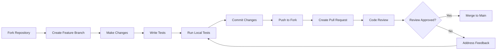
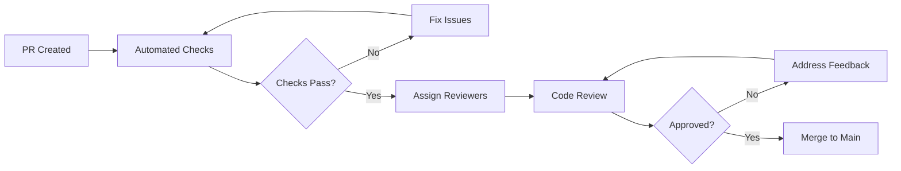

# Contributing Guidelines

Welcome to OpenFrame! This guide outlines the standards and procedures for contributing to the OpenFrame project, ensuring consistent code quality and smooth collaboration.

## Getting Started

### Prerequisites for Contributors

Before contributing, ensure you have:

- **Development Environment**: Completed [Environment Setup](../setup/environment.md)
- **Local Instance**: Working OpenFrame deployment via [Local Development](../setup/local-development.md)
- **GitHub Account**: With access to the OpenFrame repository
- **Community Access**: Joined our OpenMSP Slack at https://www.openmsp.ai/

### Contribution Workflow



## Code Standards

### General Principles

1. **Consistency**: Follow established patterns in the codebase
2. **Clarity**: Write self-documenting code with meaningful names
3. **Simplicity**: Prefer simple solutions over complex ones
4. **Testing**: All new code must include appropriate tests
5. **Documentation**: Update documentation for user-facing changes

### Java/Spring Boot Standards

#### Code Style

Follow Google Java Style Guide with OpenFrame-specific modifications:

```java
// Good: Clear class structure and naming
@Service
@RequiredArgsConstructor
@Slf4j
public class DeviceManagementService {
    
    private final DeviceRepository deviceRepository;
    private final EventPublisher eventPublisher;
    private final CacheManager cacheManager;
    
    /**
     * Creates a new device with validation and event publishing.
     * 
     * @param request The device creation request
     * @param organizationId The organization ID for multi-tenant isolation
     * @return The created device with generated ID
     * @throws DeviceValidationException if device data is invalid
     * @throws DuplicateDeviceException if device already exists
     */
    @Transactional
    public DeviceResponse createDevice(CreateDeviceRequest request, String organizationId) {
        log.debug("Creating device {} for organization {}", request.getHostname(), organizationId);
        
        validateDeviceRequest(request);
        ensureDeviceDoesNotExist(request.getHostname(), organizationId);
        
        Device device = Device.builder()
            .hostname(request.getHostname())
            .organizationId(organizationId)
            .agentId(request.getAgentId())
            .metadata(request.getMetadata())
            .createdAt(Instant.now())
            .status(DeviceStatus.PENDING)
            .build();
            
        Device savedDevice = deviceRepository.save(device);
        
        // Clear cache for organization
        cacheManager.evict(DEVICES_CACHE, organizationId);
        
        // Publish creation event
        DeviceCreatedEvent event = DeviceCreatedEvent.builder()
            .deviceId(savedDevice.getId())
            .organizationId(organizationId)
            .timestamp(Instant.now())
            .build();
        eventPublisher.publishEvent(event);
        
        log.info("Successfully created device {} with ID {}", 
            savedDevice.getHostname(), savedDevice.getId());
            
        return DeviceMapper.toResponse(savedDevice);
    }
    
    private void validateDeviceRequest(CreateDeviceRequest request) {
        if (StringUtils.isBlank(request.getHostname())) {
            throw new DeviceValidationException("Hostname cannot be empty");
        }
        
        if (!isValidHostname(request.getHostname())) {
            throw new DeviceValidationException("Invalid hostname format");
        }
    }
    
    private boolean isValidHostname(String hostname) {
        return hostname.matches("^[a-zA-Z0-9][a-zA-Z0-9-]{1,61}[a-zA-Z0-9]$");
    }
}
```

#### Key Conventions

| Convention | Rule | Example |
|-----------|------|---------|
| **Class Naming** | PascalCase, descriptive | `DeviceManagementService` |
| **Method Naming** | camelCase, verb phrases | `createDevice()`, `validateInput()` |
| **Variable Naming** | camelCase, descriptive | `deviceRepository`, `createdDevice` |
| **Constants** | UPPER_SNAKE_CASE | `MAX_RETRY_ATTEMPTS = 3` |
| **Package Naming** | lowercase, hierarchical | `com.openframe.api.service.device` |

#### Architecture Patterns

```java
// Controller Layer - Thin, handles HTTP concerns
@RestController
@RequestMapping("/api/devices")
@RequiredArgsConstructor
@Validated
public class DeviceController {
    
    private final DeviceManagementService deviceService;
    
    @PostMapping
    public ResponseEntity<DeviceResponse> createDevice(
            @Valid @RequestBody CreateDeviceRequest request,
            @AuthenticationPrincipal AuthPrincipal principal) {
        
        DeviceResponse device = deviceService.createDevice(request, 
            principal.getOrganizationId());
        return ResponseEntity.status(HttpStatus.CREATED).body(device);
    }
}

// Service Layer - Business logic
@Service
public class DeviceManagementService {
    // Business logic implementation
}

// Repository Layer - Data access
@Repository
public interface DeviceRepository extends MongoRepository<Device, String> {
    List<Device> findByOrganizationId(String organizationId);
    boolean existsByHostnameAndOrganizationId(String hostname, String organizationId);
}
```

### TypeScript/Vue.js Standards

#### Code Style

Follow Vue 3 Composition API best practices:

```vue
<!-- Good: Component structure with TypeScript -->
<template>
  <div class="device-card" data-testid="device-card">
    <header class="device-card__header">
      <h3 class="device-card__title" data-testid="device-hostname">
        {{ device.hostname }}
      </h3>
      <DeviceStatusBadge 
        :status="device.status" 
        :last-seen="device.lastSeen"
        data-testid="device-status"
      />
    </header>
    
    <main class="device-card__content">
      <DeviceMetrics 
        v-if="showMetrics" 
        :device-id="device.id"
        @metrics-loaded="onMetricsLoaded"
      />
      
      <DeviceActions 
        :device="device"
        :can-edit="canEditDevice"
        @edit="$emit('edit', device)"
        @delete="$emit('delete', device)"
      />
    </main>
  </div>
</template>

<script setup lang="ts">
import { computed, ref } from 'vue'
import type { Device, DeviceMetrics } from '@/types/device'
import { usePermissions } from '@/composables/usePermissions'
import DeviceStatusBadge from './DeviceStatusBadge.vue'
import DeviceMetrics from './DeviceMetrics.vue'
import DeviceActions from './DeviceActions.vue'

// Props with proper TypeScript typing
interface Props {
  device: Device
  showMetrics?: boolean
}

const props = withDefaults(defineProps<Props>(), {
  showMetrics: true
})

// Emits with proper typing
interface Emits {
  edit: [device: Device]
  delete: [device: Device]
  metricsLoaded: [metrics: DeviceMetrics]
}

const emit = defineEmits<Emits>()

// Composables for business logic
const { hasPermission } = usePermissions()

// Computed properties
const canEditDevice = computed(() => 
  hasPermission('device:write') && props.device.status !== 'deleted'
)

// Event handlers
const onMetricsLoaded = (metrics: DeviceMetrics) => {
  emit('metricsLoaded', metrics)
}
</script>

<style scoped>
.device-card {
  @apply bg-white rounded-lg shadow-sm border border-gray-200 p-4;
  
  &__header {
    @apply flex items-center justify-between mb-4;
  }
  
  &__title {
    @apply text-lg font-semibold text-gray-900;
  }
  
  &__content {
    @apply space-y-3;
  }
}
</style>
```

#### TypeScript Conventions

```typescript
// Good: Proper type definitions
interface Device {
  readonly id: string
  readonly hostname: string
  readonly organizationId: string
  status: DeviceStatus
  lastSeen: string
  metadata: Record<string, unknown>
  metrics?: DeviceMetrics
}

// Good: Enum usage
enum DeviceStatus {
  ONLINE = 'online',
  OFFLINE = 'offline',
  UNKNOWN = 'unknown',
  DELETED = 'deleted'
}

// Good: Generic type usage
interface ApiResponse<T> {
  data: T
  success: boolean
  errors?: string[]
}

// Good: Composable pattern
export function useDevices() {
  const devices = ref<Device[]>([])
  const loading = ref(false)
  const error = ref<string | null>(null)
  
  const fetchDevices = async (organizationId: string): Promise<void> => {
    loading.value = true
    error.value = null
    
    try {
      const response = await deviceApi.getDevices(organizationId)
      devices.value = response.data
    } catch (err) {
      error.value = err instanceof Error ? err.message : 'Unknown error'
      console.error('Failed to fetch devices:', err)
    } finally {
      loading.value = false
    }
  }
  
  return {
    devices: readonly(devices),
    loading: readonly(loading),
    error: readonly(error),
    fetchDevices,
    refetch: () => fetchDevices(devices.value[0]?.organizationId || '')
  }
}
```

### Rust Standards

#### Code Style

Follow Rust standard conventions:

```rust
//! Device management module for OpenFrame client agent.
//! 
//! This module handles device information collection, metric gathering,
//! and communication with the OpenFrame API server.

use std::collections::HashMap;
use std::time::{Duration, SystemTime};
use anyhow::{Context, Result};
use serde::{Deserialize, Serialize};
use tokio::time;
use tracing::{debug, error, info, warn};

use crate::api::ApiClient;
use crate::models::{Device, DeviceMetrics, RegistrationRequest};
use crate::platform::SystemInfo;

/// Device service handles all device-related operations for the OpenFrame agent.
/// 
/// This includes device registration, metric collection, and status reporting
/// to the OpenFrame API server.
#[derive(Debug)]
pub struct DeviceService {
    api_client: ApiClient,
    system_info: SystemInfo,
    device_id: Option<String>,
    collection_interval: Duration,
}

impl DeviceService {
    /// Creates a new device service instance.
    /// 
    /// # Arguments
    /// 
    /// * `api_client` - Configured API client for server communication
    /// * `collection_interval` - How often to collect and send metrics
    /// 
    /// # Examples
    /// 
    /// ```rust
    /// use std::time::Duration;
    /// let service = DeviceService::new(api_client, Duration::from_secs(60));
    /// ```
    pub fn new(api_client: ApiClient, collection_interval: Duration) -> Self {
        Self {
            api_client,
            system_info: SystemInfo::new(),
            device_id: None,
            collection_interval,
        }
    }
    
    /// Registers this device with the OpenFrame server.
    /// 
    /// This method collects system information and sends a registration
    /// request to the server. On success, the device ID is stored for
    /// future communications.
    /// 
    /// # Errors
    /// 
    /// Returns an error if:
    /// - System information cannot be collected
    /// - Network communication fails
    /// - Server rejects the registration
    /// 
    /// # Examples
    /// 
    /// ```rust
    /// match service.register_device().await {
    ///     Ok(device_id) => println!("Registered as device: {}", device_id),
    ///     Err(e) => eprintln!("Registration failed: {}", e),
    /// }
    /// ```
    pub async fn register_device(&mut self) -> Result<String> {
        info!("Starting device registration process");
        
        let device_info = self.collect_device_info()
            .await
            .context("Failed to collect device information")?;
            
        let registration_request = RegistrationRequest {
            hostname: device_info.hostname,
            operating_system: device_info.operating_system,
            architecture: device_info.architecture,
            total_memory: device_info.total_memory,
            total_disk: device_info.total_disk,
            agent_version: env!("CARGO_PKG_VERSION").to_string(),
            metadata: device_info.metadata,
        };
        
        debug!("Sending registration request: {:?}", registration_request);
        
        match self.api_client.register_device(registration_request).await {
            Ok(response) => {
                self.device_id = Some(response.device_id.clone());
                info!("Successfully registered device with ID: {}", response.device_id);
                Ok(response.device_id)
            }
            Err(e) => {
                error!("Device registration failed: {:?}", e);
                Err(e).context("Device registration failed")
            }
        }
    }
    
    /// Starts the metric collection loop.
    /// 
    /// This method runs indefinitely, collecting system metrics at the
    /// configured interval and sending them to the OpenFrame server.
    /// 
    /// # Errors
    /// 
    /// Logs errors but continues operation. Only returns if a fatal
    /// error occurs that prevents further operation.
    pub async fn start_metric_collection(&self) -> Result<()> {
        let device_id = self.device_id.as_ref()
            .ok_or_else(|| anyhow::anyhow!("Device must be registered before starting metrics"))?;
            
        info!("Starting metric collection for device {}", device_id);
        
        let mut interval = time::interval(self.collection_interval);
        
        loop {
            interval.tick().await;
            
            match self.collect_and_send_metrics(device_id).await {
                Ok(_) => debug!("Successfully sent metrics"),
                Err(e) => {
                    warn!("Failed to collect or send metrics: {:?}", e);
                    // Continue operation despite errors
                }
            }
        }
    }
    
    /// Collects current device information.
    async fn collect_device_info(&self) -> Result<Device> {
        debug!("Collecting device information");
        
        let hostname = self.system_info.get_hostname()
            .context("Failed to get hostname")?;
            
        let os_info = self.system_info.get_os_info()
            .context("Failed to get OS information")?;
            
        let hardware_info = self.system_info.get_hardware_info()
            .context("Failed to get hardware information")?;
            
        let mut metadata = HashMap::new();
        metadata.insert("collection_time".to_string(), 
            SystemTime::now()
                .duration_since(SystemTime::UNIX_EPOCH)?
                .as_secs()
                .to_string());
                
        Ok(Device {
            hostname,
            operating_system: os_info.name,
            architecture: hardware_info.architecture,
            total_memory: hardware_info.total_memory,
            total_disk: hardware_info.total_disk,
            metadata,
        })
    }
    
    /// Collects metrics and sends them to the server.
    async fn collect_and_send_metrics(&self, device_id: &str) -> Result<()> {
        let metrics = self.collect_current_metrics().await?;
        
        self.api_client.send_metrics(device_id, metrics).await
            .context("Failed to send metrics to server")
    }
    
    /// Collects current system performance metrics.
    async fn collect_current_metrics(&self) -> Result<DeviceMetrics> {
        debug!("Collecting current system metrics");
        
        let cpu_usage = self.system_info.get_cpu_usage()
            .context("Failed to get CPU usage")?;
            
        let memory_info = self.system_info.get_memory_info()
            .context("Failed to get memory information")?;
            
        let disk_info = self.system_info.get_disk_info()
            .context("Failed to get disk information")?;
            
        Ok(DeviceMetrics {
            timestamp: SystemTime::now(),
            cpu_usage,
            memory_usage: (memory_info.used as f64 / memory_info.total as f64) * 100.0,
            memory_total: memory_info.total,
            memory_used: memory_info.used,
            disk_usage: (disk_info.used as f64 / disk_info.total as f64) * 100.0,
            disk_total: disk_info.total,
            disk_used: disk_info.used,
            network_bytes_in: disk_info.bytes_received,
            network_bytes_out: disk_info.bytes_sent,
        })
    }
}

// Error handling types
#[derive(Debug, thiserror::Error)]
pub enum DeviceServiceError {
    #[error("Device registration failed: {0}")]
    RegistrationFailed(String),
    
    #[error("Metric collection failed: {0}")]
    MetricCollectionFailed(String),
    
    #[error("System information unavailable: {0}")]
    SystemInfoUnavailable(String),
    
    #[error("API communication error: {0}")]
    ApiError(#[from] crate::api::ApiError),
}

#[cfg(test)]
mod tests {
    use super::*;
    use std::time::Duration;
    use tokio_test;
    
    #[tokio::test]
    async fn test_device_registration() {
        // Test device registration logic
        let mock_client = ApiClient::mock();
        let mut service = DeviceService::new(mock_client, Duration::from_secs(60));
        
        let result = service.register_device().await;
        assert!(result.is_ok());
        assert!(service.device_id.is_some());
    }
    
    #[tokio::test]
    async fn test_metric_collection() {
        // Test metric collection
        let service = DeviceService::new(
            ApiClient::mock(), 
            Duration::from_secs(60)
        );
        
        let metrics = service.collect_current_metrics().await;
        assert!(metrics.is_ok());
        
        let metrics = metrics.unwrap();
        assert!(metrics.cpu_usage >= 0.0 && metrics.cpu_usage <= 100.0);
        assert!(metrics.memory_usage >= 0.0 && metrics.memory_usage <= 100.0);
    }
}
```

## Git Workflow and Branch Management

### Branch Naming Convention

| Branch Type | Pattern | Example | Purpose |
|-------------|---------|---------|---------|
| **Feature** | `feature/description` | `feature/device-management` | New features |
| **Bug Fix** | `fix/description` | `fix/login-error-handling` | Bug fixes |
| **Hotfix** | `hotfix/description` | `hotfix/security-patch` | Critical fixes |
| **Chore** | `chore/description` | `chore/update-dependencies` | Maintenance |
| **Docs** | `docs/description` | `docs/api-documentation` | Documentation only |

### Commit Message Format

Follow [Conventional Commits](https://www.conventionalcommits.org/) specification:

```bash
# Format: type(scope): description

# Examples:
feat(api): add device filtering by organization
fix(frontend): resolve device status update bug
docs(readme): update installation instructions
test(device): add unit tests for device service
refactor(auth): simplify JWT token validation
perf(query): optimize device search performance
chore(deps): update Spring Boot to 3.3.1

# Breaking changes:
feat(api)!: change device API response format

BREAKING CHANGE: Device API now returns array instead of object
```

### Pull Request Process

#### 1. Before Creating PR

```bash
# Ensure branch is up to date
git checkout main
git pull origin main
git checkout feature/your-feature
git rebase main

# Run tests locally
mvn test                                    # Backend tests
cd openframe/services/openframe-frontend && npm run test:unit  # Frontend tests
cd clients/openframe-client && cargo test  # Rust tests

# Check code quality
mvn spotless:check                          # Java formatting
npm run lint                               # Frontend linting
cargo clippy                               # Rust linting
```

#### 2. PR Template

```markdown
## Description
Brief description of the changes made.

## Type of Change
- [ ] Bug fix (non-breaking change that fixes an issue)
- [ ] New feature (non-breaking change that adds functionality)
- [ ] Breaking change (fix or feature that would cause existing functionality to not work as expected)
- [ ] Documentation update
- [ ] Performance improvement
- [ ] Code refactoring

## Related Issues
- Fixes #123
- Related to #456

## Testing
- [ ] Unit tests added/updated
- [ ] Integration tests added/updated
- [ ] Manual testing completed
- [ ] E2E tests pass

## Screenshots/Videos (if applicable)
Add screenshots or videos demonstrating the changes.

## Checklist
- [ ] Code follows project style guidelines
- [ ] Self-review completed
- [ ] Comments added for hard-to-understand areas
- [ ] Documentation updated
- [ ] No new warnings introduced
- [ ] Tests added and passing
- [ ] Changes work locally

## Deployment Notes
Any special considerations for deployment.

## Breaking Changes
List any breaking changes and migration notes.
```

#### 3. Code Review Process



**Review Criteria:**
- Code quality and style
- Test coverage and quality
- Documentation updates
- Performance implications
- Security considerations
- Breaking change impact

## Documentation Standards

### Code Documentation

#### Java Documentation

```java
/**
 * Service for managing device operations in a multi-tenant environment.
 * 
 * This service provides comprehensive device management capabilities including
 * creation, updates, deletion, and metric collection. All operations are
 * scoped to the authenticated user's organization for proper tenant isolation.
 * 
 * @author OpenFrame Team
 * @since 1.0.0
 * @see DeviceRepository
 * @see DeviceMetricsService
 */
@Service
public class DeviceManagementService {
    
    /**
     * Creates a new device with the provided configuration.
     * 
     * This method performs validation, checks for duplicates, and publishes
     * appropriate events upon successful creation. The device will be created
     * in a PENDING status until the agent connects and confirms registration.
     * 
     * @param request the device creation request containing hostname and metadata
     * @param organizationId the organization ID for multi-tenant isolation
     * @return the created device with generated ID and timestamps
     * @throws DeviceValidationException if the request contains invalid data
     * @throws DuplicateDeviceException if a device with the same hostname exists
     * @throws IllegalArgumentException if organizationId is null or empty
     * 
     * @since 1.0.0
     */
    @Transactional
    public DeviceResponse createDevice(CreateDeviceRequest request, String organizationId) {
        // Implementation...
    }
}
```

#### TypeScript Documentation

```typescript
/**
 * Composable for managing device operations and state.
 * 
 * Provides reactive device management with automatic caching,
 * error handling, and real-time updates via WebSocket connections.
 * 
 * @example
 * ```vue
 * <script setup>
 * const { devices, loading, error, createDevice } = useDevices()
 * 
 * // Fetch devices for current organization
 * await devices.fetch()
 * 
 * // Create new device
 * const newDevice = await createDevice({
 *   hostname: 'new-device',
 *   metadata: { os: 'Linux' }
 * })
 * </script>
 * ```
 * 
 * @returns Device management interface
 */
export function useDevices() {
  /**
   * Reactive array of devices for the current organization.
   * Automatically updates when devices are added, modified, or removed.
   */
  const devices = ref<Device[]>([])
  
  /**
   * Indicates if any device operation is currently in progress.
   * Useful for showing loading indicators in the UI.
   */
  const loading = ref(false)
  
  /**
   * Creates a new device with the provided configuration.
   * 
   * @param deviceData - The device configuration
   * @returns Promise resolving to the created device
   * @throws {ValidationError} When device data is invalid
   * @throws {DuplicateError} When device hostname already exists
   */
  const createDevice = async (deviceData: CreateDeviceInput): Promise<Device> => {
    // Implementation...
  }
  
  return {
    devices: readonly(devices),
    loading: readonly(loading),
    createDevice
  }
}
```

### API Documentation

#### GraphQL Schema Documentation

```graphql
"""
Represents a managed device in the OpenFrame platform.

Devices are endpoints (computers, servers, mobile devices) that are
monitored and managed by the OpenFrame agent. Each device belongs to
exactly one organization for proper multi-tenant isolation.
"""
type Device {
  """Unique identifier for the device"""
  id: ID!
  
  """
  Human-readable hostname for the device.
  Must be unique within the organization.
  """
  hostname: String!
  
  """Current operational status of the device"""
  status: DeviceStatus!
  
  """
  ISO 8601 timestamp of the last communication from the device agent.
  Used to determine if the device is online or offline.
  """
  lastSeen: DateTime
  
  """
  Key-value pairs containing additional device information.
  Common keys include 'os', 'version', 'location', 'environment'.
  """
  metadata: JSON
  
  """
  Current performance metrics for the device.
  Null if metrics are not available or collection is disabled.
  """
  metrics: DeviceMetrics
  
  """
  Organization that owns this device.
  Used for multi-tenant data isolation.
  """
  organization: Organization!
}

"""
Input type for creating a new device.

All fields are validated on the server side. The hostname must be
unique within the organization and follow DNS hostname conventions.
"""
input CreateDeviceInput {
  """
  The hostname for the new device.
  
  Must be 1-253 characters, containing only letters, numbers, and hyphens.
  Cannot start or end with a hyphen.
  """
  hostname: String!
  
  """
  Unique identifier from the device agent.
  Used to link the device record with agent communications.
  """
  agentId: String!
  
  """
  Optional metadata for the device.
  Useful for storing environment, location, or configuration information.
  """
  metadata: JSON
}
```

## Testing Requirements

### Test Coverage Expectations

| Component | Minimum Coverage | New Code Coverage |
|-----------|------------------|-------------------|
| **Service Layer** | 85% | 95% |
| **Controller Layer** | 80% | 90% |
| **Repository Layer** | 75% | 85% |
| **GraphQL Resolvers** | 90% | 95% |
| **Vue Components** | 75% | 85% |
| **Composables** | 85% | 95% |
| **Rust Core Logic** | 80% | 90% |

### Test Requirements for PRs

```bash
# All these must pass for PR approval:

# 1. Unit tests
mvn test                                    # Backend
npm run test:unit                          # Frontend
cargo test                                 # Rust

# 2. Integration tests  
mvn verify -P integration-test             # Backend integration

# 3. Code quality checks
mvn spotless:check                         # Java formatting
npm run lint                              # Frontend linting
cargo clippy -- -D warnings              # Rust linting

# 4. Security scans
mvn dependency-check:check                 # Java dependencies
npm audit --audit-level=moderate          # Frontend dependencies
cargo audit                               # Rust dependencies

# 5. Performance tests (for performance-related changes)
k6 run tests/performance/api-load-test.js
```

### Writing Good Tests

#### Test Structure (AAA Pattern)

```java
@Test
@DisplayName("Should create device when valid data provided")
void shouldCreateDeviceWhenValidDataProvided() {
    // Arrange - Set up test data and mocks
    String organizationId = "test-org";
    CreateDeviceRequest request = CreateDeviceRequest.builder()
        .hostname("test-device")
        .agentId("test-agent")
        .metadata(Map.of("environment", "test"))
        .build();
        
    when(deviceRepository.existsByHostnameAndOrganizationId(
        "test-device", organizationId))
        .thenReturn(false);
        
    Device expectedDevice = Device.builder()
        .id("generated-id")
        .hostname("test-device")
        .organizationId(organizationId)
        .build();
        
    when(deviceRepository.save(any(Device.class)))
        .thenReturn(expectedDevice);
    
    // Act - Execute the method under test
    DeviceResponse result = deviceService.createDevice(request, organizationId);
    
    // Assert - Verify the results
    assertThat(result)
        .isNotNull()
        .satisfies(device -> {
            assertThat(device.getId()).isEqualTo("generated-id");
            assertThat(device.getHostname()).isEqualTo("test-device");
            assertThat(device.getOrganizationId()).isEqualTo(organizationId);
        });
        
    // Verify interactions
    verify(deviceRepository).save(argThat(device -> 
        device.getHostname().equals("test-device") &&
        device.getOrganizationId().equals(organizationId) &&
        device.getCreatedAt() != null));
        
    verify(eventPublisher).publishEvent(any(DeviceCreatedEvent.class));
}
```

## Security Guidelines

### Security Checklist

- [ ] **Input Validation**: All user inputs validated and sanitized
- [ ] **Authentication**: Proper authentication required for protected endpoints
- [ ] **Authorization**: User permissions checked for sensitive operations
- [ ] **SQL Injection**: Parameterized queries or ORM used
- [ ] **XSS Protection**: Output encoding applied to user content
- [ ] **CSRF Protection**: CSRF tokens implemented for state-changing operations
- [ ] **Sensitive Data**: No secrets in code, logs, or error messages
- [ ] **Dependencies**: All dependencies scanned for vulnerabilities

### Common Security Patterns

```java
// Good: Input validation and sanitization
@PostMapping("/api/devices")
public ResponseEntity<DeviceResponse> createDevice(
        @Valid @RequestBody CreateDeviceRequest request,
        @AuthenticationPrincipal AuthPrincipal principal) {
    
    // Validate organization access
    if (!authService.hasOrganizationAccess(principal, request.getOrganizationId())) {
        throw new ForbiddenException("Access denied to organization");
    }
    
    // Sanitize input
    String sanitizedHostname = InputSanitizer.sanitizeHostname(request.getHostname());
    
    // Use service layer with proper authorization
    DeviceResponse device = deviceService.createDevice(
        request.withHostname(sanitizedHostname), 
        principal.getOrganizationId());
        
    return ResponseEntity.ok(device);
}

// Good: Parameterized queries
@Query("{ 'organizationId': ?0, 'hostname': { $regex: ?1, $options: 'i' } }")
List<Device> findByOrganizationAndHostnamePattern(String organizationId, String pattern);

// Good: Secret management
@Value("${openframe.jwt.secret}")
private String jwtSecret; // Injected from secure configuration

// Bad: Hardcoded secrets
private String jwtSecret = "hardcoded-secret"; // ❌ Never do this
```

## Performance Guidelines

### Performance Requirements

| Operation | Target | Measurement |
|-----------|--------|-------------|
| **API Response** | < 200ms | P95 response time |
| **Database Query** | < 50ms | P95 query time |
| **Page Load** | < 3s | First Contentful Paint |
| **Bundle Size** | < 2MB | Gzipped frontend bundle |

### Optimization Patterns

```java
// Good: Caching expensive operations
@Cacheable(value = "devices", key = "#organizationId")
public List<Device> getDevicesByOrganization(String organizationId) {
    return deviceRepository.findByOrganizationId(organizationId);
}

@CacheEvict(value = "devices", key = "#organizationId")
public DeviceResponse updateDevice(String deviceId, UpdateDeviceRequest request, 
                                  String organizationId) {
    // Update logic
}

// Good: Pagination for large datasets
public Page<Device> getDevices(String organizationId, Pageable pageable) {
    return deviceRepository.findByOrganizationId(organizationId, pageable);
}

// Good: Asynchronous processing
@Async
@EventListener
public void handleDeviceCreated(DeviceCreatedEvent event) {
    // Heavy processing in background
    deviceMetricsService.initializeMetricsCollection(event.getDeviceId());
}
```

## Release Process

### Version Management

OpenFrame follows [Semantic Versioning](https://semver.org/):

- **Major** (1.0.0): Breaking changes
- **Minor** (1.1.0): New features, backward compatible
- **Patch** (1.0.1): Bug fixes, backward compatible

### Release Checklist

#### Pre-Release
- [ ] All tests passing in CI
- [ ] Documentation updated
- [ ] Breaking changes documented
- [ ] Migration scripts prepared (if needed)
- [ ] Security review completed
- [ ] Performance benchmarks validated

#### Release Process
- [ ] Create release branch: `release/v1.2.0`
- [ ] Update version numbers
- [ ] Update CHANGELOG.md
- [ ] Tag release: `git tag v1.2.0`
- [ ] Deploy to staging environment
- [ ] Run full test suite
- [ ] Deploy to production
- [ ] Monitor for issues

#### Post-Release
- [ ] Merge release branch to main
- [ ] Update documentation website
- [ ] Announce release in community channels
- [ ] Close related GitHub issues
- [ ] Archive release artifacts

## Getting Help

### Community Resources

- **OpenMSP Slack**: https://www.openmsp.ai/ - Real-time community support
- **GitHub Issues**: Bug reports and feature requests
- **GitHub Discussions**: General questions and discussions
- **Documentation**: Comprehensive guides and API reference

### Code Review Process

When your PR is ready:

1. **Self-Review**: Review your own code first
2. **Automated Checks**: Ensure all CI checks pass
3. **Request Review**: Tag appropriate reviewers
4. **Address Feedback**: Respond to review comments promptly
5. **Merge**: Once approved, merge using "Squash and merge"

### Recognition

Contributors will be recognized through:
- **Contributors List**: Added to project documentation
- **Release Notes**: Contributions highlighted in releases
- **Community Highlights**: Featured in community updates

---

Thank you for contributing to OpenFrame! Your efforts help build a better MSP platform for everyone. If you have questions about these guidelines, please reach out on our OpenMSP Slack community.