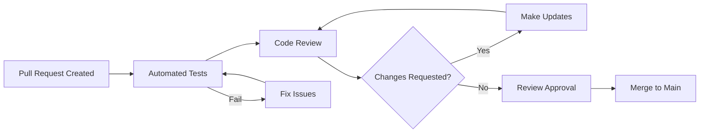

# Contributing Guidelines

Welcome to OpenFrame! We're excited that you're interested in contributing to the project. This guide will help you understand our development process, coding standards, and how to submit contributions effectively.

## Getting Started

### Before You Contribute

1. **Join our community**: Connect with us on [OpenMSP Slack](https://join.slack.com/t/openmsp/shared_invite/zt-36bl7mx0h-3~U2nFH6nqHqoTPXMaHEHA)
2. **Read the documentation**: Familiarize yourself with the [Architecture Overview](../architecture/overview.md) and [Development Setup](../setup/environment.md)
3. **Set up your development environment**: Follow the [Local Development Guide](../setup/local-development.md)
4. **Understand our testing approach**: Review the [Testing Overview](../testing/overview.md)

### Ways to Contribute

- **Bug Reports**: Help us identify and fix issues
- **Feature Requests**: Suggest new capabilities
- **Code Contributions**: Submit bug fixes and new features
- **Documentation**: Improve guides, tutorials, and API documentation
- **Testing**: Add test coverage and improve test quality
- **Community Support**: Help other users in Slack and GitHub discussions

## Development Workflow

### 1. Issue Discovery and Planning

#### Finding Work

- **Good First Issues**: Look for issues labeled `good first issue`
- **Help Wanted**: Issues labeled `help wanted` need community assistance
- **Bug Reports**: Check issues labeled `bug` for problems to fix
- **Feature Requests**: Issues labeled `enhancement` for new features

#### Issue Discussion

Before starting work on significant changes:

1. **Comment on the issue** to express interest
2. **Discuss your approach** with maintainers
3. **Wait for approval** before starting implementation
4. **Ask questions** if requirements are unclear

### 2. Setting Up Your Development Environment

```bash
# Fork the repository on GitHub
# Then clone your fork locally
git clone https://github.com/YOUR_USERNAME/openframe-oss-tenant.git
cd openframe-oss-tenant

# Add upstream remote
git remote add upstream https://github.com/flamingo-stack/openframe-oss-tenant.git

# Install dependencies and start development environment
./scripts/dev-setup.sh
```

### 3. Branch Naming and Git Workflow

#### Branch Naming Conventions

Use descriptive branch names with prefixes:

```bash
# Feature branches
git checkout -b feature/add-device-bulk-import
git checkout -b feature/improve-dashboard-performance

# Bug fix branches  
git checkout -b fix/resolve-device-status-sync-issue
git checkout -b fix/correct-organization-deletion-bug

# Documentation branches
git checkout -b docs/update-api-documentation
git checkout -b docs/add-deployment-guide

# Refactoring branches
git checkout -b refactor/extract-device-service-interface
git checkout -b refactor/optimize-database-queries
```

#### Git Workflow

```bash
# 1. Create and switch to feature branch
git checkout -b feature/your-feature-name

# 2. Make your changes and commit frequently
git add .
git commit -m "feat: add initial device bulk import functionality"

# 3. Keep your branch up to date
git fetch upstream
git rebase upstream/main

# 4. Push your branch
git push origin feature/your-feature-name

# 5. Create Pull Request on GitHub
```

### 4. Code Style and Conventions

#### Java Code Style

OpenFrame follows the **Google Java Style Guide** with some custom rules:

```java
// Good: Proper class structure
@RestController
@RequestMapping("/api/v1/devices")
@RequiredArgsConstructor
@Slf4j
public class DeviceController {
    
    private final DeviceService deviceService;
    private final DeviceMapper deviceMapper;
    
    @GetMapping
    public ResponseEntity<PagedResponse<DeviceResponse>> getDevices(
            @RequestParam(defaultValue = "0") int page,
            @RequestParam(defaultValue = "20") int size,
            @RequestParam(required = false) String filter) {
        
        log.debug("Fetching devices: page={}, size={}, filter={}", page, size, filter);
        
        PageRequest pageRequest = PageRequest.of(page, size);
        Page<Device> devices = deviceService.findDevices(pageRequest, filter);
        
        return ResponseEntity.ok(deviceMapper.toPagedResponse(devices));
    }
}
```

#### Code Formatting

- **Line Length**: Maximum 100 characters
- **Indentation**: 4 spaces (no tabs)  
- **Import Organization**: Group imports and remove unused ones
- **JavaDoc**: Required for public methods and classes

```java
/**
 * Creates a new device in the system.
 * 
 * @param request the device creation request containing device details
 * @return the created device with generated ID and metadata
 * @throws OrganizationNotFoundException if the specified organization doesn't exist
 * @throws ValidationException if the request contains invalid data
 */
@PostMapping
public ResponseEntity<DeviceResponse> createDevice(
        @Valid @RequestBody CreateDeviceRequest request) {
    Device device = deviceService.createDevice(request);
    return ResponseEntity.status(HttpStatus.CREATED)
        .body(deviceMapper.toResponse(device));
}
```

#### TypeScript/React Code Style

Follow **Airbnb JavaScript Style Guide** with TypeScript extensions:

```typescript
// Good: Proper component structure
interface DeviceListProps {
  organizationId: string;
  onDeviceSelect?: (deviceId: string) => void;
  showFilters?: boolean;
}

export const DeviceList: React.FC<DeviceListProps> = ({
  organizationId,
  onDeviceSelect,
  showFilters = true,
}) => {
  const {
    data: devices,
    isLoading,
    error,
  } = useDevices({
    organizationId,
    enabled: !!organizationId,
  });

  const handleDeviceClick = useCallback(
    (deviceId: string) => {
      onDeviceSelect?.(deviceId);
    },
    [onDeviceSelect]
  );

  if (isLoading) {
    return <DeviceListSkeleton />;
  }

  if (error) {
    return <ErrorAlert error={error} />;
  }

  return (
    <div className="device-list" data-testid="device-list">
      {showFilters && <DeviceFilters />}
      <div className="device-grid">
        {devices?.map((device) => (
          <DeviceCard
            key={device.id}
            device={device}
            onClick={() => handleDeviceClick(device.id)}
          />
        ))}
      </div>
    </div>
  );
};
```

#### Rust Code Style

Follow **Rust standard formatting** with `rustfmt`:

```rust
// Good: Proper error handling and structure
use anyhow::{Context, Result};
use serde::{Deserialize, Serialize};
use tracing::{debug, error, info};

#[derive(Debug, Serialize, Deserialize)]
pub struct DeviceConfig {
    pub name: String,
    pub device_type: DeviceType,
    pub heartbeat_interval: u64,
}

impl DeviceConfig {
    pub fn from_file<P: AsRef<Path>>(path: P) -> Result<Self> {
        let contents = fs::read_to_string(&path)
            .with_context(|| format!("Failed to read config file: {:?}", path.as_ref()))?;
            
        let config: DeviceConfig = toml::from_str(&contents)
            .context("Failed to parse TOML configuration")?;
            
        debug!("Loaded device config: {:?}", config);
        Ok(config)
    }
    
    pub fn validate(&self) -> Result<()> {
        if self.name.is_empty() {
            anyhow::bail!("Device name cannot be empty");
        }
        
        if self.heartbeat_interval < 10 {
            anyhow::bail!("Heartbeat interval must be at least 10 seconds");
        }
        
        Ok(())
    }
}

#[cfg(test)]
mod tests {
    use super::*;
    use tempfile::NamedTempFile;
    
    #[test]
    fn test_device_config_validation() {
        let config = DeviceConfig {
            name: "test-device".to_string(),
            device_type: DeviceType::Workstation,
            heartbeat_interval: 30,
        };
        
        assert!(config.validate().is_ok());
    }
    
    #[test]
    fn test_device_config_invalid_name() {
        let config = DeviceConfig {
            name: String::new(),
            device_type: DeviceType::Server,
            heartbeat_interval: 30,
        };
        
        assert!(config.validate().is_err());
    }
}
```

### 5. Commit Message Format

OpenFrame uses **Conventional Commits** for clear, structured commit history:

#### Commit Message Structure

```
<type>[optional scope]: <description>

[optional body]

[optional footer(s)]
```

#### Commit Types

| Type | Description | Example |
|------|-------------|---------|
| **feat** | New feature | `feat: add device bulk import functionality` |
| **fix** | Bug fix | `fix: resolve device status sync issue` |
| **docs** | Documentation | `docs: update API documentation` |
| **style** | Formatting | `style: format Java code with Google style` |
| **refactor** | Code refactoring | `refactor: extract device service interface` |
| **test** | Adding tests | `test: add unit tests for device service` |
| **chore** | Maintenance | `chore: update Maven dependencies` |
| **perf** | Performance | `perf: optimize device query performance` |
| **ci** | CI/CD changes | `ci: add automated test coverage reporting` |

#### Good Commit Messages

```bash
# Good examples
git commit -m "feat(api): add GraphQL mutation for device creation"
git commit -m "fix(frontend): resolve device list pagination bug"
git commit -m "docs: add contributing guidelines"
git commit -m "test(service): increase device service test coverage"
git commit -m "refactor(data): optimize database query performance"

# With body and footer
git commit -m "feat(auth): implement SSO integration with Google

Add OAuth2 integration with Google Identity Provider to support
single sign-on for enterprise customers.

Closes #123
Breaking-change: Requires new environment variables for OAuth config"
```

#### Poor Commit Messages

```bash
# Avoid these
git commit -m "fix stuff"
git commit -m "update"  
git commit -m "working on devices"
git commit -m "forgot to add file"
```

### 6. Pull Request Process

#### Creating a Pull Request

1. **Push your branch** to your fork
2. **Create PR** from your fork to upstream `main`
3. **Fill out PR template** completely
4. **Link related issues** using `Closes #123` or `Fixes #456`
5. **Request reviews** from relevant maintainers

#### Pull Request Template

```markdown
## Description
Brief description of changes made.

## Type of Change
- [ ] Bug fix (non-breaking change which fixes an issue)
- [ ] New feature (non-breaking change which adds functionality)
- [ ] Breaking change (fix or feature that would cause existing functionality to not work as expected)
- [ ] Documentation update

## Related Issues
Closes #123
Fixes #456

## How Has This Been Tested?
- [ ] Unit tests
- [ ] Integration tests
- [ ] E2E tests
- [ ] Manual testing

## Checklist
- [ ] Code follows project style guidelines
- [ ] Self-review completed
- [ ] Code is commented, particularly in hard-to-understand areas
- [ ] Documentation updated
- [ ] Tests added/updated
- [ ] All tests pass
- [ ] No new warnings introduced
```

#### PR Review Process



#### Review Checklist

**For Authors:**
- [ ] Code is self-documenting with clear variable/method names
- [ ] Complex logic is commented
- [ ] Tests cover new functionality
- [ ] No debugging code left behind
- [ ] Performance impact considered
- [ ] Security implications reviewed

**For Reviewers:**
- [ ] Code solves the stated problem
- [ ] Implementation follows project patterns
- [ ] Edge cases are handled
- [ ] Error handling is appropriate
- [ ] Tests are comprehensive
- [ ] Documentation is updated

### 7. Testing Requirements

All contributions must include appropriate tests:

#### Test Coverage Requirements

| Component | Minimum Coverage | Test Types Required |
|-----------|-----------------|-------------------|
| **New Features** | 80% | Unit + Integration |
| **Bug Fixes** | 100% | Unit + Regression |
| **API Changes** | 90% | Unit + Integration + Contract |
| **UI Components** | 75% | Unit + Integration |

#### Testing Checklist

- [ ] **Unit tests** for business logic
- [ ] **Integration tests** for API endpoints  
- [ ] **E2E tests** for user workflows (when applicable)
- [ ] **Contract tests** for API changes
- [ ] **Performance tests** for performance-critical changes

```bash
# Run tests before submitting PR
mvn test                                      # Backend tests
cd openframe/services/openframe-frontend && npm test  # Frontend tests
cargo test                                    # Rust tests (if applicable)
```

### 8. Documentation Requirements

#### When Documentation is Required

- **New features**: User-facing functionality needs documentation
- **API changes**: Update API documentation and examples
- **Configuration changes**: Update deployment and setup guides
- **Breaking changes**: Migration guides and upgrade instructions

#### Types of Documentation

| Type | Location | When Required |
|------|----------|---------------|
| **Code Comments** | Inline | Complex logic, public APIs |
| **API Documentation** | OpenAPI/GraphQL | API changes |
| **User Guides** | `docs/` | New features |
| **Developer Docs** | `docs/development/` | Architecture changes |
| **README Updates** | Various | Project structure changes |

#### Documentation Standards

```java
/**
 * Service responsible for managing device lifecycle operations.
 * 
 * <p>This service handles device creation, updates, and deletion while ensuring
 * proper tenant isolation and audit logging.
 * 
 * @author OpenFrame Team
 * @since 1.0.0
 */
@Service
@Transactional
@RequiredArgsConstructor
public class DeviceService {
    
    /**
     * Creates a new device within the specified organization.
     * 
     * <p>The device will be created with a unique identifier and initial status
     * of PENDING. An audit log entry will be created for tracking purposes.
     * 
     * @param request the device creation request containing required fields
     * @return the created device with generated metadata
     * @throws OrganizationNotFoundException when the organization doesn't exist
     * @throws ValidationException when required fields are missing or invalid
     * @throws SecurityException when user lacks permission to create devices
     */
    public Device createDevice(CreateDeviceRequest request) {
        // Implementation
    }
}
```

## Code Quality Standards

### Automated Quality Checks

Every PR is automatically checked for:

- **Test Coverage**: Minimum coverage thresholds
- **Code Style**: Checkstyle for Java, ESLint for TypeScript
- **Security**: OWASP dependency check and SAST
- **Performance**: Build time and test execution time
- **Documentation**: Required documentation presence

### Quality Gates

```yaml
# Quality gates that must pass
sonarqube:
  coverage: ">= 80%"
  duplicated_lines: "< 3%"
  maintainability_rating: "A"
  reliability_rating: "A"  
  security_rating: "A"
  
checkstyle:
  violations: "0"
  
tests:
  success_rate: "100%"
  max_duration: "10 minutes"
```

### Performance Standards

- **Build time**: Should not increase by more than 10%
- **Test execution**: New tests should complete in reasonable time
- **API response time**: New endpoints should respond within SLA
- **Memory usage**: No significant memory leaks

## Community Standards

### Code of Conduct

OpenFrame follows the [Contributor Covenant Code of Conduct](https://www.contributor-covenant.org/). Key principles:

- **Be respectful**: Treat everyone with respect and kindness
- **Be inclusive**: Welcome contributions from all backgrounds
- **Be constructive**: Focus on helping and improving
- **Be professional**: Maintain professional communication

### Communication Channels

| Channel | Purpose | Response Time |
|---------|---------|---------------|
| **GitHub Issues** | Bug reports, feature requests | 2-3 business days |
| **GitHub Discussions** | Questions, ideas | 1-2 business days |
| **Slack #general** | Community chat | Real-time |
| **Slack #development** | Development questions | 4-8 hours |
| **Slack #help** | User support | 2-4 hours |

### Getting Help

**Before Asking for Help:**
1. Search existing issues and discussions
2. Check the documentation
3. Review recent commits for similar changes

**When Asking for Help:**
1. **Be specific**: Describe exactly what you're trying to do
2. **Provide context**: Share relevant code, error messages, environment
3. **Show effort**: Demonstrate what you've already tried
4. **Be patient**: Allow time for community response

## Release Process

### Versioning Strategy

OpenFrame uses **Semantic Versioning (SemVer)**:

- **MAJOR** (1.0.0): Breaking changes
- **MINOR** (0.1.0): New features, backward compatible
- **PATCH** (0.0.1): Bug fixes, backward compatible

### Release Cycle

- **Major releases**: Every 6-12 months
- **Minor releases**: Monthly
- **Patch releases**: As needed for critical bugs
- **Preview releases**: Weekly development builds

### Contribution Recognition

Contributors are recognized through:

- **CONTRIBUTORS.md**: All contributors listed
- **Release notes**: Significant contributions highlighted
- **GitHub achievements**: Badges and recognition
- **Community spotlight**: Featured in newsletters

## Advanced Contributing

### Becoming a Maintainer

Maintainers are trusted community members who:

- Review and merge pull requests
- Participate in architectural decisions
- Mentor new contributors
- Help with release management

**Path to Maintainership:**
1. Consistent quality contributions over 6+ months
2. Demonstrated understanding of project architecture
3. Active participation in code reviews
4. Community involvement and mentoring
5. Nomination by existing maintainers

### Special Interest Groups (SIGs)

Join specialized groups focused on specific areas:

- **SIG-Security**: Security features and vulnerability management
- **SIG-Performance**: Performance optimization and monitoring
- **SIG-UI/UX**: Frontend and user experience improvements
- **SIG-Integrations**: External tool integrations and APIs
- **SIG-Documentation**: Documentation and learning resources

## Troubleshooting Common Issues

### Build Issues

```bash
# Clear caches and rebuild
mvn clean install -U
rm -rf ~/.m2/repository/com/openframe
mvn clean install

# Frontend build issues
cd openframe/services/openframe-frontend
rm -rf node_modules package-lock.json
npm install
npm run build
```

### Test Issues

```bash
# Run specific failing test
mvn test -Dtest="DeviceServiceTest#shouldCreateDevice"

# Run tests with debug information
mvn test -Dmaven.surefire.debug

# Skip tests temporarily
mvn install -DskipTests
```

### Git Issues

```bash
# Reset your branch to upstream
git fetch upstream
git reset --hard upstream/main

# Fix commit message
git commit --amend -m "new commit message"

# Squash commits before PR
git rebase -i HEAD~3
```

## Resources and References

### Documentation

- **[Architecture Overview](../architecture/overview.md)**: System design and patterns
- **[Testing Guide](../testing/overview.md)**: Testing strategies and examples
- **[Development Setup](../setup/environment.md)**: Environment configuration

### External Resources

- **[Conventional Commits](https://www.conventionalcommits.org/)**: Commit message format
- **[Google Java Style](https://google.github.io/styleguide/javaguide.html)**: Java coding standards
- **[Airbnb JavaScript Style](https://github.com/airbnb/javascript)**: TypeScript/React standards
- **[Semantic Versioning](https://semver.org/)**: Versioning strategy

### Community Links

- **[OpenMSP Slack](https://join.slack.com/t/openmsp/shared_invite/zt-36bl7mx0h-3~U2nFH6nqHqoTPXMaHEHA)**: Real-time community support
- **[GitHub Repository](https://github.com/flamingo-stack/openframe-oss-tenant)**: Source code and issues
- **[Flamingo Website](https://flamingo.run)**: Company and product information

---

**Thank you for contributing to OpenFrame!** Your efforts help build a better platform for MSPs worldwide. If you have questions about these guidelines, please reach out in our Slack community.