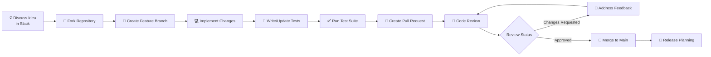
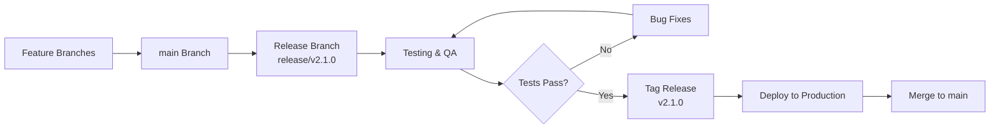

# Contributing Guidelines

Welcome to the OpenFrame contributor community! This guide outlines our development process, code standards, and best practices for contributing to the platform. We appreciate your interest in making OpenFrame better for everyone.

## Getting Started

### Before You Begin

1. **Join our community**: [OpenMSP Slack](https://join.slack.com/t/openmsp/shared_invite/zt-36bl7mx0h-3~U2nFH6nqHqoTPXMaHEHA)
2. **Read the architecture**: [Architecture Overview](../architecture/overview.md)
3. **Set up your environment**: [Environment Setup](../setup/environment.md)
4. **Understand our testing**: [Testing Overview](../testing/overview.md)

### Ways to Contribute

| Contribution Type | Description | Getting Started |
|------------------|-------------|-----------------|
| **🐛 Bug Reports** | Report issues and bugs | Use our Slack community (no GitHub Issues) |
| **✨ Feature Requests** | Suggest new capabilities | Discuss in #feature-requests channel |
| **💻 Code Contributions** | Fix bugs, add features | Follow this guide |
| **📚 Documentation** | Improve guides and docs | Submit PRs for documentation |
| **🧪 Testing** | Help with QA and testing | Run test suites, report failures |
| **🎨 Design** | UI/UX improvements | Design reviews in #design channel |

> 📋 **Important**: We manage all issues and discussions through our [OpenMSP Slack Community](https://join.slack.com/t/openmsp/shared_invite/zt-36bl7mx0h-3~U2nFH6nqHqoTPXMaHEHA), not GitHub Issues or GitHub Discussions.

## Development Process

### Contribution Workflow



### Step-by-Step Process

#### 1. Discuss Your Contribution

**Before writing code**, discuss your idea in our Slack community:

- **#general** - General questions and discussions
- **#feature-requests** - New feature proposals  
- **#bug-reports** - Bug reports and troubleshooting
- **#development** - Technical implementation discussions
- **#architecture** - Design and architecture questions

This helps ensure your contribution aligns with project goals and avoids duplicate work.

#### 2. Fork and Clone

```bash
# Fork the repository on GitHub, then clone your fork
git clone https://github.com/YOUR_USERNAME/openframe.git
cd openframe

# Add upstream remote for staying up-to-date
git remote add upstream https://github.com/flamingo-run/openframe.git

# Verify remotes
git remote -v
```

#### 3. Create a Feature Branch

Use descriptive branch names that follow our naming convention:

```bash
# Branch naming patterns:
# feature/description-of-feature
# bugfix/description-of-fix
# docs/description-of-docs-change
# refactor/description-of-refactor

# Examples:
git checkout -b feature/organization-bulk-operations
git checkout -b bugfix/device-status-update-race-condition
git checkout -b docs/improve-api-documentation
```

#### 4. Make Your Changes

Follow our [code standards](#code-standards) while implementing:

- **Write clean, readable code** with meaningful names
- **Follow existing patterns** in the codebase
- **Add appropriate comments** for complex logic
- **Update documentation** if needed
- **Maintain backward compatibility** when possible

#### 5. Write Tests

Every contribution must include appropriate tests:

```bash
# Backend: Add/update Java tests
# Location: src/test/java/...
mvn test -Dtest=YourNewTestClass

# Frontend: Add/update TypeScript tests  
# Location: src/__tests__/...
npm run test YourComponent.test.ts

# Rust Client: Add/update Rust tests
# Location: tests/...
cargo test your_new_test
```

#### 6. Run the Full Test Suite

Ensure all tests pass before submitting:

```bash
# Run all tests
./scripts/test-all.sh

# Or run individual test suites
mvn test                    # Backend
npm run test               # Frontend
cargo test                 # Rust client
```

#### 7. Commit Your Changes

Use our commit message format based on [Conventional Commits](https://www.conventionalcommits.org/):

```bash
# Commit message format:
# <type>(<scope>): <description>
#
# <optional body>
#
# <optional footer>

# Examples:
git commit -m "feat(organizations): add bulk delete operation

- Add bulk delete endpoint to OrganizationController
- Implement batch deletion with transaction support  
- Add confirmation dialog to frontend
- Include audit logging for bulk operations

Closes #123"

git commit -m "fix(devices): resolve race condition in status updates

The device status update had a race condition when multiple
agents reported status simultaneously. Added optimistic 
locking to prevent conflicts.

Fixes #456"

git commit -m "docs(api): improve GraphQL schema documentation

- Add detailed descriptions to all GraphQL types
- Include usage examples for complex queries
- Update API changelog"
```

**Commit Types:**
- `feat`: New feature
- `fix`: Bug fix
- `docs`: Documentation changes
- `style`: Code style changes (formatting, etc.)
- `refactor`: Code refactoring
- `test`: Adding or updating tests
- `chore`: Build process, tooling changes
- `perf`: Performance improvements
- `ci`: CI/CD changes

#### 8. Push and Create Pull Request

```bash
# Push your branch
git push origin feature/your-feature-name

# Create pull request through GitHub UI
# Include detailed description following our PR template
```

## Code Standards

### Java Backend Standards

#### Code Style

We follow **Google Java Style** with minor modifications:

```java
// ✅ Good: Clear naming, proper formatting
@Service
@Transactional
@RequiredArgsConstructor
public class OrganizationService {
    
    private final OrganizationRepository organizationRepository;
    private final UserService userService;
    private final EventPublisher eventPublisher;
    
    /**
     * Creates a new organization with the specified details.
     * 
     * @param request the organization creation request
     * @return the created organization
     * @throws ValidationException if the request is invalid
     */
    public Organization createOrganization(CreateOrganizationRequest request) {
        validateOrganizationRequest(request);
        
        Organization organization = Organization.builder()
            .name(request.getName())
            .type(request.getType())
            .contactInformation(request.getContactInformation())
            .tenantId(getCurrentTenantId())
            .createdAt(Instant.now())
            .build();
            
        Organization savedOrganization = organizationRepository.save(organization);
        
        eventPublisher.publishEvent(new OrganizationCreatedEvent(savedOrganization));
        
        return savedOrganization;
    }
}
```

#### Best Practices

**DO:**
- Use `@RequiredArgsConstructor` for dependency injection
- Validate input parameters early
- Use meaningful variable and method names
- Add JavaDoc for public methods
- Handle exceptions appropriately
- Use builder pattern for complex objects
- Follow single responsibility principle

**DON'T:**
- Use field injection (`@Autowired` on fields)
- Create god classes with too many responsibilities
- Ignore exception handling
- Use magic numbers or strings
- Mix business logic with presentation logic

#### Architecture Patterns

```java
// ✅ Good: Following our service layer pattern
@Service
public class DeviceCommandService {
    
    // Dependencies injected through constructor
    private final DeviceRepository deviceRepository;
    private final CommandExecutor commandExecutor;
    private final AuditService auditService;
    
    // Public method with clear contract
    @Transactional
    public CommandResult executeCommand(ExecuteCommandRequest request) {
        // 1. Validate input
        Device device = deviceRepository.findById(request.getDeviceId())
            .orElseThrow(() -> new DeviceNotFoundException(request.getDeviceId()));
            
        // 2. Check permissions
        securityService.checkDeviceAccess(device, getCurrentUser());
        
        // 3. Execute business logic
        CommandResult result = commandExecutor.execute(device, request.getCommand());
        
        // 4. Audit the action
        auditService.logCommandExecution(device, request.getCommand(), result);
        
        return result;
    }
}
```

### Frontend Standards (Vue.js/TypeScript)

#### Component Structure

Follow the composition API patterns:

```vue
<!-- ✅ Good: Clear component structure -->
<template>
  <div class="organization-card">
    <div class="organization-header">
      <h3 class="organization-name">{{ organization.name }}</h3>
      <OrganizationStatusBadge :status="organization.status" />
    </div>
    
    <div class="organization-stats">
      <StatItem 
        label="Devices" 
        :value="organization.deviceCount" 
        icon="devices"
      />
      <StatItem 
        label="Users" 
        :value="organization.userCount" 
        icon="users"
      />
    </div>
    
    <div class="organization-actions">
      <Button 
        variant="primary" 
        @click="$emit('edit', organization)"
      >
        Edit
      </Button>
    </div>
  </div>
</template>

<script setup lang="ts">
import { computed } from 'vue'
import type { Organization } from '@/types/organization'

interface Props {
  organization: Organization
}

interface Emits {
  (e: 'edit', organization: Organization): void
}

const props = defineProps<Props>()
const emit = defineEmits<Emits>()

// Computed properties for derived data
const isActive = computed(() => props.organization.status === 'active')
</script>

<style scoped>
.organization-card {
  @apply bg-white rounded-lg shadow-sm border p-6;
}

.organization-header {
  @apply flex items-center justify-between mb-4;
}

.organization-name {
  @apply text-lg font-semibold text-gray-900;
}

.organization-stats {
  @apply grid grid-cols-2 gap-4 mb-4;
}
</style>
```

#### TypeScript Best Practices

```typescript
// ✅ Good: Proper typing and structure
import type { Ref } from 'vue'

// Define clear interfaces
export interface Organization {
  id: string
  name: string
  type: OrganizationType
  status: OrganizationStatus
  deviceCount: number
  userCount: number
  createdAt: string
  updatedAt: string
}

export type OrganizationType = 'client' | 'internal' | 'partner'
export type OrganizationStatus = 'active' | 'inactive' | 'suspended'

// Use composables for shared logic
export function useOrganizations() {
  const organizations: Ref<Organization[]> = ref([])
  const loading = ref(false)
  const error = ref<string | null>(null)
  
  const fetchOrganizations = async (filter?: OrganizationFilter) => {
    try {
      loading.value = true
      error.value = null
      
      const response = await organizationApi.getOrganizations(filter)
      organizations.value = response.data
    } catch (err) {
      error.value = err instanceof Error ? err.message : 'Unknown error'
    } finally {
      loading.value = false
    }
  }
  
  const createOrganization = async (data: CreateOrganizationRequest) => {
    const newOrg = await organizationApi.createOrganization(data)
    organizations.value.push(newOrg)
    return newOrg
  }
  
  return {
    organizations: readonly(organizations),
    loading: readonly(loading),
    error: readonly(error),
    fetchOrganizations,
    createOrganization
  }
}
```

### Rust Client Standards

#### Code Style

Follow standard Rust conventions with `rustfmt` and `clippy`:

```rust
// ✅ Good: Idiomatic Rust code
use anyhow::{Context, Result};
use serde::{Deserialize, Serialize};
use tokio::time::{interval, Duration};
use tracing::{info, warn, error};

#[derive(Debug, Clone, Serialize, Deserialize)]
pub struct DeviceInfo {
    pub id: String,
    pub name: String,
    pub os_type: OsType,
    pub cpu_usage: f32,
    pub memory_usage: MemoryInfo,
}

#[derive(Debug, Clone)]
pub struct DeviceMonitor {
    config: MonitorConfig,
    client: ApiClient,
}

impl DeviceMonitor {
    pub fn new(config: MonitorConfig, client: ApiClient) -> Self {
        Self { config, client }
    }
    
    /// Starts the monitoring loop that collects and sends device metrics
    pub async fn start_monitoring(&self) -> Result<()> {
        let mut interval = interval(self.config.collection_interval);
        
        loop {
            interval.tick().await;
            
            match self.collect_device_metrics().await {
                Ok(metrics) => {
                    if let Err(err) = self.send_metrics(metrics).await {
                        warn!("Failed to send metrics: {}", err);
                    }
                }
                Err(err) => {
                    error!("Failed to collect metrics: {}", err);
                }
            }
        }
    }
    
    async fn collect_device_metrics(&self) -> Result<DeviceInfo> {
        let cpu_usage = self.get_cpu_usage()
            .await
            .context("Failed to get CPU usage")?;
            
        let memory_usage = self.get_memory_usage()
            .await
            .context("Failed to get memory usage")?;
            
        Ok(DeviceInfo {
            id: self.config.device_id.clone(),
            name: hostname::get()?.to_string_lossy().to_string(),
            os_type: OsType::current(),
            cpu_usage,
            memory_usage,
        })
    }
}
```

#### Error Handling

```rust
// ✅ Good: Proper error handling with context
use anyhow::{Context, Result};
use thiserror::Error;

#[derive(Error, Debug)]
pub enum MonitorError {
    #[error("Network connection failed: {0}")]
    NetworkError(#[from] reqwest::Error),
    
    #[error("Configuration error: {message}")]
    ConfigError { message: String },
    
    #[error("System information unavailable: {0}")]
    SystemError(String),
}

impl DeviceMonitor {
    async fn send_metrics(&self, metrics: DeviceInfo) -> Result<()> {
        self.client
            .post("/api/v1/metrics")
            .json(&metrics)
            .send()
            .await
            .context("Failed to send HTTP request")?
            .error_for_status()
            .context("Server returned error status")?;
            
        info!("Successfully sent metrics for device {}", metrics.id);
        Ok(())
    }
}
```

## Documentation Standards

### Code Documentation

#### Java (JavaDoc)

```java
/**
 * Service for managing device operations and lifecycle.
 * 
 * <p>This service handles device registration, status updates, command execution,
 * and integration with external monitoring tools. All operations are multi-tenant
 * aware and include appropriate audit logging.
 * 
 * @since 1.0.0
 * @author OpenFrame Team
 */
@Service
public class DeviceService {
    
    /**
     * Executes a command on the specified device.
     * 
     * @param deviceId the unique identifier of the target device
     * @param command the command to execute
     * @param timeout maximum time to wait for command completion
     * @return the command execution result
     * @throws DeviceNotFoundException if the device doesn't exist
     * @throws SecurityException if the current user lacks permission
     * @throws CommandTimeoutException if the command times out
     */
    public CommandResult executeCommand(
            String deviceId, 
            String command, 
            Duration timeout) {
        // Implementation...
    }
}
```

#### TypeScript (TSDoc)

```typescript
/**
 * Composable for managing organization data and operations.
 * 
 * Provides reactive state management for organizations including
 * CRUD operations, filtering, and real-time updates.
 * 
 * @example
 * ```typescript
 * const { 
 *   organizations, 
 *   loading, 
 *   fetchOrganizations 
 * } = useOrganizations()
 * 
 * await fetchOrganizations({ type: 'client' })
 * ```
 */
export function useOrganizations() {
  /**
   * Reactive list of organizations for the current tenant.
   */
  const organizations: Ref<Organization[]> = ref([])
  
  /**
   * Fetches organizations matching the specified filter criteria.
   * 
   * @param filter - Optional filter criteria
   * @returns Promise that resolves when fetch completes
   */
  const fetchOrganizations = async (filter?: OrganizationFilter): Promise<void> => {
    // Implementation...
  }
}
```

#### Rust (Doc Comments)

```rust
/// Device monitoring service that collects system metrics.
/// 
/// The `DeviceMonitor` runs continuously in the background, collecting
/// system metrics at configured intervals and sending them to the
/// OpenFrame platform.
/// 
/// # Examples
/// 
/// ```rust
/// use openframe_client::{DeviceMonitor, MonitorConfig};
/// 
/// #[tokio::main]
/// async fn main() -> Result<()> {
///     let config = MonitorConfig::from_file("monitor.toml")?;
///     let monitor = DeviceMonitor::new(config);
///     
///     monitor.start_monitoring().await?;
///     Ok(())
/// }
/// ```
pub struct DeviceMonitor {
    config: MonitorConfig,
}

impl DeviceMonitor {
    /// Creates a new device monitor with the specified configuration.
    /// 
    /// # Arguments
    /// 
    /// * `config` - Configuration parameters for monitoring behavior
    /// 
    /// # Examples
    /// 
    /// ```rust
    /// let config = MonitorConfig {
    ///     interval: Duration::from_secs(60),
    ///     server_url: "https://openframe.example.com".to_string(),
    /// };
    /// let monitor = DeviceMonitor::new(config);
    /// ```
    pub fn new(config: MonitorConfig) -> Self {
        Self { config }
    }
}
```

## Pull Request Guidelines

### PR Template

Use this template for all pull requests:

```markdown
## Description
Brief description of changes and motivation.

## Type of Change
- [ ] Bug fix (non-breaking change that fixes an issue)
- [ ] New feature (non-breaking change that adds functionality)
- [ ] Breaking change (fix or feature that would cause existing functionality to not work as expected)
- [ ] Documentation update
- [ ] Refactoring (no functional changes)

## Changes Made
- Detailed list of changes
- Include component/service names
- Mention any new dependencies

## Testing
- [ ] Unit tests added/updated
- [ ] Integration tests added/updated
- [ ] E2E tests added/updated
- [ ] Manual testing completed

## Checklist
- [ ] Code follows project style guidelines
- [ ] Self-review completed
- [ ] Documentation updated (if needed)
- [ ] Breaking changes documented
- [ ] Tests pass locally
- [ ] No new warnings introduced

## Screenshots (if applicable)
Include screenshots for UI changes.

## Related Issues
- Closes #123
- Related to #456
```

### PR Best Practices

**Before Creating a PR:**
- Rebase your branch on latest main
- Run the full test suite
- Update documentation if needed
- Test your changes thoroughly

**PR Description:**
- Write a clear, descriptive title
- Explain the problem and solution
- Include relevant context and motivation
- Link to related issues or discussions

**Code Review Process:**
- Address all reviewer comments
- Keep discussions constructive
- Ask questions if feedback is unclear
- Update PR description if scope changes

## Code Review Standards

### As a Reviewer

**Focus Areas:**
- **Correctness**: Does the code work as intended?
- **Security**: Are there any security vulnerabilities?
- **Performance**: Will this impact system performance?
- **Maintainability**: Is the code readable and maintainable?
- **Testing**: Are there adequate tests?
- **Documentation**: Is documentation updated appropriately?

**Review Checklist:**
```markdown
- [ ] Code follows project conventions
- [ ] Logic is clear and well-structured
- [ ] Error handling is appropriate
- [ ] Security considerations addressed
- [ ] Performance implications considered
- [ ] Tests adequately cover changes
- [ ] Documentation is updated
- [ ] No unnecessary complexity
```

**Providing Feedback:**
- Be constructive and specific
- Explain the "why" behind suggestions
- Offer alternatives when possible
- Acknowledge good code practices
- Use GitHub's suggestion feature for small changes

### As a Contributor

**Responding to Reviews:**
- Address all comments promptly
- Ask for clarification if needed
- Explain your reasoning for decisions
- Thank reviewers for their time
- Update the PR description if scope changes

**Making Changes:**
- Create new commits for review changes (don't force push)
- Write clear commit messages for review rounds
- Test changes before marking comments as resolved
- Notify reviewers when ready for re-review

## Release Process

### Versioning

We use [Semantic Versioning](https://semver.org/):

- **MAJOR.MINOR.PATCH** (e.g., 2.1.3)
- **MAJOR**: Breaking changes
- **MINOR**: New features (backward compatible)
- **PATCH**: Bug fixes (backward compatible)

### Release Workflow



## Community Guidelines

### Code of Conduct

We are committed to providing a welcoming and inclusive environment:

**Our Pledge:**
- Be respectful and inclusive
- Welcome newcomers and help them learn
- Focus on constructive collaboration
- Respect different viewpoints and experiences

**Expected Behavior:**
- Use welcoming and inclusive language
- Be respectful of differing viewpoints
- Gracefully accept constructive criticism
- Focus on what's best for the community
- Show empathy towards other members

**Unacceptable Behavior:**
- Harassment or discriminatory language
- Personal attacks or insults
- Trolling or inflammatory comments
- Publishing others' private information
- Other conduct inappropriate in a professional setting

### Getting Help

**Slack Channels:**
- **#general**: General questions and discussions
- **#development**: Technical development questions
- **#code-review**: Request code reviews
- **#architecture**: Design and architecture discussions
- **#testing**: Testing strategies and issues
- **#deployment**: Deployment and operations

**Mentorship Program:**
New contributors can request mentorship through our Slack community. Experienced contributors volunteer to help newcomers get up to speed.

## Recognition

### Contributor Recognition

We recognize valuable contributions through:

- **Monthly contributor highlights** in community updates
- **Special recognition** for significant contributions
- **Maintainer status** for consistent, high-quality contributors
- **Conference speaking opportunities** for community leaders

### Becoming a Maintainer

Maintainer status is earned through:

1. **Consistent contributions** over 6+ months
2. **High-quality code** and thorough reviews
3. **Community involvement** and helping others
4. **Domain expertise** in specific areas
5. **Leadership** in discussions and decision-making

## Resources

### Development Resources
- **[Environment Setup](../setup/environment.md)** - Development environment
- **[Local Development](../setup/local-development.md)** - Running locally
- **[Architecture Overview](../architecture/overview.md)** - System design
- **[Testing Overview](../testing/overview.md)** - Testing strategies

### External Resources
- **[Spring Boot Best Practices](https://spring.io/guides)**
- **[Vue 3 Composition API Guide](https://vuejs.org/guide/)**
- **[Rust API Guidelines](https://rust-lang.github.io/api-guidelines/)**
- **[Conventional Commits](https://www.conventionalcommits.org/)**

---

## Questions?

**Need help getting started?** Join our [OpenMSP Slack community](https://join.slack.com/t/openmsp/shared_invite/zt-36bl7mx0h-3~U2nFH6nqHqoTPXMaHEHA) where experienced contributors are happy to help!

**Ready to contribute?** Start by exploring our codebase, setting up your development environment, and joining the community discussions. We look forward to your contributions! 🚀