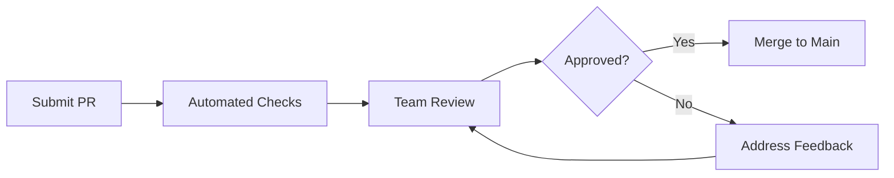

# Contributing Guidelines

Welcome to OpenFrame! We're excited to have you contribute to the open-source MSP platform that's transforming IT operations. This guide covers everything you need to know about contributing code, documentation, and improvements to the project.

## Code of Conduct

OpenFrame is committed to fostering an open and welcoming environment. All contributors are expected to:

- Be respectful and inclusive in all interactions
- Focus on constructive feedback and collaboration
- Help maintain a harassment-free environment
- Follow professional communication standards

All community interaction happens on our [OpenMSP Slack workspace](https://join.slack.com/t/openmsp/shared_invite/zt-36bl7mx0h-3~U2nFH6nqHqoTPXMaHEHA) - we don't use GitHub Issues or Discussions.

## Getting Started

### 1. Join the Community

Before contributing, join our community:

1. **OpenMSP Slack**: [Join here](https://join.slack.com/t/openmsp/shared_invite/zt-36bl7mx0h-3~U2nFH6nqHqoTPXMaHEHA)
2. **Introduce Yourself**: Post in `#introductions` channel
3. **Find a Channel**: Join relevant channels like `#openframe-dev`, `#general`, `#help`

### 2. Set Up Development Environment

Follow our setup guides:

1. **Environment Setup**: Complete [development environment setup](../setup/environment.md)
2. **Local Development**: Get [local development running](../setup/local-development.md)
3. **Architecture Review**: Understand the [system architecture](../architecture/overview.md)

### 3. Choose Your Contribution Type

| Contribution Type | Best For | Getting Started |
|------------------|----------|-----------------|
| **Bug Fixes** | Developers of any level | Check `#bug-reports` in Slack |
| **Feature Development** | Experienced developers | Discuss in `#feature-requests` |
| **Documentation** | Technical writers | Review existing docs for gaps |
| **Testing** | QA engineers | Improve test coverage |
| **Tool Integrations** | MSP domain experts | Add new tool SDKs |

## Development Workflow

### Branch Strategy

We use **GitHub Flow** with feature branches:

```mermaid
gitgraph
    commit id: "main"
    branch feature/new-device-api
    checkout feature/new-device-api
    commit id: "Add device model"
    commit id: "Implement service"
    commit id: "Add tests"
    checkout main
    merge feature/new-device-api
    commit id: "Feature merged"
```

### 1. Create Feature Branch

```bash
# Update main branch
git checkout main
git pull origin main

# Create feature branch
git checkout -b feature/descriptive-feature-name

# Examples:
# feature/device-health-monitoring
# bugfix/auth-token-expiration
# docs/api-documentation-update
```

### 2. Make Your Changes

Follow our coding standards and make focused commits:

```bash
# Make your changes
# ... code development ...

# Stage changes
git add .

# Commit with descriptive message
git commit -m "feat: add device health monitoring endpoint

- Implement GET /api/v1/devices/{id}/health
- Add health check service with CPU/memory metrics
- Include comprehensive test coverage
- Update API documentation

Closes #123"
```

### 3. Push and Create Pull Request

```bash
# Push feature branch
git push origin feature/descriptive-feature-name

# Create pull request through GitHub UI
# Follow the PR template
```

## Code Standards and Style

### Java Code Style

#### Formatting Rules

```java
// Class structure example
@Service
@Slf4j
public class DeviceService {

    private final DeviceRepository deviceRepository;
    private final EventPublisher eventPublisher;

    public DeviceService(DeviceRepository deviceRepository, 
                        EventPublisher eventPublisher) {
        this.deviceRepository = deviceRepository;
        this.eventPublisher = eventPublisher;
    }

    public Device createDevice(String organizationId, CreateDeviceRequest request) {
        log.info("Creating device: {} for organization: {}", 
                request.getHostname(), organizationId);
        
        validateDeviceRequest(request);
        
        Device device = Device.builder()
                .hostname(request.getHostname())
                .platform(request.getPlatform())
                .organizationId(organizationId)
                .status(DeviceStatus.PENDING)
                .createdAt(Instant.now())
                .build();

        Device savedDevice = deviceRepository.save(device);
        eventPublisher.publishDeviceCreated(savedDevice);
        
        log.debug("Device created successfully: {}", savedDevice.getId());
        return savedDevice;
    }
    
    private void validateDeviceRequest(CreateDeviceRequest request) {
        if (StringUtils.isBlank(request.getHostname())) {
            throw new ValidationException("Device hostname is required");
        }
        // Additional validation logic
    }
}
```

#### Key Style Rules

| Rule | Example | Rationale |
|------|---------|-----------|
| **Line Length** | 120 characters max | Readable on modern screens |
| **Indentation** | 4 spaces (no tabs) | Consistent formatting |
| **Naming** | camelCase for variables/methods, PascalCase for classes | Java conventions |
| **Imports** | Group: java.*, javax.*, third-party, com.openframe.* | Logical organization |
| **Null Safety** | Use Optional<T> for nullable returns | Explicit null handling |
| **Logging** | Use Slf4j with @Slf4j annotation | Structured logging |

### TypeScript/JavaScript Code Style

#### Vue.js Component Example

```vue
<template>
  <div class="device-card" @click="handleDeviceClick">
    <div class="device-header">
      <h3 class="device-hostname">{{ device.hostname }}</h3>
      <DeviceStatusBadge :status="device.status" />
    </div>
    
    <div class="device-details">
      <p class="device-platform">{{ device.platform }}</p>
      <p class="device-last-seen">
        Last seen: {{ formatDate(device.lastSeen) }}
      </p>
    </div>
  </div>
</template>

<script setup lang="ts">
import { computed } from 'vue'
import type { Device } from '@/types/device'
import DeviceStatusBadge from '@/components/DeviceStatusBadge.vue'
import { formatDate } from '@/utils/date'

interface Props {
  device: Device
}

interface Emits {
  deviceSelected: [device: Device]
}

const props = defineProps<Props>()
const emit = defineEmits<Emits>()

const handleDeviceClick = (): void => {
  emit('deviceSelected', props.device)
}
</script>

<style scoped>
.device-card {
  @apply p-4 border rounded-lg cursor-pointer hover:shadow-md transition-shadow;
}

.device-hostname {
  @apply text-lg font-semibold text-gray-900;
}

.device-platform {
  @apply text-sm text-gray-600;
}
</style>
```

#### TypeScript Style Rules

| Rule | Example | Rationale |
|------|---------|-----------|
| **Type Safety** | Use strict TypeScript, avoid `any` | Catch errors at compile time |
| **Interfaces** | Define interfaces for all data structures | Clear contracts |
| **Components** | Use `<script setup>` in Vue 3 | Modern composition API |
| **Naming** | camelCase for variables, PascalCase for components | Framework conventions |
| **Props/Emits** | Explicit type definitions | Type-safe component communication |

### Documentation Standards

#### Code Comments

```java
/**
 * Creates a new device in the specified organization.
 * 
 * @param organizationId The ID of the organization to create the device in
 * @param request The device creation request containing hostname and platform
 * @return The created device with generated ID and timestamps
 * @throws ValidationException if the request is invalid
 * @throws DuplicateDeviceException if a device with the same hostname exists
 */
public Device createDevice(String organizationId, CreateDeviceRequest request) {
    // Implementation details...
}
```

#### README.md Structure

```markdown
# Service Name

Brief description of what this service does.

## Features

- Feature 1
- Feature 2
- Feature 3

## API Endpoints

| Method | Endpoint | Description |
|--------|----------|-------------|
| GET | `/api/v1/devices` | List all devices |
| POST | `/api/v1/devices` | Create new device |

## Configuration

Required environment variables:
- `DATABASE_URL` - Database connection string
- `JWT_SECRET` - Secret for JWT token signing

## Development

```bash
# Start the service
mvn spring-boot:run

# Run tests
mvn test
```
```

## Pull Request Process

### 1. Pre-submission Checklist

Before submitting a PR, ensure:

- [ ] **Code builds successfully**: `mvn clean install`
- [ ] **All tests pass**: `mvn test`
- [ ] **Code follows style guidelines**: Run formatter/linter
- [ ] **Documentation updated**: Update relevant docs
- [ ] **Commit messages follow convention**: Use conventional commits
- [ ] **Branch is up-to-date**: Rebase on latest main

### 2. Pull Request Template

```markdown
## Description
Brief description of changes made.

## Type of Change
- [ ] Bug fix (non-breaking change that fixes an issue)
- [ ] New feature (non-breaking change that adds functionality)
- [ ] Breaking change (fix or feature that causes existing functionality to change)
- [ ] Documentation update

## Testing
- [ ] Unit tests added/updated
- [ ] Integration tests added/updated
- [ ] Manual testing completed

## Related Issues
- Closes #123
- Related to #456

## Screenshots (if applicable)
Include screenshots for UI changes.

## Additional Notes
Any additional context or notes for reviewers.
```

### 3. Code Review Process



#### Review Criteria

Reviewers check for:

- **Functionality**: Does the code work as intended?
- **Code Quality**: Is it well-structured and maintainable?
- **Performance**: Are there any performance implications?
- **Security**: Are there security considerations?
- **Testing**: Is there adequate test coverage?
- **Documentation**: Is the code well-documented?

## Commit Message Convention

We use [Conventional Commits](https://www.conventionalcommits.org/) for clear, semantic commit messages:

### Format

```
<type>[optional scope]: <description>

[optional body]

[optional footer(s)]
```

### Types

| Type | Purpose | Example |
|------|---------|---------|
| `feat` | New feature | `feat(device): add health monitoring endpoint` |
| `fix` | Bug fix | `fix(auth): resolve token expiration issue` |
| `docs` | Documentation | `docs(api): update device API documentation` |
| `style` | Code style changes | `style(device): format code according to standards` |
| `refactor` | Code refactoring | `refactor(service): extract device validation logic` |
| `test` | Add/update tests | `test(device): add integration tests for device service` |
| `chore` | Maintenance | `chore(deps): update spring boot to 3.3.1` |

### Examples

```bash
# Simple feature
git commit -m "feat: add device filtering by organization"

# Feature with scope and body
git commit -m "feat(api): add device health monitoring

- Implement GET /api/v1/devices/{id}/health endpoint
- Add health metrics for CPU, memory, and disk usage
- Include comprehensive test coverage

Closes #123"

# Breaking change
git commit -m "feat(auth)!: migrate to JWT-only authentication

BREAKING CHANGE: Session-based authentication is no longer supported.
All clients must use JWT tokens for authentication."
```

## Testing Requirements

### Test Coverage Requirements

| Module Type | Required Coverage | Enforced |
|-------------|------------------|----------|
| **New Features** | >85% line coverage | ✅ Build fails |
| **Bug Fixes** | >90% of affected code | ✅ Build fails |
| **Refactoring** | Maintain existing coverage | ✅ Build fails |

### Test Categories

#### 1. Unit Tests (Required)
```java
@ExtendWith(MockitoExtension.class)
class DeviceServiceTest {
    
    @Test
    void shouldCreateDeviceSuccessfully() {
        // Arrange, Act, Assert
    }
    
    @Test  
    void shouldThrowExceptionWhenDeviceExists() {
        // Test error conditions
    }
}
```

#### 2. Integration Tests (Required for Services)
```java
@SpringBootTest
@TestPropertySource(properties = "spring.datasource.url=jdbc:h2:mem:testdb")
class DeviceServiceIntegrationTest {
    
    @Test
    void shouldPersistDeviceToDatabase() {
        // Test with real database
    }
}
```

#### 3. API Tests (Required for Controllers)
```java
@SpringBootTest(webEnvironment = SpringBootTest.WebEnvironment.RANDOM_PORT)
class DeviceControllerTest {
    
    @Test
    void shouldReturnDevicesForOrganization() {
        // Test HTTP endpoints
    }
}
```

## Custom Integrations

### Adding New Tool SDKs

To integrate a new MSP tool:

#### 1. Create SDK Module

```
openframe-oss-lib/
└── sdk/
    └── your-tool-name/
        ├── pom.xml
        ├── src/main/java/com/openframe/sdk/yourtool/
        │   ├── YourToolClient.java
        │   ├── model/
        │   └── exception/
        └── src/test/java/
```

#### 2. Implement SDK Interface

```java
@Component
public class YourToolSdk implements ToolSdk {
    
    @Override
    public String getToolType() {
        return "YOUR_TOOL";
    }
    
    @Override
    public CompletableFuture<ConnectionStatus> testConnection(ToolCredentials credentials) {
        // Implement connection test
        return CompletableFuture.supplyAsync(() -> {
            try {
                // Test connection logic
                return ConnectionStatus.CONNECTED;
            } catch (Exception e) {
                return ConnectionStatus.FAILED;
            }
        });
    }
    
    @Override
    public CompletableFuture<List<Device>> fetchDevices(ToolCredentials credentials) {
        // Implement device fetching
        return yourToolClient.getDevices()
                .thenApply(this::convertToOpenFrameDevices);
    }
}
```

#### 3. Add Configuration

```yaml
# application.yml
openframe:
  integrations:
    your-tool:
      enabled: true
      base-url: ${YOUR_TOOL_URL:}
      timeout: 30s
      retry:
        max-attempts: 3
        back-off: 2s
```

#### 4. Create Tests

```java
@ExtendWith(MockitoExtension.class)
class YourToolSdkTest {
    
    @Mock
    private YourToolClient yourToolClient;
    
    @InjectMocks
    private YourToolSdk yourToolSdk;
    
    @Test
    void shouldTestConnectionSuccessfully() {
        // Test connection logic
    }
    
    @Test
    void shouldFetchDevicesFromTool() {
        // Test device fetching
    }
}
```

### Frontend Extension Points

#### Custom Components

```typescript
// src/components/custom/CustomDeviceCard.vue
<template>
  <div class="custom-device-card">
    <!-- Custom component implementation -->
  </div>
</template>

<script setup lang="ts">
import type { Device } from '@/types/device'

interface Props {
  device: Device
  customProp?: string
}

const props = defineProps<Props>()
</script>
```

#### Custom Stores

```typescript
// src/stores/customStore.ts
import { defineStore } from 'pinia'
import type { CustomData } from '@/types/custom'

export const useCustomStore = defineStore('custom', () => {
  const data = ref<CustomData[]>([])
  
  const fetchData = async (): Promise<void> => {
    // Custom data fetching logic
  }
  
  return {
    data,
    fetchData
  }
})
```

## Release Process

### Version Management

We follow [Semantic Versioning](https://semver.org/):

- **Major version** (X.0.0): Breaking changes
- **Minor version** (X.Y.0): New features, backward compatible
- **Patch version** (X.Y.Z): Bug fixes, backward compatible

### Release Workflow

1. **Feature Freeze**: No new features for upcoming release
2. **Release Branch**: Create `release/vX.Y.Z` branch
3. **Testing**: Comprehensive testing of release branch
4. **Documentation**: Update changelog and documentation  
5. **Release**: Tag and publish release
6. **Post-Release**: Merge back to main, update dependencies

## Community Support

### Getting Help

1. **Slack Channels**:
   - `#openframe-dev` - Development questions
   - `#help` - General support
   - `#feature-requests` - New feature discussions
   - `#bug-reports` - Bug reporting and tracking

2. **Documentation**: Check existing docs before asking

3. **Search History**: Search Slack history for similar questions

### Mentorship Program

New contributors can request mentorship:

1. Post in `#openframe-dev` with `@mentor-request`
2. Describe your background and interests
3. A core team member will be assigned as your mentor
4. Regular check-ins and code review support

### Recognition

We recognize contributors through:

- **Slack Shoutouts**: Recognition in community channels
- **Release Notes**: Contributor credits in release announcements
- **Contributor List**: Maintained list of all contributors
- **Special Roles**: Community roles for regular contributors

---

Thank you for contributing to OpenFrame! Your efforts help build the future of open-source MSP platforms. Together, we're replacing expensive proprietary tools with intelligent, community-driven alternatives.

**Ready to get started?** Join our [Slack community](https://join.slack.com/t/openmsp/shared_invite/zt-36bl7mx0h-3~U2nFH6nqHqoTPXMaHEHA) and introduce yourself in the `#introductions` channel!