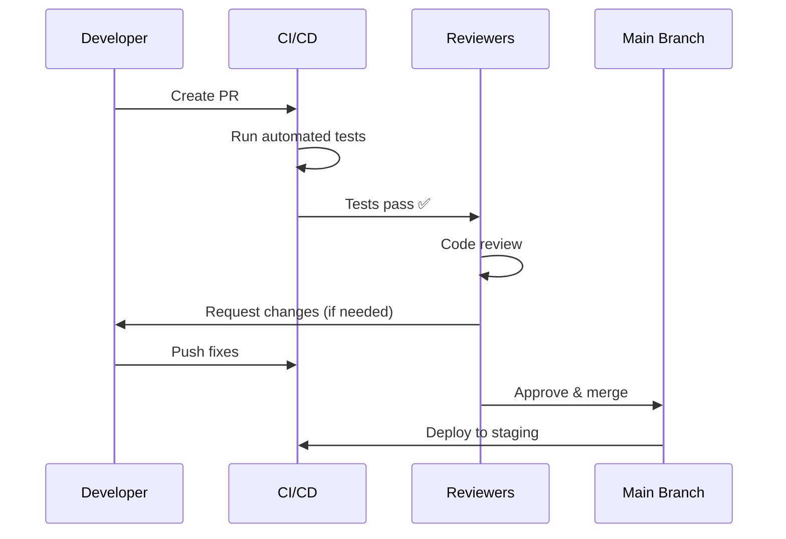

# Contributing Guidelines

Welcome to the OpenFrame contributor community! This guide outlines our development standards, processes, and best practices for contributing to the OpenFrame open-source project.

## Getting Started as a Contributor

### Prerequisites for Contributors

Before contributing, ensure you have:

- [x] **Development Environment**: Complete [environment setup](../setup/environment.md)
- [x] **Local Development**: Working [local development](../setup/local-development.md) setup
- [x] **Architecture Understanding**: Reviewed [architecture overview](../architecture/overview.md)
- [x] **Testing Knowledge**: Familiar with [testing practices](../testing/overview.md)
- [x] **Community Access**: Joined [OpenMSP Slack](https://join.slack.com/t/openmsp/shared_invite/zt-36bl7mx0h-3~U2nFH6nqHqoTPXMaHEHA)

### Contributor Onboarding Checklist

1. **Fork Repository**: Fork `flamingo-stack/openframe-oss-tenant` to your account
2. **Clone Locally**: Clone your fork and set up remotes
3. **Run Tests**: Ensure all tests pass in your local environment
4. **Pick First Issue**: Look for "good first issue" labels
5. **Join Discussions**: Introduce yourself in the OpenMSP Slack community

```bash
# Fork and clone setup
git clone https://github.com/YOUR-USERNAME/openframe-oss-tenant.git
cd openframe-oss-tenant

# Add upstream remote
git remote add upstream https://github.com/flamingo-stack/openframe-oss-tenant.git

# Verify setup
git remote -v
# origin    https://github.com/YOUR-USERNAME/openframe-oss-tenant.git (fetch)
# upstream  https://github.com/flamingo-stack/openframe-oss-tenant.git (fetch)
```

## Code Standards & Style Guide

### Java Code Standards

OpenFrame follows **Google Java Style Guide** with OpenFrame-specific adaptations:

#### Code Formatting

```java
// ✅ CORRECT: Proper formatting and naming
@Service
@RequiredArgsConstructor
@Slf4j
public class DeviceService {
    
    private final DeviceRepository deviceRepository;
    private final EventPublisher eventPublisher;
    
    @Transactional
    public DeviceResponse createDevice(CreateDeviceRequest request) {
        log.debug("Creating device: {}", request.getName());
        
        // Validate input
        validateCreateDeviceRequest(request);
        
        // Create device entity
        Device device = Device.builder()
            .name(request.getName())
            .organizationId(request.getOrganizationId())
            .status(DeviceStatus.PENDING)
            .createdAt(Instant.now())
            .build();
            
        // Save and publish event
        Device savedDevice = deviceRepository.save(device);
        eventPublisher.publishEvent(new DeviceCreatedEvent(savedDevice));
        
        return DeviceMapper.toResponse(savedDevice);
    }
    
    private void validateCreateDeviceRequest(CreateDeviceRequest request) {
        if (StringUtils.isBlank(request.getName())) {
            throw new ValidationException("Device name is required");
        }
        // Additional validations...
    }
}

// ❌ INCORRECT: Poor formatting and naming
@Service
public class deviceservice {
    @Autowired private DeviceRepository repo;
    
    public DeviceResponse create(CreateDeviceRequest req){
        Device d=Device.builder().name(req.getName()).build();
        return DeviceMapper.toResponse(repo.save(d));
    }
}
```

#### Naming Conventions

| Element | Convention | Example |
|---------|------------|---------|
| **Classes** | PascalCase | `DeviceService`, `UserController` |
| **Methods** | camelCase | `createDevice()`, `findByOrganizationId()` |
| **Variables** | camelCase | `deviceRequest`, `organizationId` |
| **Constants** | UPPER_SNAKE_CASE | `MAX_RETRY_ATTEMPTS`, `DEFAULT_TIMEOUT` |
| **Packages** | lowercase.dot.separated | `com.openframe.api.service` |
| **Test Classes** | ClassNameTest | `DeviceServiceTest`, `UserControllerTest` |

#### Documentation Requirements

```java
/**
 * Creates a new device in the specified organization.
 * 
 * <p>This method validates the request, creates a device entity,
 * persists it to the database, and publishes a creation event.
 * 
 * @param request the device creation request containing name, type, and organization
 * @return the created device response with generated ID and timestamps
 * @throws ValidationException if request data is invalid
 * @throws OrganizationNotFoundException if organization doesn't exist
 * @since 1.0.0
 */
@Transactional
public DeviceResponse createDevice(CreateDeviceRequest request) {
    // Implementation...
}
```

### TypeScript/Vue.js Code Standards

#### Vue 3 Composition API Standards

```typescript
// ✅ CORRECT: Proper Vue 3 Composition API structure
<script setup lang="ts">
import { ref, computed, onMounted } from 'vue'
import { useRouter } from 'vue-router'
import { useDevicesStore } from '@/stores/devices'
import type { Device, DeviceStatus } from '@/types/device'

// Props with proper typing
interface Props {
  organizationId: string
  initialStatus?: DeviceStatus
}

const props = withDefaults(defineProps<Props>(), {
  initialStatus: 'ALL'
})

// Emits with proper typing
interface Emits {
  deviceSelected: [device: Device]
  statusChanged: [status: DeviceStatus]
}

const emit = defineEmits<Emits>()

// Composables
const router = useRouter()
const devicesStore = useDevicesStore()

// Reactive state
const loading = ref(false)
const searchQuery = ref('')
const selectedDevice = ref<Device | null>(null)

// Computed properties
const filteredDevices = computed(() => {
  return devicesStore.devices.filter(device => 
    device.name.toLowerCase().includes(searchQuery.value.toLowerCase())
  )
})

// Methods with proper typing
const handleDeviceClick = (device: Device): void => {
  selectedDevice.value = device
  emit('deviceSelected', device)
}

const updateDeviceStatus = async (deviceId: string, status: DeviceStatus): Promise<void> => {
  try {
    loading.value = true
    await devicesStore.updateDeviceStatus(deviceId, status)
    emit('statusChanged', status)
  } catch (error) {
    console.error('Failed to update device status:', error)
  } finally {
    loading.value = false
  }
}

// Lifecycle
onMounted(async () => {
  await devicesStore.loadDevices(props.organizationId)
})
</script>

<template>
  <div class="device-list">
    <!-- Template content with proper data-testid attributes -->
    <input 
      v-model="searchQuery"
      data-testid="search-input"
      placeholder="Search devices..."
    />
    
    <div 
      v-for="device in filteredDevices" 
      :key="device.id"
      data-testid="device-item"
      @click="handleDeviceClick(device)"
    >
      {{ device.name }}
    </div>
  </div>
</template>
```

#### TypeScript Best Practices

```typescript
// ✅ CORRECT: Proper TypeScript patterns
// Strong typing with interfaces
interface DeviceCreateRequest {
  name: string
  organizationId: string
  type: DeviceType
  metadata?: Record<string, unknown>
}

// Proper error handling
export class DeviceService {
  async createDevice(request: DeviceCreateRequest): Promise<DeviceResponse> {
    try {
      const response = await this.apiClient.post<DeviceResponse>('/devices', request)
      return response.data
    } catch (error) {
      if (error instanceof ValidationError) {
        throw new DeviceValidationError(error.message, error.field)
      }
      throw new DeviceServiceError('Failed to create device', { cause: error })
    }
  }
}

// Proper utility functions with generics
export const createApiResponse = <T>(data: T, message = 'Success'): ApiResponse<T> => ({
  success: true,
  data,
  message,
  timestamp: new Date().toISOString()
})
```

## Git Workflow & Branch Strategy

### Branch Naming Convention

```bash
# Feature branches
feature/device-management-ui
feature/mingo-ai-integration
feature/tactical-rmm-connector

# Bug fix branches
bugfix/device-status-update
bugfix/memory-leak-in-stream-processor

# Hotfix branches (for production issues)
hotfix/security-vulnerability-fix
hotfix/critical-data-loss-bug

# Chore/maintenance branches
chore/update-dependencies
chore/refactor-device-service
chore/improve-test-coverage
```

### Commit Message Standards

Follow **Conventional Commits** specification:

```bash
# Format: <type>(<scope>): <description>

# ✅ CORRECT examples
feat(devices): add device status monitoring
fix(api): resolve device query performance issue
docs(contributing): update code style guidelines
test(devices): add integration tests for device service
refactor(auth): simplify JWT token validation
chore(deps): update Spring Boot to 3.3.0

# Breaking changes
feat(api)!: change device API response format

BREAKING CHANGE: Device API now returns different response structure
- Changed `status` field from string to object
- Added `metadata` field with device details
```

### Pull Request Process

#### 1. Before Creating PR

```bash
# Sync with upstream
git checkout main
git pull upstream main
git checkout your-feature-branch
git rebase main

# Run tests and checks
mvn clean test
npm run test
npm run lint
npm run type-check

# Build and verify
mvn clean install
npm run build
```

#### 2. PR Template

When creating a PR, use this template:

```markdown
## Description
Brief description of what this PR does.

## Changes Made
- [ ] Added device monitoring dashboard
- [ ] Implemented real-time status updates
- [ ] Added comprehensive tests
- [ ] Updated documentation

## Type of Change
- [ ] Bug fix (non-breaking change that fixes an issue)
- [ ] New feature (non-breaking change that adds functionality)  
- [ ] Breaking change (fix or feature that would cause existing functionality to change)
- [ ] Documentation update
- [ ] Refactoring (code changes that neither fix bugs nor add features)

## Testing
- [ ] Unit tests pass
- [ ] Integration tests pass
- [ ] E2E tests pass (if applicable)
- [ ] Manual testing completed

## Screenshots/Demo
[Add screenshots or demo links if applicable]

## Checklist
- [ ] Code follows style guidelines
- [ ] Self-review completed
- [ ] Code is commented, particularly in hard-to-understand areas
- [ ] Corresponding documentation updated
- [ ] No new warnings introduced
- [ ] Tests added/updated for new functionality

## Related Issues
Closes #123
Related to #456

## Deployment Notes
[Any special deployment considerations]
```

#### 3. PR Review Process



**Review Criteria:**
- [ ] **Functionality**: Code works as intended
- [ ] **Performance**: No performance regressions
- [ ] **Security**: No security vulnerabilities introduced
- [ ] **Tests**: Adequate test coverage
- [ ] **Documentation**: Code is well-documented
- [ ] **Style**: Follows coding standards

## Testing Requirements

### Minimum Testing Standards

All contributions must meet these testing requirements:

```bash
# Backend testing requirements
mvn test                          # Unit tests must pass
mvn verify                        # Integration tests must pass
mvn jacoco:check                  # Coverage requirements met

# Frontend testing requirements
npm run test                      # Unit tests must pass
npm run test:integration          # Integration tests must pass
npm run test:e2e                  # E2E tests must pass (if modified)
```

### Test Coverage Requirements

| Component | Minimum Coverage | Required for New Code |
|-----------|------------------|-----------------------|
| **Service Classes** | 85% | 90% |
| **Controllers** | 80% | 85% |
| **Utilities** | 90% | 95% |
| **Vue Components** | 75% | 80% |

### Writing Tests for New Features

```java
// ✅ CORRECT: Comprehensive test coverage
@ExtendWith(MockitoExtension.class)
class NewFeatureServiceTest {

    @Test
    @DisplayName("Should handle happy path correctly")
    void shouldHandleHappyPath() {
        // Test main functionality
    }

    @Test  
    @DisplayName("Should handle edge cases")
    void shouldHandleEdgeCases() {
        // Test boundary conditions
    }

    @Test
    @DisplayName("Should handle error conditions")
    void shouldHandleErrorConditions() {
        // Test error scenarios
    }

    @Test
    @DisplayName("Should validate input parameters")
    void shouldValidateInputParameters() {
        // Test input validation
    }
}
```

## Documentation Requirements

### Code Documentation

```java
// ✅ CORRECT: Proper JavaDoc
/**
 * Service for managing device operations in OpenFrame.
 * 
 * <p>This service handles device creation, updates, status monitoring,
 * and integration with external MSP tools like TacticalRMM and FleetDM.
 * 
 * <p>All operations are tenant-aware and include proper audit logging.
 * 
 * @author OpenFrame Team
 * @since 1.0.0
 */
@Service
@Transactional
public class DeviceService {
    
    /**
     * Creates a new device for the specified organization.
     * 
     * @param request device creation parameters
     * @return created device with generated ID
     * @throws ValidationException if request is invalid
     * @throws OrganizationNotFoundException if organization doesn't exist
     */
    public DeviceResponse createDevice(CreateDeviceRequest request) {
        // Implementation
    }
}
```

### API Documentation

```java
// ✅ CORRECT: Proper OpenAPI documentation
@RestController
@RequestMapping("/api/devices")
@Tag(name = "Devices", description = "Device management operations")
public class DeviceController {

    @PostMapping
    @Operation(
        summary = "Create a new device",
        description = "Creates a new device in the specified organization with the provided details."
    )
    @ApiResponses({
        @ApiResponse(responseCode = "201", description = "Device created successfully",
                    content = @Content(schema = @Schema(implementation = DeviceResponse.class))),
        @ApiResponse(responseCode = "400", description = "Invalid request data"),
        @ApiResponse(responseCode = "404", description = "Organization not found"),
        @ApiResponse(responseCode = "409", description = "Device with name already exists")
    })
    public ResponseEntity<DeviceResponse> createDevice(
        @RequestBody @Valid CreateDeviceRequest request) {
        // Implementation
    }
}
```

## Performance Guidelines

### Backend Performance Standards

```java
// ✅ CORRECT: Efficient database operations
@Service
public class DeviceService {

    // Use pagination for large datasets
    public Page<DeviceResponse> getDevices(DeviceFilter filter, Pageable pageable) {
        return deviceRepository.findByFilter(filter, pageable)
            .map(DeviceMapper::toResponse);
    }

    // Use batch operations for bulk updates
    @Transactional
    public void updateDeviceStatuses(List<DeviceStatusUpdate> updates) {
        List<Device> devices = deviceRepository.findAllById(
            updates.stream().map(DeviceStatusUpdate::getDeviceId).collect(toList())
        );
        
        devices.forEach(device -> {
            DeviceStatusUpdate update = updates.stream()
                .filter(u -> u.getDeviceId().equals(device.getId()))
                .findFirst()
                .orElseThrow();
            device.setStatus(update.getStatus());
        });
        
        deviceRepository.saveAll(devices); // Batch save
    }

    // Use caching for frequently accessed data
    @Cacheable(value = "device-stats", key = "#organizationId")
    public DeviceStats getDeviceStats(String organizationId) {
        return deviceRepository.calculateStats(organizationId);
    }
}
```

### Frontend Performance Standards

```typescript
// ✅ CORRECT: Efficient Vue.js patterns
<script setup lang="ts">
import { computed, ref } from 'vue'
import { debounce } from 'lodash-es'

// Use computed for derived state
const filteredDevices = computed(() => {
  if (!searchQuery.value) return devices.value
  
  return devices.value.filter(device =>
    device.name.toLowerCase().includes(searchQuery.value.toLowerCase())
  )
})

// Debounce expensive operations
const debouncedSearch = debounce((query: string) => {
  performSearch(query)
}, 300)

// Use proper list keys for efficient rendering
</script>

<template>
  <!-- ✅ Proper keys for v-for -->
  <div v-for="device in filteredDevices" :key="device.id">
    {{ device.name }}
  </div>
</template>
```

## Security Guidelines

### Input Validation

```java
// ✅ CORRECT: Comprehensive input validation
@PostMapping("/devices")
public ResponseEntity<DeviceResponse> createDevice(
    @RequestBody @Valid CreateDeviceRequest request) {
    
    // Additional business validation beyond Bean Validation
    if (!organizationService.exists(request.getOrganizationId())) {
        throw new OrganizationNotFoundException(request.getOrganizationId());
    }
    
    // Sanitize input data
    String sanitizedName = HtmlUtils.htmlEscape(request.getName().trim());
    request.setName(sanitizedName);
    
    return ResponseEntity.ok(deviceService.createDevice(request));
}
```

### Authentication & Authorization

```java
// ✅ CORRECT: Proper security annotations
@PreAuthorize("hasRole('ADMIN') or hasPermission(#organizationId, 'ORGANIZATION', 'READ')")
@GetMapping("/organizations/{organizationId}/devices")
public ResponseEntity<List<DeviceResponse>> getDevicesByOrganization(
    @PathVariable String organizationId,
    Authentication authentication) {
    
    // Additional authorization checks if needed
    if (!securityService.canAccessOrganization(authentication, organizationId)) {
        throw new AccessDeniedException("Access denied to organization");
    }
    
    return ResponseEntity.ok(deviceService.getDevicesByOrganization(organizationId));
}
```

## Issue Reporting & Feature Requests

### Bug Report Template

When reporting bugs, include:

```markdown
**Bug Description**
A clear description of what the bug is.

**Steps to Reproduce**
1. Go to '...'
2. Click on '....'
3. Scroll down to '....'
4. See error

**Expected Behavior**
What you expected to happen.

**Screenshots/Logs**
If applicable, add screenshots or log outputs.

**Environment**
- OS: [e.g. macOS 14.0]
- Browser: [e.g. Chrome 118.0]
- OpenFrame Version: [e.g. 0.4.4]
- Java Version: [e.g. 21.0.1]

**Additional Context**
Any other context about the problem.
```

### Feature Request Template

```markdown
**Feature Summary**
A brief, clear description of the feature you'd like to see.

**Problem Statement**
What problem does this feature solve? What use case does it address?

**Proposed Solution**
Describe your preferred solution or approach.

**Alternative Solutions**
Describe any alternative solutions you've considered.

**Business Value**
How would this feature benefit OpenFrame users and the MSP community?

**Technical Considerations**
Any technical challenges or considerations you're aware of.

**Additional Context**
Screenshots, mockups, or examples that help illustrate the feature.
```

## Community Guidelines

### Code of Conduct

All contributors must follow our Code of Conduct:

1. **Be Respectful**: Treat all community members with respect
2. **Be Inclusive**: Welcome newcomers and diverse perspectives
3. **Be Collaborative**: Work together to improve OpenFrame
4. **Be Professional**: Maintain professional communication
5. **Be Constructive**: Provide helpful, actionable feedback

### Communication Channels

| Channel | Purpose | Best For |
|---------|---------|----------|
| **GitHub Issues** | Bug reports, feature requests | Technical discussions |
| **GitHub Discussions** | General questions, ideas | Community discussions |
| **OpenMSP Slack** | Real-time chat, support | Quick questions, collaboration |
| **Pull Request Comments** | Code review feedback | Code-specific discussions |

### Recognition & Attribution

Contributors are recognized through:

- **Commit Attribution**: Proper git commit attribution
- **Release Notes**: Contributor mentions in releases
- **Contributors File**: Listed in CONTRIBUTORS.md
- **Community Recognition**: Highlighted in community channels

---

*🤝 **Ready to contribute?** Start by picking a "good first issue" on GitHub or join the conversation in the [OpenMSP Slack](https://join.slack.com/t/openmsp/shared_invite/zt-36bl7mx0h-3~U2nFH6nqHqoTPXMaHEHA) community!*