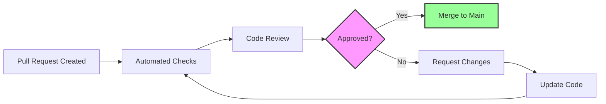

# Contributing Guidelines

Welcome to the OpenFrame project! This guide provides everything you need to know about contributing code, documentation, and features to OpenFrame. We appreciate your interest in helping improve the platform.

## Code of Conduct

OpenFrame is committed to providing a welcoming and inclusive environment for all contributors. By participating in this project, you agree to abide by our community standards:

- **Be respectful** and inclusive in all interactions
- **Be collaborative** and help others learn and grow
- **Be constructive** when providing feedback or criticism
- **Be patient** with new contributors and questions
- **Be professional** in all communications

## Getting Started

Before contributing, ensure you have:

1. ✅ Completed the [Environment Setup](../setup/environment.md)
2. ✅ Successfully run OpenFrame locally using the [Local Development Guide](../setup/local-development.md)
3. ✅ Read the [Architecture Overview](../architecture/overview.md)
4. ✅ Joined our [OpenMSP Slack Community](https://join.slack.com/t/openmsp/shared_invite/zt-36bl7mx0h-3~U2nFH6nqHqoTPXMaHEHA)

## Development Workflow

OpenFrame follows a structured Git workflow with specific conventions for branches, commits, and pull requests.

### Branch Naming Convention

Use descriptive branch names that follow this pattern:

```text
<type>/<short-description>

Examples:
feature/user-invitation-flow
bugfix/device-offline-detection
docs/api-documentation-update
refactor/authentication-service
hotfix/security-vulnerability
```

**Branch Types:**
- `feature/` - New features or enhancements
- `bugfix/` - Bug fixes
- `docs/` - Documentation updates
- `refactor/` - Code refactoring without functional changes
- `hotfix/` - Critical fixes for production issues
- `chore/` - Maintenance tasks (dependency updates, etc.)

### Commit Message Format

Follow [Conventional Commits](https://www.conventionalcommits.org/) specification:

```text
<type>[optional scope]: <description>

[optional body]

[optional footer(s)]
```

**Types:**
- `feat` - New features
- `fix` - Bug fixes
- `docs` - Documentation changes
- `style` - Code style changes (formatting, etc.)
- `refactor` - Code changes that neither fix bugs nor add features
- `test` - Adding or updating tests
- `chore` - Maintenance tasks

**Examples:**
```text
feat(api): add user invitation endpoints

Implements GraphQL mutations and REST endpoints for user invitations.
Includes email notification integration and role-based permissions.

Closes #123

fix(client): resolve device heartbeat timeout

The heartbeat timeout was too aggressive, causing false offline states.
Increased timeout from 30s to 60s and added exponential backoff.

Fixes #456

docs(contributing): update PR review checklist

Added security review requirements and testing guidelines.
```

### Pull Request Process

#### 1. Before Creating a PR

**Code Quality Checks:**
```bash
# Run all tests
mvn test                                    # Java tests
npm test                                    # Frontend tests
cargo test                                  # Rust tests

# Code formatting
mvn spotless:apply                          # Java formatting
npm run lint:fix                           # Frontend linting
cargo fmt                                  # Rust formatting

# Security checks
npm audit                                  # Frontend security audit
cargo audit                               # Rust security audit
```

**Ensure Your Branch is Current:**
```bash
git checkout main
git pull origin main
git checkout your-feature-branch
git merge main  # or git rebase main
```

#### 2. Create the Pull Request

**PR Title Format:**
```text
<type>[scope]: <description>

Examples:
feat(api): implement user invitation system
fix(frontend): resolve device status display issue
docs: update contributing guidelines
```

**PR Description Template:**
```markdown
## Description
Brief description of the changes made.

## Type of Change
- [ ] Bug fix (non-breaking change which fixes an issue)
- [ ] New feature (non-breaking change which adds functionality)  
- [ ] Breaking change (fix or feature that would cause existing functionality to not work as expected)
- [ ] Documentation update
- [ ] Code refactoring
- [ ] Performance improvement

## Testing
- [ ] Unit tests added/updated
- [ ] Integration tests added/updated
- [ ] Manual testing completed
- [ ] All tests pass locally

## Security Considerations
- [ ] No new security vulnerabilities introduced
- [ ] Security scan completed (if applicable)
- [ ] Authentication/authorization properly implemented

## Documentation
- [ ] Code is self-documenting with clear variable names
- [ ] Complex logic is commented
- [ ] API documentation updated (if applicable)
- [ ] README updated (if applicable)

## Screenshots (if applicable)
Include screenshots for UI changes.

## Checklist
- [ ] My code follows the project's style guidelines
- [ ] I have performed a self-review of my code
- [ ] I have commented my code, particularly in hard-to-understand areas
- [ ] I have made corresponding changes to the documentation
- [ ] My changes generate no new warnings
- [ ] I have added tests that prove my fix is effective or that my feature works
- [ ] New and existing unit tests pass locally with my changes

## Related Issues
Closes #123
Relates to #456
```

#### 3. PR Review Process

**Automatic Checks:**
- ✅ All CI tests pass
- ✅ Code coverage meets minimum thresholds  
- ✅ Security scans pass
- ✅ No merge conflicts

**Manual Review Areas:**
- Code quality and adherence to patterns
- Security implications
- Performance impact
- Documentation completeness
- Test coverage and quality

**Review Workflow:**


## Code Style and Standards

### Java Code Style

**Follow Google Java Style Guide** with these OpenFrame-specific additions:

**Class Organization:**
```java
public class DeviceService {
    // 1. Constants
    private static final int MAX_RETRY_ATTEMPTS = 3;
    
    // 2. Fields (dependencies first, then state)
    private final DeviceRepository deviceRepository;
    private final NotificationService notificationService;
    private final Map<String, Device> deviceCache = new ConcurrentHashMap<>();
    
    // 3. Constructor
    public DeviceService(DeviceRepository deviceRepository, 
                        NotificationService notificationService) {
        this.deviceRepository = deviceRepository;
        this.notificationService = notificationService;
    }
    
    // 4. Public methods
    public Device createDevice(CreateDeviceRequest request) {
        // Implementation
    }
    
    // 5. Private methods
    private void validateDevice(Device device) {
        // Implementation
    }
}
```

**Error Handling:**
```java
// ✅ Good - Specific exceptions with context
public Device findDevice(String deviceId) {
    return deviceRepository.findById(deviceId)
        .orElseThrow(() -> new DeviceNotFoundException(
            "Device not found with ID: " + deviceId));
}

// ❌ Bad - Generic exceptions without context
public Device findDevice(String deviceId) {
    Device device = deviceRepository.findById(deviceId);
    if (device == null) {
        throw new RuntimeException("Device not found");
    }
    return device;
}
```

**Logging:**
```java
// ✅ Good - Structured logging with context
@Slf4j
public class DeviceService {
    public Device updateDevice(String deviceId, UpdateDeviceRequest request) {
        log.info("Updating device: deviceId={}, changes={}", deviceId, request);
        
        try {
            Device device = findDevice(deviceId);
            // Update logic
            log.info("Device updated successfully: deviceId={}", deviceId);
            return device;
        } catch (DeviceNotFoundException e) {
            log.warn("Device update failed - device not found: deviceId={}", deviceId);
            throw e;
        }
    }
}
```

### TypeScript/React Code Style

**Component Structure:**
```typescript
// ✅ Good - Clear component structure
interface DeviceCardProps {
  device: Device;
  onEdit?: (device: Device) => void;
  onDelete?: (deviceId: string) => void;
}

export const DeviceCard: React.FC<DeviceCardProps> = ({ 
  device, 
  onEdit, 
  onDelete 
}) => {
  // Hooks first
  const [isLoading, setIsLoading] = useState(false);
  const { showToast } = useToast();
  
  // Event handlers
  const handleEdit = useCallback(() => {
    onEdit?.(device);
  }, [device, onEdit]);
  
  const handleDelete = useCallback(async () => {
    if (!onDelete) return;
    
    setIsLoading(true);
    try {
      await onDelete(device.id);
      showToast('Device deleted successfully', 'success');
    } catch (error) {
      showToast('Failed to delete device', 'error');
    } finally {
      setIsLoading(false);
    }
  }, [device.id, onDelete, showToast]);
  
  // Render
  return (
    <Card className="device-card">
      {/* Component JSX */}
    </Card>
  );
};
```

**Custom Hooks:**
```typescript
// ✅ Good - Reusable hook with clear interface
interface UseDevicesOptions {
  organizationId?: string;
  includeOffline?: boolean;
}

export const useDevices = ({ organizationId, includeOffline = true }: UseDevicesOptions = {}) => {
  const [devices, setDevices] = useState<Device[]>([]);
  const [loading, setLoading] = useState(true);
  const [error, setError] = useState<string | null>(null);
  
  const fetchDevices = useCallback(async () => {
    try {
      setLoading(true);
      setError(null);
      
      const response = await deviceService.getDevices({
        organizationId,
        includeOffline,
      });
      
      setDevices(response.data);
    } catch (err) {
      setError(err instanceof Error ? err.message : 'Failed to fetch devices');
    } finally {
      setLoading(false);
    }
  }, [organizationId, includeOffline]);
  
  useEffect(() => {
    fetchDevices();
  }, [fetchDevices]);
  
  return {
    devices,
    loading,
    error,
    refetch: fetchDevices,
  };
};
```

### Rust Code Style

**Follow Rust API Guidelines** and use `rustfmt` and `clippy`:

```rust
// ✅ Good - Clear error handling and documentation
use anyhow::{Context, Result};
use serde::{Deserialize, Serialize};
use tracing::{info, warn, error};

#[derive(Debug, Serialize, Deserialize)]
pub struct DeviceRegistration {
    pub device_id: String,
    pub device_name: String,
    pub platform: String,
    pub version: String,
}

impl DeviceRegistration {
    /// Creates a new device registration with validation
    pub fn new(
        device_name: String,
        platform: String,
        version: String,
    ) -> Result<Self> {
        if device_name.is_empty() {
            anyhow::bail!("Device name cannot be empty");
        }
        
        let device_id = Self::generate_device_id(&device_name, &platform)?;
        
        Ok(Self {
            device_id,
            device_name,
            platform,
            version,
        })
    }
    
    /// Generates a unique device ID from name and platform
    fn generate_device_id(name: &str, platform: &str) -> Result<String> {
        use sha2::{Digest, Sha256};
        
        let input = format!("{}:{}", name, platform);
        let mut hasher = Sha256::new();
        hasher.update(input.as_bytes());
        let result = hasher.finalize();
        
        Ok(format!("{:x}", result)[..16].to_string())
    }
}

// Async function example
pub async fn register_device(
    client: &OpenFrameClient,
    registration: DeviceRegistration,
) -> Result<String> {
    info!(
        device_name = %registration.device_name,
        platform = %registration.platform,
        "Registering device"
    );
    
    let response = client
        .post("/api/devices/register")
        .json(&registration)
        .send()
        .await
        .context("Failed to send registration request")?;
    
    if response.status().is_success() {
        let token: String = response
            .json()
            .await
            .context("Failed to parse registration response")?;
        
        info!(device_name = %registration.device_name, "Device registered successfully");
        Ok(token)
    } else {
        let status = response.status();
        let error_text = response.text().await.unwrap_or_else(|_| "Unknown error".to_string());
        
        error!(
            device_name = %registration.device_name,
            status = %status,
            error = %error_text,
            "Device registration failed"
        );
        
        anyhow::bail!("Registration failed with status {}: {}", status, error_text)
    }
}
```

## Testing Requirements

### Test Coverage Standards

All contributions must meet these testing requirements:

| Component Type | Unit Test Coverage | Integration Coverage | E2E Coverage |
|----------------|-------------------|---------------------|--------------|
| **Services** | 90%+ | 80%+ | Key flows |
| **Controllers/Components** | 85%+ | 70%+ | User workflows |
| **Utilities** | 95%+ | N/A | N/A |

### Test Categories Required

**For New Features:**
- [ ] Unit tests for all business logic
- [ ] Integration tests for API endpoints  
- [ ] Component tests for UI elements
- [ ] E2E tests for critical user flows

**For Bug Fixes:**
- [ ] Regression test that reproduces the bug
- [ ] Unit test verifying the fix
- [ ] Integration test if the bug involves multiple components

**Example Test Structure:**
```java
// Service unit test
@Test
void shouldCreateDeviceWithValidInput() {
    // Given
    CreateDeviceRequest request = anCreateDeviceRequest()
        .withName("Test Device")
        .withPlatform("linux")
        .build();
    
    when(deviceRepository.save(any(Device.class)))
        .thenAnswer(invocation -> invocation.getArgument(0));
    
    // When
    Device result = deviceService.createDevice(request);
    
    // Then
    assertThat(result.getName()).isEqualTo("Test Device");
    assertThat(result.getPlatform()).isEqualTo("linux");
    assertThat(result.getId()).isNotNull();
    verify(deviceRepository).save(any(Device.class));
}

// Integration test
@SpringBootTest
@Test
void shouldCreateDeviceEndToEnd() {
    // Given
    CreateDeviceRequest request = new CreateDeviceRequest("Test Device", "linux");
    
    // When
    ResponseEntity<DeviceResponse> response = testRestTemplate
        .postForEntity("/api/devices", request, DeviceResponse.class);
    
    // Then
    assertThat(response.getStatusCode()).isEqualTo(HttpStatus.CREATED);
    assertThat(response.getBody().getName()).isEqualTo("Test Device");
}
```

## Security Guidelines

### Security Review Checklist

All contributions involving security-sensitive areas must pass this checklist:

**Authentication & Authorization:**
- [ ] Proper authentication checks on all endpoints
- [ ] Role-based authorization implemented correctly
- [ ] JWT tokens validated and user context extracted properly
- [ ] No hardcoded credentials or secrets

**Input Validation:**
- [ ] All user inputs validated and sanitized
- [ ] SQL injection prevention (parameterized queries)
- [ ] XSS prevention in frontend components
- [ ] CSRF protection where applicable

**Data Protection:**
- [ ] Sensitive data encrypted at rest and in transit
- [ ] Proper secret management (no secrets in code)
- [ ] Audit logging for sensitive operations
- [ ] Tenant isolation maintained

**Example Security Implementation:**
```java
@RestController
@RequestMapping("/api/devices")
@PreAuthorize("hasRole('USER')")
public class DeviceController {
    
    @PostMapping
    @PreAuthorize("hasPermission(#request.organizationId, 'Organization', 'WRITE')")
    public ResponseEntity<DeviceResponse> createDevice(
            @Valid @RequestBody CreateDeviceRequest request,
            @AuthenticationPrincipal AuthPrincipal principal) {
        
        // Validate user has access to organization
        if (!organizationService.hasAccess(principal.getUserId(), request.getOrganizationId())) {
            throw new AccessDeniedException("No access to organization");
        }
        
        // Create device with user context
        Device device = deviceService.createDevice(request, principal);
        
        // Audit log the creation
        auditService.logDeviceCreation(device.getId(), principal.getUserId());
        
        return ResponseEntity.created(URI.create("/api/devices/" + device.getId()))
                .body(deviceMapper.toResponse(device));
    }
}
```

## Documentation Standards

### Code Documentation

**Java Documentation:**
```java
/**
 * Service responsible for managing device lifecycle and operations.
 * 
 * <p>This service handles device registration, status updates, and provides
 * querying capabilities with proper tenant isolation.
 * 
 * @author OpenFrame Team
 * @since 1.0.0
 */
@Service
public class DeviceService {
    
    /**
     * Creates a new device in the system.
     * 
     * @param request the device creation request containing device details
     * @param principal the authenticated user creating the device
     * @return the created device with generated ID and metadata
     * @throws DeviceAlreadyExistsException if device with same name exists in organization
     * @throws AccessDeniedException if user lacks permission for the organization
     */
    public Device createDevice(CreateDeviceRequest request, AuthPrincipal principal) {
        // Implementation
    }
}
```

**TypeScript Documentation:**
```typescript
/**
 * Custom hook for managing device data with real-time updates
 * 
 * @param options Configuration options for device fetching
 * @returns Object containing devices array, loading state, and refetch function
 * 
 * @example
 * ```tsx
 * const { devices, loading, refetch } = useDevices({
 *   organizationId: 'org-123',
 *   includeOffline: false
 * });
 * ```
 */
export const useDevices = (options: UseDevicesOptions = {}) => {
  // Implementation
};
```

### API Documentation

**GraphQL Schema Documentation:**
```graphql
"""
Device information managed by OpenFrame
"""
type Device {
    """Unique identifier for the device"""
    id: ID!
    
    """Human-readable device name"""
    name: String!
    
    """Current device status (online, offline, maintenance)"""
    status: DeviceStatus!
    
    """Timestamp of last communication with device"""
    lastSeen: DateTime
    
    """Organization that owns this device"""
    organization: Organization!
}

"""
Create a new device in the system
"""
input CreateDeviceInput {
    """Device name (must be unique within organization)"""
    name: String!
    
    """Device platform (windows, linux, macos)"""
    platform: String!
    
    """Organization ID that will own the device"""
    organizationId: ID!
}
```

## Review Checklist

Use this checklist before submitting your PR:

### Code Quality ✅
- [ ] Code follows project style guidelines
- [ ] No hardcoded values (use configuration)
- [ ] Proper error handling implemented
- [ ] Logging added for important operations
- [ ] No TODO/FIXME comments in production code

### Testing ✅
- [ ] Unit tests written and passing
- [ ] Integration tests for complex flows
- [ ] Test coverage meets requirements
- [ ] Manual testing completed
- [ ] Edge cases covered

### Security ✅
- [ ] Input validation implemented
- [ ] Authentication/authorization checked
- [ ] No sensitive data in logs
- [ ] Secrets properly managed
- [ ] Security scan passing

### Documentation ✅
- [ ] Code is self-documenting
- [ ] Complex logic commented
- [ ] API documentation updated
- [ ] README updated if needed
- [ ] Migration guide provided if breaking

### Performance ✅
- [ ] No obvious performance issues
- [ ] Database queries optimized
- [ ] Caching implemented where beneficial
- [ ] Resource cleanup handled properly

---

## Getting Help

### Community Support
- 💬 **Slack**: [OpenMSP Community](https://join.slack.com/t/openmsp/shared_invite/zt-36bl7mx0h-3~U2nFH6nqHqoTPXMaHEHA)
  - `#openframe-dev` - Development questions
  - `#contributions` - Contribution coordination  
  - `#help` - General help and support

### Maintainer Contact
For complex contributions or architectural questions, reach out to the maintainers through the OpenMSP Slack community.

## Recognition

Contributors who make significant improvements to OpenFrame will be:
- Listed in our contributor acknowledgments
- Recognized in release notes for major contributions
- Invited to join our contributor program for ongoing collaboration

Thank you for contributing to OpenFrame and helping improve IT operations for MSPs worldwide! 🚀