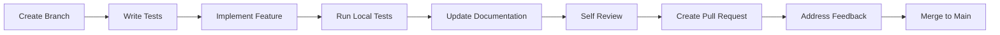
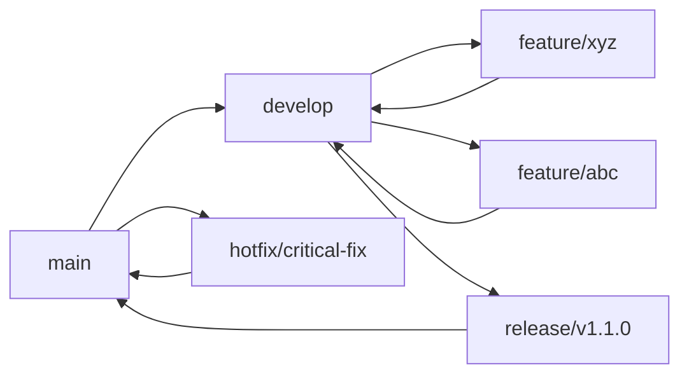

# Contributing Guidelines

Welcome to the OpenFrame contributor community! This guide outlines our development standards, contribution process, and best practices for maintaining a high-quality codebase.

## Getting Started

### Prerequisites

Before contributing to OpenFrame, ensure you have:

✅ **Development Environment Setup**
- Java 21 JDK installed and configured
- Node.js 20+ for frontend development
- Docker for running dependencies
- Your preferred IDE configured (IntelliJ IDEA or VS Code recommended)

✅ **Repository Access**
- Forked the repository to your GitHub account
- Cloned your fork locally
- Added upstream remote for syncing

✅ **Community Connection**
- Joined the [OpenMSP Slack community](https://join.slack.com/t/openmsp/shared_invite/zt-36bl7mx0h-3~U2nFH6nqHqoTPXMaHEHA)
- Introduced yourself in #openframe-dev channel

### First-Time Setup

```bash
# Clone your fork
git clone https://github.com/your-username/openframe-oss-tenant.git
cd openframe-oss-tenant

# Add upstream remote
git remote add upstream https://github.com/flamingo-stack/openframe-oss-tenant.git

# Install dependencies and verify setup
./scripts/setup-dev-env.sh

# Run tests to ensure everything works
mvn test
```

## Development Workflow

### 1. Choose Your Contribution

**Good First Issues**:
- Look for issues labeled `good first issue` or `help wanted`
- Documentation improvements
- Unit test additions
- Bug fixes in isolated components

**Feature Contributions**:
- Discuss new features in OpenMSP Slack first
- Create or comment on GitHub issues for larger changes
- Ensure alignment with project roadmap

### 2. Branch Management

**Branch Naming Convention**:

```bash
# Feature branches
feature/short-descriptive-name
feature/device-bulk-actions
feature/ai-powered-alerts

# Bug fixes
bugfix/issue-number-short-description  
bugfix/123-fix-device-registration
bugfix/jwt-expiration-handling

# Hotfixes (critical production issues)
hotfix/critical-security-patch
hotfix/data-corruption-fix

# Documentation
docs/update-api-documentation
docs/contributing-guidelines
```

**Creating Your Branch**:

```bash
# Always start from latest main
git checkout main
git pull upstream main

# Create and switch to your feature branch
git checkout -b feature/your-feature-name

# Push branch to your fork
git push -u origin feature/your-feature-name
```

### 3. Making Changes

**Development Process**:



**Code Development Checklist**:

- [ ] **Write Tests First**: Follow TDD approach where possible
- [ ] **Implement Feature**: Write clean, readable code
- [ ] **Run All Tests**: Ensure no existing functionality breaks
- [ ] **Update Documentation**: Include relevant docs updates
- [ ] **Self Review**: Review your own PR before requesting review
- [ ] **Check CI/CD**: Ensure all automated checks pass

## Code Standards

### Java Code Standards

**Code Style**:
```java
// Class naming: PascalCase
public class DeviceManagementService {
    
    // Constants: UPPER_SNAKE_CASE
    private static final String DEFAULT_DEVICE_TYPE = "WORKSTATION";
    
    // Fields: camelCase with descriptive names
    private final DeviceRepository deviceRepository;
    private final EventPublisher eventPublisher;
    
    // Constructor injection preferred
    public DeviceManagementService(
            DeviceRepository deviceRepository, 
            EventPublisher eventPublisher) {
        this.deviceRepository = deviceRepository;
        this.eventPublisher = eventPublisher;
    }
    
    // Method naming: camelCase, verb-based
    public DeviceResponse createDevice(String tenantId, CreateDeviceRequest request) {
        // Validate input parameters
        validateTenantId(tenantId);
        validateDeviceRequest(request);
        
        // Business logic implementation
        Device device = Device.builder()
            .tenantId(tenantId)
            .name(request.getName())
            .hostname(request.getHostname())
            .type(request.getType())
            .status(DeviceStatus.PENDING)
            .createdAt(Instant.now())
            .build();
            
        Device savedDevice = deviceRepository.save(device);
        
        // Publish domain event
        eventPublisher.publishEvent(new DeviceCreatedEvent(savedDevice));
        
        return DeviceMapper.toResponse(savedDevice);
    }
    
    // Private methods: descriptive names
    private void validateTenantId(String tenantId) {
        if (StringUtils.isBlank(tenantId)) {
            throw new InvalidTenantException("Tenant ID cannot be blank");
        }
    }
}
```

**Best Practices**:

- **Immutable Objects**: Use `@Value` or builder pattern for DTOs
- **Null Safety**: Use `Optional<T>` for nullable return values
- **Exception Handling**: Use specific exception types, not generic `Exception`
- **Logging**: Use SLF4J with appropriate log levels
- **Validation**: Validate inputs at service boundaries

**Example: Immutable DTO**:
```java
@Value
@Builder
public class CreateDeviceRequest {
    @NotBlank(message = "Device name is required")
    String name;
    
    @NotBlank(message = "Hostname is required")  
    String hostname;
    
    @NotNull(message = "Device type is required")
    DeviceType type;
    
    @Valid
    List<@NotBlank String> tags;
}
```

### TypeScript/React Code Standards

**Component Structure**:
```typescript
// DeviceList.tsx
import React, { useState, useEffect } from 'react';
import { useQuery } from '@apollo/client';
import { DeviceListItem } from './DeviceListItem';
import { LoadingSpinner } from '../ui/LoadingSpinner';
import { ErrorMessage } from '../ui/ErrorMessage';
import { GET_DEVICES } from './DeviceList.queries';
import type { Device, DeviceFilter } from '../types/device.types';

interface DeviceListProps {
  filter?: DeviceFilter;
  onDeviceSelect?: (device: Device) => void;
}

export const DeviceList: React.FC<DeviceListProps> = ({ 
  filter = {}, 
  onDeviceSelect 
}) => {
  const { data, loading, error, refetch } = useQuery(GET_DEVICES, {
    variables: { filter },
    errorPolicy: 'all'
  });

  // Early returns for loading and error states
  if (loading) return <LoadingSpinner message="Loading devices..." />;
  if (error) return <ErrorMessage error={error} onRetry={() => refetch()} />;

  const devices = data?.devices || [];

  return (
    <div className="device-list">
      <div className="device-list__header">
        <h2 className="device-list__title">
          Devices ({devices.length})
        </h2>
      </div>
      
      <div className="device-list__grid">
        {devices.map((device: Device) => (
          <DeviceListItem
            key={device.id}
            device={device}
            onClick={() => onDeviceSelect?.(device)}
          />
        ))}
      </div>
      
      {devices.length === 0 && (
        <div className="device-list__empty">
          <p>No devices match your current filters.</p>
        </div>
      )}
    </div>
  );
};
```

**TypeScript Best Practices**:

- **Strict Types**: Enable strict mode in `tsconfig.json`
- **Interface Definitions**: Define clear interfaces for props and data
- **Error Boundaries**: Implement error boundaries for resilient UX
- **Custom Hooks**: Extract reusable logic into custom hooks
- **Consistent Naming**: Use PascalCase for components, camelCase for functions

### API Design Standards

**REST API Guidelines**:

```java
@RestController
@RequestMapping("/api/v1/devices")
@Validated
@Slf4j
public class DeviceController {
    
    // GET /api/v1/devices - List resources
    @GetMapping
    public ResponseEntity<Page<DeviceResponse>> getDevices(
            @RequestParam(defaultValue = "0") int page,
            @RequestParam(defaultValue = "20") int size,
            @RequestParam(required = false) String status,
            @RequestParam(required = false) String organizationId) {
        
        DeviceFilter filter = DeviceFilter.builder()
            .status(status)
            .organizationId(organizationId)
            .build();
            
        Pageable pageable = PageRequest.of(page, size);
        Page<DeviceResponse> devices = deviceService.findDevices(filter, pageable);
        
        return ResponseEntity.ok(devices);
    }
    
    // POST /api/v1/devices - Create resource
    @PostMapping
    public ResponseEntity<DeviceResponse> createDevice(
            @Valid @RequestBody CreateDeviceRequest request) {
        
        String tenantId = securityService.getCurrentTenantId();
        DeviceResponse device = deviceService.createDevice(tenantId, request);
        
        return ResponseEntity.status(HttpStatus.CREATED)
            .location(URI.create("/api/v1/devices/" + device.getId()))
            .body(device);
    }
    
    // GET /api/v1/devices/{id} - Get specific resource
    @GetMapping("/{id}")
    public ResponseEntity<DeviceResponse> getDevice(
            @PathVariable String id) {
        
        String tenantId = securityService.getCurrentTenantId();
        DeviceResponse device = deviceService.getDevice(tenantId, id);
        
        return ResponseEntity.ok(device);
    }
    
    // PUT /api/v1/devices/{id} - Update resource  
    @PutMapping("/{id}")
    public ResponseEntity<DeviceResponse> updateDevice(
            @PathVariable String id,
            @Valid @RequestBody UpdateDeviceRequest request) {
        
        String tenantId = securityService.getCurrentTenantId();
        DeviceResponse device = deviceService.updateDevice(tenantId, id, request);
        
        return ResponseEntity.ok(device);
    }
    
    // DELETE /api/v1/devices/{id} - Delete resource
    @DeleteMapping("/{id}")  
    public ResponseEntity<Void> deleteDevice(@PathVariable String id) {
        String tenantId = securityService.getCurrentTenantId();
        deviceService.deleteDevice(tenantId, id);
        
        return ResponseEntity.noContent().build();
    }
}
```

**GraphQL Schema Guidelines**:

```graphql
# schema.graphqls

type Device {
  id: ID!
  name: String!
  hostname: String!
  type: DeviceType!
  status: DeviceStatus!
  organization: Organization
  installedAgents: [InstalledAgent!]!
  lastSeen: DateTime
  createdAt: DateTime!
  updatedAt: DateTime!
}

input DeviceFilterInput {
  status: DeviceStatus
  type: DeviceType
  organizationId: ID
  search: String
  tags: [String!]
}

input CreateDeviceInput {
  name: String!
  hostname: String!
  type: DeviceType!
  organizationId: ID!
  tags: [String!] = []
}

type Query {
  devices(filter: DeviceFilterInput, first: Int = 20, after: String): DeviceConnection!
  device(id: ID!): Device
}

type Mutation {
  createDevice(input: CreateDeviceInput!): Device!
  updateDevice(id: ID!, input: UpdateDeviceInput!): Device!
  deleteDevice(id: ID!): Boolean!
}
```

## Testing Standards

### Unit Test Standards

**Test Structure**:
```java
class DeviceServiceTest {
    
    @Mock
    private DeviceRepository deviceRepository;
    
    @Mock
    private EventPublisher eventPublisher;
    
    @InjectMocks
    private DeviceService deviceService;
    
    @Nested
    @DisplayName("Creating devices")
    class CreatingDevices {
        
        @Test
        @DisplayName("should create device when valid request provided")
        void shouldCreateDevice_whenValidRequestProvided() {
            // Given
            String tenantId = "tenant-123";
            CreateDeviceRequest request = CreateDeviceRequest.builder()
                .name("Test Device")
                .hostname("test.local")
                .type(DeviceType.WORKSTATION)
                .build();
                
            Device expectedDevice = Device.builder()
                .id("device-123")
                .tenantId(tenantId)
                .name("Test Device")
                .hostname("test.local")
                .type(DeviceType.WORKSTATION)
                .status(DeviceStatus.PENDING)
                .build();
                
            when(deviceRepository.save(any(Device.class)))
                .thenReturn(expectedDevice);
                
            // When
            DeviceResponse result = deviceService.createDevice(tenantId, request);
            
            // Then
            assertThat(result)
                .isNotNull()
                .satisfies(device -> {
                    assertThat(device.getId()).isEqualTo("device-123");
                    assertThat(device.getName()).isEqualTo("Test Device");
                    assertThat(device.getStatus()).isEqualTo(DeviceStatus.PENDING);
                });
                
            verify(deviceRepository).save(argThat(device -> 
                device.getTenantId().equals(tenantId) &&
                device.getName().equals("Test Device")
            ));
            
            verify(eventPublisher).publishEvent(any(DeviceCreatedEvent.class));
        }
        
        @Test
        @DisplayName("should throw exception when device name is blank")
        void shouldThrowException_whenDeviceNameIsBlank() {
            // Given
            CreateDeviceRequest request = CreateDeviceRequest.builder()
                .name("") // Invalid blank name
                .hostname("test.local")
                .type(DeviceType.WORKSTATION)
                .build();
                
            // When & Then
            assertThatThrownBy(() -> deviceService.createDevice("tenant-123", request))
                .isInstanceOf(InvalidDeviceRequestException.class)
                .hasMessageContaining("Device name cannot be blank");
                
            verifyNoInteractions(deviceRepository, eventPublisher);
        }
    }
}
```

### Integration Test Standards

```java
@SpringBootTest(webEnvironment = SpringBootTest.WebEnvironment.RANDOM_PORT)
@Testcontainers
class DeviceApiIntegrationTest {
    
    @Container
    static MongoDBContainer mongodb = new MongoDBContainer("mongo:7.0")
            .withExposedPorts(27017);
            
    @Autowired
    private TestRestTemplate restTemplate;
    
    @Autowired
    private DeviceRepository deviceRepository;
    
    @Test
    void shouldCreateAndRetrieveDevice() {
        // Given
        CreateDeviceRequest request = CreateDeviceRequest.builder()
            .name("Integration Test Device")
            .hostname("integration.local")
            .type(DeviceType.SERVER)
            .build();
            
        // When - Create device
        ResponseEntity<DeviceResponse> createResponse = restTemplate.postForEntity(
            "/api/v1/devices", 
            request, 
            DeviceResponse.class
        );
        
        // Then - Device created
        assertThat(createResponse.getStatusCode()).isEqualTo(HttpStatus.CREATED);
        DeviceResponse createdDevice = createResponse.getBody();
        assertThat(createdDevice.getId()).isNotNull();
        
        // When - Retrieve device
        ResponseEntity<DeviceResponse> getResponse = restTemplate.getForEntity(
            "/api/v1/devices/" + createdDevice.getId(),
            DeviceResponse.class
        );
        
        // Then - Device retrieved
        assertThat(getResponse.getStatusCode()).isEqualTo(HttpStatus.OK);
        DeviceResponse retrievedDevice = getResponse.getBody();
        assertThat(retrievedDevice).isEqualTo(createdDevice);
    }
}
```

## Pull Request Process

### 1. Pre-PR Checklist

Before creating a pull request, ensure:

- [ ] **Code Compiles**: No build errors
- [ ] **Tests Pass**: All existing tests continue to pass  
- [ ] **New Tests Added**: New functionality includes tests
- [ ] **Code Coverage**: Meets minimum coverage requirements (80%)
- [ ] **Documentation Updated**: README, API docs, etc. updated as needed
- [ ] **Self Review**: You've reviewed your own changes thoroughly
- [ ] **Commit Messages**: Follow conventional commit format

### 2. Creating the Pull Request

**PR Title Format**:
```text
feat: add device bulk operations support
fix: resolve JWT token expiration issue  
docs: update API documentation for device endpoints
test: add integration tests for organization service
refactor: improve error handling in authentication flow
```

**PR Description Template**:
```markdown
## Description
Brief description of the changes and why they're needed.

## Type of Change
- [ ] Bug fix (non-breaking change which fixes an issue)
- [ ] New feature (non-breaking change which adds functionality)  
- [ ] Breaking change (fix or feature that would cause existing functionality to not work as expected)
- [ ] Documentation update

## Testing
- [ ] Unit tests added/updated
- [ ] Integration tests added/updated
- [ ] Manual testing completed
- [ ] All tests pass locally

## Checklist
- [ ] My code follows the project's code style guidelines
- [ ] I have performed a self-review of my code
- [ ] I have commented my code, particularly in hard-to-understand areas
- [ ] I have made corresponding changes to the documentation
- [ ] My changes generate no new warnings
- [ ] I have added tests that prove my fix is effective or that my feature works

## Screenshots (if applicable)
Include screenshots for UI changes.

## Related Issues
Closes #123
Relates to #456
```

### 3. Code Review Process

**Review Timeline**:
- **Initial Review**: Within 24 hours
- **Follow-up Reviews**: Within 12 hours of updates
- **Final Approval**: Requires 2 approvals for significant changes

**Review Criteria**:

| Aspect | What Reviewers Check |
|--------|---------------------|
| **Functionality** | Does the code do what it's supposed to do? |
| **Testing** | Are there adequate tests? Do they test the right things? |
| **Performance** | Are there any obvious performance issues? |
| **Security** | Are there any security vulnerabilities? |
| **Maintainability** | Is the code readable and well-structured? |
| **Architecture** | Does it fit with the existing architecture? |

**Addressing Review Comments**:

```bash
# Make requested changes
git add .
git commit -m "address: fix error handling as requested"

# Push updates to your branch
git push origin feature/your-feature-name

# PR will automatically update
```

### 4. Merging

**Merge Requirements**:
- ✅ All automated checks pass (CI/CD pipeline)
- ✅ Minimum 2 approvals from maintainers  
- ✅ No requested changes outstanding
- ✅ Branch is up-to-date with main

**Merge Strategy**:
- **Squash and Merge**: For feature branches (keeps clean history)
- **Merge Commit**: For hotfixes (preserves branch context)

## Commit Message Standards

### Conventional Commits

OpenFrame follows the [Conventional Commits](https://www.conventionalcommits.org/) specification:

```text
<type>[optional scope]: <description>

[optional body]

[optional footer(s)]
```

**Types**:
- `feat`: A new feature
- `fix`: A bug fix
- `docs`: Documentation only changes
- `style`: Changes that don't affect code meaning (white-space, formatting, etc.)
- `refactor`: Code change that neither fixes a bug nor adds a feature
- `perf`: A code change that improves performance
- `test`: Adding missing tests or correcting existing tests
- `chore`: Changes to the build process or auxiliary tools

**Examples**:
```bash
feat(api): add device bulk operations endpoint

fix(auth): resolve JWT token expiration handling
- Fix token refresh logic
- Add proper error handling for expired tokens
- Update tests for edge cases

docs: update contributing guidelines

test(device): add integration tests for device creation

BREAKING CHANGE: device API now requires organization ID
```

### Commit Best Practices

- **Atomic Commits**: Each commit should represent one logical change
- **Descriptive Messages**: Explain what and why, not how
- **Present Tense**: Use imperative mood ("add feature" not "added feature")
- **Reference Issues**: Include issue numbers when applicable

```bash
# Good commits
git commit -m "feat(device): add support for bulk device registration"
git commit -m "fix(auth): handle concurrent login sessions properly"
git commit -m "test(api): add missing unit tests for organization service"

# Bad commits  
git commit -m "updates"
git commit -m "fix stuff"
git commit -m "WIP"
```

## Documentation Standards

### Code Documentation

**Java Documentation**:
```java
/**
 * Service responsible for managing device lifecycle operations.
 * 
 * <p>This service handles device creation, updates, and deletion while ensuring
 * proper tenant isolation and event publishing for downstream consumers.
 * 
 * @author OpenFrame Team
 * @since 1.0.0
 */
@Service
@Slf4j
public class DeviceService {
    
    /**
     * Creates a new device within the specified tenant context.
     * 
     * @param tenantId the tenant identifier for multi-tenant isolation
     * @param request the device creation request containing device details
     * @return the created device response with generated ID and metadata
     * @throws InvalidTenantException if tenant ID is invalid or inaccessible
     * @throws InvalidDeviceRequestException if request validation fails
     */
    public DeviceResponse createDevice(String tenantId, CreateDeviceRequest request) {
        log.debug("Creating device for tenant: {}, name: {}", tenantId, request.getName());
        
        // Implementation...
    }
}
```

**API Documentation**:
```java
@RestController
@RequestMapping("/api/v1/devices")
public class DeviceController {
    
    @Operation(
        summary = "Create a new device",
        description = "Creates a new device within the current tenant context",
        responses = {
            @ApiResponse(
                responseCode = "201", 
                description = "Device created successfully",
                content = @Content(schema = @Schema(implementation = DeviceResponse.class))
            ),
            @ApiResponse(
                responseCode = "400", 
                description = "Invalid device request"
            ),
            @ApiResponse(
                responseCode = "401", 
                description = "Authentication required"
            )
        }
    )
    @PostMapping
    public ResponseEntity<DeviceResponse> createDevice(
            @Valid @RequestBody CreateDeviceRequest request) {
        // Implementation...
    }
}
```

### README and Documentation Updates

When making changes that affect user-facing functionality:

1. **Update README**: Reflect new features or changed behavior
2. **API Documentation**: Update OpenAPI specs and examples
3. **Changelog**: Add entries for significant changes
4. **Tutorial Updates**: Update getting-started guides if needed

## Common Pitfalls and How to Avoid Them

### ❌ Common Mistakes

1. **Large Pull Requests**
   - **Problem**: PRs with hundreds of files changed
   - **Solution**: Break changes into smaller, focused PRs

2. **Missing Tests**
   - **Problem**: New code without corresponding tests
   - **Solution**: Write tests first (TDD approach)

3. **Inconsistent Code Style**
   - **Problem**: Not following project coding standards
   - **Solution**: Use IDE formatters and linters

4. **Poor Commit Messages**
   - **Problem**: Vague or unhelpful commit messages
   - **Solution**: Follow conventional commit standards

5. **Breaking Changes Without Notice**
   - **Problem**: Introducing breaking changes in minor updates
   - **Solution**: Use semantic versioning and clear documentation

### ✅ Best Practices

1. **Start Small**: Begin with small bug fixes or documentation improvements
2. **Communicate Early**: Discuss major changes before implementing
3. **Test Thoroughly**: Include unit, integration, and manual testing  
4. **Document Changes**: Update documentation alongside code changes
5. **Review Your Own PR**: Self-review before requesting others' time
6. **Be Responsive**: Address review comments promptly
7. **Learn from Feedback**: Use reviews as learning opportunities

## Community Guidelines

### Communication Standards

- **Be Respectful**: Treat all contributors with respect and professionalism
- **Be Constructive**: Provide actionable feedback, not just criticism
- **Be Patient**: Remember that everyone is learning and contributing voluntarily
- **Be Inclusive**: Welcome contributors of all experience levels

### Getting Help

**Technical Questions**:
- Search existing documentation first
- Ask in OpenMSP Slack #openframe-dev channel
- Reference specific code or error messages

**Process Questions**:
- Review these contributing guidelines
- Ask in OpenMSP Slack #openframe-general channel
- Tag maintainers for urgent clarification

### Recognition

Contributors are recognized through:
- **GitHub Contributors**: Listed in repository contributors
- **Changelog**: Significant contributions noted in release notes
- **Community Shoutouts**: Recognition in Slack and community calls

## Release Process

### Version Management

OpenFrame follows [Semantic Versioning](https://semver.org/):

- **MAJOR** (1.0.0): Breaking changes
- **MINOR** (1.1.0): New features, backward compatible
- **PATCH** (1.1.1): Bug fixes, backward compatible

### Release Timeline

- **Major Releases**: Quarterly (every 3 months)
- **Minor Releases**: Monthly  
- **Patch Releases**: As needed for critical fixes

### Branch Strategy



## Conclusion

Contributing to OpenFrame is a collaborative effort that benefits the entire MSP community. By following these guidelines, you help maintain a high-quality codebase that serves thousands of IT professionals worldwide.

### Quick Reference

**Before You Start**:
1. Join [OpenMSP Slack](https://join.slack.com/t/openmsp/shared_invite/zt-36bl7mx0h-3~U2nFH6nqHqoTPXMaHEHA)
2. Set up your development environment
3. Read relevant architecture documentation

**For Every Contribution**:
1. Create focused, single-purpose PRs
2. Include comprehensive tests
3. Follow code style guidelines  
4. Write clear commit messages
5. Update documentation as needed

**Need Help?**:
- **Slack**: #openframe-dev for technical questions
- **Documentation**: Check existing docs first
- **Maintainers**: Tag @openframe-maintainers for urgent issues

Thank you for contributing to OpenFrame! Your efforts help democratize MSP tooling and support IT professionals worldwide. 🙏

---

**Remember**: We don't use GitHub Issues for discussions. All community interaction happens in our OpenMSP Slack workspace.