# Contributing Guidelines

Welcome to the OpenFrame contributor community! This guide provides everything you need to know to contribute effectively to the OpenFrame project, from coding standards to the review process.

## Getting Started

### Prerequisites for Contributors

Before contributing, ensure you have:

- ✅ **Completed Setup**: [Development Environment](../setup/environment.md) and [Local Development](../setup/local-development.md)
- ✅ **GitHub Account**: With access to the OpenFrame repository
- ✅ **Slack Access**: Join our [OpenMSP Slack community](https://join.slack.com/t/openmsp/shared_invite/zt-36bl7mx0h-3~U2nFH6nqHqoTPXMaHEHA)
- ✅ **Understanding**: Read the [Architecture Overview](../architecture/overview.md)

### Types of Contributions

We welcome various types of contributions:

| Type | Description | Getting Started |
|------|-------------|----------------|
| **🐛 Bug Fixes** | Fix issues and improve stability | Check existing issues in Slack `#bugs` |
| **✨ New Features** | Add functionality and capabilities | Discuss in Slack `#features` first |
| **📝 Documentation** | Improve guides, tutorials, API docs | Look for docs marked as incomplete |
| **🧪 Testing** | Add tests, improve coverage | Check testing gaps in coverage reports |
| **⚡ Performance** | Optimize code and database queries | Profile bottlenecks and propose solutions |
| **🔧 DevOps** | Improve build, deploy, monitoring | Help with CI/CD and infrastructure |

## Development Workflow

### Contribution Process Overview

```mermaid
graph LR
    subgraph planning[Planning Phase]
        Discuss[Discuss in Slack]
        Issue[Create/Assign Issue]
        Design[Design Review]
    end
    
    subgraph development[Development Phase]
        Branch[Create Feature Branch]
        Code[Write Code & Tests]
        Test[Run Local Tests]
    end
    
    subgraph review[Review Phase]
        PR[Create Pull Request]
        Review[Code Review]
        CI[CI Pipeline]
    end
    
    subgraph merge[Merge Phase]
        Approve[Final Approval]
        Merge[Merge to Main]
        Deploy[Deploy to Staging]
    end

    planning --> development
    development --> review
    review --> merge
    
    classDef planningStyle fill:#e3f2fd
    classDef devStyle fill:#e8f5e8
    classDef reviewStyle fill:#fff3e0
    classDef mergeStyle fill:#f3e5f5
    
    class Discuss,Issue,Design planningStyle
    class Branch,Code,Test devStyle
    class PR,Review,CI reviewStyle
    class Approve,Merge,Deploy mergeStyle
```



### Step-by-Step Process

#### 1. Planning Phase

**Discuss Your Contribution**:
```bash
# Join the appropriate Slack channel
- #features - for new functionality
- #bugs - for bug reports and fixes
- #docs - for documentation improvements
- #architecture - for system design discussions
```

**Create or Find an Issue**:
- Check existing discussions in Slack
- For bugs: Provide reproduction steps, environment details, error logs
- For features: Describe the problem, proposed solution, and acceptance criteria
- Tag the issue appropriately and request assignment

#### 2. Development Phase

**Set Up Your Development Branch**:

```bash
# Ensure you're on the latest main branch
git checkout main
git pull origin main

# Create a feature branch with descriptive name
git checkout -b feature/device-status-indicators
# or
git checkout -b fix/authentication-timeout-bug
# or  
git checkout -b docs/api-authentication-guide
```

**Branch Naming Convention**:
```bash
# Feature branches
feature/short-description
feature/device-real-time-metrics
feature/multi-tenant-analytics

# Bug fix branches
fix/short-description
fix/memory-leak-stream-service
fix/graphql-pagination-error

# Documentation branches
docs/short-description
docs/deployment-guide-updates
docs/api-reference-improvements

# Chore/maintenance branches
chore/short-description
chore/dependency-updates
chore/ci-pipeline-optimization
```

#### 3. Writing Code

**Follow Project Structure**:
```
# For Java services (Spring Boot)
src/main/java/com/openframe/{service}/
├── controller/          # REST/GraphQL controllers
├── service/            # Business logic
├── repository/         # Data access
├── dto/               # Data transfer objects
├── config/            # Configuration classes
└── exception/         # Custom exceptions

# For Frontend (Vue.js)
src/
├── components/        # Reusable Vue components
├── composables/       # Vue composition functions
├── pages/            # Route-based page components
├── stores/           # Pinia state stores
├── types/            # TypeScript type definitions
└── utils/            # Utility functions

# For Rust clients
src/
├── models/           # Data structures
├── services/         # Business logic
├── clients/          # API clients
├── utils/           # Utility functions
└── lib.rs           # Library root
```

**Code Implementation Guidelines**:

1. **Java Services**:
   ```java
   // Service class example
   @Service
   @Transactional
   @Slf4j
   public class DeviceService {
       
       private final DeviceRepository deviceRepository;
       private final EventPublisher eventPublisher;
       
       // Constructor injection preferred over @Autowired
       public DeviceService(DeviceRepository deviceRepository, 
                           EventPublisher eventPublisher) {
           this.deviceRepository = deviceRepository;
           this.eventPublisher = eventPublisher;
       }
       
       public Device updateDeviceStatus(String deviceId, DeviceStatus status) {
           log.info("Updating device status: deviceId={}, status={}", deviceId, status);
           
           Device device = deviceRepository.findById(deviceId)
               .orElseThrow(() -> new DeviceNotFoundException(deviceId));
           
           DeviceStatus previousStatus = device.getStatus();
           device.setStatus(status);
           device.setLastUpdated(Instant.now());
           
           Device savedDevice = deviceRepository.save(device);
           
           // Publish status change event
           eventPublisher.publishDeviceStatusChanged(deviceId, previousStatus, status);
           
           return savedDevice;
       }
   }
   ```

2. **Vue.js Components**:
   ```vue
   <!-- DeviceStatusIndicator.vue -->
   <template>
     <div 
       :class="statusClasses"
       :data-testid="`device-status-${device.id}`"
       @click="handleStatusClick"
     >
       <Icon :name="statusIcon" :size="16" />
       <span class="ml-2 text-sm font-medium">
         {{ statusText }}
       </span>
     </div>
   </template>

   <script setup lang="ts">
   import { computed } from 'vue'
   import type { Device, DeviceStatus } from '@/types/device'

   interface Props {
     device: Device
     interactive?: boolean
   }

   const props = withDefaults(defineProps<Props>(), {
     interactive: false
   })

   const emit = defineEmits<{
     statusClick: [device: Device]
   }>()

   const statusClasses = computed(() => {
     const base = 'flex items-center px-3 py-1 rounded-full text-xs'
     const interactive = props.interactive ? 'cursor-pointer hover:opacity-80' : ''
     
     const statusSpecific = {
       ONLINE: 'bg-green-100 text-green-800',
       OFFLINE: 'bg-red-100 text-red-800', 
       MAINTENANCE: 'bg-yellow-100 text-yellow-800',
       UNKNOWN: 'bg-gray-100 text-gray-800'
     }[props.device.status]
     
     return `${base} ${interactive} ${statusSpecific}`
   })

   const handleStatusClick = () => {
     if (props.interactive) {
       emit('statusClick', props.device)
     }
   }
   </script>
   ```

3. **Rust Code**:
   ```rust
   // Device status service
   use anyhow::{Result, Context};
   use serde::{Deserialize, Serialize};
   use tokio::time::{Duration, interval};

   #[derive(Debug, Clone, Serialize, Deserialize, PartialEq)]
   pub enum DeviceStatus {
       Online,
       Offline,
       Maintenance,
       Unknown,
   }

   pub struct DeviceStatusService {
       api_client: Box<dyn ApiClient>,
       heartbeat_interval: Duration,
   }

   impl DeviceStatusService {
       pub fn new(api_client: Box<dyn ApiClient>) -> Self {
           Self {
               api_client,
               heartbeat_interval: Duration::from_secs(60), // 1 minute
           }
       }

       pub async fn start_heartbeat(&self, device_id: &str) -> Result<()> {
           let mut interval = interval(self.heartbeat_interval);
           
           loop {
               interval.tick().await;
               
               if let Err(e) = self.send_heartbeat(device_id).await {
                   log::error!("Failed to send heartbeat for device {}: {}", device_id, e);
                   // Continue trying - don't break the loop for transient errors
               }
           }
       }

       async fn send_heartbeat(&self, device_id: &str) -> Result<()> {
           let heartbeat = HeartbeatMessage {
               device_id: device_id.to_string(),
               timestamp: chrono::Utc::now(),
               status: self.determine_current_status().await?,
           };

           self.api_client
               .send_heartbeat(&heartbeat)
               .await
               .context("Failed to send heartbeat to server")?;

           log::debug!("Heartbeat sent successfully for device: {}", device_id);
           Ok(())
       }
   }
   ```

#### 4. Writing Tests

**Test Requirements**:
- [ ] Unit tests for new business logic (minimum 80% coverage)
- [ ] Integration tests for database/API interactions
- [ ] Frontend component tests for UI components
- [ ] E2E tests for critical user workflows (if applicable)

**Testing Examples**:

```java
// Java unit test example
@ExtendWith(MockitoExtension.class)
class DeviceServiceTest {
    
    @Mock
    private DeviceRepository deviceRepository;
    
    @Mock
    private EventPublisher eventPublisher;
    
    @InjectMocks
    private DeviceService deviceService;
    
    @Test
    @DisplayName("Should update device status and publish event")
    void shouldUpdateDeviceStatusAndPublishEvent() {
        // Given
        String deviceId = "device-123";
        Device existingDevice = Device.builder()
            .id(deviceId)
            .status(DeviceStatus.OFFLINE)
            .build();
            
        when(deviceRepository.findById(deviceId)).thenReturn(Optional.of(existingDevice));
        when(deviceRepository.save(any(Device.class))).thenAnswer(i -> i.getArgument(0));
        
        // When
        Device result = deviceService.updateDeviceStatus(deviceId, DeviceStatus.ONLINE);
        
        // Then
        assertThat(result.getStatus()).isEqualTo(DeviceStatus.ONLINE);
        verify(eventPublisher).publishDeviceStatusChanged(deviceId, DeviceStatus.OFFLINE, DeviceStatus.ONLINE);
    }
}
```

```typescript
// Vue component test example
import { describe, it, expect } from 'vitest'
import { mount } from '@vue/test-utils'
import DeviceStatusIndicator from '@/components/DeviceStatusIndicator.vue'

describe('DeviceStatusIndicator', () => {
  const mockDevice = {
    id: 'device-1',
    name: 'Test Device',
    status: 'ONLINE' as const
  }

  it('should display correct status styling for online device', () => {
    const wrapper = mount(DeviceStatusIndicator, {
      props: { device: mockDevice }
    })

    expect(wrapper.classes()).toContain('bg-green-100')
    expect(wrapper.classes()).toContain('text-green-800')
  })

  it('should emit statusClick when interactive and clicked', async () => {
    const wrapper = mount(DeviceStatusIndicator, {
      props: { 
        device: mockDevice,
        interactive: true 
      }
    })

    await wrapper.trigger('click')

    expect(wrapper.emitted('statusClick')).toBeTruthy()
    expect(wrapper.emitted('statusClick')?.[0]).toEqual([mockDevice])
  })
})
```

#### 5. Running Tests Locally

**Before Creating PR**:
```bash
# Run all tests for affected services
mvn test  # Java services

# Frontend tests
cd openframe/services/openframe-frontend
npm run test:unit
npm run test:e2e

# Rust client tests
cd clients/openframe-client
cargo test

# Check code formatting
mvn spring-javaformat:validate  # Java
npm run format:check            # Frontend
cargo fmt -- --check           # Rust

# Verify build passes
mvn clean install              # Full build
```

## Code Standards

### Java Code Standards

**Formatting and Style**:
```java
// Use Spring Java Format plugin settings
// 4 spaces for indentation, no tabs
// 120 character line length
// Consistent import organization

@Service
public class DeviceService {
    
    // Constants in UPPER_SNAKE_CASE
    private static final Duration DEFAULT_TIMEOUT = Duration.ofSeconds(30);
    
    // Fields with final where possible
    private final DeviceRepository deviceRepository;
    
    // Constructor injection (preferred)
    public DeviceService(DeviceRepository deviceRepository) {
        this.deviceRepository = deviceRepository;
    }
    
    // Methods with clear, descriptive names
    public Optional<Device> findDeviceByIdAndTenant(String deviceId, String tenantId) {
        return deviceRepository.findByIdAndTenantId(deviceId, tenantId);
    }
}
```

**Documentation Standards**:
```java
/**
 * Service responsible for managing device lifecycle and status updates.
 * 
 * <p>This service handles device registration, status monitoring, and 
 * integration with external MSP tools like Fleet MDM and Tactical RMM.
 * 
 * @author OpenFrame Team
 * @since 1.0.0
 */
@Service
public class DeviceService {
    
    /**
     * Updates the status of a device and publishes a status change event.
     * 
     * @param deviceId the unique identifier of the device
     * @param newStatus the new status to set for the device
     * @return the updated device with new status and timestamp
     * @throws DeviceNotFoundException if the device is not found
     * @throws IllegalArgumentException if the status transition is invalid
     */
    public Device updateDeviceStatus(String deviceId, DeviceStatus newStatus) {
        // Implementation
    }
}
```

### TypeScript/Vue.js Standards

**Component Structure**:
```vue
<template>
  <!-- Use semantic HTML and accessibility attributes -->
  <div 
    class="device-card p-4 border rounded-lg shadow-sm"
    :aria-label="`Device ${device.name} with status ${device.status}`"
    role="button"
    tabindex="0"
    @click="handleClick"
    @keyup.enter="handleClick"
  >
    <!-- Component content -->
  </div>
</template>

<script setup lang="ts">
// Imports organized: Vue, libraries, local
import { ref, computed, onMounted } from 'vue'
import { useDeviceStore } from '@/stores/deviceStore'
import type { Device } from '@/types/device'

// Props with TypeScript interface
interface Props {
  device: Device
  interactive?: boolean
}

const props = withDefaults(defineProps<Props>(), {
  interactive: true
})

// Emits with type safety
const emit = defineEmits<{
  click: [device: Device]
  statusChange: [deviceId: string, status: string]
}>()

// Reactive state
const isLoading = ref(false)
const error = ref<string | null>(null)

// Computed properties
const statusColor = computed(() => {
  const colors = {
    ONLINE: 'text-green-600',
    OFFLINE: 'text-red-600',
    MAINTENANCE: 'text-yellow-600'
  }
  return colors[props.device.status] || 'text-gray-600'
})

// Methods
const handleClick = () => {
  if (props.interactive) {
    emit('click', props.device)
  }
}

// Lifecycle
onMounted(() => {
  // Component initialization
})
</script>

<style scoped>
/* Component-specific styles using Tailwind CSS */
.device-card {
  @apply transition-colors duration-200;
}

.device-card:hover {
  @apply bg-gray-50 border-gray-300;
}
</style>
```

### Rust Code Standards

**Code Organization**:
```rust
//! Device management service for the OpenFrame client.
//! 
//! This module provides functionality for monitoring device status,
//! collecting system metrics, and communicating with the OpenFrame API.

use std::time::Duration;
use anyhow::{Result, Context};
use serde::{Deserialize, Serialize};
use tokio::time::sleep;
use tracing::{info, error, debug};

/// Represents the current status of a managed device.
#[derive(Debug, Clone, Serialize, Deserialize, PartialEq, Eq)]
pub enum DeviceStatus {
    /// Device is online and responsive
    Online,
    /// Device is offline or unreachable
    Offline,
    /// Device is in maintenance mode
    Maintenance,
    /// Device status is unknown
    Unknown,
}

/// Configuration for device monitoring behavior.
#[derive(Debug, Clone)]
pub struct DeviceConfig {
    /// Interval between heartbeat messages
    pub heartbeat_interval: Duration,
    /// Timeout for API requests
    pub api_timeout: Duration,
    /// Maximum number of retry attempts
    pub max_retries: u32,
}

impl Default for DeviceConfig {
    fn default() -> Self {
        Self {
            heartbeat_interval: Duration::from_secs(60),
            api_timeout: Duration::from_secs(30),
            max_retries: 3,
        }
    }
}

/// Service for managing device lifecycle and status reporting.
pub struct DeviceService {
    config: DeviceConfig,
    api_client: Box<dyn ApiClient + Send + Sync>,
}

impl DeviceService {
    /// Creates a new device service with the given configuration and API client.
    pub fn new(config: DeviceConfig, api_client: Box<dyn ApiClient + Send + Sync>) -> Self {
        Self {
            config,
            api_client,
        }
    }

    /// Starts the device monitoring loop.
    /// 
    /// This method runs continuously, sending heartbeat messages to the server
    /// at the configured interval. It will retry failed requests according to
    /// the retry configuration.
    /// 
    /// # Errors
    /// 
    /// Returns an error if the monitoring loop cannot be started or if all
    /// retry attempts are exhausted.
    pub async fn start_monitoring(&self, device_id: &str) -> Result<()> {
        info!("Starting device monitoring for device: {}", device_id);

        loop {
            if let Err(e) = self.send_heartbeat_with_retry(device_id).await {
                error!("Failed to send heartbeat after {} retries: {}", self.config.max_retries, e);
            }

            sleep(self.config.heartbeat_interval).await;
        }
    }

    async fn send_heartbeat_with_retry(&self, device_id: &str) -> Result<()> {
        for attempt in 1..=self.config.max_retries {
            match self.send_heartbeat(device_id).await {
                Ok(()) => {
                    debug!("Heartbeat sent successfully on attempt {}", attempt);
                    return Ok(());
                }
                Err(e) if attempt < self.config.max_retries => {
                    debug!("Heartbeat attempt {} failed: {}. Retrying...", attempt, e);
                    sleep(Duration::from_millis(1000 * attempt as u64)).await;
                }
                Err(e) => return Err(e),
            }
        }
        unreachable!()
    }
}
```

## Commit Message Standards

### Conventional Commits Format

OpenFrame follows the [Conventional Commits](https://www.conventionalcommits.org/) specification:

```
<type>[optional scope]: <description>

[optional body]

[optional footer(s)]
```

### Commit Types

| Type | Description | Example |
|------|-------------|---------|
| **feat** | New feature | `feat(api): add device filtering by organization` |
| **fix** | Bug fix | `fix(auth): resolve JWT token expiration issue` |
| **docs** | Documentation changes | `docs(readme): update installation instructions` |
| **style** | Code style changes (formatting, etc.) | `style(frontend): fix linting issues in components` |
| **refactor** | Code refactoring without feature changes | `refactor(service): simplify device status logic` |
| **test** | Adding or updating tests | `test(device): add unit tests for status updates` |
| **chore** | Maintenance tasks | `chore(deps): update spring boot to 3.2.0` |

### Commit Examples

**Good commit messages**:
```bash
feat(device): implement real-time status indicators

Add WebSocket-based status updates for device cards in the dashboard.
This provides users with immediate feedback when device status changes
without requiring page refreshes.

- Add WebSocket subscription service
- Update DeviceCard component with real-time updates  
- Add unit tests for status change handling

Closes #123
```

```bash
fix(auth): handle concurrent login sessions gracefully

Previously, when users logged in from multiple browsers, the second
session would invalidate the first, causing unexpected logouts.

- Implement session tracking in Redis
- Allow multiple active sessions per user
- Add session management UI in user settings

Fixes #456
```

**Bad commit messages**:
```bash
# Too vague
fix: bug fix

# Not descriptive
update code

# Missing type
add new feature for devices
```

## Pull Request Process

### Creating a Pull Request

1. **Ensure Your Branch is Up to Date**:
   ```bash
   git checkout main
   git pull origin main
   git checkout your-feature-branch
   git rebase main
   ```

2. **Push Your Changes**:
   ```bash
   git push origin your-feature-branch
   ```

3. **Create PR via GitHub**:
   - Go to the OpenFrame repository on GitHub
   - Click "New pull request"
   - Select your branch as the source
   - Fill out the PR template completely

### Pull Request Template

```markdown
## Description
Brief description of what this PR accomplishes.

## Type of Change
- [ ] Bug fix (non-breaking change which fixes an issue)
- [ ] New feature (non-breaking change which adds functionality)  
- [ ] Breaking change (fix or feature that would cause existing functionality to not work as expected)
- [ ] Documentation update

## Related Issues
- Closes #123
- Related to #456

## Testing
- [ ] Unit tests pass locally
- [ ] Integration tests pass locally
- [ ] Added tests for new functionality
- [ ] Manual testing completed

Describe any manual testing performed and results.

## Screenshots/Demo
If applicable, include screenshots or a demo GIF showing the changes.

## Checklist
- [ ] My code follows the project's coding standards
- [ ] I have performed a self-review of my code
- [ ] I have commented my code, particularly in hard-to-understand areas
- [ ] I have made corresponding changes to the documentation
- [ ] My changes generate no new warnings
- [ ] I have added tests that prove my fix is effective or that my feature works
- [ ] New and existing unit tests pass locally with my changes

## Additional Notes
Any additional information that reviewers should know.
```

### Review Process

**Review Stages**:

1. **Automated Checks** (must pass):
   - [ ] CI pipeline builds successfully
   - [ ] All tests pass
   - [ ] Code formatting is correct
   - [ ] No security vulnerabilities detected
   - [ ] Coverage thresholds are met

2. **Peer Review** (at least 2 reviewers):
   - [ ] Code quality and readability
   - [ ] Architecture and design alignment
   - [ ] Test coverage and quality
   - [ ] Documentation completeness
   - [ ] Performance considerations

3. **Final Approval**:
   - [ ] Tech lead or senior developer approval
   - [ ] All review comments addressed
   - [ ] CI pipeline green
   - [ ] Ready for merge

**Review Guidelines for Reviewers**:

```markdown
## Code Review Checklist

### Functionality
- [ ] Does the code do what it's supposed to do?
- [ ] Are edge cases handled appropriately?
- [ ] Are error conditions handled gracefully?

### Code Quality  
- [ ] Is the code readable and well-structured?
- [ ] Are naming conventions followed consistently?
- [ ] Is the code properly commented where needed?
- [ ] Are there any obvious performance issues?

### Testing
- [ ] Are there sufficient unit tests?
- [ ] Do integration tests cover the new functionality?
- [ ] Are test cases meaningful and comprehensive?

### Security
- [ ] Are there any security vulnerabilities?
- [ ] Is input validation performed where needed?
- [ ] Are sensitive data handled appropriately?

### Documentation
- [ ] Is relevant documentation updated?
- [ ] Are API changes documented?
- [ ] Are breaking changes clearly marked?
```

### Merge Strategy

OpenFrame uses **squash and merge** for most contributions:

1. **Squash and Merge**: Combines all commits into a single commit with a clean message
2. **Rebase and Merge**: Used for maintaining commit history in special cases
3. **Merge Commit**: Used for release branches only

## Development Best Practices

### Code Organization

**Package Structure (Java)**:
```
com.openframe.{service}
├── controller/          # HTTP endpoints
├── service/            # Business logic  
├── repository/         # Data access
├── dto/               # Request/response objects
├── entity/            # Database entities
├── config/            # Configuration
├── exception/         # Custom exceptions
└── util/              # Utility classes
```

**Module Organization (TypeScript)**:
```
src/
├── components/        # Reusable UI components
├── composables/       # Vue composition functions  
├── pages/            # Route-based pages
├── stores/           # State management
├── types/            # TypeScript definitions
├── utils/            # Utility functions
├── services/         # API clients
└── assets/           # Static assets
```

### Performance Considerations

1. **Database Queries**:
   - Use appropriate indexes
   - Implement cursor-based pagination
   - Avoid N+1 query problems
   - Use projection to limit returned fields

2. **API Design**:
   - Implement caching strategies
   - Use DataLoader for GraphQL N+1 prevention
   - Add rate limiting for public endpoints
   - Optimize response payload size

3. **Frontend Performance**:
   - Implement virtual scrolling for large lists
   - Use lazy loading for images and components
   - Minimize bundle size with code splitting
   - Optimize re-renders with proper Vue reactivity

### Security Guidelines

1. **Authentication & Authorization**:
   - Always validate JWT tokens
   - Implement proper RBAC checks
   - Use HTTP-only cookies for session management
   - Never log sensitive information

2. **Input Validation**:
   - Validate all user inputs
   - Sanitize data before database operations
   - Use parameterized queries
   - Implement rate limiting

3. **Data Protection**:
   - Encrypt sensitive data at rest
   - Use HTTPS for all communications
   - Implement proper CORS policies
   - Follow GDPR/privacy regulations

## Troubleshooting Contributions

### Common Issues

1. **Build Failures**:
   ```bash
   # Clear caches and rebuild
   mvn clean install -U
   rm -rf node_modules && npm install
   cargo clean && cargo build
   ```

2. **Test Failures**:
   ```bash
   # Run specific failing tests
   mvn test -Dtest=SpecificTestClass
   npm run test -- SpecificTestFile.test.ts
   cargo test specific_test_name -- --nocapture
   ```

3. **Merge Conflicts**:
   ```bash
   # Rebase onto latest main
   git fetch origin
   git rebase origin/main
   # Resolve conflicts manually
   git add .
   git rebase --continue
   ```

4. **CI Pipeline Issues**:
   - Check GitHub Actions logs
   - Verify environment variables are set
   - Ensure all required services are available

### Getting Help

**Before Asking for Help**:
- [ ] Read relevant documentation
- [ ] Check existing Slack discussions
- [ ] Review similar PRs and issues
- [ ] Try debugging with logs and tests

**When You Need Help**:
- **Slack Channels**: Use appropriate channels (`#dev-help`, `#bugs`, `#features`)
- **Provide Context**: Include error messages, code snippets, environment details
- **Be Specific**: Clearly describe what you've tried and what isn't working

## Recognition and Rewards

### Contributor Levels

| Level | Requirements | Benefits |
|-------|-------------|----------|
| **First-time Contributor** | First merged PR | Welcome package, Slack recognition |
| **Regular Contributor** | 5+ merged PRs | Contributor badge, early feature access |
| **Core Contributor** | 20+ PRs, significant features | Direct Slack access to maintainers |
| **Maintainer** | Community nomination | Repository permissions, design input |

### Contribution Metrics

Track your contributions:
- **Pull Requests**: Number and complexity of merged PRs
- **Code Quality**: Low bug rate, positive reviews
- **Community Impact**: Helping other contributors, documentation
- **Innovation**: New features, performance improvements

## Next Steps

Ready to contribute? Here's your path forward:

### 🚀 **Start Contributing**
1. **Join Slack**: [OpenMSP Community](https://join.slack.com/t/openmsp/shared_invite/zt-36bl7mx0h-3~U2nFH6nqHqoTPXMaHEHA)
2. **Find Your First Issue**: Look for "good first issue" labels in discussions
3. **Set Up Environment**: Complete the [development setup](../setup/local-development.md)
4. **Make Your First PR**: Start with documentation or small bug fixes

### 📚 **Learn More**
- **Architecture Deep Dive**: [Architecture Overview](../architecture/overview.md)
- **Testing Guide**: [Testing Overview](../testing/overview.md)
- **API Documentation**: Explore GraphQL playground at http://localhost:8080/graphql

### 🤝 **Get Involved**
- **Weekly Dev Meetings**: Join our weekly Slack calls
- **Feature Planning**: Participate in feature discussions
- **Mentoring**: Help onboard new contributors

---

**Ready to Contribute?** 🎉 Join our [OpenMSP Slack community](https://join.slack.com/t/openmsp/shared_invite/zt-36bl7mx0h-3~U2nFH6nqHqoTPXMaHEHA), introduce yourself in `#introductions`, and let us know what you'd like to work on. We're excited to have you as part of the OpenFrame community!