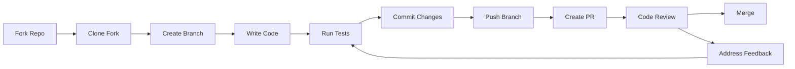
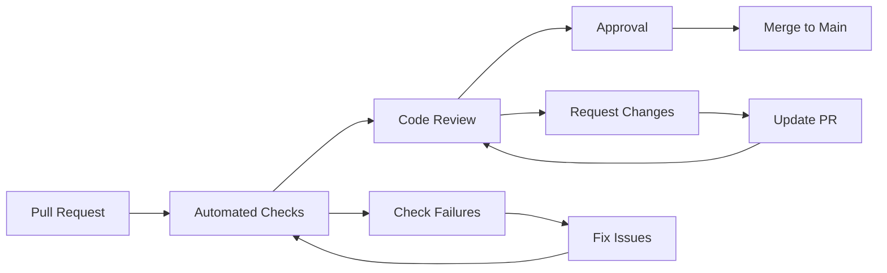

# Contributing Guidelines

Welcome to OpenFrame! This guide outlines our contribution process, coding standards, and best practices for contributing to the OpenFrame ecosystem.

## Getting Started

### Before You Contribute

1. **Join the Community**: Join our [OpenMSP Slack](https://www.openmsp.ai/) for discussions and questions
2. **Read the Documentation**: Understand the architecture and existing codebase
3. **Check Open Issues**: See if your idea is already being discussed
4. **Start Small**: Begin with bug fixes or small features

### Setting Up for Contribution

```bash
# 1. Fork the repository on GitHub
# Click the "Fork" button on the repository page

# 2. Clone your fork
git clone https://github.com/YOUR_USERNAME/openframe-oss-tenant.git
cd openframe-oss-tenant

# 3. Add upstream remote
git remote add upstream https://github.com/flamingo-stack/openframe-oss-tenant.git

# 4. Create feature branch
git checkout -b feature/your-feature-name

# 5. Set up development environment
./scripts/setup-dev-environment.sh
```

## Contribution Workflow



### Step-by-Step Process

#### 1. Create Feature Branch

```bash
# Fetch latest changes
git fetch upstream
git checkout main
git merge upstream/main

# Create feature branch
git checkout -b feature/add-device-monitoring
# or
git checkout -b fix/device-status-bug
# or  
git checkout -b docs/improve-api-documentation
```

#### 2. Make Your Changes

Follow our coding standards (detailed below) and ensure:
- Code compiles without warnings
- All tests pass
- New functionality includes tests
- Documentation is updated

#### 3. Test Your Changes

```bash
# Run full test suite
mvn clean verify

# Run frontend tests
cd openframe/services/openframe-frontend
npm run test
npm run test:e2e

# Run Rust tests
cd clients/openframe-client  
cargo test
```

#### 4. Commit Your Changes

Follow our commit message format:

```bash
# Commit message format: type(scope): description
git commit -m "feat(api): add device health monitoring endpoint"
git commit -m "fix(frontend): resolve device status display issue"
git commit -m "docs(readme): update installation instructions"
git commit -m "test(devices): add integration tests for device service"
```

#### 5. Push and Create Pull Request

```bash
# Push your branch
git push origin feature/add-device-monitoring

# Create Pull Request on GitHub
# Include a clear description of changes and reasoning
```

## Code Style and Standards

### Java Code Style

#### Code Formatting

We use **Google Java Style** with minor modifications:

```java
// ✅ GOOD: Proper formatting and naming
@Service
@Slf4j
public class DeviceService {
    
    private final DeviceRepository deviceRepository;
    private final EventPublisher eventPublisher;
    
    public DeviceService(DeviceRepository deviceRepository, 
                        EventPublisher eventPublisher) {
        this.deviceRepository = deviceRepository;
        this.eventPublisher = eventPublisher;
    }
    
    @Cacheable(value = "devices", key = "#deviceId")
    public Optional<Device> findById(String deviceId) {
        String tenantId = TenantContext.getCurrentTenant();
        
        log.debug("Finding device: {} for tenant: {}", deviceId, tenantId);
        
        return deviceRepository.findByIdAndTenantId(deviceId, tenantId);
    }
}
```

#### Lombok Usage

Use Lombok to reduce boilerplate:

```java
// ✅ GOOD: Proper Lombok usage
@Data
@Builder
@NoArgsConstructor
@AllArgsConstructor
@EqualsAndHashCode(callSuper = true)
public class Device extends BaseEntity {
    
    @NotNull
    private String name;
    
    @NotNull
    private DeviceStatus status;
    
    private String ipAddress;
    
    @Builder.Default
    private List<String> tags = new ArrayList<>();
    
    // Custom methods when needed
    public boolean isOnline() {
        return status == DeviceStatus.ONLINE;
    }
}
```

#### Exception Handling

```java
// ✅ GOOD: Consistent exception handling
@RestController
@Validated
public class DeviceController {
    
    @GetMapping("/devices/{id}")
    public ResponseEntity<DeviceResponse> getDevice(
            @PathVariable @NotBlank String id) {
        
        try {
            Device device = deviceService.findById(id)
                .orElseThrow(() -> new DeviceNotFoundException(id));
            
            return ResponseEntity.ok(deviceMapper.toResponse(device));
            
        } catch (DeviceNotFoundException e) {
            log.warn("Device not found: {}", id);
            throw e; // Let GlobalExceptionHandler handle it
        } catch (Exception e) {
            log.error("Unexpected error fetching device: {}", id, e);
            throw new InternalServerException("Failed to fetch device", e);
        }
    }
}
```

### TypeScript/Vue.js Code Style

#### Component Structure

```vue
<!-- ✅ GOOD: Consistent Vue component structure -->
<template>
  <div class="device-card" :class="deviceStatusClass">
    <div class="device-header">
      <h3 class="device-name">{{ device.name }}</h3>
      <StatusBadge :status="device.status" />
    </div>
    
    <div class="device-metrics">
      <MetricItem 
        v-for="metric in metrics" 
        :key="metric.name"
        :label="metric.label"
        :value="metric.value"
        :unit="metric.unit"
      />
    </div>
  </div>
</template>

<script setup lang="ts">
import { computed } from 'vue'
import type { Device, DeviceMetric } from '@/types/device'
import StatusBadge from '@/components/ui/StatusBadge.vue'
import MetricItem from '@/components/ui/MetricItem.vue'

interface Props {
  device: Device
}

const props = defineProps<Props>()

const emit = defineEmits<{
  deviceSelected: [device: Device]
  statusChanged: [deviceId: string, status: string]
}>()

const metrics = computed((): DeviceMetric[] => {
  return [
    { name: 'cpu', label: 'CPU Usage', value: props.device.cpuUsage, unit: '%' },
    { name: 'memory', label: 'Memory Usage', value: props.device.memoryUsage, unit: '%' },
    { name: 'disk', label: 'Disk Usage', value: props.device.diskUsage, unit: '%' }
  ]
})

const deviceStatusClass = computed(() => ({
  'device-online': props.device.status === 'ONLINE',
  'device-offline': props.device.status === 'OFFLINE',  
  'device-warning': props.device.status === 'WARNING'
}))

function handleDeviceClick(): void {
  emit('deviceSelected', props.device)
}
</script>

<style scoped>
.device-card {
  @apply rounded-lg border border-gray-200 p-4 hover:shadow-md transition-shadow;
}

.device-online {
  @apply border-green-200 bg-green-50;
}

.device-offline {
  @apply border-red-200 bg-red-50;
}

.device-warning {
  @apply border-yellow-200 bg-yellow-50;
}
</style>
```

#### Composables Pattern

```typescript
// ✅ GOOD: Reusable composable
import { ref, computed, onMounted } from 'vue'
import type { Ref } from 'vue'
import { useGraphQLClient } from '@/lib/graphql-client'
import type { Device, DeviceFilters } from '@/types/device'

export function useDevices(organizationId: Ref<string>) {
  const client = useGraphQLClient()
  
  const devices = ref<Device[]>([])
  const loading = ref(false)
  const error = ref<string | null>(null)
  
  const onlineDevices = computed(() => 
    devices.value.filter(device => device.status === 'ONLINE')
  )
  
  const offlineDevices = computed(() =>
    devices.value.filter(device => device.status === 'OFFLINE')  
  )
  
  async function loadDevices(filters?: DeviceFilters): Promise<void> {
    loading.value = true
    error.value = null
    
    try {
      const result = await client.query({
        query: DEVICES_QUERY,
        variables: {
          organizationId: organizationId.value,
          filters
        }
      })
      
      devices.value = result.data.devices
    } catch (err) {
      error.value = err instanceof Error ? err.message : 'Unknown error'
      console.error('Failed to load devices:', err)
    } finally {
      loading.value = false
    }
  }
  
  async function updateDeviceStatus(deviceId: string, status: string): Promise<void> {
    try {
      await client.mutate({
        mutation: UPDATE_DEVICE_STATUS_MUTATION,
        variables: { deviceId, status }
      })
      
      // Update local state
      const deviceIndex = devices.value.findIndex(d => d.id === deviceId)
      if (deviceIndex !== -1) {
        devices.value[deviceIndex].status = status
      }
    } catch (err) {
      console.error('Failed to update device status:', err)
      throw err
    }
  }
  
  onMounted(() => {
    if (organizationId.value) {
      loadDevices()
    }
  })
  
  return {
    devices: readonly(devices),
    loading: readonly(loading),
    error: readonly(error),
    onlineDevices,
    offlineDevices,
    loadDevices,
    updateDeviceStatus
  }
}
```

### Rust Code Style

Follow standard Rust conventions with these additions:

```rust
// ✅ GOOD: Rust service implementation
use anyhow::{Context, Result};
use serde::{Deserialize, Serialize};
use std::time::Duration;
use tracing::{info, warn, error, instrument};

#[derive(Debug, Clone, Serialize, Deserialize)]
pub struct Device {
    pub id: String,
    pub name: String,
    pub status: DeviceStatus,
    pub last_seen: chrono::DateTime<chrono::Utc>,
}

#[derive(Debug, Clone, Serialize, Deserialize)]
pub enum DeviceStatus {
    Online,
    Offline,
    Warning,
}

pub struct DeviceService {
    api_client: ApiClient,
}

impl DeviceService {
    pub fn new(api_client: ApiClient) -> Self {
        Self { api_client }
    }
    
    #[instrument(skip(self), fields(device_id = %device_id))]
    pub async fn get_device(&self, device_id: &str) -> Result<Device> {
        info!("Fetching device: {}", device_id);
        
        let device = self
            .api_client
            .get(&format!("/devices/{}", device_id))
            .await
            .context("Failed to fetch device from API")?;
        
        info!("Successfully fetched device: {}", device_id);
        Ok(device)
    }
    
    #[instrument(skip(self))]
    pub async fn list_devices(&self, organization_id: &str) -> Result<Vec<Device>> {
        let devices = self
            .api_client
            .get(&format!("/organizations/{}/devices", organization_id))
            .await
            .context("Failed to fetch devices list")?;
        
        info!("Fetched {} devices for organization {}", devices.len(), organization_id);
        Ok(devices)
    }
}

// Error handling
#[derive(Debug, thiserror::Error)]
pub enum DeviceError {
    #[error("Device not found: {id}")]
    NotFound { id: String },
    
    #[error("API client error: {source}")]
    ApiError {
        #[from]
        source: ApiClientError,
    },
    
    #[error("Network error: {0}")]
    NetworkError(String),
}
```

## Branch Naming Conventions

Use clear, descriptive branch names:

| Type | Pattern | Example |
|------|---------|---------|
| **Feature** | `feature/description` | `feature/device-health-monitoring` |
| **Bug Fix** | `fix/description` | `fix/device-status-display-issue` |
| **Hotfix** | `hotfix/description` | `hotfix/security-patch-auth` |
| **Documentation** | `docs/description` | `docs/api-documentation-update` |
| **Refactor** | `refactor/description` | `refactor/device-service-cleanup` |
| **Performance** | `perf/description` | `perf/optimize-device-queries` |

## Commit Message Format

We follow **Conventional Commits** specification:

```
type(scope): description

[optional body]

[optional footer(s)]
```

### Commit Types

| Type | Description | Example |
|------|-------------|---------|
| **feat** | New feature | `feat(api): add device health monitoring` |
| **fix** | Bug fix | `fix(frontend): resolve device status display` |
| **docs** | Documentation | `docs(readme): update installation guide` |
| **style** | Code style changes | `style(api): fix code formatting` |
| **refactor** | Code refactoring | `refactor(service): simplify device queries` |
| **perf** | Performance improvement | `perf(database): optimize device lookups` |
| **test** | Add missing tests | `test(device): add integration tests` |
| **chore** | Build/tooling changes | `chore(deps): update Spring Boot to 3.3.1` |

### Commit Examples

```bash
# ✅ GOOD examples
git commit -m "feat(api): add GraphQL subscription for device events"
git commit -m "fix(auth): resolve JWT token expiration handling"  
git commit -m "docs(contributing): add commit message guidelines"
git commit -m "test(device-service): add unit tests for device creation"
git commit -m "refactor(data-layer): extract common repository patterns"

# ❌ BAD examples  
git commit -m "fix stuff"
git commit -m "WIP"
git commit -m "update code"
git commit -m "add new feature"
```

## Pull Request Process

### PR Creation Checklist

Before creating a Pull Request, ensure:

- [ ] **Code Quality**: Follows coding standards and conventions
- [ ] **Tests**: All existing tests pass, new tests added for new functionality
- [ ] **Documentation**: README, API docs, or inline documentation updated
- [ ] **Security**: No sensitive data exposed, follows security best practices
- [ ] **Performance**: Changes don't negatively impact performance
- [ ] **Breaking Changes**: Documented and justified if any

### PR Template

Use this template for your Pull Request description:

```markdown
## Description
Brief description of changes and why they're needed.

## Type of Change
- [ ] Bug fix (non-breaking change that fixes an issue)
- [ ] New feature (non-breaking change that adds functionality)
- [ ] Breaking change (fix or feature that would cause existing functionality to not work as expected)
- [ ] Documentation update
- [ ] Performance improvement
- [ ] Refactoring (no functional changes)

## Changes Made
- List specific changes made
- Include any architectural decisions
- Mention any dependencies added/removed

## Testing
- [ ] Unit tests added/updated
- [ ] Integration tests added/updated  
- [ ] Manual testing completed
- [ ] All tests passing

## Screenshots (if applicable)
Include before/after screenshots for UI changes.

## Breaking Changes
Describe any breaking changes and migration steps.

## Additional Notes
Any additional context, concerns, or areas that need special attention.
```

### Code Review Process

#### What Reviewers Look For

1. **Functionality**: Does the code solve the stated problem?
2. **Design**: Is the solution well-designed and maintainable?
3. **Security**: Are there any security implications?
4. **Performance**: Could this impact system performance?
5. **Testing**: Is the code properly tested?
6. **Documentation**: Is it clear how to use the new functionality?

#### Review Checklist

**Architecture & Design**
- [ ] Follows established patterns and conventions
- [ ] Doesn't introduce circular dependencies
- [ ] Uses appropriate design patterns
- [ ] Considers multi-tenant implications

**Code Quality**
- [ ] Code is readable and well-commented
- [ ] No code duplication without justification  
- [ ] Error handling is appropriate
- [ ] Logging is meaningful and at correct levels

**Security**
- [ ] Input validation is present
- [ ] SQL injection prevention measures
- [ ] Authentication/authorization checks
- [ ] No sensitive data in logs or responses

**Testing**
- [ ] Unit tests cover new functionality
- [ ] Integration tests for service interactions
- [ ] Edge cases are tested
- [ ] Test names clearly describe scenarios

## Quality Gates

### Automated Checks

All Pull Requests must pass:

```bash
# Build verification
mvn clean compile -DskipTests

# Unit test suite
mvn test

# Integration test suite
mvn verify -Dgroups=integration

# Code quality checks
mvn checkstyle:check
mvn spotbugs:check

# Frontend checks
npm run lint
npm run type-check
npm run test
```

### Coverage Requirements

| Component | Line Coverage | Branch Coverage |
|-----------|---------------|-----------------|
| **Java Services** | 80% minimum | 70% minimum |
| **Frontend Code** | 75% minimum | 65% minimum |
| **Rust Client** | 85% minimum | 75% minimum |

### Code Quality Metrics

- **Cyclomatic Complexity**: Maximum 10 per method
- **Method Length**: Maximum 50 lines
- **Class Length**: Maximum 500 lines
- **Parameter Count**: Maximum 5 parameters per method

## Documentation Standards

### Code Documentation

#### JavaDoc Standards

```java
/**
 * Service for managing devices within a tenant context.
 * 
 * <p>This service provides CRUD operations for devices, ensuring proper
 * tenant isolation and security. All operations are automatically
 * scoped to the current tenant context.
 * 
 * @author OpenFrame Team
 * @since 1.0.0
 */
@Service
public class DeviceService {
    
    /**
     * Finds a device by its ID within the current tenant scope.
     * 
     * @param deviceId the unique identifier of the device
     * @return Optional containing the device if found, empty otherwise
     * @throws IllegalArgumentException if deviceId is null or empty
     * @throws SecurityException if current user lacks access to device
     */
    public Optional<Device> findById(@NotNull String deviceId) {
        // Implementation
    }
}
```

#### TypeScript Documentation

```typescript
/**
 * Composable for managing device-related state and operations.
 * 
 * Provides reactive device data, loading states, and CRUD operations
 * with automatic tenant scoping and real-time updates.
 * 
 * @param organizationId - Reactive reference to organization ID
 * @returns Device management utilities and reactive state
 * 
 * @example
 * ```typescript
 * const { devices, loading, loadDevices } = useDevices(ref('org-123'))
 * await loadDevices({ status: 'ONLINE' })
 * ```
 */
export function useDevices(organizationId: Ref<string>) {
  // Implementation
}
```

### API Documentation

#### GraphQL Schema Documentation

```graphql
"""
Represents a managed device within an organization.
Devices can be servers, workstations, mobile devices, or network equipment.
"""
type Device {
  """Unique identifier for the device"""
  id: ID!
  
  """Human-readable name for the device"""  
  name: String!
  
  """Current operational status of the device"""
  status: DeviceStatus!
  
  """Organization that owns this device"""
  organization: Organization!
  
  """List of installed agents on this device"""
  installedAgents: [InstalledAgent!]!
  
  """Device metrics and performance data"""
  metrics: DeviceMetrics
  
  """Timestamp when device was last seen online"""
  lastSeen: DateTime
}

"""Possible device operational states"""
enum DeviceStatus {
  """Device is online and responding"""
  ONLINE
  
  """Device is offline or unreachable"""  
  OFFLINE
  
  """Device has warnings but is operational"""
  WARNING
  
  """Device has critical issues"""
  CRITICAL
}
```

## Security Guidelines

### Authentication & Authorization

```java
// ✅ GOOD: Proper security implementation
@RestController
@PreAuthorize("hasRole('USER')")
public class DeviceController {
    
    @GetMapping("/devices/{id}")
    @PreAuthorize("@deviceService.hasAccess(#id, authentication.principal)")
    public ResponseEntity<Device> getDevice(@PathVariable String id) {
        // Tenant context is automatically applied
        Device device = deviceService.findById(id);
        return ResponseEntity.ok(device);
    }
}
```

### Input Validation

```java
// ✅ GOOD: Comprehensive input validation
@Data
@Validated
public class CreateDeviceRequest {
    
    @NotBlank(message = "Device name is required")
    @Size(min = 3, max = 100, message = "Device name must be 3-100 characters")
    @Pattern(regexp = "^[a-zA-Z0-9\\-_\\s]+$", message = "Invalid characters in device name")
    private String name;
    
    @NotNull(message = "Organization ID is required")
    @UUID(message = "Organization ID must be valid UUID")
    private String organizationId;
    
    @Valid
    private List<@NotBlank String> tags = new ArrayList<>();
}
```

### Secure Coding Practices

```java
// ✅ GOOD: Secure database queries
@Query("{ 'tenantId': ?#{T(com.openframe.security.TenantContext).getCurrentTenant()}, " +
       "'organizationId': ?0, 'id': ?1 }")
Optional<Device> findByOrganizationAndId(String organizationId, String deviceId);

// ✅ GOOD: Parameterized logging (prevents log injection)
log.info("Device created: deviceId={}, organizationId={}", device.getId(), device.getOrganizationId());

// ❌ BAD: String concatenation in logs
log.info("Device created: " + device.getName()); // Potential log injection
```

## Performance Guidelines

### Database Queries

```java
// ✅ GOOD: Efficient queries with proper indexing
@Query(value = "{ 'tenantId': ?0, 'status': ?1 }", 
       fields = "{ 'id': 1, 'name': 1, 'status': 1 }")
List<Device> findDevicesSummary(String tenantId, DeviceStatus status);

// ✅ GOOD: Use projections to reduce data transfer
public interface DeviceSummary {
    String getId();
    String getName();  
    DeviceStatus getStatus();
}
```

### Caching Best Practices

```java
// ✅ GOOD: Appropriate caching with tenant awareness
@Cacheable(value = "devices", key = "#tenantId + ':' + #deviceId")
public Optional<Device> findById(String tenantId, String deviceId) {
    return deviceRepository.findByIdAndTenantId(deviceId, tenantId);
}

// ✅ GOOD: Cache eviction on updates
@CacheEvict(value = "devices", key = "#device.tenantId + ':' + #device.id")
public Device updateDevice(Device device) {
    return deviceRepository.save(device);
}
```

## Review Process

### Review Stages



### Review Criteria

#### ✅ Approval Criteria

- All automated checks pass
- Code follows established patterns
- Adequate test coverage
- Documentation is updated
- No security concerns
- Performance impact is acceptable

#### ❌ Common Issues

- Hardcoded values instead of configuration
- Missing input validation
- Inadequate error handling
- Tests that don't actually test behavior
- Breaking changes without proper migration
- Security vulnerabilities

### Reviewer Guidelines

#### Constructive Feedback

```markdown
# ✅ GOOD: Constructive feedback
This looks good overall! A couple of suggestions:

1. Consider extracting the validation logic into a separate validator class for reusability
2. Could we add a unit test for the edge case where organizationId is null?
3. Minor: The method name `processData` could be more specific - maybe `validateAndTransformDeviceData`?

Great work on the error handling - the exception messages are very clear!

# ❌ BAD: Non-constructive feedback
This code is bad. Fix it.
```

#### Focus Areas for Review

1. **Security**: Always check for security implications
2. **Multi-tenancy**: Ensure tenant isolation is maintained  
3. **Performance**: Look for potential performance issues
4. **Testing**: Verify adequate test coverage
5. **Documentation**: Ensure code is well-documented
6. **Maintainability**: Code should be easy to understand and modify

## Release Process

### Version Management

We use **Semantic Versioning** (SemVer):

- **Major** (x.0.0): Breaking changes
- **Minor** (0.x.0): New features, backward compatible
- **Patch** (0.0.x): Bug fixes, backward compatible

### Release Checklist

- [ ] All tests pass
- [ ] Documentation updated
- [ ] Change log updated  
- [ ] Version numbers bumped
- [ ] Security scan completed
- [ ] Performance testing completed
- [ ] Staging deployment successful

## Getting Help

### Resources

- **Architecture Documentation**: Understand system design
- **API Documentation**: Explore available APIs
- **Testing Guide**: Learn testing patterns and practices

### Community Support

- **OpenMSP Slack**: Real-time help and discussions
- **GitHub Discussions**: Long-form technical discussions
- **Code Reviews**: Learn from feedback on your contributions

### Mentorship

New contributors can get help through:

- **Good First Issues**: Labeled issues perfect for new contributors
- **Pairing Sessions**: Schedule time with maintainers
- **Code Walkthroughs**: Review existing code with experienced developers

## Recognition

We value all contributions! Contributors are recognized through:

- **Contributors List**: Added to project contributors
- **Release Notes**: Major contributions highlighted in releases
- **Community Spotlight**: Featured in community updates
- **Maintainer Path**: Active contributors can become maintainers

---

**🤝 Thank you for contributing to OpenFrame!** Your contributions help build better open-source MSP tooling for the entire community.

Ready to contribute? Start by exploring the codebase, joining our Slack community, and picking up a "Good First Issue" to get familiar with our workflow.