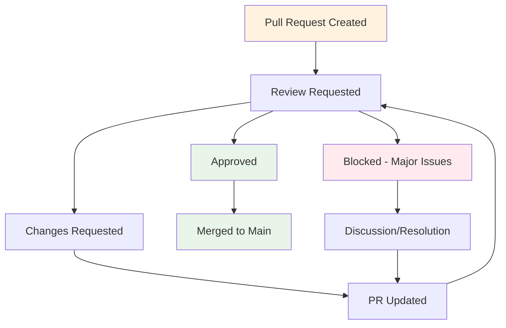
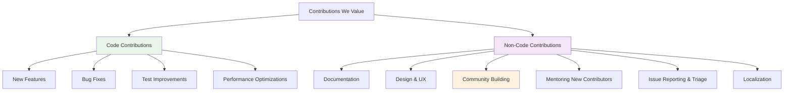

# Contributing Guidelines

Welcome to the OpenFrame project! We're excited to have you contribute to the future of AI-powered MSP operations. This guide will help you get started with contributing code, documentation, and ideas to the OpenFrame ecosystem.

## Getting Started

### Before You Contribute

1. **Join the Community**: Join our [OpenMSP Slack community](https://join.slack.com/t/openmsp/shared_invite/zt-36bl7mx0h-3~U2nFH6nqHqoTPXMaHEHA) for discussions, questions, and coordination
2. **Read the Documentation**: Familiarize yourself with the [Architecture Overview](../architecture/README.md) and [Development Setup](../setup/environment.md)
3. **Explore the Codebase**: Clone the repository and run OpenFrame locally to understand the system
4. **Check Existing Issues**: Look at GitHub Issues to find contribution opportunities

### Types of Contributions

We welcome various types of contributions:

```mermaid
graph TB
    Contribute[Contributing to OpenFrame]
    
    Contribute --> Code[Code Contributions]
    Contribute --> Docs[Documentation]
    Contribute --> Issues[Bug Reports & Features]
    Contribute --> Community[Community Support]
    
    Code --> Features[New Features]
    Code --> Bugs[Bug Fixes]
    Code --> Performance[Performance Improvements]
    Code --> Security[Security Enhancements]
    
    Docs --> Tutorials[Tutorials & Guides]
    Docs --> API[API Documentation]
    Docs --> Architecture[Architecture Docs]
    Docs --> Examples[Code Examples]
    
    Issues --> BugReport[Bug Reports]
    Issues --> FeatureReq[Feature Requests]
    Issues --> Enhancement[Enhancements]
    
    Community --> Slack[Slack Support]
    Community --> Reviews[Code Reviews]
    Community --> Mentoring[Mentoring New Contributors]
    
    style Code fill:#e8f5e8
    style Docs fill:#fff3e0
    style Issues fill:#ffebee
    style Community fill:#f3e5f5
```



## Code Style and Conventions

### Backend (Java) Style Guide

**Naming Conventions:**
```java
// Classes: PascalCase
public class DeviceManagementService {
    
    // Constants: SCREAMING_SNAKE_CASE
    private static final String DEFAULT_DEVICE_TYPE = "WORKSTATION";
    
    // Methods and variables: camelCase
    private final DeviceRepository deviceRepository;
    
    public DeviceDto createDevice(CreateDeviceRequest request) {
        String deviceName = request.getName();
        return processDeviceCreation(deviceName);
    }
    
    // Private methods: camelCase with descriptive names
    private DeviceDto processDeviceCreation(String deviceName) {
        // Implementation
    }
}
```

**Documentation Standards:**
```java
/**
 * Service for managing device lifecycle operations.
 * 
 * <p>This service handles device creation, updates, status management,
 * and integration with external monitoring tools. All operations are
 * tenant-aware and include proper security validations.</p>
 * 
 * @author OpenFrame Team
 * @since 1.0.0
 */
@Service
@Slf4j
@RequiredArgsConstructor
public class DeviceManagementService {
    
    /**
     * Creates a new device in the specified organization.
     * 
     * @param request the device creation request containing name, type, and configuration
     * @return the created device with generated ID and default settings
     * @throws DuplicateDeviceNameException if a device with the same name exists
     * @throws OrganizationNotFoundException if the organization doesn't exist
     */
    @Transactional
    public DeviceDto createDevice(CreateDeviceRequest request) {
        log.debug("Creating device with name: {}", request.getName());
        
        validateDeviceCreationRequest(request);
        Device device = buildDeviceFromRequest(request);
        Device savedDevice = deviceRepository.save(device);
        
        eventPublisher.publishEvent(new DeviceCreatedEvent(savedDevice));
        log.info("Successfully created device with ID: {}", savedDevice.getId());
        
        return deviceMapper.toDto(savedDevice);
    }
}
```

**Testing Standards:**
```java
@DisplayName("Device Management Service Tests")
class DeviceManagementServiceTest {
    
    @Test
    @DisplayName("Should create device successfully with valid request")
    void shouldCreateDeviceSuccessfullyWithValidRequest() {
        // Given
        CreateDeviceRequest request = CreateDeviceRequest.builder()
            .name("Test Device")
            .organizationId("org-123")
            .deviceType(DeviceType.WORKSTATION)
            .build();
            
        when(deviceRepository.save(any(Device.class)))
            .thenReturn(expectedDevice());
        
        // When
        DeviceDto result = deviceService.createDevice(request);
        
        // Then
        assertThat(result).isNotNull();
        assertThat(result.getName()).isEqualTo("Test Device");
        verify(eventPublisher).publishEvent(any(DeviceCreatedEvent.class));
    }
}
```

### Frontend (TypeScript/React) Style Guide

**Component Structure:**
```typescript
// DeviceCard.tsx
import React from 'react';
import { Device, DeviceStatus } from '@/types/device';
import { Badge } from '@/components/ui/badge';
import { Button } from '@/components/ui/button';
import { Card, CardContent, CardHeader, CardTitle } from '@/components/ui/card';

interface DeviceCardProps {
  /** The device to display */
  device: Device;
  /** Callback when device is selected */
  onDeviceSelect?: (device: Device) => void;
  /** Whether the device is currently loading */
  isLoading?: boolean;
  /** Additional CSS classes */
  className?: string;
}

/**
 * Displays device information in a card format.
 * 
 * Shows device name, status, IP address, and last seen timestamp.
 * Provides actions for device management when clicked.
 */
export const DeviceCard: React.FC<DeviceCardProps> = ({
  device,
  onDeviceSelect,
  isLoading = false,
  className
}) => {
  const handleClick = () => {
    if (!isLoading && onDeviceSelect) {
      onDeviceSelect(device);
    }
  };

  const getStatusColor = (status: DeviceStatus): string => {
    switch (status) {
      case DeviceStatus.ONLINE:
        return 'bg-green-100 text-green-800';
      case DeviceStatus.OFFLINE:
        return 'bg-red-100 text-red-800';
      case DeviceStatus.MAINTENANCE:
        return 'bg-yellow-100 text-yellow-800';
      default:
        return 'bg-gray-100 text-gray-800';
    }
  };

  return (
    <Card 
      className={`cursor-pointer transition-all hover:shadow-md ${className}`}
      onClick={handleClick}
      data-testid="device-card"
    >
      <CardHeader>
        <CardTitle className="flex items-center justify-between">
          <span>{device.name}</span>
          <Badge 
            className={getStatusColor(device.status)}
            data-testid="device-status"
          >
            {device.status}
          </Badge>
        </CardTitle>
      </CardHeader>
      
      <CardContent>
        <div className="space-y-2">
          <div className="text-sm text-gray-600">
            <strong>IP Address:</strong> {device.ipAddress}
          </div>
          <div className="text-sm text-gray-600">
            <strong>Last Seen:</strong> {new Date(device.lastSeen).toLocaleString()}
          </div>
        </div>
        
        {isLoading && (
          <div className="mt-4 flex justify-center">
            <div className="animate-spin h-4 w-4 border-2 border-blue-500 rounded-full border-t-transparent" 
                 data-testid="loading-spinner" />
          </div>
        )}
      </CardContent>
    </Card>
  );
};
```

**Hook Patterns:**
```typescript
// useDevices.ts
import { useQuery, useMutation, useQueryClient } from '@tanstack/react-query';
import { ApiClient } from '@/lib/api-client';
import { Device, CreateDeviceRequest } from '@/types/device';

/**
 * Hook for managing device data and operations.
 * 
 * Provides reactive state management for device list,
 * creation, updates, and deletion with optimistic updates.
 */
export const useDevices = (organizationId: string) => {
  const queryClient = useQueryClient();
  const apiClient = new ApiClient();

  const devicesQuery = useQuery({
    queryKey: ['devices', organizationId],
    queryFn: () => apiClient.getDevices(organizationId),
    enabled: !!organizationId,
    staleTime: 5 * 60 * 1000, // 5 minutes
  });

  const createDeviceMutation = useMutation({
    mutationFn: (request: CreateDeviceRequest) =>
      apiClient.createDevice(request),
    onSuccess: (newDevice) => {
      // Optimistically update the cache
      queryClient.setQueryData(
        ['devices', organizationId],
        (old: Device[] = []) => [...old, newDevice]
      );
    },
    onError: (error) => {
      console.error('Failed to create device:', error);
      // Show error toast
    },
  });

  return {
    devices: devicesQuery.data ?? [],
    isLoading: devicesQuery.isLoading,
    error: devicesQuery.error,
    createDevice: createDeviceMutation.mutate,
    isCreating: createDeviceMutation.isPending,
    refetch: devicesQuery.refetch,
  };
};
```

## Branch Naming and PR Process

### Branch Naming Convention

Use descriptive branch names that indicate the type and scope of changes:

```text
<type>/<scope>/<description>

Types:
- feature/    New functionality
- fix/        Bug fixes
- docs/       Documentation updates
- refactor/   Code improvements without functionality changes
- test/       Testing improvements
- chore/      Build, CI, or maintenance tasks

Examples:
feature/device-management/add-device-actions
fix/api/device-creation-validation
docs/architecture/update-security-guide
refactor/frontend/component-structure
test/integration/device-api-tests
chore/ci/update-github-actions
```

### Pull Request Process

**1. Pre-submission Checklist:**
- [ ] Code follows style guidelines
- [ ] Tests are written and passing
- [ ] Documentation is updated
- [ ] Security considerations are addressed
- [ ] Performance impact is minimal
- [ ] Breaking changes are documented

**2. PR Title Format:**
```text
<type>(<scope>): <description>

Examples:
feat(device-api): add device health monitoring endpoints
fix(auth): resolve JWT token expiration handling
docs(getting-started): update installation instructions
refactor(frontend): restructure device components
```

**3. PR Description Template:**
```markdown
## Description
Brief description of the changes and why they were made.

## Type of Change
- [ ] Bug fix (non-breaking change which fixes an issue)
- [ ] New feature (non-breaking change which adds functionality)
- [ ] Breaking change (fix or feature that would cause existing functionality to not work as expected)
- [ ] Documentation update
- [ ] Performance improvement
- [ ] Refactoring
- [ ] Security improvement

## How Has This Been Tested?
- [ ] Unit tests
- [ ] Integration tests
- [ ] Manual testing
- [ ] E2E tests

## Screenshots (if applicable)
Add screenshots or GIFs for UI changes.

## Checklist
- [ ] My code follows the project's style guidelines
- [ ] I have performed a self-review of my code
- [ ] I have commented my code, particularly in hard-to-understand areas
- [ ] I have made corresponding changes to the documentation
- [ ] My changes generate no new warnings
- [ ] I have added tests that prove my fix is effective or that my feature works
- [ ] New and existing unit tests pass locally with my changes
- [ ] Any dependent changes have been merged and published

## Related Issues
Fixes #(issue number)
Closes #(issue number)
Related to #(issue number)
```

## Commit Message Format

We follow the [Conventional Commits](https://www.conventionalcommits.org/) specification:

### Commit Message Structure
```text
<type>[optional scope]: <description>

[optional body]

[optional footer(s)]
```

### Commit Types
- **feat**: A new feature
- **fix**: A bug fix
- **docs**: Documentation only changes
- **style**: Changes that do not affect the meaning of the code (white-space, formatting, missing semi-colons, etc)
- **refactor**: A code change that neither fixes a bug nor adds a feature
- **perf**: A code change that improves performance
- **test**: Adding missing tests or correcting existing tests
- **chore**: Changes to the build process or auxiliary tools and libraries

### Examples
```text
feat(device-api): add device health status endpoint

Add new endpoint to retrieve real-time health status for devices.
Includes CPU, memory, and disk usage metrics from agent reports.

Closes #123

fix(auth): resolve token refresh infinite loop

The token refresh mechanism was causing infinite loops when the
refresh token was expired. Added proper error handling and logout
flow for expired refresh tokens.

Fixes #456

docs(api): update device management API documentation

- Add examples for device creation and update operations
- Document new health status fields
- Update authentication requirements

test(device-service): add unit tests for device validation

Increase test coverage for device creation and validation logic.
All edge cases are now covered including invalid IP addresses
and duplicate device names.
```

## Code Review Guidelines

### For Contributors (PR Authors)

**Before Requesting Review:**
1. **Self-review**: Read through your changes as if you're reviewing someone else's code
2. **Test thoroughly**: Ensure all tests pass and new functionality works as expected
3. **Document changes**: Update documentation, add comments for complex logic
4. **Small PRs**: Keep PRs focused and reasonably sized (< 400 lines when possible)
5. **Clear description**: Provide context, reasoning, and testing information

**Responding to Feedback:**
- Be open to suggestions and constructive criticism
- Ask questions if feedback isn't clear
- Make requested changes promptly
- Thank reviewers for their time and insights

### For Reviewers

**Review Focus Areas:**

**1. Functionality:**
- Does the code solve the intended problem?
- Are edge cases handled properly?
- Is the solution scalable and maintainable?

**2. Code Quality:**
- Is the code readable and well-structured?
- Are naming conventions followed?
- Is there appropriate error handling?

**3. Security:**
- Are there any security vulnerabilities?
- Is input validation implemented?
- Are authentication and authorization proper?

**4. Performance:**
- Are there any performance concerns?
- Is database usage optimized?
- Are there potential memory leaks?

**5. Testing:**
- Are tests comprehensive and meaningful?
- Do tests cover edge cases?
- Are integration points tested?

**Review Checklist:**
```markdown
## Code Review Checklist

### Functionality
- [ ] Code solves the stated problem
- [ ] Edge cases are handled
- [ ] Error handling is appropriate
- [ ] API contracts are maintained

### Security
- [ ] Input validation is implemented
- [ ] SQL injection is prevented
- [ ] Authentication/authorization is correct
- [ ] Sensitive data is properly handled

### Performance
- [ ] No obvious performance issues
- [ ] Database queries are optimized
- [ ] Caching is used appropriately
- [ ] Memory usage is reasonable

### Code Quality
- [ ] Code is readable and maintainable
- [ ] Naming conventions are followed
- [ ] Comments explain complex logic
- [ ] Code follows project patterns

### Testing
- [ ] Unit tests cover new functionality
- [ ] Integration tests verify service interactions
- [ ] Tests are meaningful and not just for coverage
- [ ] Tests follow AAA pattern (Arrange, Act, Assert)

### Documentation
- [ ] API documentation is updated
- [ ] Complex logic is commented
- [ ] README files reflect changes
- [ ] Migration guides provided for breaking changes
```

**Providing Feedback:**
- Be constructive and specific
- Explain the "why" behind suggestions
- Offer alternatives when pointing out problems
- Acknowledge good code and improvements
- Use GitHub's suggestion feature for small changes

## Review Process Workflow

### Review Timeline Expectations

| PR Size | Expected Review Time | Definition |
|---------|---------------------|------------|
| **Small** | 24 hours | < 100 lines, focused changes |
| **Medium** | 2-3 days | 100-400 lines, moderate complexity |
| **Large** | 3-5 days | > 400 lines, high complexity |
| **Critical** | 4 hours | Security fixes, production issues |

### Review States



**Review Requirements:**
- **All PRs**: At least 1 approving review
- **Security-related**: 2 approving reviews, including security team member
- **Breaking changes**: 2 approving reviews, including team lead
- **Documentation**: 1 approving review from documentation team

## Quality Assurance

### Automated Quality Checks

**Pre-commit Hooks:**
```bash
#!/bin/sh
# .git/hooks/pre-commit

echo "Running pre-commit quality checks..."

# Java code formatting
mvn spotless:check

# Frontend linting
cd openframe/services/openframe-frontend
npm run lint

# Security scan
mvn org.owasp:dependency-check-maven:check

# Unit tests
mvn test -Dmaven.test.failure.ignore=false

echo "Pre-commit checks completed!"
```

**CI/CD Quality Gates:**
```yaml
name: Quality Gates

on:
  pull_request:
    branches: [ main ]

jobs:
  quality-check:
    runs-on: ubuntu-latest
    
    steps:
    - name: Code Coverage Check
      run: |
        mvn jacoco:check
        # Fails if coverage below 85%
        
    - name: Security Vulnerability Scan
      run: |
        mvn org.owasp:dependency-check-maven:check
        
    - name: Code Quality Analysis
      uses: sonarcloud/sonarcloud-action@master
      
    - name: Performance Regression Test
      run: |
        ./scripts/performance-regression-check.sh
```

### Manual Quality Assurance

**Testing Checklist:**
- [ ] Feature works as expected
- [ ] No regressions in existing functionality
- [ ] Performance is acceptable
- [ ] UI/UX is intuitive and consistent
- [ ] Error messages are helpful
- [ ] Security considerations are addressed

## Communication Guidelines

### Slack Channels

Join our [OpenMSP Slack workspace](https://join.slack.com/t/openmsp/shared_invite/zt-36bl7mx0h-3~U2nFH6nqHqoTPXMaHEHA) for real-time communication:

- **#general**: General OpenFrame discussions
- **#development**: Development questions and coordination
- **#architecture**: Architecture decisions and discussions
- **#security**: Security-related discussions
- **#feature-requests**: Propose new features
- **#help**: Get help with setup and usage
- **#contributors**: Contributor coordination and mentoring

### Issue Communication

**Creating Good Issues:**
```markdown
## Issue Template: Bug Report

**Describe the bug**
A clear and concise description of what the bug is.

**To Reproduce**
Steps to reproduce the behavior:
1. Go to '...'
2. Click on '....'
3. Scroll down to '....'
4. See error

**Expected behavior**
A clear and concise description of what you expected to happen.

**Screenshots**
If applicable, add screenshots to help explain your problem.

**Environment (please complete the following information):**
- OS: [e.g. Ubuntu 20.04]
- Java Version: [e.g. 21]
- OpenFrame Version: [e.g. 1.2.0]
- Browser [e.g. chrome, safari]

**Additional context**
Add any other context about the problem here.
```

## Recognition and Contributors

### Contributor Recognition

We believe in recognizing contributors' efforts:

- **All Contributors**: Listed in README and release notes
- **Significant Contributors**: Featured in documentation
- **Core Contributors**: Invited to quarterly contributor meetings
- **Maintainers**: Granted repository permissions and decision-making authority

### Contribution Types We Recognize



### Becoming a Maintainer

**Path to Maintainership:**
1. **Regular Contributions**: Consistent, quality contributions over 3+ months
2. **Community Engagement**: Active participation in discussions and helping others
3. **Domain Expertise**: Demonstrated expertise in specific areas of the codebase
4. **Code Quality**: Track record of well-tested, well-documented contributions
5. **Collaboration**: Works well with existing team and shows good judgment

**Maintainer Responsibilities:**
- Review pull requests in your area of expertise
- Help triage and prioritize issues
- Mentor new contributors
- Participate in architectural discussions
- Maintain code quality standards

---

Thank you for contributing to OpenFrame! Your efforts help build the future of AI-powered MSP operations.

**Getting Started:**
1. Join our [OpenMSP Slack community](https://join.slack.com/t/openmsp/shared_invite/zt-36bl7mx0h-3~U2nFH6nqHqoTPXMaHEHA)
2. Set up your [development environment](../setup/environment.md)
3. Find a "good first issue" on GitHub
4. Start contributing!

> **💡 Contribution Tip**: Start small with documentation improvements or bug fixes to get familiar with the codebase and processes. As you build confidence and expertise, you can take on larger features and architectural improvements.