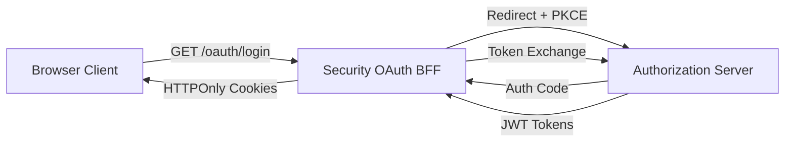
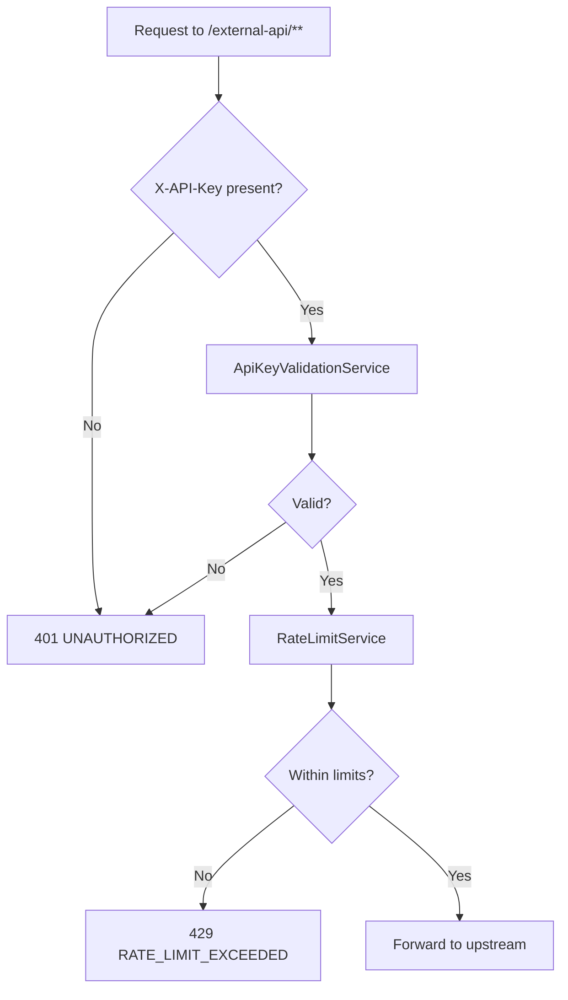

# Security Best Practices

This document covers authentication and authorization patterns, data security, input validation, secrets management, and security testing guidelines for the OpenFrame OSS Tenant platform.

---

## Authentication & Authorization Patterns

### OAuth2 Authorization Code + PKCE

All browser-based authentication uses OAuth2 Authorization Code flow with Proof Key for Code Exchange (PKCE). The Security OAuth BFF (Backend-for-Frontend) mediates between the browser and the Authorization Server:



**Security properties enforced:**
- `code_verifier` and `code_challenge` generated server-side (not in browser)
- `state` parameter validated to prevent CSRF
- Tokens stored in HTTPOnly cookies — inaccessible to JavaScript
- Refresh tokens stored separately and rotated on use

### JWT Token Claims

All access tokens include the following standard claims:

| Claim | Type | Description |
|-------|------|-------------|
| `sub` | string | User ID |
| `tenant_id` | string | Tenant identifier |
| `userId` | string | Internal user ID |
| `roles` | array | User roles (`ADMIN`, `OWNER`, `AGENT`) |
| `iss` | string | Issuer URL (per-tenant) |
| `exp` | number | Expiration timestamp |

> If a user has the `OWNER` role, `ADMIN` is automatically included in the roles array.

### Role-Based Access Control (RBAC)

The Gateway enforces role-based routing:

| Route Pattern | Required Role |
|--------------|--------------|
| `/api/**` | `ADMIN` |
| `/tools/agent/**` | `AGENT` |
| `/ws/tools/agent/**` | `AGENT` |
| `/tools/**` | `ADMIN` |
| `/chat/**` | `ADMIN` or `AGENT` |
| `/external-api/**` | Valid API Key |

### API Key Authentication

External API access via `/external-api/**` uses API keys (not JWTs):



**API Key best practices:**
- Generate API keys with sufficient entropy (platform generates these automatically)
- Rotate keys regularly via the API Key management UI
- Use separate keys per integration/client
- Monitor rate limit headers in responses

---

## Data Encryption & Secure Storage

### Per-Tenant RSA Key Pairs

Each tenant in the Authorization Server has its own RSA key pair:

- Generated by `RsaAuthenticationKeyPairGenerator` (2048-bit RSA)
- Private keys encrypted at rest using `EncryptionService`
- Stored in MongoDB `TenantKey` collection
- Used for JWT signing (per-tenant issuer)

**Key rotation:** The `TenantKeyService` supports key rotation. New tokens are signed with the new key; old tokens remain valid until expiry.

### Password Hashing

All user passwords are hashed using **BCrypt**:

```java
// Configured in ManagementConfiguration
@Bean
public PasswordEncoder passwordEncoder() {
    return new BCryptPasswordEncoder();
}
```

Never store plain-text or reversibly-encrypted passwords.

### Sensitive Configuration

Sensitive configuration values (database credentials, OAuth secrets, JWT keys) should be managed as:

1. **Kubernetes Secrets** (production)
2. **Spring Cloud Config with encryption** (using `{cipher}` prefix)
3. **Local `.env` files** (development only — never commit to Git)

**Never commit secrets to the repository.** The `.gitignore` should exclude:

```text
.env
*.pem
*.key
application-local.yml
application-local.properties
```

---

## Input Validation & Sanitization

### Bean Validation

All REST and GraphQL input is validated using Jakarta Bean Validation (`@Valid`, `@NotNull`, `@Email`, etc.):

```java
// Example from tenant registration
public record TenantRegistrationRequest(
    @NotBlank @TenantDomain String tenantDomain,
    @NotBlank @ValidEmail String adminEmail,
    @NotBlank @Size(min = 8) String password
) {}
```

Custom validators in the platform:

| Validator | Annotation | Purpose |
|-----------|-----------|---------|
| `TenantDomainValidator` | `@TenantDomain` | Validates tenant domain format |
| `ValidEmailValidator` | `@ValidEmail` | Custom email validation |

### GraphQL Input Validation

GraphQL mutations validate inputs at the DataFetcher level before passing to domain services. Exception handling is centralized in:

- `GlobalExceptionHandler` — REST validation errors
- `GraphQLExceptionHandler` — GraphQL error responses

### SQL/NoSQL Injection Prevention

MongoDB queries use Spring Data's repository abstraction with typed criteria — parameterized queries prevent NoSQL injection. Always use `MongoTemplate` or Spring Data repository methods instead of raw MongoDB string queries.

---

## Common Security Vulnerabilities & Mitigations

| Vulnerability | Mitigation in OpenFrame |
|--------------|------------------------|
| **XSS** | Tokens in HTTPOnly cookies; React/Next.js auto-escaping |
| **CSRF** | State parameter validation in OAuth flow; SameSite cookies |
| **Token Theft** | Short-lived access tokens + HTTPOnly cookie storage |
| **Insecure Direct Object Reference** | Relay global IDs encode type + tenant context |
| **JWT Algorithm Confusion** | Explicit algorithm validation; no `alg: none` accepted |
| **Rate Limiting Bypass** | Per-API-key rate limiting enforced at Gateway |
| **Cross-Tenant Data Leakage** | `TenantContext` ThreadLocal isolation + tenant-scoped MongoDB |
| **Insecure Deserialization** | Typed Kafka deserializers; explicit schema validation |

### CORS Configuration

CORS is configured via `CorsConfig` in the Gateway. For production:

```text
# Restrict to your actual frontend domain
OPENFRAME_GATEWAY_CORS_ALLOWED_ORIGINS=https://your-frontend-domain.com
```

Do not use wildcard (`*`) origins in production.

### Origin Sanitization

`OriginSanitizerFilter` removes `Origin: null` headers from requests. This prevents exploitation of `null` origin browser quirks.

---

## Secrets Management

### Development

For local development, use environment variables or a local `.env` file:

```bash
# .env (never commit this file)
SPRING_DATA_MONGODB_URI=mongodb://localhost:27017/openframe_dev
OPENFRAME_SSO_GOOGLE_CLIENT_SECRET=dev-secret-here
```

### Production (Kubernetes)

Use Kubernetes Secrets referenced in Pod specs:

```yaml
env:
  - name: SPRING_DATA_MONGODB_URI
    valueFrom:
      secretKeyRef:
        name: openframe-secrets
        key: mongodb-uri
```

### Spring Cloud Config Encryption

For values stored in Spring Cloud Config, use the `{cipher}` prefix:

```yaml
spring:
  datasource:
    password: "{cipher}AQA..."
```

Encrypt values with the Config Server's encryption key.

---

## Security Testing & Code Review

### Static Analysis

The project uses SonarLint for local security analysis. Run in IntelliJ IDEA via the SonarLint plugin to detect:
- SQL/NoSQL injection risks
- Hardcoded credentials
- Weak cryptography
- Insecure cookie handling

### Security-Sensitive Code Review Checklist

When reviewing PRs that touch security-sensitive areas, verify:

- [ ] No secrets or credentials in code or config files
- [ ] JWT claims are validated (not just decoded)
- [ ] Authorization checks happen at service layer, not just controller
- [ ] Input validated with `@Valid` + custom validators
- [ ] Database queries use parameterized form (no string concatenation)
- [ ] New endpoints are covered by existing RBAC rules or explicitly secured
- [ ] Password fields use BCrypt, not plain MD5/SHA
- [ ] Sensitive log output is masked (no token values in logs)
- [ ] New OAuth client registrations specify minimal scopes

### Dependency Security

Check for known CVEs in dependencies:

```bash
# OWASP Dependency Check
mvn org.owasp:dependency-check-maven:check

# Check for dependency updates
mvn versions:display-dependency-updates
```

---

## Incident Response

If you discover a security vulnerability in OpenFrame OSS Tenant:

1. **Do not** open a GitHub Issue (GitHub Issues are not used)
2. Report privately via the **OpenMSP Slack** community security channel
3. Community: [https://www.openmsp.ai/](https://www.openmsp.ai/)
4. Slack: [Join OpenMSP](https://join.slack.com/t/openmsp/shared_invite/zt-36bl7mx0h-3~U2nFH6nqHqoTPXMaHEHA)
