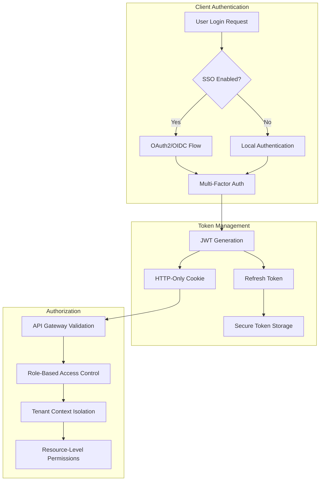

# Security Best Practices

OpenFrame implements comprehensive security measures across all layers of the application. This guide covers security architecture, implementation patterns, and best practices for developers working on the platform.

## 🎯 Security Overview

OpenFrame's security model is built on **defense in depth** principles with multiple layers of protection:

1. **Network Security**: TLS encryption, network segmentation
2. **Application Security**: Authentication, authorization, input validation  
3. **Data Security**: Encryption at rest, secure key management
4. **Infrastructure Security**: Container security, secret management
5. **Operational Security**: Monitoring, audit logging, incident response

## 🔐 Authentication & Authorization

### Authentication Flow Architecture



### JWT Token Strategy

#### Token Structure
OpenFrame uses **HTTP-only cookies** for web clients and **Bearer tokens** for API access:

```json
{
  "header": {
    "alg": "RS256",
    "typ": "JWT",
    "kid": "tenant-key-id"
  },
  "payload": {
    "iss": "openframe-auth-server",
    "sub": "user-uuid",
    "aud": ["openframe-api", "openframe-gateway"],
    "exp": 1640995200,
    "iat": 1640995200,
    "tenant_id": "tenant-uuid",
    "roles": ["admin", "user"],
    "permissions": ["devices:read", "organizations:write"],
    "session_id": "session-uuid"
  }
}
```

#### Token Lifecycle Management

**Access Token (15 minutes):**
```java
@Component
public class JwtService {
    
    public String generateAccessToken(UserPrincipal user) {
        return Jwts.builder()
            .setSubject(user.getId())
            .claim("tenant_id", user.getTenantId())
            .claim("roles", user.getRoles())
            .claim("permissions", user.getPermissions())
            .setExpiration(Date.from(Instant.now().plusSeconds(900))) // 15 minutes
            .signWith(getSigningKey(user.getTenantId()))
            .compact();
    }
}
```

**Refresh Token (7 days):**
```java
public String generateRefreshToken(UserPrincipal user) {
    return Jwts.builder()
        .setSubject(user.getId())
        .claim("type", "refresh")
        .claim("session_id", user.getSessionId())
        .setExpiration(Date.from(Instant.now().plusDays(7)))
        .signWith(getRefreshSigningKey())
        .compact();
}
```

### Multi-Tenant Security Model

#### Tenant Context Enforcement

```java
@Component
public class TenantSecurityContext {
    
    private static final ThreadLocal<String> tenantContext = new ThreadLocal<>();
    
    public static void setTenantId(String tenantId) {
        tenantContext.set(tenantId);
    }
    
    public static String getTenantId() {
        String tenantId = tenantContext.get();
        if (tenantId == null) {
            throw new SecurityException("No tenant context available");
        }
        return tenantId;
    }
    
    public static void clear() {
        tenantContext.remove();
    }
}
```

#### Data Access Security

```java
@Repository
public class OrganizationRepository {
    
    public List<Organization> findByTenant() {
        String tenantId = TenantSecurityContext.getTenantId();
        return mongoTemplate.find(
            Query.query(Criteria.where("tenantId").is(tenantId)),
            Organization.class
        );
    }
    
    public Organization save(Organization org) {
        org.setTenantId(TenantSecurityContext.getTenantId());
        return mongoTemplate.save(org);
    }
}
```

### Role-Based Access Control (RBAC)

#### Permission Matrix

| Role | Organizations | Devices | Users | Settings | API Keys |
|------|---------------|---------|-------|----------|----------|
| **Super Admin** | Full | Full | Full | Full | Full |
| **Admin** | Full | Full | Read/Write | Read | Read/Write |
| **Technician** | Read | Full | Read | None | None |
| **Viewer** | Read | Read | None | None | None |
| **API Client** | Custom | Custom | None | None | None |

#### Permission Implementation

```java
@PreAuthorize("hasPermission(#deviceId, 'Device', 'READ')")
public Device getDevice(@PathVariable String deviceId) {
    return deviceService.findById(deviceId);
}

@PreAuthorize("hasRole('ADMIN') or hasPermission(#org, 'Organization', 'WRITE')")
public Organization updateOrganization(@RequestBody Organization org) {
    return organizationService.update(org);
}
```

## 🔒 Data Security

### Encryption at Rest

#### Database Encryption

**MongoDB Configuration:**
```yaml
security:
  enableEncryption: true
  encryptionCipherMode: AES256-CBC
  encryptionKeyFile: /etc/mongodb-keyfile
```

**Sensitive Field Encryption:**
```java
@Document(collection = "api_keys")
public class ApiKey {
    @Id
    private String id;
    
    @Encrypted  // Custom annotation for field-level encryption
    private String secretKey;
    
    private String hashedKey;  // For lookup without decryption
    
    // ... other fields
}
```

#### File Storage Encryption

```java
@Service
public class EncryptionService {
    
    private final AESUtil aesUtil;
    
    public String encrypt(String data) {
        String encryptionKey = getEncryptionKey();
        return aesUtil.encrypt(data, encryptionKey);
    }
    
    public String decrypt(String encryptedData) {
        String encryptionKey = getEncryptionKey();
        return aesUtil.decrypt(encryptedData, encryptionKey);
    }
    
    private String getEncryptionKey() {
        // Key retrieved from secure vault (HashiCorp Vault, AWS KMS, etc.)
        return vaultService.getSecret("encryption-key");
    }
}
```

### Encryption in Transit

#### TLS Configuration

**Gateway Service SSL:**
```yaml
server:
  ssl:
    enabled: true
    protocol: TLS
    enabled-protocols: TLSv1.2,TLSv1.3
    ciphers: 
      - TLS_ECDHE_RSA_WITH_AES_256_GCM_SHA384
      - TLS_ECDHE_RSA_WITH_AES_128_GCM_SHA256
    key-store: classpath:keystore.jks
    key-store-password: ${SSL_KEYSTORE_PASSWORD}
    key-alias: openframe
```

**Internal Service Communication (mTLS):**
```java
@Configuration
public class ServiceMeshConfig {
    
    @Bean
    public RestTemplate secureRestTemplate() {
        SSLContext sslContext = createMTLSContext();
        HttpClient httpClient = HttpClients.custom()
            .setSSLContext(sslContext)
            .build();
            
        return new RestTemplate(new HttpComponentsClientHttpRequestFactory(httpClient));
    }
}
```

### Key Management

#### Development Environment
```bash
# Generate development keys (DO NOT use in production)
openssl genrsa -out private.pem 2048
openssl rsa -in private.pem -pubout -out public.pem

# Set environment variables
export JWT_PRIVATE_KEY=$(cat private.pem | base64 -w 0)
export JWT_PUBLIC_KEY=$(cat public.pem | base64 -w 0)
```

#### Production Key Management
```yaml
# Using HashiCorp Vault integration
vault:
  enabled: true
  uri: https://vault.yourdomain.com
  authentication: kubernetes
  kubernetes:
    role: openframe-service
    service-account-token-file: /var/run/secrets/kubernetes.io/serviceaccount/token
```

## 🛡️ Input Validation & Sanitization

### API Input Validation

#### Request Validation
```java
@RestController
@Validated
public class OrganizationController {
    
    @PostMapping("/organizations")
    public ResponseEntity<Organization> createOrganization(
            @Valid @RequestBody CreateOrganizationRequest request) {
        
        // Additional custom validation
        validateOrganizationData(request);
        
        Organization org = organizationService.create(request);
        return ResponseEntity.ok(org);
    }
    
    private void validateOrganizationData(CreateOrganizationRequest request) {
        // Domain validation
        if (!DomainValidator.isValid(request.getDomain())) {
            throw new ValidationException("Invalid domain format");
        }
        
        // Email validation
        if (!EmailValidator.isValid(request.getContactEmail())) {
            throw new ValidationException("Invalid email format");
        }
    }
}
```

#### DTO Validation Annotations
```java
public class CreateOrganizationRequest {
    
    @NotBlank(message = "Organization name is required")
    @Size(min = 2, max = 100, message = "Name must be between 2 and 100 characters")
    @Pattern(regexp = "^[a-zA-Z0-9\\s\\-_]+$", message = "Invalid characters in name")
    private String name;
    
    @NotBlank(message = "Domain is required")
    @TenantDomain  // Custom validation annotation
    private String domain;
    
    @Email(message = "Invalid email format")
    @NotBlank(message = "Contact email is required")
    private String contactEmail;
    
    // ... getters/setters
}
```

### SQL Injection Prevention

#### Parameterized Queries
```java
@Repository
public class DeviceRepository {
    
    // CORRECT: Using parameterized query
    public List<Device> findByOrganizationAndStatus(String orgId, DeviceStatus status) {
        Query query = Query.query(
            Criteria.where("organizationId").is(orgId)
                .and("status").is(status)
        );
        return mongoTemplate.find(query, Device.class);
    }
    
    // INCORRECT: Never concatenate user input
    // public List<Device> findByName(String name) {
    //     Query query = new BasicQuery("{ 'name': '" + name + "' }");  // DON'T DO THIS
    //     return mongoTemplate.find(query, Device.class);
    // }
}
```

### Cross-Site Scripting (XSS) Prevention

#### Output Encoding
```java
@Component
public class SecurityUtils {
    
    private static final PolicyFactory POLICY = Sanitizers.FORMATTING
        .and(Sanitizers.LINKS)
        .and(Sanitizers.BLOCKS);
    
    public String sanitizeHtml(String input) {
        if (input == null) return null;
        return POLICY.sanitize(input);
    }
    
    public String escapeHtml(String input) {
        if (input == null) return null;
        return StringEscapeUtils.escapeHtml4(input);
    }
}
```

#### Content Security Policy
```java
@Configuration
public class SecurityHeadersConfig {
    
    @Bean
    public FilterRegistrationBean<SecurityHeadersFilter> securityHeadersFilter() {
        FilterRegistrationBean<SecurityHeadersFilter> registration = new FilterRegistrationBean<>();
        registration.setFilter(new SecurityHeadersFilter());
        registration.addUrlPatterns("/*");
        registration.setOrder(Ordered.HIGHEST_PRECEDENCE);
        return registration;
    }
    
    static class SecurityHeadersFilter implements Filter {
        @Override
        public void doFilter(ServletRequest request, ServletResponse response, FilterChain chain) {
            HttpServletResponse httpResponse = (HttpServletResponse) response;
            
            // Content Security Policy
            httpResponse.setHeader("Content-Security-Policy", 
                "default-src 'self'; " +
                "script-src 'self' 'unsafe-inline'; " +
                "style-src 'self' 'unsafe-inline'; " +
                "img-src 'self' data: https:; " +
                "font-src 'self' data:; " +
                "connect-src 'self' wss: ws:;");
            
            // Other security headers
            httpResponse.setHeader("X-Content-Type-Options", "nosniff");
            httpResponse.setHeader("X-Frame-Options", "DENY");
            httpResponse.setHeader("X-XSS-Protection", "1; mode=block");
            httpResponse.setHeader("Strict-Transport-Security", "max-age=31536000; includeSubDomains");
            
            chain.doFilter(request, response);
        }
    }
}
```

## 🔥 API Security

### Rate Limiting

#### Redis-Based Rate Limiting
```java
@Component
public class RateLimitService {
    
    private final RedisTemplate<String, String> redisTemplate;
    
    public boolean isAllowed(String key, int maxRequests, Duration window) {
        String redisKey = "rate_limit:" + key;
        String windowStart = String.valueOf(Instant.now().truncatedTo(ChronoUnit.SECONDS).toEpochMilli());
        
        // Sliding window rate limiting
        redisTemplate.opsForZSet().removeRangeByScore(redisKey, 
            0, Instant.now().minus(window).toEpochMilli());
        
        Long currentCount = redisTemplate.opsForZSet().count(redisKey, 0, Double.MAX_VALUE);
        
        if (currentCount >= maxRequests) {
            return false;
        }
        
        redisTemplate.opsForZSet().add(redisKey, UUID.randomUUID().toString(), 
            Instant.now().toEpochMilli());
        redisTemplate.expire(redisKey, window);
        
        return true;
    }
}
```

#### Rate Limiting Configuration
```java
@Component
public class RateLimitFilter implements Filter {
    
    private final RateLimitService rateLimitService;
    
    @Value("${app.rate-limit.requests-per-minute:60}")
    private int requestsPerMinute;
    
    @Override
    public void doFilter(ServletRequest request, ServletResponse response, FilterChain chain) {
        HttpServletRequest httpRequest = (HttpServletRequest) request;
        String clientIp = getClientIP(httpRequest);
        String apiKey = httpRequest.getHeader("X-API-Key");
        
        String rateLimitKey = apiKey != null ? "api_key:" + apiKey : "ip:" + clientIp;
        
        if (!rateLimitService.isAllowed(rateLimitKey, requestsPerMinute, Duration.ofMinutes(1))) {
            HttpServletResponse httpResponse = (HttpServletResponse) response;
            httpResponse.setStatus(HttpStatus.TOO_MANY_REQUESTS.value());
            return;
        }
        
        chain.doFilter(request, response);
    }
}
```

### API Key Security

#### API Key Generation
```java
@Service
public class ApiKeyService {
    
    public ApiKeyResponse generateApiKey(String name, Set<Permission> permissions) {
        // Generate cryptographically secure key
        String keyId = "ak_" + generateSecureId(16);
        String secretKey = "sk_" + generateSecureId(32);
        String hashedKey = hashApiKey(secretKey);
        
        ApiKey apiKey = new ApiKey();
        apiKey.setKeyId(keyId);
        apiKey.setHashedKey(hashedKey);
        apiKey.setName(name);
        apiKey.setPermissions(permissions);
        apiKey.setTenantId(TenantSecurityContext.getTenantId());
        apiKey.setCreatedAt(Instant.now());
        
        apiKeyRepository.save(apiKey);
        
        // Return the full key only once
        return new ApiKeyResponse(keyId + "." + secretKey, permissions);
    }
    
    private String generateSecureId(int length) {
        SecureRandom random = new SecureRandom();
        return random.ints(length, 0, 62)
            .mapToObj(i -> "abcdefghijklmnopqrstuvwxyzABCDEFGHIJKLMNOPQRSTUVWXYZ0123456789".charAt(i))
            .collect(StringBuilder::new, StringBuilder::append, StringBuilder::append)
            .toString();
    }
}
```

#### API Key Validation
```java
@Component
public class ApiKeyAuthenticationFilter extends OncePerRequestFilter {
    
    @Override
    protected void doFilterInternal(HttpServletRequest request, HttpServletResponse response, 
            FilterChain filterChain) throws ServletException, IOException {
        
        String apiKey = extractApiKey(request);
        if (apiKey != null) {
            try {
                validateAndSetAuthentication(apiKey);
            } catch (AuthenticationException e) {
                response.setStatus(HttpStatus.UNAUTHORIZED.value());
                return;
            }
        }
        
        filterChain.doFilter(request, response);
    }
    
    private void validateAndSetAuthentication(String apiKey) {
        String[] parts = apiKey.split("\\.", 2);
        if (parts.length != 2) {
            throw new BadCredentialsException("Invalid API key format");
        }
        
        String keyId = parts[0];
        String secretKey = parts[1];
        
        ApiKey storedKey = apiKeyRepository.findByKeyId(keyId)
            .orElseThrow(() -> new BadCredentialsException("Invalid API key"));
        
        if (!passwordEncoder.matches(secretKey, storedKey.getHashedKey())) {
            throw new BadCredentialsException("Invalid API key");
        }
        
        // Set authentication context
        ApiKeyAuthenticationToken auth = new ApiKeyAuthenticationToken(
            storedKey.getKeyId(), storedKey.getPermissions(), storedKey.getTenantId());
        SecurityContextHolder.getContext().setAuthentication(auth);
    }
}
```

## 🛠️ Secrets Management

### Environment Variables for Development

**Never commit secrets to version control:**

```bash
# .env (for local development only)
MONGODB_PASSWORD=dev-password-123
REDIS_PASSWORD=dev-redis-456
JWT_SECRET=development-jwt-secret-must-be-32-chars-minimum
ENCRYPTION_KEY=dev-encryption-key-32-chars-long
OPENAI_API_KEY=sk-dev-openai-key
```

### Production Secret Management

#### HashiCorp Vault Integration
```java
@Configuration
@ConditionalOnProperty(value = "vault.enabled", havingValue = "true")
public class VaultConfig {
    
    @Bean
    public VaultTemplate vaultTemplate() {
        VaultEndpoint endpoint = VaultEndpoint.create(vaultUri.getHost(), vaultUri.getPort());
        endpoint.setScheme(vaultUri.getScheme());
        
        ClientAuthentication auth = new KubernetesAuthentication(
            kubernetesProperties.getRole(),
            Paths.get(kubernetesProperties.getServiceAccountTokenFile())
        );
        
        return new VaultTemplate(endpoint, auth);
    }
}
```

#### Kubernetes Secrets
```yaml
apiVersion: v1
kind: Secret
metadata:
  name: openframe-secrets
  namespace: openframe
type: Opaque
data:
  mongodb-password: <base64-encoded-password>
  redis-password: <base64-encoded-password>
  jwt-private-key: <base64-encoded-private-key>
  encryption-key: <base64-encoded-encryption-key>
```

### Secret Rotation Strategy

```java
@Service
public class SecretRotationService {
    
    @Scheduled(cron = "0 0 2 * * SUN")  // Every Sunday at 2 AM
    public void rotateJwtKeys() {
        // Generate new key pair
        KeyPair newKeyPair = keyGenerator.generateKeyPair();
        
        // Store new keys with version
        String version = String.valueOf(Instant.now().getEpochSecond());
        vaultService.storeSecret("jwt-private-key-" + version, newKeyPair.getPrivate());
        vaultService.storeSecret("jwt-public-key-" + version, newKeyPair.getPublic());
        
        // Update current version pointer
        vaultService.storeSecret("jwt-current-version", version);
        
        // Schedule cleanup of old keys (keep 2 versions)
        scheduleKeyCleanup(version);
    }
}
```

## 🔍 Security Monitoring & Audit

### Audit Logging

#### Security Event Logging
```java
@Component
public class SecurityAuditLogger {
    
    private static final Logger AUDIT_LOGGER = LoggerFactory.getLogger("SECURITY_AUDIT");
    
    public void logAuthenticationSuccess(String userId, String tenantId, String source) {
        auditLog(AuditEvent.builder()
            .eventType("AUTHENTICATION_SUCCESS")
            .userId(userId)
            .tenantId(tenantId)
            .source(source)
            .timestamp(Instant.now())
            .build());
    }
    
    public void logAuthenticationFailure(String username, String reason, String clientIp) {
        auditLog(AuditEvent.builder()
            .eventType("AUTHENTICATION_FAILURE")
            .username(username)
            .reason(reason)
            .clientIp(clientIp)
            .timestamp(Instant.now())
            .build());
    }
    
    public void logPrivilegedOperation(String userId, String operation, String resource) {
        auditLog(AuditEvent.builder()
            .eventType("PRIVILEGED_OPERATION")
            .userId(userId)
            .operation(operation)
            .resource(resource)
            .timestamp(Instant.now())
            .build());
    }
    
    private void auditLog(AuditEvent event) {
        AUDIT_LOGGER.info(JsonUtils.toJson(event));
        
        // Also send to centralized audit system
        auditEventPublisher.publishEvent(event);
    }
}
```

### Intrusion Detection

#### Failed Login Monitoring
```java
@Service
public class IntrusionDetectionService {
    
    private final RedisTemplate<String, String> redisTemplate;
    
    @EventListener
    public void handleAuthenticationFailure(AuthenticationFailureEvent event) {
        String clientIp = getClientIp(event);
        String key = "failed_logins:" + clientIp;
        
        Long failures = redisTemplate.opsForValue().increment(key);
        redisTemplate.expire(key, Duration.ofHours(1));
        
        if (failures > 5) {
            // Block IP temporarily
            blockIpAddress(clientIp, Duration.ofHours(1));
            
            // Send security alert
            securityAlertService.sendAlert(
                "Potential brute force attack from IP: " + clientIp);
        }
    }
}
```

## 📋 Security Testing

### Security Test Examples

#### Authentication Tests
```java
@Test
public void testJwtTokenValidation() {
    // Test valid token
    String validToken = jwtService.generateAccessToken(testUser);
    UserPrincipal principal = jwtService.validateToken(validToken);
    assertThat(principal.getId()).isEqualTo(testUser.getId());
    
    // Test expired token
    String expiredToken = createExpiredToken(testUser);
    assertThatThrownBy(() -> jwtService.validateToken(expiredToken))
        .isInstanceOf(TokenExpiredException.class);
    
    // Test tampered token
    String tamperedToken = validToken.substring(0, validToken.length() - 10) + "tampered123";
    assertThatThrownBy(() -> jwtService.validateToken(tamperedToken))
        .isInstanceOf(SignatureException.class);
}
```

#### Authorization Tests
```java
@Test
public void testTenantIsolation() {
    // Set tenant A context
    TenantSecurityContext.setTenantId("tenant-a");
    
    // Create organization for tenant A
    Organization orgA = organizationService.create(createOrgRequest("Org A"));
    
    // Switch to tenant B context
    TenantSecurityContext.setTenantId("tenant-b");
    
    // Verify tenant B cannot access tenant A's organization
    assertThatThrownBy(() -> organizationService.getById(orgA.getId()))
        .isInstanceOf(AccessDeniedException.class);
}
```

### Penetration Testing Checklist

#### OWASP Top 10 Coverage
- [ ] **A01 - Broken Access Control**: RBAC implementation, tenant isolation
- [ ] **A02 - Cryptographic Failures**: Encryption at rest/transit, key management
- [ ] **A03 - Injection**: Input validation, parameterized queries
- [ ] **A04 - Insecure Design**: Security architecture review
- [ ] **A05 - Security Misconfiguration**: Default credentials, error handling
- [ ] **A06 - Vulnerable Components**: Dependency scanning, updates
- [ ] **A07 - Authentication Failures**: JWT security, session management
- [ ] **A08 - Software Integrity Failures**: Code signing, secure updates
- [ ] **A09 - Logging Failures**: Security event logging, monitoring
- [ ] **A10 - Server-Side Request Forgery**: URL validation, network controls

## 🚨 Incident Response

### Security Incident Playbook

#### 1. Detection & Assessment
```bash
# Check for suspicious activity
grep "AUTHENTICATION_FAILURE" /var/log/openframe/audit.log | tail -100

# Monitor failed login attempts
redis-cli --eval scripts/get-failed-logins.lua

# Check API key usage patterns
kubectl exec -it mongodb-0 -- mongosh --eval "
  db.api_key_usage.aggregate([
    {$match: {timestamp: {$gte: new Date(Date.now() - 3600000)}}},
    {$group: {_id: '$api_key_id', count: {$sum: 1}}},
    {$sort: {count: -1}}
  ])"
```

#### 2. Immediate Response
```bash
# Block suspicious IP addresses
redis-cli SADD blocked_ips "192.168.1.100"

# Disable compromised API key
curl -X DELETE -H "Authorization: Bearer ADMIN_TOKEN" \
  http://localhost:8080/api/v1/api-keys/COMPROMISED_KEY_ID

# Force password reset for affected users
kubectl exec -it openframe-api-0 -- java -jar app.jar \
  --spring.profiles.active=cli \
  --command="force-password-reset" \
  --user-ids="user1,user2,user3"
```

#### 3. Investigation & Recovery
- Review audit logs for extent of compromise
- Check data access patterns and potential data exfiltration
- Verify system integrity and check for backdoors
- Rotate all potentially compromised credentials
- Update security policies and controls as needed

## 📚 Security Resources

### Internal Documentation
- **[Environment Setup](../setup/environment.md)**: Secure development environment configuration
- **[Architecture Overview](../architecture/README.md)**: Security architecture components

### External Security Standards
- **OWASP Application Security**: [https://owasp.org/www-project-top-ten/](https://owasp.org/www-project-top-ten/)
- **NIST Cybersecurity Framework**: [https://www.nist.gov/cyberframework](https://www.nist.gov/cyberframework)
- **OAuth 2.1 Security**: [https://datatracker.ietf.org/doc/html/draft-ietf-oauth-security-topics](https://datatracker.ietf.org/doc/html/draft-ietf-oauth-security-topics)
- **JWT Security Best Practices**: [https://datatracker.ietf.org/doc/html/rfc8725](https://datatracker.ietf.org/doc/html/rfc8725)

### Security Tools & Libraries
- **Spring Security**: Framework security implementation
- **OWASP Java HTML Sanitizer**: XSS prevention
- **Bouncy Castle**: Cryptographic operations
- **HashiCorp Vault**: Secret management
- **OWASP ZAP**: Security testing automation

---

**Security is everyone's responsibility.** When in doubt, always choose the more secure approach and consult with the security team. Continue to [Testing Overview](../testing/README.md) to learn how to test these security implementations.