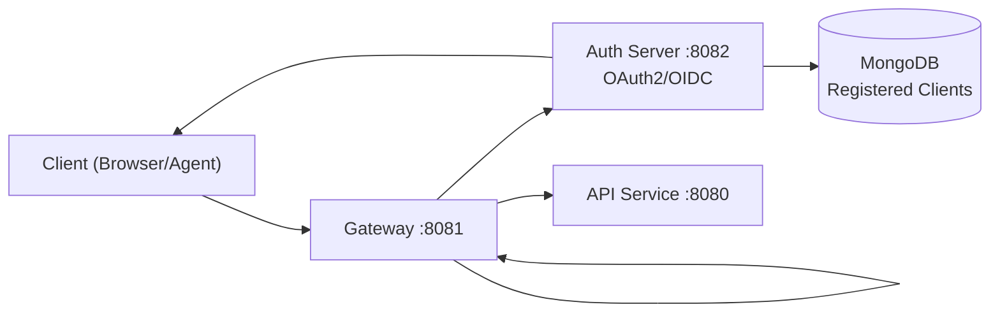

# Security Best Practices

This guide covers the security architecture, authentication patterns, secrets management, and security guidelines for developing with OpenFrame OSS Tenant.

---

## Authentication and Authorization Architecture

### Multi-Tenant OAuth2/OIDC

OpenFrame uses the Spring Authorization Server to provide per-tenant OAuth2/OIDC. Every tenant has its own OAuth2 client stored in MongoDB, and all JWTs are RSA-signed with a per-tenant key pair.



**Key security properties:**
- Each tenant has a unique RSA key pair (`TenantKeyService`) stored in MongoDB
- The Authorization Server issues JWTs signed with the tenant's RSA private key
- The Gateway validates JWTs using the tenant's public key via `IssuerUrlProvider`
- All tokens include `tenant_id`, `machine_id` (for agents), and standard OIDC claims

### JWT Validation in the Gateway

The Gateway (`openframe-gateway-service-core`) validates all incoming JWTs before forwarding requests:

- Verifies RSA signature against the tenant-specific issuer URL
- Extracts `X-Tenant-Id` and `X-Machine-Id` headers and forwards them to backend services
- Rejects requests with invalid or expired tokens with a `401 Unauthorized`

### Tenant Isolation in API Services

All API service data queries enforce tenant scoping via `TenantAwareMongoTemplate`. The tenant ID is read from the JWT claim and applied as a mandatory filter on every MongoDB query — it is not possible to access data from another tenant.

---

## Agent Authentication (Rust Client)

The `openframe-client` Rust agent uses the OAuth2 Client Credentials flow:

1. **Initial Registration:** The agent POSTs to `/clients/api/agents/register` using a pre-shared `X-Initial-Key` (the agent registration secret). MongoDB stores the new machine record and returns `{machineId, clientId, clientSecret}`.
2. **Token Exchange:** The agent exchanges its `clientId` and `clientSecret` for a JWT via `POST /clients/oauth/token` (Client Credentials grant).
3. **Token Refresh:** The `TokenRefreshRunManager` service automatically refreshes tokens before expiry.
4. **NATS:** All subsequent communication uses NATS JetStream with the JWT for authorization.

> **Security principle:** The initial key (`X-Initial-Key` / Agent Registration Secret) is single-use and should be rotated after successful registration. It is managed by `AgentRegistrationSecretService`.

---

## Data Encryption

### Token Encryption in openframe-chat

The Tauri desktop app receives authentication tokens encrypted with **AES-256-GCM**. The `TokenDecryptionService` in the Tauri Rust backend decrypts the token before passing it to the React frontend via IPC. The encryption secret is provisioned by the platform, never stored in the app bundle.

### Secrets at Rest

Sensitive credentials (tool API keys, OAuth2 client secrets) stored in MongoDB are encrypted using the `EncryptionService` from `openframe-core-crypto`. The encryption key is provided through secure environment configuration — never hardcoded.

---

## Input Validation and Sanitization

### Bean Validation (Spring Boot)

All REST and GraphQL inputs use Java Bean Validation (`@Valid`, `@NotBlank`, `@ValidEmail`, `@TenantDomain`). Custom validators include:

| Validator | Purpose |
|---|---|
| `@ValidEmail` / `ValidEmailValidator` | Validates email format; optionally checks against disposable domain lists |
| `@TenantDomain` / `TenantDomainValidator` | Validates tenant domain slug format |

### GraphQL Input Validation

GraphQL mutations validate inputs through DGS data fetchers before passing to service layer. All GraphQL errors are returned via `GraphQLExceptionHandler` and `GlobalExceptionHandler`.

### TypeScript / Frontend

The `openframe-chat` frontend uses typed GraphQL queries/mutations (via `graphql-request`) which prevents injection of arbitrary query structures. User input is never interpolated directly into query strings.

---

## Common Security Vulnerabilities and Mitigations

| Vulnerability | Mitigation in OpenFrame |
|---|---|
| **Cross-Tenant Data Leakage** | `TenantAwareMongoTemplate` enforces tenant scoping on all DB queries; JWT `tenant_id` claim is verified at the Gateway |
| **JWT Forgery** | Per-tenant RSA-2048 key pairs; Gateway validates issuer URL and signature before forwarding |
| **Replay Attacks** | JWTs have short expiry; refresh token rotation via `RefreshTokenGenerator` |
| **CSRF** | APIs use Authorization header Bearer tokens (not cookies for API calls); CORS restricted via `CorsConfig` |
| **API Key Leakage** | API keys stored encrypted in MongoDB; key stats tracked separately; rate limiting applied in Gateway via `RateLimitService` |
| **Script Injection (RMM)** | Script arguments are tokenized by `ScriptArgsTokenizer` before dispatch; not shell-interpolated |
| **Open Redirect** | OAuth2 redirect targets validated by `DefaultRedirectTargetResolver` against an allowlist |
| **WebSocket Hijacking** | Gateway's `WebSocketServiceSecurityDecorator` enforces JWT validation for WebSocket upgrades |

---

## Environment Variables and Secrets Management

### Principles

1. **Never hardcode secrets** in source code or commit them to the repository
2. **Use environment variables** for all sensitive configuration values
3. **Use Kubernetes Secrets** (or equivalent) for production deployments
4. **Rotate regularly** — especially the Agent Registration Secret and OAuth2 client secrets

### Key Secrets to Protect

| Secret | Used By | Notes |
|---|---|---|
| MongoDB connection URI | All Spring Boot services | Contains credentials |
| Agent Registration Secret | openframe-client, Management Service | Single-use per agent; rotate after registration |
| OAuth2 client secrets | Authorization Server, API clients | Stored encrypted in MongoDB |
| RSA key pairs (per tenant) | Authorization Server | Generated automatically; stored in MongoDB encrypted |
| AES-256-GCM encryption key | openframe-chat (Tauri) | Provisioned at deployment; never bundled in app |
| API keys | External API consumers | Stored encrypted; hashed for validation |

### Local Development

For local development, use a `.env` file or export variables in your shell. **Never commit `.env` files.**

```bash
# Example local development environment variables
export SPRING_DATA_MONGODB_URI="mongodb://localhost:27017/openframe_dev"
export OPENFRAME_ENCRYPTION_KEY="local-dev-key-not-for-production"
```

Add `.env` to your `.gitignore`:

```text
# .gitignore
.env
*.env
.env.local
```

---

## Security Testing and Code Review

### What to Review for Security

When reviewing PRs, pay attention to:

1. **New REST/GraphQL endpoints** — Verify `@PreAuthorize` or equivalent tenant checks are applied
2. **MongoDB queries** — All queries must go through `TenantAwareMongoTemplate` or equivalent scoping
3. **User input handling** — Validate with `@Valid` and custom validators; never pass raw input to queries
4. **New environment variables** — Document in the service's README; never provide actual production values in docs
5. **Dependency updates** — Check for known CVEs in updated dependencies

### Running Security-Related Tests

```bash
# Run Spring Security integration tests
mvn test -pl openframe/services/openframe-api -Dtest="*SecurityTest,*AuthTest"

# Run all tests including security tests
mvn test
```

---

## SSO Integration

OpenFrame supports SSO via Google and Microsoft OIDC through the Authorization Server:

- `GoogleClientRegistrationStrategy` — Handles Google OAuth2 client registration
- `MicrosoftClientRegistrationStrategy` — Handles Microsoft Azure AD integration
- `SsoAuthorizationRequestResolver` — Customizes OIDC authorization requests per provider
- `SSOConfigService` — Manages per-tenant SSO configuration stored in MongoDB

SSO provider credentials (Client ID, Client Secret) are stored encrypted in MongoDB's `SSOConfig` collection, never in configuration files.

---

## Reporting Security Issues

Security issues should be reported through the **OpenMSP Slack community** (not through public GitHub issues):

- **Join:** [https://www.openmsp.ai/](https://www.openmsp.ai/)
- **Invite:** [Join Slack](https://join.slack.com/t/openmsp/shared_invite/zt-36bl7mx0h-3~U2nFH6nqHqoTPXMaHEHA)
